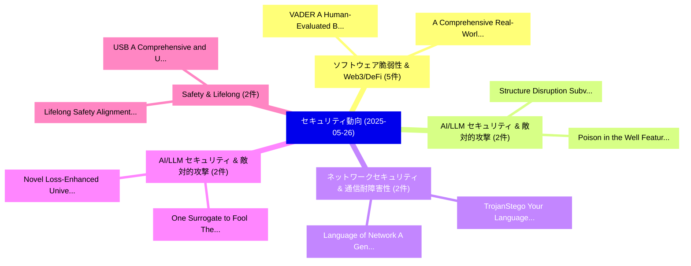

# 📅 02_daily: 日次エグゼクティブサマリー報告書 (2025-05-26)

**集計日時**: 2026-10-02 23:05:27 UTC  
**対象日付**: 2025-05-26  
**本日収集論文数**: 31 件  

---

## 💡 主要セキュリティ動向・脅威インサイト (Executive Insights)

本日の収集論文（計 31 件）において、以下の重点セキュリティ領域で活発な研究動向が確認されました：
- **ソフトウェア脆弱性 & Web3/DeFi** (5 件): 注目論文として 「VADER: A Human-Evaluated Bench...」、「A Comprehensive Real-World Ass...」 等が発表され、実務防御および攻撃検証の進展が見られます。
- **AI/LLM セキュリティ & 敵対的攻撃** (2 件): 注目論文として 「Structure Disruption: Subverti...」、「Poison in the Well: Feature Em...」 等が発表され、実務防御および攻撃検証の進展が見られます。
- **ネットワークセキュリティ & 通信耐障害性** (2 件): 注目論文として 「Language of Network: A Generat...」、「TrojanStego: Your Language Mod...」 等が発表され、実務防御および攻撃検証の進展が見られます。
- **AI/LLM セキュリティ & 敵対的攻撃** (2 件): 注目論文として 「One Surrogate to Fool Them All...」、「Novel Loss-Enhanced Universal ...」 等が発表され、実務防御および攻撃検証の進展が見られます。
- **Safety & Lifelong** (2 件): 注目論文として 「Lifelong Safety Alignment for ...」、「USB: A Comprehensive and Unifi...」 等が発表され、実務防御および攻撃検証の進展が見られます。

### 🗺️ 技術・脅威トピックマインドマップ

---

## 📌 日次セキュリティ論文一覧 (日本語表形式)

| No | arXiv ID | 論文タイトル (日本語訳) | 重要キーワード | 構造化エグゼクティブ要約 (背景・提案・影響) | 脅威分類 | 詳細リンク |
|---|---|---|---|---|---|---|
| 1 | `2505.19395v1` | [VADER: A Human-Evaluated Benchmark for Vulnerability Assessment, Detection, Explanation, and Remediation（セキュリティ分析論文）](../../okf/papers/2025-05-26/2505.19395.md) | `Human-Evaluated Benchmark`, `Vulnerability Assessment`, `Austin Wang` | 【提案】概要 (Overview & Key Finding) 本論文「VADER: A Human-Evaluated Benchmark for 脆弱性 Assessment, ...。実証評価により経営層・セキュリティ管理者向け推奨アクション (E... | `cs.CR` | [arXiv](https://arxiv.org/abs/2505.19395v1) &#124; [OKF](../../okf/papers/2025-05-26/2505.19395.md) |
| 2 | `2505.19405v1` | [CoTGuard: Using Chain-of-Thought Triggering for Copyright Protection in Multi-Agent LLM Systems（セキュリティ分析論文）](../../okf/papers/2025-05-26/2505.19405.md) | `Using Chain`, `Thought Triggering`, `Copyright Protection` | 【提案】概要 (Overview & Key Finding) 本論文「CoTGuard: Using Chain-of-Thought Triggering for Copyrig...。実証評価により経営層・セキュリティ管理者向け推奨アクション (E... | `cs.CR` | [arXiv](https://arxiv.org/abs/2505.19405v1) &#124; [OKF](../../okf/papers/2025-05-26/2505.19405.md) |
| 3 | `2505.19425v1` | [Structure Disruption: Subverting Malicious Diffusion-Based Inpainting via Self-Attention Query Perturbation（セキュリティ分析論文）](../../okf/papers/2025-05-26/2505.19425.md) | `Subverting Malicious Diffusion`, `Attention Query Perturbation`, `Structure Disruption` | 【提案】概要 (Overview & Key Finding) 本論文「Structure Disruption: Subverting Malicious Diffusion-Ba...。実証評価により経営層・セキュリティ管理者向け推奨アクション (E... | `cs.CR` | [arXiv](https://arxiv.org/abs/2505.19425v1) &#124; [OKF](../../okf/papers/2025-05-26/2505.19425.md) |
| 4 | `2505.19456v1` | [JavaScript Inclusion Security Issues in Chrome Extensionsの実証研究](../../okf/papers/2025-05-26/2505.19456.md) | `Inclusion Security Issues`, `Chrome Extensions`, `Chong Guan` | 【提案】概要 (Overview & Key Finding) 本論文「JavaScript Inclusion Security Issues in Chrome Extensio...。実証評価により経営層・セキュリティ管理者向け推奨アクション (E... | `cs.CR` | [arXiv](https://arxiv.org/abs/2505.19456v1) &#124; [OKF](../../okf/papers/2025-05-26/2505.19456.md) |
| 5 | `2505.19482v1` | [Language of Network: A Generative Pre-trained Model for Encrypted Traffic Comprehension（セキュリティ分析論文）](../../okf/papers/2025-05-26/2505.19482.md) | `Encrypted Traffic Comprehension`, `Generative Pre`, `Pre-trained Model` | 【提案】概要 (Overview & Key Finding) 本論文「Language of Network: A Generative Pre-trained Model for...。実証評価により経営層・セキュリティ管理者向け推奨アクション (E... | `cs.CR` | [arXiv](https://arxiv.org/abs/2505.19482v1) &#124; [OKF](../../okf/papers/2025-05-26/2505.19482.md) |
| 6 | `2505.19633v2` | [Weak-Jamming Detection in IEEE 802.11 Networks: Techniques, Scenarios and Mobility（セキュリティ分析論文）](../../okf/papers/2025-05-26/2505.19633.md) | `Jamming Detection`, `Weak-Jamming Detection`, `Martijn Hanegraaf` | 【提案】概要 (Overview & Key Finding) 本論文「Weak-Jamming Detection in IEEE 802.11 Networks: Techniq...。実証評価により経営層・セキュリティ管理者向け推奨アクション (E... | `cs.CR` | [arXiv](https://arxiv.org/abs/2505.19633v2) &#124; [OKF](../../okf/papers/2025-05-26/2505.19633.md) |
| 7 | `2505.19644v3` | [STOPA: A Database of Systematic VariaTion Of DeePfake Audio for Open-Set Source Tracing and Attribution（セキュリティ分析論文）](../../okf/papers/2025-05-26/2505.19644.md) | `Set Source Tracing`, `Open-Set Source`, `Vishwanath Pratap Singh` | 【提案】概要 (Overview & Key Finding) 本論文「STOPA: A Database of Systematic VariaTion Of DeePfake A...。実証評価により経営層・セキュリティ管理者向け推奨アクション (E... | `cs.CR` | [arXiv](https://arxiv.org/abs/2505.19644v3) &#124; [OKF](../../okf/papers/2025-05-26/2505.19644.md) |
| 8 | `2505.19663v2` | [A Comprehensive Real-World Assessment of Audio Watermarking Algorithms: Will They Survive Neural Codecs?（セキュリティ分析論文）](../../okf/papers/2025-05-26/2505.19663.md) | `Audio Watermarking Algorithms`, `Comprehensive Real`, `World Assessment` | 【提案】### (日本語題名: A Comprehensive Real-World Assessment of Audio Watermarking Algorithms: Wil...。実証評価により経営層・セキュリティ管理者向け推奨アクション (E... | `cs.CR` | [arXiv](https://arxiv.org/abs/2505.19663v2) &#124; [OKF](../../okf/papers/2025-05-26/2505.19663.md) |
| 9 | `2505.19773v1` | [What Really Matters in Many-Shot Attacks? Long-Context Vulnerabilities in LLMsの実証研究](../../okf/papers/2025-05-26/2505.19773.md) | `Shot Attacks`, `Context Vulnerabilities`, `Many-Shot Attacks` | 【提案】An Empirical Study of Long-Context Vulnerabilities in LLMs ### (日本語題名: What Really Matt...。実証評価により経営層・セキュリティ管理者向け推奨アクション (E... | `cs.CR` | [arXiv](https://arxiv.org/abs/2505.19773v1) &#124; [OKF](../../okf/papers/2025-05-26/2505.19773.md) |
| 10 | `2505.19821v1` | [Poison in the Well: Feature Embedding Disruption in Backdoor Attacks（セキュリティ分析論文）](../../okf/papers/2025-05-26/2505.19821.md) | `Feature Embedding Disruption`, `Backdoor Attacks`, `Zhou Feng` | 【提案】概要 (Overview & Key Finding) 本論文「Poison in the Well: Feature Embedding Disruption in Bac...。実証評価により経営層・セキュリティ管理者向け推奨アクション (E... | `cs.CR` | [arXiv](https://arxiv.org/abs/2505.19821v1) &#124; [OKF](../../okf/papers/2025-05-26/2505.19821.md) |
| 11 | `2505.19840v3` | [One Surrogate to Fool Them All: Universal, Transferable, and Targeted Adversarial Attacks with CLIP（セキュリティ分析論文）](../../okf/papers/2025-05-26/2505.19840.md) | `Targeted Adversarial Attacks`, `One Surrogate`, `Binyan Xu` | 【提案】概要 (Overview & Key Finding) 本論文「One Surrogate to Fool Them All: Universal, Transferable...。実証評価により経営層・セキュリティ管理者向け推奨アクション (E... | `cs.CR` | [arXiv](https://arxiv.org/abs/2505.19840v3) &#124; [OKF](../../okf/papers/2025-05-26/2505.19840.md) |
| 12 | `2505.19864v1` | [CPA-RAG:Covert Poisoning Attacks on Retrieval-Augmented Generation in 大規模言語モデル](../../okf/papers/2025-05-26/2505.19864.md) | `Covert Poisoning Attacks`, `Augmented Generation`, `Retrieval-Augmented Generation` | 【提案】概要 (Overview & Key Finding) 本論文「CPA-RAG:Covert Poisoning Attacks on Retrieval-Augmented...。実証評価により経営層・セキュリティ管理者向け推奨アクション (E... | `cs.CR` | [arXiv](https://arxiv.org/abs/2505.19864v1) &#124; [OKF](../../okf/papers/2025-05-26/2505.19864.md) |
| 13 | `2505.19887v2` | [Deconstructing Obfuscation: A four-dimensional framework for evaluating 大規模言語モデル assembly code deobfuscation capabilities](../../okf/papers/2025-05-26/2505.19887.md) | `Deconstructing Obfuscation`, `Large Language Models`, `Anton Tkachenko` | 【提案】概要 (Overview & Key Finding) 本論文「Deconstructing Obfuscation: A four-dimensional framewor...。実証評価により経営層・セキュリティ管理者向け推奨アクション (E... | `cs.CR` | [arXiv](https://arxiv.org/abs/2505.19887v2) &#124; [OKF](../../okf/papers/2025-05-26/2505.19887.md) |
| 14 | `2505.19915v2` | [Evaluating AI cyber capabilities with crowdsourced elicitation（セキュリティ分析論文）](../../okf/papers/2025-05-26/2505.19915.md) | `Artem Petrov`, `Dmitrii Volkov`, `Raw Meta` | 【提案】概要 (Overview & Key Finding) 本論文「Evaluating AI cyber capabilities with crowdsourced elic...。実証評価により経営層・セキュリティ管理者向け推奨アクション (E... | `cs.CR` | [arXiv](https://arxiv.org/abs/2505.19915v2) &#124; [OKF](../../okf/papers/2025-05-26/2505.19915.md) |
| 15 | `2505.19951v1` | [Novel Loss-Enhanced Universal Adversarial Patches for Sustainable Speaker Privacy（セキュリティ分析論文）](../../okf/papers/2025-05-26/2505.19951.md) | `Enhanced Universal Adversarial Patches`, `Sustainable Speaker Privacy`, `Loss-Enhanced Universal` | 【提案】概要 (Overview & Key Finding) 本論文「Novel Loss-Enhanced Universal Adversarial Patches for S...。実証評価により経営層・セキュリティ管理者向け推奨アクション (E... | `cs.CR` | [arXiv](https://arxiv.org/abs/2505.19951v1) &#124; [OKF](../../okf/papers/2025-05-26/2505.19951.md) |
| 16 | `2505.19969v3` | [Differential Privacy Decentralized Gossip Averaging under Varying Threat Modelsの分析](../../okf/papers/2025-05-26/2505.19969.md) | `Differential Privacy Decentralized Gossip Averaging`, `Decentralized Gossip Averaging`, `Varying Threat Models` | 【提案】概要 (Overview & Key Finding) 本論文「差分プライバシー Decentralized Gossip Averaging under Varying 脅...。実証評価により経営層・セキュリティ管理者向け推奨アクション (E... | `cs.CR` | [arXiv](https://arxiv.org/abs/2505.19969v3) &#124; [OKF](../../okf/papers/2025-05-26/2505.19969.md) |
| 17 | `2505.19973v1` | [DFIR-Metric: A Benchmark Dataset for Evaluating 大規模言語モデル in Digital Forensics and Incident Response](../../okf/papers/2025-05-26/2505.19973.md) | `Benchmark Dataset`, `Digital Forensics`, `Incident Response` | 【提案】概要 (Overview & Key Finding) 本論文「DFIR-Metric: A Benchmark Dataset for Evaluating 大規模言語モデ...。実証評価により経営層・セキュリティ管理者向け推奨アクション (E... | `cs.CR` | [arXiv](https://arxiv.org/abs/2505.19973v1) &#124; [OKF](../../okf/papers/2025-05-26/2505.19973.md) |
| 18 | `2505.20098v2` | [Transformers in Protein: A Survey（セキュリティ分析論文）](../../okf/papers/2025-05-26/2505.20098.md) | `Xiaowen Ling`, `Zhiqiang Li`, `Yanbin Wang` | 【提案】概要 (Overview & Key Finding) 本論文「Transformers in Protein: A Survey（セキュリティ分析論文）」（原題: Tran...。実証評価により経営層・セキュリティ管理者向け推奨アクション (E... | `cs.CR` | [arXiv](https://arxiv.org/abs/2505.20098v2) &#124; [OKF](../../okf/papers/2025-05-26/2505.20098.md) |
| 19 | `2505.20118v4` | [TrojanStego: Your Language Model Can Secretly Be A Steganographic Privacy Leaking Agent（セキュリティ分析論文）](../../okf/papers/2025-05-26/2505.20118.md) | `Steganographic Privacy Leaking Agent`, `Jan Philip Wahle`, `Dominik Meier` | 【提案】概要 (Overview & Key Finding) 本論文「TrojanStego: Your Language Model Can Secretly Be A Steg...。実証評価により経営層・セキュリティ管理者向け推奨アクション (E... | `cs.CR` | [arXiv](https://arxiv.org/abs/2505.20118v4) &#124; [OKF](../../okf/papers/2025-05-26/2505.20118.md) |
| 20 | `2505.20136v1` | [Engineering Trustworthy Machine-Learning Operations with Zero-Knowledge Proofs（セキュリティ分析論文）](../../okf/papers/2025-05-26/2505.20136.md) | `Engineering Trustworthy Machine`, `Learning Operations`, `Knowledge Proofs` | 【提案】概要 (Overview & Key Finding) 本論文「Engineering Trustworthy Machine-Learning Operations wit...。実証評価により経営層・セキュリティ管理者向け推奨アクション (E... | `cs.CR` | [arXiv](https://arxiv.org/abs/2505.20136v1) &#124; [OKF](../../okf/papers/2025-05-26/2505.20136.md) |
| 21 | `2505.20162v2` | [Capability-Based Scaling Trends for LLM-Based Red-Teaming（セキュリティ分析論文）](../../okf/papers/2025-05-26/2505.20162.md) | `Based Scaling Trends`, `Based Red`, `Capability-Based Scaling` | 【提案】概要 (Overview & Key Finding) 本論文「Capability-Based Scaling Trends for LLM-Based Red-Teami...。実証評価により経営層・セキュリティ管理者向け推奨アクション (E... | `cs.CR` | [arXiv](https://arxiv.org/abs/2505.20162v2) &#124; [OKF](../../okf/papers/2025-05-26/2505.20162.md) |
| 22 | `2505.20183v1` | [Exposing Go's Hidden Bugs: A Novel Concolic Framework（セキュリティ分析論文）](../../okf/papers/2025-05-26/2505.20183.md) | `Exposing Go`, `Hidden Bugs`, `Karolina Gorna` | 【提案】概要 (Overview & Key Finding) 本論文「Exposing Go's Hidden Bugs: A Novel Concolic Framework（セ...。実証評価により経営層・セキュリティ管理者向け推奨アクション (E... | `cs.CR` | [arXiv](https://arxiv.org/abs/2505.20183v1) &#124; [OKF](../../okf/papers/2025-05-26/2505.20183.md) |
| 23 | `2505.20186v1` | [Eradicating the Unseen: Detecting, Exploiting, and Remediating a Path Traversal Vulnerability across GitHub（セキュリティ分析論文）](../../okf/papers/2025-05-26/2505.20186.md) | `Path Traversal Vulnerability`, `Jafar Akhoundali`, `Hamidreza Hamidi` | 【提案】概要 (Overview & Key Finding) 本論文「Eradicating the Unseen: Detecting, Exploiting, and Reme...。実証評価により経営層・セキュリティ管理者向け推奨アクション (E... | `cs.CR` | [arXiv](https://arxiv.org/abs/2505.20186v1) &#124; [OKF](../../okf/papers/2025-05-26/2505.20186.md) |
| 24 | `2505.20189v1` | [Private Geometric Median in Nearly-Linear Time（セキュリティ分析論文）](../../okf/papers/2025-05-26/2505.20189.md) | `Private Geometric Median`, `Linear Time`, `Nearly-Linear Time` | 【提案】概要 (Overview & Key Finding) 本論文「Private Geometric Median in Nearly-Linear Time（セキュリティ分析...。実証評価により経営層・セキュリティ管理者向け推奨アクション (E... | `cs.CR` | [arXiv](https://arxiv.org/abs/2505.20189v1) &#124; [OKF](../../okf/papers/2025-05-26/2505.20189.md) |
| 25 | `2505.20259v1` | [Lifelong Safety Alignment for Language Models（セキュリティ分析論文）](../../okf/papers/2025-05-26/2505.20259.md) | `Lifelong Safety Alignment`, `Language Models`, `Haoyu Wang` | 【提案】概要 (Overview & Key Finding) 本論文「Lifelong Safety Alignment for Language Models（セキュリティ分析論...。実証評価により経営層・セキュリティ管理者向け推奨アクション (E... | `cs.CR` | [arXiv](https://arxiv.org/abs/2505.20259v1) &#124; [OKF](../../okf/papers/2025-05-26/2505.20259.md) |
| 26 | `2505.23792v1` | [Zero-Trust Foundation Models: A New Paradigm for Secure and Collaborative Artificial Intelligence for Internet of Things（セキュリティ分析論文）](../../okf/papers/2025-05-26/2505.23792.md) | `Trust Foundation Models`, `Collaborative Artificial Intelligence`, `New Paradigm` | 【提案】概要 (Overview & Key Finding) 本論文「ゼロトラスト Foundation Models: A New Paradigm for Secure and...。実証評価により経営層・セキュリティ管理者向け推奨アクション (E... | `cs.CR` | [arXiv](https://arxiv.org/abs/2505.23792v1) &#124; [OKF](../../okf/papers/2025-05-26/2505.23792.md) |
| 27 | `2505.23793v1` | [USB: A Comprehensive and Unified Safety Evaluation Benchmark for Multimodal 大規模言語モデル](../../okf/papers/2025-05-26/2505.23793.md) | `Multimodal Large Language Models`, `Baolin Zheng`, `Guanlin Chen` | 【提案】概要 (Overview & Key Finding) 本論文「USB: A Comprehensive and Unified Safety Evaluation Benc...。実証評価により経営層・セキュリティ管理者向け推奨アクション (E... | `cs.CR` | [arXiv](https://arxiv.org/abs/2505.23793v1) &#124; [OKF](../../okf/papers/2025-05-26/2505.23793.md) |
| 28 | `2505.23800v1` | [Strengthening サイバーセキュリティ Resilience in Agriculture Through Educational Interventions: A Case Study of the Ponca Tribe of Nebraska](../../okf/papers/2025-05-26/2505.23800.md) | `Ponca Tribe`, `Strengthening Cybersecurity Resilience`, `George Grispos` | 【提案】概要 (Overview & Key Finding) 本論文「Strengthening サイバーセキュリティ Resilience in Agriculture Thro...。実証評価により経営層・セキュリティ管理者向け推奨アクション (E... | `cs.CR` | [arXiv](https://arxiv.org/abs/2505.23800v1) &#124; [OKF](../../okf/papers/2025-05-26/2505.23800.md) |
| 29 | `2505.23803v2` | [MultiPhishGuard: An Explainable and Adaptive Multi-Agent LLM System for Phishing Email Detection（セキュリティ分析論文）](../../okf/papers/2025-05-26/2505.23803.md) | `Phishing Email Detection`, `Adaptive Multi`, `Multi-Agent LLM` | 【提案】概要 (Overview & Key Finding) 本論文「MultiPhishGuard: An Explainable and Adaptive Multi-Agen...。実証評価により経営層・セキュリティ管理者向け推奨アクション (E... | `cs.CR` | [arXiv](https://arxiv.org/abs/2505.23803v2) &#124; [OKF](../../okf/papers/2025-05-26/2505.23803.md) |
| 30 | `2506.17231v3` | [Efficient and Stealthy Jailbreak Attacks via Adversarial Prompt Distillation from LLMs to SLMs（セキュリティ分析論文）](../../okf/papers/2025-05-26/2506.17231.md) | `Stealthy Jailbreak Attacks`, `Adversarial Prompt Distillation`, `Xiang Li` | 【提案】概要 (Overview & Key Finding) 本論文「Efficient and Stealthy ジェイルブレイク Attacks via Adversarial...。実証評価により経営層・セキュリティ管理者向け推奨アクション (E... | `cs.CR` | [arXiv](https://arxiv.org/abs/2506.17231v3) &#124; [OKF](../../okf/papers/2025-05-26/2506.17231.md) |
| 31 | `2506.18756v2` | [Semantic-Preserving Prompt Hijacking: A Black-Box Adversarial Attack on Auto-Prompt Optimization（セキュリティ分析論文）](../../okf/papers/2025-05-26/2506.18756.md) | `Preserving Prompt Hijacking`, `Box Adversarial Attack`, `Semantic-Preserving Prompt` | 【提案】概要 (Overview & Key Finding) 本論文「Semantic-Preserving Prompt Hijacking: A Black-Box 敵対的攻撃...。実証評価により経営層・セキュリティ管理者向け推奨アクション (E... | `cs.CR` | [arXiv](https://arxiv.org/abs/2506.18756v2) &#124; [OKF](../../okf/papers/2025-05-26/2506.18756.md) |

