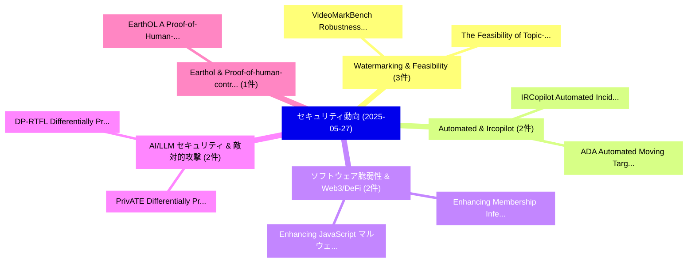

# 📅 02_daily: 日次エグゼクティブサマリー報告書 (2025-05-27)

**集計日時**: 2026-10-02 23:05:27 UTC  
**対象日付**: 2025-05-27  
**本日収集論文数**: 32 件  

---

## 💡 主要セキュリティ動向・脅威インサイト (Executive Insights)

本日の収集論文（計 32 件）において、以下の重点セキュリティ領域で活発な研究動向が確認されました：
- **Watermarking & Feasibility** (3 件): 注目論文として 「VideoMarkBench: Robustness of ...」、「The Feasibility of Topic-Based...」 等が発表され、実務防御および攻撃検証の進展が見られます。
- **Automated & Ircopilot** (2 件): 注目論文として 「IRCopilot: Automated Incident ...」、「ADA: Automated Moving Target D...」 等が発表され、実務防御および攻撃検証の進展が見られます。
- **ソフトウェア脆弱性 & Web3/DeFi** (2 件): 注目論文として 「Enhancing Membership Inference...」、「Enhancing JavaScript マルウェア検出 t...」 等が発表され、実務防御および攻撃検証の進展が見られます。
- **AI/LLM セキュリティ & 敵対的攻撃** (2 件): 注目論文として 「PrivATE: Differentially Privat...」、「DP-RTFL: Differentially Privat...」 等が発表され、実務防御および攻撃検証の進展が見られます。
- **Earthol & Proof-of-human-contribution** (1 件): 注目論文として 「EarthOL: A Proof-of-Human-Cont...」 等が発表され、実務防御および攻撃検証の進展が見られます。

### 🗺️ 技術・脅威トピックマインドマップ

---

## 📌 日次セキュリティ論文一覧 (日本語表形式)

| No | arXiv ID | 論文タイトル (日本語訳) | 重要キーワード | 構造化エグゼクティブ要約 (背景・提案・影響) | 脅威分類 | 詳細リンク |
|---|---|---|---|---|---|---|
| 1 | `2505.20614v1` | [EarthOL: A Proof-of-Human-Contribution Consensus Protocol -- Addressing Fundamental Challenges in Decentralized Value Assessment with Enhanced Verification and Security Mechanisms（セキュリティ分析論文）](../../okf/papers/2025-05-27/2505.20614.md) | `Contribution Consensus Protocol`, `Addressing Fundamental Challenges`, `Decentralized Value Assessment` | 【提案】概要 (Overview & Key Finding) 本論文「EarthOL: A Proof-of-Human-Contribution Consensus Protoc...。実証評価により経営層・セキュリティ管理者向け推奨ア。 | `cs.CR` | [arXiv](https://arxiv.org/abs/2505.20614v1) &#124; [OKF](../../okf/papers/2025-05-27/2505.20614.md) |
| 2 | `2505.20866v1` | [Respond to Change with Constancy: Instruction-tuning with LLM for Non-I.I.D. Network Traffic Classification（セキュリティ分析論文）](../../okf/papers/2025-05-27/2505.20866.md) | `Network Traffic Classification`, `Xinjie Lin`, `Gang Xiong` | 【提案】Network Traffic Classification ### (日本語題名: Respond to Change with Constancy: Instructio...。実証評価により経営層・セキュリティ管理者向け推奨アクション (E... | `cs.CR` | [arXiv](https://arxiv.org/abs/2505.20866v1) &#124; [OKF](../../okf/papers/2025-05-27/2505.20866.md) |
| 3 | `2505.20912v1` | [a DSL for hybrid secure computationに向けて](../../okf/papers/2025-05-27/2505.20912.md) | `Raw Meta`, `Executive Summary`, `Key Finding` | 【提案】概要 (Overview & Key Finding) 本論文「a DSL for hybrid secure computationに向けて」（原題: Towards a ...。実証評価により経営層・セキュリティ管理者向け推奨アクション (E... | `cs.CR` | [arXiv](https://arxiv.org/abs/2505.20912v1) &#124; [OKF](../../okf/papers/2025-05-27/2505.20912.md) |
| 4 | `2505.20945v3` | [IRCopilot: Automated Incident Response with 大規模言語モデル](../../okf/papers/2025-05-27/2505.20945.md) | `Automated Incident Response`, `Large Language Models`, `Xihuan Lin` | 【提案】概要 (Overview & Key Finding) 本論文「IRCopilot: Automated Incident Response with 大規模言語モデル」（原...。実証評価により経営層・セキュリティ管理者向け推奨アクション (E... | `cs.CR` | [arXiv](https://arxiv.org/abs/2505.20945v3) &#124; [OKF](../../okf/papers/2025-05-27/2505.20945.md) |
| 5 | `2505.20955v5` | [Enhancing Membership Inference Attacks on Diffusion Models from a Frequency-Domain Perspective（セキュリティ分析論文）](../../okf/papers/2025-05-27/2505.20955.md) | `Enhancing Membership Inference Attacks`, `Diffusion Models`, `Domain Perspective` | 【提案】概要 (Overview & Key Finding) 本論文「Enhancing Membership Inference Attacks on Diffusion Mod...。実証評価により経営層・セキュリティ管理者向け推奨アクション (E... | `cs.CR` | [arXiv](https://arxiv.org/abs/2505.20955v5) &#124; [OKF](../../okf/papers/2025-05-27/2505.20955.md) |
| 6 | `2505.21008v3` | [A Hitchhiker's Guide to Privacy-Preserving Digital Payment Systems: A Survey on Anonymity, Confidentiality, and Auditability（セキュリティ分析論文）](../../okf/papers/2025-05-27/2505.21008.md) | `Preserving Digital Payment Systems`, `Privacy-Preserving Digital`, `Francesco De Sclavis` | 【提案】概要 (Overview & Key Finding) 本論文「A Hitchhiker's Guide to Privacy-Preserving Digital Paym...。実証評価により経営層・セキュリティ管理者向け推奨アクション (E... | `cs.CR` | [arXiv](https://arxiv.org/abs/2505.21008v3) &#124; [OKF](../../okf/papers/2025-05-27/2505.21008.md) |
| 7 | `2505.21021v1` | [Uncovering Black-hat SEO based fake E-commerce scam groups from their redirectors and websites（セキュリティ分析論文）](../../okf/papers/2025-05-27/2505.21021.md) | `Uncovering Black`, `Black-hat SEO`, `E-commerce scam` | 【提案】概要 (Overview & Key Finding) 本論文「Uncovering Black-hat SEO based fake E-commerce scam gro...。実証評価により経営層・セキュリティ管理者向け推奨アクション (E... | `cs.CR` | [arXiv](https://arxiv.org/abs/2505.21021v1) &#124; [OKF](../../okf/papers/2025-05-27/2505.21021.md) |
| 8 | `2505.21051v2` | [SHE-LoRA: Selective Homomorphic Encryption for Federated Tuning with Heterogeneous LoRA（セキュリティ分析論文）](../../okf/papers/2025-05-27/2505.21051.md) | `Selective Homomorphic Encryption`, `Federated Tuning`, `Jianmin Liu` | 【提案】概要 (Overview & Key Finding) 本論文「SHE-LoRA: Selective 準同型暗号 for Federated Tuning with Het...。実証評価により経営層・セキュリティ管理者向け推奨アクション (E... | `cs.CR` | [arXiv](https://arxiv.org/abs/2505.21051v2) &#124; [OKF](../../okf/papers/2025-05-27/2505.21051.md) |
| 9 | `2505.21074v1` | [Red-Teaming Text-to-Image Systems by Rule-based Preference Modeling（セキュリティ分析論文）](../../okf/papers/2025-05-27/2505.21074.md) | `Teaming Text`, `Image Systems`, `Preference Modeling` | 【提案】概要 (Overview & Key Finding) 本論文「Red-Teaming Text-to-Image Systems by Rule-based Prefere...。実証評価により経営層・セキュリティ管理者向け推奨アクション (E... | `cs.CR` | [arXiv](https://arxiv.org/abs/2505.21074v1) &#124; [OKF](../../okf/papers/2025-05-27/2505.21074.md) |
| 10 | `2505.21130v1` | [ColorGo: Directed Concolic Execution（セキュリティ分析論文）](../../okf/papers/2025-05-27/2505.21130.md) | `Directed Concolic Execution`, `Jia Li`, `Jiacheng Shen` | 【提案】概要 (Overview & Key Finding) 本論文「ColorGo: Directed Concolic Execution（セキュリティ分析論文）」（原題: C...。実証評価によりLyu - **公開日時**: `2025-05-... | `cs.CR` | [arXiv](https://arxiv.org/abs/2505.21130v1) &#124; [OKF](../../okf/papers/2025-05-27/2505.21130.md) |
| 11 | `2505.21263v1` | [JavaSith: A Client-Side Framework for Analyzing Potentially Malicious Extensions in Browsers, VS Code, and NPM Packages（セキュリティ分析論文）](../../okf/papers/2025-05-27/2505.21263.md) | `Analyzing Potentially Malicious Extensions`, `Analyzing Potentially Malicious Exte`, `Avihay Cohen` | 【提案】概要 (Overview & Key Finding) 本論文「JavaSith: A Client-Side Framework for Analyzing Potenti...。実証評価により経営層・セキュリティ管理者向け推奨アクション (E... | `cs.CR` | [arXiv](https://arxiv.org/abs/2505.21263v1) &#124; [OKF](../../okf/papers/2025-05-27/2505.21263.md) |
| 12 | `2505.21277v2` | [Breaking the Ceiling: Exploring the Potential of Jailbreak Attacks through Expanding Strategy Space（セキュリティ分析論文）](../../okf/papers/2025-05-27/2505.21277.md) | `Expanding Strategy Space`, `Jailbreak Attacks`, `Yao Huang` | 【提案】概要 (Overview & Key Finding) 本論文「Breaking the Ceiling: Exploring the Potential of ジェイルブレ...。実証評価により経営層・セキュリティ管理者向け推奨アクション (E... | `cs.CR` | [arXiv](https://arxiv.org/abs/2505.21277v2) &#124; [OKF](../../okf/papers/2025-05-27/2505.21277.md) |
| 13 | `2505.21406v1` | [Enhancing JavaScript マルウェア検出 through Weighted Behavioral DFAs](../../okf/papers/2025-05-27/2505.21406.md) | `Weighted Behavioral`, `Malware Detection`, `Pedro Pereira` | 【提案】概要 (Overview & Key Finding) 本論文「Enhancing JavaScript マルウェア検出 through Weighted Behaviora...。実証評価により経営層・セキュリティ管理者向け推奨アクション (E... | `cs.CR` | [arXiv](https://arxiv.org/abs/2505.21406v1) &#124; [OKF](../../okf/papers/2025-05-27/2505.21406.md) |
| 14 | `2505.21442v2` | [Cryptography from Lossy Reductions: OWFs from ETH, and Beyondに向けて](../../okf/papers/2025-05-27/2505.21442.md) | `Lossy Reductions`, `Pouria Fallahpour`, `Garazi Muguruza` | 【提案】概要 (Overview & Key Finding) 本論文「暗号技術 from Lossy Reductions: OWFs from ETH, and Beyondに向...。実証評価によりGrilo, Garazi Muguruza, M... | `cs.CR` | [arXiv](https://arxiv.org/abs/2505.21442v2) &#124; [OKF](../../okf/papers/2025-05-27/2505.21442.md) |
| 15 | `2505.21462v1` | [M3S-UPD: Efficient Multi-Stage Self-Supervised Learning for Fine-Grained Encrypted Traffic Classification with Unknown Pattern Discovery（セキュリティ分析論文）](../../okf/papers/2025-05-27/2505.21462.md) | `Grained Encrypted Traffic Classification`, `Unknown Pattern Discovery`, `Efficient Multi` | 【提案】概要 (Overview & Key Finding) 本論文「M3S-UPD: Efficient Multi-Stage Self-Supervised Learning...。実証評価により経営層・セキュリティ管理者向け推奨アクション (E... | `cs.CR` | [arXiv](https://arxiv.org/abs/2505.21462v1) &#124; [OKF](../../okf/papers/2025-05-27/2505.21462.md) |
| 16 | `2505.21499v1` | [AdInject: Real-World Black-Box Attacks on Web Agents via Advertising Delivery（セキュリティ分析論文）](../../okf/papers/2025-05-27/2505.21499.md) | `World Black`, `Box Attacks`, `Real-World Black` | 【提案】概要 (Overview & Key Finding) 本論文「AdInject: Real-World Black-Box Attacks on Web Agents vi...。実証評価により経営層・セキュリティ管理者向け推奨アクション (E... | `cs.CR` | [arXiv](https://arxiv.org/abs/2505.21499v1) &#124; [OKF](../../okf/papers/2025-05-27/2505.21499.md) |
| 17 | `2505.21568v2` | [VoiceMark: Zero-Shot Voice Cloning-Resistant Watermarking Approach Leveraging Speaker-Specific Latents（セキュリティ分析論文）](../../okf/papers/2025-05-27/2505.21568.md) | `Shot Voice Cloning`, `Specific Latents`, `Zero-Shot Voice` | 【提案】概要 (Overview & Key Finding) 本論文「VoiceMark: Zero-Shot Voice Cloning-Resistant Watermarki...。実証評価により経営層・セキュリティ管理者向け推奨アクション (E... | `cs.CR` | [arXiv](https://arxiv.org/abs/2505.21568v2) &#124; [OKF](../../okf/papers/2025-05-27/2505.21568.md) |
| 18 | `2505.21605v3` | [SoSBench: Safety Alignment on Six Scientific Domainsのベンチマーク評価](../../okf/papers/2025-05-27/2505.21605.md) | `Benchmarking Safety Alignment`, `Six Scientific Domains`, `Safety Alignment` | 【提案】概要 (Overview & Key Finding) 本論文「SoSBench: Safety Alignment on Six Scientific Domainsのベン...。実証評価により経営層・セキュリティ管理者向け推奨アクション (E... | `cs.CR` | [arXiv](https://arxiv.org/abs/2505.21605v3) &#124; [OKF](../../okf/papers/2025-05-27/2505.21605.md) |
| 19 | `2505.21609v1` | [Preventing Adversarial AI Attacks Against Autonomous Situational Awareness: A Maritime Case Study（セキュリティ分析論文）](../../okf/papers/2025-05-27/2505.21609.md) | `Preventing Adversarial`, `Aaron Barrett`, `Kimberly Tam` | 【提案】概要 (Overview & Key Finding) 本論文「Preventing Adversarial AI Attacks Against Autonomous Si...。実証評価により経営層・セキュリティ管理者向け推奨アクション (E... | `cs.CR` | [arXiv](https://arxiv.org/abs/2505.21609v1) &#124; [OKF](../../okf/papers/2025-05-27/2505.21609.md) |
| 20 | `2505.21620v1` | [VideoMarkBench: Robustness of Video Watermarkingのベンチマーク評価](../../okf/papers/2025-05-27/2505.21620.md) | `Benchmarking Robustness`, `Video Watermarking`, `Neil Zhenqiang Gong` | 【提案】概要 (Overview & Key Finding) 本論文「VideoMarkBench: Robustness of Video Watermarkingのベンチマーク...。実証評価により経営層・セキュリティ管理者向け推奨アクション (E... | `cs.CR` | [arXiv](https://arxiv.org/abs/2505.21620v1) &#124; [OKF](../../okf/papers/2025-05-27/2505.21620.md) |
| 21 | `2505.21636v2` | [The Feasibility of Topic-Based Watermarking on Academic Peer Reviews（セキュリティ分析論文）](../../okf/papers/2025-05-27/2505.21636.md) | `Academic Peer Reviews`, `Based Watermarking`, `Topic-Based Watermarking` | 【提案】概要 (Overview & Key Finding) 本論文「The Feasibility of Topic-Based Watermarking on Academic...。実証評価により経営層・セキュリティ管理者向け推奨アクション (E... | `cs.CR` | [arXiv](https://arxiv.org/abs/2505.21636v2) &#124; [OKF](../../okf/papers/2025-05-27/2505.21636.md) |
| 22 | `2505.21641v2` | [PrivATE: Differentially Private Confidence Intervals for Average Treatment Effects（セキュリティ分析論文）](../../okf/papers/2025-05-27/2505.21641.md) | `Differentially Private Confidence Intervals`, `Average Treatment Effects`, `Justin Hartenstein` | 【提案】概要 (Overview & Key Finding) 本論文「PrivATE: Differentially Private Confidence Intervals fo...。実証評価により経営層・セキュリティ管理者向け推奨アクション (E... | `cs.CR` | [arXiv](https://arxiv.org/abs/2505.21641v2) &#124; [OKF](../../okf/papers/2025-05-27/2505.21641.md) |
| 23 | `2505.21642v1` | [Reproducible Builds and Insights from an Independent Verifier for Arch Linux（セキュリティ分析論文）](../../okf/papers/2025-05-27/2505.21642.md) | `Reproducible Builds`, `Independent Verifier`, `Arch Linux` | 【提案】概要 (Overview & Key Finding) 本論文「Reproducible Builds and Insights from an Independent Ve...。実証評価により経営層・セキュリティ管理者向け推奨アクション (E... | `cs.CR` | [arXiv](https://arxiv.org/abs/2505.21642v1) &#124; [OKF](../../okf/papers/2025-05-27/2505.21642.md) |
| 24 | `2505.21703v1` | [A Joint Reconstruction-Triplet Loss Autoencoder Approach Unseen Attack Detection in IoV Networksに向けて](../../okf/papers/2025-05-27/2505.21703.md) | `Joint Reconstruction`, `Reconstruction-Triplet Loss`, `Julia Boone` | 【提案】概要 (Overview & Key Finding) 本論文「A Joint Reconstruction-Triplet Loss Autoencoder Approac...。実証評価により経営層・セキュリティ管理者向け推奨アクション (E... | `cs.CR` | [arXiv](https://arxiv.org/abs/2505.21703v1) &#124; [OKF](../../okf/papers/2025-05-27/2505.21703.md) |
| 25 | `2505.21725v2` | [Lazarus Group Targets Crypto-Wallets and Financial Data while employing new Tradecrafts（セキュリティ分析論文）](../../okf/papers/2025-05-27/2505.21725.md) | `Lazarus Group Targets Crypto`, `Financial Data`, `Alessio Di Santo` | 【提案】概要 (Overview & Key Finding) 本論文「Lazarus Group Targets Crypto-Wallets and Financial Data...。実証評価により経営層・セキュリティ管理者向け推奨アクション (E... | `cs.CR` | [arXiv](https://arxiv.org/abs/2505.21725v2) &#124; [OKF](../../okf/papers/2025-05-27/2505.21725.md) |
| 26 | `2505.21726v1` | [Multi-photon QKD for Practical Quantum Networks（セキュリティ分析論文）](../../okf/papers/2025-05-27/2505.21726.md) | `Practical Quantum Networks`, `Multi-photon QKD`, `Nitin Jha` | 【提案】概要 (Overview & Key Finding) 本論文「Multi-photon QKD for Practical 量子 Networks（セキュリティ分析論文）」...。実証評価により経営層・セキュリティ管理者向け推奨アクション (E... | `cs.CR` | [arXiv](https://arxiv.org/abs/2505.21726v1) &#124; [OKF](../../okf/papers/2025-05-27/2505.21726.md) |
| 27 | `2505.21733v2` | [Scrapers selectively respect robots.txt directives: evidence from a large-scale empirical study（セキュリティ分析論文）](../../okf/papers/2025-05-27/2505.21733.md) | `large-scale empirical`, `Taein Kim`, `Karstan Bock` | 【提案】概要 (Overview & Key Finding) 本論文「Scrapers selectively respect robots.txt directives: evi...。実証評価により経営層・セキュリティ管理者向け推奨アクション (E... | `cs.CR` | [arXiv](https://arxiv.org/abs/2505.21733v2) &#124; [OKF](../../okf/papers/2025-05-27/2505.21733.md) |
| 28 | `2505.21756v3` | [Online Voting using Point to MultiPoint Quantum Key Distribution（セキュリティ分析論文）](../../okf/papers/2025-05-27/2505.21756.md) | `Quantum Key Distribution`, `Online Voting`, `Jing Wang` | 【提案】概要 (Overview & Key Finding) 本論文「Online Voting using Point to MultiPoint 量子鍵配送（セキュリティ分析論...。実証評価によりHuberman, Jing Wang - **公... | `cs.CR` | [arXiv](https://arxiv.org/abs/2505.21756v3) &#124; [OKF](../../okf/papers/2025-05-27/2505.21756.md) |
| 29 | `2505.23805v1` | [ADA: Automated Moving Target Defense for AI Workloads via Ephemeral Infrastructure-Native Rotation in Kubernetes（セキュリティ分析論文）](../../okf/papers/2025-05-27/2505.23805.md) | `Automated Moving Target Defense`, `Ephemeral Infrastructure`, `Native Rotation` | 【提案】概要 (Overview & Key Finding) 本論文「ADA: Automated Moving Target Defense for AI Workloads v...。実証評価により経営層・セキュリティ管理者向け推奨アクション (E... | `cs.CR` | [arXiv](https://arxiv.org/abs/2505.23805v1) &#124; [OKF](../../okf/papers/2025-05-27/2505.23805.md) |
| 30 | `2505.23813v1` | [DP-RTFL: Differentially Private Resilient Temporal 連合学習 for Trustworthy AI in Regulated Industries](../../okf/papers/2025-05-27/2505.23813.md) | `Regulated Industries`, `Differentially Private Resilient Temporal`, `Differentially Private Resilient Temporal Federated Learning` | 【提案】概要 (Overview & Key Finding) 本論文「DP-RTFL: Differentially Private Resilient Temporal 連合学習...。実証評価により経営層・セキュリティ管理者向け推奨アクション (E... | `cs.CR` | [arXiv](https://arxiv.org/abs/2505.23813v1) &#124; [OKF](../../okf/papers/2025-05-27/2505.23813.md) |
| 31 | `2505.23814v2` | [Watermarking Without Standards Is Not AI Governance（セキュリティ分析論文）](../../okf/papers/2025-05-27/2505.23814.md) | `Alexander Nemecek`, `Yuzhou Jiang`, `Erman Ayday` | 【提案】背景とセキュリティ上の課題 (Background & Problem) 本研究はサイバー脅威環境におけるセキュリティ構造・脆弱性の検証を目的としています。(主要検出項目: ...。実証評価により経営層・セキュリティ管理者向け推奨アクション (E... | `cs.CR` | [arXiv](https://arxiv.org/abs/2505.23814v2) &#124; [OKF](../../okf/papers/2025-05-27/2505.23814.md) |
| 32 | `2505.23817v1` | [System Prompt Extraction Attacks and Defenses in 大規模言語モデル](../../okf/papers/2025-05-27/2505.23817.md) | `System Prompt Extraction Attacks`, `Large Language Models`, `Badhan Chandra Das` | 【提案】概要 (Overview & Key Finding) 本論文「System Prompt Extraction Attacks and Defenses in 大規模言語モ...。実証評価によりHadi Amini, Yanzhao Wu - ... | `cs.CR` | [arXiv](https://arxiv.org/abs/2505.23817v1) &#124; [OKF](../../okf/papers/2025-05-27/2505.23817.md) |

