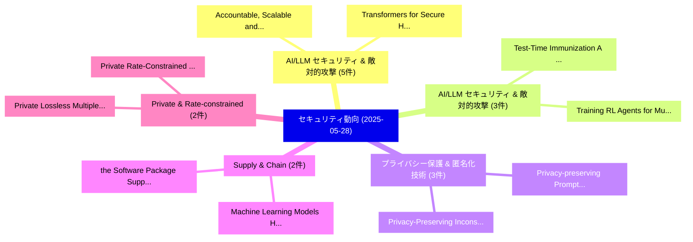

# 📅 02_daily: 日次エグゼクティブサマリー報告書 (2025-05-28)

**集計日時**: 2026-10-02 23:05:27 UTC  
**対象日付**: 2025-05-28  
**本日収集論文数**: 33 件  

---

## 💡 主要セキュリティ動向・脅威インサイト (Executive Insights)

本日の収集論文（計 33 件）において、以下の重点セキュリティ領域で活発な研究動向が確認されました：
- **AI/LLM セキュリティ & 敵対的攻撃** (5 件): 注目論文として 「Accountable, Scalable and DoS-...」、「Transformers for Secure Hardwa...」 等が発表され、実務防御および攻撃検証の進展が見られます。
- **AI/LLM セキュリティ & 敵対的攻撃** (3 件): 注目論文として 「Test-Time Immunization: A Univ...」、「Training RL Agents for Multi-O...」 等が発表され、実務防御および攻撃検証の進展が見られます。
- **プライバシー保護 & 匿名化技術** (3 件): 注目論文として 「Privacy-preserving Prompt Pers...」、「Privacy-Preserving Inconsisten...」 等が発表され、実務防御および攻撃検証の進展が見られます。
- **Supply & Chain** (2 件): 注目論文として 「the Software Package Supply Ch...」、「Machine Learning Models Have a...」 等が発表され、実務防御および攻撃検証の進展が見られます。
- **Private & Rate-constrained** (2 件): 注目論文として 「Private Lossless Multiple Rele...」、「Private Rate-Constrained Optim...」 等が発表され、実務防御および攻撃検証の進展が見られます。

### 🗺️ 技術・脅威トピックマインドマップ

---

## 📌 日次セキュリティ論文一覧 (日本語表形式)

| No | arXiv ID | 論文タイトル (日本語訳) | 重要キーワード | 構造化エグゼクティブ要約 (背景・提案・影響) | 脅威分類 | 詳細リンク |
|---|---|---|---|---|---|---|
| 1 | `2505.21938v3` | [Practical Stochastic Bandits via Fake Data Injectionに対する敵対的攻撃](../../okf/papers/2025-05-28/2505.21938.md) | `Practical Adversarial Attacks`, `Fake Data Injection`, `Practical Stochastic Bandits` | 【提案】概要 (Overview & Key Finding) 本論文「Practical Stochastic Bandits via Fake Data Injectionに対す...。実証評価により経営層・セキュリティ管理者向け推奨アクション (E... | `cs.CR` | [arXiv](https://arxiv.org/abs/2505.21938v3) &#124; [OKF](../../okf/papers/2025-05-28/2505.21938.md) |
| 2 | `2505.22010v1` | [VulBinLLM: LLM-powered 脆弱性検出 for Stripped Binaries](../../okf/papers/2025-05-28/2505.22010.md) | `Stripped Binaries`, `Vulnerability Detection`, `LLM-powered Vulnerability` | 【提案】概要 (Overview & Key Finding) 本論文「VulBinLLM: LLM-powered 脆弱性検出 for Stripped Binaries」（原題:...。実証評価により経営層・セキュリティ管理者向け推奨アクション (E... | `cs.CR` | [arXiv](https://arxiv.org/abs/2505.22010v1) &#124; [OKF](../../okf/papers/2025-05-28/2505.22010.md) |
| 3 | `2505.22023v1` | [the Software Package Supply Chain for Critical Systemsのセキュリティ強化](../../okf/papers/2025-05-28/2505.22023.md) | `Software Package Supply Chain`, `Critical Systems`, `Ritwik Murali` | 【提案】概要 (Overview & Key Finding) 本論文「the Software Package Supply Chain for Critical Systemsの...。実証評価により経営層・セキュリティ管理者向け推奨アクション (E... | `cs.CR` | [arXiv](https://arxiv.org/abs/2505.22023v1) &#124; [OKF](../../okf/papers/2025-05-28/2505.22023.md) |
| 4 | `2505.22037v1` | [Jailbreak Distillation: Renewable Safety Benchmarking（セキュリティ分析論文）](../../okf/papers/2025-05-28/2505.22037.md) | `Renewable Safety Benchmarking`, `Jailbreak Distillation`, `Benjamin Van Durme` | 【提案】概要 (Overview & Key Finding) 本論文「ジェイルブレイク Distillation: Renewable Safety Benchmarking（セキ...。実証評価により経営層・セキュリティ管理者向け推奨アクション (E... | `cs.CR` | [arXiv](https://arxiv.org/abs/2505.22037v1) &#124; [OKF](../../okf/papers/2025-05-28/2505.22037.md) |
| 5 | `2505.22052v2` | [A Comparative Study of Fuzzers and Static Analysis Tools for Finding Memory Unsafety in C and C++（セキュリティ分析論文）](../../okf/papers/2025-05-28/2505.22052.md) | `Finding Memory Unsafety`, `Keno Hassler`, `Stephan Lipp` | 【提案】概要 (Overview & Key Finding) 本論文「A Comparative Study of Fuzzers and Static Analysis Tool...。実証評価により経営層・セキュリティ管理者向け推奨アクション (E... | `cs.CR` | [arXiv](https://arxiv.org/abs/2505.22052v2) &#124; [OKF](../../okf/papers/2025-05-28/2505.22052.md) |
| 6 | `2505.22108v4` | [Inclusive 連合学習 Through Compliance-Weighted Noise Allocation in Healthcare AI](../../okf/papers/2025-05-28/2505.22108.md) | `Weighted Noise Allocation`, `Compliance-Weighted Noise`, `Weighted Noise Alloc` | 【提案】概要 (Overview & Key Finding) 本論文「Inclusive 連合学習 Through Compliance-Weighted Noise Alloca...。実証評価により経営層・セキュリティ管理者向け推奨アクション (E... | `cs.CR` | [arXiv](https://arxiv.org/abs/2505.22108v4) &#124; [OKF](../../okf/papers/2025-05-28/2505.22108.md) |
| 7 | `2505.22162v1` | [Accountable, Scalable and DoS-resilient Secure Vehicular Communication（セキュリティ分析論文）](../../okf/papers/2025-05-28/2505.22162.md) | `Secure Vehicular Communication`, `DoS-resilient Secure`, `Hongyu Jin` | 【提案】概要 (Overview & Key Finding) 本論文「Accountable, Scalable and DoS-resilient Secure Vehicula...。実証評価により経営層・セキュリティ管理者向け推奨アクション (E... | `cs.CR` | [arXiv](https://arxiv.org/abs/2505.22162v1) &#124; [OKF](../../okf/papers/2025-05-28/2505.22162.md) |
| 8 | `2505.22220v1` | [Domainator: Detecting and Identifying DNS-Tunneling Malware Using Metadata Sequences（セキュリティ分析論文）](../../okf/papers/2025-05-28/2505.22220.md) | `Tunneling Malware Using Metadata Sequences`, `DNS-Tunneling Malware`, `Tunneling Malware Us` | 【提案】概要 (Overview & Key Finding) 本論文「Domainator: Detecting and Identifying DNS-Tunneling マルウ...。実証評価により経営層・セキュリティ管理者向け推奨アクション (E... | `cs.CR` | [arXiv](https://arxiv.org/abs/2505.22220v1) &#124; [OKF](../../okf/papers/2025-05-28/2505.22220.md) |
| 9 | `2505.22271v1` | [Test-Time Immunization: A Universal Defense Framework Against Jailbreaks for (Multimodal) 大規模言語モデル](../../okf/papers/2025-05-28/2505.22271.md) | `Time Immunization`, `Test-Time Immunization`, `Large Language Models` | 【提案】概要 (Overview & Key Finding) 本論文「Test-Time Immunization: A Universal Defense Framework A...。実証評価により経営層・セキュリティ管理者向け推奨アクション (E... | `cs.CR` | [arXiv](https://arxiv.org/abs/2505.22271v1) &#124; [OKF](../../okf/papers/2025-05-28/2505.22271.md) |
| 10 | `2505.22435v1` | [Does Johnny Get the Message? Evaluating サイバーセキュリティ Notifications for Everyday Users](../../okf/papers/2025-05-28/2505.22435.md) | `Everyday Users`, `Evaluating Cybersecurity Notifications`, `Erik Buchmann` | 【提案】Evaluating Cybersecurity Notifications for Everyday Users ### (日本語題名: Does Johnny Get t...。実証評価により経営層・セキュリティ管理者向け推奨アクション (E... | `cs.CR` | [arXiv](https://arxiv.org/abs/2505.22435v1) &#124; [OKF](../../okf/papers/2025-05-28/2505.22435.md) |
| 11 | `2505.22447v1` | [Privacy-preserving Prompt Personalization in Federated Learning for Multimodal 大規模言語モデル](../../okf/papers/2025-05-28/2505.22447.md) | `Prompt Personalization`, `Federated Learning`, `Privacy-preserving Prompt` | 【提案】概要 (Overview & Key Finding) 本論文「Privacy-preserving Prompt Personalization in Federated ...。実証評価により経営層・セキュリティ管理者向け推奨アクション (E... | `cs.CR` | [arXiv](https://arxiv.org/abs/2505.22447v1) &#124; [OKF](../../okf/papers/2025-05-28/2505.22447.md) |
| 12 | `2505.22449v1` | [Private Lossless Multiple Release（セキュリティ分析論文）](../../okf/papers/2025-05-28/2505.22449.md) | `Private Lossless Multiple Release`, `Joel Daniel Andersson`, `Lukas Retschmeier` | 【提案】概要 (Overview & Key Finding) 本論文「Private Lossless Multiple Release（セキュリティ分析論文）」（原題: Priv...。実証評価により経営層・セキュリティ管理者向け推奨アクション (E... | `cs.CR` | [arXiv](https://arxiv.org/abs/2505.22449v1) &#124; [OKF](../../okf/papers/2025-05-28/2505.22449.md) |
| 13 | `2505.22531v2` | [Training RL Agents for Multi-Objective Network Defense Tasks（セキュリティ分析論文）](../../okf/papers/2025-05-28/2505.22531.md) | `Objective Network Defense Tasks`, `Multi-Objective Network`, `Andres Molina` | 【提案】概要 (Overview & Key Finding) 本論文「Training RL Agents for Multi-Objective Network Defense ...。実証評価により経営層・セキュリティ管理者向け推奨アクション (E... | `cs.CR` | [arXiv](https://arxiv.org/abs/2505.22531v2) &#124; [OKF](../../okf/papers/2025-05-28/2505.22531.md) |
| 14 | `2505.22605v1` | [Transformers for Secure Hardware Systems: Applications, Challenges, and Outlook（セキュリティ分析論文）](../../okf/papers/2025-05-28/2505.22605.md) | `Secure Hardware Systems`, `Banafsheh Saber Latibari`, `Najmeh Nazari` | 【提案】概要 (Overview & Key Finding) 本論文「Transformers for Secure Hardware Systems: Applications,...。実証評価により経営層・セキュリティ管理者向け推奨アクション (E... | `cs.CR` | [arXiv](https://arxiv.org/abs/2505.22605v1) &#124; [OKF](../../okf/papers/2025-05-28/2505.22605.md) |
| 15 | `2505.22612v1` | [BPMN to Smart Contract by Business Analyst（セキュリティ分析論文）](../../okf/papers/2025-05-28/2505.22612.md) | `Smart Contract`, `Business Analyst`, `Raw Meta` | 【提案】概要 (Overview & Key Finding) 本論文「BPMN to スマートコントラクト by Business Analyst（セキュリティ分析論文）」（原題:...。実証評価によりJutla - **公開日時**: `2025-0... | `cs.CR` | [arXiv](https://arxiv.org/abs/2505.22612v1) &#124; [OKF](../../okf/papers/2025-05-28/2505.22612.md) |
| 16 | `2505.22619v1` | [Smart Contracts for SMEs and Large Companies（セキュリティ分析論文）](../../okf/papers/2025-05-28/2505.22619.md) | `Smart Contracts`, `Large Companies`, `Raw Meta` | 【提案】概要 (Overview & Key Finding) 本論文「スマートコントラクトs for SMEs and Large Companies（セキュリティ分析論文）」（原...。実証評価によりJutla - **公開日時**: `2025-0... | `cs.CR` | [arXiv](https://arxiv.org/abs/2505.22619v1) &#124; [OKF](../../okf/papers/2025-05-28/2505.22619.md) |
| 17 | `2505.22638v1` | [SimProcess: High Fidelity Simulation of Noisy ICS Physical Processes（セキュリティ分析論文）](../../okf/papers/2025-05-28/2505.22638.md) | `High Fidelity Simulation`, `Physical Processes`, `Denis Donadel` | 【提案】概要 (Overview & Key Finding) 本論文「SimProcess: High Fidelity Simulation of Noisy ICS Physi...。実証評価により経営層・セキュリティ管理者向け推奨アクション (E... | `cs.CR` | [arXiv](https://arxiv.org/abs/2505.22638v1) &#124; [OKF](../../okf/papers/2025-05-28/2505.22638.md) |
| 18 | `2505.22644v1` | [On the Intractability of Chaotic Symbolic Walks: Toward a Non-Algebraic Post-Quantum Hardness Assumption（セキュリティ分析論文）](../../okf/papers/2025-05-28/2505.22644.md) | `Chaotic Symbolic Walks`, `Quantum Hardness Assumption`, `Algebraic Post` | 【提案】概要 (Overview & Key Finding) 本論文「On the Intractability of Chaotic Symbolic Walks: Toward...。実証評価により経営層・セキュリティ管理者向け推奨アクション (E... | `cs.CR` | [arXiv](https://arxiv.org/abs/2505.22644v1) &#124; [OKF](../../okf/papers/2025-05-28/2505.22644.md) |
| 19 | `2505.22703v2` | [Private Rate-Constrained Optimization with Applications to Fair Learning（セキュリティ分析論文）](../../okf/papers/2025-05-28/2505.22703.md) | `Private Rate`, `Constrained Optimization`, `Fair Learning` | 【提案】概要 (Overview & Key Finding) 本論文「Private Rate-Constrained Optimization with Applications...。実証評価により経営層・セキュリティ管理者向け推奨アクション (E... | `cs.CR` | [arXiv](https://arxiv.org/abs/2505.22703v2) &#124; [OKF](../../okf/papers/2025-05-28/2505.22703.md) |
| 20 | `2505.22735v1` | [TensorShield: Safeguarding On-Device Inference by Shielding Critical DNN Tensors with TEE（セキュリティ分析論文）](../../okf/papers/2025-05-28/2505.22735.md) | `Device Inference`, `Shielding Critical`, `On-Device Inference` | 【提案】概要 (Overview & Key Finding) 本論文「TensorShield: Safeguarding On-Device Inference by Shiel...。実証評価により経営層・セキュリティ管理者向け推奨アクション (E... | `cs.CR` | [arXiv](https://arxiv.org/abs/2505.22735v1) &#124; [OKF](../../okf/papers/2025-05-28/2505.22735.md) |
| 21 | `2505.22778v1` | [Machine Learning Models Have a Supply Chain Problem（セキュリティ分析論文）](../../okf/papers/2025-05-28/2505.22778.md) | `Supply Chain Problem`, `Sarah Meiklejohn`, `Hayden Blauzvern` | 【提案】概要 (Overview & Key Finding) 本論文「Machine Learning Models Have a Supply Chain Problem（セキュ...。実証評価により経営層・セキュリティ管理者向け推奨アクション (E... | `cs.CR` | [arXiv](https://arxiv.org/abs/2505.22778v1) &#124; [OKF](../../okf/papers/2025-05-28/2505.22778.md) |
| 22 | `2505.22798v3` | [Efficient Preimage Approximation for Neural Network Certification（セキュリティ分析論文）](../../okf/papers/2025-05-28/2505.22798.md) | `Efficient Preimage Approximation`, `Neural Network Certification`, `Mykola Zaitsev` | 【提案】概要 (Overview & Key Finding) 本論文「Efficient Preimage Approximation for Neural Network Cer...。実証評価により経営層・セキュリティ管理者向け推奨アクション (E... | `cs.CR` | [arXiv](https://arxiv.org/abs/2505.22798v3) &#124; [OKF](../../okf/papers/2025-05-28/2505.22798.md) |
| 23 | `2505.22843v3` | [On the Reliability and Stability of Selective Methods in Malware Classification Tasks（セキュリティ分析論文）](../../okf/papers/2025-05-28/2505.22843.md) | `Malware Classification Tasks`, `Selective Methods`, `Alexander Herzog` | 【提案】概要 (Overview & Key Finding) 本論文「On the Reliability and Stability of Selective Methods i...。実証評価により経営層・セキュリティ管理者向け推奨アクション (E... | `cs.CR` | [arXiv](https://arxiv.org/abs/2505.22843v3) &#124; [OKF](../../okf/papers/2025-05-28/2505.22843.md) |
| 24 | `2505.22845v2` | ["That's another doom I haven't thought about": A User Study on AI Labels as a Safeguard Against Image-Based Misinformation（セキュリティ分析論文）](../../okf/papers/2025-05-28/2505.22845.md) | `Based Misinformation`, `Image-Based Misinformation`, `Jonas Ricker` | 【提案】概要 (Overview & Key Finding) 本論文「"That's another doom I haven't thought about": A User S...。実証評価により経営層・セキュリティ管理者向け推奨アクション (E... | `cs.CR` | [arXiv](https://arxiv.org/abs/2505.22845v2) &#124; [OKF](../../okf/papers/2025-05-28/2505.22845.md) |
| 25 | `2505.22852v1` | [Operationalizing CaMeL: Strengthening LLM Defenses for Enterprise Deployment（セキュリティ分析論文）](../../okf/papers/2025-05-28/2505.22852.md) | `Enterprise Deployment`, `Krti Tallam`, `Emma Miller` | 【提案】概要 (Overview & Key Finding) 本論文「Operationalizing CaMeL: Strengthening LLM Defenses for ...。実証評価により経営層・セキュリティ管理者向け推奨アクション (E... | `cs.CR` | [arXiv](https://arxiv.org/abs/2505.22852v1) &#124; [OKF](../../okf/papers/2025-05-28/2505.22852.md) |
| 26 | `2505.22860v2` | [Permissioned LLMs: Enforcing Access Control in 大規模言語モデル](../../okf/papers/2025-05-28/2505.22860.md) | `Enforcing Access Control`, `Large Language Models`, `Bargav Jayaraman` | 【提案】概要 (Overview & Key Finding) 本論文「Permissioned LLMs: Enforcing アクセス制御 in 大規模言語モデル」（原題: Pe...。実証評価によりShen, Krishnaram Kenthapa... | `cs.CR` | [arXiv](https://arxiv.org/abs/2505.22860v2) &#124; [OKF](../../okf/papers/2025-05-28/2505.22860.md) |
| 27 | `2505.22878v1` | [BugWhisperer: Fine-Tuning LLMs for SoC Hardware 脆弱性検出](../../okf/papers/2025-05-28/2505.22878.md) | `Fine-Tuning LLMs`, `Hardware Vulnerability Detection`, `Sujan Kumar Saha` | 【提案】概要 (Overview & Key Finding) 本論文「BugWhisperer: Fine-Tuning LLMs for SoC Hardware 脆弱性検出」（...。実証評価により経営層・セキュリティ管理者向け推奨アクション (E... | `cs.CR` | [arXiv](https://arxiv.org/abs/2505.22878v1) &#124; [OKF](../../okf/papers/2025-05-28/2505.22878.md) |
| 28 | `2505.23821v2` | [SpeechVerifier: Robust Acoustic Fingerprint against Tampering Attacks via Watermarking（セキュリティ分析論文）](../../okf/papers/2025-05-28/2505.23821.md) | `Robust Acoustic Fingerprint`, `Tampering Attacks`, `Lingfeng Yao` | 【提案】概要 (Overview & Key Finding) 本論文「SpeechVerifier: Robust Acoustic Fingerprint against Tam...。実証評価により経営層・セキュリティ管理者向け推奨アクション (E... | `cs.CR` | [arXiv](https://arxiv.org/abs/2505.23821v2) &#124; [OKF](../../okf/papers/2025-05-28/2505.23821.md) |
| 29 | `2505.23825v1` | [Privacy-Preserving Inconsistency Measurement（セキュリティ分析論文）](../../okf/papers/2025-05-28/2505.23825.md) | `Preserving Inconsistency Measurement`, `Privacy-Preserving Inconsistency`, `Carl Corea` | 【提案】概要 (Overview & Key Finding) 本論文「Privacy-Preserving Inconsistency Measurement（セキュリティ分析論文...。実証評価により経営層・セキュリティ管理者向け推奨アクション (E... | `cs.CR` | [arXiv](https://arxiv.org/abs/2505.23825v1) &#124; [OKF](../../okf/papers/2025-05-28/2505.23825.md) |
| 30 | `2505.23828v1` | [Spa-VLM: Stealthy Poisoning Attacks on RAG-based VLM（セキュリティ分析論文）](../../okf/papers/2025-05-28/2505.23828.md) | `Stealthy Poisoning Attacks`, `RAG-based VLM`, `Lei Yu` | 【提案】概要 (Overview & Key Finding) 本論文「Spa-VLM: Stealthy Poisoning Attacks on RAG-based VLM（セキ...。実証評価により経営層・セキュリティ管理者向け推奨アクション (E... | `cs.CR` | [arXiv](https://arxiv.org/abs/2505.23828v1) &#124; [OKF](../../okf/papers/2025-05-28/2505.23828.md) |
| 31 | `2505.23839v1` | [GeneBreaker: Jailbreak Attacks against DNA Language Models with Pathogenicity Guidance（セキュリティ分析論文）](../../okf/papers/2025-05-28/2505.23839.md) | `Jailbreak Attacks`, `Language Models`, `Pathogenicity Guidance` | 【提案】概要 (Overview & Key Finding) 本論文「GeneBreaker: ジェイルブレイク Attacks against DNA Language Mode...。実証評価により経営層・セキュリティ管理者向け推奨アクション (E... | `cs.CR` | [arXiv](https://arxiv.org/abs/2505.23839v1) &#124; [OKF](../../okf/papers/2025-05-28/2505.23839.md) |
| 32 | `2505.23847v5` | [Seven Security Challenges in Cross-domain Multi-agent LLM Systems（セキュリティ分析論文）](../../okf/papers/2025-05-28/2505.23847.md) | `Seven Security Challenges`, `Cross-domain Multi`, `Ronny Ko` | 【提案】概要 (Overview & Key Finding) 本論文「Seven Security Challenges in Cross-domain Multi-agent L...。実証評価により経営層・セキュリティ管理者向け推奨アクション (E... | `cs.CR` | [arXiv](https://arxiv.org/abs/2505.23847v5) &#124; [OKF](../../okf/papers/2025-05-28/2505.23847.md) |
| 33 | `2505.23849v2` | [CADRE: Customizable Assurance of Data Readiness in Privacy-Preserving 連合学習](../../okf/papers/2025-05-28/2505.23849.md) | `Customizable Assurance`, `Data Readiness`, `Preserving Federated Learning` | 【提案】概要 (Overview & Key Finding) 本論文「CADRE: Customizable Assurance of Data Readiness in Priv...。実証評価により経営層・セキュリティ管理者向け推奨アクション (E... | `cs.CR` | [arXiv](https://arxiv.org/abs/2505.23849v2) &#124; [OKF](../../okf/papers/2025-05-28/2505.23849.md) |

