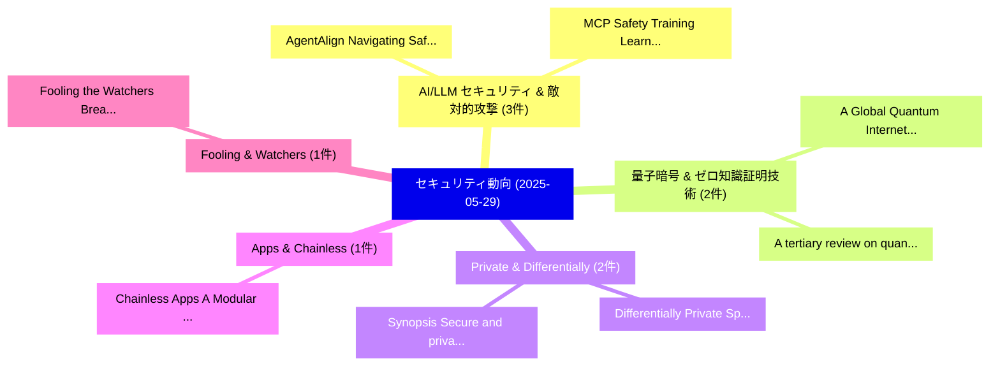

# 📅 02_daily: 日次エグゼクティブサマリー報告書 (2025-05-29)

**集計日時**: 2026-10-02 23:05:27 UTC  
**対象日付**: 2025-05-29  
**本日収集論文数**: 24 件  

---

## 💡 主要セキュリティ動向・脅威インサイト (Executive Insights)

本日の収集論文（計 24 件）において、以下の重点セキュリティ領域で活発な研究動向が確認されました：
- **AI/LLM セキュリティ & 敵対的攻撃** (3 件): 注目論文として 「AgentAlign: Navigating Safety ...」、「MCP Safety Training: Learning ...」 等が発表され、実務防御および攻撃検証の進展が見られます。
- **量子暗号 & ゼロ知識証明技術** (2 件): 注目論文として 「A Global Quantum Internet: A R...」、「A tertiary review on quantum c...」 等が発表され、実務防御および攻撃検証の進展が見られます。
- **Private & Differentially** (2 件): 注目論文として 「Differentially Private Space-E...」、「Synopsis: Secure and private t...」 等が発表され、実務防御および攻撃検証の進展が見られます。
- **Apps & Chainless** (1 件): 注目論文として 「Chainless Apps: A Modular Fram...」 等が発表され、実務防御および攻撃検証の進展が見られます。
- **Fooling & Watchers** (1 件): 注目論文として 「Fooling the Watchers: Breaking...」 等が発表され、実務防御および攻撃検証の進展が見られます。

### 🗺️ 技術・脅威トピックマインドマップ

---

## 📌 日次セキュリティ論文一覧 (日本語表形式)

| No | arXiv ID | 論文タイトル (日本語訳) | 重要キーワード | 構造化エグゼクティブ要約 (背景・提案・影響) | 脅威分類 | 詳細リンク |
|---|---|---|---|---|---|---|
| 1 | `2505.22989v1` | [Chainless Apps: A Modular Framework for Building Apps with Web2 Capability and Web3 Trust（セキュリティ分析論文）](../../okf/papers/2025-05-29/2505.22989.md) | `Chainless Apps`, `Building Apps`, `Web2 Capability` | 【提案】概要 (Overview & Key Finding) 本論文「Chainless Apps: A Modular Framework for Building Apps w...。実証評価により経営層・セキュリティ管理者向け推奨アクション (E... | `cs.CR` | [arXiv](https://arxiv.org/abs/2505.22989v1) &#124; [OKF](../../okf/papers/2025-05-29/2505.22989.md) |
| 2 | `2505.23020v1` | [AgentAlign: Navigating Safety Alignment in the Shift from Informative to Agentic 大規模言語モデル](../../okf/papers/2025-05-29/2505.23020.md) | `Navigating Safety Alignment`, `Agentic Large Language Models`, `Jinchuan Zhang` | 【提案】概要 (Overview & Key Finding) 本論文「AgentAlign: Navigating Safety Alignment in the Shift fr...。実証評価により経営層・セキュリティ管理者向け推奨アクション (E... | `cs.CR` | [arXiv](https://arxiv.org/abs/2505.23020v1) &#124; [OKF](../../okf/papers/2025-05-29/2505.23020.md) |
| 3 | `2505.23192v1` | [Fooling the Watchers: Breaking AIGC Detectors via Semantic Prompt Attacks（セキュリティ分析論文）](../../okf/papers/2025-05-29/2505.23192.md) | `Semantic Prompt Attacks`, `Run Hao`, `Peng Ying` | 【提案】概要 (Overview & Key Finding) 本論文「Fooling the Watchers: Breaking AIGC Detectors via Seman...。実証評価により経営層・セキュリティ管理者向け推奨アクション (E... | `cs.CR` | [arXiv](https://arxiv.org/abs/2505.23192v1) &#124; [OKF](../../okf/papers/2025-05-29/2505.23192.md) |
| 4 | `2505.23266v1` | [Disrupting Vision-Language Model-Driven Navigation Services via Adversarial Object Fusion（セキュリティ分析論文）](../../okf/papers/2025-05-29/2505.23266.md) | `Driven Navigation Services`, `Adversarial Object Fusion`, `Disrupting Vision` | 【提案】概要 (Overview & Key Finding) 本論文「Disrupting Vision-Language Model-Driven Navigation Serv...。実証評価により経営層・セキュリティ管理者向け推奨アクション (E... | `cs.CR` | [arXiv](https://arxiv.org/abs/2505.23266v1) &#124; [OKF](../../okf/papers/2025-05-29/2505.23266.md) |
| 5 | `2505.23357v1` | [Joint Data Hiding and Partial Encryption of Compressive Sensed Streams（セキュリティ分析論文）](../../okf/papers/2025-05-29/2505.23357.md) | `Joint Data Hiding`, `Compressive Sensed Streams`, `Partial Encryption` | 【提案】概要 (Overview & Key Finding) 本論文「Joint Data Hiding and Partial Encryption of Compressive...。実証評価により経営層・セキュリティ管理者向け推奨アクション (E... | `cs.CR` | [arXiv](https://arxiv.org/abs/2505.23357v1) &#124; [OKF](../../okf/papers/2025-05-29/2505.23357.md) |
| 6 | `2505.23397v3` | [A Unified Framework for Human AI Collaboration in Security Operations Centers with Trusted Autonomy（セキュリティ分析論文）](../../okf/papers/2025-05-29/2505.23397.md) | `Security Operations Centers`, `Trusted Autonomy`, `Security Operations Ce` | 【提案】概要 (Overview & Key Finding) 本論文「A Unified Framework for Human AI Collaboration in Secur...。実証評価により経営層・セキュリティ管理者向け推奨アクション (E... | `cs.CR` | [arXiv](https://arxiv.org/abs/2505.23397v3) &#124; [OKF](../../okf/papers/2025-05-29/2505.23397.md) |
| 7 | `2505.23561v1` | [Merge Hijacking: Backdoor Attacks to Model Merging of 大規模言語モデル](../../okf/papers/2025-05-29/2505.23561.md) | `Merge Hijacking`, `Backdoor Attacks`, `Model Merging` | 【提案】概要 (Overview & Key Finding) 本論文「Merge Hijacking: Backdoor Attacks to Model Merging of 大...。実証評価により経営層・セキュリティ管理者向け推奨アクション (E... | `cs.CR` | [arXiv](https://arxiv.org/abs/2505.23561v1) &#124; [OKF](../../okf/papers/2025-05-29/2505.23561.md) |
| 8 | `2505.23581v2` | [Quantum Hilbert Transform（セキュリティ分析論文）](../../okf/papers/2025-05-29/2505.23581.md) | `Quantum Hilbert Transform`, `Nitin Jha`, `Abhishek Parakh` | 【提案】概要 (Overview & Key Finding) 本論文「量子 Hilbert Transform（セキュリティ分析論文）」（原題: 量子 Hilbert Transf...。実証評価により経営層・セキュリティ管理者向け推奨アクション (E... | `cs.CR` | [arXiv](https://arxiv.org/abs/2505.23581v2) &#124; [OKF](../../okf/papers/2025-05-29/2505.23581.md) |
| 9 | `2505.23603v1` | [A Global Quantum Internet: A Review of Challenges Facing Aerial Quantum Networksに向けて](../../okf/papers/2025-05-29/2505.23603.md) | `Global Quantum Internet`, `Challenges Facing Aerial Quantum Networks`, `Challenges Facing Aerial Quantum` | 【提案】概要 (Overview & Key Finding) 本論文「A Global 量子 Internet: A Review of Challenges Facing Aer...。実証評価により経営層・セキュリティ管理者向け推奨アクション (E... | `cs.CR` | [arXiv](https://arxiv.org/abs/2505.23603v1) &#124; [OKF](../../okf/papers/2025-05-29/2505.23603.md) |
| 10 | `2505.23634v1` | [MCP Safety Training: Learning to Refuse Falsely Benign MCP Exploits using Improved Preference Alignment（セキュリティ分析論文）](../../okf/papers/2025-05-29/2505.23634.md) | `Refuse Falsely Benign`, `Improved Preference Alignment`, `Safety Training` | 【提案】概要 (Overview & Key Finding) 本論文「MCP Safety Training: Learning to Refuse Falsely Benign ...。実証評価により経営層・セキュリティ管理者向け推奨アクション (E... | `cs.CR` | [arXiv](https://arxiv.org/abs/2505.23634v1) &#124; [OKF](../../okf/papers/2025-05-29/2505.23634.md) |
| 11 | `2505.23643v2` | [AI Agents with Information-Flow Controlのセキュリティ強化](../../okf/papers/2025-05-29/2505.23643.md) | `Flow Control`, `Information-Flow Control`, `Manuel Costa` | 【提案】概要 (Overview & Key Finding) 本論文「AI Agents with Information-Flow Controlのセキュリティ強化」（原題: S...。実証評価により経営層・セキュリティ管理者向け推奨アクション (E... | `cs.CR` | [arXiv](https://arxiv.org/abs/2505.23643v2) &#124; [OKF](../../okf/papers/2025-05-29/2505.23643.md) |
| 12 | `2505.23655v3` | [Keyed Chaotic Dynamics for Privacy-Preserving Neural Inference（セキュリティ分析論文）](../../okf/papers/2025-05-29/2505.23655.md) | `Keyed Chaotic Dynamics`, `Preserving Neural Inference`, `Privacy-Preserving Neural` | 【提案】概要 (Overview & Key Finding) 本論文「Keyed Chaotic Dynamics for Privacy-Preserving Neural In...。実証評価により経営層・セキュリティ管理者向け推奨アクション (E... | `cs.CR` | [arXiv](https://arxiv.org/abs/2505.23655v3) &#124; [OKF](../../okf/papers/2025-05-29/2505.23655.md) |
| 13 | `2505.23658v1` | [Bayesian Perspective on Memorization and Reconstruction（セキュリティ分析論文）](../../okf/papers/2025-05-29/2505.23658.md) | `Bayesian Perspective`, `Haim Kaplan`, `Yishay Mansour` | 【提案】概要 (Overview & Key Finding) 本論文「Bayesian Perspective on Memorization and Reconstruction...。実証評価により経営層・セキュリティ管理者向け推奨アクション (E... | `cs.CR` | [arXiv](https://arxiv.org/abs/2505.23658v1) &#124; [OKF](../../okf/papers/2025-05-29/2505.23658.md) |
| 14 | `2505.23682v1` | [Differentially Private Space-Efficient Algorithms for Counting Distinct Elements in the Turnstile Model（セキュリティ分析論文）](../../okf/papers/2025-05-29/2505.23682.md) | `Differentially Private Space`, `Counting Distinct Elements`, `Efficient Algorithms` | 【提案】概要 (Overview & Key Finding) 本論文「Differentially Private Space-Efficient Algorithms for C...。実証評価により経営層・セキュリティ管理者向け推奨アクション (E... | `cs.CR` | [arXiv](https://arxiv.org/abs/2505.23682v1) &#124; [OKF](../../okf/papers/2025-05-29/2505.23682.md) |
| 15 | `2505.23873v2` | [KGMark: A Diffusion Watermark for Knowledge Graphs（セキュリティ分析論文）](../../okf/papers/2025-05-29/2505.23873.md) | `Diffusion Watermark`, `Knowledge Graphs`, `Hongrui Peng` | 【提案】概要 (Overview & Key Finding) 本論文「KGMark: A Diffusion Watermark for Knowledge Graphs（セキュリ...。実証評価により経営層・セキュリティ管理者向け推奨アクション (E... | `cs.CR` | [arXiv](https://arxiv.org/abs/2505.23873v2) &#124; [OKF](../../okf/papers/2025-05-29/2505.23873.md) |
| 16 | `2505.23880v1` | [Synopsis: Secure and private trend inference from encrypted semantic embeddings（セキュリティ分析論文）](../../okf/papers/2025-05-29/2505.23880.md) | `Madelyne Xiao`, `Palak Jain`, `Micha Gorelick` | 【提案】概要 (Overview & Key Finding) 本論文「Synopsis: Secure and private trend inference from encry...。実証評価により経営層・セキュリティ管理者向け推奨アクション (E... | `cs.CR` | [arXiv](https://arxiv.org/abs/2505.23880v1) &#124; [OKF](../../okf/papers/2025-05-29/2505.23880.md) |
| 17 | `2505.23938v1` | [Digital Forensic Investigation of the ChatGPT Windows Application（セキュリティ分析論文）](../../okf/papers/2025-05-29/2505.23938.md) | `Digital Forensic Investigation`, `Windows Application`, `Malithi Wanniarachchi Kankanamge` | 【提案】概要 (Overview & Key Finding) 本論文「Digital Forensic Investigation of the ChatGPT Windows A...。実証評価により経営層・セキュリティ管理者向け推奨アクション (E... | `cs.CR` | [arXiv](https://arxiv.org/abs/2505.23938v1) &#124; [OKF](../../okf/papers/2025-05-29/2505.23938.md) |
| 18 | `2505.23968v1` | [Confidential Guardian: Cryptographically Prohibiting the Abuse of Model Abstention（セキュリティ分析論文）](../../okf/papers/2025-05-29/2505.23968.md) | `Confidential Guardian`, `Cryptographically Prohibiting`, `Model Abstention` | 【提案】概要 (Overview & Key Finding) 本論文「Confidential Guardian: Cryptographically Prohibiting th...。実証評価により経営層・セキュリティ管理者向け推奨アクション (E... | `cs.CR` | [arXiv](https://arxiv.org/abs/2505.23968v1) &#124; [OKF](../../okf/papers/2025-05-29/2505.23968.md) |
| 19 | `2505.24008v3` | [HoneySat: A Network-based Satellite Honeypot Framework（セキュリティ分析論文）](../../okf/papers/2025-05-29/2505.24008.md) | `Network-based Satellite`, `Ulysse Planta`, `Gabriele Marra` | 【提案】概要 (Overview & Key Finding) 本論文「HoneySat: A Network-based Satellite Honeypot Framework（...。実証評価により経営層・セキュリティ管理者向け推奨アクション (E... | `cs.CR` | [arXiv](https://arxiv.org/abs/2505.24008v3) &#124; [OKF](../../okf/papers/2025-05-29/2505.24008.md) |
| 20 | `2505.24019v1` | [LLMエージェント Should Employ Security Principles](../../okf/papers/2025-05-29/2505.24019.md) | `Kaiyuan Zhang`, `Zian Su`, `Yu Chen` | 【提案】概要 (Overview & Key Finding) 本論文「LLMエージェント Should Employ Security Principles」（原題: LLM Ag...。実証評価により経営層・セキュリティ管理者向け推奨アクション (E... | `cs.CR` | [arXiv](https://arxiv.org/abs/2505.24019v1) &#124; [OKF](../../okf/papers/2025-05-29/2505.24019.md) |
| 21 | `2505.24021v1` | [An Advanced Cyber-Physical System Security Testbed for Substation Automation（セキュリティ分析論文）](../../okf/papers/2025-05-29/2505.24021.md) | `Physical System Security Testbed`, `Substation Automation`, `Cyber-Physical System` | 【提案】概要 (Overview & Key Finding) 本論文「An Advanced Cyber-Physical System Security Testbed for ...。実証評価により経営層・セキュリティ管理者向け推奨アクション (E... | `cs.CR` | [arXiv](https://arxiv.org/abs/2505.24021v1) &#124; [OKF](../../okf/papers/2025-05-29/2505.24021.md) |
| 22 | `2506.00062v3` | [SafeCOMM: A Study on Safety Degradation in Fine-Tuned Telecom 大規模言語モデル](../../okf/papers/2025-05-29/2506.00062.md) | `Safety Degradation`, `Fine-Tuned Telecom`, `Tuned Telecom Large Language Models` | 【提案】概要 (Overview & Key Finding) 本論文「SafeCOMM: A Study on Safety Degradation in Fine-Tuned T...。実証評価により経営層・セキュリティ管理者向け推奨アクション (E... | `cs.CR` | [arXiv](https://arxiv.org/abs/2506.00062v3) &#124; [OKF](../../okf/papers/2025-05-29/2506.00062.md) |
| 23 | `2506.02027v1` | [The End Of Universal Lifelong Identifiers: Identity Systems For The AI Era（セキュリティ分析論文）](../../okf/papers/2025-05-29/2506.02027.md) | `Shriphani Palakodety`, `Raw Meta`, `Executive Summary` | 【提案】概要 (Overview & Key Finding) 本論文「The End Of Universal Lifelong Identifiers: Identity Sys...。実証評価により経営層・セキュリティ管理者向け推奨アクション (E... | `cs.CR` | [arXiv](https://arxiv.org/abs/2506.02027v1) &#124; [OKF](../../okf/papers/2025-05-29/2506.02027.md) |
| 24 | `2506.02028v1` | [A tertiary review on quantum cryptography（セキュリティ分析論文）](../../okf/papers/2025-05-29/2506.02028.md) | `Luiz Filipi Anderson`, `Carlos Becker Westphall`, `Sousa Moura` | 【提案】概要 (Overview & Key Finding) 本論文「A tertiary review on 量子 暗号技術（セキュリティ分析論文）」（原題: A tertiar...。実証評価により経営層・セキュリティ管理者向け推奨アクション (E... | `cs.CR` | [arXiv](https://arxiv.org/abs/2506.02028v1) &#124; [OKF](../../okf/papers/2025-05-29/2506.02028.md) |

