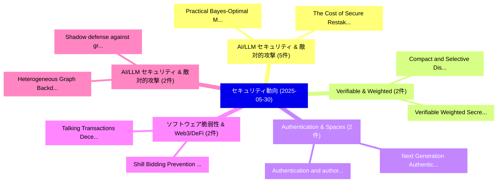

# 📅 02_daily: 日次エグゼクティブサマリー報告書 (2025-05-30)

**集計日時**: 2026-10-02 23:05:28 UTC  
**対象日付**: 2025-05-30  
**本日収集論文数**: 35 件  

---

## 💡 主要セキュリティ動向・脅威インサイト (Executive Insights)

本日の収集論文（計 35 件）において、以下の重点セキュリティ領域で活発な研究動向が確認されました：
- **AI/LLM セキュリティ & 敵対的攻撃** (5 件): 注目論文として 「Practical Bayes-Optimal Member...」、「The Cost of Secure Restaking v...」 等が発表され、実務防御および攻撃検証の進展が見られます。
- **Verifiable & Weighted** (2 件): 注目論文として 「Verifiable Weighted Secret Sha...」、「Compact and Selective Disclosu...」 等が発表され、実務防御および攻撃検証の進展が見られます。
- **Authentication & Spaces** (2 件): 注目論文として 「Next Generation Authentication...」、「Authentication and authorizati...」 等が発表され、実務防御および攻撃検証の進展が見られます。
- **ソフトウェア脆弱性 & Web3/DeFi** (2 件): 注目論文として 「Talking Transactions: Decentra...」、「Shill Bidding Prevention in De...」 等が発表され、実務防御および攻撃検証の進展が見られます。
- **AI/LLM セキュリティ & 敵対的攻撃** (2 件): 注目論文として 「Heterogeneous Graph Backdoor A...」、「Shadow defense against gradien...」 等が発表され、実務防御および攻撃検証の進展が見られます。

### 🗺️ 技術・脅威トピックマインドマップ

---

## 📌 日次セキュリティ論文一覧 (日本語表形式)

| No | arXiv ID | 論文タイトル (日本語訳) | 重要キーワード | 構造化エグゼクティブ要約 (背景・提案・影響) | 脅威分類 | 詳細リンク |
|---|---|---|---|---|---|---|
| 1 | `2505.24089v2` | [Practical Bayes-Optimal Membership Inference Attacks（セキュリティ分析論文）](../../okf/papers/2025-05-30/2505.24089.md) | `Optimal Membership Inference Attacks`, `Practical Bayes`, `Bayes-Optimal Membership` | 【提案】概要 (Overview & Key Finding) 本論文「Practical Bayes-Optimal Membership Inference Attacks（セキ...。実証評価により経営層・セキュリティ管理者向け推奨アクション (E... | `cs.CR` | [arXiv](https://arxiv.org/abs/2505.24089v2) &#124; [OKF](../../okf/papers/2025-05-30/2505.24089.md) |
| 2 | `2505.24227v1` | [Light as Deception: GPT-driven Natural Relighting Against Vision-Language Pre-training Models（セキュリティ分析論文）](../../okf/papers/2025-05-30/2505.24227.md) | `Language Pre`, `GPT-driven Natural`, `Vision-Language Pre` | 【提案】概要 (Overview & Key Finding) 本論文「Light as Deception: GPT-driven Natural Relighting Again...。実証評価により経営層・セキュリティ管理者向け推奨アクション (E... | `cs.CR` | [arXiv](https://arxiv.org/abs/2505.24227v1) &#124; [OKF](../../okf/papers/2025-05-30/2505.24227.md) |
| 3 | `2505.24231v1` | [Dynamic Malware Classification of Windows PE Files using CNNs and Greyscale Images Derived from Runtime API Call Argument Conversion（セキュリティ分析論文）](../../okf/papers/2025-05-30/2505.24231.md) | `Dynamic Malware Classification`, `Greyscale Images Derived`, `Call Argument Conversion` | 【提案】概要 (Overview & Key Finding) 本論文「Dynamic マルウェア Classification of Windows PE Files using ...。実証評価により経営層・セキュリティ管理者向け推奨アクション (E... | `cs.CR` | [arXiv](https://arxiv.org/abs/2505.24231v1) &#124; [OKF](../../okf/papers/2025-05-30/2505.24231.md) |
| 4 | `2505.24252v1` | [A Reward-driven Automated Webshell Malicious-code Generator for Red-teaming（セキュリティ分析論文）](../../okf/papers/2025-05-30/2505.24252.md) | `Automated Webshell Malicious`, `Reward-driven Automated`, `Malicious-code Generator` | 【提案】概要 (Overview & Key Finding) 本論文「A Reward-driven Automated Webshell Malicious-code Gener...。実証評価により経営層・セキュリティ管理者向け推奨アクション (E... | `cs.CR` | [arXiv](https://arxiv.org/abs/2505.24252v1) &#124; [OKF](../../okf/papers/2025-05-30/2505.24252.md) |
| 5 | `2505.24267v1` | [MUSE: Model-Agnostic Tabular Watermarking via Multi-Sample Selection（セキュリティ分析論文）](../../okf/papers/2025-05-30/2505.24267.md) | `Agnostic Tabular Watermarking`, `Sample Selection`, `Model-Agnostic Tabular` | 【提案】概要 (Overview & Key Finding) 本論文「MUSE: Model-Agnostic Tabular Watermarking via Multi-Sam...。実証評価により経営層・セキュリティ管理者向け推奨アクション (E... | `cs.CR` | [arXiv](https://arxiv.org/abs/2505.24267v1) &#124; [OKF](../../okf/papers/2025-05-30/2505.24267.md) |
| 6 | `2505.24284v1` | [Transaction Proximity: A Graph-Based Approach to Blockchain Fraud Prevention（セキュリティ分析論文）](../../okf/papers/2025-05-30/2505.24284.md) | `Blockchain Fraud Prevention`, `Transaction Proximity`, `Ziming Zeng` | 【提案】概要 (Overview & Key Finding) 本論文「Transaction Proximity: A Graph-Based Approach to Blockc...。実証評価により経営層・セキュリティ管理者向け推奨アクション (E... | `cs.CR` | [arXiv](https://arxiv.org/abs/2505.24284v1) &#124; [OKF](../../okf/papers/2025-05-30/2505.24284.md) |
| 7 | `2505.24289v1` | [Verifiable Weighted Secret Sharing（セキュリティ分析論文）](../../okf/papers/2025-05-30/2505.24289.md) | `Verifiable Weighted Secret Sharing`, `Kareem Shehata`, `Han Fangqi` | 【提案】概要 (Overview & Key Finding) 本論文「Verifiable Weighted Secret Sharing（セキュリティ分析論文）」（原題: Ver...。実証評価により経営層・セキュリティ管理者向け推奨アクション (E... | `cs.CR` | [arXiv](https://arxiv.org/abs/2505.24289v1) &#124; [OKF](../../okf/papers/2025-05-30/2505.24289.md) |
| 8 | `2505.24379v3` | [Unlearned but Not Forgotten: Data Extraction after Exact Unlearning in LLM（セキュリティ分析論文）](../../okf/papers/2025-05-30/2505.24379.md) | `Data Extraction`, `Exact Unlearning`, `Zhiwei Steven Wu` | 【提案】背景とセキュリティ上の課題 (Background & Problem) 本研究はサイバー脅威環境におけるセキュリティ構造・脆弱性の検証を目的としています。(主要検出項目: ...。実証評価により経営層・セキュリティ管理者向け推奨アクション (E... | `cs.CR` | [arXiv](https://arxiv.org/abs/2505.24379v3) &#124; [OKF](../../okf/papers/2025-05-30/2505.24379.md) |
| 9 | `2505.24393v2` | [Looking for Attention: Randomized Attention Test Design for Validator Monitoring in Optimistic Rollups（セキュリティ分析論文）](../../okf/papers/2025-05-30/2505.24393.md) | `Randomized Attention Test Design`, `Validator Monitoring`, `Optimistic Rollups` | 【提案】概要 (Overview & Key Finding) 本論文「Looking for Attention: Randomized Attention Test Design...。実証評価により経営層・セキュリティ管理者向け推奨アクション (E... | `cs.CR` | [arXiv](https://arxiv.org/abs/2505.24393v2) &#124; [OKF](../../okf/papers/2025-05-30/2505.24393.md) |
| 10 | `2505.24440v4` | [The Cost of Secure Restaking vs. Proof-of-Stake（セキュリティ分析論文）](../../okf/papers/2025-05-30/2505.24440.md) | `Secure Restaking`, `Akaki Mamageishvili`, `Benny Sudakov` | 【提案】概要 (Overview & Key Finding) 本論文「The Cost of Secure Restaking vs. Proof-of-Stake（セキュリティ分...。実証評価により経営層・セキュリティ管理者向け推奨アクション (E... | `cs.CR` | [arXiv](https://arxiv.org/abs/2505.24440v4) &#124; [OKF](../../okf/papers/2025-05-30/2505.24440.md) |
| 11 | `2505.24451v1` | [LPASS: Linear Probes as Stepping Stones for 脆弱性検出 using compressed LLMs](../../okf/papers/2025-05-30/2505.24451.md) | `Linear Probes`, `Stepping Stones`, `Luis Ibanez` | 【提案】概要 (Overview & Key Finding) 本論文「LPASS: Linear Probes as Stepping Stones for 脆弱性検出 using...。実証評価により経営層・セキュリティ管理者向け推奨アクション (E... | `cs.CR` | [arXiv](https://arxiv.org/abs/2505.24451v1) &#124; [OKF](../../okf/papers/2025-05-30/2505.24451.md) |
| 12 | `2505.24486v1` | [Rehearsal with Auxiliary-Informed Sampling for Audio Deepfake Detection（セキュリティ分析論文）](../../okf/papers/2025-05-30/2505.24486.md) | `Audio Deepfake Detection`, `Informed Sampling`, `Auxiliary-Informed Sampling` | 【提案】概要 (Overview & Key Finding) 本論文「Rehearsal with Auxiliary-Informed Sampling for Audio De...。実証評価により経営層・セキュリティ管理者向け推奨アクション (E... | `cs.CR` | [arXiv](https://arxiv.org/abs/2505.24486v1) &#124; [OKF](../../okf/papers/2025-05-30/2505.24486.md) |
| 13 | `2505.24536v1` | [CHIP: Chameleon Hash-based Irreversible Passport for Robust Deep Model Ownership Verification and Active Usage Control（セキュリティ分析論文）](../../okf/papers/2025-05-30/2505.24536.md) | `Robust Deep Model Ownership Verification`, `Active Usage Control`, `Chameleon Hash` | 【提案】概要 (Overview & Key Finding) 本論文「CHIP: Chameleon Hash-based Irreversible Passport for Ro...。実証評価により経営層・セキュリティ管理者向け推奨アクション (E... | `cs.CR` | [arXiv](https://arxiv.org/abs/2505.24536v1) &#124; [OKF](../../okf/papers/2025-05-30/2505.24536.md) |
| 14 | `2505.24685v1` | [So, I climbed to the top of the pyramid of pain -- now what?（セキュリティ分析論文）](../../okf/papers/2025-05-30/2505.24685.md) | `Vasilis Katos`, `Emily Rosenorn`, `Jane Henriksen` | 【提案】### (日本語題名: So, I climbed to the top of the pyramid of pain -- now what?（セキュリティ分析論文）)  ...。実証評価により経営層・セキュリティ管理者向け推奨アクション (E... | `cs.CR` | [arXiv](https://arxiv.org/abs/2505.24685v1) &#124; [OKF](../../okf/papers/2025-05-30/2505.24685.md) |
| 15 | `2505.24698v1` | [Next Generation Authentication for Data Spaces: An Authentication Flow Based On Grant Negotiation And Authorization Protocol For Verifiable Presentations (GNAP4VP)（セキュリティ分析論文）](../../okf/papers/2025-05-30/2505.24698.md) | `Next Generation Authentication`, `Data Spaces`, `Andres Munoz` | 【提案】概要 (Overview & Key Finding) 本論文「Next Generation Authentication for Data Spaces: An Auth...。実証評価により経営層・セキュリティ管理者向け推奨アクション (E... | `cs.CR` | [arXiv](https://arxiv.org/abs/2505.24698v1) &#124; [OKF](../../okf/papers/2025-05-30/2505.24698.md) |
| 16 | `2505.24703v1` | [PatchDEMUX: A Certifiably Robust Framework for Multi-label Classifiers Against Adversarial Patches（セキュリティ分析論文）](../../okf/papers/2025-05-30/2505.24703.md) | `Multi-label Classifiers`, `Dennis Jacob`, `Chong Xiang` | 【提案】概要 (Overview & Key Finding) 本論文「PatchDEMUX: A Certifiably Robust Framework for Multi-la...。実証評価により経営層・セキュリティ管理者向け推奨アクション (E... | `cs.CR` | [arXiv](https://arxiv.org/abs/2505.24703v1) &#124; [OKF](../../okf/papers/2025-05-30/2505.24703.md) |
| 17 | `2505.24724v1` | [Talking Transactions: Decentralized Communication through Ethereum Input Data Messages (IDMs)（セキュリティ分析論文）](../../okf/papers/2025-05-30/2505.24724.md) | `Ethereum Input Data Messages`, `Talking Transactions`, `Decentralized Communication` | 【提案】概要 (Overview & Key Finding) 本論文「Talking Transactions: Decentralized Communication throu...。実証評価により経営層・セキュリティ管理者向け推奨アクション (E... | `cs.CR` | [arXiv](https://arxiv.org/abs/2505.24724v1) &#124; [OKF](../../okf/papers/2025-05-30/2505.24724.md) |
| 18 | `2505.24742v1` | [Authentication and authorization in Data Spaces: A relationship-based access control approach for policy specification based on ODRL（セキュリティ分析論文）](../../okf/papers/2025-05-30/2505.24742.md) | `Data Spaces`, `relationship-based access`, `Irene Plaza` | 【提案】概要 (Overview & Key Finding) 本論文「Authentication and authorization in Data Spaces: A rela...。実証評価により経営層・セキュリティ管理者向け推奨アクション (E... | `cs.CR` | [arXiv](https://arxiv.org/abs/2505.24742v1) &#124; [OKF](../../okf/papers/2025-05-30/2505.24742.md) |
| 19 | `2505.24842v2` | [Cascading Adversarial Bias from Injection to Distillation in Language Models（セキュリティ分析論文）](../../okf/papers/2025-05-30/2505.24842.md) | `Cascading Adversarial Bias`, `Language Models`, `Harsh Chaudhari` | 【提案】概要 (Overview & Key Finding) 本論文「Cascading Adversarial Bias from Injection to Distillati...。実証評価により経営層・セキュリティ管理者向け推奨アクション (E... | `cs.CR` | [arXiv](https://arxiv.org/abs/2505.24842v2) &#124; [OKF](../../okf/papers/2025-05-30/2505.24842.md) |
| 20 | `2506.00100v2` | [Children's Voice Privacy: First Steps And Emerging Challenges（セキュリティ分析論文）](../../okf/papers/2025-05-30/2506.00100.md) | `Voice Privacy`, `Mathew Magimai Doss`, `Ajinkya Kulkarni` | 【提案】概要 (Overview & Key Finding) 本論文「Children's Voice Privacy: First Steps And Emerging Chal...。実証評価により経営層・セキュリティ管理者向け推奨アクション (E... | `cs.CR` | [arXiv](https://arxiv.org/abs/2506.00100v2) &#124; [OKF](../../okf/papers/2025-05-30/2506.00100.md) |
| 21 | `2506.00124v1` | [randextract: a Reference Library to Test and Validate Privacy Amplification Implementations（セキュリティ分析論文）](../../okf/papers/2025-05-30/2506.00124.md) | `Validate Privacy Amplification Implementations`, `Reference Library`, `Raw Meta` | 【提案】概要 (Overview & Key Finding) 本論文「randextract: a Reference Library to Test and Validate P...。実証評価により経営層・セキュリティ管理者向け推奨アクション (E... | `cs.CR` | [arXiv](https://arxiv.org/abs/2506.00124v1) &#124; [OKF](../../okf/papers/2025-05-30/2506.00124.md) |
| 22 | `2506.00191v1` | [Heterogeneous Graph Backdoor Attack（セキュリティ分析論文）](../../okf/papers/2025-05-30/2506.00191.md) | `Heterogeneous Graph Backdoor Attack`, `Jiawei Chen`, `Lusi Li` | 【提案】概要 (Overview & Key Finding) 本論文「Heterogeneous Graph Backdoor Attack（セキュリティ分析論文）」（原題: He...。実証評価により経営層・セキュリティ管理者向け推奨アクション (E... | `cs.CR` | [arXiv](https://arxiv.org/abs/2506.00191v1) &#124; [OKF](../../okf/papers/2025-05-30/2506.00191.md) |
| 23 | `2506.00197v1` | [When GPT Spills the Tea: Comprehensive Assessment of Knowledge File Leakage in GPTs（セキュリティ分析論文）](../../okf/papers/2025-05-30/2506.00197.md) | `Knowledge File Leakage`, `Comprehensive Assessment`, `Xinyue Shen` | 【提案】概要 (Overview & Key Finding) 本論文「When GPT Spills the Tea: Comprehensive Assessment of Kn...。実証評価により経営層・セキュリティ管理者向け推奨アクション (E... | `cs.CR` | [arXiv](https://arxiv.org/abs/2506.00197v1) &#124; [OKF](../../okf/papers/2025-05-30/2506.00197.md) |
| 24 | `2506.00201v1` | [Hush! Protecting Secrets During Model Training: An Indistinguishability Approach（セキュリティ分析論文）](../../okf/papers/2025-05-30/2506.00201.md) | `Arun Ganesh`, `Milad Nasr`, `Thomas Steinke` | 【提案】Protecting Secrets During Model Training: An Indistinguishability Approach（セキュリティ分析論文）)...。実証評価により経営層・セキュリティ管理者向け推奨アクション (E... | `cs.CR` | [arXiv](https://arxiv.org/abs/2506.00201v1) &#124; [OKF](../../okf/papers/2025-05-30/2506.00201.md) |
| 25 | `2506.00262v2` | [Compact and Selective Disclosure for Verifiable Credentials（セキュリティ分析論文）](../../okf/papers/2025-05-30/2506.00262.md) | `Selective Disclosure`, `Verifiable Credentials`, `Alessandro Buldini` | 【提案】概要 (Overview & Key Finding) 本論文「Compact and Selective Disclosure for Verifiable Credent...。実証評価により経営層・セキュリティ管理者向け推奨アクション (E... | `cs.CR` | [arXiv](https://arxiv.org/abs/2506.00262v2) &#124; [OKF](../../okf/papers/2025-05-30/2506.00262.md) |
| 26 | `2506.00274v1` | [Chances and Challenges of the Model Context Protocol in Digital Forensics and Incident Response（セキュリティ分析論文）](../../okf/papers/2025-05-30/2506.00274.md) | `Model Context Protocol`, `Digital Forensics`, `Incident Response` | 【提案】概要 (Overview & Key Finding) 本論文「Chances and Challenges of the Model Context Protocol in...。実証評価により経営層・セキュリティ管理者向け推奨アクション (E... | `cs.CR` | [arXiv](https://arxiv.org/abs/2506.00274v1) &#124; [OKF](../../okf/papers/2025-05-30/2506.00274.md) |
| 27 | `2506.00280v1` | [3D Gaussian Splat Vulnerabilities（セキュリティ分析論文）](../../okf/papers/2025-05-30/2506.00280.md) | `Gaussian Splat Vulnerabilities`, `Matthew Hull`, `Haoyang Yang` | 【提案】概要 (Overview & Key Finding) 本論文「3D Gaussian Splat Vulnerabilities（セキュリティ分析論文）」（原題: 3D G...。実証評価によりLunardi, Martin Andreoni,... | `cs.CR` | [arXiv](https://arxiv.org/abs/2506.00280v1) &#124; [OKF](../../okf/papers/2025-05-30/2506.00280.md) |
| 28 | `2506.00281v1` | [Adversarial Threat Vectors and Risk Mitigation for Retrieval-Augmented Generation Systems（セキュリティ分析論文）](../../okf/papers/2025-05-30/2506.00281.md) | `Adversarial Threat Vectors`, `Augmented Generation Systems`, `Risk Mitigation` | 【提案】概要 (Overview & Key Finding) 本論文「Adversarial 脅威 Vectors and Risk Mitigation for Retrieva...。実証評価により経営層・セキュリティ管理者向け推奨アクション (E... | `cs.CR` | [arXiv](https://arxiv.org/abs/2506.00281v1) &#124; [OKF](../../okf/papers/2025-05-30/2506.00281.md) |
| 29 | `2506.00282v1` | [Shill Bidding Prevention in Decentralized Auctions Using Smart Contracts（セキュリティ分析論文）](../../okf/papers/2025-05-30/2506.00282.md) | `Decentralized Auctions Using Smart Contracts`, `Shill Bidding Prevention`, `Raw Meta` | 【提案】概要 (Overview & Key Finding) 本論文「Shill Bidding Prevention in Decentralized Auctions Usin...。実証評価によりMontanaro, N.。 | `cs.CR` | [arXiv](https://arxiv.org/abs/2506.00282v1) &#124; [OKF](../../okf/papers/2025-05-30/2506.00282.md) |
| 30 | `2506.00313v1` | [Data Flows in You: and Improving Static Data-flow Analysis on Binary Executablesのベンチマーク評価](../../okf/papers/2025-05-30/2506.00313.md) | `Improving Static Data`, `Data Flows`, `Binary Executables` | 【提案】概要 (Overview & Key Finding) 本論文「Data Flows in You: and Improving Static Data-flow Analy...。実証評価により経営層・セキュリティ管理者向け推奨アクション (E... | `cs.CR` | [arXiv](https://arxiv.org/abs/2506.00313v1) &#124; [OKF](../../okf/papers/2025-05-30/2506.00313.md) |
| 31 | `2506.02030v1` | [Adaptive Privacy-Preserving SSD（セキュリティ分析論文）](../../okf/papers/2025-05-30/2506.02030.md) | `Adaptive Privacy`, `Privacy-Preserving SSD`, `Na Young Ahn` | 【提案】概要 (Overview & Key Finding) 本論文「Adaptive Privacy-Preserving SSD（セキュリティ分析論文）」（原題: Adapti...。実証評価により経営層・セキュリティ管理者向け推奨アクション (E... | `cs.CR` | [arXiv](https://arxiv.org/abs/2506.02030v1) &#124; [OKF](../../okf/papers/2025-05-30/2506.02030.md) |
| 32 | `2506.02032v2` | [Secure MLOps: Surveying Attacks, Mitigation Strategies, and Research Challengesに向けて](../../okf/papers/2025-05-30/2506.02032.md) | `Surveying Attacks`, `Mitigation Strategies`, `Towards Secure` | 【提案】概要 (Overview & Key Finding) 本論文「Secure MLOps: Surveying Attacks, Mitigation Strategies,...。実証評価により経営層・セキュリティ管理者向け推奨アクション (E... | `cs.CR` | [arXiv](https://arxiv.org/abs/2506.02032v2) &#124; [OKF](../../okf/papers/2025-05-30/2506.02032.md) |
| 33 | `2506.05374v3` | [A New Representation of Binary Sequences by means of Boolean Functions（セキュリティ分析論文）](../../okf/papers/2025-05-30/2506.05374.md) | `New Representation`, `Binary Sequences`, `Boolean Functions` | 【提案】概要 (Overview & Key Finding) 本論文「A New Representation of Binary Sequences by means of Bo...。実証評価によりRequena, M.。 | `cs.CR` | [arXiv](https://arxiv.org/abs/2506.05374v3) &#124; [OKF](../../okf/papers/2025-05-30/2506.05374.md) |
| 34 | `2506.05376v2` | [A Red Teaming Roadmap System-Level Safetyに向けて](../../okf/papers/2025-05-30/2506.05376.md) | `Red Teaming Roadmap Towards System`, `Red Teaming Roadmap System`, `Level Safety` | 【提案】概要 (Overview & Key Finding) 本論文「A Red Teaming Roadmap System-Level Safetyに向けて」（原題: A Re...。実証評価によりPrimack, Julian Michael -... | `cs.CR` | [arXiv](https://arxiv.org/abs/2506.05376v2) &#124; [OKF](../../okf/papers/2025-05-30/2506.05376.md) |
| 35 | `2506.15711v1` | [Shadow defense against gradient inversion attack in 連合学習](../../okf/papers/2025-05-30/2506.15711.md) | `Le Jiang`, `Liyan Ma`, `Guang Yang` | 【提案】概要 (Overview & Key Finding) 本論文「Shadow defense against gradient inversion attack in 連合学...。実証評価により経営層・セキュリティ管理者向け推奨アクション (E... | `cs.CR` | [arXiv](https://arxiv.org/abs/2506.15711v1) &#124; [OKF](../../okf/papers/2025-05-30/2506.15711.md) |

