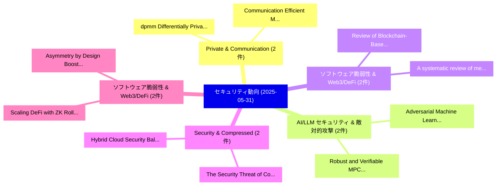

# 📅 02_daily: 日次エグゼクティブサマリー報告書 (2025-05-31)

**集計日時**: 2026-10-02 23:05:28 UTC  
**対象日付**: 2025-05-31  
**本日収集論文数**: 24 件  

---

## 💡 主要セキュリティ動向・脅威インサイト (Executive Insights)

本日の収集論文（計 24 件）において、以下の重点セキュリティ領域で活発な研究動向が確認されました：
- **Private & Communication** (2 件): 注目論文として 「dpmm: Differentially Private M...」、「Communication Efficient Multip...」 等が発表され、実務防御および攻撃検証の進展が見られます。
- **AI/LLM セキュリティ & 敵対的攻撃** (2 件): 注目論文として 「Adversarial Machine Learning f...」、「Robust and Verifiable MPC with...」 等が発表され、実務防御および攻撃検証の進展が見られます。
- **ソフトウェア脆弱性 & Web3/DeFi** (2 件): 注目論文として 「A systematic review of metaheu...」、「Review of Blockchain-Based App...」 等が発表され、実務防御および攻撃検証の進展が見られます。
- **Security & Compressed** (2 件): 注目論文として 「Hybrid Cloud Security: Balanci...」、「The Security Threat of Compres...」 等が発表され、実務防御および攻撃検証の進展が見られます。
- **ソフトウェア脆弱性 & Web3/DeFi** (2 件): 注目論文として 「Scaling DeFi with ZK Rollups: ...」、「Asymmetry by Design: Boosting ...」 等が発表され、実務防御および攻撃検証の進展が見られます。

### 🗺️ 技術・脅威トピックマインドマップ

---

## 📌 日次セキュリティ論文一覧 (日本語表形式)

| No | arXiv ID | 論文タイトル (日本語訳) | 重要キーワード | 構造化エグゼクティブ要約 (背景・提案・影響) | 脅威分類 | 詳細リンク |
|---|---|---|---|---|---|---|
| 1 | `2506.00317v2` | [Local Frames: Exploiting Inherited Origins to Bypass Content Blockers（セキュリティ分析論文）](../../okf/papers/2025-05-31/2506.00317.md) | `Exploiting Inherited Origins`, `Bypass Content Blockers`, `Local Frames` | 【提案】概要 (Overview & Key Finding) 本論文「Local Frames: Exploiting Inherited Origins to Bypass Co...。実証評価により経営層・セキュリティ管理者向け推奨アクション (E... | `cs.CR` | [arXiv](https://arxiv.org/abs/2506.00317v2) &#124; [OKF](../../okf/papers/2025-05-31/2506.00317.md) |
| 2 | `2506.00322v1` | [dpmm: Differentially Private Marginal Models, a Library for Synthetic Tabular Data Generation（セキュリティ分析論文）](../../okf/papers/2025-05-31/2506.00322.md) | `Differentially Private Marginal Models`, `Synthetic Tabular Data Generation`, `Sofiane Mahiou` | 【提案】概要 (Overview & Key Finding) 本論文「dpmm: Differentially Private Marginal Models, a Library...。実証評価により経営層・セキュリティ管理者向け推奨アクション (E... | `cs.CR` | [arXiv](https://arxiv.org/abs/2506.00322v1) &#124; [OKF](../../okf/papers/2025-05-31/2506.00322.md) |
| 3 | `2506.00359v1` | [Keeping an Eye on LLM Unlearning: The Hidden Risk and Remedy（セキュリティ分析論文）](../../okf/papers/2025-05-31/2506.00359.md) | `Hui Liu`, `Jie Ren`, `Zhenwei Dai` | 【提案】概要 (Overview & Key Finding) 本論文「Keeping an Eye on LLM Unlearning: The Hidden Risk and R...。実証評価により経営層・セキュリティ管理者向け推奨アクション (E... | `cs.CR` | [arXiv](https://arxiv.org/abs/2506.00359v1) &#124; [OKF](../../okf/papers/2025-05-31/2506.00359.md) |
| 4 | `2506.00373v1` | [Adversarial Machine Learning for Robust Password Strength Estimation（セキュリティ分析論文）](../../okf/papers/2025-05-31/2506.00373.md) | `Robust Password Strength Estimation`, `Adversarial Machine Learning`, `Pappu Jha` | 【提案】概要 (Overview & Key Finding) 本論文「Adversarial Machine Learning for Robust Password Streng...。実証評価により経営層・セキュリティ管理者向け推奨アクション (E... | `cs.CR` | [arXiv](https://arxiv.org/abs/2506.00373v1) &#124; [OKF](../../okf/papers/2025-05-31/2506.00373.md) |
| 5 | `2506.00377v4` | [A systematic review of metaheuristics-based and machine learning-driven intrusion detection systems in IoT（セキュリティ分析論文）](../../okf/papers/2025-05-31/2506.00377.md) | `learning-driven intrusion`, `Mohammad Shamim Ahsan`, `Salekul Islam` | 【提案】概要 (Overview & Key Finding) 本論文「A systematic review of metaheuristics-based and machine...。実証評価により経営層・セキュリティ管理者向け推奨アクション (E... | `cs.CR` | [arXiv](https://arxiv.org/abs/2506.00377v4) &#124; [OKF](../../okf/papers/2025-05-31/2506.00377.md) |
| 6 | `2506.00416v2` | [Blockchain-Enabled Privacy-Preserving Second-Order Federated Edge Learning in Personalized Healthcare（セキュリティ分析論文）](../../okf/papers/2025-05-31/2506.00416.md) | `Order Federated Edge Learning`, `Enabled Privacy`, `Preserving Second` | 【提案】概要 (Overview & Key Finding) 本論文「Blockchain-Enabled Privacy-Preserving Second-Order Fede...。実証評価により経営層・セキュリティ管理者向け推奨アクション (E... | `cs.CR` | [arXiv](https://arxiv.org/abs/2506.00416v2) &#124; [OKF](../../okf/papers/2025-05-31/2506.00416.md) |
| 7 | `2506.00419v2` | [Teaching an Old LLM Secure Coding: Localized Preference Optimization on Distilled Preferences（セキュリティ分析論文）](../../okf/papers/2025-05-31/2506.00419.md) | `Localized Preference Optimization`, `Secure Coding`, `Distilled Preferences` | 【提案】概要 (Overview & Key Finding) 本論文「Teaching an Old LLM Secure Coding: Localized Preference...。実証評価により経営層・セキュリティ管理者向け推奨アクション (E... | `cs.CR` | [arXiv](https://arxiv.org/abs/2506.00419v2) &#124; [OKF](../../okf/papers/2025-05-31/2506.00419.md) |
| 8 | `2506.00426v1` | [Hybrid Cloud Security: Balancing Performance, Cost, and Compliance in Multi-Cloud Deployments（セキュリティ分析論文）](../../okf/papers/2025-05-31/2506.00426.md) | `Hybrid Cloud Security`, `Balancing Performance`, `Cloud Deployments` | 【提案】概要 (Overview & Key Finding) 本論文「Hybrid Cloud Security: Balancing Performance, Cost, and...。実証評価により経営層・セキュリティ管理者向け推奨アクション (E... | `cs.CR` | [arXiv](https://arxiv.org/abs/2506.00426v1) &#124; [OKF](../../okf/papers/2025-05-31/2506.00426.md) |
| 9 | `2506.00461v1` | [Bridging the Gap between Hardware Fuzzing and Industrial Verification（セキュリティ分析論文）](../../okf/papers/2025-05-31/2506.00461.md) | `Hardware Fuzzing`, `Industrial Verification`, `Ruiyang Ma` | 【提案】概要 (Overview & Key Finding) 本論文「Bridging the Gap between Hardware Fuzzing and Industria...。実証評価により経営層・セキュリティ管理者向け推奨アクション (E... | `cs.CR` | [arXiv](https://arxiv.org/abs/2506.00461v1) &#124; [OKF](../../okf/papers/2025-05-31/2506.00461.md) |
| 10 | `2506.00500v1` | [Scaling DeFi with ZK Rollups: Design, Deployment, and Evaluation of a Real-Time Proof-of-Concept（セキュリティ分析論文）](../../okf/papers/2025-05-31/2506.00500.md) | `Time Proof`, `Real-Time Proof`, `Faizan Nehal Siddiqui` | 【提案】概要 (Overview & Key Finding) 本論文「Scaling DeFi with ZK Rollups: Design, Deployment, and E...。実証評価により経営層・セキュリティ管理者向け推奨アクション (E... | `cs.CR` | [arXiv](https://arxiv.org/abs/2506.00500v1) &#124; [OKF](../../okf/papers/2025-05-31/2506.00500.md) |
| 11 | `2506.00518v1` | [Robust and Verifiable MPC with Applications to Linear Machine Learning Inference（セキュリティ分析論文）](../../okf/papers/2025-05-31/2506.00518.md) | `Linear Machine Learning Inference`, `Shen Wang`, `Jimmy Dani` | 【提案】概要 (Overview & Key Finding) 本論文「Robust and Verifiable MPC with Applications to Linear M...。実証評価により経営層・セキュリティ管理者向け推奨アクション (E... | `cs.CR` | [arXiv](https://arxiv.org/abs/2506.00518v1) &#124; [OKF](../../okf/papers/2025-05-31/2506.00518.md) |
| 12 | `2506.00534v2` | [The Security Threat of Compressed Projectors in Large Vision-Language Models（セキュリティ分析論文）](../../okf/papers/2025-05-31/2506.00534.md) | `Compressed Projectors`, `Large Vision`, `Language Models` | 【提案】概要 (Overview & Key Finding) 本論文「The Security 脅威 of Compressed Projectors in Large Visio...。実証評価により経営層・セキュリティ管理者向け推奨アクション (E... | `cs.CR` | [arXiv](https://arxiv.org/abs/2506.00534v2) &#124; [OKF](../../okf/papers/2025-05-31/2506.00534.md) |
| 13 | `2506.00548v1` | [Con Instruction: Universal Jailbreaking of Multimodal 大規模言語モデル via Non-Textual Modalities](../../okf/papers/2025-05-31/2506.00548.md) | `Con Instruction`, `Universal Jailbreaking`, `Textual Modalities` | 【提案】概要 (Overview & Key Finding) 本論文「Con Instruction: Universal ジェイルブレイクing of Multimodal 大規...。実証評価により経営層・セキュリティ管理者向け推奨アクション (E... | `cs.CR` | [arXiv](https://arxiv.org/abs/2506.00548v1) &#124; [OKF](../../okf/papers/2025-05-31/2506.00548.md) |
| 14 | `2506.00566v1` | [Communication Efficient Multiparty Private Set Intersection from Multi-Point Sequential OPRF（セキュリティ分析論文）](../../okf/papers/2025-05-31/2506.00566.md) | `Communication Efficient Multiparty Private Set Intersection`, `Point Sequential`, `Multi-Point Sequential` | 【提案】概要 (Overview & Key Finding) 本論文「Communication Efficient Multiparty Private Set Intersec...。実証評価により経営層・セキュリティ管理者向け推奨アクション (E... | `cs.CR` | [arXiv](https://arxiv.org/abs/2506.00566v1) &#124; [OKF](../../okf/papers/2025-05-31/2506.00566.md) |
| 15 | `2506.00652v4` | [Video Signature: Implicit Watermarking for Video Diffusion Models（セキュリティ分析論文）](../../okf/papers/2025-05-31/2506.00652.md) | `Video Diffusion Models`, `Video Signature`, `Implicit Watermarking` | 【提案】概要 (Overview & Key Finding) 本論文「Video Signature: Implicit Watermarking for Video Diffus...。実証評価により経営層・セキュリティ管理者向け推奨アクション (E... | `cs.CR` | [arXiv](https://arxiv.org/abs/2506.00652v4) &#124; [OKF](../../okf/papers/2025-05-31/2506.00652.md) |
| 16 | `2506.00654v1` | [Amatriciana: Exploiting Temporal GNNs for Robust and Efficient Money Laundering Detection（セキュリティ分析論文）](../../okf/papers/2025-05-31/2506.00654.md) | `Efficient Money Laundering Detection`, `Exploiting Temporal`, `Marco Di Gennaro` | 【提案】概要 (Overview & Key Finding) 本論文「Amatriciana: Exploiting Temporal GNNs for Robust and Ef...。実証評価により経営層・セキュリティ管理者向け推奨アクション (E... | `cs.CR` | [arXiv](https://arxiv.org/abs/2506.00654v1) &#124; [OKF](../../okf/papers/2025-05-31/2506.00654.md) |
| 17 | `2506.00659v1` | [PackHero: A Scalable Graph-based Approach for Efficient Packer Identification（セキュリティ分析論文）](../../okf/papers/2025-05-31/2506.00659.md) | `Efficient Packer Identification`, `Scalable Graph`, `Marco Di Gennaro` | 【提案】概要 (Overview & Key Finding) 本論文「PackHero: A Scalable Graph-based Approach for Efficient...。実証評価により経営層・セキュリティ管理者向け推奨アクション (E... | `cs.CR` | [arXiv](https://arxiv.org/abs/2506.00659v1) &#124; [OKF](../../okf/papers/2025-05-31/2506.00659.md) |
| 18 | `2506.00677v1` | [Review of Blockchain-Based Approaches to Spent Fuel Management in Nuclear Power Plants（セキュリティ分析論文）](../../okf/papers/2025-05-31/2506.00677.md) | `Spent Fuel Management`, `Nuclear Power Plants`, `Based Approaches` | 【提案】概要 (Overview & Key Finding) 本論文「Review of Blockchain-Based Approaches to Spent Fuel Man...。実証評価により経営層・セキュリティ管理者向け推奨アクション (E... | `cs.CR` | [arXiv](https://arxiv.org/abs/2506.00677v1) &#124; [OKF](../../okf/papers/2025-05-31/2506.00677.md) |
| 19 | `2506.00719v1` | [Browser Fingerprinting Using WebAssembly（セキュリティ分析論文）](../../okf/papers/2025-05-31/2506.00719.md) | `Browser Fingerprinting Using`, `Mordechai Guri`, `Dor Fibert` | 【提案】概要 (Overview & Key Finding) 本論文「Browser Fingerprinting Using WebAssembly（セキュリティ分析論文）」（原...。実証評価により経営層・セキュリティ管理者向け推奨アクション (E... | `cs.CR` | [arXiv](https://arxiv.org/abs/2506.00719v1) &#124; [OKF](../../okf/papers/2025-05-31/2506.00719.md) |
| 20 | `2506.02035v1` | [Asymmetry by Design: Boosting Cyber Defenders with Differential Access to AI（セキュリティ分析論文）](../../okf/papers/2025-05-31/2506.02035.md) | `Boosting Cyber Defenders`, `Differential Access`, `Shaun Ee` | 【提案】概要 (Overview & Key Finding) 本論文「Asymmetry by Design: Boosting Cyber Defenders with Diff...。実証評価により経営層・セキュリティ管理者向け推奨アクション (E... | `cs.CR` | [arXiv](https://arxiv.org/abs/2506.02035v1) &#124; [OKF](../../okf/papers/2025-05-31/2506.02035.md) |
| 21 | `2506.02038v1` | [Blockchain Powered Edge Intelligence for U-Healthcare in Privacy Critical and Time Sensitive Environment（セキュリティ分析論文）](../../okf/papers/2025-05-31/2506.02038.md) | `Blockchain Powered Edge Intelligence`, `Time Sensitive Environment`, `Privacy Critical` | 【提案】概要 (Overview & Key Finding) 本論文「Blockchain Powered Edge Intelligence for U-Healthcare i...。実証評価により経営層・セキュリティ管理者向け推奨アクション (E... | `cs.CR` | [arXiv](https://arxiv.org/abs/2506.02038v1) &#124; [OKF](../../okf/papers/2025-05-31/2506.02038.md) |
| 22 | `2506.02040v4` | [Beyond the Protocol: Unveiling Attack Vectors in the Model Context Protocol (MCP) Ecosystem（セキュリティ分析論文）](../../okf/papers/2025-05-31/2506.02040.md) | `Unveiling Attack Vectors`, `Model Context Protocol`, `Hao Song` | 【提案】概要 (Overview & Key Finding) 本論文「Beyond the Protocol: Unveiling Attack Vectors in the Mo...。実証評価により経営層・セキュリティ管理者向け推奨アクション (E... | `cs.CR` | [arXiv](https://arxiv.org/abs/2506.02040v4) &#124; [OKF](../../okf/papers/2025-05-31/2506.02040.md) |
| 23 | `2506.02043v1` | [Docker under Siege: Containers in the Modern Eraのセキュリティ強化](../../okf/papers/2025-05-31/2506.02043.md) | `Securing Containers`, `Modern Era`, `Gogulakrishnan Thiyagarajan` | 【提案】概要 (Overview & Key Finding) 本論文「Docker under Siege: Containers in the Modern Eraのセキュリティ...。実証評価により経営層・セキュリティ管理者向け推奨アクション (E... | `cs.CR` | [arXiv](https://arxiv.org/abs/2506.02043v1) &#124; [OKF](../../okf/papers/2025-05-31/2506.02043.md) |
| 24 | `2506.12060v2` | [Organizational Adaptation to Generative AI in サイバーセキュリティ](../../okf/papers/2025-05-31/2506.12060.md) | `Organizational Adaptation`, `Christopher Nott`, `Raw Meta` | 【提案】概要 (Overview & Key Finding) 本論文「Organizational Adaptation to Generative AI in サイバーセキュリテ...。実証評価により経営層・セキュリティ管理者向け推奨アクション (E... | `cs.CR` | [arXiv](https://arxiv.org/abs/2506.12060v2) &#124; [OKF](../../okf/papers/2025-05-31/2506.12060.md) |

