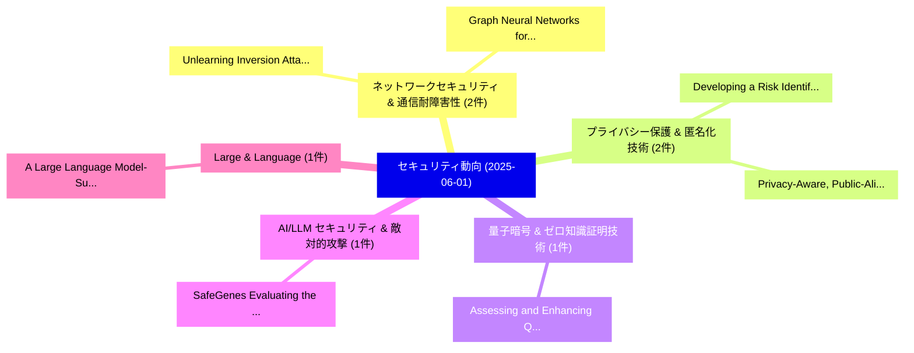

# 📅 02_daily: 日次エグゼクティブサマリー報告書 (2025-06-01)

**集計日時**: 2026-10-02 23:05:28 UTC  
**対象日付**: 2025-06-01  
**本日収集論文数**: 16 件  

---

## 💡 主要セキュリティ動向・脅威インサイト (Executive Insights)

本日の収集論文（計 16 件）において、以下の重点セキュリティ領域で活発な研究動向が確認されました：
- **ネットワークセキュリティ & 通信耐障害性** (2 件): 注目論文として 「Unlearning Inversion Attacks f...」、「Graph Neural Networks for Jamm...」 等が発表され、実務防御および攻撃検証の進展が見られます。
- **プライバシー保護 & 匿名化技術** (2 件): 注目論文として 「Privacy-Aware, Public-Aligned:...」、「Developing a Risk Identificati...」 等が発表され、実務防御および攻撃検証の進展が見られます。
- **量子暗号 & ゼロ知識証明技術** (1 件): 注目論文として 「Assessing and Enhancing Quantu...」 等が発表され、実務防御および攻撃検証の進展が見られます。
- **AI/LLM セキュリティ & 敵対的攻撃** (1 件): 注目論文として 「SafeGenes: Evaluating the Adve...」 等が発表され、実務防御および攻撃検証の進展が見られます。
- **Large & Language** (1 件): 注目論文として 「A Large Language Model-Support...」 等が発表され、実務防御および攻撃検証の進展が見られます。

### 🗺️ 技術・脅威トピックマインドマップ

---

## 📌 日次セキュリティ論文一覧 (日本語表形式)

| No | arXiv ID | 論文タイトル (日本語訳) | 重要キーワード | 構造化エグゼクティブ要約 (背景・提案・影響) | 脅威分類 | 詳細リンク |
|---|---|---|---|---|---|---|
| 1 | `2506.00790v1` | [Assessing and Enhancing Quantum Readiness in Mobile Apps（セキュリティ分析論文）](../../okf/papers/2025-06-01/2506.00790.md) | `Enhancing Quantum Readiness`, `Mobile Apps`, `Joseph Strauss` | 【提案】概要 (Overview & Key Finding) 本論文「Assessing and Enhancing 量子 Readiness in Mobile Apps（セキュ...。実証評価によりSiddique, Ibrahim Baggili... | `cs.CR` | [arXiv](https://arxiv.org/abs/2506.00790v1) &#124; [OKF](../../okf/papers/2025-06-01/2506.00790.md) |
| 2 | `2506.00808v2` | [Unlearning Inversion Attacks for Graph Neural Networks（セキュリティ分析論文）](../../okf/papers/2025-06-01/2506.00808.md) | `Unlearning Inversion Attacks`, `Graph Neural Networks`, `Jiahao Zhang` | 【提案】概要 (Overview & Key Finding) 本論文「Unlearning Inversion Attacks for Graph Neural Networks（...。実証評価により経営層・セキュリティ管理者向け推奨アクション (E... | `cs.CR` | [arXiv](https://arxiv.org/abs/2506.00808v2) &#124; [OKF](../../okf/papers/2025-06-01/2506.00808.md) |
| 3 | `2506.00821v2` | [SafeGenes: Evaluating the Adversarial Robustness of Genomic Foundation Models（セキュリティ分析論文）](../../okf/papers/2025-06-01/2506.00821.md) | `Genomic Foundation Models`, `Adversarial Robustness`, `Huixin Zhan` | 【提案】概要 (Overview & Key Finding) 本論文「SafeGenes: Evaluating the Adversarial Robustness of Gen...。実証評価により経営層・セキュリティ管理者向け推奨アクション (E... | `cs.CR` | [arXiv](https://arxiv.org/abs/2506.00821v2) &#124; [OKF](../../okf/papers/2025-06-01/2506.00821.md) |
| 4 | `2506.00831v2` | [A Large Language Model-Supported Threat Modeling Framework for Transportation Cyber-Physical Systems（セキュリティ分析論文）](../../okf/papers/2025-06-01/2506.00831.md) | `Large Language Model`, `Transportation Cyber`, `Physical Systems` | 【提案】概要 (Overview & Key Finding) 本論文「A Large Language Model-Supported 脅威 Modeling Framework ...。実証評価により経営層・セキュリティ管理者向け推奨アクション (E... | `cs.CR` | [arXiv](https://arxiv.org/abs/2506.00831v2) &#124; [OKF](../../okf/papers/2025-06-01/2506.00831.md) |
| 5 | `2506.00857v1` | [ARIANNA: An Automatic Design Flow for Fabric Customization and eFPGA Redaction（セキュリティ分析論文）](../../okf/papers/2025-06-01/2506.00857.md) | `Fabric Customization`, `Abdul Khader Thalakkattu Moosa`, `Chiara Muscari Tomajoli` | 【提案】概要 (Overview & Key Finding) 本論文「ARIANNA: An Automatic Design Flow for Fabric Customizat...。実証評価により経営層・セキュリティ管理者向け推奨アクション (E... | `cs.CR` | [arXiv](https://arxiv.org/abs/2506.00857v1) &#124; [OKF](../../okf/papers/2025-06-01/2506.00857.md) |
| 6 | `2506.00978v2` | [CAPAA: Classifier-Agnostic Projector-Based Adversarial Attack（セキュリティ分析論文）](../../okf/papers/2025-06-01/2506.00978.md) | `Based Adversarial Attack`, `Agnostic Projector`, `Classifier-Agnostic Projector` | 【提案】概要 (Overview & Key Finding) 本論文「CAPAA: Classifier-Agnostic Projector-Based 敵対的攻撃（セキュリティ...。実証評価により経営層・セキュリティ管理者向け推奨アクション (E... | `cs.CR` | [arXiv](https://arxiv.org/abs/2506.00978v2) &#124; [OKF](../../okf/papers/2025-06-01/2506.00978.md) |
| 7 | `2506.01011v1` | [Autoregressive Images Watermarking through Lexical Biasing: An Approach Resistant to Regeneration Attack（セキュリティ分析論文）](../../okf/papers/2025-06-01/2506.01011.md) | `Autoregressive Images Watermarking`, `Lexical Biasing`, `Regeneration Attack` | 【提案】概要 (Overview & Key Finding) 本論文「Autoregressive Images Watermarking through Lexical Bias...。実証評価により経営層・セキュリティ管理者向け推奨アクション (E... | `cs.CR` | [arXiv](https://arxiv.org/abs/2506.01011v1) &#124; [OKF](../../okf/papers/2025-06-01/2506.01011.md) |
| 8 | `2506.01055v1` | [Simple Prompt Injection Attacks Can Leak Personal Data Observed by LLMエージェント During Task Execution](../../okf/papers/2025-06-01/2506.01055.md) | `Simple Prompt Injection Attacks Can Leak Personal Data Observed`, `Simple Prompt Injection`, `Meysam Alizadeh` | 【提案】概要 (Overview & Key Finding) 本論文「Simple プロンプトインジェクション Attacks Can Leak Personal Data Obs...。実証評価により経営層・セキュリティ管理者向け推奨アクション (E... | `cs.CR` | [arXiv](https://arxiv.org/abs/2506.01055v1) &#124; [OKF](../../okf/papers/2025-06-01/2506.01055.md) |
| 9 | `2506.01072v1` | [IDCloak: A Practical Secure Multi-party Dataset Join Framework for Vertical Privacy-preserving Machine Learning（セキュリティ分析論文）](../../okf/papers/2025-06-01/2506.01072.md) | `Practical Secure Multi`, `Vertical Privacy`, `Machine Learning` | 【提案】概要 (Overview & Key Finding) 本論文「IDCloak: A Practical Secure Multi-party Dataset Join Fr...。実証評価により経営層・セキュリティ管理者向け推奨アクション (E... | `cs.CR` | [arXiv](https://arxiv.org/abs/2506.01072v1) &#124; [OKF](../../okf/papers/2025-06-01/2506.01072.md) |
| 10 | `2506.01162v2` | [Nearly-Linear Time Private Hypothesis Selection with the Optimal Approximation Factor（セキュリティ分析論文）](../../okf/papers/2025-06-01/2506.01162.md) | `Linear Time Private Hypothesis Selection`, `Optimal Approximation Factor`, `Nearly-Linear Time` | 【提案】概要 (Overview & Key Finding) 本論文「Nearly-Linear Time Private Hypothesis Selection with th...。実証評価により経営層・セキュリティ管理者向け推奨アクション (E... | `cs.CR` | [arXiv](https://arxiv.org/abs/2506.01162v2) &#124; [OKF](../../okf/papers/2025-06-01/2506.01162.md) |
| 11 | `2506.02048v2` | [Improving LLMエージェント with Reinforcement Learning on Cryptographic CTF Challenges](../../okf/papers/2025-06-01/2506.02048.md) | `Reinforcement Learning`, `Lajos Muzsai`, `David Imolai` | 【提案】概要 (Overview & Key Finding) 本論文「Improving LLMエージェント with Reinforcement Learning on Cryp...。実証評価により経営層・セキュリティ管理者向け推奨アクション (E... | `cs.CR` | [arXiv](https://arxiv.org/abs/2506.02048v2) &#124; [OKF](../../okf/papers/2025-06-01/2506.02048.md) |
| 12 | `2506.02054v2` | [Quantum Key Distribution by Quantum Energy Teleportation（セキュリティ分析論文）](../../okf/papers/2025-06-01/2506.02054.md) | `Quantum Key Distribution`, `Quantum Energy Teleportation`, `Shlomi Dolev` | 【提案】概要 (Overview & Key Finding) 本論文「量子鍵配送 by 量子 Energy Teleportation（セキュリティ分析論文）」（原題: 量子鍵配送...。実証評価により経営層・セキュリティ管理者向け推奨アクション (E... | `cs.CR` | [arXiv](https://arxiv.org/abs/2506.02054v2) &#124; [OKF](../../okf/papers/2025-06-01/2506.02054.md) |
| 13 | `2506.02063v1` | [Privacy-Aware, Public-Aligned: Embedding Risk Detection and Public Values into Scalable Clinical Text De-Identification for Trusted Research Environments（セキュリティ分析論文）](../../okf/papers/2025-06-01/2506.02063.md) | `Scalable Clinical Text De`, `Embedding Risk Detection`, `Trusted Research Environments` | 【提案】概要 (Overview & Key Finding) 本論文「Privacy-Aware, Public-Aligned: Embedding Risk Detection...。実証評価により経営層・セキュリティ管理者向け推奨アクション (E... | `cs.CR` | [arXiv](https://arxiv.org/abs/2506.02063v1) &#124; [OKF](../../okf/papers/2025-06-01/2506.02063.md) |
| 14 | `2506.02066v1` | [Developing a Risk Identification Framework for Foundation Model Uses（セキュリティ分析論文）](../../okf/papers/2025-06-01/2506.02066.md) | `Foundation Model Uses`, `David Piorkowski`, `Michael Hind` | 【提案】概要 (Overview & Key Finding) 本論文「Developing a Risk Identification Framework for Foundati...。実証評価により経営層・セキュリティ管理者向け推奨アクション (E... | `cs.CR` | [arXiv](https://arxiv.org/abs/2506.02066v1) &#124; [OKF](../../okf/papers/2025-06-01/2506.02066.md) |
| 15 | `2506.03196v2` | [Graph Neural Networks for Jamming Source Localization（セキュリティ分析論文）](../../okf/papers/2025-06-01/2506.03196.md) | `Graph Neural Networks`, `Jamming Source Localization`, `Dania Herzalla` | 【提案】概要 (Overview & Key Finding) 本論文「Graph Neural Networks for Jamming Source Localization（セ...。実証評価によりLunardi, Martin Andreoni ... | `cs.CR` | [arXiv](https://arxiv.org/abs/2506.03196v2) &#124; [OKF](../../okf/papers/2025-06-01/2506.03196.md) |
| 16 | `2506.17233v1` | [A Geometric Square-Based Approach to RSA Integer Factorization（セキュリティ分析論文）](../../okf/papers/2025-06-01/2506.17233.md) | `Geometric Square`, `Integer Factorization`, `Akihisa Yorozu` | 【提案】概要 (Overview & Key Finding) 本論文「A Geometric Square-Based Approach to RSA Integer Factor...。実証評価により経営層・セキュリティ管理者向け推奨アクション (E... | `cs.CR` | [arXiv](https://arxiv.org/abs/2506.17233v1) &#124; [OKF](../../okf/papers/2025-06-01/2506.17233.md) |

