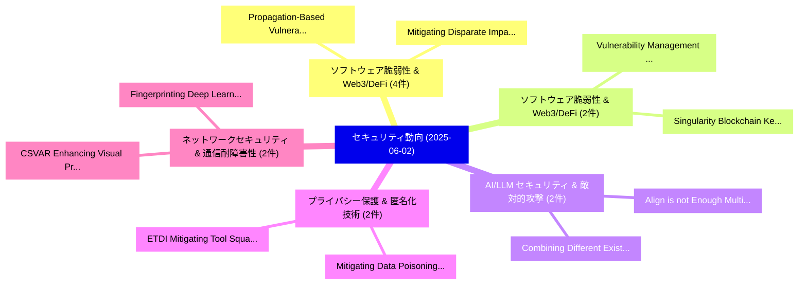

# 📅 02_daily: 日次エグゼクティブサマリー報告書 (2025-06-02)

**集計日時**: 2026-10-02 23:05:28 UTC  
**対象日付**: 2025-06-02  
**本日収集論文数**: 32 件  

---

## 💡 主要セキュリティ動向・脅威インサイト (Executive Insights)

本日の収集論文（計 32 件）において、以下の重点セキュリティ領域で活発な研究動向が確認されました：
- **ソフトウェア脆弱性 & Web3/DeFi** (4 件): 注目論文として 「Propagation-Based Vulnerabilit...」、「Mitigating Disparate Impact of...」 等が発表され、実務防御および攻撃検証の進展が見られます。
- **ソフトウェア脆弱性 & Web3/DeFi** (2 件): 注目論文として 「Vulnerability Management Chain...」、「Singularity Blockchain Key Man...」 等が発表され、実務防御および攻撃検証の進展が見られます。
- **AI/LLM セキュリティ & 敵対的攻撃** (2 件): 注目論文として 「Align is not Enough: Multimoda...」、「Combining Different Existing M...」 等が発表され、実務防御および攻撃検証の進展が見られます。
- **プライバシー保護 & 匿名化技術** (2 件): 注目論文として 「ETDI: Mitigating Tool Squattin...」、「Mitigating Data Poisoning Atta...」 等が発表され、実務防御および攻撃検証の進展が見られます。
- **ネットワークセキュリティ & 通信耐障害性** (2 件): 注目論文として 「CSVAR: Enhancing Visual Privac...」、「Fingerprinting Deep Learning M...」 等が発表され、実務防御および攻撃検証の進展が見られます。

### 🗺️ 技術・脅威トピックマインドマップ

---

## 📌 日次セキュリティ論文一覧 (日本語表形式)

| No | arXiv ID | 論文タイトル (日本語訳) | 重要キーワード | 構造化エグゼクティブ要約 (背景・提案・影響) | 脅威分類 | 詳細リンク |
|---|---|---|---|---|---|---|
| 1 | `2506.01220v3` | [Vulnerability Management Chaining: An Integrated Framework for Efficient サイバーセキュリティ Risk Prioritization](../../okf/papers/2025-06-02/2506.01220.md) | `Vulnerability Management Chaining`, `Efficient Cybersecurity Risk Prioritization`, `Risk Prioritization` | 【提案】概要 (Overview & Key Finding) 本論文「脆弱性 Management Chaining: An Integrated Framework for Ef...。実証評価により経営層・セキュリティ管理者向け推奨アクション (E... | `cs.CR` | [arXiv](https://arxiv.org/abs/2506.01220v3) &#124; [OKF](../../okf/papers/2025-06-02/2506.01220.md) |
| 2 | `2506.01227v1` | [SPEAR: Security Posture Evaluation using AI Planner-Reasoning on Attack-Connectivity Hypergraphs（セキュリティ分析論文）](../../okf/papers/2025-06-02/2506.01227.md) | `Connectivity Hypergraphs`, `Attack-Connectivity Hypergraphs`, `Shadaab Kawnain Bashir` | 【提案】概要 (Overview & Key Finding) 本論文「SPEAR: Security Posture Evaluation using AI Planner-Rea...。実証評価により経営層・セキュリティ管理者向け推奨アクション (E... | `cs.CR` | [arXiv](https://arxiv.org/abs/2506.01227v1) &#124; [OKF](../../okf/papers/2025-06-02/2506.01227.md) |
| 3 | `2506.01245v3` | [Comprehensive Vulnerability Analysis is Necessary for Trustworthy LLM-MAS（セキュリティ分析論文）](../../okf/papers/2025-06-02/2506.01245.md) | `Hui Liu`, `Yue Xing`, `Juanhui Li` | 【提案】概要 (Overview & Key Finding) 本論文「Comprehensive 脆弱性 Analysis is Necessary for Trustworthy...。実証評価により経営層・セキュリティ管理者向け推奨アクション (E... | `cs.CR` | [arXiv](https://arxiv.org/abs/2506.01245v3) &#124; [OKF](../../okf/papers/2025-06-02/2506.01245.md) |
| 4 | `2506.01307v1` | [Align is not Enough: Multimodal Universal Jailbreak Attack against Multimodal 大規模言語モデル](../../okf/papers/2025-06-02/2506.01307.md) | `Multimodal Universal Jailbreak Attack`, `Multimodal Large Language Models`, `Multimodal Universal Jailbre` | 【提案】背景とセキュリティ上の課題 (Background & Problem) 本研究はサイバー脅威環境におけるセキュリティ構造・脆弱性の検証を目的としています。(主要検出項目: ...。実証評価により経営層・セキュリティ管理者向け推奨アクション (E... | `cs.CR` | [arXiv](https://arxiv.org/abs/2506.01307v1) &#124; [OKF](../../okf/papers/2025-06-02/2506.01307.md) |
| 5 | `2506.01325v2` | [Understanding the Identity-Transformation Approach in OIDC-Compatible Privacy-Preserving SSO Services（セキュリティ分析論文）](../../okf/papers/2025-06-02/2506.01325.md) | `Compatible Privacy`, `OIDC-Compatible Privacy`, `Jingqiang Lin` | 【提案】概要 (Overview & Key Finding) 本論文「Understanding the Identity-Transformation Approach in O...。実証評価により経営層・セキュリティ管理者向け推奨アクション (E... | `cs.CR` | [arXiv](https://arxiv.org/abs/2506.01325v2) &#124; [OKF](../../okf/papers/2025-06-02/2506.01325.md) |
| 6 | `2506.01333v1` | [ETDI: Mitigating Tool Squatting and Rug Pull Attacks in Model Context Protocol (MCP) by using OAuth-Enhanced Tool Definitions and Policy-Based Access Control（セキュリティ分析論文）](../../okf/papers/2025-06-02/2506.01333.md) | `Mitigating Tool Squatting`, `Rug Pull Attacks`, `Model Context Protocol` | 【提案】概要 (Overview & Key Finding) 本論文「ETDI: Mitigating Tool Squatting and Rug Pull Attacks in...。実証評価により経営層・セキュリティ管理者向け推奨アクション (E... | `cs.CR` | [arXiv](https://arxiv.org/abs/2506.01333v1) &#124; [OKF](../../okf/papers/2025-06-02/2506.01333.md) |
| 7 | `2506.01342v2` | [Propagation-Based Vulnerability Impact Assessment for Software Supply Chains（セキュリティ分析論文）](../../okf/papers/2025-06-02/2506.01342.md) | `Based Vulnerability Impact Assessment`, `Software Supply Chains`, `Propagation-Based Vulnerability` | 【提案】概要 (Overview & Key Finding) 本論文「Propagation-Based 脆弱性 Impact Assessment for Software Su...。実証評価により経営層・セキュリティ管理者向け推奨アクション (E... | `cs.CR` | [arXiv](https://arxiv.org/abs/2506.01342v2) &#124; [OKF](../../okf/papers/2025-06-02/2506.01342.md) |
| 8 | `2506.01384v1` | [Formal Security SPV Clients Versus Home-Based Full Nodes in Bitcoin-Derived Systemsの分析](../../okf/papers/2025-06-02/2506.01384.md) | `Clients Versus Home`, `Based Full Nodes`, `Home-Based Full` | 【提案】概要 (Overview & Key Finding) 本論文「Formal Security SPV Clients Versus Home-Based Full Node...。実証評価により経営層・セキュリティ管理者向け推奨アクション (E... | `cs.CR` | [arXiv](https://arxiv.org/abs/2506.01384v1) &#124; [OKF](../../okf/papers/2025-06-02/2506.01384.md) |
| 9 | `2506.01396v2` | [Mitigating Disparate Impact of Differentially Private Learning through Bounded Adaptive Clipping（セキュリティ分析論文）](../../okf/papers/2025-06-02/2506.01396.md) | `Mitigating Disparate Impact`, `Differentially Private Learning`, `Bounded Adaptive Clipping` | 【提案】概要 (Overview & Key Finding) 本論文「Mitigating Disparate Impact of Differentially Private L...。実証評価により経営層・セキュリティ管理者向け推奨アクション (E... | `cs.CR` | [arXiv](https://arxiv.org/abs/2506.01396v2) &#124; [OKF](../../okf/papers/2025-06-02/2506.01396.md) |
| 10 | `2506.01412v1` | [System Calls for マルウェア検出 and Classification: Methodologies and Applications](../../okf/papers/2025-06-02/2506.01412.md) | `System Calls`, `Malware Detection`, `Bishwajit Prasad Gond` | 【提案】概要 (Overview & Key Finding) 本論文「System Calls for マルウェア検出 and Classification: Methodolog...。実証評価により経営層・セキュリティ管理者向け推奨アクション (E... | `cs.CR` | [arXiv](https://arxiv.org/abs/2506.01412v1) &#124; [OKF](../../okf/papers/2025-06-02/2506.01412.md) |
| 11 | `2506.01425v1` | [CSVAR: Enhancing Visual Privacy in 連合学習 via Adaptive Shuffling Against Overfitting](../../okf/papers/2025-06-02/2506.01425.md) | `Enhancing Visual Privacy`, `Federated Learning`, `Zhuo Chen` | 【提案】概要 (Overview & Key Finding) 本論文「CSVAR: Enhancing Visual Privacy in 連合学習 via Adaptive Sh...。実証評価により経営層・セキュリティ管理者向け推奨アクション (E... | `cs.CR` | [arXiv](https://arxiv.org/abs/2506.01425v1) &#124; [OKF](../../okf/papers/2025-06-02/2506.01425.md) |
| 12 | `2506.01446v1` | [Policy as Code, Policy as Type（セキュリティ分析論文）](../../okf/papers/2025-06-02/2506.01446.md) | `Raw Meta`, `Executive Summary`, `Key Finding` | 【提案】概要 (Overview & Key Finding) 本論文「Policy as Code, Policy as Type（セキュリティ分析論文）」（原題: Policy ...。実証評価によりFuchs - **公開日時**: `2025-0... | `cs.CR` | [arXiv](https://arxiv.org/abs/2506.01446v1) &#124; [OKF](../../okf/papers/2025-06-02/2506.01446.md) |
| 13 | `2506.01462v4` | [When Priority Fails: Revert-Based MEV on Fast-Finality Rollups（セキュリティ分析論文）](../../okf/papers/2025-06-02/2506.01462.md) | `Finality Rollups`, `Revert-Based MEV`, `Fast-Finality Rollups` | 【提案】概要 (Overview & Key Finding) 本論文「When Priority Fails: Revert-Based MEV on Fast-Finality ...。実証評価により経営層・セキュリティ管理者向け推奨アクション (E... | `cs.CR` | [arXiv](https://arxiv.org/abs/2506.01462v4) &#124; [OKF](../../okf/papers/2025-06-02/2506.01462.md) |
| 14 | `2506.01591v1` | [Silence is Golden: Leveraging Adversarial Examples to Nullify Audio Control in LDM-based Talking-Head Generation（セキュリティ分析論文）](../../okf/papers/2025-06-02/2506.01591.md) | `Leveraging Adversarial Examples`, `Nullify Audio Control`, `Head Generation` | 【提案】概要 (Overview & Key Finding) 本論文「Silence is Golden: Leveraging Adversarial Examples to N...。実証評価により経営層・セキュリティ管理者向け推奨アクション (E... | `cs.CR` | [arXiv](https://arxiv.org/abs/2506.01591v1) &#124; [OKF](../../okf/papers/2025-06-02/2506.01591.md) |
| 15 | `2506.01700v1` | [Combining Different Existing Methods for Describing Steganography Hiding Methods（セキュリティ分析論文）](../../okf/papers/2025-06-02/2506.01700.md) | `Combining Different Existing Methods`, `Describing Steganography Hiding Methods`, `Steffen Wendzel` | 【提案】背景とセキュリティ上の課題 (Background & Problem) 本研究はサイバー脅威環境におけるセキュリティ構造・脆弱性の検証を目的としています。(主要検出項目: ...。実証評価により経営層・セキュリティ管理者向け推奨アクション (E... | `cs.CR` | [arXiv](https://arxiv.org/abs/2506.01700v1) &#124; [OKF](../../okf/papers/2025-06-02/2506.01700.md) |
| 16 | `2506.01767v1` | [Predictive-CSM: Lightweight Fragment Security for 6LoWPAN IoT Networks（セキュリティ分析論文）](../../okf/papers/2025-06-02/2506.01767.md) | `Lightweight Fragment Security`, `Somayeh Sobati`, `Raw Meta` | 【提案】概要 (Overview & Key Finding) 本論文「Predictive-CSM: Lightweight Fragment Security for 6LoWP...。実証評価により経営層・セキュリティ管理者向け推奨アクション (E... | `cs.CR` | [arXiv](https://arxiv.org/abs/2506.01767v1) &#124; [OKF](../../okf/papers/2025-06-02/2506.01767.md) |
| 17 | `2506.01770v2` | [ReGA: Model-Based Safeguard for LLMs via Representation-Guided Abstraction（セキュリティ分析論文）](../../okf/papers/2025-06-02/2506.01770.md) | `Based Safeguard`, `Guided Abstraction`, `Model-Based Safeguard` | 【提案】概要 (Overview & Key Finding) 本論文「ReGA: Model-Based Safeguard for LLMs via Representation...。実証評価により経営層・セキュリティ管理者向け推奨アクション (E... | `cs.CR` | [arXiv](https://arxiv.org/abs/2506.01770v2) &#124; [OKF](../../okf/papers/2025-06-02/2506.01770.md) |
| 18 | `2506.01790v3` | [IF-GUIDE: Influence Function-Guided Detoxification of LLMs（セキュリティ分析論文）](../../okf/papers/2025-06-02/2506.01790.md) | `Influence Function`, `Guided Detoxification`, `Function-Guided Detoxification` | 【提案】概要 (Overview & Key Finding) 本論文「IF-GUIDE: Influence Function-Guided Detoxification of L...。実証評価により経営層・セキュリティ管理者向け推奨アクション (E... | `cs.CR` | [arXiv](https://arxiv.org/abs/2506.01790v3) &#124; [OKF](../../okf/papers/2025-06-02/2506.01790.md) |
| 19 | `2506.01825v2` | [Backdoors in Code Summarizers: How Bad Is It?（セキュリティ分析論文）](../../okf/papers/2025-06-02/2506.01825.md) | `Code Summarizers`, `Chenyu Wang`, `Zhou Yang` | 【提案】### (日本語題名: Backdoors in Code Summarizers: How Bad Is It?（セキュリティ分析論文）)  > [!NOTE] > **O...。実証評価により経営層・セキュリティ管理者向け推奨アクション (E... | `cs.CR` | [arXiv](https://arxiv.org/abs/2506.01825v2) &#124; [OKF](../../okf/papers/2025-06-02/2506.01825.md) |
| 20 | `2506.01848v2` | [Identifying Key Expert Actors in Cybercrime Forums Based on their Technical Expertise（セキュリティ分析論文）](../../okf/papers/2025-06-02/2506.01848.md) | `Identifying Key Expert Actors`, `Cybercrime Forums Based`, `Technical Expertise` | 【提案】概要 (Overview & Key Finding) 本論文「Identifying Key Expert Actors in Cybercrime Forums Base...。実証評価により経営層・セキュリティ管理者向け推奨アクション (E... | `cs.CR` | [arXiv](https://arxiv.org/abs/2506.01848v2) &#124; [OKF](../../okf/papers/2025-06-02/2506.01848.md) |
| 21 | `2506.01849v1` | [Trojan Horse Hunt in Time Series Forecasting for Space Operations（セキュリティ分析論文）](../../okf/papers/2025-06-02/2506.01849.md) | `Trojan Horse Hunt`, `Time Series Forecasting`, `Space Operations` | 【提案】概要 (Overview & Key Finding) 本論文「Trojan Horse Hunt in Time Series Forecasting for Space ...。実証評価により経営層・セキュリティ管理者向け推奨アクション (E... | `cs.CR` | [arXiv](https://arxiv.org/abs/2506.01849v1) &#124; [OKF](../../okf/papers/2025-06-02/2506.01849.md) |
| 22 | `2506.01854v2` | [Black-Box Crypto is Useless for Pseudorandom Codes（セキュリティ分析論文）](../../okf/papers/2025-06-02/2506.01854.md) | `Box Crypto`, `Pseudorandom Codes`, `Black-Box Crypto` | 【提案】概要 (Overview & Key Finding) 本論文「Black-Box Crypto is Useless for Pseudorandom Codes（セキュリ...。実証評価により経営層・セキュリティ管理者向け推奨アクション (E... | `cs.CR` | [arXiv](https://arxiv.org/abs/2506.01854v2) &#124; [OKF](../../okf/papers/2025-06-02/2506.01854.md) |
| 23 | `2506.01856v1` | [Synchronic Web Digital Identity: Speculations on the Art of the Possible（セキュリティ分析論文）](../../okf/papers/2025-06-02/2506.01856.md) | `Synchronic Web Digital Identity`, `Nam Dinh`, `Justin Li` | 【提案】概要 (Overview & Key Finding) 本論文「Synchronic Web Digital Identity: Speculations on the Ar...。実証評価により経営層・セキュリティ管理者向け推奨アクション (E... | `cs.CR` | [arXiv](https://arxiv.org/abs/2506.01856v1) &#124; [OKF](../../okf/papers/2025-06-02/2506.01856.md) |
| 24 | `2506.01885v2` | [SoK: Concurrency in Blockchain -- A Systematic Literature Review and the Unveiling of a Misconception（セキュリティ分析論文）](../../okf/papers/2025-06-02/2506.01885.md) | `Systematic Literature Review`, `Atefeh Zareh Chahoki`, `Maurice Herlihy` | 【提案】概要 (Overview & Key Finding) 本論文「SoK: Concurrency in Blockchain -- A Systematic Literatu...。実証評価により経営層・セキュリティ管理者向け推奨アクション (E... | `cs.CR` | [arXiv](https://arxiv.org/abs/2506.01885v2) &#124; [OKF](../../okf/papers/2025-06-02/2506.01885.md) |
| 25 | `2506.01900v1` | [COALESCE: Economic and Security Dynamics of Skill-Based Task Outsourcing Among Team of Autonomous LLMエージェント](../../okf/papers/2025-06-02/2506.01900.md) | `Based Task Outsourcing Among Team`, `Security Dynamics`, `Skill-Based Task` | 【提案】概要 (Overview & Key Finding) 本論文「COALESCE: Economic and Security Dynamics of Skill-Based...。実証評価により経営層・セキュリティ管理者向け推奨アクション (E... | `cs.CR` | [arXiv](https://arxiv.org/abs/2506.01900v1) &#124; [OKF](../../okf/papers/2025-06-02/2506.01900.md) |
| 26 | `2506.01907v1` | [SMOTE-DP: Improving Privacy-Utility Tradeoff with Synthetic Data（セキュリティ分析論文）](../../okf/papers/2025-06-02/2506.01907.md) | `Improving Privacy`, `Utility Tradeoff`, `Synthetic Data` | 【提案】概要 (Overview & Key Finding) 本論文「SMOTE-DP: Improving Privacy-Utility Tradeoff with Synth...。実証評価により経営層・セキュリティ管理者向け推奨アクション (E... | `cs.CR` | [arXiv](https://arxiv.org/abs/2506.01907v1) &#124; [OKF](../../okf/papers/2025-06-02/2506.01907.md) |
| 27 | `2506.02089v4` | [SALAD: Systematic Assessment of Machine Unlearning on LLM-Aided Hardware Design（セキュリティ分析論文）](../../okf/papers/2025-06-02/2506.02089.md) | `Aided Hardware Design`, `Systematic Assessment`, `Machine Unlearning` | 【提案】概要 (Overview & Key Finding) 本論文「SALAD: Systematic Assessment of Machine Unlearning on L...。実証評価により経営層・セキュリティ管理者向け推奨アクション (E... | `cs.CR` | [arXiv](https://arxiv.org/abs/2506.02089v4) &#124; [OKF](../../okf/papers/2025-06-02/2506.02089.md) |
| 28 | `2506.02156v2` | [Mitigating Data Poisoning Attacks to Local Differential Privacy（セキュリティ分析論文）](../../okf/papers/2025-06-02/2506.02156.md) | `Mitigating Data Poisoning Attacks`, `Local Differential Privacy`, `Xiaolin Li` | 【提案】概要 (Overview & Key Finding) 本論文「Mitigating Data Poisoning Attacks to Local 差分プライバシー（セキュ...。実証評価により経営層・セキュリティ管理者向け推奨アクション (E... | `cs.CR` | [arXiv](https://arxiv.org/abs/2506.02156v2) &#124; [OKF](../../okf/papers/2025-06-02/2506.02156.md) |
| 29 | `2506.02277v2` | [Parallel Repetition for Post-Quantum Arguments（セキュリティ分析論文）](../../okf/papers/2025-06-02/2506.02277.md) | `Parallel Repetition`, `Quantum Arguments`, `Post-Quantum Arguments` | 【提案】概要 (Overview & Key Finding) 本論文「Parallel Repetition for Post-量子 Arguments（セキュリティ分析論文）」（...。実証評価により経営層・セキュリティ管理者向け推奨アクション (E... | `cs.CR` | [arXiv](https://arxiv.org/abs/2506.02277v2) &#124; [OKF](../../okf/papers/2025-06-02/2506.02277.md) |
| 30 | `2506.02282v1` | [Singularity Blockchain Key Management via non-custodial key management（セキュリティ分析論文）](../../okf/papers/2025-06-02/2506.02282.md) | `Singularity Blockchain Key Management`, `non-custodial key`, `Sumit Vohra` | 【提案】概要 (Overview & Key Finding) 本論文「Singularity Blockchain Key Management via non-custodial...。実証評価により経営層・セキュリティ管理者向け推奨アクション (E... | `cs.CR` | [arXiv](https://arxiv.org/abs/2506.02282v1) &#124; [OKF](../../okf/papers/2025-06-02/2506.02282.md) |
| 31 | `2506.02324v1` | [Are Crypto Ecosystems (De)centralizing? A Framework for Longitudinal Analysis（セキュリティ分析論文）](../../okf/papers/2025-06-02/2506.02324.md) | `Harang Ju`, `Ehsan Valavi`, `Madhav Kumar` | 【提案】A Framework for Longitudinal Analysis ### (日本語題名: Are Crypto Ecosystems (De)centralizing?。実証評価により経営層・セキュリティ管理者向け推奨アクション (Ex... | `cs.CR` | [arXiv](https://arxiv.org/abs/2506.02324v1) &#124; [OKF](../../okf/papers/2025-06-02/2506.02324.md) |
| 32 | `2506.03207v1` | [Fingerprinting Deep Learning Models via Network Traffic Patterns in 連合学習](../../okf/papers/2025-06-02/2506.03207.md) | `Fingerprinting Deep Learning Models`, `Network Traffic Patterns`, `Federated Learning` | 【提案】概要 (Overview & Key Finding) 本論文「Fingerprinting Deep Learning Models via Network Traffic...。実証評価により経営層・セキュリティ管理者向け推奨アクション (E... | `cs.CR` | [arXiv](https://arxiv.org/abs/2506.03207v1) &#124; [OKF](../../okf/papers/2025-06-02/2506.03207.md) |

