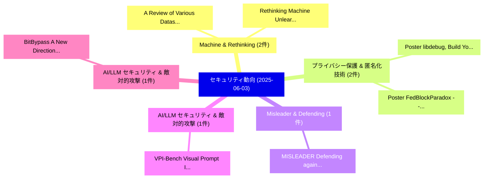

# 📅 02_daily: 日次エグゼクティブサマリー報告書 (2025-06-03)

**集計日時**: 2026-10-02 23:05:28 UTC  
**対象日付**: 2025-06-03  
**本日収集論文数**: 21 件  

---

## 💡 主要セキュリティ動向・脅威インサイト (Executive Insights)

本日の収集論文（計 21 件）において、以下の重点セキュリティ領域で活発な研究動向が確認されました：
- **Machine & Rethinking** (2 件): 注目論文として 「A Review of Various Datasets f...」、「Rethinking Machine Unlearning ...」 等が発表され、実務防御および攻撃検証の進展が見られます。
- **プライバシー保護 & 匿名化技術** (2 件): 注目論文として 「Poster: libdebug, Build Your O...」、「Poster: FedBlockParadox -- A F...」 等が発表され、実務防御および攻撃検証の進展が見られます。
- **Misleader & Defending** (1 件): 注目論文として 「MISLEADER: Defending against M...」 等が発表され、実務防御および攻撃検証の進展が見られます。
- **AI/LLM セキュリティ & 敵対的攻撃** (1 件): 注目論文として 「VPI-Bench: Visual Prompt Injec...」 等が発表され、実務防御および攻撃検証の進展が見られます。
- **AI/LLM セキュリティ & 敵対的攻撃** (1 件): 注目論文として 「BitBypass: A New Direction in ...」 等が発表され、実務防御および攻撃検証の進展が見られます。

### 🗺️ 技術・脅威トピックマインドマップ

---

## 📌 日次セキュリティ論文一覧 (日本語表形式)

| No | arXiv ID | 論文タイトル (日本語訳) | 重要キーワード | 構造化エグゼクティブ要約 (背景・提案・影響) | 脅威分類 | 詳細リンク |
|---|---|---|---|---|---|---|
| 1 | `2506.02362v1` | [MISLEADER: Defending against Model Extraction with Ensembles of Distilled Models（セキュリティ分析論文）](../../okf/papers/2025-06-03/2506.02362.md) | `Model Extraction`, `Distilled Models`, `Xueqi Cheng` | 【提案】概要 (Overview & Key Finding) 本論文「MISLEADER: Defending against Model Extraction with Ense...。実証評価により経営層・セキュリティ管理者向け推奨アクション (E... | `cs.CR` | [arXiv](https://arxiv.org/abs/2506.02362v1) &#124; [OKF](../../okf/papers/2025-06-03/2506.02362.md) |
| 2 | `2506.02438v1` | [A Review of Various Datasets for Machine Learning Algorithm-Based Intrusion Detection System: Advances and Challenges（セキュリティ分析論文）](../../okf/papers/2025-06-03/2506.02438.md) | `Based Intrusion Detection System`, `Machine Learning Algorithm`, `Various Datasets` | 【提案】概要 (Overview & Key Finding) 本論文「A Review of Various Datasets for Machine Learning Algor...。実証評価により経営層・セキュリティ管理者向け推奨アクション (E... | `cs.CR` | [arXiv](https://arxiv.org/abs/2506.02438v1) &#124; [OKF](../../okf/papers/2025-06-03/2506.02438.md) |
| 3 | `2506.02456v2` | [VPI-Bench: Visual Prompt Injection Attacks for Computer-Use Agents（セキュリティ分析論文）](../../okf/papers/2025-06-03/2506.02456.md) | `Visual Prompt Injection Attacks`, `Use Agents`, `Computer-Use Agents` | 【提案】概要 (Overview & Key Finding) 本論文「VPI-Bench: Visual プロンプトインジェクション Attacks for Computer-Us...。実証評価により経営層・セキュリティ管理者向け推奨アクション (E... | `cs.CR` | [arXiv](https://arxiv.org/abs/2506.02456v2) &#124; [OKF](../../okf/papers/2025-06-03/2506.02456.md) |
| 4 | `2506.02479v2` | [BitBypass: A New Direction in Jailbreaking Aligned 大規模言語モデル with Bitstream Camouflage](../../okf/papers/2025-06-03/2506.02479.md) | `New Direction`, `Bitstream Camouflage`, `Jailbreaking Aligned Large Language Models` | 【提案】概要 (Overview & Key Finding) 本論文「BitBypass: A New Direction in ジェイルブレイクing Aligned 大規模言語...。実証評価により経営層・セキュリティ管理者向け推奨アクション (E... | `cs.CR` | [arXiv](https://arxiv.org/abs/2506.02479v2) &#124; [OKF](../../okf/papers/2025-06-03/2506.02479.md) |
| 5 | `2506.02546v2` | [To trust or not to trust: Attention-based Trust Management for LLM Multi-Agent Systems（セキュリティ分析論文）](../../okf/papers/2025-06-03/2506.02546.md) | `Trust Management`, `Agent Systems`, `Attention-based Trust` | 【提案】背景とセキュリティ上の課題 (Background & Problem) 本研究はサイバー脅威環境におけるセキュリティ構造・脆弱性の検証を目的としています。(主要検出項目: ...。実証評価により経営層・セキュリティ管理者向け推奨アクション (E... | `cs.CR` | [arXiv](https://arxiv.org/abs/2506.02546v2) &#124; [OKF](../../okf/papers/2025-06-03/2506.02546.md) |
| 6 | `2506.02548v3` | [CyberGym: Evaluating AI Agents' Real-World サイバーセキュリティ Capabilities at Scale](../../okf/papers/2025-06-03/2506.02548.md) | `World Cybersecurity Capabilities`, `Real-World Cybersecurity`, `Zhun Wang` | 【提案】概要 (Overview & Key Finding) 本論文「CyberGym: Evaluating AI Agents' Real-World サイバーセキュリティ C...。実証評価により経営層・セキュリティ管理者向け推奨アクション (E... | `cs.CR` | [arXiv](https://arxiv.org/abs/2506.02548v3) &#124; [OKF](../../okf/papers/2025-06-03/2506.02548.md) |
| 7 | `2506.02660v1` | [Tarallo: Evading Behavioral Malware Detectors in the Problem Space（セキュリティ分析論文）](../../okf/papers/2025-06-03/2506.02660.md) | `Evading Behavioral Malware Detectors`, `Problem Space`, `Gabriele Digregorio` | 【提案】概要 (Overview & Key Finding) 本論文「Tarallo: Evading Behavioral マルウェア Detectors in the Prob...。実証評価により経営層・セキュリティ管理者向け推奨アクション (E... | `cs.CR` | [arXiv](https://arxiv.org/abs/2506.02660v1) &#124; [OKF](../../okf/papers/2025-06-03/2506.02660.md) |
| 8 | `2506.02667v1` | [Poster: libdebug, Build Your Own Debugger for a Better (Hello) World（セキュリティ分析論文）](../../okf/papers/2025-06-03/2506.02667.md) | `Roberto Alessandro Bertolini`, `Gabriele Digregorio`, `Francesco Panebianco` | 【提案】概要 (Overview & Key Finding) 本論文「Poster: libdebug, Build Your Own Debugger for a Better ...。実証評価により経営層・セキュリティ管理者向け推奨アクション (E... | `cs.CR` | [arXiv](https://arxiv.org/abs/2506.02667v1) &#124; [OKF](../../okf/papers/2025-06-03/2506.02667.md) |
| 9 | `2506.02674v2` | [Decentralized COVID-19 Health System Leveraging Blockchain（セキュリティ分析論文）](../../okf/papers/2025-06-03/2506.02674.md) | `Health System Leveraging Blockchain`, `COVID-19 Health`, `Lingsheng Chen` | 【提案】概要 (Overview & Key Finding) 本論文「Decentralized COVID-19 Health System Leveraging Blockch...。実証評価により経営層・セキュリティ管理者向け推奨アクション (E... | `cs.CR` | [arXiv](https://arxiv.org/abs/2506.02674v2) &#124; [OKF](../../okf/papers/2025-06-03/2506.02674.md) |
| 10 | `2506.02679v1` | [Poster: FedBlockParadox -- A Framework for Simulating and Decentralized Federated Learningのセキュリティ強化](../../okf/papers/2025-06-03/2506.02679.md) | `Securing Decentralized Federated Learning`, `Decentralized Federated`, `Gabriele Digregorio` | 【提案】概要 (Overview & Key Finding) 本論文「Poster: FedBlockParadox -- A Framework for Simulating a...。実証評価により経営層・セキュリティ管理者向け推奨アクション (E... | `cs.CR` | [arXiv](https://arxiv.org/abs/2506.02679v1) &#124; [OKF](../../okf/papers/2025-06-03/2506.02679.md) |
| 11 | `2506.02711v1` | [Privacy Leaks by Adversaries: Adversarial Iterations for Membership Inference Attack（セキュリティ分析論文）](../../okf/papers/2025-06-03/2506.02711.md) | `Membership Inference Attack`, `Privacy Leaks`, `Adversarial Iterations` | 【提案】概要 (Overview & Key Finding) 本論文「Privacy Leaks by Adversaries: Adversarial Iterations fo...。実証評価により経営層・セキュリティ管理者向け推奨アクション (E... | `cs.CR` | [arXiv](https://arxiv.org/abs/2506.02711v1) &#124; [OKF](../../okf/papers/2025-06-03/2506.02711.md) |
| 12 | `2506.02761v2` | [Rethinking Machine Unlearning in Image Generation Models（セキュリティ分析論文）](../../okf/papers/2025-06-03/2506.02761.md) | `Rethinking Machine Unlearning`, `Image Generation Models`, `Renyang Liu` | 【提案】概要 (Overview & Key Finding) 本論文「Rethinking Machine Unlearning in Image Generation Model...。実証評価により経営層・セキュリティ管理者向け推奨アクション (E... | `cs.CR` | [arXiv](https://arxiv.org/abs/2506.02761v2) &#124; [OKF](../../okf/papers/2025-06-03/2506.02761.md) |
| 13 | `2506.02859v1` | [ATAG: AI-Agent Application Threat Assessment with Attack Graphs（セキュリティ分析論文）](../../okf/papers/2025-06-03/2506.02859.md) | `Agent Application Threat Assessment`, `Attack Graphs`, `AI-Agent Application` | 【提案】概要 (Overview & Key Finding) 本論文「ATAG: AI-Agent Application 脅威 Assessment with Attack Gr...。実証評価により経営層・セキュリティ管理者向け推奨アクション (E... | `cs.CR` | [arXiv](https://arxiv.org/abs/2506.02859v1) &#124; [OKF](../../okf/papers/2025-06-03/2506.02859.md) |
| 14 | `2506.02892v2` | [When Blockchain Meets Crawlers: Real-time Market Analytics in Solana NFT Markets（セキュリティ分析論文）](../../okf/papers/2025-06-03/2506.02892.md) | `Market Analytics`, `Real-time Market`, `Chengxin Shen` | 【提案】概要 (Overview & Key Finding) 本論文「When Blockchain Meets Crawlers: Real-time Market Analyt...。実証評価により経営層・セキュリティ管理者向け推奨アクション (E... | `cs.CR` | [arXiv](https://arxiv.org/abs/2506.02892v2) &#124; [OKF](../../okf/papers/2025-06-03/2506.02892.md) |
| 15 | `2506.02942v1` | [An Algorithmic Pipeline for GDPR-Compliant Healthcare Data Anonymisation: Moving Toward Standardisation（セキュリティ分析論文）](../../okf/papers/2025-06-03/2506.02942.md) | `Compliant Healthcare Data Anonymisation`, `Moving Toward Standardisation`, `GDPR-Compliant Healthcare` | 【提案】概要 (Overview & Key Finding) 本論文「An Algorithmic Pipeline for GDPR-Compliant Healthcare D...。実証評価により経営層・セキュリティ管理者向け推奨アクション (E... | `cs.CR` | [arXiv](https://arxiv.org/abs/2506.02942v1) &#124; [OKF](../../okf/papers/2025-06-03/2506.02942.md) |
| 16 | `2506.03234v1` | [BadReward: Clean-Label Poisoning of Reward Models in Text-to-Image RLHF（セキュリティ分析論文）](../../okf/papers/2025-06-03/2506.03234.md) | `Label Poisoning`, `Reward Models`, `Clean-Label Poisoning` | 【提案】概要 (Overview & Key Finding) 本論文「BadReward: Clean-Label Poisoning of Reward Models in Te...。実証評価により経営層・セキュリティ管理者向け推奨アクション (E... | `cs.CR` | [arXiv](https://arxiv.org/abs/2506.03234v1) &#124; [OKF](../../okf/papers/2025-06-03/2506.03234.md) |
| 17 | `2506.03308v5` | [Hermes: Efficient Global Homomorphic Aggregation over Mutable Packed Ciphertexts（セキュリティ分析論文）](../../okf/papers/2025-06-03/2506.03308.md) | `Efficient Global Homomorphic Aggregation`, `Mutable Packed Ciphertexts`, `Dongfang Zhao` | 【提案】概要 (Overview & Key Finding) 本論文「Hermes: Efficient Global Homomorphic Aggregation over M...。実証評価により経営層・セキュリティ管理者向け推奨アクション (E... | `cs.CR` | [arXiv](https://arxiv.org/abs/2506.03308v5) &#124; [OKF](../../okf/papers/2025-06-03/2506.03308.md) |
| 18 | `2506.03409v3` | [Technical Options for Flexible Hardware-Enabled Guarantees（セキュリティ分析論文）](../../okf/papers/2025-06-03/2506.03409.md) | `Technical Options`, `Flexible Hardware`, `Enabled Guarantees` | 【提案】概要 (Overview & Key Finding) 本論文「Technical Options for Flexible Hardware-Enabled Guarant...。実証評価により経営層・セキュリティ管理者向け推奨アクション (E... | `cs.CR` | [arXiv](https://arxiv.org/abs/2506.03409v3) &#124; [OKF](../../okf/papers/2025-06-03/2506.03409.md) |
| 19 | `2506.05381v1` | [Heterogeneous Secure Transmissions in IRS-Assisted NOMA Communications: CO-GNN Approach（セキュリティ分析論文）](../../okf/papers/2025-06-03/2506.05381.md) | `Heterogeneous Secure Transmissions`, `IRS-Assisted NOMA`, `Linlin Liang` | 【提案】概要 (Overview & Key Finding) 本論文「Heterogeneous Secure Transmissions in IRS-Assisted NOMA...。実証評価により経営層・セキュリティ管理者向け推奨アクション (E... | `cs.CR` | [arXiv](https://arxiv.org/abs/2506.05381v1) &#124; [OKF](../../okf/papers/2025-06-03/2506.05381.md) |
| 20 | `2506.05382v1` | [How stealthy is stealthy? Studying the Efficacy of Black-Box Adversarial Attacks in the Real World（セキュリティ分析論文）](../../okf/papers/2025-06-03/2506.05382.md) | `Box Adversarial Attacks`, `Black-Box Adversarial`, `Real World` | 【提案】Studying the Efficacy of Black-Box 敵対的攻撃s in the Real World ### (日本語題名: How stealthy is...。実証評価により経営層・セキュリティ管理者向け推奨アクション (E... | `cs.CR` | [arXiv](https://arxiv.org/abs/2506.05382v1) &#124; [OKF](../../okf/papers/2025-06-03/2506.05382.md) |
| 21 | `2506.05394v3` | [Attacking Attention of Foundation Models Disrupts Downstream Tasks（セキュリティ分析論文）](../../okf/papers/2025-06-03/2506.05394.md) | `Foundation Models Disrupts Downstream Tasks`, `Attacking Attention`, `Hondamunige Prasanna Silva` | 【提案】概要 (Overview & Key Finding) 本論文「Attacking Attention of Foundation Models Disrupts Downs...。実証評価により経営層・セキュリティ管理者向け推奨アクション (E... | `cs.CR` | [arXiv](https://arxiv.org/abs/2506.05394v3) &#124; [OKF](../../okf/papers/2025-06-03/2506.05394.md) |

