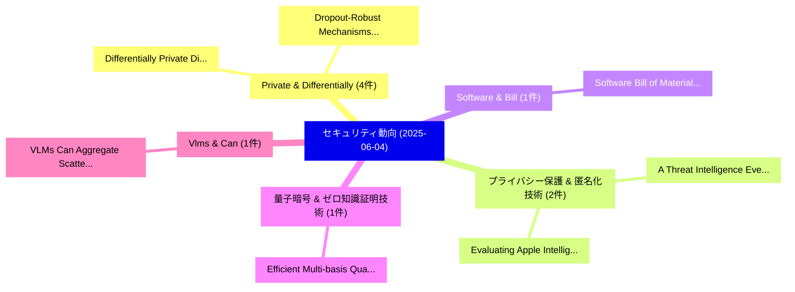

# 📅 02_daily: 日次エグゼクティブサマリー報告書 (2025-06-04)

**集計日時**: 2026-10-02 23:05:28 UTC  
**対象日付**: 2025-06-04  
**本日収集論文数**: 29 件  

---

## 💡 主要セキュリティ動向・脅威インサイト (Executive Insights)

本日の収集論文（計 29 件）において、以下の重点セキュリティ領域で活発な研究動向が確認されました：
- **Private & Differentially** (4 件): 注目論文として 「Differentially Private Distrib...」、「Dropout-Robust Mechanisms for ...」 等が発表され、実務防御および攻撃検証の進展が見られます。
- **プライバシー保護 & 匿名化技術** (2 件): 注目論文として 「A Threat Intelligence Event Ex...」、「Evaluating Apple Intelligence'...」 等が発表され、実務防御および攻撃検証の進展が見られます。
- **Software & Bill** (1 件): 注目論文として 「Software Bill of Materials in ...」 等が発表され、実務防御および攻撃検証の進展が見られます。
- **量子暗号 & ゼロ知識証明技術** (1 件): 注目論文として 「Efficient Multi-basis Quantum ...」 等が発表され、実務防御および攻撃検証の進展が見られます。
- **Vlms & Can** (1 件): 注目論文として 「VLMs Can Aggregate Scattered T...」 等が発表され、実務防御および攻撃検証の進展が見られます。

### 🗺️ 技術・脅威トピックマインドマップ

---

## 📌 日次セキュリティ論文一覧 (日本語表形式)

| No | arXiv ID | 論文タイトル (日本語訳) | 重要キーワード | 構造化エグゼクティブ要約 (背景・提案・影響) | 脅威分類 | 詳細リンク |
|---|---|---|---|---|---|---|
| 1 | `2506.03467v3` | [Differentially Private Distribution Release of Gaussian Mixture Models via KL-Divergence Minimization（セキュリティ分析論文）](../../okf/papers/2025-06-04/2506.03467.md) | `Differentially Private Distribution Release`, `Gaussian Mixture Models`, `Divergence Minimization` | 【提案】概要 (Overview & Key Finding) 本論文「Differentially Private Distribution Release of Gaussian...。実証評価により経営層・セキュリティ管理者向け推奨アクション (E... | `cs.CR` | [arXiv](https://arxiv.org/abs/2506.03467v3) &#124; [OKF](../../okf/papers/2025-06-04/2506.03467.md) |
| 2 | `2506.03507v2` | [Software Bill of Materials in Software Supply Chain Security A Systematic Literature Review（セキュリティ分析論文）](../../okf/papers/2025-06-04/2506.03507.md) | `Software Supply Chain Security`, `Systematic Literature Review`, `Software Bill` | 【提案】概要 (Overview & Key Finding) 本論文「Software Bill of Materials in Software Supply Chain Sec...。実証評価により経営層・セキュリティ管理者向け推奨アクション (E... | `cs.CR` | [arXiv](https://arxiv.org/abs/2506.03507v2) &#124; [OKF](../../okf/papers/2025-06-04/2506.03507.md) |
| 3 | `2506.03549v2` | [Efficient Multi-basis Quantum Position Verification Secure against Generalized Adversaries（セキュリティ分析論文）](../../okf/papers/2025-06-04/2506.03549.md) | `Quantum Position Verification Secure`, `Efficient Multi`, `Generalized Adversaries` | 【提案】概要 (Overview & Key Finding) 本論文「Efficient Multi-basis 量子 Position Verification Secure a...。実証評価により経営層・セキュリティ管理者向け推奨アクション (E... | `cs.CR` | [arXiv](https://arxiv.org/abs/2506.03549v2) &#124; [OKF](../../okf/papers/2025-06-04/2506.03549.md) |
| 4 | `2506.03551v1` | [A Threat Intelligence Event Extraction Conceptual Model for Cyber Threat Intelligence Feeds（セキュリティ分析論文）](../../okf/papers/2025-06-04/2506.03551.md) | `Threat Intelligence Event Extraction Conceptual Model`, `Cyber Threat Intelligence Feeds`, `Mohamad Fadli Bin Zolkipli` | 【提案】概要 (Overview & Key Finding) 本論文「A 脅威 Intelligence Event Extraction Conceptual Model for...。実証評価により経営層・セキュリティ管理者向け推奨アクション (E... | `cs.CR` | [arXiv](https://arxiv.org/abs/2506.03551v1) &#124; [OKF](../../okf/papers/2025-06-04/2506.03551.md) |
| 5 | `2506.03614v1` | [VLMs Can Aggregate Scattered Training Patches（セキュリティ分析論文）](../../okf/papers/2025-06-04/2506.03614.md) | `Can Aggregate Scattered Training Patches`, `Zhanhui Zhou`, `Lingjie Chen` | 【提案】概要 (Overview & Key Finding) 本論文「VLMs Can Aggregate Scattered Training Patches（セキュリティ分析論...。実証評価により経営層・セキュリティ管理者向け推奨アクション (E... | `cs.CR` | [arXiv](https://arxiv.org/abs/2506.03614v1) &#124; [OKF](../../okf/papers/2025-06-04/2506.03614.md) |
| 6 | `2506.03651v2` | [Mono: Is Your "Clean" Vulnerability Dataset Really Solvable? Exposing and Trapping Undecidable Patches and Beyond（セキュリティ分析論文）](../../okf/papers/2025-06-04/2506.03651.md) | `Vulnerability Dataset Really Solvable`, `Trapping Undecidable Patches`, `Zeyu Gao` | 【提案】Exposing and Trapping Undecidable Patches and Beyond ### (日本語題名: Mono: Is Your "Clean" ...。実証評価により経営層・セキュリティ管理者向け推奨アクション (E... | `cs.CR` | [arXiv](https://arxiv.org/abs/2506.03651v2) &#124; [OKF](../../okf/papers/2025-06-04/2506.03651.md) |
| 7 | `2506.03656v1` | [Client-Side Zero-Shot LLM Inference for Comprehensive In-Browser URL Analysis（セキュリティ分析論文）](../../okf/papers/2025-06-04/2506.03656.md) | `Side Zero`, `Client-Side Zero`, `In-Browser URL` | 【提案】概要 (Overview & Key Finding) 本論文「Client-Side Zero-Shot LLM Inference for Comprehensive I...。実証評価により経営層・セキュリティ管理者向け推奨アクション (E... | `cs.CR` | [arXiv](https://arxiv.org/abs/2506.03656v1) &#124; [OKF](../../okf/papers/2025-06-04/2506.03656.md) |
| 8 | `2506.03746v1` | [Dropout-Robust Mechanisms for Differentially Private and Fully Decentralized Mean Estimation（セキュリティ分析論文）](../../okf/papers/2025-06-04/2506.03746.md) | `Fully Decentralized Mean Estimation`, `Robust Mechanisms`, `Dropout-Robust Mechanisms` | 【提案】概要 (Overview & Key Finding) 本論文「Dropout-Robust Mechanisms for Differentially Private an...。実証評価により経営層・セキュリティ管理者向け推奨アクション (E... | `cs.CR` | [arXiv](https://arxiv.org/abs/2506.03746v1) &#124; [OKF](../../okf/papers/2025-06-04/2506.03746.md) |
| 9 | `2506.03765v1` | [Prediction Inconsistency Helps Achieve Generalizable Adversarial Examplesの検出](../../okf/papers/2025-06-04/2506.03765.md) | `Prediction Inconsistency Helps Achieve Generalizable Detection`, `Prediction Inconsistency Helps Achieve Generalizable Adversarial`, `Adversarial Examples` | 【提案】概要 (Overview & Key Finding) 本論文「Prediction Inconsistency Helps Achieve Generalizable Ad...。実証評価により経営層・セキュリティ管理者向け推奨アクション (E... | `cs.CR` | [arXiv](https://arxiv.org/abs/2506.03765v1) &#124; [OKF](../../okf/papers/2025-06-04/2506.03765.md) |
| 10 | `2506.03870v1` | [Evaluating Apple Intelligence's Writing Tools for Privacy Against Large Language Model-Based Inference Attacks: Insights from Early Datasets（セキュリティ分析論文）](../../okf/papers/2025-06-04/2506.03870.md) | `Evaluating Apple Intelligence`, `Based Inference Attacks`, `Writing Tools` | 【提案】概要 (Overview & Key Finding) 本論文「Evaluating Apple Intelligence's Writing Tools for Priva...。実証評価により経営層・セキュリティ管理者向け推奨アクション (E... | `cs.CR` | [arXiv](https://arxiv.org/abs/2506.03870v1) &#124; [OKF](../../okf/papers/2025-06-04/2506.03870.md) |
| 11 | `2506.03940v2` | [Depermissioning Web3: a Permissionless Accountable RPC Protocol for Blockchain Networks（セキュリティ分析論文）](../../okf/papers/2025-06-04/2506.03940.md) | `Depermissioning Web3`, `Permissionless Accountable`, `Blockchain Networks` | 【提案】概要 (Overview & Key Finding) 本論文「Depermissioning Web3: a Permissionless Accountable RPC ...。実証評価により経営層・セキュリティ管理者向け推奨アクション (E... | `cs.CR` | [arXiv](https://arxiv.org/abs/2506.03940v2) &#124; [OKF](../../okf/papers/2025-06-04/2506.03940.md) |
| 12 | `2506.04036v1` | [Privacy and Security Threat for OpenAI GPTs（セキュリティ分析論文）](../../okf/papers/2025-06-04/2506.04036.md) | `Security Threat`, `Wei Wenying`, `Zhao Kaifa` | 【提案】概要 (Overview & Key Finding) 本論文「Privacy and Security 脅威 for OpenAI GPTs（セキュリティ分析論文）」（原題...。実証評価により経営層・セキュリティ管理者向け推奨アクション (E... | `cs.CR` | [arXiv](https://arxiv.org/abs/2506.04036v1) &#124; [OKF](../../okf/papers/2025-06-04/2506.04036.md) |
| 13 | `2506.04105v2` | [Spanning-tree-packing protocol for conference key propagation in quantum networks（セキュリティ分析論文）](../../okf/papers/2025-06-04/2506.04105.md) | `Anton Trushechkin`, `Hermann Kampermann`, `Raw Meta` | 【提案】概要 (Overview & Key Finding) 本論文「Spanning-tree-packing protocol for conference key propa...。実証評価により経営層・セキュリティ管理者向け推奨アクション (E... | `cs.CR` | [arXiv](https://arxiv.org/abs/2506.04105v2) &#124; [OKF](../../okf/papers/2025-06-04/2506.04105.md) |
| 14 | `2506.04202v3` | [TracLLM: A Generic Framework for Attributing Long Context LLMs（セキュリティ分析論文）](../../okf/papers/2025-06-04/2506.04202.md) | `Attributing Long Context`, `Yanting Wang`, `Wei Zou` | 【提案】概要 (Overview & Key Finding) 本論文「TracLLM: A Generic Framework for Attributing Long Conte...。実証評価により経営層・セキュリティ管理者向け推奨アクション (E... | `cs.CR` | [arXiv](https://arxiv.org/abs/2506.04202v3) &#124; [OKF](../../okf/papers/2025-06-04/2506.04202.md) |
| 15 | `2506.04307v1` | [Hello, won't you tell me your name?: Investigating Anonymity Abuse in IPFS（セキュリティ分析論文）](../../okf/papers/2025-06-04/2506.04307.md) | `Investigating Anonymity Abuse`, `Christos Karapapas`, `Iakovos Pittaras` | 【提案】概要 (Overview & Key Finding) 本論文「Hello, won't you tell me your name?: Investigating Anon...。実証評価により経営層・セキュリティ管理者向け推奨アクション (E... | `cs.CR` | [arXiv](https://arxiv.org/abs/2506.04307v1) &#124; [OKF](../../okf/papers/2025-06-04/2506.04307.md) |
| 16 | `2506.04383v1` | [The Hashed Fractal Key Recovery (HFKR) Problem: From Symbolic Path Inversion to Post-Quantum Cryptographic Keys（セキュリティ分析論文）](../../okf/papers/2025-06-04/2506.04383.md) | `Quantum Cryptographic Keys`, `Post-Quantum Cryptographic`, `Mohamed Aly Bouke` | 【提案】概要 (Overview & Key Finding) 本論文「The Hashed Fractal Key Recovery (HFKR) Problem: From Sy...。実証評価により経営層・セキュリティ管理者向け推奨アクション (E... | `cs.CR` | [arXiv](https://arxiv.org/abs/2506.04383v1) &#124; [OKF](../../okf/papers/2025-06-04/2506.04383.md) |
| 17 | `2506.04390v2` | [Through the Stealth Lens: Attention-Aware Defenses Against Poisoning in RAG（セキュリティ分析論文）](../../okf/papers/2025-06-04/2506.04390.md) | `Stealth Lens`, `Attention-Aware Defenses`, `Krishnamurthy Dj Dvijotham` | 【提案】概要 (Overview & Key Finding) 本論文「Through the Stealth Lens: Attention-Aware Defenses Agai...。実証評価により経営層・セキュリティ管理者向け推奨アクション (E... | `cs.CR` | [arXiv](https://arxiv.org/abs/2506.04390v2) &#124; [OKF](../../okf/papers/2025-06-04/2506.04390.md) |
| 18 | `2506.04450v5` | [Learning to Diagnose Privately: DP-Powered LLMs for Radiology Report Classification（セキュリティ分析論文）](../../okf/papers/2025-06-04/2506.04450.md) | `Radiology Report Classification`, `Diagnose Privately`, `DP-Powered LLMs` | 【提案】概要 (Overview & Key Finding) 本論文「Learning to Diagnose Privately: DP-Powered LLMs for Rad...。実証評価により経営層・セキュリティ管理者向け推奨アクション (E... | `cs.CR` | [arXiv](https://arxiv.org/abs/2506.04450v5) &#124; [OKF](../../okf/papers/2025-06-04/2506.04450.md) |
| 19 | `2506.04453v1` | [Gradient Inversion Attacks on Parameter-Efficient Fine-Tuning（セキュリティ分析論文）](../../okf/papers/2025-06-04/2506.04453.md) | `Gradient Inversion Attacks`, `Efficient Fine`, `Parameter-Efficient Fine` | 【提案】概要 (Overview & Key Finding) 本論文「Gradient Inversion Attacks on Parameter-Efficient Fine-...。実証評価によりRoy-Chowdhury, Srikanth。 | `cs.CR` | [arXiv](https://arxiv.org/abs/2506.04453v1) &#124; [OKF](../../okf/papers/2025-06-04/2506.04453.md) |
| 20 | `2506.04462v4` | [Watermarking Degrades Alignment in Language Models: Analysis and Mitigation（セキュリティ分析論文）](../../okf/papers/2025-06-04/2506.04462.md) | `Watermarking Degrades Alignment`, `Language Models`, `Apurv Verma` | 【提案】概要 (Overview & Key Finding) 本論文「Watermarking Degrades Alignment in Language Models: Ana...。実証評価により経営層・セキュリティ管理者向け推奨アクション (E... | `cs.CR` | [arXiv](https://arxiv.org/abs/2506.04462v4) &#124; [OKF](../../okf/papers/2025-06-04/2506.04462.md) |
| 21 | `2506.05401v1` | [Robust Anti-Backdoor Instruction Tuning in LVLMs（セキュリティ分析論文）](../../okf/papers/2025-06-04/2506.05401.md) | `Backdoor Instruction Tuning`, `Robust Anti`, `Anti-Backdoor Instruction` | 【提案】概要 (Overview & Key Finding) 本論文「Robust Anti-Backdoor Instruction Tuning in LVLMs（セキュリティ...。実証評価により経営層・セキュリティ管理者向け推奨アクション (E... | `cs.CR` | [arXiv](https://arxiv.org/abs/2506.05401v1) &#124; [OKF](../../okf/papers/2025-06-04/2506.05401.md) |
| 22 | `2506.05402v3` | [Lorica: A Synergistic Fine-Tuning Framework for Advancing Personalized Adversarial Robustness（セキュリティ分析論文）](../../okf/papers/2025-06-04/2506.05402.md) | `Advancing Personalized Adversarial Robustness`, `Synergistic Fine`, `Tianyu Qi` | 【提案】概要 (Overview & Key Finding) 本論文「Lorica: A Synergistic Fine-Tuning Framework for Advanci...。実証評価により経営層・セキュリティ管理者向け推奨アクション (E... | `cs.CR` | [arXiv](https://arxiv.org/abs/2506.05402v3) &#124; [OKF](../../okf/papers/2025-06-04/2506.05402.md) |
| 23 | `2506.05403v1` | [Poisoning Behavioral-based Worker Selection in Mobile Crowdsensing using Generative Adversarial Networks（セキュリティ分析論文）](../../okf/papers/2025-06-04/2506.05403.md) | `Generative Adversarial Networks`, `Poisoning Behavioral`, `Worker Selection` | 【提案】概要 (Overview & Key Finding) 本論文「Poisoning Behavioral-based Worker Selection in Mobile C...。実証評価により経営層・セキュリティ管理者向け推奨アクション (E... | `cs.CR` | [arXiv](https://arxiv.org/abs/2506.05403v1) &#124; [OKF](../../okf/papers/2025-06-04/2506.05403.md) |
| 24 | `2506.05407v1` | [PCEvolve: Private Contrastive Evolution for Synthetic Dataset Generation via Few-Shot Private Data and Generative APIs（セキュリティ分析論文）](../../okf/papers/2025-06-04/2506.05407.md) | `Private Contrastive Evolution`, `Synthetic Dataset Generation`, `Shot Private Data` | 【提案】概要 (Overview & Key Finding) 本論文「PCEvolve: Private Contrastive Evolution for Synthetic D...。実証評価により経営層・セキュリティ管理者向け推奨アクション (E... | `cs.CR` | [arXiv](https://arxiv.org/abs/2506.05407v1) &#124; [OKF](../../okf/papers/2025-06-04/2506.05407.md) |
| 25 | `2506.05408v2` | [Differentially Private Federated $k$-Means Clustering with Server-Side Data（セキュリティ分析論文）](../../okf/papers/2025-06-04/2506.05408.md) | `Differentially Private Federated`, `Means Clustering`, `Side Data` | 【提案】概要 (Overview & Key Finding) 本論文「Differentially Private Federated $k$-Means Clustering w...。実証評価により経営層・セキュリティ管理者向け推奨アクション (E... | `cs.CR` | [arXiv](https://arxiv.org/abs/2506.05408v2) &#124; [OKF](../../okf/papers/2025-06-04/2506.05408.md) |
| 26 | `2506.05411v2` | [QA-HFL: Quality-Aware Hierarchical 連合学習 for Resource-Constrained Mobile Devices with Heterogeneous Image Quality](../../okf/papers/2025-06-04/2506.05411.md) | `Constrained Mobile Devices`, `Heterogeneous Image Quality`, `Quality-Aware Hierarchical` | 【提案】概要 (Overview & Key Finding) 本論文「QA-HFL: Quality-Aware Hierarchical 連合学習 for Resource-Co...。実証評価により経営層・セキュリティ管理者向け推奨アクション (E... | `cs.CR` | [arXiv](https://arxiv.org/abs/2506.05411v2) &#124; [OKF](../../okf/papers/2025-06-04/2506.05411.md) |
| 27 | `2506.05416v1` | [FERRET: Private Deep Learning Faster And Better Than DPSGD（セキュリティ分析論文）](../../okf/papers/2025-06-04/2506.05416.md) | `David Zagardo`, `Raw Meta`, `Executive Summary` | 【提案】概要 (Overview & Key Finding) 本論文「FERRET: Private Deep Learning Faster And Better Than DP...。実証評価により経営層・セキュリティ管理者向け推奨アクション (E... | `cs.CR` | [arXiv](https://arxiv.org/abs/2506.05416v1) &#124; [OKF](../../okf/papers/2025-06-04/2506.05416.md) |
| 28 | `2506.12070v1` | [Multi-domain anomaly detection in a 5G network（セキュリティ分析論文）](../../okf/papers/2025-06-04/2506.12070.md) | `Multi-domain anomaly`, `Thomas Hoger`, `Philippe Owezarski` | 【提案】概要 (Overview & Key Finding) 本論文「Multi-domain anomaly detection in a 5G network（セキュリティ分析...。実証評価により経営層・セキュリティ管理者向け推奨アクション (E... | `cs.CR` | [arXiv](https://arxiv.org/abs/2506.12070v1) &#124; [OKF](../../okf/papers/2025-06-04/2506.12070.md) |
| 29 | `2506.17236v1` | [Design, Implementation, and Fair Faucets for Blockchain Ecosystemsの分析](../../okf/papers/2025-06-04/2506.17236.md) | `Fair Faucets`, `Blockchain Ecosystems`, `Serdar Metin` | 【提案】概要 (Overview & Key Finding) 本論文「Design, Implementation, and Fair Faucets for Blockchain...。実証評価により経営層・セキュリティ管理者向け推奨アクション (E... | `cs.CR` | [arXiv](https://arxiv.org/abs/2506.17236v1) &#124; [OKF](../../okf/papers/2025-06-04/2506.17236.md) |

