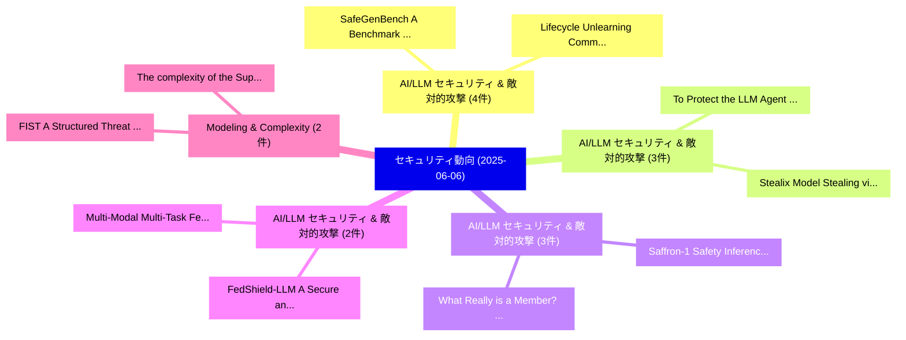

# 📅 02_daily: 日次エグゼクティブサマリー報告書 (2025-06-06)

**集計日時**: 2026-10-02 23:05:29 UTC  
**対象日付**: 2025-06-06  
**本日収集論文数**: 40 件  

---

## 💡 主要セキュリティ動向・脅威インサイト (Executive Insights)

本日の収集論文（計 40 件）において、以下の重点セキュリティ領域で活発な研究動向が確認されました：
- **AI/LLM セキュリティ & 敵対的攻撃** (4 件): 注目論文として 「SafeGenBench: A Benchmark Fram...」、「Lifecycle Unlearning Commitmen...」 等が発表され、実務防御および攻撃検証の進展が見られます。
- **AI/LLM セキュリティ & 敵対的攻撃** (3 件): 注目論文として 「To Protect the LLM Agent Again...」、「Stealix: Model Stealing via Pr...」 等が発表され、実務防御および攻撃検証の進展が見られます。
- **AI/LLM セキュリティ & 敵対的攻撃** (3 件): 注目論文として 「What Really is a Member? Discr...」、「Saffron-1: Safety Inference Sc...」 等が発表され、実務防御および攻撃検証の進展が見られます。
- **AI/LLM セキュリティ & 敵対的攻撃** (2 件): 注目論文として 「FedShield-LLM: A Secure and Sc...」、「Multi-Modal Multi-Task Federat...」 等が発表され、実務防御および攻撃検証の進展が見られます。
- **Modeling & Complexity** (2 件): 注目論文として 「FIST: A Structured Threat Mode...」、「The complexity of the SupportM...」 等が発表され、実務防御および攻撃検証の進展が見られます。

### 🗺️ 技術・脅威トピックマインドマップ

---

## 📌 日次セキュリティ論文一覧 (日本語表形式)

| No | arXiv ID | 論文タイトル (日本語訳) | 重要キーワード | 構造化エグゼクティブ要約 (背景・提案・影響) | 脅威分類 | 詳細リンク |
|---|---|---|---|---|---|---|
| 1 | `2506.05640v2` | [FedShield-LLM: A Secure and Scalable Federated Fine-Tuned Large Language Model（セキュリティ分析論文）](../../okf/papers/2025-06-06/2506.05640.md) | `Tuned Large Language Model`, `Scalable Federated Fine`, `Fine-Tuned Large` | 【提案】概要 (Overview & Key Finding) 本論文「FedShield-LLM: A Secure and Scalable Federated Fine-Tun...。実証評価により経営層・セキュリティ管理者向け推奨アクション (E... | `cs.CR` | [arXiv](https://arxiv.org/abs/2506.05640v2) &#124; [OKF](../../okf/papers/2025-06-06/2506.05640.md) |
| 2 | `2506.05683v4` | [Multi-Modal Multi-Task Federated Foundation Models for Next-Generation Extended Reality Systems: Privacy-Preserving Distributed Intelligence in AR/VR/MRに向けて](../../okf/papers/2025-06-06/2506.05683.md) | `Task Federated Foundation Models`, `Generation Extended Reality Systems`, `Preserving Distributed Intelligence` | 【提案】概要 (Overview & Key Finding) 本論文「Multi-Modal Multi-Task Federated Foundation Models for ...。実証評価により経営層・セキュリティ管理者向け推奨アクション (E... | `cs.CR` | [arXiv](https://arxiv.org/abs/2506.05683v4) &#124; [OKF](../../okf/papers/2025-06-06/2506.05683.md) |
| 3 | `2506.05692v3` | [SafeGenBench: A Benchmark Framework for Security 脆弱性検出 in LLM-Generated Code](../../okf/papers/2025-06-06/2506.05692.md) | `Generated Code`, `LLM-Generated Code`, `Security Vulnerability Detection` | 【提案】概要 (Overview & Key Finding) 本論文「SafeGenBench: A Benchmark Framework for Security 脆弱性検出 ...。実証評価により経営層・セキュリティ管理者向け推奨アクション (E... | `cs.CR` | [arXiv](https://arxiv.org/abs/2506.05692v3) &#124; [OKF](../../okf/papers/2025-06-06/2506.05692.md) |
| 4 | `2506.05708v1` | [Hybrid Stabilization Protocol for Cross-Chain Digital Assets Using Adaptor Signatures and AI-Driven Arbitrage（セキュリティ分析論文）](../../okf/papers/2025-06-06/2506.05708.md) | `Chain Digital Assets Using Adaptor Signatures`, `Hybrid Stabilization Protocol`, `Cross-Chain Digital` | 【提案】概要 (Overview & Key Finding) 本論文「Hybrid Stabilization Protocol for Cross-Chain Digital A...。実証評価により経営層・セキュリティ管理者向け推奨アクション (E... | `cs.CR` | [arXiv](https://arxiv.org/abs/2506.05708v1) &#124; [OKF](../../okf/papers/2025-06-06/2506.05708.md) |
| 5 | `2506.05711v1` | [A symmetric LWE-based Multi-Recipient Cryptosystem（セキュリティ分析論文）](../../okf/papers/2025-06-06/2506.05711.md) | `Recipient Cryptosystem`, `LWE-based Multi`, `Saikat Gope` | 【提案】概要 (Overview & Key Finding) 本論文「A symmetric LWE-based Multi-Recipient Cryptosystem（セキュリ...。実証評価により経営層・セキュリティ管理者向け推奨アクション (E... | `cs.CR` | [arXiv](https://arxiv.org/abs/2506.05711v1) &#124; [OKF](../../okf/papers/2025-06-06/2506.05711.md) |
| 6 | `2506.05734v1` | [There's Waldo: PCB Tamper Forensic Analysis using Explainable AI on Impedance Signatures（セキュリティ分析論文）](../../okf/papers/2025-06-06/2506.05734.md) | `Impedance Signatures`, `Maryam Saadat Safa`, `Seyedmohammad Nouraniboosjin` | 【提案】概要 (Overview & Key Finding) 本論文「There's Waldo: PCB Tamper Forensic Analysis using Expla...。実証評価により経営層・セキュリティ管理者向け推奨アクション (E... | `cs.CR` | [arXiv](https://arxiv.org/abs/2506.05734v1) &#124; [OKF](../../okf/papers/2025-06-06/2506.05734.md) |
| 7 | `2506.05739v1` | [To Protect the LLM Agent Against the Prompt Injection Attack with Polymorphic Prompt（セキュリティ分析論文）](../../okf/papers/2025-06-06/2506.05739.md) | `Prompt Injection Attack`, `Polymorphic Prompt`, `Zhilong Wang` | 【提案】概要 (Overview & Key Finding) 本論文「To Protect the LLM Agent Against the プロンプトインジェクション Atta...。実証評価により経営層・セキュリティ管理者向け推奨アクション (E... | `cs.CR` | [arXiv](https://arxiv.org/abs/2506.05739v1) &#124; [OKF](../../okf/papers/2025-06-06/2506.05739.md) |
| 8 | `2506.05740v1` | [FIST: A Structured Threat Modeling Framework for Fraud Incidents（セキュリティ分析論文）](../../okf/papers/2025-06-06/2506.05740.md) | `Fraud Incidents`, `Chen Dai`, `Xian Jiang` | 【提案】概要 (Overview & Key Finding) 本論文「FIST: A Structured 脅威 Modeling Framework for Fraud Inci...。実証評価により経営層・セキュリティ管理者向け推奨アクション (E... | `cs.CR` | [arXiv](https://arxiv.org/abs/2506.05740v1) &#124; [OKF](../../okf/papers/2025-06-06/2506.05740.md) |
| 9 | `2506.05743v1` | [When Better Features Mean Greater Risks: The Performance-Privacy Trade-Off in Contrastive Learning（セキュリティ分析論文）](../../okf/papers/2025-06-06/2506.05743.md) | `Privacy Trade`, `Contrastive Learning`, `Performance-Privacy Trade` | 【提案】概要 (Overview & Key Finding) 本論文「When Better Features Mean Greater Risks: The Performanc...。実証評価により経営層・セキュリティ管理者向け推奨アクション (E... | `cs.CR` | [arXiv](https://arxiv.org/abs/2506.05743v1) &#124; [OKF](../../okf/papers/2025-06-06/2506.05743.md) |
| 10 | `2506.05844v2` | [$	ext{C}^{2}	ext{BNVAE}$: Dual-Conditional Deep Generation of Network Traffic Data for Network Intrusion Detection System Balancing（セキュリティ分析論文）](../../okf/papers/2025-06-06/2506.05844.md) | `Network Intrusion Detection System Balancing`, `Conditional Deep Generation`, `Network Traffic Data` | 【提案】概要 (Overview & Key Finding) 本論文「$\text{C}^{2}\text{BNVAE}$: Dual-Conditional Deep Gener...。実証評価により経営層・セキュリティ管理者向け推奨アクション (E... | `cs.CR` | [arXiv](https://arxiv.org/abs/2506.05844v2) &#124; [OKF](../../okf/papers/2025-06-06/2506.05844.md) |
| 11 | `2506.05867v1` | [Stealix: Model Stealing via Prompt Evolution（セキュリティ分析論文）](../../okf/papers/2025-06-06/2506.05867.md) | `Model Stealing`, `Prompt Evolution`, `Zhixiong Zhuang` | 【提案】概要 (Overview & Key Finding) 本論文「Stealix: Model Stealing via Prompt Evolution（セキュリティ分析論文...。実証評価により経営層・セキュリティ管理者向け推奨アクション (E... | `cs.CR` | [arXiv](https://arxiv.org/abs/2506.05867v1) &#124; [OKF](../../okf/papers/2025-06-06/2506.05867.md) |
| 12 | `2506.05900v1` | [Differentially Private Explanations for Clusters（セキュリティ分析論文）](../../okf/papers/2025-06-06/2506.05900.md) | `Differentially Private Explanations`, `Amir Gilad`, `Tova Milo` | 【提案】概要 (Overview & Key Finding) 本論文「Differentially Private Explanations for Clusters（セキュリティ...。実証評価により経営層・セキュリティ管理者向け推奨アクション (E... | `cs.CR` | [arXiv](https://arxiv.org/abs/2506.05900v1) &#124; [OKF](../../okf/papers/2025-06-06/2506.05900.md) |
| 13 | `2506.05908v2` | [QualitEye: Public and Privacy-preserving Gaze Data Quality Verification（セキュリティ分析論文）](../../okf/papers/2025-06-06/2506.05908.md) | `Gaze Data Quality Verification`, `Privacy-preserving Gaze`, `Mayar Elfares` | 【提案】概要 (Overview & Key Finding) 本論文「QualitEye: Public and Privacy-preserving Gaze Data Qual...。実証評価により経営層・セキュリティ管理者向け推奨アクション (E... | `cs.CR` | [arXiv](https://arxiv.org/abs/2506.05908v2) &#124; [OKF](../../okf/papers/2025-06-06/2506.05908.md) |
| 14 | `2506.05932v1` | [Combating Reentrancy Bugs on Sharded Blockchains（セキュリティ分析論文）](../../okf/papers/2025-06-06/2506.05932.md) | `Combating Reentrancy Bugs`, `Sharded Blockchains`, `Roman Kashitsyn` | 【提案】概要 (Overview & Key Finding) 本論文「Combating Reentrancy Bugs on Sharded Blockchains（セキュリティ...。実証評価により経営層・セキュリティ管理者向け推奨アクション (E... | `cs.CR` | [arXiv](https://arxiv.org/abs/2506.05932v1) &#124; [OKF](../../okf/papers/2025-06-06/2506.05932.md) |
| 15 | `2506.06003v1` | [What Really is a Member? Discrediting Membership Inference via Poisoning（セキュリティ分析論文）](../../okf/papers/2025-06-06/2506.06003.md) | `Discrediting Membership Inference`, `Amrita Roy Chowdhury`, `Neal Mangaokar` | 【提案】Discrediting Membership Inference via Poisoning ### (日本語題名: What Really is a Member?。実証評価により経営層・セキュリティ管理者向け推奨アクション (Executi... | `cs.CR` | [arXiv](https://arxiv.org/abs/2506.06003v1) &#124; [OKF](../../okf/papers/2025-06-06/2506.06003.md) |
| 16 | `2506.06018v1` | [Optimization-Free Universal Watermark Forgery with Regenerative Diffusion Models（セキュリティ分析論文）](../../okf/papers/2025-06-06/2506.06018.md) | `Free Universal Watermark Forgery`, `Regenerative Diffusion Models`, `Optimization-Free Universal` | 【提案】概要 (Overview & Key Finding) 本論文「Optimization-Free Universal Watermark Forgery with Rege...。実証評価により経営層・セキュリティ管理者向け推奨アクション (E... | `cs.CR` | [arXiv](https://arxiv.org/abs/2506.06018v1) &#124; [OKF](../../okf/papers/2025-06-06/2506.06018.md) |
| 17 | `2506.06062v2` | [Minoritised Ethnic People's Security and Privacy Concerns and Responses Essential Online Servicesに向けて](../../okf/papers/2025-06-06/2506.06062.md) | `Minoritised Ethnic People`, `Privacy Concerns`, `Responses Essential Online` | 【提案】概要 (Overview & Key Finding) 本論文「Minoritised Ethnic People's Security and Privacy Concer...。実証評価により経営層・セキュリティ管理者向け推奨アクション (E... | `cs.CR` | [arXiv](https://arxiv.org/abs/2506.06062v2) &#124; [OKF](../../okf/papers/2025-06-06/2506.06062.md) |
| 18 | `2506.06108v1` | [Synthetic Tabular Data: Methods, Attacks and Defenses（セキュリティ分析論文）](../../okf/papers/2025-06-06/2506.06108.md) | `Synthetic Tabular Data`, `Graham Cormode`, `Samuel Maddock` | 【提案】概要 (Overview & Key Finding) 本論文「Synthetic Tabular Data: Methods, Attacks and Defenses（セ...。実証評価により経営層・セキュリティ管理者向け推奨アクション (E... | `cs.CR` | [arXiv](https://arxiv.org/abs/2506.06108v1) &#124; [OKF](../../okf/papers/2025-06-06/2506.06108.md) |
| 19 | `2506.06112v1` | [Lifecycle Unlearning Commitment Management: Measuring Sample-level Unlearning Completenessに向けて](../../okf/papers/2025-06-06/2506.06112.md) | `Measuring Sample`, `Sample-level Unlearning`, `Lifecycle Unlearning Commitment Management` | 【提案】概要 (Overview & Key Finding) 本論文「Lifecycle Unlearning Commitment Management: Measuring S...。実証評価により経営層・セキュリティ管理者向け推奨アクション (E... | `cs.CR` | [arXiv](https://arxiv.org/abs/2506.06112v1) &#124; [OKF](../../okf/papers/2025-06-06/2506.06112.md) |
| 20 | `2506.06119v2` | [SATversary: Adversarial Attacks and Defenses for Satellite Fingerprinting（セキュリティ分析論文）](../../okf/papers/2025-06-06/2506.06119.md) | `Adversarial Attacks`, `Satellite Fingerprinting`, `Joshua Smailes` | 【提案】概要 (Overview & Key Finding) 本論文「SATversary: 敵対的攻撃s and Defenses for Satellite Fingerpri...。実証評価により経営層・セキュリティ管理者向け推奨アクション (E... | `cs.CR` | [arXiv](https://arxiv.org/abs/2506.06119v2) &#124; [OKF](../../okf/papers/2025-06-06/2506.06119.md) |
| 21 | `2506.06124v1` | [PrivTru: A Privacy-by-Design Data Trustee Minimizing Information Leakage（セキュリティ分析論文）](../../okf/papers/2025-06-06/2506.06124.md) | `Design Data Trustee Minimizing Information Leakage`, `Lukas Gehring`, `Florian Tschorsch` | 【提案】概要 (Overview & Key Finding) 本論文「PrivTru: A Privacy-by-Design Data Trustee Minimizing In...。実証評価により経営層・セキュリティ管理者向け推奨アクション (E... | `cs.CR` | [arXiv](https://arxiv.org/abs/2506.06124v1) &#124; [OKF](../../okf/papers/2025-06-06/2506.06124.md) |
| 22 | `2506.06151v2` | [Joint-GCG: Unified Gradient-Based Poisoning Attacks on Retrieval-Augmented Generation Systems（セキュリティ分析論文）](../../okf/papers/2025-06-06/2506.06151.md) | `Based Poisoning Attacks`, `Augmented Generation Systems`, `Unified Gradient` | 【提案】概要 (Overview & Key Finding) 本論文「Joint-GCG: Unified Gradient-Based Poisoning Attacks on ...。実証評価により経営層・セキュリティ管理者向け推奨アクション (E... | `cs.CR` | [arXiv](https://arxiv.org/abs/2506.06151v2) &#124; [OKF](../../okf/papers/2025-06-06/2506.06151.md) |
| 23 | `2506.06161v2` | [ORCAS: Obfuscation-Resilient Binary Code Similarity Analysis using Dominance Enhanced Semantic Graph（セキュリティ分析論文）](../../okf/papers/2025-06-06/2506.06161.md) | `Dominance Enhanced Semantic Graph`, `Obfuscation-Resilient Binary`, `Yufeng Wang` | 【提案】概要 (Overview & Key Finding) 本論文「ORCAS: Obfuscation-Resilient Binary Code Similarity Ana...。実証評価により経営層・セキュリティ管理者向け推奨アクション (E... | `cs.CR` | [arXiv](https://arxiv.org/abs/2506.06161v2) &#124; [OKF](../../okf/papers/2025-06-06/2506.06161.md) |
| 24 | `2506.06226v3` | [No Data? No Problem: Synthesizing Security Graphs for Better Intrusion Detection（セキュリティ分析論文）](../../okf/papers/2025-06-06/2506.06226.md) | `Synthesizing Security Graphs`, `Better Intrusion Detection`, `Wajih Ul Hassan` | 【提案】No Problem: Synthesizing Security Graphs for Better Intrusion Detection ### (日本語題名: No ...。実証評価により経営層・セキュリティ管理者向け推奨アクション (E... | `cs.CR` | [arXiv](https://arxiv.org/abs/2506.06226v3) &#124; [OKF](../../okf/papers/2025-06-06/2506.06226.md) |
| 25 | `2506.06407v3` | [TimeWak: Temporal Chained-Hashing Watermark for Time Series Data（セキュリティ分析論文）](../../okf/papers/2025-06-06/2506.06407.md) | `Time Series Data`, `Temporal Chained`, `Hashing Watermark` | 【提案】概要 (Overview & Key Finding) 本論文「TimeWak: Temporal Chained-Hashing Watermark for Time Se...。実証評価により経営層・セキュリティ管理者向け推奨アクション (E... | `cs.CR` | [arXiv](https://arxiv.org/abs/2506.06407v3) &#124; [OKF](../../okf/papers/2025-06-06/2506.06407.md) |
| 26 | `2506.06409v2` | [HeavyWater and SimplexWater: Distortion-Free LLM Watermarks for Low-Entropy Next-Token Predictions（セキュリティ分析論文）](../../okf/papers/2025-06-06/2506.06409.md) | `Entropy Next`, `Token Predictions`, `Distortion-Free LLM` | 【提案】概要 (Overview & Key Finding) 本論文「HeavyWater and SimplexWater: Distortion-Free LLM Waterm...。実証評価により経営層・セキュリティ管理者向け推奨アクション (E... | `cs.CR` | [arXiv](https://arxiv.org/abs/2506.06409v2) &#124; [OKF](../../okf/papers/2025-06-06/2506.06409.md) |
| 27 | `2506.06414v2` | [Misuse Mitigation Against Covert Adversariesのベンチマーク評価](../../okf/papers/2025-06-06/2506.06414.md) | `Davis Brown`, `Mahdi Sabbaghi`, `Luze Sun` | 【提案】概要 (Overview & Key Finding) 本論文「Misuse Mitigation Against Covert Adversariesのベンチマーク評価」（...。実証評価によりPappas, Eric Wong, Hamed ... | `cs.CR` | [arXiv](https://arxiv.org/abs/2506.06414v2) &#124; [OKF](../../okf/papers/2025-06-06/2506.06414.md) |
| 28 | `2506.06444v2` | [Saffron-1: Safety Inference Scaling（セキュリティ分析論文）](../../okf/papers/2025-06-06/2506.06444.md) | `Safety Inference Scaling`, `Ruizhong Qiu`, `Gaotang Li` | 【提案】概要 (Overview & Key Finding) 本論文「Saffron-1: Safety Inference Scaling（セキュリティ分析論文）」（原題: Sa...。実証評価により経営層・セキュリティ管理者向け推奨アクション (E... | `cs.CR` | [arXiv](https://arxiv.org/abs/2506.06444v2) &#124; [OKF](../../okf/papers/2025-06-06/2506.06444.md) |
| 29 | `2506.06486v3` | [A Certified Unlearning Approach without Access to Source Data（セキュリティ分析論文）](../../okf/papers/2025-06-06/2506.06486.md) | `Source Data`, `Umit Yigit Basaran`, `Sk Miraj Ahmed` | 【提案】背景とセキュリティ上の課題 (Background & Problem) 本研究はサイバー脅威環境におけるセキュリティ構造・脆弱性の検証を目的としています。(主要検出項目: ...。実証評価により経営層・セキュリティ管理者向け推奨アクション (E... | `cs.CR` | [arXiv](https://arxiv.org/abs/2506.06486v3) &#124; [OKF](../../okf/papers/2025-06-06/2506.06486.md) |
| 30 | `2506.06488v3` | [Membership Inference Attacks for Unseen Classes（セキュリティ分析論文）](../../okf/papers/2025-06-06/2506.06488.md) | `Membership Inference Attacks`, `Unseen Classes`, `Zhiwei Steven Wu` | 【提案】概要 (Overview & Key Finding) 本論文「Membership Inference Attacks for Unseen Classes（セキュリティ分...。実証評価により経営層・セキュリティ管理者向け推奨アクション (E... | `cs.CR` | [arXiv](https://arxiv.org/abs/2506.06488v3) &#124; [OKF](../../okf/papers/2025-06-06/2506.06488.md) |
| 31 | `2506.06518v1` | [A Systematic Review of Poisoning Attacks Against 大規模言語モデル](../../okf/papers/2025-06-06/2506.06518.md) | `Systematic Review`, `Neil Fendley`, `Joshua Carney` | 【提案】概要 (Overview & Key Finding) 本論文「A Systematic Review of Poisoning Attacks Against 大規模言語モ...。実証評価によりStaley, Joshua Carney, Wi... | `cs.CR` | [arXiv](https://arxiv.org/abs/2506.06518v1) &#124; [OKF](../../okf/papers/2025-06-06/2506.06518.md) |
| 32 | `2506.06530v4` | [Residual-PAC Privacy: Automatic Privacy Control Beyond the Gaussian Barrier（セキュリティ分析論文）](../../okf/papers/2025-06-06/2506.06530.md) | `Automatic Privacy Control Beyond`, `Gaussian Barrier`, `Residual-PAC Privacy` | 【提案】概要 (Overview & Key Finding) 本論文「Residual-PAC Privacy: Automatic Privacy Control Beyond ...。実証評価により経営層・セキュリティ管理者向け推奨アクション (E... | `cs.CR` | [arXiv](https://arxiv.org/abs/2506.06530v4) &#124; [OKF](../../okf/papers/2025-06-06/2506.06530.md) |
| 33 | `2506.06547v1` | [The complexity of the SupportMinors Modeling for the MinRank Problem（セキュリティ分析論文）](../../okf/papers/2025-06-06/2506.06547.md) | `Daniel Cabarcas`, `Giulia Gaggero`, `Elisa Gorla` | 【提案】概要 (Overview & Key Finding) 本論文「The complexity of the SupportMinors Modeling for the Mi...。実証評価により経営層・セキュリティ管理者向け推奨アクション (E... | `cs.CR` | [arXiv](https://arxiv.org/abs/2506.06547v1) &#124; [OKF](../../okf/papers/2025-06-06/2506.06547.md) |
| 34 | `2506.06549v3` | [GeoClip: Geometry-Aware Clipping for Differentially Private SGD（セキュリティ分析論文）](../../okf/papers/2025-06-06/2506.06549.md) | `Aware Clipping`, `Differentially Private`, `Geometry-Aware Clipping` | 【提案】概要 (Overview & Key Finding) 本論文「GeoClip: Geometry-Aware Clipping for Differentially Pri...。実証評価により経営層・セキュリティ管理者向け推奨アクション (E... | `cs.CR` | [arXiv](https://arxiv.org/abs/2506.06549v3) &#124; [OKF](../../okf/papers/2025-06-06/2506.06549.md) |
| 35 | `2506.06556v1` | [SDN-Based False Data Detection With Its Mitigation and Machine Learning Robustness for In-Vehicle Networks（セキュリティ分析論文）](../../okf/papers/2025-06-06/2506.06556.md) | `Machine Learning Robustness`, `SDN-Based False`, `Vehicle Networks` | 【提案】概要 (Overview & Key Finding) 本論文「SDN-Based False Data Detection With Its Mitigation and ...。実証評価により# SDN-Based False Data De... | `cs.CR` | [arXiv](https://arxiv.org/abs/2506.06556v1) &#124; [OKF](../../okf/papers/2025-06-06/2506.06556.md) |
| 36 | `2506.06563v1` | [Traffic Sign Recognition Systems in Autonomous Vehiclesのセキュリティ強化](../../okf/papers/2025-06-06/2506.06563.md) | `Securing Traffic Sign Recognition Systems`, `Traffic Sign Recognition Systems`, `Autonomous Vehicles` | 【提案】概要 (Overview & Key Finding) 本論文「Traffic Sign Recognition Systems in Autonomous Vehicles...。実証評価により経営層・セキュリティ管理者向け推奨アクション (E... | `cs.CR` | [arXiv](https://arxiv.org/abs/2506.06563v1) &#124; [OKF](../../okf/papers/2025-06-06/2506.06563.md) |
| 37 | `2506.06565v1` | [Adapting Under Fire: Multi-Agent Reinforcement Learning for Adversarial Drift in Network Security（セキュリティ分析論文）](../../okf/papers/2025-06-06/2506.06565.md) | `Agent Reinforcement Learning`, `Multi-Agent Reinforcement`, `Adversarial Drift` | 【提案】概要 (Overview & Key Finding) 本論文「Adapting Under Fire: Multi-Agent Reinforcement Learning...。実証評価により経営層・セキュリティ管理者向け推奨アクション (E... | `cs.CR` | [arXiv](https://arxiv.org/abs/2506.06565v1) &#124; [OKF](../../okf/papers/2025-06-06/2506.06565.md) |
| 38 | `2506.06572v3` | [Cyber Security of Sensor Systems for State Sequence Estimation: A Machine Learning Approach（セキュリティ分析論文）](../../okf/papers/2025-06-06/2506.06572.md) | `State Sequence Estimation`, `Cyber Security`, `Sensor Systems` | 【提案】概要 (Overview & Key Finding) 本論文「Cyber Security of Sensor Systems for State Sequence Est...。実証評価により経営層・セキュリティ管理者向け推奨アクション (E... | `cs.CR` | [arXiv](https://arxiv.org/abs/2506.06572v3) &#124; [OKF](../../okf/papers/2025-06-06/2506.06572.md) |
| 39 | `2506.11094v2` | [The Scales of Justitia: A Comprehensive Survey on Safety Evaluation of LLMs（セキュリティ分析論文）](../../okf/papers/2025-06-06/2506.11094.md) | `Comprehensive Survey`, `Songyang Liu`, `Chaozhuo Li` | 【提案】概要 (Overview & Key Finding) 本論文「The Scales of Justitia: A Comprehensive Survey on Safet...。実証評価により経営層・セキュリティ管理者向け推奨アクション (E... | `cs.CR` | [arXiv](https://arxiv.org/abs/2506.11094v2) &#124; [OKF](../../okf/papers/2025-06-06/2506.11094.md) |
| 40 | `2508.00832v1` | [A Comparative Study of Classical and Post-Quantum Cryptographic Algorithms in the Era of Quantum Computing（セキュリティ分析論文）](../../okf/papers/2025-06-06/2508.00832.md) | `Quantum Cryptographic Algorithms`, `Quantum Computing`, `Post-Quantum Cryptographic` | 【提案】概要 (Overview & Key Finding) 本論文「A Comparative Study of Classical and Post-量子 Cryptograp...。実証評価により経営層・セキュリティ管理者向け推奨アクション (E... | `cs.CR` | [arXiv](https://arxiv.org/abs/2508.00832v1) &#124; [OKF](../../okf/papers/2025-06-06/2508.00832.md) |

