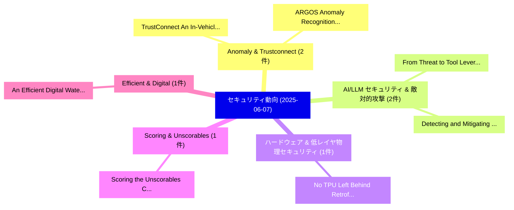

# 📅 02_daily: 日次エグゼクティブサマリー報告書 (2025-06-07)

**集計日時**: 2026-10-02 23:05:29 UTC  
**対象日付**: 2025-06-07  
**本日収集論文数**: 15 件  

---

## 💡 主要セキュリティ動向・脅威インサイト (Executive Insights)

本日の収集論文（計 15 件）において、以下の重点セキュリティ領域で活発な研究動向が確認されました：
- **Anomaly & Trustconnect** (2 件): 注目論文として 「TrustConnect: An In-Vehicle An...」、「ARGOS: Anomaly Recognition and...」 等が発表され、実務防御および攻撃検証の進展が見られます。
- **AI/LLM セキュリティ & 敵対的攻撃** (2 件): 注目論文として 「From Threat to Tool: Leveragin...」、「Detecting and Mitigating SQL I...」 等が発表され、実務防御および攻撃検証の進展が見られます。
- **ハードウェア & 低レイヤ物理セキュリティ** (1 件): 注目論文として 「No TPU Left Behind: Retrofitti...」 等が発表され、実務防御および攻撃検証の進展が見られます。
- **Scoring & Unscorables** (1 件): 注目論文として 「Scoring the Unscorables: Cyber...」 等が発表され、実務防御および攻撃検証の進展が見られます。
- **Efficient & Digital** (1 件): 注目論文として 「An Efficient Digital Watermark...」 等が発表され、実務防御および攻撃検証の進展が見られます。

### 🗺️ 技術・脅威トピックマインドマップ

---

## 📌 日次セキュリティ論文一覧 (日本語表形式)

| No | arXiv ID | 論文タイトル (日本語訳) | 重要キーワード | 構造化エグゼクティブ要約 (背景・提案・影響) | 脅威分類 | 詳細リンク |
|---|---|---|---|---|---|---|
| 1 | `2506.06597v2` | [No TPU Left Behind: Retrofitting Side-Channel Protection into Edge TPUs（セキュリティ分析論文）](../../okf/papers/2025-06-07/2506.06597.md) | `Left Behind`, `Retrofitting Side`, `Channel Protection` | 【提案】概要 (Overview & Key Finding) 本論文「No TPU Left Behind: Retrofitting サイドチャネル攻撃 Protection i...。実証評価により経営層・セキュリティ管理者向け推奨アクション (E... | `cs.CR` | [arXiv](https://arxiv.org/abs/2506.06597v2) &#124; [OKF](../../okf/papers/2025-06-07/2506.06597.md) |
| 2 | `2506.06604v1` | [Scoring the Unscorables: Cyber Risk Assessment Beyond Internet Scans（セキュリティ分析論文）](../../okf/papers/2025-06-07/2506.06604.md) | `Cyber Risk Assessment Beyond Internet Scans`, `Armin Sarabi`, `Manish Karir` | 【提案】概要 (Overview & Key Finding) 本論文「Scoring the Unscorables: Cyber Risk Assessment Beyond I...。実証評価により経営層・セキュリティ管理者向け推奨アクション (E... | `cs.CR` | [arXiv](https://arxiv.org/abs/2506.06604v1) &#124; [OKF](../../okf/papers/2025-06-07/2506.06604.md) |
| 3 | `2506.06635v1` | [TrustConnect: An In-Vehicle Anomaly Detection Framework through Topology-Based Trust Rating（セキュリティ分析論文）](../../okf/papers/2025-06-07/2506.06635.md) | `Based Trust Rating`, `In-Vehicle Anomaly`, `Topology-Based Trust` | 【提案】概要 (Overview & Key Finding) 本論文「TrustConnect: An In-Vehicle Anomaly Detection Framework...。実証評価により経営層・セキュリティ管理者向け推奨アクション (E... | `cs.CR` | [arXiv](https://arxiv.org/abs/2506.06635v1) &#124; [OKF](../../okf/papers/2025-06-07/2506.06635.md) |
| 4 | `2506.06691v1` | [An Efficient Digital Watermarking Technique for Small Scale devices（セキュリティ分析論文）](../../okf/papers/2025-06-07/2506.06691.md) | `Small Scale`, `Aparna Santra Biswas`, `Kaushik Talathi` | 【提案】概要 (Overview & Key Finding) 本論文「An Efficient Digital Watermarking Technique for Small S...。実証評価により経営層・セキュリティ管理者向け推奨アクション (E... | `cs.CR` | [arXiv](https://arxiv.org/abs/2506.06691v1) &#124; [OKF](../../okf/papers/2025-06-07/2506.06691.md) |
| 5 | `2506.06694v6` | [Breaking Data Silos: Open and Scalable Mobility Foundation Models via Generative Continual Learningに向けて](../../okf/papers/2025-06-07/2506.06694.md) | `Scalable Mobility Foundation Models`, `Breaking Data Silos`, `Generative Continual` | 【提案】概要 (Overview & Key Finding) 本論文「Breaking Data Silos: Open and Scalable Mobility Foundat...。実証評価により経営層・セキュリティ管理者向け推奨アクション (E... | `cs.CR` | [arXiv](https://arxiv.org/abs/2506.06694v6) &#124; [OKF](../../okf/papers/2025-06-07/2506.06694.md) |
| 6 | `2506.06730v1` | [Fuse and Federate: Enhancing EV Charging Station Security with Multimodal Fusion and 連合学習](../../okf/papers/2025-06-07/2506.06730.md) | `Charging Station Security`, `Multimodal Fusion`, `Federated Learning` | 【提案】概要 (Overview & Key Finding) 本論文「Fuse and Federate: Enhancing EV Charging Station Securi...。実証評価により経営層・セキュリティ管理者向け推奨アクション (E... | `cs.CR` | [arXiv](https://arxiv.org/abs/2506.06730v1) &#124; [OKF](../../okf/papers/2025-06-07/2506.06730.md) |
| 7 | `2506.06735v1` | [Ai-Driven Vulnerability Analysis in Smart Contracts: Trends, Challenges and Future Directions（セキュリティ分析論文）](../../okf/papers/2025-06-07/2506.06735.md) | `Smart Contracts`, `Ai-Driven Vulnerability`, `Future Directions` | 【提案】概要 (Overview & Key Finding) 本論文「Ai-Driven 脆弱性 Analysis in スマートコントラクトs: Trends, Challeng...。実証評価により経営層・セキュリティ管理者向け推奨アクション (E... | `cs.CR` | [arXiv](https://arxiv.org/abs/2506.06735v1) &#124; [OKF](../../okf/papers/2025-06-07/2506.06735.md) |
| 8 | `2506.06742v3` | [LADSG: Label-Anonymized Distillation and Similar Gradient Substitution for Label Privacy in Vertical 連合学習](../../okf/papers/2025-06-07/2506.06742.md) | `Similar Gradient Substitution`, `Anonymized Distillation`, `Label-Anonymized Distillation` | 【提案】概要 (Overview & Key Finding) 本論文「LADSG: Label-Anonymized Distillation and Similar Gradie...。実証評価により経営層・セキュリティ管理者向け推奨アクション (E... | `cs.CR` | [arXiv](https://arxiv.org/abs/2506.06742v3) &#124; [OKF](../../okf/papers/2025-06-07/2506.06742.md) |
| 9 | `2506.06825v1` | [Identity Deepfake Threats to Biometric Authentication Systems: Public and Expert Perspectives（セキュリティ分析論文）](../../okf/papers/2025-06-07/2506.06825.md) | `Identity Deepfake Threats`, `Biometric Authentication Systems`, `Expert Perspectives` | 【提案】概要 (Overview & Key Finding) 本論文「Identity Deepfake Threats to Biometric Authentication S...。実証評価により経営層・セキュリティ管理者向け推奨アクション (E... | `cs.CR` | [arXiv](https://arxiv.org/abs/2506.06825v1) &#124; [OKF](../../okf/papers/2025-06-07/2506.06825.md) |
| 10 | `2506.06861v1` | [Differentially Private Sparse Linear Regression with Heavy-tailed Responses（セキュリティ分析論文）](../../okf/papers/2025-06-07/2506.06861.md) | `Differentially Private Sparse Linear Regression`, `Heavy-tailed Responses`, `Xizhi Tian` | 【提案】概要 (Overview & Key Finding) 本論文「Differentially Private Sparse Linear Regression with He...。実証評価により経営層・セキュリティ管理者向け推奨アクション (E... | `cs.CR` | [arXiv](https://arxiv.org/abs/2506.06861v1) &#124; [OKF](../../okf/papers/2025-06-07/2506.06861.md) |
| 11 | `2506.06891v3` | [Robust In-Context Reinforcement Learning Under Reward Poisoning Attacks（セキュリティ分析論文）](../../okf/papers/2025-06-07/2506.06891.md) | `In-Context Reinforcement`, `Paulius Sasnauskas`, `Raw Meta` | 【提案】概要 (Overview & Key Finding) 本論文「Robust In-Context Reinforcement Learning Under Reward P...。実証評価により経営層・セキュリティ管理者向け推奨アクション (E... | `cs.CR` | [arXiv](https://arxiv.org/abs/2506.06891v3) &#124; [OKF](../../okf/papers/2025-06-07/2506.06891.md) |
| 12 | `2506.06916v1` | [ARGOS: Anomaly Recognition and Guarding through O-RAN Sensing（セキュリティ分析論文）](../../okf/papers/2025-06-07/2506.06916.md) | `Anomaly Recognition`, `O-RAN Sensing`, `Stavros Dimou` | 【提案】概要 (Overview & Key Finding) 本論文「ARGOS: Anomaly Recognition and Guarding through O-RAN S...。実証評価により経営層・セキュリティ管理者向け推奨アクション (E... | `cs.CR` | [arXiv](https://arxiv.org/abs/2506.06916v1) &#124; [OKF](../../okf/papers/2025-06-07/2506.06916.md) |
| 13 | `2506.06933v1` | [Rewriting the Budget: A General Framework for Black-Box Attacks Under Cost Asymmetry（セキュリティ分析論文）](../../okf/papers/2025-06-07/2506.06933.md) | `Black-Box Attacks`, `Mahdi Salmani`, `Alireza Abdollahpoorrostam` | 【提案】概要 (Overview & Key Finding) 本論文「Rewriting the Budget: A General Framework for Black-Box...。実証評価により経営層・セキュリティ管理者向け推奨アクション (E... | `cs.CR` | [arXiv](https://arxiv.org/abs/2506.06933v1) &#124; [OKF](../../okf/papers/2025-06-07/2506.06933.md) |
| 14 | `2506.10020v1` | [From Threat to Tool: Leveraging Refusal-Aware Injection Attacks for Safety Alignment（セキュリティ分析論文）](../../okf/papers/2025-06-07/2506.10020.md) | `Aware Injection Attacks`, `Leveraging Refusal`, `Refusal-Aware Injection` | 【提案】概要 (Overview & Key Finding) 本論文「From 脅威 to Tool: Leveraging Refusal-Aware Injection Att...。実証評価により経営層・セキュリティ管理者向け推奨アクション (E... | `cs.CR` | [arXiv](https://arxiv.org/abs/2506.10020v1) &#124; [OKF](../../okf/papers/2025-06-07/2506.10020.md) |
| 15 | `2506.17245v1` | [Detecting and Mitigating SQL Injection Vulnerabilities in Web Applications（セキュリティ分析論文）](../../okf/papers/2025-06-07/2506.17245.md) | `Injection Vulnerabilities`, `Web Applications`, `Sagar Neupane` | 【提案】概要 (Overview & Key Finding) 本論文「Detecting and Mitigating SQL Injection Vulnerabilities ...。実証評価により経営層・セキュリティ管理者向け推奨アクション (E... | `cs.CR` | [arXiv](https://arxiv.org/abs/2506.17245v1) &#124; [OKF](../../okf/papers/2025-06-07/2506.17245.md) |

