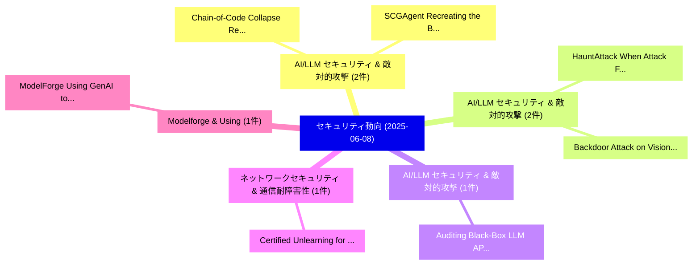

# 📅 02_daily: 日次エグゼクティブサマリー報告書 (2025-06-08)

**集計日時**: 2026-10-02 23:05:29 UTC  
**対象日付**: 2025-06-08  
**本日収集論文数**: 16 件  

---

## 💡 主要セキュリティ動向・脅威インサイト (Executive Insights)

本日の収集論文（計 16 件）において、以下の重点セキュリティ領域で活発な研究動向が確認されました：
- **AI/LLM セキュリティ & 敵対的攻撃** (2 件): 注目論文として 「Chain-of-Code Collapse: Reason...」、「SCGAgent: Recreating the Benef...」 等が発表され、実務防御および攻撃検証の進展が見られます。
- **AI/LLM セキュリティ & 敵対的攻撃** (2 件): 注目論文として 「HauntAttack: When Attack Follo...」、「Backdoor Attack on Vision Lang...」 等が発表され、実務防御および攻撃検証の進展が見られます。
- **AI/LLM セキュリティ & 敵対的攻撃** (1 件): 注目論文として 「Auditing Black-Box LLM APIs wi...」 等が発表され、実務防御および攻撃検証の進展が見られます。
- **ネットワークセキュリティ & 通信耐障害性** (1 件): 注目論文として 「Certified Unlearning for Neura...」 等が発表され、実務防御および攻撃検証の進展が見られます。
- **Modelforge & Using** (1 件): 注目論文として 「ModelForge: Using GenAI to Imp...」 等が発表され、実務防御および攻撃検証の進展が見られます。

### 🗺️ 技術・脅威トピックマインドマップ

---

## 📌 日次セキュリティ論文一覧 (日本語表形式)

| No | arXiv ID | 論文タイトル (日本語訳) | 重要キーワード | 構造化エグゼクティブ要約 (背景・提案・影響) | 脅威分類 | 詳細リンク |
|---|---|---|---|---|---|---|
| 1 | `2506.06971v2` | [Chain-of-Code Collapse: Reasoning Failures in LLMs via Adversarial Prompting in Code Generation（セキュリティ分析論文）](../../okf/papers/2025-06-08/2506.06971.md) | `Code Collapse`, `Reasoning Failures`, `Adversarial Prompting` | 【提案】概要 (Overview & Key Finding) 本論文「Chain-of-Code Collapse: Reasoning Failures in LLMs via ...。実証評価により経営層・セキュリティ管理者向け推奨アクション (E... | `cs.CR` | [arXiv](https://arxiv.org/abs/2506.06971v2) &#124; [OKF](../../okf/papers/2025-06-08/2506.06971.md) |
| 2 | `2506.06975v5` | [Auditing Black-Box LLM APIs with a Rank-Based Uniformity Test（セキュリティ分析論文）](../../okf/papers/2025-06-08/2506.06975.md) | `Based Uniformity Test`, `Auditing Black`, `Black-Box LLM` | 【提案】概要 (Overview & Key Finding) 本論文「Auditing Black-Box LLM APIs with a Rank-Based Uniformit...。実証評価により経営層・セキュリティ管理者向け推奨アクション (E... | `cs.CR` | [arXiv](https://arxiv.org/abs/2506.06975v5) &#124; [OKF](../../okf/papers/2025-06-08/2506.06975.md) |
| 3 | `2506.06985v2` | [Certified Unlearning for Neural Networks（セキュリティ分析論文）](../../okf/papers/2025-06-08/2506.06985.md) | `Certified Unlearning`, `Neural Networks`, `Anastasia Koloskova` | 【提案】概要 (Overview & Key Finding) 本論文「Certified Unlearning for Neural Networks（セキュリティ分析論文）」（原...。実証評価により経営層・セキュリティ管理者向け推奨アクション (E... | `cs.CR` | [arXiv](https://arxiv.org/abs/2506.06985v2) &#124; [OKF](../../okf/papers/2025-06-08/2506.06985.md) |
| 4 | `2506.07010v1` | [ModelForge: Using GenAI to Improve the Development of Security Protocols（セキュリティ分析論文）](../../okf/papers/2025-06-08/2506.07010.md) | `Security Protocols`, `Martin Duclos`, `Kaneesha Moore` | 【提案】概要 (Overview & Key Finding) 本論文「ModelForge: Using GenAI to Improve the Development of S...。実証評価により経営層・セキュリティ管理者向け推奨アクション (E... | `cs.CR` | [arXiv](https://arxiv.org/abs/2506.07010v1) &#124; [OKF](../../okf/papers/2025-06-08/2506.07010.md) |
| 5 | `2506.07022v2` | [AlphaSteer: Learning Refusal Steering with Principled Null-Space Constraint（セキュリティ分析論文）](../../okf/papers/2025-06-08/2506.07022.md) | `Learning Refusal Steering`, `Principled Null`, `Space Constraint` | 【提案】概要 (Overview & Key Finding) 本論文「AlphaSteer: Learning Refusal Steering with Principled N...。実証評価により経営層・セキュリティ管理者向け推奨アクション (E... | `cs.CR` | [arXiv](https://arxiv.org/abs/2506.07022v2) &#124; [OKF](../../okf/papers/2025-06-08/2506.07022.md) |
| 6 | `2506.07031v5` | [HauntAttack: When Attack Follows Reasoning as a Shadow（セキュリティ分析論文）](../../okf/papers/2025-06-08/2506.07031.md) | `Jingyuan Ma`, `Rui Li`, `Zheng Li` | 【提案】概要 (Overview & Key Finding) 本論文「HauntAttack: When Attack Follows Reasoning as a Shadow（...。実証評価により経営層・セキュリティ管理者向け推奨アクション (E... | `cs.CR` | [arXiv](https://arxiv.org/abs/2506.07031v5) &#124; [OKF](../../okf/papers/2025-06-08/2506.07031.md) |
| 7 | `2506.07034v1` | [NanoZone: Scalable, Efficient, and Secure Memory Protection for Arm CCA（セキュリティ分析論文）](../../okf/papers/2025-06-08/2506.07034.md) | `Secure Memory Protection`, `Shiqi Liu`, `Yongpeng Gao` | 【提案】概要 (Overview & Key Finding) 本論文「NanoZone: Scalable, Efficient, and Secure Memory Protec...。実証評価により経営層・セキュリティ管理者向け推奨アクション (E... | `cs.CR` | [arXiv](https://arxiv.org/abs/2506.07034v1) &#124; [OKF](../../okf/papers/2025-06-08/2506.07034.md) |
| 8 | `2506.07056v1` | [D2R: dual regularization loss with collaborative adversarial generation for model robustness（セキュリティ分析論文）](../../okf/papers/2025-06-08/2506.07056.md) | `Zhenyu Liu`, `Huizhi Liang`, `Rajiv Ranjan` | 【提案】概要 (Overview & Key Finding) 本論文「D2R: dual regularization loss with collaborative advers...。実証評価により経営層・セキュリティ管理者向け推奨アクション (E... | `cs.CR` | [arXiv](https://arxiv.org/abs/2506.07056v1) &#124; [OKF](../../okf/papers/2025-06-08/2506.07056.md) |
| 9 | `2506.07077v1` | [Dual-Priv Pruning : Efficient Differential Private Fine-Tuning in Multimodal 大規模言語モデル](../../okf/papers/2025-06-08/2506.07077.md) | `Efficient Differential Private Fine`, `Priv Pruning`, `Dual-Priv Pruning` | 【提案】概要 (Overview & Key Finding) 本論文「Dual-Priv Pruning : Efficient Differential Private Fine...。実証評価により経営層・セキュリティ管理者向け推奨アクション (E... | `cs.CR` | [arXiv](https://arxiv.org/abs/2506.07077v1) &#124; [OKF](../../okf/papers/2025-06-08/2506.07077.md) |
| 10 | `2506.07153v2` | [Mind the Web: The Security of Web Use Agents（セキュリティ分析論文）](../../okf/papers/2025-06-08/2506.07153.md) | `Web Use Agents`, `Parth Atulbhai Gandhi`, `Avishag Shapira` | 【提案】概要 (Overview & Key Finding) 本論文「Mind the Web: The Security of Web Use Agents（セキュリティ分析論文...。実証評価により経営層・セキュリティ管理者向け推奨アクション (E... | `cs.CR` | [arXiv](https://arxiv.org/abs/2506.07153v2) &#124; [OKF](../../okf/papers/2025-06-08/2506.07153.md) |
| 11 | `2506.07190v1` | [A Simulation-based Evaluation Framework for Inter-VM RowHammer Mitigation Techniques（セキュリティ分析論文）](../../okf/papers/2025-06-08/2506.07190.md) | `Mitigation Techniques`, `Inter-VM RowHammer`, `Hidemasa Kawasaki` | 【提案】概要 (Overview & Key Finding) 本論文「A Simulation-based Evaluation Framework for Inter-VM Ro...。実証評価により# A Simulation-based Eval... | `cs.CR` | [arXiv](https://arxiv.org/abs/2506.07190v1) &#124; [OKF](../../okf/papers/2025-06-08/2506.07190.md) |
| 12 | `2506.07200v1` | [Efficient RL-based Cache Vulnerability Exploration by Penalizing Useless Agent Actions（セキュリティ分析論文）](../../okf/papers/2025-06-08/2506.07200.md) | `Penalizing Useless Agent Actions`, `Cache Vulnerability Exploration`, `RL-based Cache` | 【提案】概要 (Overview & Key Finding) 本論文「Efficient RL-based Cache 脆弱性 Exploration by Penalizing ...。実証評価により経営層・セキュリティ管理者向け推奨アクション (E... | `cs.CR` | [arXiv](https://arxiv.org/abs/2506.07200v1) &#124; [OKF](../../okf/papers/2025-06-08/2506.07200.md) |
| 13 | `2506.07214v1` | [Backdoor Attack on Vision Language Models with Stealthy Semantic Manipulation（セキュリティ分析論文）](../../okf/papers/2025-06-08/2506.07214.md) | `Vision Language Models`, `Stealthy Semantic Manipulation`, `Backdoor Attack` | 【提案】概要 (Overview & Key Finding) 本論文「Backdoor Attack on Vision Language Models with Stealthy...。実証評価により経営層・セキュリティ管理者向け推奨アクション (E... | `cs.CR` | [arXiv](https://arxiv.org/abs/2506.07214v1) &#124; [OKF](../../okf/papers/2025-06-08/2506.07214.md) |
| 14 | `2506.07263v1` | [Exploiting Inaccurate Branch History in Side-Channel Attacks（セキュリティ分析論文）](../../okf/papers/2025-06-08/2506.07263.md) | `Exploiting Inaccurate Branch History`, `Channel Attacks`, `Side-Channel Attacks` | 【提案】概要 (Overview & Key Finding) 本論文「Exploiting Inaccurate Branch History in サイドチャネル攻撃 Attac...。実証評価により経営層・セキュリティ管理者向け推奨アクション (E... | `cs.CR` | [arXiv](https://arxiv.org/abs/2506.07263v1) &#124; [OKF](../../okf/papers/2025-06-08/2506.07263.md) |
| 15 | `2506.07294v3` | [Generalized Source Tracing for Codec-Based Deepfake Speechに向けて](../../okf/papers/2025-06-08/2506.07294.md) | `Codec-Based Deepfake`, `Towards Generalized Source Tracing`, `Based Deepfake Speech` | 【提案】概要 (Overview & Key Finding) 本論文「Generalized Source Tracing for Codec-Based Deepfake Spe...。実証評価により経営層・セキュリティ管理者向け推奨アクション (E... | `cs.CR` | [arXiv](https://arxiv.org/abs/2506.07294v3) &#124; [OKF](../../okf/papers/2025-06-08/2506.07294.md) |
| 16 | `2506.07313v1` | [SCGAgent: Recreating the Benefits of Reasoning Models for Secure Code Generation with Agentic Workflows（セキュリティ分析論文）](../../okf/papers/2025-06-08/2506.07313.md) | `Secure Code Generation`, `Reasoning Models`, `Agentic Workflows` | 【提案】概要 (Overview & Key Finding) 本論文「SCGAgent: Recreating the Benefits of Reasoning Models f...。実証評価により経営層・セキュリティ管理者向け推奨アクション (E... | `cs.CR` | [arXiv](https://arxiv.org/abs/2506.07313v1) &#124; [OKF](../../okf/papers/2025-06-08/2506.07313.md) |

