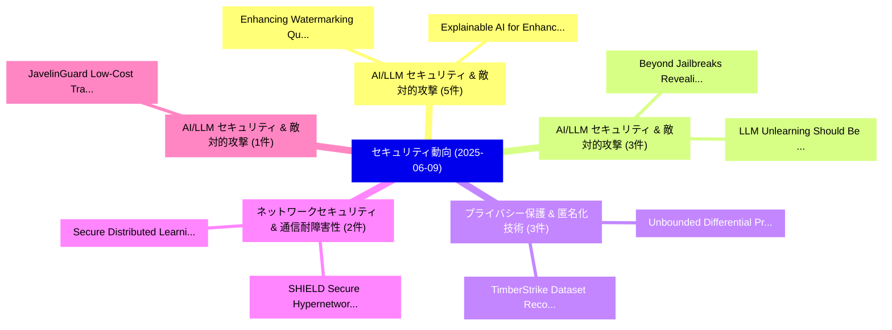

# 📅 02_daily: 日次エグゼクティブサマリー報告書 (2025-06-09)

**集計日時**: 2026-10-02 23:05:29 UTC  
**対象日付**: 2025-06-09  
**本日収集論文数**: 33 件  

---

## 💡 主要セキュリティ動向・脅威インサイト (Executive Insights)

本日の収集論文（計 33 件）において、以下の重点セキュリティ領域で活発な研究動向が確認されました：
- **AI/LLM セキュリティ & 敵対的攻撃** (5 件): 注目論文として 「Enhancing Watermarking Quality...」、「Explainable AI for Enhancing I...」 等が発表され、実務防御および攻撃検証の進展が見られます。
- **AI/LLM セキュリティ & 敵対的攻撃** (3 件): 注目論文として 「Beyond Jailbreaks: Revealing S...」、「LLM Unlearning Should Be Form-...」 等が発表され、実務防御および攻撃検証の進展が見られます。
- **プライバシー保護 & 匿名化技術** (3 件): 注目論文として 「TimberStrike: Dataset Reconstr...」、「Unbounded Differential Privacy...」 等が発表され、実務防御および攻撃検証の進展が見られます。
- **ネットワークセキュリティ & 通信耐障害性** (2 件): 注目論文として 「Secure Distributed Learning fo...」、「SHIELD: Secure Hypernetworks f...」 等が発表され、実務防御および攻撃検証の進展が見られます。
- **AI/LLM セキュリティ & 敵対的攻撃** (1 件): 注目論文として 「JavelinGuard: Low-Cost Transfo...」 等が発表され、実務防御および攻撃検証の進展が見られます。

### 🗺️ 技術・脅威トピックマインドマップ

---

## 📌 日次セキュリティ論文一覧 (日本語表形式)

| No | arXiv ID | 論文タイトル (日本語訳) | 重要キーワード | 構造化エグゼクティブ要約 (背景・提案・影響) | 脅威分類 | 詳細リンク |
|---|---|---|---|---|---|---|
| 1 | `2506.07330v1` | [JavelinGuard: Low-Cost Transformer Architectures for LLM Security（セキュリティ分析論文）](../../okf/papers/2025-06-09/2506.07330.md) | `Cost Transformer Architectures`, `Low-Cost Transformer`, `Yash Datta` | 【提案】概要 (Overview & Key Finding) 本論文「JavelinGuard: Low-Cost Transformer Architectures for LL...。実証評価により経営層・セキュリティ管理者向け推奨アクション (E... | `cs.CR` | [arXiv](https://arxiv.org/abs/2506.07330v1) &#124; [OKF](../../okf/papers/2025-06-09/2506.07330.md) |
| 2 | `2506.07372v2` | [Enhanced Consistency Bi-directional GAN (CBiGAN) for Malware Anomaly Detection（セキュリティ分析論文）](../../okf/papers/2025-06-09/2506.07372.md) | `Enhanced Consistency Bi`, `Malware Anomaly Detection`, `Bi-directional GAN` | 【提案】概要 (Overview & Key Finding) 本論文「Enhanced Consistency Bi-directional GAN (CBiGAN) for マル...。実証評価により経営層・セキュリティ管理者向け推奨アクション (E... | `cs.CR` | [arXiv](https://arxiv.org/abs/2506.07372v2) &#124; [OKF](../../okf/papers/2025-06-09/2506.07372.md) |
| 3 | `2506.07392v4` | [From Static to Adaptive Defense: Federated Multi-Agent Deep Reinforcement Learning-Driven Moving Target Defense Against DoS Attacks in UAV Swarm Networks（セキュリティ分析論文）](../../okf/papers/2025-06-09/2506.07392.md) | `Agent Deep Reinforcement Learning`, `Adaptive Defense`, `Federated Multi` | 【提案】概要 (Overview & Key Finding) 本論文「From Static to Adaptive Defense: Federated Multi-Agent ...。実証評価により経営層・セキュリティ管理者向け推奨アクション (E... | `cs.CR` | [arXiv](https://arxiv.org/abs/2506.07392v4) &#124; [OKF](../../okf/papers/2025-06-09/2506.07392.md) |
| 4 | `2506.07402v1` | [Beyond Jailbreaks: Revealing Stealthier and Broader LLM Security Risks Stemming from Alignment Failures（セキュリティ分析論文）](../../okf/papers/2025-06-09/2506.07402.md) | `Security Risks Stemming`, `Beyond Jailbreaks`, `Revealing Stealthier` | 【提案】概要 (Overview & Key Finding) 本論文「Beyond ジェイルブレイクs: Revealing Stealthier and Broader LLM ...。実証評価により経営層・セキュリティ管理者向け推奨アクション (E... | `cs.CR` | [arXiv](https://arxiv.org/abs/2506.07402v1) &#124; [OKF](../../okf/papers/2025-06-09/2506.07402.md) |
| 5 | `2506.07403v1` | [Enhancing Watermarking Quality for LLMs via Contextual Generation States Awareness（セキュリティ分析論文）](../../okf/papers/2025-06-09/2506.07403.md) | `Contextual Generation States Awareness`, `Enhancing Watermarking Quality`, `Peiru Yang` | 【提案】概要 (Overview & Key Finding) 本論文「Enhancing Watermarking Quality for LLMs via Contextual ...。実証評価により経営層・セキュリティ管理者向け推奨アクション (E... | `cs.CR` | [arXiv](https://arxiv.org/abs/2506.07403v1) &#124; [OKF](../../okf/papers/2025-06-09/2506.07403.md) |
| 6 | `2506.07404v1` | [Pixel-Sensitive and Robust Steganography Based on Polar Codes（セキュリティ分析論文）](../../okf/papers/2025-06-09/2506.07404.md) | `Robust Steganography Based`, `Polar Codes`, `Yujun Ji` | 【提案】概要 (Overview & Key Finding) 本論文「Pixel-Sensitive and Robust Steganography Based on Polar...。実証評価により経営層・セキュリティ管理者向け推奨アクション (E... | `cs.CR` | [arXiv](https://arxiv.org/abs/2506.07404v1) &#124; [OKF](../../okf/papers/2025-06-09/2506.07404.md) |
| 7 | `2506.07480v1` | [Explainable AI for Enhancing IDS Against Advanced Persistent Kill Chain（セキュリティ分析論文）](../../okf/papers/2025-06-09/2506.07480.md) | `Bassam Noori Shaker`, `Mohammed Falih Hassan`, `Bahaa Al` | 【提案】概要 (Overview & Key Finding) 本論文「Explainable AI for Enhancing IDS Against Advanced Persi...。実証評価により経営層・セキュリティ管理者向け推奨アクション (E... | `cs.CR` | [arXiv](https://arxiv.org/abs/2506.07480v1) &#124; [OKF](../../okf/papers/2025-06-09/2506.07480.md) |
| 8 | `2506.07586v2` | [MalGEN: A Testbed for Modeling and Evaluating Malware Behaviors（セキュリティ分析論文）](../../okf/papers/2025-06-09/2506.07586.md) | `Evaluating Malware Behaviors`, `Sandeep Kumar Shukla`, `Bikash Saha` | 【提案】概要 (Overview & Key Finding) 本論文「MalGEN: A Testbed for Modeling and Evaluating マルウェア Beh...。実証評価により経営層・セキュリティ管理者向け推奨アクション (E... | `cs.CR` | [arXiv](https://arxiv.org/abs/2506.07586v2) &#124; [OKF](../../okf/papers/2025-06-09/2506.07586.md) |
| 9 | `2506.07605v3` | [TimberStrike: Dataset Reconstruction Attack Revealing Privacy Leakage in Federated Tree-Based Systems（セキュリティ分析論文）](../../okf/papers/2025-06-09/2506.07605.md) | `Dataset Reconstruction Attack Revealing Privacy Leakage`, `Federated Tree`, `Based Systems` | 【提案】概要 (Overview & Key Finding) 本論文「TimberStrike: Dataset Reconstruction Attack Revealing P...。実証評価により経営層・セキュリティ管理者向け推奨アクション (E... | `cs.CR` | [arXiv](https://arxiv.org/abs/2506.07605v3) &#124; [OKF](../../okf/papers/2025-06-09/2506.07605.md) |
| 10 | `2506.07640v1` | [Stark-Coleman Invariants and Quantum Lower Bounds: An Integrated Framework for Real Quadratic Fields（セキュリティ分析論文）](../../okf/papers/2025-06-09/2506.07640.md) | `Quantum Lower Bounds`, `Real Quadratic Fields`, `Coleman Invariants` | 【提案】概要 (Overview & Key Finding) 本論文「Stark-Coleman Invariants and 量子 Lower Bounds: An Integr...。実証評価により経営層・セキュリティ管理者向け推奨アクション (E... | `cs.CR` | [arXiv](https://arxiv.org/abs/2506.07640v1) &#124; [OKF](../../okf/papers/2025-06-09/2506.07640.md) |
| 11 | `2506.07714v1` | [Profiling Electric Vehicles via Early Charging Voltage Patterns（セキュリティ分析論文）](../../okf/papers/2025-06-09/2506.07714.md) | `Early Charging Voltage Patterns`, `Profiling Electric Vehicles`, `Francesco Marchiori` | 【提案】概要 (Overview & Key Finding) 本論文「Profiling Electric Vehicles via Early Charging Voltage ...。実証評価により経営層・セキュリティ管理者向け推奨アクション (E... | `cs.CR` | [arXiv](https://arxiv.org/abs/2506.07714v1) &#124; [OKF](../../okf/papers/2025-06-09/2506.07714.md) |
| 12 | `2506.07728v1` | ["I wasn't sure if this is indeed a security risk": Data-driven Understanding of Security Issue Reporting in GitHub Repositories of Open Source npm Packages（セキュリティ分析論文）](../../okf/papers/2025-06-09/2506.07728.md) | `Security Issue Reporting`, `Open Source`, `Data-driven Understanding` | 【提案】概要 (Overview & Key Finding) 本論文「"I wasn't sure if this is indeed a security risk": Data...。実証評価により経営層・セキュリティ管理者向け推奨アクション (E... | `cs.CR` | [arXiv](https://arxiv.org/abs/2506.07728v1) &#124; [OKF](../../okf/papers/2025-06-09/2506.07728.md) |
| 13 | `2506.07795v1` | [LLM Unlearning Should Be Form-Independent（セキュリティ分析論文）](../../okf/papers/2025-06-09/2506.07795.md) | `Xiaotian Ye`, `Mengqi Zhang`, `Shu Wu` | 【提案】概要 (Overview & Key Finding) 本論文「LLM Unlearning Should Be Form-Independent（セキュリティ分析論文）」（...。実証評価により経営層・セキュリティ管理者向け推奨アクション (E... | `cs.CR` | [arXiv](https://arxiv.org/abs/2506.07795v1) &#124; [OKF](../../okf/papers/2025-06-09/2506.07795.md) |
| 14 | `2506.07827v1` | [User-space library rootkits revisited: Are user-space detection mechanisms futile?（セキュリティ分析論文）](../../okf/papers/2025-06-09/2506.07827.md) | `User-space library`, `user-space detection`, `Enrique Soriano` | 【提案】### (日本語題名: User-space library rootkits revisited: Are user-space detection mechanisms ...。実証評価により経営層・セキュリティ管理者向け推奨アクション (E... | `cs.CR` | [arXiv](https://arxiv.org/abs/2506.07827v1) &#124; [OKF](../../okf/papers/2025-06-09/2506.07827.md) |
| 15 | `2506.07836v1` | [Are Trees Really Green? A Detection Approach of IoT Malware Attacks（セキュリティ分析論文）](../../okf/papers/2025-06-09/2506.07836.md) | `Malware Attacks`, `Silvia Lucia Sanna`, `Diego Soi` | 【提案】A Detection Approach of IoT マルウェア Attacks ### (日本語題名: Are Trees Really Green?。実証評価により経営層・セキュリティ管理者向け推奨アクション (Executive Reco... | `cs.CR` | [arXiv](https://arxiv.org/abs/2506.07836v1) &#124; [OKF](../../okf/papers/2025-06-09/2506.07836.md) |
| 16 | `2506.07868v1` | [Unbounded Differential Privacy Against Timing Attacksのセキュリティ強化](../../okf/papers/2025-06-09/2506.07868.md) | `Zachary Ratliff`, `Salil Vadhan`, `Raw Meta` | 【提案】概要 (Overview & Key Finding) 本論文「Unbounded 差分プライバシー Against Timing Attacksのセキュリティ強化」（原題:...。実証評価により経営層・セキュリティ管理者向け推奨アクション (E... | `cs.CR` | [arXiv](https://arxiv.org/abs/2506.07868v1) &#124; [OKF](../../okf/papers/2025-06-09/2506.07868.md) |
| 17 | `2506.07882v1` | [Evaluating explainable AI for deep learning-based network intrusion detection system alert classification（セキュリティ分析論文）](../../okf/papers/2025-06-09/2506.07882.md) | `learning-based network`, `Rajesh Kalakoti`, `Risto Vaarandi` | 【提案】概要 (Overview & Key Finding) 本論文「Evaluating explainable AI for deep learning-based netwo...。実証評価により経営層・セキュリティ管理者向け推奨アクション (E... | `cs.CR` | [arXiv](https://arxiv.org/abs/2506.07882v1) &#124; [OKF](../../okf/papers/2025-06-09/2506.07882.md) |
| 18 | `2506.07888v1` | [SoK: Data Reconstruction Attacks Against Machine Learning Models: Definition, Metrics, and Benchmark（セキュリティ分析論文）](../../okf/papers/2025-06-09/2506.07888.md) | `Rui Wen`, `Yiyong Liu`, `Michael Backes` | 【提案】概要 (Overview & Key Finding) 本論文「SoK: Data Reconstruction Attacks Against Machine Learni...。実証評価により経営層・セキュリティ管理者向け推奨アクション (E... | `cs.CR` | [arXiv](https://arxiv.org/abs/2506.07888v1) &#124; [OKF](../../okf/papers/2025-06-09/2506.07888.md) |
| 19 | `2506.07894v1` | [Secure Distributed Learning for CAVs: Defending Against Gradient Leakage with Leveled Homomorphic Encryption（セキュリティ分析論文）](../../okf/papers/2025-06-09/2506.07894.md) | `Secure Distributed Learning`, `Leveled Homomorphic Encryption`, `Muhammad Ali Najjar` | 【提案】概要 (Overview & Key Finding) 本論文「Secure Distributed Learning for CAVs: Defending Against...。実証評価により経営層・セキュリティ管理者向け推奨アクション (E... | `cs.CR` | [arXiv](https://arxiv.org/abs/2506.07894v1) &#124; [OKF](../../okf/papers/2025-06-09/2506.07894.md) |
| 20 | `2506.07948v1` | [TokenBreak: Bypassing Text Classification Models Through Token Manipulation（セキュリティ分析論文）](../../okf/papers/2025-06-09/2506.07948.md) | `Kasimir Schulz`, `Kenneth Yeung`, `Kieran Evans` | 【提案】概要 (Overview & Key Finding) 本論文「TokenBreak: Bypassing Text Classification Models Throug...。実証評価により経営層・セキュリティ管理者向け推奨アクション (E... | `cs.CR` | [arXiv](https://arxiv.org/abs/2506.07948v1) &#124; [OKF](../../okf/papers/2025-06-09/2506.07948.md) |
| 21 | `2506.07957v1` | [Understanding the Error Sensitivity of Privacy-Aware Computing（セキュリティ分析論文）](../../okf/papers/2025-06-09/2506.07957.md) | `Error Sensitivity`, `Aware Computing`, `Privacy-Aware Computing` | 【提案】概要 (Overview & Key Finding) 本論文「Understanding the Error Sensitivity of Privacy-Aware Co...。実証評価により経営層・セキュリティ管理者向け推奨アクション (E... | `cs.CR` | [arXiv](https://arxiv.org/abs/2506.07957v1) &#124; [OKF](../../okf/papers/2025-06-09/2506.07957.md) |
| 22 | `2506.07974v1` | [Exposing Hidden Backdoors in NFT Smart Contracts: A Static Security Rug Pull Patternsの分析](../../okf/papers/2025-06-09/2506.07974.md) | `Exposing Hidden Backdoors`, `Smart Contracts`, `Static Security Rug Pull` | 【提案】概要 (Overview & Key Finding) 本論文「Exposing Hidden Backdoors in NFT スマートコントラクトs: A Static ...。実証評価により経営層・セキュリティ管理者向け推奨アクション (E... | `cs.CR` | [arXiv](https://arxiv.org/abs/2506.07974v1) &#124; [OKF](../../okf/papers/2025-06-09/2506.07974.md) |
| 23 | `2506.07988v1` | [Unraveling Ethereum's Mempool: The Impact of Fee Fairness, Transaction Prioritization, and Consensus Efficiency（セキュリティ分析論文）](../../okf/papers/2025-06-09/2506.07988.md) | `Unraveling Ethereum`, `Fee Fairness`, `Transaction Prioritization` | 【提案】概要 (Overview & Key Finding) 本論文「Unraveling Ethereum's Mempool: The Impact of Fee Fairne...。実証評価により経営層・セキュリティ管理者向け推奨アクション (E... | `cs.CR` | [arXiv](https://arxiv.org/abs/2506.07988v1) &#124; [OKF](../../okf/papers/2025-06-09/2506.07988.md) |
| 24 | `2506.08055v1` | [A Systematic Literature Review on Continuous Integration and Deployment (CI/CD) for Secure Cloud Computing（セキュリティ分析論文）](../../okf/papers/2025-06-09/2506.08055.md) | `Systematic Literature Review`, `Secure Cloud Computing`, `Continuous Integration` | 【提案】概要 (Overview & Key Finding) 本論文「A Systematic Literature Review on Continuous Integratio...。実証評価により経営層・セキュリティ管理者向け推奨アクション (E... | `cs.CR` | [arXiv](https://arxiv.org/abs/2506.08055v1) &#124; [OKF](../../okf/papers/2025-06-09/2506.08055.md) |
| 25 | `2506.08188v2` | [GradEscape: A Gradient-Based Evader Against AI-Generated Text Detectors（セキュリティ分析論文）](../../okf/papers/2025-06-09/2506.08188.md) | `Generated Text Detectors`, `Gradient-Based Evader`, `AI-Generated Text` | 【提案】概要 (Overview & Key Finding) 本論文「GradEscape: A Gradient-Based Evader Against AI-Generate...。実証評価により経営層・セキュリティ管理者向け推奨アクション (E... | `cs.CR` | [arXiv](https://arxiv.org/abs/2506.08188v2) &#124; [OKF](../../okf/papers/2025-06-09/2506.08188.md) |
| 26 | `2506.08192v1` | [Interpreting Agent Behaviors in Reinforcement-Learning-Based Cyber-Battle Simulation Platforms（セキュリティ分析論文）](../../okf/papers/2025-06-09/2506.08192.md) | `Interpreting Agent Behaviors`, `Battle Simulation Platforms`, `Based Cyber` | 【提案】概要 (Overview & Key Finding) 本論文「Interpreting Agent Behaviors in Reinforcement-Learning-...。実証評価により経営層・セキュリティ管理者向け推奨アクション (E... | `cs.CR` | [arXiv](https://arxiv.org/abs/2506.08192v1) &#124; [OKF](../../okf/papers/2025-06-09/2506.08192.md) |
| 27 | `2506.08201v1` | [Correlated Noise Mechanisms for Differentially Private Learning（セキュリティ分析論文）](../../okf/papers/2025-06-09/2506.08201.md) | `Correlated Noise Mechanisms`, `Differentially Private Learning`, `Differentially Private Learni` | 【提案】概要 (Overview & Key Finding) 本論文「Correlated Noise Mechanisms for Differentially Private ...。実証評価によりChoquette-Choo, Krishnamu... | `cs.CR` | [arXiv](https://arxiv.org/abs/2506.08201v1) &#124; [OKF](../../okf/papers/2025-06-09/2506.08201.md) |
| 28 | `2506.08218v2` | [gh0stEdit: Exploiting Layer-Based Access Vulnerability Within Docker Container Images（セキュリティ分析論文）](../../okf/papers/2025-06-09/2506.08218.md) | `Based Access Vulnerability Within Docker Container Images`, `Exploiting Layer`, `Layer-Based Access` | 【提案】概要 (Overview & Key Finding) 本論文「gh0stEdit: Exploiting Layer-Based Access 脆弱性 Within Doc...。実証評価により経営層・セキュリティ管理者向け推奨アクション (E... | `cs.CR` | [arXiv](https://arxiv.org/abs/2506.08218v2) &#124; [OKF](../../okf/papers/2025-06-09/2506.08218.md) |
| 29 | `2506.08252v1` | [PoSyn: Secure Power Side-Channel Aware Synthesis（セキュリティ分析論文）](../../okf/papers/2025-06-09/2506.08252.md) | `Secure Power Side`, `Channel Aware Synthesis`, `Side-Channel Aware` | 【提案】概要 (Overview & Key Finding) 本論文「PoSyn: Secure Power サイドチャネル攻撃 Aware Synthesis（セキュリティ分析論...。実証評価によりMiftah, Hyunmin Kim, Debj... | `cs.CR` | [arXiv](https://arxiv.org/abs/2506.08252v1) &#124; [OKF](../../okf/papers/2025-06-09/2506.08252.md) |
| 30 | `2506.08255v4` | [SHIELD: Secure Hypernetworks for Incremental Expansion Learning Defense（セキュリティ分析論文）](../../okf/papers/2025-06-09/2506.08255.md) | `Incremental Expansion Learning Defense`, `Secure Hypernetworks`, `Patryk Krukowski` | 【提案】概要 (Overview & Key Finding) 本論文「SHIELD: Secure Hypernetworks for Incremental Expansion ...。実証評価により経営層・セキュリティ管理者向け推奨アクション (E... | `cs.CR` | [arXiv](https://arxiv.org/abs/2506.08255v4) &#124; [OKF](../../okf/papers/2025-06-09/2506.08255.md) |
| 31 | `2506.10022v1` | [LLMs Caught in the Crossfire: Malware Requests and Jailbreak Challenges（セキュリティ分析論文）](../../okf/papers/2025-06-09/2506.10022.md) | `Malware Requests`, `Jailbreak Challenges`, `Haoyang Li` | 【提案】概要 (Overview & Key Finding) 本論文「LLMs Caught in the Crossfire: マルウェア Requests and ジェイルブレ...。実証評価により経営層・セキュリティ管理者向け推奨アクション (E... | `cs.CR` | [arXiv](https://arxiv.org/abs/2506.10022v1) &#124; [OKF](../../okf/papers/2025-06-09/2506.10022.md) |
| 32 | `2506.10024v1` | [Private Memorization Editing: Turning Memorization into a Defense to Strengthen Data Privacy in 大規模言語モデル](../../okf/papers/2025-06-09/2506.10024.md) | `Private Memorization Editing`, `Strengthen Data Privacy`, `Turning Memorization` | 【提案】概要 (Overview & Key Finding) 本論文「Private Memorization Editing: Turning Memorization into...。実証評価により経営層・セキュリティ管理者向け推奨アクション (E... | `cs.CR` | [arXiv](https://arxiv.org/abs/2506.10024v1) &#124; [OKF](../../okf/papers/2025-06-09/2506.10024.md) |
| 33 | `2506.10025v1` | [Mind the Gap: Revealing Security Barriers through Situational Awareness of Small and Medium Business Key Decision-Makers（セキュリティ分析論文）](../../okf/papers/2025-06-09/2506.10025.md) | `Medium Business Key Decision`, `Revealing Security Barriers`, `Situational Awareness` | 【提案】概要 (Overview & Key Finding) 本論文「Mind the Gap: Revealing Security Barriers through Situa...。実証評価により経営層・セキュリティ管理者向け推奨アクション (E... | `cs.CR` | [arXiv](https://arxiv.org/abs/2506.10025v1) &#124; [OKF](../../okf/papers/2025-06-09/2506.10025.md) |

