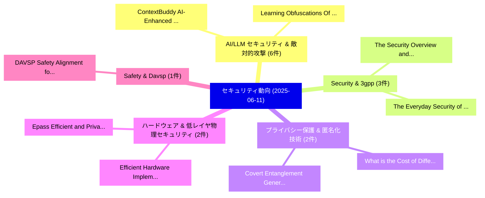

# 📅 02_daily: 日次エグゼクティブサマリー報告書 (2025-06-11)

**集計日時**: 2026-10-02 23:05:29 UTC  
**対象日付**: 2025-06-11  
**本日収集論文数**: 36 件  

---

## 💡 主要セキュリティ動向・脅威インサイト (Executive Insights)

本日の収集論文（計 36 件）において、以下の重点セキュリティ領域で活発な研究動向が確認されました：
- **AI/LLM セキュリティ & 敵対的攻撃** (6 件): 注目論文として 「ContextBuddy: AI-Enhanced Cont...」、「Learning Obfuscations Of LLM E...」 等が発表され、実務防御および攻撃検証の進展が見られます。
- **Security & 3gpp** (3 件): 注目論文として 「The Security Overview and 3GPP...」、「The Everyday Security of Livin...」 等が発表され、実務防御および攻撃検証の進展が見られます。
- **プライバシー保護 & 匿名化技術** (2 件): 注目論文として 「What is the Cost of Differenti...」、「Covert Entanglement Generation...」 等が発表され、実務防御および攻撃検証の進展が見られます。
- **ハードウェア & 低レイヤ物理セキュリティ** (2 件): 注目論文として 「Epass: Efficient and Privacy-P...」、「Efficient Hardware Implementat...」 等が発表され、実務防御および攻撃検証の進展が見られます。
- **Safety & Davsp** (1 件): 注目論文として 「DAVSP: Safety Alignment for La...」 等が発表され、実務防御および攻撃検証の進展が見られます。

### 🗺️ 技術・脅威トピックマインドマップ

---

## 📌 日次セキュリティ論文一覧 (日本語表形式)

| No | arXiv ID | 論文タイトル (日本語訳) | 重要キーワード | 構造化エグゼクティブ要約 (背景・提案・影響) | 脅威分類 | 詳細リンク |
|---|---|---|---|---|---|---|
| 1 | `2506.09312v1` | [What is the Cost of Differential Privacy for Deep Learning-Based Trajectory Generation?（セキュリティ分析論文）](../../okf/papers/2025-06-11/2506.09312.md) | `Based Trajectory Generation`, `Differential Privacy`, `Deep Learning` | 【提案】### (日本語題名: What is the Cost of 差分プライバシー for Deep Learning-Based Trajectory Generation?...。実証評価により経営層・セキュリティ管理者向け推奨アクション (E... | `cs.CR` | [arXiv](https://arxiv.org/abs/2506.09312v1) &#124; [OKF](../../okf/papers/2025-06-11/2506.09312.md) |
| 2 | `2506.09353v3` | [DAVSP: Safety Alignment for Large Vision-Language Models via Deep Aligned Visual Safety Prompt（セキュリティ分析論文）](../../okf/papers/2025-06-11/2506.09353.md) | `Deep Aligned Visual Safety Prompt`, `Safety Alignment`, `Large Vision` | 【提案】概要 (Overview & Key Finding) 本論文「DAVSP: Safety Alignment for Large Vision-Language Model...。実証評価により経営層・セキュリティ管理者向け推奨アクション (E... | `cs.CR` | [arXiv](https://arxiv.org/abs/2506.09353v3) &#124; [OKF](../../okf/papers/2025-06-11/2506.09353.md) |
| 3 | `2506.09363v1` | [SAGE: Exploring the Boundaries of Unsafe Concept Domain with Semantic-Augment Erasing（セキュリティ分析論文）](../../okf/papers/2025-06-11/2506.09363.md) | `Unsafe Concept Domain`, `Augment Erasing`, `Semantic-Augment Erasing` | 【提案】概要 (Overview & Key Finding) 本論文「SAGE: Exploring the Boundaries of Unsafe Concept Domain...。実証評価により経営層・セキュリティ管理者向け推奨アクション (E... | `cs.CR` | [arXiv](https://arxiv.org/abs/2506.09363v1) &#124; [OKF](../../okf/papers/2025-06-11/2506.09363.md) |
| 4 | `2506.09365v1` | [ContextBuddy: AI-Enhanced Contextual Insights for Security Alert Investigation (Applied to Intrusion Detection)（セキュリティ分析論文）](../../okf/papers/2025-06-11/2506.09365.md) | `Enhanced Contextual Insights`, `Security Alert Investigation`, `AI-Enhanced Contextual` | 【提案】概要 (Overview & Key Finding) 本論文「ContextBuddy: AI-Enhanced Contextual Insights for Secur...。実証評価により経営層・セキュリティ管理者向け推奨アクション (E... | `cs.CR` | [arXiv](https://arxiv.org/abs/2506.09365v1) &#124; [OKF](../../okf/papers/2025-06-11/2506.09365.md) |
| 5 | `2506.09387v1` | [Epass: Efficient and Privacy-Preserving Asynchronous Payment on Blockchain（セキュリティ分析論文）](../../okf/papers/2025-06-11/2506.09387.md) | `Preserving Asynchronous Payment`, `Privacy-Preserving Asynchronous`, `Weijie Wang` | 【提案】概要 (Overview & Key Finding) 本論文「Epass: Efficient and Privacy-Preserving Asynchronous Pa...。実証評価により経営層・セキュリティ管理者向け推奨アクション (E... | `cs.CR` | [arXiv](https://arxiv.org/abs/2506.09387v1) &#124; [OKF](../../okf/papers/2025-06-11/2506.09387.md) |
| 6 | `2506.09418v1` | [Open RAN: A Survey of Cryptographic Challenges and Emerging Solutions for 5Gのセキュリティ強化](../../okf/papers/2025-06-11/2506.09418.md) | `Cryptographic Challenges`, `Emerging Solutions`, `Securing Open` | 【提案】概要 (Overview & Key Finding) 本論文「Open RAN: A Survey of Cryptographic Challenges and Emer...。実証評価により経営層・セキュリティ管理者向け推奨アクション (E... | `cs.CR` | [arXiv](https://arxiv.org/abs/2506.09418v1) &#124; [OKF](../../okf/papers/2025-06-11/2506.09418.md) |
| 7 | `2506.09443v3` | [LLMs Cannot Reliably Judge (Yet?): A Comprehensive Assessment on the Robustness of LLM-as-a-Judge（セキュリティ分析論文）](../../okf/papers/2025-06-11/2506.09443.md) | `Comprehensive Assessment`, `Songze Li`, `Chuokun Xu` | 【提案】背景とセキュリティ上の課題 (Background & Problem) 本研究はサイバー脅威環境におけるセキュリティ構造・脆弱性の検証を目的としています。(主要検出項目: ...。実証評価により経営層・セキュリティ管理者向け推奨アクション (E... | `cs.CR` | [arXiv](https://arxiv.org/abs/2506.09443v3) &#124; [OKF](../../okf/papers/2025-06-11/2506.09443.md) |
| 8 | `2506.09452v1` | [Learning Obfuscations Of LLM Embedding Sequences: Stained Glass Transform（セキュリティ分析論文）](../../okf/papers/2025-06-11/2506.09452.md) | `Stained Glass Transform`, `Embedding Sequences`, `Jay Roberts` | 【提案】概要 (Overview & Key Finding) 本論文「Learning Obfuscations Of LLM Embedding Sequences: Stain...。実証評価により経営層・セキュリティ管理者向け推奨アクション (E... | `cs.CR` | [arXiv](https://arxiv.org/abs/2506.09452v1) &#124; [OKF](../../okf/papers/2025-06-11/2506.09452.md) |
| 9 | `2506.09464v3` | [Efficient Hardware Implementation of Modular Multiplier over GF (2m) on FPGA（セキュリティ分析論文）](../../okf/papers/2025-06-11/2506.09464.md) | `Efficient Hardware Implementation`, `Modular Multiplier`, `Ruby Kumari` | 【提案】概要 (Overview & Key Finding) 本論文「Efficient Hardware Implementation of Modular Multiplier...。実証評価により経営層・セキュリティ管理者向け推奨アクション (E... | `cs.CR` | [arXiv](https://arxiv.org/abs/2506.09464v3) &#124; [OKF](../../okf/papers/2025-06-11/2506.09464.md) |
| 10 | `2506.09474v3` | [Covert Entanglement Generation over Bosonic Channels（セキュリティ分析論文）](../../okf/papers/2025-06-11/2506.09474.md) | `Covert Entanglement Generation`, `Bosonic Channels`, `Ohad Kimelfeld` | 【提案】概要 (Overview & Key Finding) 本論文「Covert Entanglement Generation over Bosonic Channels（セキ...。実証評価によりEyre, Filip Rozpędek, Uzi... | `cs.CR` | [arXiv](https://arxiv.org/abs/2506.09474v3) &#124; [OKF](../../okf/papers/2025-06-11/2506.09474.md) |
| 11 | `2506.09502v2` | [The Security Overview and 3GPP 5G MAC CEの分析](../../okf/papers/2025-06-11/2506.09502.md) | `Jin Cao`, `Yuanyuan Yang`, `Ruhui Ma` | 【提案】概要 (Overview & Key Finding) 本論文「The Security Overview and 3GPP 5G MAC CEの分析」（原題: The Se...。実証評価により経営層・セキュリティ管理者向け推奨アクション (E... | `cs.CR` | [arXiv](https://arxiv.org/abs/2506.09502v2) &#124; [OKF](../../okf/papers/2025-06-11/2506.09502.md) |
| 12 | `2506.09525v1` | [Beyond Personalization: Federated Recommendation with Calibration via Low-rank Decomposition（セキュリティ分析論文）](../../okf/papers/2025-06-11/2506.09525.md) | `Beyond Personalization`, `Federated Recommendation`, `Low-rank Decomposition` | 【提案】概要 (Overview & Key Finding) 本論文「Beyond Personalization: Federated Recommendation with C...。実証評価により経営層・セキュリティ管理者向け推奨アクション (E... | `cs.CR` | [arXiv](https://arxiv.org/abs/2506.09525v1) &#124; [OKF](../../okf/papers/2025-06-11/2506.09525.md) |
| 13 | `2506.09559v1` | [Identity and Access Management for the Computing Continuum（セキュリティ分析論文）](../../okf/papers/2025-06-11/2506.09559.md) | `Access Management`, `Computing Continuum`, `Chalima Dimitra Nassar Kyriakidou` | 【提案】概要 (Overview & Key Finding) 本論文「Identity and Access Management for the Computing Contin...。実証評価によりSiris, Niko。 | `cs.CR` | [arXiv](https://arxiv.org/abs/2506.09559v1) &#124; [OKF](../../okf/papers/2025-06-11/2506.09559.md) |
| 14 | `2506.09562v3` | [TooBadRL: Trigger Optimization to Boost Effectiveness of Backdoor Attacks on Deep Reinforcement Learning（セキュリティ分析論文）](../../okf/papers/2025-06-11/2506.09562.md) | `Deep Reinforcement Learning`, `Trigger Optimization`, `Boost Effectiveness` | 【提案】概要 (Overview & Key Finding) 本論文「TooBadRL: Trigger Optimization to Boost Effectiveness o...。実証評価により経営層・セキュリティ管理者向け推奨アクション (E... | `cs.CR` | [arXiv](https://arxiv.org/abs/2506.09562v3) &#124; [OKF](../../okf/papers/2025-06-11/2506.09562.md) |
| 15 | `2506.09569v1` | [The Rabin cryptosystem over number fields（セキュリティ分析論文）](../../okf/papers/2025-06-11/2506.09569.md) | `Alessandro Cobbe`, `Andreas Nickel`, `Akay Schuster` | 【提案】概要 (Overview & Key Finding) 本論文「The Rabin cryptosystem over number fields（セキュリティ分析論文）」（...。実証評価により経営層・セキュリティ管理者向け推奨アクション (E... | `cs.CR` | [arXiv](https://arxiv.org/abs/2506.09569v1) &#124; [OKF](../../okf/papers/2025-06-11/2506.09569.md) |
| 16 | `2506.09580v1` | [The Everyday Security of Living with Conflict（セキュリティ分析論文）](../../okf/papers/2025-06-11/2506.09580.md) | `Rikke Bjerg Jensen`, `Reem Talhouk`, `Raw Meta` | 【提案】概要 (Overview & Key Finding) 本論文「The Everyday Security of Living with Conflict（セキュリティ分析論...。実証評価により経営層・セキュリティ管理者向け推奨アクション (E... | `cs.CR` | [arXiv](https://arxiv.org/abs/2506.09580v1) &#124; [OKF](../../okf/papers/2025-06-11/2506.09580.md) |
| 17 | `2506.09600v3` | [Effective Red-Teaming of Policy-Adherent Agents（セキュリティ分析論文）](../../okf/papers/2025-06-11/2506.09600.md) | `Effective Red`, `Adherent Agents`, `Policy-Adherent Agents` | 【提案】概要 (Overview & Key Finding) 本論文「Effective Red-Teaming of Policy-Adherent Agents（セキュリティ分...。実証評価により経営層・セキュリティ管理者向け推奨アクション (E... | `cs.CR` | [arXiv](https://arxiv.org/abs/2506.09600v3) &#124; [OKF](../../okf/papers/2025-06-11/2506.09600.md) |
| 18 | `2506.09662v1` | [Empirical Quantification of Spurious Correlations in マルウェア検出](../../okf/papers/2025-06-11/2506.09662.md) | `Empirical Quantification`, `Spurious Correlations`, `Malware Detection` | 【提案】概要 (Overview & Key Finding) 本論文「Empirical Quantification of Spurious Correlations in マル...。実証評価により経営層・セキュリティ管理者向け推奨アクション (E... | `cs.CR` | [arXiv](https://arxiv.org/abs/2506.09662v1) &#124; [OKF](../../okf/papers/2025-06-11/2506.09662.md) |
| 19 | `2506.09689v1` | [BF-Max: an Efficient Bit Flipping Decoder with Predictable Decoding Failure Rate（セキュリティ分析論文）](../../okf/papers/2025-06-11/2506.09689.md) | `Efficient Bit Flipping Decoder`, `Predictable Decoding Failure Rate`, `Alessio Baldelli` | 【提案】概要 (Overview & Key Finding) 本論文「BF-Max: an Efficient Bit Flipping Decoder with Predicta...。実証評価により経営層・セキュリティ管理者向け推奨アクション (E... | `cs.CR` | [arXiv](https://arxiv.org/abs/2506.09689v1) &#124; [OKF](../../okf/papers/2025-06-11/2506.09689.md) |
| 20 | `2506.09702v2` | [Mapping NVD Records to Their Vulnerability-fixing Commits: How Hard is It?（セキュリティ分析論文）](../../okf/papers/2025-06-11/2506.09702.md) | `Vulnerability-fixing Commits`, `Huu Hung Nguyen`, `Duc Manh Tran` | 【提案】### (日本語題名: Mapping NVD Records to Their 脆弱性-fixing Commits: How Hard is It?（セキュリティ分析論文...。実証評価により経営層・セキュリティ管理者向け推奨アクション (E... | `cs.CR` | [arXiv](https://arxiv.org/abs/2506.09702v2) &#124; [OKF](../../okf/papers/2025-06-11/2506.09702.md) |
| 21 | `2506.09719v2` | [On the Virtues of Information Security in the UK Climate Movement（セキュリティ分析論文）](../../okf/papers/2025-06-11/2506.09719.md) | `Information Security`, `Climate Movement`, `Rikke Bjerg Jensen` | 【提案】概要 (Overview & Key Finding) 本論文「On the Virtues of Information Security in the UK Climat...。実証評価によりAlbrecht - **公開日時**: `2025-。 | `cs.CR` | [arXiv](https://arxiv.org/abs/2506.09719v2) &#124; [OKF](../../okf/papers/2025-06-11/2506.09719.md) |
| 22 | `2506.09803v2` | [Devil's Hand: Data Poisoning Attacks to Locally Private Graph Learning Protocols（セキュリティ分析論文）](../../okf/papers/2025-06-11/2506.09803.md) | `Locally Private Graph Learning Protocols`, `Data Poisoning Attacks`, `Locally Private Graph Learning` | 【提案】概要 (Overview & Key Finding) 本論文「Devil's Hand: Data Poisoning Attacks to Locally Private...。実証評価により経営層・セキュリティ管理者向け推奨アクション (E... | `cs.CR` | [arXiv](https://arxiv.org/abs/2506.09803v2) &#124; [OKF](../../okf/papers/2025-06-11/2506.09803.md) |
| 23 | `2506.09807v1` | [Physical Layer-Based Device Fingerprinting for Wireless Security: From Theory to Practice（セキュリティ分析論文）](../../okf/papers/2025-06-11/2506.09807.md) | `Based Device Fingerprinting`, `Physical Layer`, `Wireless Security` | 【提案】概要 (Overview & Key Finding) 本論文「Physical Layer-Based Device Fingerprinting for Wireless...。実証評価により経営層・セキュリティ管理者向け推奨アクション (E... | `cs.CR` | [arXiv](https://arxiv.org/abs/2506.09807v1) &#124; [OKF](../../okf/papers/2025-06-11/2506.09807.md) |
| 24 | `2506.09825v1` | [On the Impossibility of a Perfect Hypervisor（セキュリティ分析論文）](../../okf/papers/2025-06-11/2506.09825.md) | `Perfect Hypervisor`, `Mordechai Guri`, `Raw Meta` | 【提案】概要 (Overview & Key Finding) 本論文「On the Impossibility of a Perfect Hypervisor（セキュリティ分析論文...。実証評価により経営層・セキュリティ管理者向け推奨アクション (E... | `cs.CR` | [arXiv](https://arxiv.org/abs/2506.09825v1) &#124; [OKF](../../okf/papers/2025-06-11/2506.09825.md) |
| 25 | `2506.09950v4` | [Oracle-Based Multistep Strategy for Solving Polynomial Systems Over Finite Fields and Algebraic Cryptthe Aradi Cipherの分析](../../okf/papers/2025-06-11/2506.09950.md) | `Based Multistep Strategy`, `Oracle-Based Multistep`, `Algebraic Cryptthe Aradi` | 【提案】概要 (Overview & Key Finding) 本論文「Oracle-Based Multistep Strategy for Solving Polynomial ...。実証評価により経営層・セキュリティ管理者向け推奨アクション (E... | `cs.CR` | [arXiv](https://arxiv.org/abs/2506.09950v4) &#124; [OKF](../../okf/papers/2025-06-11/2506.09950.md) |
| 26 | `2506.09956v1` | [LLMail-Inject: A Dataset from a Realistic Adaptive Prompt Injection Challenge（セキュリティ分析論文）](../../okf/papers/2025-06-11/2506.09956.md) | `Realistic Adaptive Prompt Injection Challenge`, `Tran Huu Bach`, `Sahar Abdelnabi` | 【提案】概要 (Overview & Key Finding) 本論文「LLMail-Inject: A Dataset from a Realistic Adaptive プロンプ...。実証評価により経営層・セキュリティ管理者向け推奨アクション (E... | `cs.CR` | [arXiv](https://arxiv.org/abs/2506.09956v1) &#124; [OKF](../../okf/papers/2025-06-11/2506.09956.md) |
| 27 | `2506.10042v1` | [Multiverse Privacy Theory for Contextual Risks in Complex User-AI Interactions（セキュリティ分析論文）](../../okf/papers/2025-06-11/2506.10042.md) | `Multiverse Privacy Theory`, `Contextual Risks`, `Complex User` | 【提案】概要 (Overview & Key Finding) 本論文「Multiverse Privacy Theory for Contextual Risks in Compl...。実証評価により経営層・セキュリティ管理者向け推奨アクション (E... | `cs.CR` | [arXiv](https://arxiv.org/abs/2506.10042v1) &#124; [OKF](../../okf/papers/2025-06-11/2506.10042.md) |
| 28 | `2506.10047v1` | [GenBreak: Red Teaming Text-to-Image Generators Using 大規模言語モデル](../../okf/papers/2025-06-11/2506.10047.md) | `Red Teaming Text`, `Image Generators Using Large Language Models`, `Image Generators Using` | 【提案】概要 (Overview & Key Finding) 本論文「GenBreak: Red Teaming Text-to-Image Generators Using 大規...。実証評価により経営層・セキュリティ管理者向け推奨アクション (E... | `cs.CR` | [arXiv](https://arxiv.org/abs/2506.10047v1) &#124; [OKF](../../okf/papers/2025-06-11/2506.10047.md) |
| 29 | `2506.10104v1` | [Expert-in-the-Loop Systems with Cross-Domain and In-Domain Few-Shot Learning for Software 脆弱性検出](../../okf/papers/2025-06-11/2506.10104.md) | `Loop Systems`, `the-Loop Systems`, `Shot Learning` | 【提案】概要 (Overview & Key Finding) 本論文「Expert-in-the-Loop Systems with Cross-Domain and In-Dom...。実証評価により経営層・セキュリティ管理者向け推奨アクション (E... | `cs.CR` | [arXiv](https://arxiv.org/abs/2506.10104v1) &#124; [OKF](../../okf/papers/2025-06-11/2506.10104.md) |
| 30 | `2506.10125v3` | [D-LiFT: Improving LLM-based Decompiler Backend via Code Quality-driven Fine-tuning（セキュリティ分析論文）](../../okf/papers/2025-06-11/2506.10125.md) | `LLM-based Decompiler`, `Decompiler Backend`, `Code Quality` | 【提案】概要 (Overview & Key Finding) 本論文「D-LiFT: Improving LLM-based Decompiler Backend via Code...。実証評価により経営層・セキュリティ管理者向け推奨アクション (E... | `cs.CR` | [arXiv](https://arxiv.org/abs/2506.10125v3) &#124; [OKF](../../okf/papers/2025-06-11/2506.10125.md) |
| 31 | `2506.10147v1` | [Unconditionally Secure Wireless-Wired Ground-Satellite-Ground Communication Networks Utilizing Classical and Quantum Noise（セキュリティ分析論文）](../../okf/papers/2025-06-11/2506.10147.md) | `Ground Communication Networks Utilizing Classical`, `Unconditionally Secure Wireless`, `Wired Ground` | 【提案】概要 (Overview & Key Finding) 本論文「Unconditionally Secure Wireless-Wired Ground-Satellite-...。実証評価により経営層・セキュリティ管理者向け推奨アクション (E... | `cs.CR` | [arXiv](https://arxiv.org/abs/2506.10147v1) &#124; [OKF](../../okf/papers/2025-06-11/2506.10147.md) |
| 32 | `2506.10171v3` | [Beyond Jailbreaking: Auditing Contextual Privacy in LLMエージェント](../../okf/papers/2025-06-11/2506.10171.md) | `Auditing Contextual Privacy`, `Beyond Jailbreaking`, `Saswat Das` | 【提案】概要 (Overview & Key Finding) 本論文「Beyond ジェイルブレイクing: Auditing Contextual Privacy in LLMエ...。実証評価により経営層・セキュリティ管理者向け推奨アクション (E... | `cs.CR` | [arXiv](https://arxiv.org/abs/2506.10171v3) &#124; [OKF](../../okf/papers/2025-06-11/2506.10171.md) |
| 33 | `2506.10175v1` | [AURA: A Multi-Agent Intelligence Framework for Knowledge-Enhanced Cyber Threat Attribution（セキュリティ分析論文）](../../okf/papers/2025-06-11/2506.10175.md) | `Enhanced Cyber Threat Attribution`, `Multi-Agent Intelligence`, `Knowledge-Enhanced Cyber` | 【提案】概要 (Overview & Key Finding) 本論文「AURA: A Multi-Agent Intelligence Framework for Knowledg...。実証評価により経営層・セキュリティ管理者向け推奨アクション (E... | `cs.CR` | [arXiv](https://arxiv.org/abs/2506.10175v1) &#124; [OKF](../../okf/papers/2025-06-11/2506.10175.md) |
| 34 | `2506.10194v2` | [Guardians of the Regime: Secret Police Formation in Autocracies（セキュリティ分析論文）](../../okf/papers/2025-06-11/2506.10194.md) | `Secret Police Formation`, `Marius Mehrl`, `Mila Pfander` | 【提案】概要 (Overview & Key Finding) 本論文「Guardians of the Regime: Secret Police Formation in Aut...。実証評価により経営層・セキュリティ管理者向け推奨アクション (E... | `cs.CR` | [arXiv](https://arxiv.org/abs/2506.10194v2) &#124; [OKF](../../okf/papers/2025-06-11/2506.10194.md) |
| 35 | `2506.10236v2` | [Prompt Attacks Reveal Superficial Knowledge Removal in Unlearning Methods（セキュリティ分析論文）](../../okf/papers/2025-06-11/2506.10236.md) | `Prompt Attacks Reveal Superficial Knowledge Removal`, `Unlearning Methods`, `Yeonwoo Jang` | 【提案】概要 (Overview & Key Finding) 本論文「Prompt Attacks Reveal Superficial Knowledge Removal in ...。実証評価により経営層・セキュリティ管理者向け推奨アクション (E... | `cs.CR` | [arXiv](https://arxiv.org/abs/2506.10236v2) &#124; [OKF](../../okf/papers/2025-06-11/2506.10236.md) |
| 36 | `2506.17269v1` | [Digital Privacy Everywhere（セキュリティ分析論文）](../../okf/papers/2025-06-11/2506.17269.md) | `Digital Privacy Everywhere`, `Paritosh Ranjan`, `Surajit Majumder` | 【提案】概要 (Overview & Key Finding) 本論文「Digital Privacy Everywhere（セキュリティ分析論文）」（原題: Digital Pri...。実証評価により経営層・セキュリティ管理者向け推奨アクション (E... | `cs.CR` | [arXiv](https://arxiv.org/abs/2506.17269v1) &#124; [OKF](../../okf/papers/2025-06-11/2506.17269.md) |

