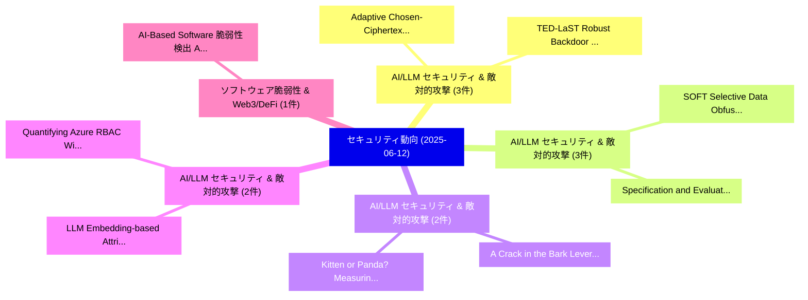

# 📅 02_daily: 日次エグゼクティブサマリー報告書 (2025-06-12)

**集計日時**: 2026-10-02 23:05:29 UTC  
**対象日付**: 2025-06-12  
**本日収集論文数**: 29 件  

---

## 💡 主要セキュリティ動向・脅威インサイト (Executive Insights)

本日の収集論文（計 29 件）において、以下の重点セキュリティ領域で活発な研究動向が確認されました：
- **AI/LLM セキュリティ & 敵対的攻撃** (3 件): 注目論文として 「Adaptive Chosen-Ciphertext Sec...」、「TED-LaST: Robust Backdoor Defe...」 等が発表され、実務防御および攻撃検証の進展が見られます。
- **AI/LLM セキュリティ & 敵対的攻撃** (3 件): 注目論文として 「SOFT: Selective Data Obfuscati...」、「Specification and Evaluation o...」 等が発表され、実務防御および攻撃検証の進展が見られます。
- **AI/LLM セキュリティ & 敵対的攻撃** (2 件): 注目論文として 「A Crack in the Bark: Leveragin...」、「Kitten or Panda? Measuring the...」 等が発表され、実務防御および攻撃検証の進展が見られます。
- **AI/LLM セキュリティ & 敵対的攻撃** (2 件): 注目論文として 「Quantifying Azure RBAC Wildcar...」、「LLM Embedding-based Attributio...」 等が発表され、実務防御および攻撃検証の進展が見られます。
- **ソフトウェア脆弱性 & Web3/DeFi** (1 件): 注目論文として 「AI-Based Software 脆弱性検出: A Sys...」 等が発表され、実務防御および攻撃検証の進展が見られます。

### 🗺️ 技術・脅威トピックマインドマップ

---

## 📌 日次セキュリティ論文一覧 (日本語表形式)

| No | arXiv ID | 論文タイトル (日本語訳) | 重要キーワード | 構造化エグゼクティブ要約 (背景・提案・影響) | 脅威分類 | 詳細リンク |
|---|---|---|---|---|---|---|
| 1 | `2506.10280v1` | [AI-Based Software 脆弱性検出: A Systematic Literature Review](../../okf/papers/2025-06-12/2506.10280.md) | `Systematic Literature Review`, `AI-Based Software`, `Based Software Vulnerability Detection` | 【提案】概要 (Overview & Key Finding) 本論文「AI-Based Software 脆弱性検出: A Systematic Literature Review...。実証評価により経営層・セキュリティ管理者向け推奨アクション (E... | `cs.CR` | [arXiv](https://arxiv.org/abs/2506.10280v1) &#124; [OKF](../../okf/papers/2025-06-12/2506.10280.md) |
| 2 | `2506.10323v5` | [ELFuzz: Efficient Input Generation via LLM-driven Synthesis Over Fuzzer Space（セキュリティ分析論文）](../../okf/papers/2025-06-12/2506.10323.md) | `Efficient Input Generation`, `LLM-driven Synthesis`, `Chuyang Chen` | 【提案】概要 (Overview & Key Finding) 本論文「ELFuzz: Efficient Input Generation via LLM-driven Synth...。実証評価により経営層・セキュリティ管理者向け推奨アクション (E... | `cs.CR` | [arXiv](https://arxiv.org/abs/2506.10323v5) &#124; [OKF](../../okf/papers/2025-06-12/2506.10323.md) |
| 3 | `2506.10327v1` | [A Comprehensive Survey of Unmanned Aerial Systems' Risks and Mitigation Strategies（セキュリティ分析論文）](../../okf/papers/2025-06-12/2506.10327.md) | `Unmanned Aerial Systems`, `Comprehensive Survey`, `Mitigation Strategies` | 【提案】概要 (Overview & Key Finding) 本論文「A Comprehensive Survey of Unmanned Aerial Systems' Risk...。実証評価により経営層・セキュリティ管理者向け推奨アクション (E... | `cs.CR` | [arXiv](https://arxiv.org/abs/2506.10327v1) &#124; [OKF](../../okf/papers/2025-06-12/2506.10327.md) |
| 4 | `2506.10338v1` | [Adaptive Chosen-Ciphertext Security of Distributed Broadcast Encryption（セキュリティ分析論文）](../../okf/papers/2025-06-12/2506.10338.md) | `Distributed Broadcast Encryption`, `Adaptive Chosen`, `Ciphertext Security` | 【提案】概要 (Overview & Key Finding) 本論文「Adaptive Chosen-Ciphertext Security of Distributed Broa...。実証評価により経営層・セキュリティ管理者向け推奨アクション (E... | `cs.CR` | [arXiv](https://arxiv.org/abs/2506.10338v1) &#124; [OKF](../../okf/papers/2025-06-12/2506.10338.md) |
| 5 | `2506.10364v4` | [Can We Infer Confidential Properties of Training Data from LLMs?（セキュリティ分析論文）](../../okf/papers/2025-06-12/2506.10364.md) | `Training Data`, `Pengrun Huang`, `Chhavi Yadav` | 【提案】### (日本語題名: Can We Infer Confidential Properties of Training Data from LLMs?（セキュリティ分析論文...。実証評価により経営層・セキュリティ管理者向け推奨アクション (E... | `cs.CR` | [arXiv](https://arxiv.org/abs/2506.10364v4) &#124; [OKF](../../okf/papers/2025-06-12/2506.10364.md) |
| 6 | `2506.10399v1` | [FicGCN: Unveiling the Homomorphic Encryption Efficiency from Irregular Graph Convolutional Networks（セキュリティ分析論文）](../../okf/papers/2025-06-12/2506.10399.md) | `Irregular Graph Convolutional Networks`, `Homomorphic Encryption Efficiency`, `Zhaoxuan Kan` | 【提案】概要 (Overview & Key Finding) 本論文「FicGCN: Unveiling the 準同型暗号 Efficiency from Irregular G...。実証評価により経営層・セキュリティ管理者向け推奨アクション (E... | `cs.CR` | [arXiv](https://arxiv.org/abs/2506.10399v1) &#124; [OKF](../../okf/papers/2025-06-12/2506.10399.md) |
| 7 | `2506.10424v1` | [SOFT: Selective Data Obfuscation for Protecting LLM Fine-tuning against Membership Inference Attacks（セキュリティ分析論文）](../../okf/papers/2025-06-12/2506.10424.md) | `Selective Data Obfuscation`, `Membership Inference Attacks`, `Kaiyuan Zhang` | 【提案】概要 (Overview & Key Finding) 本論文「SOFT: Selective Data Obfuscation for Protecting LLM Fin...。実証評価により経営層・セキュリティ管理者向け推奨アクション (E... | `cs.CR` | [arXiv](https://arxiv.org/abs/2506.10424v1) &#124; [OKF](../../okf/papers/2025-06-12/2506.10424.md) |
| 8 | `2506.10467v4` | [Specification and Evaluation of Multi-Agent LLM Systems -- Prototype and サイバーセキュリティ Applications](../../okf/papers/2025-06-12/2506.10467.md) | `Multi-Agent LLM`, `Cybersecurity Applications`, `Raw Meta` | 【提案】概要 (Overview & Key Finding) 本論文「Specification and Evaluation of Multi-Agent LLM Systems...。実証評価により経営層・セキュリティ管理者向け推奨アクション (E... | `cs.CR` | [arXiv](https://arxiv.org/abs/2506.10467v4) &#124; [OKF](../../okf/papers/2025-06-12/2506.10467.md) |
| 9 | `2506.10502v1` | [A Crack in the Bark: Leveraging Public Knowledge to Remove Tree-Ring Watermarks（セキュリティ分析論文）](../../okf/papers/2025-06-12/2506.10502.md) | `Leveraging Public Knowledge`, `Remove Tree`, `Ring Watermarks` | 【提案】概要 (Overview & Key Finding) 本論文「A Crack in the Bark: Leveraging Public Knowledge to Rem...。実証評価により経営層・セキュリティ管理者向け推奨アクション (E... | `cs.CR` | [arXiv](https://arxiv.org/abs/2506.10502v1) &#124; [OKF](../../okf/papers/2025-06-12/2506.10502.md) |
| 10 | `2506.10597v2` | [SoK: Evaluating Jailbreak Guardrails for 大規模言語モデル](../../okf/papers/2025-06-12/2506.10597.md) | `Evaluating Jailbreak Guardrails`, `Large Language Models`, `Xunguang Wang` | 【提案】概要 (Overview & Key Finding) 本論文「SoK: Evaluating ジェイルブレイク Guardrails for 大規模言語モデル」（原題: S...。実証評価により経営層・セキュリティ管理者向け推奨アクション (E... | `cs.CR` | [arXiv](https://arxiv.org/abs/2506.10597v2) &#124; [OKF](../../okf/papers/2025-06-12/2506.10597.md) |
| 11 | `2506.10620v1` | [Assessing the Resilience of Automotive Intrusion Detection Systems to Adversarial Manipulation（セキュリティ分析論文）](../../okf/papers/2025-06-12/2506.10620.md) | `Automotive Intrusion Detection Systems`, `Adversarial Manipulation`, `Stefano Longari` | 【提案】概要 (Overview & Key Finding) 本論文「Assessing the Resilience of Automotive Intrusion Detect...。実証評価により経営層・セキュリティ管理者向け推奨アクション (E... | `cs.CR` | [arXiv](https://arxiv.org/abs/2506.10620v1) &#124; [OKF](../../okf/papers/2025-06-12/2506.10620.md) |
| 12 | `2506.10638v1` | [CyFence: Cyber-Physical Controllers via Trusted Execution Environmentのセキュリティ強化](../../okf/papers/2025-06-12/2506.10638.md) | `Physical Controllers`, `Cyber-Physical Controllers`, `Trusted Execution Environment` | 【提案】概要 (Overview & Key Finding) 本論文「CyFence: Cyber-Physical Controllers via Trusted Executi...。実証評価により経営層・セキュリティ管理者向け推奨アクション (E... | `cs.CR` | [arXiv](https://arxiv.org/abs/2506.10638v1) &#124; [OKF](../../okf/papers/2025-06-12/2506.10638.md) |
| 13 | `2506.10645v2` | [Kitten or Panda? Measuring the Specificity of Threat Group Behaviors in Public CTI Knowledge Bases（セキュリティ分析論文）](../../okf/papers/2025-06-12/2506.10645.md) | `Threat Group Behaviors`, `Knowledge Bases`, `Aakanksha Saha` | 【提案】Measuring the Specificity of 脅威 Group Behaviors in Public CTI Knowledge Bases ### (日本語題...。実証評価により経営層・セキュリティ管理者向け推奨アクション (E... | `cs.CR` | [arXiv](https://arxiv.org/abs/2506.10645v2) &#124; [OKF](../../okf/papers/2025-06-12/2506.10645.md) |
| 14 | `2506.10665v1` | [GOLIATH: A Decentralized Framework for Data Collection in Intelligent Transportation Systems（セキュリティ分析論文）](../../okf/papers/2025-06-12/2506.10665.md) | `Intelligent Transportation Systems`, `Data Collection`, `Davide Maffiola` | 【提案】概要 (Overview & Key Finding) 本論文「GOLIATH: A Decentralized Framework for Data Collection ...。実証評価により経営層・セキュリティ管理者向け推奨アクション (E... | `cs.CR` | [arXiv](https://arxiv.org/abs/2506.10665v1) &#124; [OKF](../../okf/papers/2025-06-12/2506.10665.md) |
| 15 | `2506.10685v3` | [Defensive Adversarial CAPTCHA: A Semantics-Driven Framework for Natural Adversarial Example Generation（セキュリティ分析論文）](../../okf/papers/2025-06-12/2506.10685.md) | `Natural Adversarial Example Generation`, `Defensive Adversarial`, `Xia Du` | 【提案】概要 (Overview & Key Finding) 本論文「Defensive Adversarial CAPTCHA: A Semantics-Driven Frame...。実証評価により経営層・セキュリティ管理者向け推奨アクション (E... | `cs.CR` | [arXiv](https://arxiv.org/abs/2506.10685v3) &#124; [OKF](../../okf/papers/2025-06-12/2506.10685.md) |
| 16 | `2506.10721v1` | [Commitment Schemes for Multi-Party Computation（セキュリティ分析論文）](../../okf/papers/2025-06-12/2506.10721.md) | `Commitment Schemes`, `Party Computation`, `Multi-Party Computation` | 【提案】概要 (Overview & Key Finding) 本論文「Commitment Schemes for Multi-Party Computation（セキュリティ分析...。実証評価によりOlimid - **公開日時**: `2025-... | `cs.CR` | [arXiv](https://arxiv.org/abs/2506.10721v1) &#124; [OKF](../../okf/papers/2025-06-12/2506.10721.md) |
| 17 | `2506.10722v1` | [TED-LaST: Robust Backdoor Defense Against Adaptive Attacksに向けて](../../okf/papers/2025-06-12/2506.10722.md) | `Leo Yu Zhang`, `Xiaoxing Mo`, `Yuxuan Cheng` | 【提案】概要 (Overview & Key Finding) 本論文「TED-LaST: Robust Backdoor Defense Against Adaptive Atta...。実証評価により経営層・セキュリティ管理者向け推奨アクション (E... | `cs.CR` | [arXiv](https://arxiv.org/abs/2506.10722v1) &#124; [OKF](../../okf/papers/2025-06-12/2506.10722.md) |
| 18 | `2506.10744v1` | [ObfusBFA: A Holistic Approach to Safeguarding DNNs from Different Types of Bit-Flip Attacks（セキュリティ分析論文）](../../okf/papers/2025-06-12/2506.10744.md) | `Different Types`, `Flip Attacks`, `Bit-Flip Attacks` | 【提案】概要 (Overview & Key Finding) 本論文「ObfusBFA: A Holistic Approach to Safeguarding DNNs from...。実証評価により経営層・セキュリティ管理者向け推奨アクション (E... | `cs.CR` | [arXiv](https://arxiv.org/abs/2506.10744v1) &#124; [OKF](../../okf/papers/2025-06-12/2506.10744.md) |
| 19 | `2506.10755v3` | [Quantifying Azure RBAC Wildcard Overreach（セキュリティ分析論文）](../../okf/papers/2025-06-12/2506.10755.md) | `Quantifying Azure`, `Wildcard Overreach`, `Christophe Parisel` | 【提案】概要 (Overview & Key Finding) 本論文「Quantifying Azure RBAC Wildcard Overreach（セキュリティ分析論文）」（...。実証評価により経営層・セキュリティ管理者向け推奨アクション (E... | `cs.CR` | [arXiv](https://arxiv.org/abs/2506.10755v3) &#124; [OKF](../../okf/papers/2025-06-12/2506.10755.md) |
| 20 | `2506.10776v2` | [ME: Trigger Element Combination Backdoor Attack on Copyright Infringement（セキュリティ分析論文）](../../okf/papers/2025-06-12/2506.10776.md) | `Trigger Element Combination Backdoor Attack`, `Copyright Infringement`, `Feiyu Yang` | 【提案】概要 (Overview & Key Finding) 本論文「ME: Trigger Element Combination Backdoor Attack on Copy...。実証評価により経営層・セキュリティ管理者向け推奨アクション (E... | `cs.CR` | [arXiv](https://arxiv.org/abs/2506.10776v2) &#124; [OKF](../../okf/papers/2025-06-12/2506.10776.md) |
| 21 | `2506.10949v2` | [Monitoring Decomposition Attacks in LLMs with Lightweight Sequential Monitors（セキュリティ分析論文）](../../okf/papers/2025-06-12/2506.10949.md) | `Monitoring Decomposition Attacks`, `Lightweight Sequential Monitors`, `Lightweight Sequential Mon` | 【提案】概要 (Overview & Key Finding) 本論文「Monitoring Decomposition Attacks in LLMs with Lightweig...。実証評価により経営層・セキュリティ管理者向け推奨アクション (E... | `cs.CR` | [arXiv](https://arxiv.org/abs/2506.10949v2) &#124; [OKF](../../okf/papers/2025-06-12/2506.10949.md) |
| 22 | `2506.10960v3` | [ChineseHarm-Bench: A Chinese Harmful Content Detection Benchmark（セキュリティ分析論文）](../../okf/papers/2025-06-12/2506.10960.md) | `Chinese Harmful Content Detection Benchmark`, `Chinese Harmful Conte`, `Kangwei Liu` | 【提案】概要 (Overview & Key Finding) 本論文「ChineseHarm-Bench: A Chinese Harmful Content Detection ...。実証評価により経営層・セキュリティ管理者向け推奨アクション (E... | `cs.CR` | [arXiv](https://arxiv.org/abs/2506.10960v3) &#124; [OKF](../../okf/papers/2025-06-12/2506.10960.md) |
| 23 | `2506.11212v2` | [User Perceptions and Attitudes Toward Untraceability in Messaging Platforms（セキュリティ分析論文）](../../okf/papers/2025-06-12/2506.11212.md) | `Attitudes Toward Untraceability`, `User Perceptions`, `Messaging Platforms` | 【提案】概要 (Overview & Key Finding) 本論文「User Perceptions and Attitudes Toward Untraceability in...。実証評価によりGriggio, B。 | `cs.CR` | [arXiv](https://arxiv.org/abs/2506.11212v2) &#124; [OKF](../../okf/papers/2025-06-12/2506.11212.md) |
| 24 | `2506.11325v2` | [Revealing the True Indicators: Understanding and Improving IoC Extraction From Threat Reports（セキュリティ分析論文）](../../okf/papers/2025-06-12/2506.11325.md) | `True Indicators`, `Sean Tyler Frankum`, `Evangelos Froudakis` | 【提案】概要 (Overview & Key Finding) 本論文「Revealing the True Indicators: Understanding and Improv...。実証評価により経営層・セキュリティ管理者向け推奨アクション (E... | `cs.CR` | [arXiv](https://arxiv.org/abs/2506.11325v2) &#124; [OKF](../../okf/papers/2025-06-12/2506.11325.md) |
| 25 | `2506.12096v2` | [Quantum Computing and Cybersecurity in Accounting and Finance: Current and Future Challenges and the Opportunities for Accounting and Finance Systems in the Post-Quantum Worldのセキュリティ強化](../../okf/papers/2025-06-12/2506.12096.md) | `Quantum Computing`, `Future Challenges`, `Finance Systems` | 【提案】概要 (Overview & Key Finding) 本論文「量子 Computing and Cybersecurity in Accounting and Financ...。実証評価により経営層・セキュリティ。 | `cs.CR` | [arXiv](https://arxiv.org/abs/2506.12096v2) &#124; [OKF](../../okf/papers/2025-06-12/2506.12096.md) |
| 26 | `2506.12097v1` | [UCD: Unlearning in LLMs via Contrastive Decoding（セキュリティ分析論文）](../../okf/papers/2025-06-12/2506.12097.md) | `Contrastive Decoding`, `Ayush Sekhari`, `Ashia Wilson` | 【提案】概要 (Overview & Key Finding) 本論文「UCD: Unlearning in LLMs via Contrastive Decoding（セキュリティ...。実証評価によりSuriyakumar, Ayush Sekhar... | `cs.CR` | [arXiv](https://arxiv.org/abs/2506.12097v1) &#124; [OKF](../../okf/papers/2025-06-12/2506.12097.md) |
| 27 | `2506.12100v2` | [LLM Embedding-based Attribution (LEA): Quantifying Source Contributions to Generative Model's Response for Vulnerability Analysis（セキュリティ分析論文）](../../okf/papers/2025-06-12/2506.12100.md) | `Quantifying Source Contributions`, `Generative Model`, `Embedding-based Attribution` | 【提案】概要 (Overview & Key Finding) 本論文「LLM Embedding-based Attribution (LEA): Quantifying Sour...。実証評価により経営層・セキュリティ管理者向け推奨アクション (E... | `cs.CR` | [arXiv](https://arxiv.org/abs/2506.12100v2) &#124; [OKF](../../okf/papers/2025-06-12/2506.12100.md) |
| 28 | `2506.22445v1` | [Hierarchical Adversarially-Resilient Multi-Agent Reinforcement Learning for Cyber-Physical Systems Security（セキュリティ分析論文）](../../okf/papers/2025-06-12/2506.22445.md) | `Agent Reinforcement Learning`, `Physical Systems Security`, `Hierarchical Adversarially` | 【提案】概要 (Overview & Key Finding) 本論文「Hierarchical Adversarially-Resilient Multi-Agent Reinfo...。実証評価により経営層・セキュリティ管理者向け推奨アクション (E... | `cs.CR` | [arXiv](https://arxiv.org/abs/2506.22445v1) &#124; [OKF](../../okf/papers/2025-06-12/2506.22445.md) |
| 29 | `2507.06236v1` | [Single Block On（セキュリティ分析論文）](../../okf/papers/2025-06-12/2507.06236.md) | `Paritosh Ranjan`, `Surajit Majumder`, `Prodip Roy` | 【提案】概要 (Overview & Key Finding) 本論文「Single Block On（セキュリティ分析論文）」（原題: Single Block On / arXi...。実証評価により経営層・セキュリティ管理者向け推奨アクション (E... | `cs.CR` | [arXiv](https://arxiv.org/abs/2507.06236v1) &#124; [OKF](../../okf/papers/2025-06-12/2507.06236.md) |

