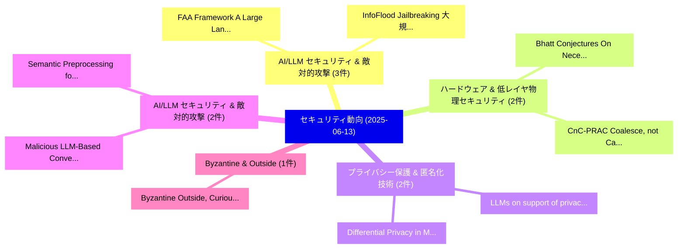

# 📅 02_daily: 日次エグゼクティブサマリー報告書 (2025-06-13)

**集計日時**: 2026-10-02 23:05:29 UTC  
**対象日付**: 2025-06-13  
**本日収集論文数**: 27 件  

---

## 💡 主要セキュリティ動向・脅威インサイト (Executive Insights)

本日の収集論文（計 27 件）において、以下の重点セキュリティ領域で活発な研究動向が確認されました：
- **AI/LLM セキュリティ & 敵対的攻撃** (3 件): 注目論文として 「FAA Framework: A Large Languag...」、「InfoFlood: Jailbreaking 大規模言語モ...」 等が発表され、実務防御および攻撃検証の進展が見られます。
- **ハードウェア & 低レイヤ物理セキュリティ** (2 件): 注目論文として 「Bhatt Conjectures: On Necessar...」、「CnC-PRAC: Coalesce, not Cache,...」 等が発表され、実務防御および攻撃検証の進展が見られます。
- **プライバシー保護 & 匿名化技術** (2 件): 注目論文として 「LLMs on support of privacy and...」、「Differential Privacy in Machin...」 等が発表され、実務防御および攻撃検証の進展が見られます。
- **AI/LLM セキュリティ & 敵対的攻撃** (2 件): 注目論文として 「Malicious LLM-Based Conversati...」、「Semantic Preprocessing for LLM...」 等が発表され、実務防御および攻撃検証の進展が見られます。
- **Byzantine & Outside** (1 件): 注目論文として 「Byzantine Outside, Curious Ins...」 等が発表され、実務防御および攻撃検証の進展が見られます。

### 🗺️ 技術・脅威トピックマインドマップ

---

## 📌 日次セキュリティ論文一覧 (日本語表形式)

| No | arXiv ID | 論文タイトル (日本語訳) | 重要キーワード | 構造化エグゼクティブ要約 (背景・提案・影響) | 脅威分類 | 詳細リンク |
|---|---|---|---|---|---|---|
| 1 | `2506.11413v1` | [Byzantine Outside, Curious Inside: Reconstructing Data Through Malicious Updates（セキュリティ分析論文）](../../okf/papers/2025-06-13/2506.11413.md) | `Byzantine Outside`, `Curious Inside`, `Kai Yue` | 【提案】概要 (Overview & Key Finding) 本論文「Byzantine Outside, Curious Inside: Reconstructing Data ...。実証評価により経営層・セキュリティ管理者向け推奨アクション (E... | `cs.CR` | [arXiv](https://arxiv.org/abs/2506.11413v1) &#124; [OKF](../../okf/papers/2025-06-13/2506.11413.md) |
| 2 | `2506.11415v1` | [Bias Amplification in RAG: Poisoning Knowledge Retrieval to Steer LLMs（セキュリティ分析論文）](../../okf/papers/2025-06-13/2506.11415.md) | `Poisoning Knowledge Retrieval`, `Bias Amplification`, `Linlin Wang` | 【提案】概要 (Overview & Key Finding) 本論文「Bias Amplification in RAG: Poisoning Knowledge Retrieva...。実証評価により経営層・セキュリティ管理者向け推奨アクション (E... | `cs.CR` | [arXiv](https://arxiv.org/abs/2506.11415v1) &#124; [OKF](../../okf/papers/2025-06-13/2506.11415.md) |
| 3 | `2506.11423v4` | [Bhatt Conjectures: On Necessary-But-Not-Sufficient Benchmark Tautology for Human Like Reasoning（セキュリティ分析論文）](../../okf/papers/2025-06-13/2506.11423.md) | `Sufficient Benchmark Tautology`, `Human Like Reasoning`, `Bhatt Conjectures` | 【提案】背景とセキュリティ上の課題 (Background & Problem) 本研究はサイバー脅威環境におけるセキュリティ構造・脆弱性の検証を目的としています。(主要検出項目: ...。実証評価により経営層・セキュリティ管理者向け推奨アクション (E... | `cs.CR` | [arXiv](https://arxiv.org/abs/2506.11423v4) &#124; [OKF](../../okf/papers/2025-06-13/2506.11423.md) |
| 4 | `2506.11444v1` | [GaussMarker: Robust Dual-Domain Watermark for Diffusion Models（セキュリティ分析論文）](../../okf/papers/2025-06-13/2506.11444.md) | `Robust Dual`, `Domain Watermark`, `Diffusion Models` | 【提案】概要 (Overview & Key Finding) 本論文「GaussMarker: Robust Dual-Domain Watermark for Diffusion...。実証評価により経営層・セキュリティ管理者向け推奨アクション (E... | `cs.CR` | [arXiv](https://arxiv.org/abs/2506.11444v1) &#124; [OKF](../../okf/papers/2025-06-13/2506.11444.md) |
| 5 | `2506.11458v1` | [Computational Attestations of Polynomial Integrity Verifiable Machine-Learningに向けて](../../okf/papers/2025-06-13/2506.11458.md) | `Computational Attestations`, `Polynomial Integrity Towards Verifiable Machine`, `Polynomial Integrity Verifiable Machine` | 【提案】概要 (Overview & Key Finding) 本論文「Computational Attestations of Polynomial Integrity Veri...。実証評価により経営層・セキュリティ管理者向け推奨アクション (E... | `cs.CR` | [arXiv](https://arxiv.org/abs/2506.11458v1) &#124; [OKF](../../okf/papers/2025-06-13/2506.11458.md) |
| 6 | `2506.11486v2` | [On Differential and Boomerang Properties of a Class of Binomials over Finite Fields of Odd Characteristic（セキュリティ分析論文）](../../okf/papers/2025-06-13/2506.11486.md) | `Boomerang Properties`, `Finite Fields`, `Odd Characteristic` | 【提案】概要 (Overview & Key Finding) 本論文「On Differential and Boomerang Properties of a Class of ...。実証評価により経営層・セキュリティ管理者向け推奨アクション (E... | `cs.CR` | [arXiv](https://arxiv.org/abs/2506.11486v2) &#124; [OKF](../../okf/papers/2025-06-13/2506.11486.md) |
| 7 | `2506.11521v1` | [Investigating Vulnerabilities and Defenses Against Audio-Visual Attacks: A Comprehensive Survey Emphasizing Multimodal Models（セキュリティ分析論文）](../../okf/papers/2025-06-13/2506.11521.md) | `Comprehensive Survey Emphasizing Multimodal Models`, `Investigating Vulnerabilities`, `Visual Attacks` | 【提案】概要 (Overview & Key Finding) 本論文「Investigating Vulnerabilities and Defenses Against Audi...。実証評価により経営層・セキュリティ管理者向け推奨アクション (E... | `cs.CR` | [arXiv](https://arxiv.org/abs/2506.11521v1) &#124; [OKF](../../okf/papers/2025-06-13/2506.11521.md) |
| 8 | `2506.11586v1` | [SecONNds: Secure Outsourced Neural Network Inference on ImageNet（セキュリティ分析論文）](../../okf/papers/2025-06-13/2506.11586.md) | `Secure Outsourced Neural Network Inference`, `Shashank Balla`, `Raw Meta` | 【提案】概要 (Overview & Key Finding) 本論文「SecONNds: Secure Outsourced Neural Network Inference on...。実証評価により経営層・セキュリティ管理者向け推奨アクション (E... | `cs.CR` | [arXiv](https://arxiv.org/abs/2506.11586v1) &#124; [OKF](../../okf/papers/2025-06-13/2506.11586.md) |
| 9 | `2506.11612v1` | [KEENHash: Hashing Programs into Function-Aware Embeddings for Large-Scale Binary Code Similarity Analysis（セキュリティ分析論文）](../../okf/papers/2025-06-13/2506.11612.md) | `Hashing Programs`, `Aware Embeddings`, `Function-Aware Embeddings` | 【提案】概要 (Overview & Key Finding) 本論文「KEENHash: Hashing Programs into Function-Aware Embeddin...。実証評価により経営層・セキュリティ管理者向け推奨アクション (E... | `cs.CR` | [arXiv](https://arxiv.org/abs/2506.11612v1) &#124; [OKF](../../okf/papers/2025-06-13/2506.11612.md) |
| 10 | `2506.11635v1` | [FAA Framework: A Large Language Model-Based Approach for Credit Card Fraud Investigations（セキュリティ分析論文）](../../okf/papers/2025-06-13/2506.11635.md) | `Credit Card Fraud Investigations`, `Large Language Model`, `Shaun Shuster` | 【提案】概要 (Overview & Key Finding) 本論文「FAA Framework: A Large Language Model-Based Approach fo...。実証評価により経営層・セキュリティ管理者向け推奨アクション (E... | `cs.CR` | [arXiv](https://arxiv.org/abs/2506.11635v1) &#124; [OKF](../../okf/papers/2025-06-13/2506.11635.md) |
| 11 | `2506.11669v1` | [DTHA: A Digital Twin-Assisted Handover Authentication Scheme for 5G and Beyond（セキュリティ分析論文）](../../okf/papers/2025-06-13/2506.11669.md) | `Assisted Handover Authentication Scheme`, `Digital Twin`, `Twin-Assisted Handover` | 【提案】概要 (Overview & Key Finding) 本論文「DTHA: A Digital Twin-Assisted Handover Authentication S...。実証評価により経営層・セキュリティ管理者向け推奨アクション (E... | `cs.CR` | [arXiv](https://arxiv.org/abs/2506.11669v1) &#124; [OKF](../../okf/papers/2025-06-13/2506.11669.md) |
| 12 | `2506.11679v3` | [LLMs on support of privacy and security of mobile apps: state of the art and research directions（セキュリティ分析論文）](../../okf/papers/2025-06-13/2506.11679.md) | `Tran Thanh Lam Nguyen`, `Barbara Carminati`, `Elena Ferrari` | 【提案】概要 (Overview & Key Finding) 本論文「LLMs on support of privacy and security of mobile apps:...。実証評価により経営層・セキュリティ管理者向け推奨アクション (E... | `cs.CR` | [arXiv](https://arxiv.org/abs/2506.11679v3) &#124; [OKF](../../okf/papers/2025-06-13/2506.11679.md) |
| 13 | `2506.11680v1` | [Malicious LLM-Based Conversational AI Makes Users Reveal Personal Information（セキュリティ分析論文）](../../okf/papers/2025-06-13/2506.11680.md) | `Makes Users Reveal Personal Information`, `Based Conversational`, `LLM-Based Conversational` | 【提案】概要 (Overview & Key Finding) 本論文「Malicious LLM-Based Conversational AI Makes Users Revea...。実証評価により経営層・セキュリティ管理者向け推奨アクション (E... | `cs.CR` | [arXiv](https://arxiv.org/abs/2506.11680v1) &#124; [OKF](../../okf/papers/2025-06-13/2506.11680.md) |
| 14 | `2506.11687v2` | [Differential Privacy in Machine Learning: A Survey from Symbolic AI to LLMs（セキュリティ分析論文）](../../okf/papers/2025-06-13/2506.11687.md) | `Differential Privacy`, `Machine Learning`, `Francisco Aguilera` | 【提案】概要 (Overview & Key Finding) 本論文「差分プライバシー in Machine Learning: A Survey from Symbolic AI...。実証評価により経営層・セキュリティ管理者向け推奨アクション (E... | `cs.CR` | [arXiv](https://arxiv.org/abs/2506.11687v2) &#124; [OKF](../../okf/papers/2025-06-13/2506.11687.md) |
| 15 | `2506.11701v1` | [PermRust: A Token-based Permission System for Rust（セキュリティ分析論文）](../../okf/papers/2025-06-13/2506.11701.md) | `Permission System`, `Token-based Permission`, `Lukas Gehring` | 【提案】概要 (Overview & Key Finding) 本論文「PermRust: A Token-based Permission System for Rust（セキュリ...。実証評価により経営層・セキュリティ管理者向け推奨アクション (E... | `cs.CR` | [arXiv](https://arxiv.org/abs/2506.11701v1) &#124; [OKF](../../okf/papers/2025-06-13/2506.11701.md) |
| 16 | `2506.11791v2` | [SEC-bench: Automated of LLM Agents on Real-World Software Security Tasksのベンチマーク評価](../../okf/papers/2025-06-13/2506.11791.md) | `Real-World Software`, `World Software Security Tasks`, `World Software Security` | 【提案】概要 (Overview & Key Finding) 本論文「SEC-bench: Automated of LLM Agents on Real-World Softwa...。実証評価により経営層・セキュリティ管理者向け推奨アクション (E... | `cs.CR` | [arXiv](https://arxiv.org/abs/2506.11791v2) &#124; [OKF](../../okf/papers/2025-06-13/2506.11791.md) |
| 17 | `2506.11939v1` | [Today's Cat Is Tomorrow's Dog: Accounting for Time-Based Changes in the Labels of ML 脆弱性検出 Approaches](../../okf/papers/2025-06-13/2506.11939.md) | `Based Changes`, `Time-Based Changes`, `Vulnerability Detection Approaches` | 【提案】概要 (Overview & Key Finding) 本論文「Today's Cat Is Tomorrow's Dog: Accounting for Time-Base...。実証評価により経営層・セキュリティ管理者向け推奨アクション (E... | `cs.CR` | [arXiv](https://arxiv.org/abs/2506.11939v1) &#124; [OKF](../../okf/papers/2025-06-13/2506.11939.md) |
| 18 | `2506.11954v1` | [Technical Evaluation of a Disruptive Approach in Homomorphic AI（セキュリティ分析論文）](../../okf/papers/2025-06-13/2506.11954.md) | `Eric Filiol`, `Raw Meta`, `Executive Summary` | 【提案】概要 (Overview & Key Finding) 本論文「Technical Evaluation of a Disruptive Approach in Homomo...。実証評価により経営層・セキュリティ管理者向け推奨アクション (E... | `cs.CR` | [arXiv](https://arxiv.org/abs/2506.11954v1) &#124; [OKF](../../okf/papers/2025-06-13/2506.11954.md) |
| 19 | `2506.11970v1` | [CnC-PRAC: Coalesce, not Cache, Per Row Activation Counts for an Efficient in-DRAM Rowhammer Mitigation（セキュリティ分析論文）](../../okf/papers/2025-06-13/2506.11970.md) | `Per Row Activation Counts`, `Rowhammer Mitigation`, `in-DRAM Rowhammer` | 【提案】背景とセキュリティ上の課題 (Background & Problem) 本研究はサイバー脅威環境におけるセキュリティ構造・脆弱性の検証を目的としています。(主要検出項目: ...。実証評価により経営層・セキュリティ管理者向け推奨アクション (E... | `cs.CR` | [arXiv](https://arxiv.org/abs/2506.11970v1) &#124; [OKF](../../okf/papers/2025-06-13/2506.11970.md) |
| 20 | `2506.12104v3` | [DRIFT: Dynamic Rule-Based Defense with Injection Isolation for LLM Agentsのセキュリティ強化](../../okf/papers/2025-06-13/2506.12104.md) | `Dynamic Rule`, `Based Defense`, `Injection Isolation` | 【提案】概要 (Overview & Key Finding) 本論文「DRIFT: Dynamic Rule-Based Defense with Injection Isolat...。実証評価により経営層・セキュリティ管理者向け推奨アクション (E... | `cs.CR` | [arXiv](https://arxiv.org/abs/2506.12104v3) &#124; [OKF](../../okf/papers/2025-06-13/2506.12104.md) |
| 21 | `2506.12108v3` | [A Lightweight IDS for Early APT Detection Using a Novel Feature Selection Method（セキュリティ分析論文）](../../okf/papers/2025-06-13/2506.12108.md) | `Detection Using`, `Bassam Noori Shaker`, `Mohammed Falih Hassan` | 【提案】概要 (Overview & Key Finding) 本論文「A Lightweight IDS for Early APT Detection Using a Novel...。実証評価により経営層・セキュリティ管理者向け推奨アクション (E... | `cs.CR` | [arXiv](https://arxiv.org/abs/2506.12108v3) &#124; [OKF](../../okf/papers/2025-06-13/2506.12108.md) |
| 22 | `2506.12113v4` | [Semantic Preprocessing for LLM-based Malware Analysis（セキュリティ分析論文）](../../okf/papers/2025-06-13/2506.12113.md) | `Semantic Preprocessing`, `LLM-based Malware`, `Benjamin Marais` | 【提案】概要 (Overview & Key Finding) 本論文「Semantic Preprocessing for LLM-based マルウェア Analysis（セキュ...。実証評価により経営層・セキュリティ管理者向け推奨アクション (E... | `cs.CR` | [arXiv](https://arxiv.org/abs/2506.12113v4) &#124; [OKF](../../okf/papers/2025-06-13/2506.12113.md) |
| 23 | `2506.12195v1` | [OSI Stack Redesign for Quantum Networks: Requirements, Technologies, Challenges, and Future Directions（セキュリティ分析論文）](../../okf/papers/2025-06-13/2506.12195.md) | `Stack Redesign`, `Quantum Networks`, `Future Directions` | 【提案】概要 (Overview & Key Finding) 本論文「OSI Stack Redesign for 量子 Networks: Requirements, Techn...。実証評価により経営層・セキュリティ管理者向け推奨アクション (E... | `cs.CR` | [arXiv](https://arxiv.org/abs/2506.12195v1) &#124; [OKF](../../okf/papers/2025-06-13/2506.12195.md) |
| 24 | `2506.12202v1` | [A Fast, Reliable, and Secure Programming Language for LLMエージェント with Code Actions](../../okf/papers/2025-06-13/2506.12202.md) | `Secure Programming Language`, `Code Actions`, `Stephen Mell` | 【提案】概要 (Overview & Key Finding) 本論文「A Fast, Reliable, and Secure Programming Language for L...。実証評価により経営層・セキュリティ管理者向け推奨アクション (E... | `cs.CR` | [arXiv](https://arxiv.org/abs/2506.12202v1) &#124; [OKF](../../okf/papers/2025-06-13/2506.12202.md) |
| 25 | `2506.12274v1` | [InfoFlood: Jailbreaking 大規模言語モデル with Information Overload](../../okf/papers/2025-06-13/2506.12274.md) | `Information Overload`, `Jailbreaking Large Language Models`, `Advait Yadav` | 【提案】概要 (Overview & Key Finding) 本論文「InfoFlood: ジェイルブレイクing 大規模言語モデル with Information Overlo...。実証評価により経営層・セキュリティ管理者向け推奨アクション (E... | `cs.CR` | [arXiv](https://arxiv.org/abs/2506.12274v1) &#124; [OKF](../../okf/papers/2025-06-13/2506.12274.md) |
| 26 | `2506.21571v3` | [Understanding the Cognitive Habits of Large Reasoning Modelsに向けて](../../okf/papers/2025-06-13/2506.21571.md) | `Cognitive Habits`, `Large Reasoning Models`, `Towards Understanding` | 【提案】概要 (Overview & Key Finding) 本論文「Understanding the Cognitive Habits of Large Reasoning M...。実証評価により経営層・セキュリティ管理者向け推奨アクション (E... | `cs.CR` | [arXiv](https://arxiv.org/abs/2506.21571v3) &#124; [OKF](../../okf/papers/2025-06-13/2506.21571.md) |
| 27 | `2507.00015v1` | [Vision Transformer with Adversarial Indicator Token against Adversarial Attacks in Radio Signal Classifications（セキュリティ分析論文）](../../okf/papers/2025-06-13/2507.00015.md) | `Adversarial Indicator Token`, `Radio Signal Classifications`, `Vision Transformer` | 【提案】概要 (Overview & Key Finding) 本論文「Vision Transformer with Adversarial Indicator Token aga...。実証評価により経営層・セキュリティ管理者向け推奨アクション (E... | `cs.CR` | [arXiv](https://arxiv.org/abs/2507.00015v1) &#124; [OKF](../../okf/papers/2025-06-13/2507.00015.md) |

