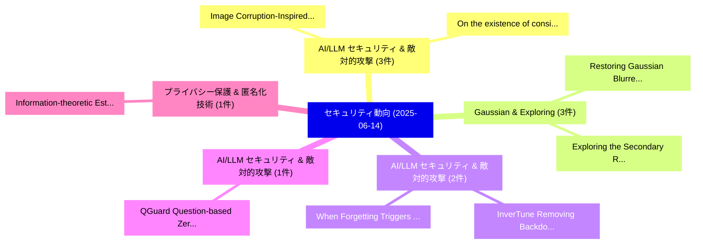

# 📅 02_daily: 日次エグゼクティブサマリー報告書 (2025-06-14)

**集計日時**: 2026-10-02 23:05:30 UTC  
**対象日付**: 2025-06-14  
**本日収集論文数**: 17 件  

---

## 💡 主要セキュリティ動向・脅威インサイト (Executive Insights)

本日の収集論文（計 17 件）において、以下の重点セキュリティ領域で活発な研究動向が確認されました：
- **AI/LLM セキュリティ & 敵対的攻撃** (3 件): 注目論文として 「Image Corruption-Inspired Memb...」、「On the existence of consistent...」 等が発表され、実務防御および攻撃検証の進展が見られます。
- **Gaussian & Exploring** (3 件): 注目論文として 「Restoring Gaussian Blurred Fac...」、「Exploring the Secondary Risks ...」 等が発表され、実務防御および攻撃検証の進展が見られます。
- **AI/LLM セキュリティ & 敵対的攻撃** (2 件): 注目論文として 「InverTune: Removing Backdoors ...」、「When Forgetting Triggers Backd...」 等が発表され、実務防御および攻撃検証の進展が見られます。
- **AI/LLM セキュリティ & 敵対的攻撃** (1 件): 注目論文として 「QGuard:Question-based Zero-sho...」 等が発表され、実務防御および攻撃検証の進展が見られます。
- **プライバシー保護 & 匿名化技術** (1 件): 注目論文として 「Information-theoretic Estimati...」 等が発表され、実務防御および攻撃検証の進展が見られます。

### 🗺️ 技術・脅威トピックマインドマップ

---

## 📌 日次セキュリティ論文一覧 (日本語表形式)

| No | arXiv ID | 論文タイトル (日本語訳) | 重要キーワード | 構造化エグゼクティブ要約 (背景・提案・影響) | 脅威分類 | 詳細リンク |
|---|---|---|---|---|---|---|
| 1 | `2506.12299v3` | [QGuard:Question-based Zero-shot Guard for Multi-modal LLM Safety（セキュリティ分析論文）](../../okf/papers/2025-06-14/2506.12299.md) | `Question-based Zero`, `Multi-modal LLM`, `Soo Yong Kim` | 【提案】概要 (Overview & Key Finding) 本論文「QGuard:Question-based Zero-shot Guard for Multi-modal L...。実証評価により経営層・セキュリティ管理者向け推奨アクション (E... | `cs.CR` | [arXiv](https://arxiv.org/abs/2506.12299v3) &#124; [OKF](../../okf/papers/2025-06-14/2506.12299.md) |
| 2 | `2506.12328v1` | [Information-theoretic Estimation of the Risk of Privacy Leaks（セキュリティ分析論文）](../../okf/papers/2025-06-14/2506.12328.md) | `Privacy Leaks`, `Information-theoretic Estimation`, `Kenneth Odoh` | 【提案】概要 (Overview & Key Finding) 本論文「Information-theoretic Estimation of the Risk of Privacy...。実証評価により経営層・セキュリティ管理者向け推奨アクション (E... | `cs.CR` | [arXiv](https://arxiv.org/abs/2506.12328v1) &#124; [OKF](../../okf/papers/2025-06-14/2506.12328.md) |
| 3 | `2506.12340v3` | [Image Corruption-Inspired Membership Inference Attacks against Large Vision-Language Models（セキュリティ分析論文）](../../okf/papers/2025-06-14/2506.12340.md) | `Inspired Membership Inference Attacks`, `Image Corruption`, `Large Vision` | 【提案】概要 (Overview & Key Finding) 本論文「Image Corruption-Inspired Membership Inference Attacks ...。実証評価により経営層・セキュリティ管理者向け推奨アクション (E... | `cs.CR` | [arXiv](https://arxiv.org/abs/2506.12340v3) &#124; [OKF](../../okf/papers/2025-06-14/2506.12340.md) |
| 4 | `2506.12344v1` | [Restoring Gaussian Blurred Face Images for Deanonymization Attacks（セキュリティ分析論文）](../../okf/papers/2025-06-14/2506.12344.md) | `Restoring Gaussian Blurred Face Images`, `Deanonymization Attacks`, `Haoyu Zhai` | 【提案】概要 (Overview & Key Finding) 本論文「Restoring Gaussian Blurred Face Images for Deanonymizat...。実証評価により経営層・セキュリティ管理者向け推奨アクション (E... | `cs.CR` | [arXiv](https://arxiv.org/abs/2506.12344v1) &#124; [OKF](../../okf/papers/2025-06-14/2506.12344.md) |
| 5 | `2506.12382v5` | [Exploring the Secondary Risks of 大規模言語モデル](../../okf/papers/2025-06-14/2506.12382.md) | `Secondary Risks`, `Large Language Models`, `Jiawei Chen` | 【提案】概要 (Overview & Key Finding) 本論文「Exploring the Secondary Risks of 大規模言語モデル」（原題: Explorin...。実証評価により経営層・セキュリティ管理者向け推奨アクション (E... | `cs.CR` | [arXiv](https://arxiv.org/abs/2506.12382v5) &#124; [OKF](../../okf/papers/2025-06-14/2506.12382.md) |
| 6 | `2506.12411v1` | [InverTune: Removing Backdoors from Multimodal Contrastive Learning Models via Trigger Inversion and Activation Tuning（セキュリティ分析論文）](../../okf/papers/2025-06-14/2506.12411.md) | `Multimodal Contrastive Learning Models`, `Removing Backdoors`, `Trigger Inversion` | 【提案】概要 (Overview & Key Finding) 本論文「InverTune: Removing Backdoors from Multimodal Contrasti...。実証評価により経営層・セキュリティ管理者向け推奨アクション (E... | `cs.CR` | [arXiv](https://arxiv.org/abs/2506.12411v1) &#124; [OKF](../../okf/papers/2025-06-14/2506.12411.md) |
| 7 | `2506.12430v2` | [Pushing the Limits of Safety: A Technical Report on the ATLAS Challenge 2025（セキュリティ分析論文）](../../okf/papers/2025-06-14/2506.12430.md) | `Technical Report`, `Yew Soon Ong`, `Zonghao Ying` | 【提案】概要 (Overview & Key Finding) 本論文「Pushing the Limits of Safety: A Technical Report on the...。実証評価により経営層・セキュリティ管理者向け推奨アクション (E... | `cs.CR` | [arXiv](https://arxiv.org/abs/2506.12430v2) &#124; [OKF](../../okf/papers/2025-06-14/2506.12430.md) |
| 8 | `2506.12454v1` | [On the existence of consistent adversarial attacks in high-dimensional linear classification（セキュリティ分析論文）](../../okf/papers/2025-06-14/2506.12454.md) | `high-dimensional linear`, `Matteo Vilucchio`, `Bruno Loureiro` | 【提案】概要 (Overview & Key Finding) 本論文「On the existence of consistent 敵対的攻撃s in high-dimension...。実証評価により経営層・セキュリティ管理者向け推奨アクション (E... | `cs.CR` | [arXiv](https://arxiv.org/abs/2506.12454v1) &#124; [OKF](../../okf/papers/2025-06-14/2506.12454.md) |
| 9 | `2506.12466v1` | [Safety and Security Testing of Cyberphysical Power Systems by Shape Validationに向けて](../../okf/papers/2025-06-14/2506.12466.md) | `Cyberphysical Power Systems`, `Security Testing`, `Towards Safety` | 【提案】概要 (Overview & Key Finding) 本論文「Safety and Security Testing of Cyberphysical Power Syst...。実証評価により経営層・セキュリティ管理者向け推奨アクション (E... | `cs.CR` | [arXiv](https://arxiv.org/abs/2506.12466v1) &#124; [OKF](../../okf/papers/2025-06-14/2506.12466.md) |
| 10 | `2506.12519v2` | [Exploiting AI for Attacks: On the Interplay between Adversarial AI and Offensive AI（セキュリティ分析論文）](../../okf/papers/2025-06-14/2506.12519.md) | `Saskia Laura`, `Luca Pajola`, `Alberto Castagnaro` | 【提案】概要 (Overview & Key Finding) 本論文「Exploiting AI for Attacks: On the Interplay between Adv...。実証評価により経営層・セキュリティ管理者向け推奨アクション (E... | `cs.CR` | [arXiv](https://arxiv.org/abs/2506.12519v2) &#124; [OKF](../../okf/papers/2025-06-14/2506.12519.md) |
| 11 | `2506.12522v1` | [When Forgetting Triggers Backdoors: A Clean Unlearning Attack（セキュリティ分析論文）](../../okf/papers/2025-06-14/2506.12522.md) | `Clean Unlearning Attack`, `Marco Arazzi`, `Antonino Nocera` | 【提案】概要 (Overview & Key Finding) 本論文「When Forgetting Triggers Backdoors: A Clean Unlearning ...。実証評価により経営層・セキュリティ管理者向け推奨アクション (E... | `cs.CR` | [arXiv](https://arxiv.org/abs/2506.12522v1) &#124; [OKF](../../okf/papers/2025-06-14/2506.12522.md) |
| 12 | `2506.12523v2` | [Privacy-preserving and reward-based mechanisms of proof of engagement（セキュリティ分析論文）](../../okf/papers/2025-06-14/2506.12523.md) | `reward-based mechanisms`, `Matteo Marco Montanari`, `Alessandro Aldini` | 【提案】概要 (Overview & Key Finding) 本論文「Privacy-preserving and reward-based mechanisms of proof...。実証評価により経営層・セキュリティ管理者向け推奨アクション (E... | `cs.CR` | [arXiv](https://arxiv.org/abs/2506.12523v2) &#124; [OKF](../../okf/papers/2025-06-14/2506.12523.md) |
| 13 | `2506.12551v2` | [MEraser: An Effective Fingerprint Erasure Approach for 大規模言語モデル](../../okf/papers/2025-06-14/2506.12551.md) | `Large Language Models`, `Jingxuan Zhang`, `Zhenhua Xu` | 【提案】概要 (Overview & Key Finding) 本論文「MEraser: An Effective Fingerprint Erasure Approach for ...。実証評価により経営層・セキュリティ管理者向け推奨アクション (E... | `cs.CR` | [arXiv](https://arxiv.org/abs/2506.12551v2) &#124; [OKF](../../okf/papers/2025-06-14/2506.12551.md) |
| 14 | `2506.12553v2` | [Beyond Laplace and Gaussian: Exploring the Generalized Gaussian Mechanism for Private Machine Learning（セキュリティ分析論文）](../../okf/papers/2025-06-14/2506.12553.md) | `Generalized Gaussian Mechanism`, `Private Machine Learning`, `Beyond Laplace` | 【提案】概要 (Overview & Key Finding) 本論文「Beyond Laplace and Gaussian: Exploring the Generalized ...。実証評価により経営層・セキュリティ管理者向け推奨アクション (E... | `cs.CR` | [arXiv](https://arxiv.org/abs/2506.12553v2) &#124; [OKF](../../okf/papers/2025-06-14/2506.12553.md) |
| 15 | `2506.12580v1` | [GNSS Spoofing Detection Based on Opportunistic Position Information（セキュリティ分析論文）](../../okf/papers/2025-06-14/2506.12580.md) | `Spoofing Detection Based`, `Opportunistic Position Information`, `Wenjie Liu` | 【提案】概要 (Overview & Key Finding) 本論文「GNSS Spoofing Detection Based on Opportunistic Position...。実証評価により経営層・セキュリティ管理者向け推奨アクション (E... | `cs.CR` | [arXiv](https://arxiv.org/abs/2506.12580v1) &#124; [OKF](../../okf/papers/2025-06-14/2506.12580.md) |
| 16 | `2506.12595v1` | [Leakage-Resilient Extractors against Number-on-Forehead Protocols（セキュリティ分析論文）](../../okf/papers/2025-06-14/2506.12595.md) | `Resilient Extractors`, `Forehead Protocols`, `Leakage-Resilient Extractors` | 【提案】概要 (Overview & Key Finding) 本論文「Leakage-Resilient Extractors against Number-on-Forehead...。実証評価により経営層・セキュリティ管理者向け推奨アクション (E... | `cs.CR` | [arXiv](https://arxiv.org/abs/2506.12595v1) &#124; [OKF](../../okf/papers/2025-06-14/2506.12595.md) |
| 17 | `2506.17279v1` | [Step-by-Step Reasoning Attack: Revealing 'Erased' Knowledge in 大規模言語モデル](../../okf/papers/2025-06-14/2506.17279.md) | `Step Reasoning Attack`, `Large Language Models`, `Dinil Mon Divakaran` | 【提案】概要 (Overview & Key Finding) 本論文「Step-by-Step Reasoning Attack: Revealing 'Erased' Knowl...。実証評価により経営層・セキュリティ管理者向け推奨アクション (E... | `cs.CR` | [arXiv](https://arxiv.org/abs/2506.17279v1) &#124; [OKF](../../okf/papers/2025-06-14/2506.17279.md) |

