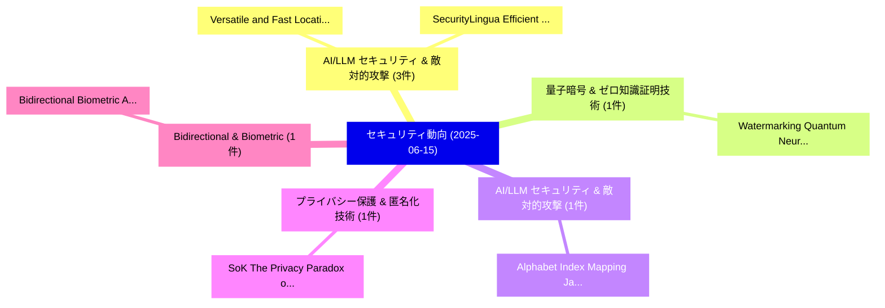

# 📅 02_daily: 日次エグゼクティブサマリー報告書 (2025-06-15)

**集計日時**: 2026-10-02 23:05:30 UTC  
**対象日付**: 2025-06-15  
**本日収集論文数**: 14 件  

---

## 💡 主要セキュリティ動向・脅威インサイト (Executive Insights)

本日の収集論文（計 14 件）において、以下の重点セキュリティ領域で活発な研究動向が確認されました：
- **AI/LLM セキュリティ & 敵対的攻撃** (3 件): 注目論文として 「SecurityLingua: Efficient Defe...」、「Versatile and Fast Location-Ba...」 等が発表され、実務防御および攻撃検証の進展が見られます。
- **量子暗号 & ゼロ知識証明技術** (1 件): 注目論文として 「Watermarking Quantum Neural Ne...」 等が発表され、実務防御および攻撃検証の進展が見られます。
- **AI/LLM セキュリティ & 敵対的攻撃** (1 件): 注目論文として 「Alphabet Index Mapping: Jailbr...」 等が発表され、実務防御および攻撃検証の進展が見られます。
- **プライバシー保護 & 匿名化技術** (1 件): 注目論文として 「SoK: The Privacy Paradox of 大規...」 等が発表され、実務防御および攻撃検証の進展が見られます。
- **Bidirectional & Biometric** (1 件): 注目論文として 「Bidirectional Biometric Authen...」 等が発表され、実務防御および攻撃検証の進展が見られます。

### 🗺️ 技術・脅威トピックマインドマップ

---

## 📌 日次セキュリティ論文一覧 (日本語表形式)

| No | arXiv ID | 論文タイトル (日本語訳) | 重要キーワード | 構造化エグゼクティブ要約 (背景・提案・影響) | 脅威分類 | 詳細リンク |
|---|---|---|---|---|---|---|
| 1 | `2506.12675v1` | [Watermarking Quantum Neural Networks Based on Sample Grouped and Paired Training（セキュリティ分析論文）](../../okf/papers/2025-06-15/2506.12675.md) | `Watermarking Quantum Neural Networks Based`, `Sample Grouped`, `Paired Training` | 【提案】概要 (Overview & Key Finding) 本論文「Watermarking 量子 Neural Networks Based on Sample Grouped...。実証評価により経営層・セキュリティ管理者向け推奨アクション (E... | `cs.CR` | [arXiv](https://arxiv.org/abs/2506.12675v1) &#124; [OKF](../../okf/papers/2025-06-15/2506.12675.md) |
| 2 | `2506.12685v1` | [Alphabet Index Mapping: Jailbreaking LLMs through Semantic Dissimilarity（セキュリティ分析論文）](../../okf/papers/2025-06-15/2506.12685.md) | `Alphabet Index Mapping`, `Semantic Dissimilarity`, `Bilal Saleh Husain` | 【提案】概要 (Overview & Key Finding) 本論文「Alphabet Index Mapping: ジェイルブレイクing LLMs through Semant...。実証評価により経営層・セキュリティ管理者向け推奨アクション (E... | `cs.CR` | [arXiv](https://arxiv.org/abs/2506.12685v1) &#124; [OKF](../../okf/papers/2025-06-15/2506.12685.md) |
| 3 | `2506.12699v2` | [SoK: The Privacy Paradox of 大規模言語モデル: Advancements, Privacy Risks, and Mitigation](../../okf/papers/2025-06-15/2506.12699.md) | `Privacy Risks`, `Large Language Models`, `Yashothara Shanmugarasa` | 【提案】概要 (Overview & Key Finding) 本論文「SoK: The Privacy Paradox of 大規模言語モデル: Advancements, Pri...。実証評価により経営層・セキュリティ管理者向け推奨アクション (E... | `cs.CR` | [arXiv](https://arxiv.org/abs/2506.12699v2) &#124; [OKF](../../okf/papers/2025-06-15/2506.12699.md) |
| 4 | `2506.12707v1` | [SecurityLingua: Efficient Defense of LLM Jailbreak Attacks via Security-Aware Prompt Compression（セキュリティ分析論文）](../../okf/papers/2025-06-15/2506.12707.md) | `Aware Prompt Compression`, `Efficient Defense`, `Jailbreak Attacks` | 【提案】概要 (Overview & Key Finding) 本論文「SecurityLingua: Efficient Defense of LLM ジェイルブレイク Attac...。実証評価により経営層・セキュリティ管理者向け推奨アクション (E... | `cs.CR` | [arXiv](https://arxiv.org/abs/2506.12707v1) &#124; [OKF](../../okf/papers/2025-06-15/2506.12707.md) |
| 5 | `2506.12761v1` | [Versatile and Fast Location-Based Private Information Retrieval with Fully Homomorphic Encryption over the Torus（セキュリティ分析論文）](../../okf/papers/2025-06-15/2506.12761.md) | `Based Private Information Retrieval`, `Fully Homomorphic Encryption`, `Fast Location` | 【提案】概要 (Overview & Key Finding) 本論文「Versatile and Fast Location-Based Private Information R...。実証評価により経営層・セキュリティ管理者向け推奨アクション (E... | `cs.CR` | [arXiv](https://arxiv.org/abs/2506.12761v1) &#124; [OKF](../../okf/papers/2025-06-15/2506.12761.md) |
| 6 | `2506.12802v1` | [Bidirectional Biometric Authentication Using Transciphering and (T)FHE（セキュリティ分析論文）](../../okf/papers/2025-06-15/2506.12802.md) | `Bidirectional Biometric Authentication Using Transciphering`, `Joon Soo Yoo`, `Tae Min Ahn` | 【提案】概要 (Overview & Key Finding) 本論文「Bidirectional Biometric Authentication Using Transciphe...。実証評価により経営層・セキュリティ管理者向け推奨アクション (E... | `cs.CR` | [arXiv](https://arxiv.org/abs/2506.12802v1) &#124; [OKF](../../okf/papers/2025-06-15/2506.12802.md) |
| 7 | `2506.12846v10` | [VFEFL: Privacy-Preserving 連合学習 against Malicious Clients via Verifiable Functional Encryption](../../okf/papers/2025-06-15/2506.12846.md) | `Verifiable Functional Encryption`, `Malicious Clients`, `Preserving Federated Learning` | 【提案】概要 (Overview & Key Finding) 本論文「VFEFL: Privacy-Preserving 連合学習 against Malicious Client...。実証評価により経営層・セキュリティ管理者向け推奨アクション (E... | `cs.CR` | [arXiv](https://arxiv.org/abs/2506.12846v10) &#124; [OKF](../../okf/papers/2025-06-15/2506.12846.md) |
| 8 | `2506.12880v2` | [Universal Jailbreak Suffixes Are Strong Attention Hijackers（セキュリティ分析論文）](../../okf/papers/2025-06-15/2506.12880.md) | `Matan Ben`, `Mor Geva`, `Mahmood Sharif` | 【提案】概要 (Overview & Key Finding) 本論文「Universal ジェイルブレイク Suffixes Are Strong Attention Hijack...。実証評価により経営層・セキュリティ管理者向け推奨アクション (E... | `cs.CR` | [arXiv](https://arxiv.org/abs/2506.12880v2) &#124; [OKF](../../okf/papers/2025-06-15/2506.12880.md) |
| 9 | `2506.12883v1` | [Cut Tracing with E-Graphs for Boolean FHE Circuit Synthesis（セキュリティ分析論文）](../../okf/papers/2025-06-15/2506.12883.md) | `Cut Tracing`, `Circuit Synthesis`, `Giovanni De Micheli` | 【提案】概要 (Overview & Key Finding) 本論文「Cut Tracing with E-Graphs for Boolean FHE Circuit Synth...。実証評価により経営層・セキュリティ管理者向け推奨アクション (E... | `cs.CR` | [arXiv](https://arxiv.org/abs/2506.12883v1) &#124; [OKF](../../okf/papers/2025-06-15/2506.12883.md) |
| 10 | `2506.12900v1` | [Self-Stabilizing Replicated State Machine Coping with Byzantine and Recurring Transient Faults（セキュリティ分析論文）](../../okf/papers/2025-06-15/2506.12900.md) | `Stabilizing Replicated State Machine Coping`, `Recurring Transient Faults`, `Self-Stabilizing Replicated` | 【提案】概要 (Overview & Key Finding) 本論文「Self-Stabilizing Replicated State Machine Coping with B...。実証評価により経営層・セキュリティ管理者向け推奨アクション (E... | `cs.CR` | [arXiv](https://arxiv.org/abs/2506.12900v1) &#124; [OKF](../../okf/papers/2025-06-15/2506.12900.md) |
| 11 | `2506.12947v1` | [PuDHammer: Experimental Read Disturbance Effects of Processing-using-DRAM in Real DRAM Chipsの分析](../../okf/papers/2025-06-15/2506.12947.md) | `Read Disturbance Effects`, `Ismail Emir Yuksel`, `Akash Sood` | 【提案】概要 (Overview & Key Finding) 本論文「PuDHammer: Experimental Read Disturbance Effects of Pro...。実証評価により経営層・セキュリティ管理者向け推奨アクション (E... | `cs.CR` | [arXiv](https://arxiv.org/abs/2506.12947v1) &#124; [OKF](../../okf/papers/2025-06-15/2506.12947.md) |
| 12 | `2506.12994v2` | [Differentially Private Bilevel Optimization: Efficient Algorithms with Near-Optimal Rates（セキュリティ分析論文）](../../okf/papers/2025-06-15/2506.12994.md) | `Differentially Private Bilevel Optimization`, `Efficient Algorithms`, `Optimal Rates` | 【提案】概要 (Overview & Key Finding) 本論文「Differentially Private Bilevel Optimization: Efficient ...。実証評価により経営層・セキュリティ管理者向け推奨アクション (E... | `cs.CR` | [arXiv](https://arxiv.org/abs/2506.12994v2) &#124; [OKF](../../okf/papers/2025-06-15/2506.12994.md) |
| 13 | `2506.12995v1` | [Open Source, Open Threats? Investigating Security Challenges in Open-Source Software（セキュリティ分析論文）](../../okf/papers/2025-06-15/2506.12995.md) | `Investigating Security Challenges`, `Open Source`, `Open Threats` | 【提案】Investigating Security Challenges in Open-Source Software ### (日本語題名: Open Source, Open...。実証評価により経営層・セキュリティ管理者向け推奨アクション (E... | `cs.CR` | [arXiv](https://arxiv.org/abs/2506.12995v1) &#124; [OKF](../../okf/papers/2025-06-15/2506.12995.md) |
| 14 | `2506.15734v1` | [The Safety Reminder: A Soft Prompt to Reactivate Delayed Safety Awareness in Vision-Language Models（セキュリティ分析論文）](../../okf/papers/2025-06-15/2506.15734.md) | `Reactivate Delayed Safety Awareness`, `Soft Prompt`, `Language Models` | 【提案】概要 (Overview & Key Finding) 本論文「The Safety Reminder: A Soft Prompt to Reactivate Delaye...。実証評価により経営層・セキュリティ管理者向け推奨アクション (E... | `cs.CR` | [arXiv](https://arxiv.org/abs/2506.15734v1) &#124; [OKF](../../okf/papers/2025-06-15/2506.15734.md) |

