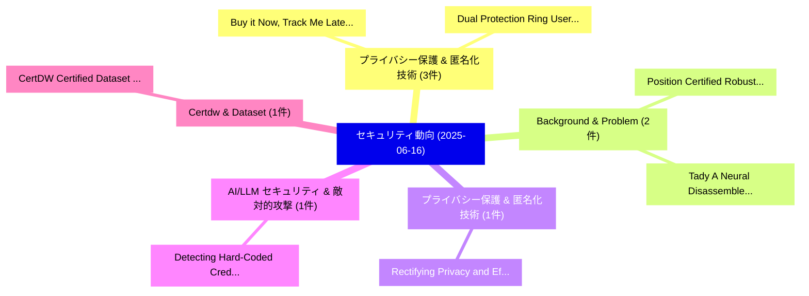

# 📅 02_daily: 日次エグゼクティブサマリー報告書 (2025-06-16)

**集計日時**: 2026-10-02 23:05:30 UTC  
**対象日付**: 2025-06-16  
**本日収集論文数**: 25 件  

---

## 💡 主要セキュリティ動向・脅威インサイト (Executive Insights)

本日の収集論文（計 25 件）において、以下の重点セキュリティ領域で活発な研究動向が確認されました：
- **プライバシー保護 & 匿名化技術** (3 件): 注目論文として 「Buy it Now, Track Me Later: At...」、「Dual Protection Ring: User Pro...」 等が発表され、実務防御および攻撃検証の進展が見られます。
- **Background & Problem** (2 件): 注目論文として 「Position: Certified Robustness...」、「Tady: A Neural Disassembler wi...」 等が発表され、実務防御および攻撃検証の進展が見られます。
- **プライバシー保護 & 匿名化技術** (1 件): 注目論文として 「Rectifying Privacy and Efficac...」 等が発表され、実務防御および攻撃検証の進展が見られます。
- **AI/LLM セキュリティ & 敵対的攻撃** (1 件): 注目論文として 「Detecting Hard-Coded Credentia...」 等が発表され、実務防御および攻撃検証の進展が見られます。
- **Certdw & Dataset** (1 件): 注目論文として 「CertDW: Certified Dataset Owne...」 等が発表され、実務防御および攻撃検証の進展が見られます。

### 🗺️ 技術・脅威トピックマインドマップ

---

## 📌 日次セキュリティ論文一覧 (日本語表形式)

| No | arXiv ID | 論文タイトル (日本語訳) | 重要キーワード | 構造化エグゼクティブ要約 (背景・提案・影響) | 脅威分類 | 詳細リンク |
|---|---|---|---|---|---|---|
| 1 | `2506.13009v1` | [Rectifying Privacy and Efficacy Measurements in Machine Unlearning: A New Inference Attack Perspective（セキュリティ分析論文）](../../okf/papers/2025-06-16/2506.13009.md) | `New Inference Attack Perspective`, `Rectifying Privacy`, `Efficacy Measurements` | 【提案】概要 (Overview & Key Finding) 本論文「Rectifying Privacy and Efficacy Measurements in Machine...。実証評価により経営層・セキュリティ管理者向け推奨アクション (E... | `cs.CR` | [arXiv](https://arxiv.org/abs/2506.13009v1) &#124; [OKF](../../okf/papers/2025-06-16/2506.13009.md) |
| 2 | `2506.13024v2` | [Position: Certified Robustness Does Not (Yet) Imply Model Security（セキュリティ分析論文）](../../okf/papers/2025-06-16/2506.13024.md) | `Imply Model Security`, `Paul Montague`, `Raw Meta` | 【提案】背景とセキュリティ上の課題 (Background & Problem) 本研究はサイバー脅威環境におけるセキュリティ構造・脆弱性の検証を目的としています。(主要検出項目: ...。実証評価によりErfani, Benjami。 | `cs.CR` | [arXiv](https://arxiv.org/abs/2506.13024v2) &#124; [OKF](../../okf/papers/2025-06-16/2506.13024.md) |
| 3 | `2506.13052v2` | [Buy it Now, Track Me Later: Attacking User Privacy via Wi-Fi AP Online Auctions（セキュリティ分析論文）](../../okf/papers/2025-06-16/2506.13052.md) | `Attacking User Privacy`, `Online Auctions`, `Wi-Fi AP` | 【提案】概要 (Overview & Key Finding) 本論文「Buy it Now, Track Me Later: Attacking User Privacy via ...。実証評価により経営層・セキュリティ管理者向け推奨アクション (E... | `cs.CR` | [arXiv](https://arxiv.org/abs/2506.13052v2) &#124; [OKF](../../okf/papers/2025-06-16/2506.13052.md) |
| 4 | `2506.13090v1` | [Detecting Hard-Coded Credentials in Software Repositories via LLMs（セキュリティ分析論文）](../../okf/papers/2025-06-16/2506.13090.md) | `Detecting Hard`, `Coded Credentials`, `Software Repositories` | 【提案】概要 (Overview & Key Finding) 本論文「Detecting Hard-Coded Credentials in Software Repositori...。実証評価により経営層・セキュリティ管理者向け推奨アクション (E... | `cs.CR` | [arXiv](https://arxiv.org/abs/2506.13090v1) &#124; [OKF](../../okf/papers/2025-06-16/2506.13090.md) |
| 5 | `2506.13160v1` | [CertDW: Certified Dataset Ownership Verification via Conformal Predictionに向けて](../../okf/papers/2025-06-16/2506.13160.md) | `Towards Certified Dataset Ownership Verification`, `Certified Dataset Ownership Verification`, `Conformal Prediction` | 【提案】概要 (Overview & Key Finding) 本論文「CertDW: Certified Dataset Ownership Verification via Co...。実証評価により経営層・セキュリティ管理者向け推奨アクション (E... | `cs.CR` | [arXiv](https://arxiv.org/abs/2506.13160v1) &#124; [OKF](../../okf/papers/2025-06-16/2506.13160.md) |
| 6 | `2506.13161v1` | [Using LLMs for Security Advisory Investigations: How Far Are We?（セキュリティ分析論文）](../../okf/papers/2025-06-16/2506.13161.md) | `Security Advisory Investigations`, `Bayu Fedra Abdullah`, `Yusuf Sulistyo Nugroho` | 【提案】### (日本語題名: Using LLMs for Security Advisory Investigations: How Far Are We?（セキュリティ分析論文...。実証評価により経営層・セキュリティ管理者向け推奨アクション (E... | `cs.CR` | [arXiv](https://arxiv.org/abs/2506.13161v1) &#124; [OKF](../../okf/papers/2025-06-16/2506.13161.md) |
| 7 | `2506.13170v1` | [Dual Protection Ring: User Profiling Via Differential Privacy and Service Dissemination Through Private Information Retrieval（セキュリティ分析論文）](../../okf/papers/2025-06-16/2506.13170.md) | `User Profiling Via Differential Privacy`, `Dual Protection Ring`, `Tariq Ahamed Ahangar` | 【提案】概要 (Overview & Key Finding) 本論文「Dual Protection Ring: User Profiling Via 差分プライバシー and S...。実証評価により経営層・セキュリティ管理者向け推奨アクション (E... | `cs.CR` | [arXiv](https://arxiv.org/abs/2506.13170v1) &#124; [OKF](../../okf/papers/2025-06-16/2506.13170.md) |
| 8 | `2506.13205v6` | [Poison Once, Control Anywhere: Clean-Text Visual Backdoors in VLM-based Mobile Agents（セキュリティ分析論文）](../../okf/papers/2025-06-16/2506.13205.md) | `Text Visual Backdoors`, `Control Anywhere`, `Mobile Agents` | 【提案】概要 (Overview & Key Finding) 本論文「Poison Once, Control Anywhere: Clean-Text Visual Backdo...。実証評価により経営層・セキュリティ管理者向け推奨アクション (E... | `cs.CR` | [arXiv](https://arxiv.org/abs/2506.13205v6) &#124; [OKF](../../okf/papers/2025-06-16/2506.13205.md) |
| 9 | `2506.13246v1` | [On Immutable Memory Systems for Artificial Agents: A Blockchain-Indexed Automata-Theoretic Framework Using ECDH-Keyed Merkle Chains（セキュリティ分析論文）](../../okf/papers/2025-06-16/2506.13246.md) | `Keyed Merkle Chains`, `Artificial Agents`, `Indexed Automata` | 【提案】概要 (Overview & Key Finding) 本論文「On Immutable Memory Systems for Artificial Agents: A Bl...。実証評価により経営層・セキュリティ管理者向け推奨アクション (E... | `cs.CR` | [arXiv](https://arxiv.org/abs/2506.13246v1) &#124; [OKF](../../okf/papers/2025-06-16/2506.13246.md) |
| 10 | `2506.13261v1` | [Building Automotive Security on Internet Standards: An Integration of DNSSEC, DANE, and DANCE to Authenticate and Authorize In-Car Services（セキュリティ分析論文）](../../okf/papers/2025-06-16/2506.13261.md) | `Building Automotive Security`, `Internet Standards`, `Car Services` | 【提案】概要 (Overview & Key Finding) 本論文「Building Automotive Security on Internet Standards: An ...。実証評価により経営層・セキュリティ管理者向け推奨アクション (E... | `cs.CR` | [arXiv](https://arxiv.org/abs/2506.13261v1) &#124; [OKF](../../okf/papers/2025-06-16/2506.13261.md) |
| 11 | `2506.13323v1` | [Tady: A Neural Disassembler without Structural Constraint Violations（セキュリティ分析論文）](../../okf/papers/2025-06-16/2506.13323.md) | `Structural Constraint Violations`, `Neural Disassembler`, `Siliang Qin` | 【提案】背景とセキュリティ上の課題 (Background & Problem) 本研究はサイバー脅威環境におけるセキュリティ構造・脆弱性の検証を目的としています。(主要検出項目: ...。実証評価により経営層・セキュリティ管理者向け推奨アクション (E... | `cs.CR` | [arXiv](https://arxiv.org/abs/2506.13323v1) &#124; [OKF](../../okf/papers/2025-06-16/2506.13323.md) |
| 12 | `2506.13360v1` | [The Rich Get Richer in Bitcoin Mining Induced by Blockchain Forks（セキュリティ分析論文）](../../okf/papers/2025-06-16/2506.13360.md) | `Bitcoin Mining Induced`, `Blockchain Forks`, `Akira Sakurai` | 【提案】概要 (Overview & Key Finding) 本論文「The Rich Get Richer in Bitcoin Mining Induced by Blockc...。実証評価により経営層・セキュリティ管理者向け推奨アクション (E... | `cs.CR` | [arXiv](https://arxiv.org/abs/2506.13360v1) &#124; [OKF](../../okf/papers/2025-06-16/2506.13360.md) |
| 13 | `2506.13418v1` | [New characterization of full weight spectrum one-orbit cyclic subspace codes（セキュリティ分析論文）](../../okf/papers/2025-06-16/2506.13418.md) | `one-orbit cyclic`, `Minjia Shi`, `Wenhao Song` | 【提案】概要 (Overview & Key Finding) 本論文「New characterization of full weight spectrum one-orbit ...。実証評価により経営層・セキュリティ管理者向け推奨アクション (E... | `cs.CR` | [arXiv](https://arxiv.org/abs/2506.13418v1) &#124; [OKF](../../okf/papers/2025-06-16/2506.13418.md) |
| 14 | `2506.13434v1` | [From Promise to Peril: Rethinking サイバーセキュリティ Red and Blue Teaming in the Age of LLMs](../../okf/papers/2025-06-16/2506.13434.md) | `Blue Teaming`, `Rethinking Cybersecurity Red`, `Alsharif Abuadbba` | 【提案】概要 (Overview & Key Finding) 本論文「From Promise to Peril: Rethinking サイバーセキュリティ Red and Bl...。実証評価により経営層・セキュリティ管理者向け推奨アクション (E... | `cs.CR` | [arXiv](https://arxiv.org/abs/2506.13434v1) &#124; [OKF](../../okf/papers/2025-06-16/2506.13434.md) |
| 15 | `2506.13494v1` | [Watermarking LLM-Generated Datasets in Downstream Tasks（セキュリティ分析論文）](../../okf/papers/2025-06-16/2506.13494.md) | `Generated Datasets`, `Downstream Tasks`, `LLM-Generated Datasets` | 【提案】概要 (Overview & Key Finding) 本論文「Watermarking LLM-Generated Datasets in Downstream Tasks...。実証評価により経営層・セキュリティ管理者向け推奨アクション (E... | `cs.CR` | [arXiv](https://arxiv.org/abs/2506.13494v1) &#124; [OKF](../../okf/papers/2025-06-16/2506.13494.md) |
| 16 | `2506.13563v1` | [Unlearning-Enhanced Website Fingerprinting Attack: Against Backdoor Poisoning in Anonymous Networks（セキュリティ分析論文）](../../okf/papers/2025-06-16/2506.13563.md) | `Enhanced Website Fingerprinting Attack`, `Anonymous Networks`, `Unlearning-Enhanced Website` | 【提案】概要 (Overview & Key Finding) 本論文「Unlearning-Enhanced Website Fingerprinting Attack: Agai...。実証評価により経営層・セキュリティ管理者向け推奨アクション (E... | `cs.CR` | [arXiv](https://arxiv.org/abs/2506.13563v1) &#124; [OKF](../../okf/papers/2025-06-16/2506.13563.md) |
| 17 | `2506.13590v1` | [Agent Capability Negotiation and Binding Protocol (ACNBP)（セキュリティ分析論文）](../../okf/papers/2025-06-16/2506.13590.md) | `Agent Capability Negotiation`, `Binding Protocol`, `Vineeth Sai Narajala` | 【提案】概要 (Overview & Key Finding) 本論文「Agent Capability Negotiation and Binding Protocol (ACNB...。実証評価により経営層・セキュリティ管理者向け推奨アクション (E... | `cs.CR` | [arXiv](https://arxiv.org/abs/2506.13590v1) &#124; [OKF](../../okf/papers/2025-06-16/2506.13590.md) |
| 18 | `2506.13612v1` | [EBS-CFL: Efficient and Byzantine-robust Secure Clustered 連合学習](../../okf/papers/2025-06-16/2506.13612.md) | `Byzantine-robust Secure`, `Secure Clustered Federated Learning`, `Secure Clustered` | 【提案】概要 (Overview & Key Finding) 本論文「EBS-CFL: Efficient and Byzantine-robust Secure Clustere...。実証評価により経営層・セキュリティ管理者向け推奨アクション (E... | `cs.CR` | [arXiv](https://arxiv.org/abs/2506.13612v1) &#124; [OKF](../../okf/papers/2025-06-16/2506.13612.md) |
| 19 | `2506.13726v1` | [Weakest Link in the Chain: Security Vulnerabilities in Advanced Reasoning Models（セキュリティ分析論文）](../../okf/papers/2025-06-16/2506.13726.md) | `Advanced Reasoning Models`, `Weakest Link`, `Security Vulnerabilities` | 【提案】概要 (Overview & Key Finding) 本論文「Weakest Link in the Chain: Security Vulnerabilities in ...。実証評価により経営層・セキュリティ管理者向け推奨アクション (E... | `cs.CR` | [arXiv](https://arxiv.org/abs/2506.13726v1) &#124; [OKF](../../okf/papers/2025-06-16/2506.13726.md) |
| 20 | `2506.13737v2` | [ExtendAttack: Attacking Servers of LRMs via Extending Reasoning（セキュリティ分析論文）](../../okf/papers/2025-06-16/2506.13737.md) | `Attacking Servers`, `Extending Reasoning`, `Zhenhao Zhu` | 【提案】概要 (Overview & Key Finding) 本論文「ExtendAttack: Attacking Servers of LRMs via Extending R...。実証評価により経営層・セキュリティ管理者向け推奨アクション (E... | `cs.CR` | [arXiv](https://arxiv.org/abs/2506.13737v2) &#124; [OKF](../../okf/papers/2025-06-16/2506.13737.md) |
| 21 | `2506.13746v1` | [Evaluating 大規模言語モデル for Phishing Detection, Self-Consistency, Faithfulness, and Explainability](../../okf/papers/2025-06-16/2506.13746.md) | `Phishing Detection`, `Evaluating Large Language Models`, `Shova Kuikel` | 【提案】概要 (Overview & Key Finding) 本論文「Evaluating 大規模言語モデル for Phishing Detection, Self-Consis...。実証評価により経営層・セキュリティ管理者向け推奨アクション (E... | `cs.CR` | [arXiv](https://arxiv.org/abs/2506.13746v1) &#124; [OKF](../../okf/papers/2025-06-16/2506.13746.md) |
| 22 | `2506.13895v1` | [A Dual-Layer Image Encryption Framework Using Chaotic AES with Dynamic S-Boxes and Steganographic QR Codes（セキュリティ分析論文）](../../okf/papers/2025-06-16/2506.13895.md) | `Dual-Layer Image`, `Md Rishadul Bayesh`, `Dabbrata Das` | 【提案】概要 (Overview & Key Finding) 本論文「A Dual-Layer Image Encryption Framework Using Chaotic A...。実証評価により経営層・セキュリティ管理者向け推奨アクション (E... | `cs.CR` | [arXiv](https://arxiv.org/abs/2506.13895v1) &#124; [OKF](../../okf/papers/2025-06-16/2506.13895.md) |
| 23 | `2506.13955v1` | [Bridging Unsupervised and Semi-Supervised Anomaly Detection: A Theoretically-Grounded and Practical Framework with Synthetic Anomalies（セキュリティ分析論文）](../../okf/papers/2025-06-16/2506.13955.md) | `Supervised Anomaly Detection`, `Bridging Unsupervised`, `Synthetic Anomalies` | 【提案】概要 (Overview & Key Finding) 本論文「Bridging Unsupervised and Semi-Supervised Anomaly Detec...。実証評価により経営層・セキュリティ管理者向け推奨アクション (E... | `cs.CR` | [arXiv](https://arxiv.org/abs/2506.13955v1) &#124; [OKF](../../okf/papers/2025-06-16/2506.13955.md) |
| 24 | `2506.14057v1` | [SoK: Advances and Open Problems in Web Tracking（セキュリティ分析論文）](../../okf/papers/2025-06-16/2506.14057.md) | `Open Problems`, `Web Tracking`, `Yash Vekaria` | 【提案】概要 (Overview & Key Finding) 本論文「SoK: Advances and Open Problems in Web Tracking（セキュリティ分...。実証評価により経営層・セキュリティ管理者向け推奨アクション (E... | `cs.CR` | [arXiv](https://arxiv.org/abs/2506.14057v1) &#124; [OKF](../../okf/papers/2025-06-16/2506.14057.md) |
| 25 | `2506.17292v2` | [Theoretically Unmasking Inference Attacks Against LDP-Protected Clients in Federated Vision Models（セキュリティ分析論文）](../../okf/papers/2025-06-16/2506.17292.md) | `Federated Vision Models`, `Protected Clients`, `LDP-Protected Clients` | 【提案】概要 (Overview & Key Finding) 本論文「Theoretically Unmasking Inference Attacks Against LDP-P...。実証評価により経営層・セキュリティ管理者向け推奨アクション (E... | `cs.CR` | [arXiv](https://arxiv.org/abs/2506.17292v2) &#124; [OKF](../../okf/papers/2025-06-16/2506.17292.md) |

