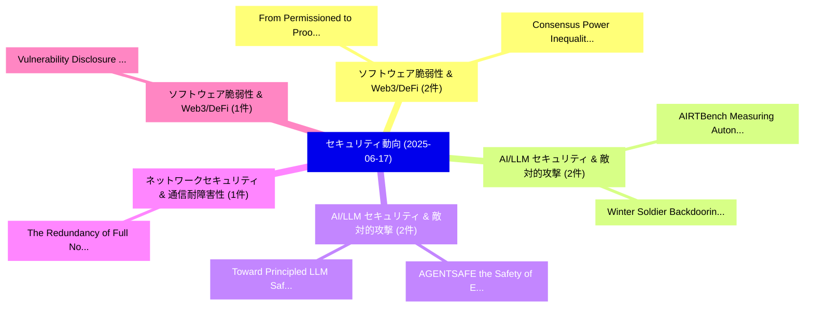

# 📅 02_daily: 日次エグゼクティブサマリー報告書 (2025-06-17)

**集計日時**: 2026-10-02 23:05:30 UTC  
**対象日付**: 2025-06-17  
**本日収集論文数**: 25 件  

---

## 💡 主要セキュリティ動向・脅威インサイト (Executive Insights)

本日の収集論文（計 25 件）において、以下の重点セキュリティ領域で活発な研究動向が確認されました：
- **ソフトウェア脆弱性 & Web3/DeFi** (2 件): 注目論文として 「From Permissioned to Proof-of-...」、「Consensus Power Inequality: A ...」 等が発表され、実務防御および攻撃検証の進展が見られます。
- **AI/LLM セキュリティ & 敵対的攻撃** (2 件): 注目論文として 「AIRTBench: Measuring Autonomou...」、「Winter Soldier: Backdooring La...」 等が発表され、実務防御および攻撃検証の進展が見られます。
- **AI/LLM セキュリティ & 敵対的攻撃** (2 件): 注目論文として 「AGENTSAFE: the Safety of Embod...」、「Toward Principled LLM Safety T...」 等が発表され、実務防御および攻撃検証の進展が見られます。
- **ネットワークセキュリティ & 通信耐障害性** (1 件): 注目論文として 「The Redundancy of Full Nodes i...」 等が発表され、実務防御および攻撃検証の進展が見られます。
- **ソフトウェア脆弱性 & Web3/DeFi** (1 件): 注目論文として 「Vulnerability Disclosure or No...」 等が発表され、実務防御および攻撃検証の進展が見られます。

### 🗺️ 技術・脅威トピックマインドマップ

---

## 📌 日次セキュリティ論文一覧 (日本語表形式)

| No | arXiv ID | 論文タイトル (日本語訳) | 重要キーワード | 構造化エグゼクティブ要約 (背景・提案・影響) | 脅威分類 | 詳細リンク |
|---|---|---|---|---|---|---|
| 1 | `2506.14124v2` | [From Permissioned to Proof-of-Stake Consensus（セキュリティ分析論文）](../../okf/papers/2025-06-17/2506.14124.md) | `Stake Consensus`, `Ertem Nusret Tas`, `Jovan Komatovic` | 【提案】概要 (Overview & Key Finding) 本論文「From Permissioned to Proof-of-Stake Consensus（セキュリティ分析論...。実証評価により経営層・セキュリティ管理者向け推奨アクション (E... | `cs.CR` | [arXiv](https://arxiv.org/abs/2506.14124v2) &#124; [OKF](../../okf/papers/2025-06-17/2506.14124.md) |
| 2 | `2506.14197v1` | [The Redundancy of Full Nodes in Bitcoin: A Network-Theoretic Demonstration of Miner-Centric Propagation Topologies（セキュリティ分析論文）](../../okf/papers/2025-06-17/2506.14197.md) | `Centric Propagation Topologies`, `Full Nodes`, `Theoretic Demonstration` | 【提案】概要 (Overview & Key Finding) 本論文「The Redundancy of Full Nodes in Bitcoin: A Network-Theo...。実証評価により経営層・セキュリティ管理者向け推奨アクション (E... | `cs.CR` | [arXiv](https://arxiv.org/abs/2506.14197v1) &#124; [OKF](../../okf/papers/2025-06-17/2506.14197.md) |
| 3 | `2506.14323v2` | [Vulnerability Disclosure or Notification? Best Practices for Reaching Stakeholders at Scale（セキュリティ分析論文）](../../okf/papers/2025-06-17/2506.14323.md) | `Vulnerability Disclosure`, `Best Practices`, `Reaching Stakeholders` | 【提案】Best Practices for Reaching Stakeholders at Scale ### (日本語題名: 脆弱性 Disclosure or Notific...。実証評価により経営層・セキュリティ管理者向け推奨アクション (E... | `cs.CR` | [arXiv](https://arxiv.org/abs/2506.14323v2) &#124; [OKF](../../okf/papers/2025-06-17/2506.14323.md) |
| 4 | `2506.14337v1` | [LLM-Powered Intent-Based Categorization of Phishing Emails（セキュリティ分析論文）](../../okf/papers/2025-06-17/2506.14337.md) | `Powered Intent`, `Based Categorization`, `Phishing Emails` | 【提案】概要 (Overview & Key Finding) 本論文「LLM-Powered Intent-Based Categorization of Phishing Ema...。実証評価により経営層・セキュリティ管理者向け推奨アクション (E... | `cs.CR` | [arXiv](https://arxiv.org/abs/2506.14337v1) &#124; [OKF](../../okf/papers/2025-06-17/2506.14337.md) |
| 5 | `2506.14340v1` | [Quantum Enhanced Entropy Pool for Cryptographic Applications and Proofs（セキュリティ分析論文）](../../okf/papers/2025-06-17/2506.14340.md) | `Quantum Enhanced Entropy Pool`, `Cryptographic Applications`, `Buniechukwu Njoku` | 【提案】概要 (Overview & Key Finding) 本論文「量子 Enhanced Entropy Pool for Cryptographic Applications...。実証評価により経営層・セキュリティ管理者向け推奨アクション (E... | `cs.CR` | [arXiv](https://arxiv.org/abs/2506.14340v1) &#124; [OKF](../../okf/papers/2025-06-17/2506.14340.md) |
| 6 | `2506.14374v1` | [Excessive Reasoning Attack on Reasoning LLMs（セキュリティ分析論文）](../../okf/papers/2025-06-17/2506.14374.md) | `Excessive Reasoning Attack`, `Wai Man Si`, `Mingjie Li` | 【提案】概要 (Overview & Key Finding) 本論文「Excessive Reasoning Attack on Reasoning LLMs（セキュリティ分析論文...。実証評価により経営層・セキュリティ管理者向け推奨アクション (E... | `cs.CR` | [arXiv](https://arxiv.org/abs/2506.14374v1) &#124; [OKF](../../okf/papers/2025-06-17/2506.14374.md) |
| 7 | `2506.14393v1` | [Consensus Power Inequality: A Comparative Study of Blockchain Networks（セキュリティ分析論文）](../../okf/papers/2025-06-17/2506.14393.md) | `Consensus Power Inequality`, `Blockchain Networks`, `Kamil Tylinski` | 【提案】概要 (Overview & Key Finding) 本論文「Consensus Power Inequality: A Comparative Study of Bloc...。実証評価により経営層・セキュリティ管理者向け推奨アクション (E... | `cs.CR` | [arXiv](https://arxiv.org/abs/2506.14393v1) &#124; [OKF](../../okf/papers/2025-06-17/2506.14393.md) |
| 8 | `2506.14466v1` | [MalGuard: Real-Time, Accurate, and Actionable Detection of Malicious Packages in PyPI Ecosystemに向けて](../../okf/papers/2025-06-17/2506.14466.md) | `Actionable Detection`, `Malicious Packages`, `Towards Real` | 【提案】概要 (Overview & Key Finding) 本論文「MalGuard: Real-Time, Accurate, and Actionable Detection...。実証評価により経営層・セキュリティ管理者向け推奨アクション (E... | `cs.CR` | [arXiv](https://arxiv.org/abs/2506.14466v1) &#124; [OKF](../../okf/papers/2025-06-17/2506.14466.md) |
| 9 | `2506.14474v2` | [LexiMark: Robust Watermarking via Lexical Substitutions to Enhance Membership Verification of an LLM's Textual Training Data（セキュリティ分析論文）](../../okf/papers/2025-06-17/2506.14474.md) | `Enhance Membership Verification`, `Textual Training Data`, `Robust Watermarking` | 【提案】概要 (Overview & Key Finding) 本論文「LexiMark: Robust Watermarking via Lexical Substitutions...。実証評価により経営層・セキュリティ管理者向け推奨アクション (E... | `cs.CR` | [arXiv](https://arxiv.org/abs/2506.14474v2) &#124; [OKF](../../okf/papers/2025-06-17/2506.14474.md) |
| 10 | `2506.14489v1` | [ReDASH: Fast and efficient Scaling in Arithmetic Garbled Circuits for Secure Outsourced Inference（セキュリティ分析論文）](../../okf/papers/2025-06-17/2506.14489.md) | `Arithmetic Garbled Circuits`, `Secure Outsourced Inference`, `Felix Maurer` | 【提案】概要 (Overview & Key Finding) 本論文「ReDASH: Fast and efficient Scaling in Arithmetic Garble...。実証評価により経営層・セキュリティ管理者向け推奨アクション (E... | `cs.CR` | [arXiv](https://arxiv.org/abs/2506.14489v1) &#124; [OKF](../../okf/papers/2025-06-17/2506.14489.md) |
| 11 | `2506.14493v3` | [LingoLoop Attack: Trapping MLLMs via Linguistic Context and State Entrapment into Endless Loops（セキュリティ分析論文）](../../okf/papers/2025-06-17/2506.14493.md) | `Linguistic Context`, `State Entrapment`, `Endless Loops` | 【提案】概要 (Overview & Key Finding) 本論文「LingoLoop Attack: Trapping MLLMs via Linguistic Context...。実証評価により経営層・セキュリティ管理者向け推奨アクション (E... | `cs.CR` | [arXiv](https://arxiv.org/abs/2506.14493v3) &#124; [OKF](../../okf/papers/2025-06-17/2506.14493.md) |
| 12 | `2506.14539v2` | [Doppelganger Method: Breaking Role Consistency in LLM Agent via Prompt-based Transferable Adversarial Attack（セキュリティ分析論文）](../../okf/papers/2025-06-17/2506.14539.md) | `Breaking Role Consistency`, `Transferable Adversarial Attack`, `Prompt-based Transferable` | 【提案】概要 (Overview & Key Finding) 本論文「Doppelganger Method: Breaking Role Consistency in LLM A...。実証評価により経営層・セキュリティ管理者向け推奨アクション (E... | `cs.CR` | [arXiv](https://arxiv.org/abs/2506.14539v2) &#124; [OKF](../../okf/papers/2025-06-17/2506.14539.md) |
| 13 | `2506.14566v1` | [Anonymous Authentication using Attribute-based Encryption（セキュリティ分析論文）](../../okf/papers/2025-06-17/2506.14566.md) | `Anonymous Authentication`, `Attribute-based Encryption`, `Nouha Oualha` | 【提案】概要 (Overview & Key Finding) 本論文「Anonymous Authentication using Attribute-based Encrypti...。実証評価により経営層・セキュリティ管理者向け推奨アクション (E... | `cs.CR` | [arXiv](https://arxiv.org/abs/2506.14566v1) &#124; [OKF](../../okf/papers/2025-06-17/2506.14566.md) |
| 14 | `2506.14576v1` | [SoK: Privacy-Enhancing Technologies in Artificial Intelligence（セキュリティ分析論文）](../../okf/papers/2025-06-17/2506.14576.md) | `Enhancing Technologies`, `Artificial Intelligence`, `Privacy-Enhancing Technologies` | 【提案】概要 (Overview & Key Finding) 本論文「SoK: Privacy-Enhancing Technologies in Artificial Intel...。実証評価により経営層・セキュリティ管理者向け推奨アクション (E... | `cs.CR` | [arXiv](https://arxiv.org/abs/2506.14576v1) &#124; [OKF](../../okf/papers/2025-06-17/2506.14576.md) |
| 15 | `2506.14582v1` | [Busting the Paper Ballot: Voting Meets Adversarial Machine Learning（セキュリティ分析論文）](../../okf/papers/2025-06-17/2506.14582.md) | `Voting Meets Adversarial Machine Learning`, `Voting Meets Adversarial Machine Le`, `Kaleel Mahmood` | 【提案】概要 (Overview & Key Finding) 本論文「Busting the Paper Ballot: Voting Meets Adversarial Mach...。実証評価により経営層・セキュリティ管理者向け推奨アクション (E... | `cs.CR` | [arXiv](https://arxiv.org/abs/2506.14582v1) &#124; [OKF](../../okf/papers/2025-06-17/2506.14582.md) |
| 16 | `2506.14682v1` | [AIRTBench: Measuring Autonomous AI Red Teaming Capabilities in Language Models（セキュリティ分析論文）](../../okf/papers/2025-06-17/2506.14682.md) | `Red Teaming Capabilities`, `Measuring Autonomous`, `Language Models` | 【提案】概要 (Overview & Key Finding) 本論文「AIRTBench: Measuring Autonomous AI Red Teaming Capabili...。実証評価により経営層・セキュリティ管理者向け推奨アクション (E... | `cs.CR` | [arXiv](https://arxiv.org/abs/2506.14682v1) &#124; [OKF](../../okf/papers/2025-06-17/2506.14682.md) |
| 17 | `2506.14697v3` | [AGENTSAFE: the Safety of Embodied Agents on Hazardous Instructionsのベンチマーク評価](../../okf/papers/2025-06-17/2506.14697.md) | `Embodied Agents`, `Hazardous Instructions`, `Zonghao Ying` | 【提案】概要 (Overview & Key Finding) 本論文「AGENTSAFE: the Safety of Embodied Agents on Hazardous I...。実証評価により経営層・セキュリティ管理者向け推奨アクション (E... | `cs.CR` | [arXiv](https://arxiv.org/abs/2506.14697v3) &#124; [OKF](../../okf/papers/2025-06-17/2506.14697.md) |
| 18 | `2506.14913v1` | [Winter Soldier: Backdooring Language Models at Pre-Training with Indirect Data Poisoning（セキュリティ分析論文）](../../okf/papers/2025-06-17/2506.14913.md) | `Backdooring Language Models`, `Indirect Data Poisoning`, `Winter Soldier` | 【提案】概要 (Overview & Key Finding) 本論文「Winter Soldier: Backdooring Language Models at Pre-Trai...。実証評価により経営層・セキュリティ管理者向け推奨アクション (E... | `cs.CR` | [arXiv](https://arxiv.org/abs/2506.14913v1) &#124; [OKF](../../okf/papers/2025-06-17/2506.14913.md) |
| 19 | `2506.14933v2` | [Explain First, Trust Later: LLM-Augmented Explanations for Graph-Based Crypto Anomaly Detection（セキュリティ分析論文）](../../okf/papers/2025-06-17/2506.14933.md) | `Based Crypto Anomaly Detection`, `Explain First`, `Trust Later` | 【提案】概要 (Overview & Key Finding) 本論文「Explain First, Trust Later: LLM-Augmented Explanations ...。実証評価により経営層・セキュリティ管理者向け推奨アクション (E... | `cs.CR` | [arXiv](https://arxiv.org/abs/2506.14933v2) &#124; [OKF](../../okf/papers/2025-06-17/2506.14933.md) |
| 20 | `2506.14937v1` | [Determinação Automática de Limiar de Detecção de Ataques em Redes de Computadores Utilizando Autoencoders（セキュリティ分析論文）](../../okf/papers/2025-06-17/2506.14937.md) | `Computadores Utilizando Autoencoders`, `Murilo Bellezoni Loiola`, `Pedro Ivo` | 【提案】概要 (Overview & Key Finding) 本論文「Determinação Automática de Limiar de Detecção de Ataque...。実証評価により経営層・セキュリティ管理者向け推奨アクション (E... | `cs.CR` | [arXiv](https://arxiv.org/abs/2506.14937v1) &#124; [OKF](../../okf/papers/2025-06-17/2506.14937.md) |
| 21 | `2506.14944v3` | [Plaintext-Scale Fair Data Exchange（セキュリティ分析論文）](../../okf/papers/2025-06-17/2506.14944.md) | `Scale Fair Data Exchange`, `Plaintext-Scale Fair`, `Majid Khabbazian` | 【提案】概要 (Overview & Key Finding) 本論文「Plaintext-Scale Fair Data Exchange（セキュリティ分析論文）」（原題: Pla...。実証評価により経営層・セキュリティ管理者向け推奨アクション (E... | `cs.CR` | [arXiv](https://arxiv.org/abs/2506.14944v3) &#124; [OKF](../../okf/papers/2025-06-17/2506.14944.md) |
| 22 | `2506.14964v1` | [Narrowing the Gap between TEEs Threat Model and Deployment Strategies（セキュリティ分析論文）](../../okf/papers/2025-06-17/2506.14964.md) | `Threat Model`, `Deployment Strategies`, `Filip Rezabek` | 【提案】概要 (Overview & Key Finding) 本論文「Narrowing the Gap between TEEs 脅威 Model and Deployment ...。実証評価により経営層・セキュリティ管理者向け推奨アクション (E... | `cs.CR` | [arXiv](https://arxiv.org/abs/2506.14964v1) &#124; [OKF](../../okf/papers/2025-06-17/2506.14964.md) |
| 23 | `2506.15018v2` | [Private Continual Counting of Unbounded Streams（セキュリティ分析論文）](../../okf/papers/2025-06-17/2506.15018.md) | `Private Continual Counting`, `Unbounded Streams`, `Ben Jacobsen` | 【提案】概要 (Overview & Key Finding) 本論文「Private Continual Counting of Unbounded Streams（セキュリティ分...。実証評価により経営層・セキュリティ管理者向け推奨アクション (E... | `cs.CR` | [arXiv](https://arxiv.org/abs/2506.15018v2) &#124; [OKF](../../okf/papers/2025-06-17/2506.15018.md) |
| 24 | `2506.15740v2` | [SHADE-Arena: Evaluating Sabotage and Monitoring in LLMエージェント](../../okf/papers/2025-06-17/2506.15740.md) | `Evaluating Sabotage`, `Chen Bo Calvin Zhang`, `Jonathan Kutasov` | 【提案】概要 (Overview & Key Finding) 本論文「SHADE-Arena: Evaluating Sabotage and Monitoring in LLMエ...。実証評価により経営層・セキュリティ管理者向け推奨アクション (E... | `cs.CR` | [arXiv](https://arxiv.org/abs/2506.15740v2) &#124; [OKF](../../okf/papers/2025-06-17/2506.15740.md) |
| 25 | `2506.17299v2` | [Toward Principled LLM Safety Testing: Solving the Jailbreak Oracle Problem（セキュリティ分析論文）](../../okf/papers/2025-06-17/2506.17299.md) | `Jailbreak Oracle Problem`, `Toward Principled`, `Safety Testing` | 【提案】概要 (Overview & Key Finding) 本論文「Toward Principled LLM Safety Testing: Solving the ジェイルブ...。実証評価により経営層・セキュリティ管理者向け推奨アクション (E... | `cs.CR` | [arXiv](https://arxiv.org/abs/2506.17299v2) &#124; [OKF](../../okf/papers/2025-06-17/2506.17299.md) |

