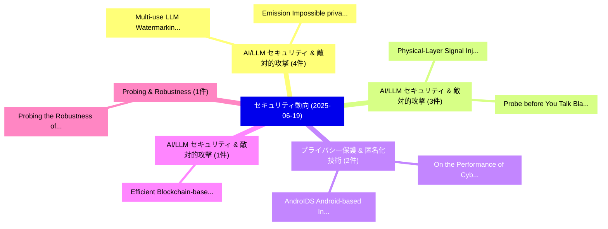

# 📅 02_daily: 日次エグゼクティブサマリー報告書 (2025-06-19)

**集計日時**: 2026-10-02 23:05:30 UTC  
**対象日付**: 2025-06-19  
**本日収集論文数**: 21 件  

---

## 💡 主要セキュリティ動向・脅威インサイト (Executive Insights)

本日の収集論文（計 21 件）において、以下の重点セキュリティ領域で活発な研究動向が確認されました：
- **AI/LLM セキュリティ & 敵対的攻撃** (4 件): 注目論文として 「Multi-use LLM Watermarking and...」、「Emission Impossible: privacy-p...」 等が発表され、実務防御および攻撃検証の進展が見られます。
- **AI/LLM セキュリティ & 敵対的攻撃** (3 件): 注目論文として 「Physical-Layer Signal Injectio...」、「Probe before You Talk: Black-b...」 等が発表され、実務防御および攻撃検証の進展が見られます。
- **プライバシー保護 & 匿名化技術** (2 件): 注目論文として 「On the Performance of Cyber-Bi...」、「AndroIDS : Android-based Intru...」 等が発表され、実務防御および攻撃検証の進展が見られます。
- **AI/LLM セキュリティ & 敵対的攻撃** (1 件): 注目論文として 「Efficient Blockchain-based Ste...」 等が発表され、実務防御および攻撃検証の進展が見られます。
- **Probing & Robustness** (1 件): 注目論文として 「Probing the Robustness of 大規模言...」 等が発表され、実務防御および攻撃検証の進展が見られます。

### 🗺️ 技術・脅威トピックマインドマップ

---

## 📌 日次セキュリティ論文一覧 (日本語表形式)

| No | arXiv ID | 論文タイトル (日本語訳) | 重要キーワード | 構造化エグゼクティブ要約 (背景・提案・影響) | 脅威分類 | 詳細リンク |
|---|---|---|---|---|---|---|
| 1 | `2506.15975v1` | [Multi-use LLM Watermarking and the False Detection Problem（セキュリティ分析論文）](../../okf/papers/2025-06-19/2506.15975.md) | `False Detection Problem`, `Multi-use LLM`, `Zihao Fu` | 【提案】概要 (Overview & Key Finding) 本論文「Multi-use LLM Watermarking and the False Detection Prob...。実証評価により経営層・セキュリティ管理者向け推奨アクション (E... | `cs.CR` | [arXiv](https://arxiv.org/abs/2506.15975v1) &#124; [OKF](../../okf/papers/2025-06-19/2506.15975.md) |
| 2 | `2506.16023v1` | [Efficient Blockchain-based Steganography via Backcalculating Generative Adversarial Network（セキュリティ分析論文）](../../okf/papers/2025-06-19/2506.16023.md) | `Backcalculating Generative Adversarial Network`, `Efficient Blockchain`, `Blockchain-based Steganography` | 【提案】概要 (Overview & Key Finding) 本論文「Efficient Blockchain-based Steganography via Backcalcul...。実証評価により経営層・セキュリティ管理者向け推奨アクション (E... | `cs.CR` | [arXiv](https://arxiv.org/abs/2506.16023v1) &#124; [OKF](../../okf/papers/2025-06-19/2506.16023.md) |
| 3 | `2506.16078v1` | [Probing the Robustness of 大規模言語モデル Safety to Latent Perturbations](../../okf/papers/2025-06-19/2506.16078.md) | `Latent Perturbations`, `Large Language Models Safety`, `Tianle Gu` | 【提案】概要 (Overview & Key Finding) 本論文「Probing the Robustness of 大規模言語モデル Safety to Latent Per...。実証評価により経営層・セキュリティ管理者向け推奨アクション (E... | `cs.CR` | [arXiv](https://arxiv.org/abs/2506.16078v1) &#124; [OKF](../../okf/papers/2025-06-19/2506.16078.md) |
| 4 | `2506.16150v4` | [PRISON: Unmasking the Criminal Potential of 大規模言語モデル](../../okf/papers/2025-06-19/2506.16150.md) | `Criminal Potential`, `Large Language Models`, `Xinyi Wu` | 【提案】概要 (Overview & Key Finding) 本論文「PRISON: Unmasking the Criminal Potential of 大規模言語モデル」（原...。実証評価により経営層・セキュリティ管理者向け推奨アクション (E... | `cs.CR` | [arXiv](https://arxiv.org/abs/2506.16150v4) &#124; [OKF](../../okf/papers/2025-06-19/2506.16150.md) |
| 5 | `2506.16224v3` | [Malware Classification Leveraging NLP & Machine Learning for Enhanced Accuracy（セキュリティ分析論文）](../../okf/papers/2025-06-19/2506.16224.md) | `Malware Classification Leveraging`, `Machine Learning`, `Enhanced Accuracy` | 【提案】概要 (Overview & Key Finding) 本論文「マルウェア Classification Leveraging NLP & Machine Learning ...。実証評価により経営層・セキュリティ管理者向け推奨アクション (E... | `cs.CR` | [arXiv](https://arxiv.org/abs/2506.16224v3) &#124; [OKF](../../okf/papers/2025-06-19/2506.16224.md) |
| 6 | `2506.16328v3` | [Sharpening Kubernetes Audit Logs with Context Awareness（セキュリティ分析論文）](../../okf/papers/2025-06-19/2506.16328.md) | `Sharpening Kubernetes Audit Logs`, `Context Awareness`, `Luis Augusto Dias Knob` | 【提案】概要 (Overview & Key Finding) 本論文「Sharpening Kubernetes Audit Logs with Context Awareness...。実証評価により経営層・セキュリティ管理者向け推奨アクション (E... | `cs.CR` | [arXiv](https://arxiv.org/abs/2506.16328v3) &#124; [OKF](../../okf/papers/2025-06-19/2506.16328.md) |
| 7 | `2506.16347v1` | [Emission Impossible: privacy-preserving carbon emissions claims（セキュリティ分析論文）](../../okf/papers/2025-06-19/2506.16347.md) | `Emission Impossible`, `privacy-preserving carbon`, `Jessica Man` | 【提案】概要 (Overview & Key Finding) 本論文「Emission Impossible: privacy-preserving carbon emission...。実証評価により経営層・セキュリティ管理者向け推奨アクション (E... | `cs.CR` | [arXiv](https://arxiv.org/abs/2506.16347v1) &#124; [OKF](../../okf/papers/2025-06-19/2506.16347.md) |
| 8 | `2506.16349v2` | [Watermarking Autoregressive Image Generation（セキュリティ分析論文）](../../okf/papers/2025-06-19/2506.16349.md) | `Watermarking Autoregressive Image Generation`, `Ismail Labiad`, `Martin Vechev` | 【提案】概要 (Overview & Key Finding) 本論文「Watermarking Autoregressive Image Generation（セキュリティ分析論文...。実証評価により経営層・セキュリティ管理者向け推奨アクション (E... | `cs.CR` | [arXiv](https://arxiv.org/abs/2506.16349v2) &#124; [OKF](../../okf/papers/2025-06-19/2506.16349.md) |
| 9 | `2506.16400v1` | [Physical-Layer Signal Injection Attacks on EV Charging Ports: Bypassing Authentication via Electrical-Level Exploits（セキュリティ分析論文）](../../okf/papers/2025-06-19/2506.16400.md) | `Layer Signal Injection Attacks`, `Charging Ports`, `Bypassing Authentication` | 【提案】概要 (Overview & Key Finding) 本論文「Physical-Layer Signal Injection Attacks on EV Charging ...。実証評価により経営層・セキュリティ管理者向け推奨アクション (E... | `cs.CR` | [arXiv](https://arxiv.org/abs/2506.16400v1) &#124; [OKF](../../okf/papers/2025-06-19/2506.16400.md) |
| 10 | `2506.16447v1` | [Probe before You Talk: Black-box Defense against Backdoor Unalignment for Large Language Modelsに向けて](../../okf/papers/2025-06-19/2506.16447.md) | `Backdoor Unalignment`, `Black-box Defense`, `Large Language Models` | 【提案】概要 (Overview & Key Finding) 本論文「Probe before You Talk: Black-box Defense against Backdo...。実証評価により経営層・セキュリティ管理者向け推奨アクション (E... | `cs.CR` | [arXiv](https://arxiv.org/abs/2506.16447v1) &#124; [OKF](../../okf/papers/2025-06-19/2506.16447.md) |
| 11 | `2506.16458v1` | [SecureFed: A Two-Phase Framework for Detecting Malicious Clients in 連合学習](../../okf/papers/2025-06-19/2506.16458.md) | `Detecting Malicious Clients`, `Federated Learning`, `Likhitha Annapurna Kavuri` | 【提案】概要 (Overview & Key Finding) 本論文「SecureFed: A Two-Phase Framework for Detecting Maliciou...。実証評価により経営層・セキュリティ管理者向け推奨アクション (E... | `cs.CR` | [arXiv](https://arxiv.org/abs/2506.16458v1) &#124; [OKF](../../okf/papers/2025-06-19/2506.16458.md) |
| 12 | `2506.16460v1` | [Black-Box Privacy Attacks on Shared Representations in Multitask Learning（セキュリティ分析論文）](../../okf/papers/2025-06-19/2506.16460.md) | `Box Privacy Attacks`, `Shared Representations`, `Multitask Learning` | 【提案】概要 (Overview & Key Finding) 本論文「Black-Box Privacy Attacks on Shared Representations in ...。実証評価により経営層・セキュリティ管理者向け推奨アクション (E... | `cs.CR` | [arXiv](https://arxiv.org/abs/2506.16460v1) &#124; [OKF](../../okf/papers/2025-06-19/2506.16460.md) |
| 13 | `2506.16497v1` | [Spotting tell-tale visual artifacts in face swapping videos: strengths and pitfalls of CNN detectors（セキュリティ分析論文）](../../okf/papers/2025-06-19/2506.16497.md) | `tell-tale visual`, `Riccardo Ziglio`, `Cecilia Pasquini` | 【提案】概要 (Overview & Key Finding) 本論文「Spotting tell-tale visual artifacts in face swapping vi...。実証評価により経営層・セキュリティ管理者向け推奨アクション (E... | `cs.CR` | [arXiv](https://arxiv.org/abs/2506.16497v1) &#124; [OKF](../../okf/papers/2025-06-19/2506.16497.md) |
| 14 | `2506.16545v2` | [SAFER-D: A Self-Adaptive Security Framework for Distributed Computing Architectures（セキュリティ分析論文）](../../okf/papers/2025-06-19/2506.16545.md) | `Distributed Computing Architectures`, `Self-Adaptive Security`, `Marco Stadler` | 【提案】概要 (Overview & Key Finding) 本論文「SAFER-D: A Self-Adaptive Security Framework for Distrib...。実証評価により経営層・セキュリティ管理者向け推奨アクション (E... | `cs.CR` | [arXiv](https://arxiv.org/abs/2506.16545v2) &#124; [OKF](../../okf/papers/2025-06-19/2506.16545.md) |
| 15 | `2506.16615v1` | [Centre driven Controlled Evolution of Wireless Virtual Networks based on Broadcast Tokens（セキュリティ分析論文）](../../okf/papers/2025-06-19/2506.16615.md) | `Wireless Virtual Networks`, `Controlled Evolution`, `Broadcast Tokens` | 【提案】概要 (Overview & Key Finding) 本論文「Centre driven Controlled Evolution of Wireless Virtual ...。実証評価により経営層・セキュリティ管理者向け推奨アクション (E... | `cs.CR` | [arXiv](https://arxiv.org/abs/2506.16615v1) &#124; [OKF](../../okf/papers/2025-06-19/2506.16615.md) |
| 16 | `2506.16626v1` | [Few-Shot Learning-Based Cyber Incident Detection with Augmented Context Intelligence（セキュリティ分析論文）](../../okf/papers/2025-06-19/2506.16626.md) | `Based Cyber Incident Detection`, `Augmented Context Intelligence`, `Shot Learning` | 【提案】概要 (Overview & Key Finding) 本論文「Few-Shot Learning-Based Cyber Incident Detection with A...。実証評価により経営層・セキュリティ管理者向け推奨アクション (E... | `cs.CR` | [arXiv](https://arxiv.org/abs/2506.16626v1) &#124; [OKF](../../okf/papers/2025-06-19/2506.16626.md) |
| 17 | `2506.16649v1` | [Automated Energy Billing with Blockchain and the Prophet Forecasting Model: A Holistic Approach（セキュリティ分析論文）](../../okf/papers/2025-06-19/2506.16649.md) | `Automated Energy Billing`, `Prophet Forecasting Model`, `Ajesh Thangaraj Nadar` | 【提案】概要 (Overview & Key Finding) 本論文「Automated Energy Billing with Blockchain and the Prophe...。実証評価により経営層・セキュリティ管理者向け推奨アクション (E... | `cs.CR` | [arXiv](https://arxiv.org/abs/2506.16649v1) &#124; [OKF](../../okf/papers/2025-06-19/2506.16649.md) |
| 18 | `2506.17329v1` | [On the Performance of Cyber-Biomedical Features for Intrusion Detection in Healthcare 5.0（セキュリティ分析論文）](../../okf/papers/2025-06-19/2506.17329.md) | `Biomedical Features`, `Intrusion Detection`, `Cyber-Biomedical Features` | 【提案】概要 (Overview & Key Finding) 本論文「On the Performance of Cyber-Biomedical Features for Int...。実証評価により経営層・セキュリティ管理者向け推奨アクション (E... | `cs.CR` | [arXiv](https://arxiv.org/abs/2506.17329v1) &#124; [OKF](../../okf/papers/2025-06-19/2506.17329.md) |
| 19 | `2506.17336v3` | [PPMI: Privacy-Preserving LLM Interaction with Socratic Chain-of-Thought Reasoning and Homomorphically Encrypted Vector Databases（セキュリティ分析論文）](../../okf/papers/2025-06-19/2506.17336.md) | `Homomorphically Encrypted Vector Databases`, `Socratic Chain`, `Thought Reasoning` | 【提案】概要 (Overview & Key Finding) 本論文「PPMI: Privacy-Preserving LLM Interaction with Socratic ...。実証評価により経営層・セキュリティ管理者向け推奨アクション (E... | `cs.CR` | [arXiv](https://arxiv.org/abs/2506.17336v3) &#124; [OKF](../../okf/papers/2025-06-19/2506.17336.md) |
| 20 | `2506.17349v1` | [AndroIDS : Android-based Intrusion Detection System using 連合学習](../../okf/papers/2025-06-19/2506.17349.md) | `Intrusion Detection System`, `Android-based Intrusion`, `Federated Learning` | 【提案】概要 (Overview & Key Finding) 本論文「AndroIDS : Android-based Intrusion Detection System usi...。実証評価により経営層・セキュリティ管理者向け推奨アクション (E... | `cs.CR` | [arXiv](https://arxiv.org/abs/2506.17349v1) &#124; [OKF](../../okf/papers/2025-06-19/2506.17349.md) |
| 21 | `2507.21085v1` | [Applications Of Zero-Knowledge Proofs On Bitcoin（セキュリティ分析論文）](../../okf/papers/2025-06-19/2507.21085.md) | `Zero-Knowledge Proofs`, `Raw Meta`, `Executive Summary` | 【提案】概要 (Overview & Key Finding) 本論文「Applications Of Zero-Knowledge Proofs On Bitcoin（セキュリティ...。実証評価により経営層・セキュリティ管理者向け推奨アクション (E... | `cs.CR` | [arXiv](https://arxiv.org/abs/2507.21085v1) &#124; [OKF](../../okf/papers/2025-06-19/2507.21085.md) |

