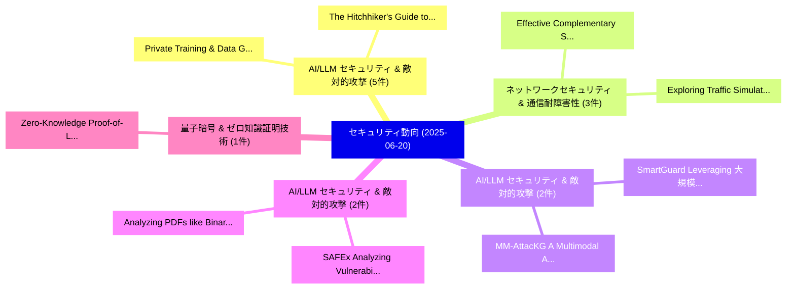

# 📅 02_daily: 日次エグゼクティブサマリー報告書 (2025-06-20)

**集計日時**: 2026-10-02 23:05:30 UTC  
**対象日付**: 2025-06-20  
**本日収集論文数**: 21 件  

---

## 💡 主要セキュリティ動向・脅威インサイト (Executive Insights)

本日の収集論文（計 21 件）において、以下の重点セキュリティ領域で活発な研究動向が確認されました：
- **AI/LLM セキュリティ & 敵対的攻撃** (5 件): 注目論文として 「Private Training & Data Genera...」、「The Hitchhiker's Guide to Effi...」 等が発表され、実務防御および攻撃検証の進展が見られます。
- **ネットワークセキュリティ & 通信耐障害性** (3 件): 注目論文として 「Exploring Traffic Simulation a...」、「Effective Complementary Securi...」 等が発表され、実務防御および攻撃検証の進展が見られます。
- **AI/LLM セキュリティ & 敵対的攻撃** (2 件): 注目論文として 「MM-AttacKG: A Multimodal Appro...」、「SmartGuard: Leveraging 大規模言語モデ...」 等が発表され、実務防御および攻撃検証の進展が見られます。
- **AI/LLM セキュリティ & 敵対的攻撃** (2 件): 注目論文として 「Analyzing PDFs like Binaries: ...」、「SAFEx: Analyzing Vulnerabiliti...」 等が発表され、実務防御および攻撃検証の進展が見られます。
- **量子暗号 & ゼロ知識証明技術** (1 件): 注目論文として 「Zero-Knowledge Proof-of-Locati...」 等が発表され、実務防御および攻撃検証の進展が見られます。

### 🗺️ 技術・脅威トピックマインドマップ

---

## 📌 日次セキュリティ論文一覧 (日本語表形式)

| No | arXiv ID | 論文タイトル (日本語訳) | 重要キーワード | 構造化エグゼクティブ要約 (背景・提案・影響) | 脅威分類 | 詳細リンク |
|---|---|---|---|---|---|---|
| 1 | `2506.16661v1` | [Private Training & Data Generation by Clustering Embeddings（セキュリティ分析論文）](../../okf/papers/2025-06-20/2506.16661.md) | `Private Training`, `Data Generation`, `Clustering Embeddings` | 【提案】概要 (Overview & Key Finding) 本論文「Private Training & Data Generation by Clustering Embedd...。実証評価により経営層・セキュリティ管理者向け推奨アクション (E... | `cs.CR` | [arXiv](https://arxiv.org/abs/2506.16661v1) &#124; [OKF](../../okf/papers/2025-06-20/2506.16661.md) |
| 2 | `2506.16666v3` | [The Hitchhiker's Guide to Efficient, End-to-End, and Tight DP Auditing（セキュリティ分析論文）](../../okf/papers/2025-06-20/2506.16666.md) | `Meenatchi Sundaram Muthu Selva Annamalai`, `Emiliano De Cristofaro`, `Borja Balle` | 【提案】概要 (Overview & Key Finding) 本論文「The Hitchhiker's Guide to Efficient, End-to-End, and Ti...。実証評価により経営層・セキュリティ管理者向け推奨アクション (E... | `cs.CR` | [arXiv](https://arxiv.org/abs/2506.16666v3) &#124; [OKF](../../okf/papers/2025-06-20/2506.16666.md) |
| 3 | `2506.16699v1` | [Exploring Traffic Simulation and Cybersecurity Strategies Using 大規模言語モデル](../../okf/papers/2025-06-20/2506.16699.md) | `Exploring Traffic Simulation`, `Cybersecurity Strategies Using Large Language Models`, `Cybersecurity Strategies Using` | 【提案】概要 (Overview & Key Finding) 本論文「Exploring Traffic Simulation and Cybersecurity Strategi...。実証評価により経営層・セキュリティ管理者向け推奨アクション (E... | `cs.CR` | [arXiv](https://arxiv.org/abs/2506.16699v1) &#124; [OKF](../../okf/papers/2025-06-20/2506.16699.md) |
| 4 | `2506.16812v1` | [Zero-Knowledge Proof-of-Location Protocols for Vehicle Subsidies and Taxation Compliance（セキュリティ分析論文）](../../okf/papers/2025-06-20/2506.16812.md) | `Knowledge Proof`, `Zero-Knowledge Proof`, `Location Protocols` | 【提案】概要 (Overview & Key Finding) 本論文「ゼロ知識証明-of-Location Protocols for Vehicle Subsidies and ...。実証評価により経営層・セキュリティ管理者向け推奨アクション (E... | `cs.CR` | [arXiv](https://arxiv.org/abs/2506.16812v1) &#124; [OKF](../../okf/papers/2025-06-20/2506.16812.md) |
| 5 | `2506.16891v1` | [Tracker Installations Are Not Created Equal: Understanding Tracker Configuration of Form Data Collection（セキュリティ分析論文）](../../okf/papers/2025-06-20/2506.16891.md) | `Understanding Tracker Configuration`, `Form Data Collection`, `Athanasios Andreou` | 【提案】背景とセキュリティ上の課題 (Background & Problem) 本研究はサイバー脅威環境におけるセキュリティ構造・脆弱性の検証を目的としています。(主要検出項目: ...。実証評価により経営層・セキュリティ管理者向け推奨アクション (E... | `cs.CR` | [arXiv](https://arxiv.org/abs/2506.16891v1) &#124; [OKF](../../okf/papers/2025-06-20/2506.16891.md) |
| 6 | `2506.16899v2` | [Effective Complementary Security Analysis using Large Language Modelsに向けて](../../okf/papers/2025-06-20/2506.16899.md) | `Large Language Models`, `Large Language`, `Jonas Wagner` | 【提案】概要 (Overview & Key Finding) 本論文「Effective Complementary Security Analysis using Large L...。実証評価により経営層・セキュリティ管理者向け推奨アクション (E... | `cs.CR` | [arXiv](https://arxiv.org/abs/2506.16899v2) &#124; [OKF](../../okf/papers/2025-06-20/2506.16899.md) |
| 7 | `2506.16968v1` | [MM-AttacKG: A Multimodal Approach to Attack Graph Construction with 大規模言語モデル](../../okf/papers/2025-06-20/2506.16968.md) | `Attack Graph Construction`, `Large Language Models`, `Yongheng Zhang` | 【提案】概要 (Overview & Key Finding) 本論文「MM-AttacKG: A Multimodal Approach to Attack Graph Const...。実証評価により経営層・セキュリティ管理者向け推奨アクション (E... | `cs.CR` | [arXiv](https://arxiv.org/abs/2506.16968v1) &#124; [OKF](../../okf/papers/2025-06-20/2506.16968.md) |
| 8 | `2506.16981v2` | [SmartGuard: Leveraging 大規模言語モデル for Network Attack Detection through Audit Log Analysis and Summarization](../../okf/papers/2025-06-20/2506.16981.md) | `Network Attack Detection`, `Leveraging Large Language Models`, `Hao Zhang` | 【提案】概要 (Overview & Key Finding) 本論文「SmartGuard: Leveraging 大規模言語モデル for Network Attack Dete...。実証評価により経営層・セキュリティ管理者向け推奨アクション (E... | `cs.CR` | [arXiv](https://arxiv.org/abs/2506.16981v2) &#124; [OKF](../../okf/papers/2025-06-20/2506.16981.md) |
| 9 | `2506.17012v1` | [A Novel Approach to Differential Privacy with Alpha Divergence（セキュリティ分析論文）](../../okf/papers/2025-06-20/2506.17012.md) | `Differential Privacy`, `Alpha Divergence`, `Yifeng Liu` | 【提案】概要 (Overview & Key Finding) 本論文「A Novel Approach to 差分プライバシー with Alpha Divergence（セキュリ...。実証評価により経営層・セキュリティ管理者向け推奨アクション (E... | `cs.CR` | [arXiv](https://arxiv.org/abs/2506.17012v1) &#124; [OKF](../../okf/papers/2025-06-20/2506.17012.md) |
| 10 | `2506.17047v2` | [Navigating the Deep: End-to-End Extraction on Deep Neural Networks（セキュリティ分析論文）](../../okf/papers/2025-06-20/2506.17047.md) | `Deep Neural Networks`, `End Extraction`, `Haolin Liu` | 【提案】概要 (Overview & Key Finding) 本論文「Navigating the Deep: End-to-End Extraction on Deep Neur...。実証評価により経営層・セキュリティ管理者向け推奨アクション (E... | `cs.CR` | [arXiv](https://arxiv.org/abs/2506.17047v2) &#124; [OKF](../../okf/papers/2025-06-20/2506.17047.md) |
| 11 | `2506.17154v1` | [Global Microprocessor Correctness in the Presence of Transient Execution（セキュリティ分析論文）](../../okf/papers/2025-06-20/2506.17154.md) | `Global Microprocessor Correctness`, `Transient Execution`, `Konstantinos Athanasiou` | 【提案】概要 (Overview & Key Finding) 本論文「Global Microprocessor Correctness in the Presence of Tr...。実証評価によりWalter, Konstantinos Atha... | `cs.CR` | [arXiv](https://arxiv.org/abs/2506.17154v1) &#124; [OKF](../../okf/papers/2025-06-20/2506.17154.md) |
| 12 | `2506.17162v2` | [Analyzing PDFs like Binaries: Adversarially Robust PDF Malware Analysis via Intermediate Representation and Language Model（セキュリティ分析論文）](../../okf/papers/2025-06-20/2506.17162.md) | `Adversarially Robust`, `Intermediate Representation`, `Language Model` | 【提案】概要 (Overview & Key Finding) 本論文「Analyzing PDFs like Binaries: Adversarially Robust PDF ...。実証評価により経営層・セキュリティ管理者向け推奨アクション (E... | `cs.CR` | [arXiv](https://arxiv.org/abs/2506.17162v2) &#124; [OKF](../../okf/papers/2025-06-20/2506.17162.md) |
| 13 | `2506.17185v2` | [A Common Pool of Privacy Problems: Legal and Technical Lessons from a Large-Scale Web-Scraped Machine Learning Dataset（セキュリティ分析論文）](../../okf/papers/2025-06-20/2506.17185.md) | `Scraped Machine Learning Dataset`, `Common Pool`, `Privacy Problems` | 【提案】概要 (Overview & Key Finding) 本論文「A Common Pool of Privacy Problems: Legal and Technical ...。実証評価により経営層・セキュリティ管理者向け推奨アクション (E... | `cs.CR` | [arXiv](https://arxiv.org/abs/2506.17185v2) &#124; [OKF](../../okf/papers/2025-06-20/2506.17185.md) |
| 14 | `2506.17350v1` | [CUBA: Controlled Untargeted Backdoor Attack against Deep Neural Networks（セキュリティ分析論文）](../../okf/papers/2025-06-20/2506.17350.md) | `Controlled Untargeted Backdoor Attack`, `Deep Neural Networks`, `Yinghao Wu` | 【提案】概要 (Overview & Key Finding) 本論文「CUBA: Controlled Untargeted Backdoor Attack against Dee...。実証評価により経営層・セキュリティ管理者向け推奨アクション (E... | `cs.CR` | [arXiv](https://arxiv.org/abs/2506.17350v1) &#124; [OKF](../../okf/papers/2025-06-20/2506.17350.md) |
| 15 | `2506.17353v1` | [Differentiation-Based Extraction of Proprietary Data from Fine-Tuned LLMs（セキュリティ分析論文）](../../okf/papers/2025-06-20/2506.17353.md) | `Based Extraction`, `Proprietary Data`, `Differentiation-Based Extraction` | 【提案】概要 (Overview & Key Finding) 本論文「Differentiation-Based Extraction of Proprietary Data fr...。実証評価により経営層・セキュリティ管理者向け推奨アクション (E... | `cs.CR` | [arXiv](https://arxiv.org/abs/2506.17353v1) &#124; [OKF](../../okf/papers/2025-06-20/2506.17353.md) |
| 16 | `2506.17368v2` | [SAFEx: Analyzing Vulnerabilities of MoE-Based LLMs via Stable Safety-critical Expert Identification（セキュリティ分析論文）](../../okf/papers/2025-06-20/2506.17368.md) | `Analyzing Vulnerabilities`, `Stable Safety`, `Expert Identification` | 【提案】概要 (Overview & Key Finding) 本論文「SAFEx: Analyzing Vulnerabilities of MoE-Based LLMs via ...。実証評価により経営層・セキュリティ管理者向け推奨アクション (E... | `cs.CR` | [arXiv](https://arxiv.org/abs/2506.17368v2) &#124; [OKF](../../okf/papers/2025-06-20/2506.17368.md) |
| 17 | `2506.17371v1` | [Secret Sharing in 5G-MEC: Applicability for joint Security and Dependability（セキュリティ分析論文）](../../okf/papers/2025-06-20/2506.17371.md) | `Secret Sharing`, `Thilina Pathirana`, `Raw Meta` | 【提案】概要 (Overview & Key Finding) 本論文「Secret Sharing in 5G-MEC: Applicability for joint Secur...。実証評価により経営層・セキュリティ管理者向け推奨アクション (E... | `cs.CR` | [arXiv](https://arxiv.org/abs/2506.17371v1) &#124; [OKF](../../okf/papers/2025-06-20/2506.17371.md) |
| 18 | `2506.17446v1` | [Open Sky, Open Threats: Replay Attacks in Space Launch and Re-entry Phases（セキュリティ分析論文）](../../okf/papers/2025-06-20/2506.17446.md) | `Open Sky`, `Open Threats`, `Replay Attacks` | 【提案】概要 (Overview & Key Finding) 本論文「Open Sky, Open Threats: Replay Attacks in Space Launch ...。実証評価により経営層・セキュリティ管理者向け推奨アクション (E... | `cs.CR` | [arXiv](https://arxiv.org/abs/2506.17446v1) &#124; [OKF](../../okf/papers/2025-06-20/2506.17446.md) |
| 19 | `2506.17504v1` | [A Smart Contract-based Non-Transferable Signature Verification System using Nominative Signatures（セキュリティ分析論文）](../../okf/papers/2025-06-20/2506.17504.md) | `Transferable Signature Verification System`, `Smart Contract`, `Nominative Signatures` | 【提案】概要 (Overview & Key Finding) 本論文「A スマートコントラクト-based Non-Transferable Signature Verificat...。実証評価により経営層・セキュリティ管理者向け推奨アクション (E... | `cs.CR` | [arXiv](https://arxiv.org/abs/2506.17504v1) &#124; [OKF](../../okf/papers/2025-06-20/2506.17504.md) |
| 20 | `2506.17512v2` | [Semantic-Aware Parsing for Security Logs（セキュリティ分析論文）](../../okf/papers/2025-06-20/2506.17512.md) | `Aware Parsing`, `Security Logs`, `Semantic-Aware Parsing` | 【提案】概要 (Overview & Key Finding) 本論文「Semantic-Aware Parsing for Security Logs（セキュリティ分析論文）」（原...。実証評価により経営層・セキュリティ管理者向け推奨アクション (E... | `cs.CR` | [arXiv](https://arxiv.org/abs/2506.17512v2) &#124; [OKF](../../okf/papers/2025-06-20/2506.17512.md) |
| 21 | `2506.21609v1` | [From Thinking to Output: Chain-of-Thought and Text Generation Characteristics in Reasoning Language Models（セキュリティ分析論文）](../../okf/papers/2025-06-20/2506.21609.md) | `Text Generation Characteristics`, `Reasoning Language Models`, `Junhao Liu` | 【提案】概要 (Overview & Key Finding) 本論文「From Thinking to Output: Chain-of-Thought and Text Gene...。実証評価により経営層・セキュリティ管理者向け推奨アクション (E... | `cs.CR` | [arXiv](https://arxiv.org/abs/2506.21609v1) &#124; [OKF](../../okf/papers/2025-06-20/2506.21609.md) |

