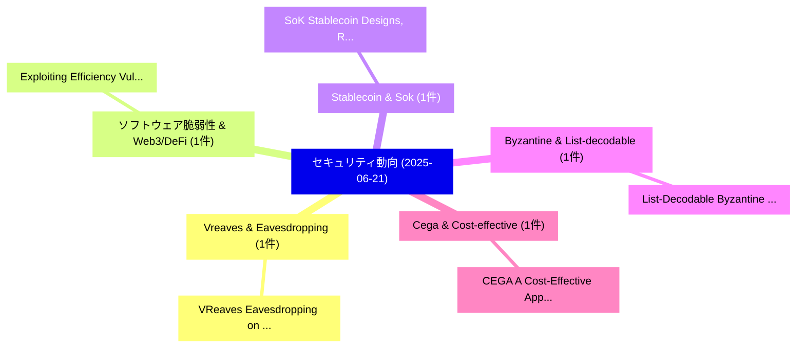

# 📅 02_daily: 日次エグゼクティブサマリー報告書 (2025-06-21)

**集計日時**: 2026-10-02 23:05:30 UTC  
**対象日付**: 2025-06-21  
**本日収集論文数**: 12 件  

---

## 💡 主要セキュリティ動向・脅威インサイト (Executive Insights)

本日の収集論文（計 12 件）において、以下の重点セキュリティ領域で活発な研究動向が確認されました：
- **Vreaves & Eavesdropping** (1 件): 注目論文として 「VReaves: Eavesdropping on Virt...」 等が発表され、実務防御および攻撃検証の進展が見られます。
- **ソフトウェア脆弱性 & Web3/DeFi** (1 件): 注目論文として 「Exploiting Efficiency Vulnerab...」 等が発表され、実務防御および攻撃検証の進展が見られます。
- **Stablecoin & Sok** (1 件): 注目論文として 「SoK: Stablecoin Designs, Risks...」 等が発表され、実務防御および攻撃検証の進展が見られます。
- **Byzantine & List-decodable** (1 件): 注目論文として 「List-Decodable Byzantine Robus...」 等が発表され、実務防御および攻撃検証の進展が見られます。
- **Cega & Cost-effective** (1 件): 注目論文として 「CEGA: A Cost-Effective Approac...」 等が発表され、実務防御および攻撃検証の進展が見られます。

### 🗺️ 技術・脅威トピックマインドマップ

---

## 📌 日次セキュリティ論文一覧 (日本語表形式)

| No | arXiv ID | 論文タイトル (日本語訳) | 重要キーワード | 構造化エグゼクティブ要約 (背景・提案・影響) | 脅威分類 | 詳細リンク |
|---|---|---|---|---|---|---|
| 1 | `2506.17570v2` | [VReaves: Eavesdropping on Virtual Reality App Identity and Activity via Electromagnetic Side Channels（セキュリティ分析論文）](../../okf/papers/2025-06-21/2506.17570.md) | `Virtual Reality App Identity`, `Electromagnetic Side Channels`, `Wei Sun` | 【提案】概要 (Overview & Key Finding) 本論文「VReaves: Eavesdropping on Virtual Reality App Identity ...。実証評価により経営層・セキュリティ管理者向け推奨アクション (E... | `cs.CR` | [arXiv](https://arxiv.org/abs/2506.17570v2) &#124; [OKF](../../okf/papers/2025-06-21/2506.17570.md) |
| 2 | `2506.17621v1` | [Exploiting Efficiency Vulnerabilities in Dynamic Deep Learning Systems（セキュリティ分析論文）](../../okf/papers/2025-06-21/2506.17621.md) | `Dynamic Deep Learning Systems`, `Exploiting Efficiency Vulnerabilities`, `Ravishka Rathnasuriya` | 【提案】概要 (Overview & Key Finding) 本論文「Exploiting Efficiency Vulnerabilities in Dynamic Deep L...。実証評価により経営層・セキュリティ管理者向け推奨アクション (E... | `cs.CR` | [arXiv](https://arxiv.org/abs/2506.17621v1) &#124; [OKF](../../okf/papers/2025-06-21/2506.17621.md) |
| 3 | `2506.17622v1` | [SoK: Stablecoin Designs, Risks, and the Stablecoin LEGO（セキュリティ分析論文）](../../okf/papers/2025-06-21/2506.17622.md) | `Stablecoin Designs`, `Shengchen Ling`, `Yuefeng Du` | 【提案】概要 (Overview & Key Finding) 本論文「SoK: Stablecoin Designs, Risks, and the Stablecoin LEGO...。実証評価により経営層・セキュリティ管理者向け推奨アクション (E... | `cs.CR` | [arXiv](https://arxiv.org/abs/2506.17622v1) &#124; [OKF](../../okf/papers/2025-06-21/2506.17622.md) |
| 4 | `2506.17625v1` | [List-Decodable Byzantine Robust PIR: Lower Communication Complexity, Higher Byzantine Tolerance, Smaller List Size（セキュリティ分析論文）](../../okf/papers/2025-06-21/2506.17625.md) | `Decodable Byzantine Robust`, `Lower Communication Complexity`, `Higher Byzantine Tolerance` | 【提案】概要 (Overview & Key Finding) 本論文「List-Decodable Byzantine Robust PIR: Lower Communicatio...。実証評価により経営層・セキュリティ管理者向け推奨アクション (E... | `cs.CR` | [arXiv](https://arxiv.org/abs/2506.17625v1) &#124; [OKF](../../okf/papers/2025-06-21/2506.17625.md) |
| 5 | `2506.17709v1` | [CEGA: A Cost-Effective Approach for Graph-Based Model Extraction and Acquisition（セキュリティ分析論文）](../../okf/papers/2025-06-21/2506.17709.md) | `Based Model Extraction`, `Graph-Based Model`, `Zebin Wang` | 【提案】概要 (Overview & Key Finding) 本論文「CEGA: A Cost-Effective Approach for Graph-Based Model E...。実証評価により経営層・セキュリティ管理者向け推奨アクション (E... | `cs.CR` | [arXiv](https://arxiv.org/abs/2506.17709v1) &#124; [OKF](../../okf/papers/2025-06-21/2506.17709.md) |
| 6 | `2506.17767v1` | [A Locally Differential Private Coding-Assisted Succinct Histogram Protocol（セキュリティ分析論文）](../../okf/papers/2025-06-21/2506.17767.md) | `Locally Differential Private Coding`, `Assisted Succinct Histogram Protocol`, `Coding-Assisted Succinct` | 【提案】概要 (Overview & Key Finding) 本論文「A Locally Differential Private Coding-Assisted Succinct...。実証評価により経営層・セキュリティ管理者向け推奨アクション (E... | `cs.CR` | [arXiv](https://arxiv.org/abs/2506.17767v1) &#124; [OKF](../../okf/papers/2025-06-21/2506.17767.md) |
| 7 | `2506.17795v1` | [A TRNG Implemented using a Soft-Data Based Sponge Function within a Unified Strong PUF Architecture（セキュリティ分析論文）](../../okf/papers/2025-06-21/2506.17795.md) | `Data Based Sponge Function`, `Unified Strong`, `Soft-Data Based` | 【提案】概要 (Overview & Key Finding) 本論文「A TRNG Implemented using a Soft-Data Based Sponge Funct...。実証評価により経営層・セキュリティ管理者向け推奨アクション (E... | `cs.CR` | [arXiv](https://arxiv.org/abs/2506.17795v1) &#124; [OKF](../../okf/papers/2025-06-21/2506.17795.md) |
| 8 | `2506.17798v3` | [CognixShield: PoV-Guided Vulnerable API Usage Detection in Large Codebases via LLMs（セキュリティ分析論文）](../../okf/papers/2025-06-21/2506.17798.md) | `Guided Vulnerable`, `Usage Detection`, `Large Codebases` | 【提案】概要 (Overview & Key Finding) 本論文「CognixShield: PoV-Guided Vulnerable API Usage Detection...。実証評価により経営層・セキュリティ管理者向け推奨アクション (E... | `cs.CR` | [arXiv](https://arxiv.org/abs/2506.17798v3) &#124; [OKF](../../okf/papers/2025-06-21/2506.17798.md) |
| 9 | `2506.17805v2` | [AdRo-FL: Informed and Secure Client Selection for 連合学習 in the Presence of Adversarial Aggregator](../../okf/papers/2025-06-21/2506.17805.md) | `Secure Client Selection`, `Adversarial Aggregator`, `Federated Learning` | 【提案】概要 (Overview & Key Finding) 本論文「AdRo-FL: Informed and Secure Client Selection for 連合学習 ...。実証評価により経営層・セキュリティ管理者向け推奨アクション (E... | `cs.CR` | [arXiv](https://arxiv.org/abs/2506.17805v2) &#124; [OKF](../../okf/papers/2025-06-21/2506.17805.md) |
| 10 | `2506.17824v1` | [Quantum-Hybrid Support Vector Machines for Anomaly Detection in Industrial Control Systems（セキュリティ分析論文）](../../okf/papers/2025-06-21/2506.17824.md) | `Hybrid Support Vector Machines`, `Industrial Control Systems`, `Anomaly Detection` | 【提案】概要 (Overview & Key Finding) 本論文「量子-Hybrid Support Vector Machines for Anomaly Detection...。実証評価により経営層・セキュリティ管理者向け推奨アクション (E... | `cs.CR` | [arXiv](https://arxiv.org/abs/2506.17824v1) &#124; [OKF](../../okf/papers/2025-06-21/2506.17824.md) |
| 11 | `2506.18932v1` | [AI Safety vs. AI Security: Demystifying the Distinction and Boundaries（セキュリティ分析論文）](../../okf/papers/2025-06-21/2506.18932.md) | `Zhiqiang Lin`, `Huan Sun`, `Ness Shroff` | 【提案】概要 (Overview & Key Finding) 本論文「AI Safety vs. AI Security: Demystifying the Distinction...。実証評価により経営層・セキュリティ管理者向け推奨アクション (E... | `cs.CR` | [arXiv](https://arxiv.org/abs/2506.18932v1) &#124; [OKF](../../okf/papers/2025-06-21/2506.18932.md) |
| 12 | `2506.19870v1` | [Secure Energy Transactions Using Blockchain Leveraging AI for Fraud Detection and Energy Market Stability（セキュリティ分析論文）](../../okf/papers/2025-06-21/2506.19870.md) | `Secure Energy Transactions Using Blockchain Leveraging`, `Energy Market Stability`, `Fraud Detection` | 【提案】概要 (Overview & Key Finding) 本論文「Secure Energy Transactions Using Blockchain Leveraging ...。実証評価により経営層・セキュリティ管理者向け推奨アクション (E... | `cs.CR` | [arXiv](https://arxiv.org/abs/2506.19870v1) &#124; [OKF](../../okf/papers/2025-06-21/2506.19870.md) |

