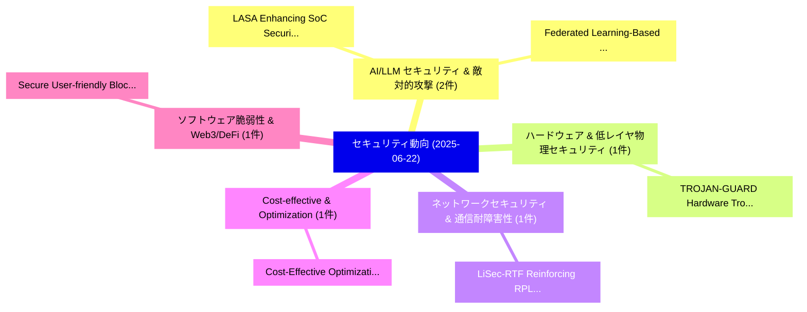

# 📅 02_daily: 日次エグゼクティブサマリー報告書 (2025-06-22)

**集計日時**: 2026-10-02 23:05:30 UTC  
**対象日付**: 2025-06-22  
**本日収集論文数**: 13 件  

---

## 💡 主要セキュリティ動向・脅威インサイト (Executive Insights)

本日の収集論文（計 13 件）において、以下の重点セキュリティ領域で活発な研究動向が確認されました：
- **AI/LLM セキュリティ & 敵対的攻撃** (2 件): 注目論文として 「LASA: Enhancing SoC Security V...」、「Federated Learning-Based Data ...」 等が発表され、実務防御および攻撃検証の進展が見られます。
- **ハードウェア & 低レイヤ物理セキュリティ** (1 件): 注目論文として 「TROJAN-GUARD: Hardware Trojans...」 等が発表され、実務防御および攻撃検証の進展が見られます。
- **ネットワークセキュリティ & 通信耐障害性** (1 件): 注目論文として 「LiSec-RTF: Reinforcing RPL Res...」 等が発表され、実務防御および攻撃検証の進展が見られます。
- **Cost-effective & Optimization** (1 件): 注目論文として 「Cost-Effective Optimization an...」 等が発表され、実務防御および攻撃検証の進展が見られます。
- **ソフトウェア脆弱性 & Web3/DeFi** (1 件): 注目論文として 「Secure User-friendly Blockchai...」 等が発表され、実務防御および攻撃検証の進展が見られます。

### 🗺️ 技術・脅威トピックマインドマップ

---

## 📌 日次セキュリティ論文一覧 (日本語表形式)

| No | arXiv ID | 論文タイトル (日本語訳) | 重要キーワード | 構造化エグゼクティブ要約 (背景・提案・影響) | 脅威分類 | 詳細リンク |
|---|---|---|---|---|---|---|
| 1 | `2506.17865v1` | [LASA: Enhancing SoC Security Verification with LLM-Aided Property Generation（セキュリティ分析論文）](../../okf/papers/2025-06-22/2506.17865.md) | `Aided Property Generation`, `Security Verification`, `LLM-Aided Property` | 【提案】概要 (Overview & Key Finding) 本論文「LASA: Enhancing SoC Security Verification with LLM-Aide...。実証評価により経営層・セキュリティ管理者向け推奨アクション (E... | `cs.CR` | [arXiv](https://arxiv.org/abs/2506.17865v1) &#124; [OKF](../../okf/papers/2025-06-22/2506.17865.md) |
| 2 | `2506.17894v1` | [TROJAN-GUARD: Hardware Trojans Detection Using GNN in RTL Designs（セキュリティ分析論文）](../../okf/papers/2025-06-22/2506.17894.md) | `Hardware Trojans Detection Using`, `Kiran Thorat`, `Amit Hasan` | 【提案】概要 (Overview & Key Finding) 本論文「TROJAN-GUARD: Hardware Trojans Detection Using GNN in R...。実証評価により経営層・セキュリティ管理者向け推奨アクション (E... | `cs.CR` | [arXiv](https://arxiv.org/abs/2506.17894v1) &#124; [OKF](../../okf/papers/2025-06-22/2506.17894.md) |
| 3 | `2506.17911v1` | [LiSec-RTF: Reinforcing RPL Resilience Against Routing Table Falsification Attack in 6LoWPAN（セキュリティ分析論文）](../../okf/papers/2025-06-22/2506.17911.md) | `Vinod Kumar Verma`, `Shefali Goel`, `Abhishek Verma` | 【提案】概要 (Overview & Key Finding) 本論文「LiSec-RTF: Reinforcing RPL Resilience Against Routing T...。実証評価により経営層・セキュリティ管理者向け推奨アクション (E... | `cs.CR` | [arXiv](https://arxiv.org/abs/2506.17911v1) &#124; [OKF](../../okf/papers/2025-06-22/2506.17911.md) |
| 4 | `2506.17935v1` | [Cost-Effective Optimization and Implementation of the CRT-Paillier Decryption Algorithm for Enhanced Performance（セキュリティ分析論文）](../../okf/papers/2025-06-22/2506.17935.md) | `Paillier Decryption Algorithm`, `Effective Optimization`, `Enhanced Performance` | 【提案】概要 (Overview & Key Finding) 本論文「Cost-Effective Optimization and Implementation of the C...。実証評価により経営層・セキュリティ管理者向け推奨アクション (E... | `cs.CR` | [arXiv](https://arxiv.org/abs/2506.17935v1) &#124; [OKF](../../okf/papers/2025-06-22/2506.17935.md) |
| 5 | `2506.17988v1` | [Secure User-friendly Blockchain Modular Wallet Design Using Android & OP-TEE（セキュリティ分析論文）](../../okf/papers/2025-06-22/2506.17988.md) | `Blockchain Modular Wallet Design Using Android`, `Secure User`, `User-friendly Blockchain` | 【提案】概要 (Overview & Key Finding) 本論文「Secure User-friendly Blockchain Modular Wallet Design U...。実証評価により経営層・セキュリティ管理者向け推奨アクション (E... | `cs.CR` | [arXiv](https://arxiv.org/abs/2506.17988v1) &#124; [OKF](../../okf/papers/2025-06-22/2506.17988.md) |
| 6 | `2506.18020v3` | [Tight Stability Bounds for Robust Distributed Learning: Byzantine Failures Hurt Generalization More than Data Poisoning（セキュリティ分析論文）](../../okf/papers/2025-06-22/2506.18020.md) | `Tight Stability Bounds`, `Robust Distributed Learning`, `Data Poisoning` | 【提案】概要 (Overview & Key Finding) 本論文「Tight Stability Bounds for Robust Distributed Learning:...。実証評価により経営層・セキュリティ管理者向け推奨アクション (E... | `cs.CR` | [arXiv](https://arxiv.org/abs/2506.18020v3) &#124; [OKF](../../okf/papers/2025-06-22/2506.18020.md) |
| 7 | `2506.18053v1` | [Mechanistic Interpretability in the Presence of Architectural Obfuscation（セキュリティ分析論文）](../../okf/papers/2025-06-22/2506.18053.md) | `Mechanistic Interpretability`, `Architectural Obfuscation`, `Marcos Florencio` | 【提案】概要 (Overview & Key Finding) 本論文「Mechanistic Interpretability in the Presence of Archite...。実証評価により経営層・セキュリティ管理者向け推奨アクション (E... | `cs.CR` | [arXiv](https://arxiv.org/abs/2506.18053v1) &#124; [OKF](../../okf/papers/2025-06-22/2506.18053.md) |
| 8 | `2506.18087v1` | [Federated Learning-Based Data Collaboration Method for Enhancing Edge Cloud AI System Security Using 大規模言語モデル](../../okf/papers/2025-06-22/2506.18087.md) | `Enhancing Edge Cloud`, `Federated Learning`, `Learning-Based Data` | 【提案】概要 (Overview & Key Finding) 本論文「Federated Learning-Based Data Collaboration Method for ...。実証評価により経営層・セキュリティ管理者向け推奨アクション (E... | `cs.CR` | [arXiv](https://arxiv.org/abs/2506.18087v1) &#124; [OKF](../../okf/papers/2025-06-22/2506.18087.md) |
| 9 | `2506.18100v1` | [Optimizing Resource Allocation and Energy Efficiency in Federated Fog Computing for IoT（セキュリティ分析論文）](../../okf/papers/2025-06-22/2506.18100.md) | `Optimizing Resource Allocation`, `Federated Fog Computing`, `Energy Efficiency` | 【提案】概要 (Overview & Key Finding) 本論文「Optimizing Resource Allocation and Energy Efficiency in...。実証評価により経営層・セキュリティ管理者向け推奨アクション (E... | `cs.CR` | [arXiv](https://arxiv.org/abs/2506.18100v1) &#124; [OKF](../../okf/papers/2025-06-22/2506.18100.md) |
| 10 | `2506.18114v1` | [Dynamic Temporal Positional Encodings for Early Intrusion Detection in IoT（セキュリティ分析論文）](../../okf/papers/2025-06-22/2506.18114.md) | `Dynamic Temporal Positional Encodings`, `Early Intrusion Detection`, `Ioannis Panopoulos` | 【提案】概要 (Overview & Key Finding) 本論文「Dynamic Temporal Positional Encodings for Early Intrusi...。実証評価により経営層・セキュリティ管理者向け推奨アクション (E... | `cs.CR` | [arXiv](https://arxiv.org/abs/2506.18114v1) &#124; [OKF](../../okf/papers/2025-06-22/2506.18114.md) |
| 11 | `2506.18150v4` | [HE-LRM: Encrypted Deep Learning Recommendation Models using Fully Homomorphic Encryption（セキュリティ分析論文）](../../okf/papers/2025-06-22/2506.18150.md) | `Encrypted Deep Learning Recommendation Models`, `Fully Homomorphic Encryption`, `Encrypted Deep Learning Recommendation` | 【提案】概要 (Overview & Key Finding) 本論文「HE-LRM: Encrypted Deep Learning Recommendation Models u...。実証評価により経営層・セキュリティ管理者向け推奨アクション (E... | `cs.CR` | [arXiv](https://arxiv.org/abs/2506.18150v4) &#124; [OKF](../../okf/papers/2025-06-22/2506.18150.md) |
| 12 | `2506.18189v1` | [SoK: Current State of Ethereum's Enshrined Proposer Builder Separation（セキュリティ分析論文）](../../okf/papers/2025-06-22/2506.18189.md) | `Enshrined Proposer Builder Separation`, `Current State`, `Maxwell Koegler` | 【提案】概要 (Overview & Key Finding) 本論文「SoK: Current State of Ethereum's Enshrined Proposer Bui...。実証評価により経営層・セキュリティ管理者向け推奨アクション (E... | `cs.CR` | [arXiv](https://arxiv.org/abs/2506.18189v1) &#124; [OKF](../../okf/papers/2025-06-22/2506.18189.md) |
| 13 | `2506.19871v1` | [An Attack Method for Medical Insurance Claim Fraud Detection based on Generative Adversarial Network（セキュリティ分析論文）](../../okf/papers/2025-06-22/2506.19871.md) | `Medical Insurance Claim Fraud Detection`, `Generative Adversarial Network`, `Yining Pang` | 【提案】概要 (Overview & Key Finding) 本論文「An Attack Method for Medical Insurance Claim Fraud Dete...。実証評価により経営層・セキュリティ管理者向け推奨アクション (E... | `cs.CR` | [arXiv](https://arxiv.org/abs/2506.19871v1) &#124; [OKF](../../okf/papers/2025-06-22/2506.19871.md) |

