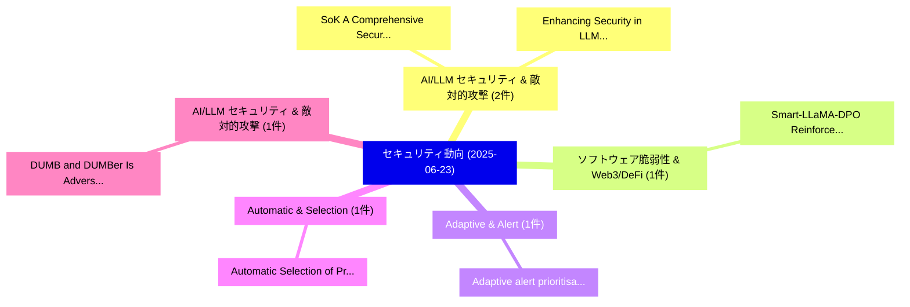

# 📅 02_daily: 日次エグゼクティブサマリー報告書 (2025-06-23)

**集計日時**: 2026-10-02 23:05:30 UTC  
**対象日付**: 2025-06-23  
**本日収集論文数**: 20 件  

---

## 💡 主要セキュリティ動向・脅威インサイト (Executive Insights)

本日の収集論文（計 20 件）において、以下の重点セキュリティ領域で活発な研究動向が確認されました：
- **AI/LLM セキュリティ & 敵対的攻撃** (2 件): 注目論文として 「SoK: A Comprehensive Security ...」、「Enhancing Security in LLM Appl...」 等が発表され、実務防御および攻撃検証の進展が見られます。
- **ソフトウェア脆弱性 & Web3/DeFi** (1 件): 注目論文として 「Smart-LLaMA-DPO: Reinforced La...」 等が発表され、実務防御および攻撃検証の進展が見られます。
- **Adaptive & Alert** (1 件): 注目論文として 「Adaptive alert prioritisation ...」 等が発表され、実務防御および攻撃検証の進展が見られます。
- **Automatic & Selection** (1 件): 注目論文として 「Automatic Selection of Protect...」 等が発表され、実務防御および攻撃検証の進展が見られます。
- **AI/LLM セキュリティ & 敵対的攻撃** (1 件): 注目論文として 「DUMB and DUMBer: Is Adversaria...」 等が発表され、実務防御および攻撃検証の進展が見られます。

### 🗺️ 技術・脅威トピックマインドマップ

---

## 📌 日次セキュリティ論文一覧 (日本語表形式)

| No | arXiv ID | 論文タイトル (日本語訳) | 重要キーワード | 構造化エグゼクティブ要約 (背景・提案・影響) | 脅威分類 | 詳細リンク |
|---|---|---|---|---|---|---|
| 1 | `2506.18245v1` | [Smart-LLaMA-DPO: Reinforced Large Language Model for Explainable Smart Contract 脆弱性検出](../../okf/papers/2025-06-23/2506.18245.md) | `Reinforced Large Language Model`, `Explainable Smart Contract Vulnerability Detection`, `Explainable Smart Contract` | 【提案】概要 (Overview & Key Finding) 本論文「Smart-LLaMA-DPO: Reinforced Large Language Model for Ex...。実証評価により経営層・セキュリティ管理者向け推奨アクション (E... | `cs.CR` | [arXiv](https://arxiv.org/abs/2506.18245v1) &#124; [OKF](../../okf/papers/2025-06-23/2506.18245.md) |
| 2 | `2506.18462v1` | [Adaptive alert prioritisation in security operations centres via learning to defer with human feedback（セキュリティ分析論文）](../../okf/papers/2025-06-23/2506.18462.md) | `Mohan Baruwal Chhetri`, `Fatemeh Jalalvand`, `Surya Nepal` | 【提案】概要 (Overview & Key Finding) 本論文「Adaptive alert prioritisation in security operations ce...。実証評価により経営層・セキュリティ管理者向け推奨アクション (E... | `cs.CR` | [arXiv](https://arxiv.org/abs/2506.18462v1) &#124; [OKF](../../okf/papers/2025-06-23/2506.18462.md) |
| 3 | `2506.18470v1` | [Automatic Selection of Protections to Mitigate Risks Against Software Applications（セキュリティ分析論文）](../../okf/papers/2025-06-23/2506.18470.md) | `Automatic Selection`, `Bjorn De Sutter`, `Daniele Canavese` | 【提案】概要 (Overview & Key Finding) 本論文「Automatic Selection of Protections to Mitigate Risks Ag...。実証評価により経営層・セキュリティ管理者向け推奨アクション (E... | `cs.CR` | [arXiv](https://arxiv.org/abs/2506.18470v1) &#124; [OKF](../../okf/papers/2025-06-23/2506.18470.md) |
| 4 | `2506.18516v1` | [DUMB and DUMBer: Is Adversarial Training Worth It in the Real World?（セキュリティ分析論文）](../../okf/papers/2025-06-23/2506.18516.md) | `Real World`, `Francesco Marchiori`, `Marco Alecci` | 【提案】### (日本語題名: DUMB and DUMBer: Is Adversarial Training Worth It in the Real World?（セキュリティ...。実証評価により経営層・セキュリティ管理者向け推奨アクション (E... | `cs.CR` | [arXiv](https://arxiv.org/abs/2506.18516v1) &#124; [OKF](../../okf/papers/2025-06-23/2506.18516.md) |
| 5 | `2506.18543v2` | [SoK: A Comprehensive Security Jailbreak Resilience in GPT and DeepSeek Modelsの分析](../../okf/papers/2025-06-23/2506.18543.md) | `Comprehensive Security Jailbreak Resilience`, `Jailbreak Resilience`, `Xiaodong Wu` | 【提案】概要 (Overview & Key Finding) 本論文「SoK: A Comprehensive Security ジェイルブレイク Resilience in GP...。実証評価により経営層・セキュリティ管理者向け推奨アクション (E... | `cs.CR` | [arXiv](https://arxiv.org/abs/2506.18543v2) &#124; [OKF](../../okf/papers/2025-06-23/2506.18543.md) |
| 6 | `2506.18685v1` | [Understanding the Theoretical Guarantees of DPM（セキュリティ分析論文）](../../okf/papers/2025-06-23/2506.18685.md) | `Theoretical Guarantees`, `Esfandiar Mohammadi`, `Raw Meta` | 【提案】概要 (Overview & Key Finding) 本論文「Understanding the Theoretical Guarantees of DPM（セキュリティ分...。実証評価により経営層・セキュリティ管理者向け推奨アクション (E... | `cs.CR` | [arXiv](https://arxiv.org/abs/2506.18685v1) &#124; [OKF](../../okf/papers/2025-06-23/2506.18685.md) |
| 7 | `2506.18715v1` | [Vulnerability Assessment Combining CVSS Temporal Metrics and Bayesian Networks（セキュリティ分析論文）](../../okf/papers/2025-06-23/2506.18715.md) | `Vulnerability Assessment Combining`, `Temporal Metrics`, `Bayesian Networks` | 【提案】概要 (Overview & Key Finding) 本論文「脆弱性 Assessment Combining CVSS Temporal Metrics and Baye...。実証評価により経営層・セキュリティ管理者向け推奨アクション (E... | `cs.CR` | [arXiv](https://arxiv.org/abs/2506.18715v1) &#124; [OKF](../../okf/papers/2025-06-23/2506.18715.md) |
| 8 | `2506.18731v1` | [Deep CNN Face Matchers Inherently Support Revocable Biometric Templates（セキュリティ分析論文）](../../okf/papers/2025-06-23/2506.18731.md) | `Face Matchers Inherently Support Revocable Biometric Templates`, `Aman Bhatta`, `Raw Meta` | 【提案】概要 (Overview & Key Finding) 本論文「Deep CNN Face Matchers Inherently Support Revocable Bio...。実証評価によりKing, Kevin W.。 | `cs.CR` | [arXiv](https://arxiv.org/abs/2506.18731v1) &#124; [OKF](../../okf/papers/2025-06-23/2506.18731.md) |
| 9 | `2506.18767v1` | [Physical Layer Challenge-Response Authentication between Ambient Backscatter Devices（セキュリティ分析論文）](../../okf/papers/2025-06-23/2506.18767.md) | `Physical Layer Challenge`, `Ambient Backscatter Devices`, `Response Authentication` | 【提案】概要 (Overview & Key Finding) 本論文「Physical Layer Challenge-Response Authentication betwee...。実証評価により経営層・セキュリティ管理者向け推奨アクション (E... | `cs.CR` | [arXiv](https://arxiv.org/abs/2506.18767v1) &#124; [OKF](../../okf/papers/2025-06-23/2506.18767.md) |
| 10 | `2506.18780v1` | [Design high-confidence computers using trusted instructional set architecture and emulators（セキュリティ分析論文）](../../okf/papers/2025-06-23/2506.18780.md) | `high-confidence computers`, `Shuangbao Paul Wang`, `Raw Meta` | 【提案】概要 (Overview & Key Finding) 本論文「Design high-confidence computers using trusted instruct...。実証評価により経営層・セキュリティ管理者向け推奨アクション (E... | `cs.CR` | [arXiv](https://arxiv.org/abs/2506.18780v1) &#124; [OKF](../../okf/papers/2025-06-23/2506.18780.md) |
| 11 | `2506.18795v1` | [FORGE: An LLM-driven Framework for Large-Scale Smart Contract Vulnerability Dataset Construction（セキュリティ分析論文）](../../okf/papers/2025-06-23/2506.18795.md) | `Scale Smart Contract Vulnerability Dataset Construction`, `Large-Scale Smart`, `Jiachi Chen` | 【提案】概要 (Overview & Key Finding) 本論文「FORGE: An LLM-driven Framework for Large-Scale スマートコントラ...。実証評価により経営層・セキュリティ管理者向け推奨アクション (E... | `cs.CR` | [arXiv](https://arxiv.org/abs/2506.18795v1) &#124; [OKF](../../okf/papers/2025-06-23/2506.18795.md) |
| 12 | `2506.18848v1` | [Cellular Automata as Generators of Interleaving Sequences（セキュリティ分析論文）](../../okf/papers/2025-06-23/2506.18848.md) | `Cellular Automata`, `Interleaving Sequences`, `Raw Meta` | 【提案】概要 (Overview & Key Finding) 本論文「Cellular Automata as Generators of Interleaving Sequenc...。実証評価によりCardell - **公開日時**: `2025... | `cs.CR` | [arXiv](https://arxiv.org/abs/2506.18848v1) &#124; [OKF](../../okf/papers/2025-06-23/2506.18848.md) |
| 13 | `2506.18870v1` | [Amplifying Machine Learning Attacks Through Strategic Compositions（セキュリティ分析論文）](../../okf/papers/2025-06-23/2506.18870.md) | `Yugeng Liu`, `Zheng Li`, `Hai Huang` | 【提案】概要 (Overview & Key Finding) 本論文「Amplifying Machine Learning Attacks Through Strategic C...。実証評価により経営層・セキュリティ管理者向け推奨アクション (E... | `cs.CR` | [arXiv](https://arxiv.org/abs/2506.18870v1) &#124; [OKF](../../okf/papers/2025-06-23/2506.18870.md) |
| 14 | `2506.19109v1` | [Enhancing Security in LLM Applications: A Performance Evaluation of Early Detection Systems（セキュリティ分析論文）](../../okf/papers/2025-06-23/2506.19109.md) | `Early Detection Systems`, `Enhancing Security`, `Valerii Gakh` | 【提案】概要 (Overview & Key Finding) 本論文「Enhancing Security in LLM Applications: A Performance E...。実証評価により経営層・セキュリティ管理者向け推奨アクション (E... | `cs.CR` | [arXiv](https://arxiv.org/abs/2506.19109v1) &#124; [OKF](../../okf/papers/2025-06-23/2506.19109.md) |
| 15 | `2506.19874v2` | [Provable (In)Secure Model Weight Release Schemesに向けて](../../okf/papers/2025-06-23/2506.19874.md) | `Secure Model Weight Release Schemes`, `Secure Model Weight Release`, `Towards Provable` | 【提案】概要 (Overview & Key Finding) 本論文「Provable (In)Secure Model Weight Release Schemesに向けて」（原...。実証評価により経営層・セキュリティ管理者向け推奨アクション (E... | `cs.CR` | [arXiv](https://arxiv.org/abs/2506.19874v2) &#124; [OKF](../../okf/papers/2025-06-23/2506.19874.md) |
| 16 | `2506.19877v2` | [Robust Anomaly Detection in Network Traffic: Evaluating Machine Learning Models on CICIDS2017（セキュリティ分析論文）](../../okf/papers/2025-06-23/2506.19877.md) | `Evaluating Machine Learning Models`, `Robust Anomaly Detection`, `Network Traffic` | 【提案】概要 (Overview & Key Finding) 本論文「Robust Anomaly Detection in Network Traffic: Evaluating...。実証評価により# Robust Anomaly Detectio... | `cs.CR` | [arXiv](https://arxiv.org/abs/2506.19877v2) &#124; [OKF](../../okf/papers/2025-06-23/2506.19877.md) |
| 17 | `2506.19881v3` | [Blameless Users in a Clean Room: Defining Copyright Protection for Generative Models（セキュリティ分析論文）](../../okf/papers/2025-06-23/2506.19881.md) | `Defining Copyright Protection`, `Blameless Users`, `Clean Room` | 【提案】概要 (Overview & Key Finding) 本論文「Blameless Users in a Clean Room: Defining Copyright Pro...。実証評価により経営層・セキュリティ管理者向け推奨アクション (E... | `cs.CR` | [arXiv](https://arxiv.org/abs/2506.19881v3) &#124; [OKF](../../okf/papers/2025-06-23/2506.19881.md) |
| 18 | `2506.22482v1` | [Wireless Home Automation Using Social Networking Websites（セキュリティ分析論文）](../../okf/papers/2025-06-23/2506.22482.md) | `Wireless Home Automation Using Social Networking Websites`, `Divya Alok Gupta`, `Aditya Vighnesh Ramakanth` | 【提案】概要 (Overview & Key Finding) 本論文「Wireless Home Automation Using Social Networking Websit...。実証評価によりAditya Vighnesh Ramakanth... | `cs.CR` | [arXiv](https://arxiv.org/abs/2506.22482v1) &#124; [OKF](../../okf/papers/2025-06-23/2506.22482.md) |
| 19 | `2507.06244v1` | [A Comparative Study and Implementation of Key Derivation Functions Standardized by NIST and IEEE（セキュリティ分析論文）](../../okf/papers/2025-06-23/2507.06244.md) | `Key Derivation Functions Standardized`, `Key Derivation Fun`, `Raw Meta` | 【提案】概要 (Overview & Key Finding) 本論文「A Comparative Study and Implementation of Key Derivatio...。実証評価により経営層・セキュリティ管理者向け推奨アクション (E... | `cs.CR` | [arXiv](https://arxiv.org/abs/2507.06244v1) &#124; [OKF](../../okf/papers/2025-06-23/2507.06244.md) |
| 20 | `2507.21087v1` | [Intelligent ARP Spoofing Detection using Multi-layered Machine Learning (ML) Techniques for IoT Networks（セキュリティ分析論文）](../../okf/papers/2025-06-23/2507.21087.md) | `Spoofing Detection`, `Machine Learning`, `Multi-layered Machine` | 【提案】概要 (Overview & Key Finding) 本論文「Intelligent ARP Spoofing Detection using Multi-layered ...。実証評価により経営層・セキュリティ管理者向け推奨アクション (E... | `cs.CR` | [arXiv](https://arxiv.org/abs/2507.21087v1) &#124; [OKF](../../okf/papers/2025-06-23/2507.21087.md) |

