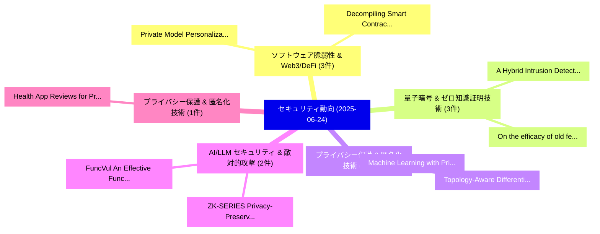

# 📅 02_daily: 日次エグゼクティブサマリー報告書 (2025-06-24)

**集計日時**: 2026-10-02 23:05:31 UTC  
**対象日付**: 2025-06-24  
**本日収集論文数**: 29 件  

---

## 💡 主要セキュリティ動向・脅威インサイト (Executive Insights)

本日の収集論文（計 29 件）において、以下の重点セキュリティ領域で活発な研究動向が確認されました：
- **ソフトウェア脆弱性 & Web3/DeFi** (3 件): 注目論文として 「Private Model Personalization ...」、「Decompiling Smart Contracts wi...」 等が発表され、実務防御および攻撃検証の進展が見られます。
- **量子暗号 & ゼロ知識証明技術** (3 件): 注目論文として 「On the efficacy of old feature...」、「A Hybrid Intrusion Detection S...」 等が発表され、実務防御および攻撃検証の進展が見られます。
- **プライバシー保護 & 匿名化技術** (2 件): 注目論文として 「Topology-Aware Differential Pr...」、「Machine Learning with Privacy ...」 等が発表され、実務防御および攻撃検証の進展が見られます。
- **AI/LLM セキュリティ & 敵対的攻撃** (2 件): 注目論文として 「ZK-SERIES: Privacy-Preserving ...」、「FuncVul: An Effective Function...」 等が発表され、実務防御および攻撃検証の進展が見られます。
- **プライバシー保護 & 匿名化技術** (1 件): 注目論文として 「Health App Reviews for Privacy...」 等が発表され、実務防御および攻撃検証の進展が見られます。

### 🗺️ 技術・脅威トピックマインドマップ

---

## 📌 日次セキュリティ論文一覧 (日本語表形式)

| No | arXiv ID | 論文タイトル (日本語訳) | 重要キーワード | 構造化エグゼクティブ要約 (背景・提案・影響) | 脅威分類 | 詳細リンク |
|---|---|---|---|---|---|---|
| 1 | `2506.19220v1` | [Private Model Personalization Revisited（セキュリティ分析論文）](../../okf/papers/2025-06-24/2506.19220.md) | `Private Model Personalization Revisited`, `Conor Snedeker`, `Xinyu Zhou` | 【提案】概要 (Overview & Key Finding) 本論文「Private Model Personalization Revisited（セキュリティ分析論文）」（原題...。実証評価により経営層・セキュリティ管理者向け推奨アクション (E... | `cs.CR` | [arXiv](https://arxiv.org/abs/2506.19220v1) &#124; [OKF](../../okf/papers/2025-06-24/2506.19220.md) |
| 2 | `2506.19260v2` | [Topology-Aware Differential Privacy in 連合学習](../../okf/papers/2025-06-24/2506.19260.md) | `Aware Differential Privacy`, `Topology-Aware Differential`, `Federated Learning` | 【提案】概要 (Overview & Key Finding) 本論文「Topology-Aware 差分プライバシー in 連合学習」（原題: Topology-Aware 差分プ...。実証評価によりSinnott, Rajkumar Buyya -... | `cs.CR` | [arXiv](https://arxiv.org/abs/2506.19260v2) &#124; [OKF](../../okf/papers/2025-06-24/2506.19260.md) |
| 3 | `2506.19268v4` | [Health App Reviews for Privacy & Trust (HARPT): A Corpus for Analyzing Patient Privacy Concerns, Trust in Providers and Trust in Applications（セキュリティ分析論文）](../../okf/papers/2025-06-24/2506.19268.md) | `Analyzing Patient Privacy Concerns`, `Health App Reviews`, `Timoteo Kelly` | 【提案】概要 (Overview & Key Finding) 本論文「Health App Reviews for Privacy & Trust (HARPT): A Corpu...。実証評価により経営層・セキュリティ管理者向け推奨アクション (E... | `cs.CR` | [arXiv](https://arxiv.org/abs/2506.19268v4) &#124; [OKF](../../okf/papers/2025-06-24/2506.19268.md) |
| 4 | `2506.19356v1` | [WebGuard++:Interpretable Malicious URL Detection via Bidirectional Fusion of HTML Subgraphs and Multi-Scale Convolutional BERT（セキュリティ分析論文）](../../okf/papers/2025-06-24/2506.19356.md) | `Interpretable Malicious`, `Bidirectional Fusion`, `Scale Convolutional` | 【提案】概要 (Overview & Key Finding) 本論文「WebGuard++:Interpretable Malicious URL Detection via Bi...。実証評価により経営層・セキュリティ管理者向け推奨アクション (E... | `cs.CR` | [arXiv](https://arxiv.org/abs/2506.19356v1) &#124; [OKF](../../okf/papers/2025-06-24/2506.19356.md) |
| 5 | `2506.19360v2` | [SoK: Can Synthetic Images Replace Real Data? A Survey of Utility and Privacy of Synthetic Image Generation（セキュリティ分析論文）](../../okf/papers/2025-06-24/2506.19360.md) | `Can Synthetic Images Replace Real Data`, `Synthetic Image Generation`, `Yunsung Chung` | 【提案】A Survey of Utility and Privacy of Synthetic Image Generation ### (日本語題名: SoK: Can Synt...。実証評価により経営層・セキュリティ管理者向け推奨アクション (E... | `cs.CR` | [arXiv](https://arxiv.org/abs/2506.19360v2) &#124; [OKF](../../okf/papers/2025-06-24/2506.19360.md) |
| 6 | `2506.19368v1` | [Yotta: A Large-Scale Trustless Data Trading Scheme for Blockchain System（セキュリティ分析論文）](../../okf/papers/2025-06-24/2506.19368.md) | `Scale Trustless Data Trading Scheme`, `Blockchain System`, `Large-Scale Trustless` | 【提案】概要 (Overview & Key Finding) 本論文「Yotta: A Large-Scale Trustless Data Trading Scheme for ...。実証評価により経営層・セキュリティ管理者向け推奨アクション (E... | `cs.CR` | [arXiv](https://arxiv.org/abs/2506.19368v1) &#124; [OKF](../../okf/papers/2025-06-24/2506.19368.md) |
| 7 | `2506.19393v1` | [ZK-SERIES: Privacy-Preserving Authentication using Temporal Biometric Data（セキュリティ分析論文）](../../okf/papers/2025-06-24/2506.19393.md) | `Temporal Biometric Data`, `Preserving Authentication`, `Privacy-Preserving Authentication` | 【提案】概要 (Overview & Key Finding) 本論文「ZK-SERIES: Privacy-Preserving Authentication using Temp...。実証評価により経営層・セキュリティ管理者向け推奨アクション (E... | `cs.CR` | [arXiv](https://arxiv.org/abs/2506.19393v1) &#124; [OKF](../../okf/papers/2025-06-24/2506.19393.md) |
| 8 | `2506.19409v1` | [An ETSI GS QKD compliant TLS implementation（セキュリティ分析論文）](../../okf/papers/2025-06-24/2506.19409.md) | `Bruno Martin`, `Olivier Alibart`, `Raw Meta` | 【提案】概要 (Overview & Key Finding) 本論文「An ETSI GS QKD compliant TLS implementation（セキュリティ分析論文）...。実証評価により経営層・セキュリティ管理者向け推奨アクション (E... | `cs.CR` | [arXiv](https://arxiv.org/abs/2506.19409v1) &#124; [OKF](../../okf/papers/2025-06-24/2506.19409.md) |
| 9 | `2506.19453v1` | [FuncVul: An Effective Function Level 脆弱性検出 Model using LLM and Code Chunk](../../okf/papers/2025-06-24/2506.19453.md) | `Code Chunk`, `Muhammad Ejaz Ahmed`, `Sajal Halder` | 【提案】概要 (Overview & Key Finding) 本論文「FuncVul: An Effective Function Level 脆弱性検出 Model using ...。実証評価により経営層・セキュリティ管理者向け推奨アクション (E... | `cs.CR` | [arXiv](https://arxiv.org/abs/2506.19453v1) &#124; [OKF](../../okf/papers/2025-06-24/2506.19453.md) |
| 10 | `2506.19464v1` | [Assessing Risk of Stealing Proprietary Models for Medical Imaging Tasks（セキュリティ分析論文）](../../okf/papers/2025-06-24/2506.19464.md) | `Stealing Proprietary Models`, `Medical Imaging Tasks`, `Assessing Risk` | 【提案】概要 (Overview & Key Finding) 本論文「Assessing Risk of Stealing Proprietary Models for Medic...。実証評価により経営層・セキュリティ管理者向け推奨アクション (E... | `cs.CR` | [arXiv](https://arxiv.org/abs/2506.19464v1) &#124; [OKF](../../okf/papers/2025-06-24/2506.19464.md) |
| 11 | `2506.19480v1` | [PhishingHook: Catching Phishing Ethereum Smart Contracts leveraging EVM Opcodes（セキュリティ分析論文）](../../okf/papers/2025-06-24/2506.19480.md) | `Catching Phishing Ethereum Smart Contracts`, `Pasquale De Rosa`, `Simon Queyrut` | 【提案】概要 (Overview & Key Finding) 本論文「PhishingHook: Catching Phishing Ethereum スマートコントラクトs le...。実証評価により経営層・セキュリティ管理者向け推奨アクション (E... | `cs.CR` | [arXiv](https://arxiv.org/abs/2506.19480v1) &#124; [OKF](../../okf/papers/2025-06-24/2506.19480.md) |
| 12 | `2506.19486v1` | [Recalling The Forgotten Class Memberships: Unlearned Models Can Be Noisy Labelers to Leak Privacy（セキュリティ分析論文）](../../okf/papers/2025-06-24/2506.19486.md) | `Leak Privacy`, `Zhihao Sui`, `Liang Hu` | 【提案】概要 (Overview & Key Finding) 本論文「Recalling The Forgotten Class Memberships: Unlearned Mo...。実証評価により経営層・セキュリティ管理者向け推奨アクション (E... | `cs.CR` | [arXiv](https://arxiv.org/abs/2506.19486v1) &#124; [OKF](../../okf/papers/2025-06-24/2506.19486.md) |
| 13 | `2506.19533v1` | [Identifying Physically Realizable Triggers for Backdoored Face Recognition Networks（セキュリティ分析論文）](../../okf/papers/2025-06-24/2506.19533.md) | `Identifying Physically Realizable Triggers`, `Backdoored Face Recognition Networks`, `Ankita Raj` | 【提案】概要 (Overview & Key Finding) 本論文「Identifying Physically Realizable Triggers for Backdoor...。実証評価により経営層・セキュリティ管理者向け推奨アクション (E... | `cs.CR` | [arXiv](https://arxiv.org/abs/2506.19533v1) &#124; [OKF](../../okf/papers/2025-06-24/2506.19533.md) |
| 14 | `2506.19542v1` | [From Worst-Case Hardness of $\mathsf{NP}$ to Quantum Cryptography via Quantum Indistinguishability Obfuscation（セキュリティ分析論文）](../../okf/papers/2025-06-24/2506.19542.md) | `Quantum Indistinguishability Obfuscation`, `Case Hardness`, `Worst-Case Hardness` | 【提案】概要 (Overview & Key Finding) 本論文「From Worst-Case Hardness of $\mathsf{NP}$ to 量子 暗号技術 vi...。実証評価により経営層・セキュリティ管理者向け推奨アクション (E... | `cs.CR` | [arXiv](https://arxiv.org/abs/2506.19542v1) &#124; [OKF](../../okf/papers/2025-06-24/2506.19542.md) |
| 15 | `2506.19563v1` | [PrivacyXray: Detecting Privacy Breaches in LLMs through Semantic Consistency and Probability Certainty（セキュリティ分析論文）](../../okf/papers/2025-06-24/2506.19563.md) | `Detecting Privacy Breaches`, `Semantic Consistency`, `Probability Certainty` | 【提案】概要 (Overview & Key Finding) 本論文「PrivacyXray: Detecting Privacy Breaches in LLMs through...。実証評価により経営層・セキュリティ管理者向け推奨アクション (E... | `cs.CR` | [arXiv](https://arxiv.org/abs/2506.19563v1) &#124; [OKF](../../okf/papers/2025-06-24/2506.19563.md) |
| 16 | `2506.19624v1` | [Decompiling Smart Contracts with a Large Language Model（セキュリティ分析論文）](../../okf/papers/2025-06-24/2506.19624.md) | `Decompiling Smart Contracts`, `Large Language Model`, `Isaac David` | 【提案】概要 (Overview & Key Finding) 本論文「Decompiling スマートコントラクトs with a Large Language Model（セキュ...。実証評価により経営層・セキュリティ管理者向け推奨アクション (E... | `cs.CR` | [arXiv](https://arxiv.org/abs/2506.19624v1) &#124; [OKF](../../okf/papers/2025-06-24/2506.19624.md) |
| 17 | `2506.19635v1` | [On the efficacy of old features for the new botsの検出](../../okf/papers/2025-06-24/2506.19635.md) | `Rocco De Nicola`, `Marinella Petrocchi`, `Manuel Pratelli` | 【提案】概要 (Overview & Key Finding) 本論文「On the efficacy of old features for the new botsの検出」（原題...。実証評価により経営層・セキュリティ管理者向け推奨アクション (E... | `cs.CR` | [arXiv](https://arxiv.org/abs/2506.19635v1) &#124; [OKF](../../okf/papers/2025-06-24/2506.19635.md) |
| 18 | `2506.19676v4` | [A Survey of LLM-Driven AI Agent Communication: Protocols, Security Risks, and Defense Countermeasures（セキュリティ分析論文）](../../okf/papers/2025-06-24/2506.19676.md) | `Agent Communication`, `Security Risks`, `Defense Countermeasures` | 【提案】概要 (Overview & Key Finding) 本論文「A Survey of LLM-Driven AI Agent Communication: Protocol...。実証評価により経営層・セキュリティ管理者向け推奨アクション (E... | `cs.CR` | [arXiv](https://arxiv.org/abs/2506.19676v4) &#124; [OKF](../../okf/papers/2025-06-24/2506.19676.md) |
| 19 | `2506.19802v2` | [KnowML: Improving Generalization of ML-NIDS with Attack Knowledge Graphs（セキュリティ分析論文）](../../okf/papers/2025-06-24/2506.19802.md) | `Attack Knowledge Graphs`, `Improving Generalization`, `Xin Fan Guo` | 【提案】概要 (Overview & Key Finding) 本論文「KnowML: Improving Generalization of ML-NIDS with Attack...。実証評価により経営層・セキュリティ管理者向け推奨アクション (E... | `cs.CR` | [arXiv](https://arxiv.org/abs/2506.19802v2) &#124; [OKF](../../okf/papers/2025-06-24/2506.19802.md) |
| 20 | `2506.19836v1` | [Machine Learning with Privacy for Protected Attributes（セキュリティ分析論文）](../../okf/papers/2025-06-24/2506.19836.md) | `Machine Learning`, `Protected Attributes`, `Saeed Mahloujifar` | 【提案】概要 (Overview & Key Finding) 本論文「Machine Learning with Privacy for Protected Attributes（...。実証評価によりEdward Suh, Kamalika Chau... | `cs.CR` | [arXiv](https://arxiv.org/abs/2506.19836v1) &#124; [OKF](../../okf/papers/2025-06-24/2506.19836.md) |
| 21 | `2506.19886v2` | [Diffusion-aided Task-oriented Semantic Communications with Model Inversion Attack（セキュリティ分析論文）](../../okf/papers/2025-06-24/2506.19886.md) | `Model Inversion Attack`, `Semantic Communications`, `Diffusion-aided Task` | 【提案】概要 (Overview & Key Finding) 本論文「Diffusion-aided Task-oriented Semantic Communications w...。実証評価により経営層・セキュリティ管理者向け推奨アクション (E... | `cs.CR` | [arXiv](https://arxiv.org/abs/2506.19886v2) &#124; [OKF](../../okf/papers/2025-06-24/2506.19886.md) |
| 22 | `2506.19889v1` | [Retrieval-Confused Generation is a Good Defender for Privacy Violation Attack of 大規模言語モデル](../../okf/papers/2025-06-24/2506.19889.md) | `Privacy Violation Attack`, `Confused Generation`, `Retrieval-Confused Generation` | 【提案】概要 (Overview & Key Finding) 本論文「Retrieval-Confused Generation is a Good Defender for Pr...。実証評価により経営層・セキュリティ管理者向け推奨アクション (E... | `cs.CR` | [arXiv](https://arxiv.org/abs/2506.19889v1) &#124; [OKF](../../okf/papers/2025-06-24/2506.19889.md) |
| 23 | `2506.19892v1` | [RepuNet: A Reputation System for Mitigating Malicious Clients in DFL（セキュリティ分析論文）](../../okf/papers/2025-06-24/2506.19892.md) | `Mitigating Malicious Clients`, `Reputation System`, `Isaac Marroqui Penalva` | 【提案】概要 (Overview & Key Finding) 本論文「RepuNet: A Reputation System for Mitigating Malicious C...。実証評価により経営層・セキュリティ管理者向け推奨アクション (E... | `cs.CR` | [arXiv](https://arxiv.org/abs/2506.19892v1) &#124; [OKF](../../okf/papers/2025-06-24/2506.19892.md) |
| 24 | `2506.19899v3` | [Anti-Phishing Training (Still) Does Not Work: A Large-Scale Reproduction of Phishing Training Inefficacy Grounded in the NIST Phish Scale（セキュリティ分析論文）](../../okf/papers/2025-06-24/2506.19899.md) | `Phishing Training Inefficacy Grounded`, `Phishing Training`, `Scale Reproduction` | 【提案】背景とセキュリティ上の課題 (Background & Problem) 本研究はサイバー脅威環境におけるセキュリティ構造・脆弱性の検証を目的としています。(主要検出項目: ...。実証評価により経営層・セキュリティ管理者向け推奨アクション (E... | `cs.CR` | [arXiv](https://arxiv.org/abs/2506.19899v3) &#124; [OKF](../../okf/papers/2025-06-24/2506.19899.md) |
| 25 | `2506.19934v1` | [A Hybrid Intrusion Detection System with a New Approach to Protect the サイバーセキュリティ of Cloud Computing](../../okf/papers/2025-06-24/2506.19934.md) | `Hybrid Intrusion Detection System`, `Cloud Computing`, `Maryam Mahdi Al` | 【提案】概要 (Overview & Key Finding) 本論文「A Hybrid Intrusion Detection System with a New Approach...。実証評価により経営層・セキュリティ管理者向け推奨アクション (E... | `cs.CR` | [arXiv](https://arxiv.org/abs/2506.19934v1) &#124; [OKF](../../okf/papers/2025-06-24/2506.19934.md) |
| 26 | `2506.19943v1` | [Quantum-Resistant Domain Name System: A Comprehensive System-Level Study（セキュリティ分析論文）](../../okf/papers/2025-06-24/2506.19943.md) | `Resistant Domain Name System`, `Comprehensive System`, `Quantum-Resistant Domain` | 【提案】概要 (Overview & Key Finding) 本論文「量子-Resistant Domain Name System: A Comprehensive System...。実証評価により経営層・セキュリティ管理者向け推奨アクション (E... | `cs.CR` | [arXiv](https://arxiv.org/abs/2506.19943v1) &#124; [OKF](../../okf/papers/2025-06-24/2506.19943.md) |
| 27 | `2506.20000v1` | [Can One Safety Loop Guard Them All? Agentic Guard Rails for Federated Computing（セキュリティ分析論文）](../../okf/papers/2025-06-24/2506.20000.md) | `Agentic Guard Rails`, `Federated Computing`, `Narasimha Raghavan Veeraragavan` | 【提案】Agentic Guard Rails for Federated Computing ### (日本語題名: Can One Safety Loop Guard Them ...。実証評価により経営層・セキュリティ管理者向け推奨アクション (E... | `cs.CR` | [arXiv](https://arxiv.org/abs/2506.20000v1) &#124; [OKF](../../okf/papers/2025-06-24/2506.20000.md) |
| 28 | `2506.20037v1` | [Verifiable Unlearning on Edge（セキュリティ分析論文）](../../okf/papers/2025-06-24/2506.20037.md) | `Verifiable Unlearning`, `Alex Davidson`, `Hamed Haddadi` | 【提案】概要 (Overview & Key Finding) 本論文「Verifiable Unlearning on Edge（セキュリティ分析論文）」（原題: Verifiab...。実証評価により経営層・セキュリティ管理者向け推奨アクション (E... | `cs.CR` | [arXiv](https://arxiv.org/abs/2506.20037v1) &#124; [OKF](../../okf/papers/2025-06-24/2506.20037.md) |
| 29 | `2511.02836v1` | [Quantum-Classical Hybrid Encryption Framework Based on Simulated BB84 and AES-256: Design and Experimental Evaluation（セキュリティ分析論文）](../../okf/papers/2025-06-24/2511.02836.md) | `Quantum-Classical Hybrid`, `Raw Meta`, `Executive Summary` | 【提案】概要 (Overview & Key Finding) 本論文「量子-Classical Hybrid Encryption Framework Based on Simul...。実証評価により# 量子-Classical Hybrid Enc... | `cs.CR` | [arXiv](https://arxiv.org/abs/2511.02836v1) &#124; [OKF](../../okf/papers/2025-06-24/2511.02836.md) |

