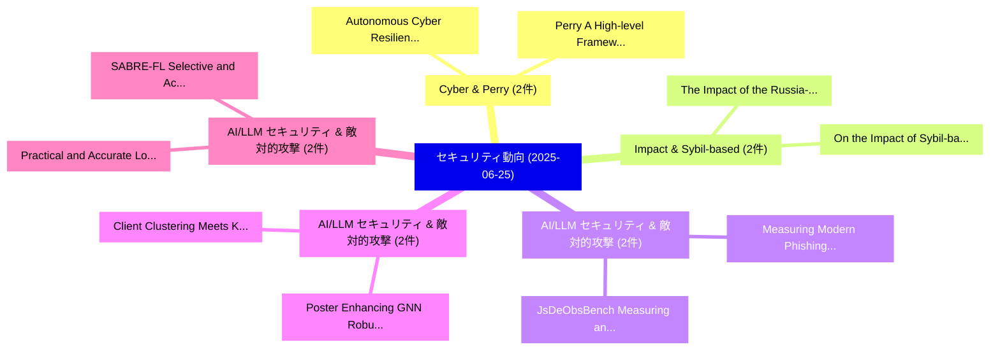

# 📅 02_daily: 日次エグゼクティブサマリー報告書 (2025-06-25)

**集計日時**: 2026-10-02 23:05:31 UTC  
**対象日付**: 2025-06-25  
**本日収集論文数**: 26 件  

---

## 💡 主要セキュリティ動向・脅威インサイト (Executive Insights)

本日の収集論文（計 26 件）において、以下の重点セキュリティ領域で活発な研究動向が確認されました：
- **Cyber & Perry** (2 件): 注目論文として 「Autonomous Cyber Resilience vi...」、「Perry: A High-level Framework ...」 等が発表され、実務防御および攻撃検証の進展が見られます。
- **Impact & Sybil-based** (2 件): 注目論文として 「The Impact of the Russia-Ukrai...」、「On the Impact of Sybil-based A...」 等が発表され、実務防御および攻撃検証の進展が見られます。
- **AI/LLM セキュリティ & 敵対的攻撃** (2 件): 注目論文として 「JsDeObsBench: Measuring and LL...」、「Measuring Modern Phishing Tact...」 等が発表され、実務防御および攻撃検証の進展が見られます。
- **AI/LLM セキュリティ & 敵対的攻撃** (2 件): 注目論文として 「Client Clustering Meets Knowle...」、「Poster: Enhancing GNN Robustne...」 等が発表され、実務防御および攻撃検証の進展が見られます。
- **AI/LLM セキュリティ & 敵対的攻撃** (2 件): 注目論文として 「Practical and Accurate Local E...」、「SABRE-FL: Selective and Accura...」 等が発表され、実務防御および攻撃検証の進展が見られます。

### 🗺️ 技術・脅威トピックマインドマップ

---

## 📌 日次セキュリティ論文一覧 (日本語表形式)

| No | arXiv ID | 論文タイトル (日本語訳) | 重要キーワード | 構造化エグゼクティブ要約 (背景・提案・影響) | 脅威分類 | 詳細リンク |
|---|---|---|---|---|---|---|
| 1 | `2506.20082v1` | [Attack Smarter: Attention-Driven Fine-Grained Webpage Fingerprinting Attacks（セキュリティ分析論文）](../../okf/papers/2025-06-25/2506.20082.md) | `Grained Webpage Fingerprinting Attacks`, `Attack Smarter`, `Driven Fine` | 【提案】概要 (Overview & Key Finding) 本論文「Attack Smarter: Attention-Driven Fine-Grained Webpage F...。実証評価により経営層・セキュリティ管理者向け推奨アクション (E... | `cs.CR` | [arXiv](https://arxiv.org/abs/2506.20082v1) &#124; [OKF](../../okf/papers/2025-06-25/2506.20082.md) |
| 2 | `2506.20101v2` | [Secure Multi-Key Homomorphic Encryption with Application to Privacy-Preserving 連合学習](../../okf/papers/2025-06-25/2506.20101.md) | `Key Homomorphic Encryption`, `Secure Multi`, `Multi-Key Homomorphic` | 【提案】概要 (Overview & Key Finding) 本論文「Secure Multi-Key 準同型暗号 with Application to Privacy-Pres...。実証評価により経営層・セキュリティ管理者向け推奨アクション (E... | `cs.CR` | [arXiv](https://arxiv.org/abs/2506.20101v2) &#124; [OKF](../../okf/papers/2025-06-25/2506.20101.md) |
| 3 | `2506.20102v2` | [Autonomous Cyber Resilience via a Co-Evolutionary Arms Race within a Fortified Digital Twin Sandbox（セキュリティ分析論文）](../../okf/papers/2025-06-25/2506.20102.md) | `Fortified Digital Twin Sandbox`, `Autonomous Cyber Resilience`, `Evolutionary Arms Race` | 【提案】概要 (Overview & Key Finding) 本論文「Autonomous Cyber Resilience via a Co-Evolutionary Arms ...。実証評価により経営層・セキュリティ管理者向け推奨アクション (E... | `cs.CR` | [arXiv](https://arxiv.org/abs/2506.20102v2) &#124; [OKF](../../okf/papers/2025-06-25/2506.20102.md) |
| 4 | `2506.20104v2` | [The Impact of the Russia-Ukraine Conflict on the Cloud Computing Risk Landscape（セキュリティ分析論文）](../../okf/papers/2025-06-25/2506.20104.md) | `Cloud Computing Risk Landscape`, `Ukraine Conflict`, `Russia-Ukraine Conflict` | 【提案】概要 (Overview & Key Finding) 本論文「The Impact of the Russia-Ukraine Conflict on the Cloud ...。実証評価により経営層・セキュリティ管理者向け推奨アクション (E... | `cs.CR` | [arXiv](https://arxiv.org/abs/2506.20104v2) &#124; [OKF](../../okf/papers/2025-06-25/2506.20104.md) |
| 5 | `2506.20109v2` | [Evaluating Disassembly Errors With Only Binaries（セキュリティ分析論文）](../../okf/papers/2025-06-25/2506.20109.md) | `Lambang Akbar Wijayadi`, `Yuancheng Jiang`, `Zhenkai Liang` | 【提案】概要 (Overview & Key Finding) 本論文「Evaluating Disassembly Errors With Only Binaries（セキュリティ...。実証評価によりYap, Zhenkai Liang, Zhuoh... | `cs.CR` | [arXiv](https://arxiv.org/abs/2506.20109v2) &#124; [OKF](../../okf/papers/2025-06-25/2506.20109.md) |
| 6 | `2506.20170v1` | [JsDeObsBench: Measuring and LLMs for JavaScript Deobfuscationのベンチマーク評価](../../okf/papers/2025-06-25/2506.20170.md) | `Guoqiang Chen`, `Xin Jin`, `Zhiqiang Lin` | 【提案】概要 (Overview & Key Finding) 本論文「JsDeObsBench: Measuring and LLMs for JavaScript Deobfus...。実証評価により経営層・セキュリティ管理者向け推奨アクション (E... | `cs.CR` | [arXiv](https://arxiv.org/abs/2506.20170v1) &#124; [OKF](../../okf/papers/2025-06-25/2506.20170.md) |
| 7 | `2506.20187v2` | [Breaking the Boundaries of Long-Context LLM Inference: Adaptive KV Management on a Single Commodity GPU（セキュリティ分析論文）](../../okf/papers/2025-06-25/2506.20187.md) | `Long-Context LLM`, `Single Commodity`, `Li Li` | 【提案】概要 (Overview & Key Finding) 本論文「Breaking the Boundaries of Long-Context LLM Inference: ...。実証評価により経営層・セキュリティ管理者向け推奨アクション (E... | `cs.CR` | [arXiv](https://arxiv.org/abs/2506.20187v2) &#124; [OKF](../../okf/papers/2025-06-25/2506.20187.md) |
| 8 | `2506.20228v1` | [Measuring Modern Phishing Tactics: A Quantitative Study of Body Obfuscation Prevalence, Co-occurrence, and Filter Impact（セキュリティ分析論文）](../../okf/papers/2025-06-25/2506.20228.md) | `Measuring Modern Phishing Tactics`, `Body Obfuscation Prevalence`, `Filter Impact` | 【提案】概要 (Overview & Key Finding) 本論文「Measuring Modern Phishing Tactics: A Quantitative Study...。実証評価により経営層・セキュリティ管理者向け推奨アクション (E... | `cs.CR` | [arXiv](https://arxiv.org/abs/2506.20228v1) &#124; [OKF](../../okf/papers/2025-06-25/2506.20228.md) |
| 9 | `2506.20234v1` | [Communication-Efficient Publication of Sparse Vectors under Differential Privacy（セキュリティ分析論文）](../../okf/papers/2025-06-25/2506.20234.md) | `Efficient Publication`, `Sparse Vectors`, `Differential Privacy` | 【提案】概要 (Overview & Key Finding) 本論文「Communication-Efficient Publication of Sparse Vectors u...。実証評価により経営層・セキュリティ管理者向け推奨アクション (E... | `cs.CR` | [arXiv](https://arxiv.org/abs/2506.20234v1) &#124; [OKF](../../okf/papers/2025-06-25/2506.20234.md) |
| 10 | `2506.20290v1` | [Don't Hash Me Like That: Exposing and Mitigating Hash-Induced Unfairness in Local Differential Privacy（セキュリティ分析論文）](../../okf/papers/2025-06-25/2506.20290.md) | `Local Differential Privacy`, `Mitigating Hash`, `Induced Unfairness` | 【提案】概要 (Overview & Key Finding) 本論文「Don't Hash Me Like That: Exposing and Mitigating Hash-I...。実証評価により経営層・セキュリティ管理者向け推奨アクション (E... | `cs.CR` | [arXiv](https://arxiv.org/abs/2506.20290v1) &#124; [OKF](../../okf/papers/2025-06-25/2506.20290.md) |
| 11 | `2506.20413v2` | [Client Clustering Meets Knowledge Sharing: Enhancing Privacy and Robustness in Personalized Peer-to-Peer Learning（セキュリティ分析論文）](../../okf/papers/2025-06-25/2506.20413.md) | `Client Clustering Meets Knowledge Sharing`, `Enhancing Privacy`, `Personalized Peer` | 【提案】概要 (Overview & Key Finding) 本論文「Client Clustering Meets Knowledge Sharing: Enhancing Pr...。実証評価により経営層・セキュリティ管理者向け推奨アクション (E... | `cs.CR` | [arXiv](https://arxiv.org/abs/2506.20413v2) &#124; [OKF](../../okf/papers/2025-06-25/2506.20413.md) |
| 12 | `2506.20415v1` | [SV-LLM: An Agentic Approach for SoC Security Verification using 大規模言語モデル](../../okf/papers/2025-06-25/2506.20415.md) | `Security Verification`, `Large Language Models`, `Hasan Al Shaikh` | 【提案】概要 (Overview & Key Finding) 本論文「SV-LLM: An Agentic Approach for SoC Security Verificati...。実証評価により経営層・セキュリティ管理者向け推奨アクション (E... | `cs.CR` | [arXiv](https://arxiv.org/abs/2506.20415v1) &#124; [OKF](../../okf/papers/2025-06-25/2506.20415.md) |
| 13 | `2506.20444v2` | [Smart Cuts: Enhance Active Learning for 脆弱性検出 by Pruning Hard-to-Learn Data](../../okf/papers/2025-06-25/2506.20444.md) | `Enhance Active Learning`, `Smart Cuts`, `Pruning Hard` | 【提案】概要 (Overview & Key Finding) 本論文「Smart Cuts: Enhance Active Learning for 脆弱性検出 by Prunin...。実証評価により経営層・セキュリティ管理者向け推奨アクション (E... | `cs.CR` | [arXiv](https://arxiv.org/abs/2506.20444v2) &#124; [OKF](../../okf/papers/2025-06-25/2506.20444.md) |
| 14 | `2506.20481v1` | [Counterfactual Influence as a Distributional Quantity（セキュリティ分析論文）](../../okf/papers/2025-06-25/2506.20481.md) | `Counterfactual Influence`, `Distributional Quantity`, `Matthieu Meeus` | 【提案】概要 (Overview & Key Finding) 本論文「Counterfactual Influence as a Distributional Quantity（セ...。実証評価により経営層・セキュリティ管理者向け推奨アクション (E... | `cs.CR` | [arXiv](https://arxiv.org/abs/2506.20481v1) &#124; [OKF](../../okf/papers/2025-06-25/2506.20481.md) |
| 15 | `2506.20488v1` | [Generative AI for 脆弱性検出 in 6G Wireless Networks: Advances, Case Study, and Future Directions](../../okf/papers/2025-06-25/2506.20488.md) | `Wireless Networks`, `Future Directions`, `Vulnerability Detection` | 【提案】概要 (Overview & Key Finding) 本論文「Generative AI for 脆弱性検出 in 6G Wireless Networks: Advanc...。実証評価により経営層・セキュリティ管理者向け推奨アクション (E... | `cs.CR` | [arXiv](https://arxiv.org/abs/2506.20488v1) &#124; [OKF](../../okf/papers/2025-06-25/2506.20488.md) |
| 16 | `2506.20576v1` | [Vulnerability Disclosure through Adaptive Black-Box NIDSに対する敵対的攻撃](../../okf/papers/2025-06-25/2506.20576.md) | `Vulnerability Disclosure`, `Adaptive Black`, `Box Adversarial Attacks` | 【提案】概要 (Overview & Key Finding) 本論文「脆弱性 Disclosure through Adaptive Black-Box NIDSに対する敵対的攻撃...。実証評価によりMancini - **公開日時**: `2025... | `cs.CR` | [arXiv](https://arxiv.org/abs/2506.20576v1) &#124; [OKF](../../okf/papers/2025-06-25/2506.20576.md) |
| 17 | `2506.20585v1` | [On the Impact of Sybil-based Attacks on Mobile Crowdsensing for Transportation（セキュリティ分析論文）](../../okf/papers/2025-06-25/2506.20585.md) | `Mobile Crowdsensing`, `Sybil-based Attacks`, `Zahra Alimadadi` | 【提案】概要 (Overview & Key Finding) 本論文「On the Impact of Sybil-based Attacks on Mobile Crowdsen...。実証評価により経営層・セキュリティ管理者向け推奨アクション (E... | `cs.CR` | [arXiv](https://arxiv.org/abs/2506.20585v1) &#124; [OKF](../../okf/papers/2025-06-25/2506.20585.md) |
| 18 | `2506.20651v1` | [Hear No Evil: Detecting Gradient Leakage by Malicious Servers in 連合学習](../../okf/papers/2025-06-25/2506.20651.md) | `Detecting Gradient Leakage`, `Malicious Servers`, `Federated Learning` | 【提案】概要 (Overview & Key Finding) 本論文「Hear No Evil: Detecting Gradient Leakage by Malicious S...。実証評価により経営層・セキュリティ管理者向け推奨アクション (E... | `cs.CR` | [arXiv](https://arxiv.org/abs/2506.20651v1) &#124; [OKF](../../okf/papers/2025-06-25/2506.20651.md) |
| 19 | `2506.20770v2` | [Perry: A High-level Framework for Accelerating Cyber Deception Experimentation（セキュリティ分析論文）](../../okf/papers/2025-06-25/2506.20770.md) | `Accelerating Cyber Deception Experimentation`, `Brian Singer`, `Yusuf Saquib` | 【提案】概要 (Overview & Key Finding) 本論文「Perry: A High-level Framework for Accelerating Cyber De...。実証評価により経営層・セキュリティ管理者向け推奨アクション (E... | `cs.CR` | [arXiv](https://arxiv.org/abs/2506.20770v2) &#124; [OKF](../../okf/papers/2025-06-25/2506.20770.md) |
| 20 | `2506.20800v1` | [SIMulator: SIM Tracing on a (Pico-)Budget（セキュリティ分析論文）](../../okf/papers/2025-06-25/2506.20800.md) | `Adrian Dabrowski`, `Raw Meta`, `Executive Summary` | 【提案】概要 (Overview & Key Finding) 本論文「SIMulator: SIM Tracing on a (Pico-)Budget（セキュリティ分析論文）」（...。実証評価によりFrenzel, Adrian Dabrowski... | `cs.CR` | [arXiv](https://arxiv.org/abs/2506.20800v1) &#124; [OKF](../../okf/papers/2025-06-25/2506.20800.md) |
| 21 | `2506.20806v1` | [Poster: Enhancing GNN Robustness for Network Intrusion Detection via Agent-based Analysis（セキュリティ分析論文）](../../okf/papers/2025-06-25/2506.20806.md) | `Network Intrusion Detection`, `Network Intrusion Detecti`, `Zhonghao Zhan` | 【提案】概要 (Overview & Key Finding) 本論文「Poster: Enhancing GNN Robustness for Network Intrusion ...。実証評価により経営層・セキュリティ管理者向け推奨アクション (E... | `cs.CR` | [arXiv](https://arxiv.org/abs/2506.20806v1) &#124; [OKF](../../okf/papers/2025-06-25/2506.20806.md) |
| 22 | `2506.20816v1` | [Universal and Efficient Adversarial Data through Nonuniform Impact on Network Layersの検出](../../okf/papers/2025-06-25/2506.20816.md) | `Nonuniform Impact`, `Efficient Adversarial Data`, `Efficient Detection` | 【提案】概要 (Overview & Key Finding) 本論文「Universal and Efficient Adversarial Data through Nonuni...。実証評価により経営層・セキュリティ管理者向け推奨アクション (E... | `cs.CR` | [arXiv](https://arxiv.org/abs/2506.20816v1) &#124; [OKF](../../okf/papers/2025-06-25/2506.20816.md) |
| 23 | `2506.20828v3` | [Practical and Accurate Local Edge Differentially Private Graph Algorithms（セキュリティ分析論文）](../../okf/papers/2025-06-25/2506.20828.md) | `Accurate Local Edge Differentially Private Graph Algorithms`, `Pranay Mundra`, `Charalampos Papamanthou` | 【提案】概要 (Overview & Key Finding) 本論文「Practical and Accurate Local Edge Differentially Privat...。実証評価により経営層・セキュリティ管理者向け推奨アクション (E... | `cs.CR` | [arXiv](https://arxiv.org/abs/2506.20828v3) &#124; [OKF](../../okf/papers/2025-06-25/2506.20828.md) |
| 24 | `2506.20856v1` | [Leaner Training, Lower Leakage: Revisiting Memorization in LLM Fine-Tuning with LoRA（セキュリティ分析論文）](../../okf/papers/2025-06-25/2506.20856.md) | `Leaner Training`, `Lower Leakage`, `Revisiting Memorization` | 【提案】概要 (Overview & Key Finding) 本論文「Leaner Training, Lower Leakage: Revisiting Memorization...。実証評価により経営層・セキュリティ管理者向け推奨アクション (E... | `cs.CR` | [arXiv](https://arxiv.org/abs/2506.20856v1) &#124; [OKF](../../okf/papers/2025-06-25/2506.20856.md) |
| 25 | `2506.20872v1` | [Empowering Digital Agriculture: A Privacy-Preserving Framework for Data Sharing and Collaborative Research（セキュリティ分析論文）](../../okf/papers/2025-06-25/2506.20872.md) | `Empowering Digital Agriculture`, `Data Sharing`, `Collaborative Research` | 【提案】概要 (Overview & Key Finding) 本論文「Empowering Digital Agriculture: A Privacy-Preserving Fr...。実証評価により経営層・セキュリティ管理者向け推奨アクション (E... | `cs.CR` | [arXiv](https://arxiv.org/abs/2506.20872v1) &#124; [OKF](../../okf/papers/2025-06-25/2506.20872.md) |
| 26 | `2506.22506v2` | [SABRE-FL: Selective and Accurate Backdoor Rejection for Federated Prompt Learning（セキュリティ分析論文）](../../okf/papers/2025-06-25/2506.22506.md) | `Accurate Backdoor Rejection`, `Federated Prompt Learning`, `Momin Ahmad Khan` | 【提案】概要 (Overview & Key Finding) 本論文「SABRE-FL: Selective and Accurate Backdoor Rejection for...。実証評価により経営層・セキュリティ管理者向け推奨アクション (E... | `cs.CR` | [arXiv](https://arxiv.org/abs/2506.22506v2) &#124; [OKF](../../okf/papers/2025-06-25/2506.22506.md) |

