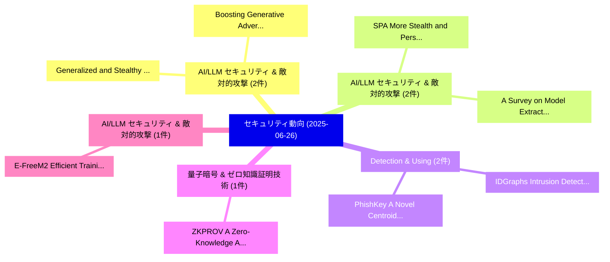

# 📅 02_daily: 日次エグゼクティブサマリー報告書 (2025-06-26)

**集計日時**: 2026-10-02 23:05:31 UTC  
**対象日付**: 2025-06-26  
**本日収集論文数**: 17 件  

---

## 💡 主要セキュリティ動向・脅威インサイト (Executive Insights)

本日の収集論文（計 17 件）において、以下の重点セキュリティ領域で活発な研究動向が確認されました：
- **AI/LLM セキュリティ & 敵対的攻撃** (2 件): 注目論文として 「Generalized and Stealthy Water...」、「Boosting Generative Adversaria...」 等が発表され、実務防御および攻撃検証の進展が見られます。
- **AI/LLM セキュリティ & 敵対的攻撃** (2 件): 注目論文として 「SPA: More Stealth and Persiste...」、「A Survey on Model Extraction A...」 等が発表され、実務防御および攻撃検証の進展が見られます。
- **Detection & Using** (2 件): 注目論文として 「PhishKey: A Novel Centroid-Bas...」、「IDGraphs: Intrusion Detection ...」 等が発表され、実務防御および攻撃検証の進展が見られます。
- **量子暗号 & ゼロ知識証明技術** (1 件): 注目論文として 「ZKPROV: A Zero-Knowledge Appro...」 等が発表され、実務防御および攻撃検証の進展が見られます。
- **AI/LLM セキュリティ & 敵対的攻撃** (1 件): 注目論文として 「E-FreeM2: Efficient Training-F...」 等が発表され、実務防御および攻撃検証の進展が見られます。

### 🗺️ 技術・脅威トピックマインドマップ

---

## 📌 日次セキュリティ論文一覧 (日本語表形式)

| No | arXiv ID | 論文タイトル (日本語訳) | 重要キーワード | 構造化エグゼクティブ要約 (背景・提案・影響) | 脅威分類 | 詳細リンク |
|---|---|---|---|---|---|---|
| 1 | `2506.20915v2` | [ZKPROV: A Zero-Knowledge Approach to Dataset Provenance for 大規模言語モデル](../../okf/papers/2025-06-26/2506.20915.md) | `Dataset Provenance`, `Large Language Models`, `Mina Namazi` | 【提案】概要 (Overview & Key Finding) 本論文「ZKPROV: A Zero-Knowledge Approach to Dataset Provenance...。実証評価により経営層・セキュリティ管理者向け推奨アクション (E... | `cs.CR` | [arXiv](https://arxiv.org/abs/2506.20915v2) &#124; [OKF](../../okf/papers/2025-06-26/2506.20915.md) |
| 2 | `2506.20926v2` | [Generalized and Stealthy Watermarking for Generative Code Modelsに向けて](../../okf/papers/2025-06-26/2506.20926.md) | `Stealthy Watermarking`, `Generative Code Models`, `Towards Generalized` | 【提案】概要 (Overview & Key Finding) 本論文「Generalized and Stealthy Watermarking for Generative Co...。実証評価により経営層・セキュリティ管理者向け推奨アクション (E... | `cs.CR` | [arXiv](https://arxiv.org/abs/2506.20926v2) &#124; [OKF](../../okf/papers/2025-06-26/2506.20926.md) |
| 3 | `2506.20931v1` | [SPA: More Stealth and Persistent Backdoor Attacks in Federated Learningに向けて](../../okf/papers/2025-06-26/2506.20931.md) | `Persistent Backdoor Attacks`, `Federated Learning`, `Chengcheng Zhu` | 【提案】概要 (Overview & Key Finding) 本論文「SPA: More Stealth and Persistent Backdoor Attacks in Fe...。実証評価により経営層・セキュリティ管理者向け推奨アクション (E... | `cs.CR` | [arXiv](https://arxiv.org/abs/2506.20931v1) &#124; [OKF](../../okf/papers/2025-06-26/2506.20931.md) |
| 4 | `2506.20944v1` | [E-FreeM2: Efficient Training-Free Multi-Scale and Cross-Modal News Verification via MLLMs（セキュリティ分析論文）](../../okf/papers/2025-06-26/2506.20944.md) | `Modal News Verification`, `Efficient Training`, `Free Multi` | 【提案】概要 (Overview & Key Finding) 本論文「E-FreeM2: Efficient Training-Free Multi-Scale and Cross...。実証評価により経営層・セキュリティ管理者向け推奨アクション (E... | `cs.CR` | [arXiv](https://arxiv.org/abs/2506.20944v1) &#124; [OKF](../../okf/papers/2025-06-26/2506.20944.md) |
| 5 | `2506.20965v1` | [Rational Miner Behaviour, Protocol Stability, and Time Preference: An Austrian and Game-Theoretic Bitcoin's Incentive Environmentの分析](../../okf/papers/2025-06-26/2506.20965.md) | `Rational Miner Behaviour`, `Protocol Stability`, `Time Preference` | 【提案】概要 (Overview & Key Finding) 本論文「Rational Miner Behaviour, Protocol Stability, and Time ...。実証評価により経営層・セキュリティ管理者向け推奨アクション (E... | `cs.CR` | [arXiv](https://arxiv.org/abs/2506.20965v1) &#124; [OKF](../../okf/papers/2025-06-26/2506.20965.md) |
| 6 | `2506.20981v1` | [PrivacyGo: Privacy-Preserving Ad Measurement with Multidimensional Intersection（セキュリティ分析論文）](../../okf/papers/2025-06-26/2506.20981.md) | `Preserving Ad Measurement`, `Multidimensional Intersection`, `Privacy-Preserving Ad` | 【提案】概要 (Overview & Key Finding) 本論文「PrivacyGo: Privacy-Preserving Ad Measurement with Multi...。実証評価により経営層・セキュリティ管理者向け推奨アクション (E... | `cs.CR` | [arXiv](https://arxiv.org/abs/2506.20981v1) &#124; [OKF](../../okf/papers/2025-06-26/2506.20981.md) |
| 7 | `2506.21046v2` | [Boosting Generative Adversarial Transferability with Self-supervised Vision Transformer Features（セキュリティ分析論文）](../../okf/papers/2025-06-26/2506.21046.md) | `Boosting Generative Adversarial Transferability`, `Vision Transformer Features`, `Self-supervised Vision` | 【提案】概要 (Overview & Key Finding) 本論文「Boosting Generative Adversarial Transferability with Se...。実証評価により経営層・セキュリティ管理者向け推奨アクション (E... | `cs.CR` | [arXiv](https://arxiv.org/abs/2506.21046v2) &#124; [OKF](../../okf/papers/2025-06-26/2506.21046.md) |
| 8 | `2506.21069v1` | [TEMPEST-LoRa: Cross-Technology Covert Communication（セキュリティ分析論文）](../../okf/papers/2025-06-26/2506.21069.md) | `Technology Covert Communication`, `Cross-Technology Covert`, `Xieyang Sun` | 【提案】概要 (Overview & Key Finding) 本論文「TEMPEST-LoRa: Cross-Technology Covert Communication（セキュ...。実証評価により経営層・セキュリティ管理者向け推奨アクション (E... | `cs.CR` | [arXiv](https://arxiv.org/abs/2506.21069v1) &#124; [OKF](../../okf/papers/2025-06-26/2506.21069.md) |
| 9 | `2506.21106v1` | [PhishKey: A Novel Centroid-Based Approach for Enhanced Phishing Detection Using Adaptive HTML Component Extraction（セキュリティ分析論文）](../../okf/papers/2025-06-26/2506.21106.md) | `Enhanced Phishing Detection Using Adaptive`, `Component Extraction`, `Eduardo Fidalgo` | 【提案】概要 (Overview & Key Finding) 本論文「PhishKey: A Novel Centroid-Based Approach for Enhanced ...。実証評価により経営層・セキュリティ管理者向け推奨アクション (E... | `cs.CR` | [arXiv](https://arxiv.org/abs/2506.21106v1) &#124; [OKF](../../okf/papers/2025-06-26/2506.21106.md) |
| 10 | `2506.21114v4` | [Polynomial Fingerprinting for Trees and Formulas（セキュリティ分析論文）](../../okf/papers/2025-06-26/2506.21114.md) | `Polynomial Fingerprinting`, `Mihai Prunescu`, `Raw Meta` | 【提案】概要 (Overview & Key Finding) 本論文「Polynomial Fingerprinting for Trees and Formulas（セキュリティ...。実証評価により経営層・セキュリティ管理者向け推奨アクション (E... | `cs.CR` | [arXiv](https://arxiv.org/abs/2506.21114v4) &#124; [OKF](../../okf/papers/2025-06-26/2506.21114.md) |
| 11 | `2506.21134v1` | [Inside Job: Defending Kubernetes Clusters Against Network Misconfigurations（セキュリティ分析論文）](../../okf/papers/2025-06-26/2506.21134.md) | `Inside Job`, `Jose Luis Martin`, `Mario Di Francesco` | 【提案】概要 (Overview & Key Finding) 本論文「Inside Job: Defending Kubernetes Clusters Against Netwo...。実証評価により経営層・セキュリティ管理者向け推奨アクション (E... | `cs.CR` | [arXiv](https://arxiv.org/abs/2506.21134v1) &#124; [OKF](../../okf/papers/2025-06-26/2506.21134.md) |
| 12 | `2506.21308v2` | [Balancing Privacy and Utility in Correlated Data: A Study of Bayesian Differential Privacy（セキュリティ分析論文）](../../okf/papers/2025-06-26/2506.21308.md) | `Bayesian Differential Privacy`, `Balancing Privacy`, `Correlated Data` | 【提案】概要 (Overview & Key Finding) 本論文「Balancing Privacy and Utility in Correlated Data: A Stu...。実証評価により経営層・セキュリティ管理者向け推奨アクション (E... | `cs.CR` | [arXiv](https://arxiv.org/abs/2506.21308v2) &#124; [OKF](../../okf/papers/2025-06-26/2506.21308.md) |
| 13 | `2506.21425v1` | [IDGraphs: Intrusion Detection and Analysis Using Stream Compositing（セキュリティ分析論文）](../../okf/papers/2025-06-26/2506.21425.md) | `Intrusion Detection`, `Pin Ren`, `Yan Gao` | 【提案】概要 (Overview & Key Finding) 本論文「IDGraphs: Intrusion Detection and Analysis Using Stream...。実証評価により経営層・セキュリティ管理者向け推奨アクション (E... | `cs.CR` | [arXiv](https://arxiv.org/abs/2506.21425v1) &#124; [OKF](../../okf/papers/2025-06-26/2506.21425.md) |
| 14 | `2506.21688v3` | [CyGym: A Simulation-Based Game-Theoretic Analysis Framework for サイバーセキュリティ](../../okf/papers/2025-06-26/2506.21688.md) | `Based Game`, `Simulation-Based Game`, `Michael Lanier` | 【提案】概要 (Overview & Key Finding) 本論文「CyGym: A Simulation-Based Game-Theoretic Analysis Frame...。実証評価により経営層・セキュリティ管理者向け推奨アクション (E... | `cs.CR` | [arXiv](https://arxiv.org/abs/2506.21688v3) &#124; [OKF](../../okf/papers/2025-06-26/2506.21688.md) |
| 15 | `2506.22515v1` | [In-context learning for the classification of manipulation techniques in phishing emails（セキュリティ分析論文）](../../okf/papers/2025-06-26/2506.22515.md) | `In-context learning`, `Antony Dalmiere`, `Guillaume Auriol` | 【提案】概要 (Overview & Key Finding) 本論文「In-context learning for the classification of manipulat...。実証評価により経営層・セキュリティ管理者向け推奨アクション (E... | `cs.CR` | [arXiv](https://arxiv.org/abs/2506.22515v1) &#124; [OKF](../../okf/papers/2025-06-26/2506.22515.md) |
| 16 | `2506.22521v1` | [A Survey on Model Extraction Attacks and Defenses for 大規模言語モデル](../../okf/papers/2025-06-26/2506.22521.md) | `Model Extraction Attacks`, `Large Language Models`, `Neil Zhenqiang Gong` | 【提案】概要 (Overview & Key Finding) 本論文「A Survey on Model Extraction Attacks and Defenses for 大...。実証評価により経営層・セキュリティ管理者向け推奨アクション (E... | `cs.CR` | [arXiv](https://arxiv.org/abs/2506.22521v1) &#124; [OKF](../../okf/papers/2025-06-26/2506.22521.md) |
| 17 | `2507.21092v1` | [The Discovery, Disclosure, and Investigation of CVE-2024-25825（セキュリティ分析論文）](../../okf/papers/2025-06-26/2507.21092.md) | `Hunter Chasens`, `Raw Meta`, `Executive Summary` | 【提案】概要 (Overview & Key Finding) 本論文「The Discovery, Disclosure, and Investigation of CVE-202...。実証評価により経営層・セキュリティ管理者向け推奨アクション (E... | `cs.CR` | [arXiv](https://arxiv.org/abs/2507.21092v1) &#124; [OKF](../../okf/papers/2025-06-26/2507.21092.md) |

