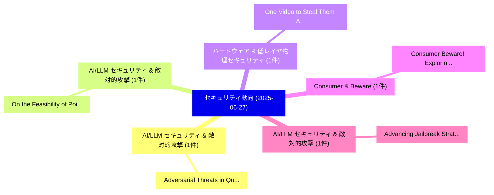

# 📅 02_daily: 日次エグゼクティブサマリー報告書 (2025-06-27)

**集計日時**: 2026-10-02 23:05:31 UTC  
**対象日付**: 2025-06-27  
**本日収集論文数**: 15 件  

---

## 💡 主要セキュリティ動向・脅威インサイト (Executive Insights)

本日の収集論文（計 15 件）において、以下の重点セキュリティ領域で活発な研究動向が確認されました：
- **AI/LLM セキュリティ & 敵対的攻撃** (1 件): 注目論文として 「Adversarial Threats in Quantum...」 等が発表され、実務防御および攻撃検証の進展が見られます。
- **AI/LLM セキュリティ & 敵対的攻撃** (1 件): 注目論文として 「On the Feasibility of Poisonin...」 等が発表され、実務防御および攻撃検証の進展が見られます。
- **ハードウェア & 低レイヤ物理セキュリティ** (1 件): 注目論文として 「One Video to Steal Them All: 3...」 等が発表され、実務防御および攻撃検証の進展が見られます。
- **Consumer & Beware** (1 件): 注目論文として 「Consumer Beware! Exploring Dat...」 等が発表され、実務防御および攻撃検証の進展が見られます。
- **AI/LLM セキュリティ & 敵対的攻撃** (1 件): 注目論文として 「Advancing Jailbreak Strategies...」 等が発表され、実務防御および攻撃検証の進展が見られます。

### 🗺️ 技術・脅威トピックマインドマップ

---

## 📌 日次セキュリティ論文一覧 (日本語表形式)

| No | arXiv ID | 論文タイトル (日本語訳) | 重要キーワード | 構造化エグゼクティブ要約 (背景・提案・影響) | 脅威分類 | 詳細リンク |
|---|---|---|---|---|---|---|
| 1 | `2506.21842v1` | [Adversarial Threats in Quantum Machine Learning: A Survey of Attacks and Defenses（セキュリティ分析論文）](../../okf/papers/2025-06-27/2506.21842.md) | `Quantum Machine Learning`, `Adversarial Threats`, `Archisman Ghosh` | 【提案】概要 (Overview & Key Finding) 本論文「Adversarial Threats in 量子 Machine Learning: A Survey of...。実証評価により経営層・セキュリティ管理者向け推奨アクション (E... | `cs.CR` | [arXiv](https://arxiv.org/abs/2506.21842v1) &#124; [OKF](../../okf/papers/2025-06-27/2506.21842.md) |
| 2 | `2506.21874v1` | [On the Feasibility of Poisoning Text-to-Image AI Models via Adversarial Mislabeling（セキュリティ分析論文）](../../okf/papers/2025-06-27/2506.21874.md) | `Poisoning Text`, `Adversarial Mislabeling`, `Anna Yoo Jeong Ha` | 【提案】概要 (Overview & Key Finding) 本論文「On the Feasibility of Poisoning Text-to-Image AI Models...。実証評価により経営層・セキュリティ管理者向け推奨アクション (E... | `cs.CR` | [arXiv](https://arxiv.org/abs/2506.21874v1) &#124; [OKF](../../okf/papers/2025-06-27/2506.21874.md) |
| 3 | `2506.21897v1` | [One Video to Steal Them All: 3D-Printing IP Theft through Optical Side-Channels（セキュリティ分析論文）](../../okf/papers/2025-06-27/2506.21897.md) | `One Video`, `Optical Side`, `3D-Printing IP` | 【提案】概要 (Overview & Key Finding) 本論文「One Video to Steal Them All: 3D-Printing IP Theft throu...。実証評価により経営層・セキュリティ管理者向け推奨アクション (E... | `cs.CR` | [arXiv](https://arxiv.org/abs/2506.21897v1) &#124; [OKF](../../okf/papers/2025-06-27/2506.21897.md) |
| 4 | `2506.21914v2` | [Consumer Beware! Exploring Data Brokers' CCPA Compliance（セキュリティ分析論文）](../../okf/papers/2025-06-27/2506.21914.md) | `Exploring Data Brokers`, `Consumer Beware`, `Isita Bagayatkar` | 【提案】Exploring Data Brokers' CCPA Compliance ### (日本語題名: Consumer Beware!。実証評価により経営層・セキュリティ管理者向け推奨アクション (Executive Recommendatio... | `cs.CR` | [arXiv](https://arxiv.org/abs/2506.21914v2) &#124; [OKF](../../okf/papers/2025-06-27/2506.21914.md) |
| 5 | `2506.21972v1` | [Advancing Jailbreak Strategies: A Hybrid Approach to Exploiting LLM Vulnerabilities and Bypassing Modern Defenses（セキュリティ分析論文）](../../okf/papers/2025-06-27/2506.21972.md) | `Advancing Jailbreak Strategies`, `Bypassing Modern Defenses`, `Mohamed Ahmed` | 【提案】概要 (Overview & Key Finding) 本論文「Advancing ジェイルブレイク Strategies: A Hybrid Approach to Exp...。実証評価により経営層・セキュリティ管理者向け推奨アクション (E... | `cs.CR` | [arXiv](https://arxiv.org/abs/2506.21972v1) &#124; [OKF](../../okf/papers/2025-06-27/2506.21972.md) |
| 6 | `2506.21988v2` | [Unifying communication paradigms in measurement-based delegated quantum computing（セキュリティ分析論文）](../../okf/papers/2025-06-27/2506.21988.md) | `measurement-based delegated`, `Fabian Wiesner`, `Jens Eisert` | 【提案】概要 (Overview & Key Finding) 本論文「Unifying communication paradigms in measurement-based d...。実証評価により経営層・セキュリティ管理者向け推奨アクション (E... | `cs.CR` | [arXiv](https://arxiv.org/abs/2506.21988v2) &#124; [OKF](../../okf/papers/2025-06-27/2506.21988.md) |
| 7 | `2506.22089v2` | [Pseudo-Equilibria, or: How to Stop Worrying About Crypto and Just Analyze the Game（セキュリティ分析論文）](../../okf/papers/2025-06-27/2506.22089.md) | `Alexandros Psomas`, `Athina Terzoglou`, `Yu Wei` | 【提案】概要 (Overview & Key Finding) 本論文「Pseudo-Equilibria, or: How to Stop Worrying About Crypt...。実証評価により経営層・セキュリティ管理者向け推奨アクション (E... | `cs.CR` | [arXiv](https://arxiv.org/abs/2506.22089v2) &#124; [OKF](../../okf/papers/2025-06-27/2506.22089.md) |
| 8 | `2506.22180v1` | [Reliability Smart Contract Execution Architectures: A Comparative Simulation Studyの分析](../../okf/papers/2025-06-27/2506.22180.md) | `Reliability Smart Contract Execution Architectures`, `Smart Contract Execution Architectures`, `Comparative Simulation` | 【提案】概要 (Overview & Key Finding) 本論文「Reliability スマートコントラクト Execution Architectures: A Compa...。実証評価により経営層・セキュリティ管理者向け推奨アクション (E... | `cs.CR` | [arXiv](https://arxiv.org/abs/2506.22180v1) &#124; [OKF](../../okf/papers/2025-06-27/2506.22180.md) |
| 9 | `2506.22311v2` | [WaLi: Can Pressure Sensors in HVAC Systems Capture Human Speech?（セキュリティ分析論文）](../../okf/papers/2025-06-27/2506.22311.md) | `Systems Capture Human Speech`, `Can Pressure Sensors`, `Tarikul Islam Tamiti` | 【提案】### (日本語題名: WaLi: Can Pressure Sensors in HVAC Systems Capture Human Speech?（セキュリティ分析論文...。実証評価により経営層・セキュリティ管理者向け推奨アクション (E... | `cs.CR` | [arXiv](https://arxiv.org/abs/2506.22311v2) &#124; [OKF](../../okf/papers/2025-06-27/2506.22311.md) |
| 10 | `2506.22323v1` | [Under the Hood of BlotchyQuasar: DLL-Based RAT Campaigns Against Latin America（セキュリティ分析論文）](../../okf/papers/2025-06-27/2506.22323.md) | `DLL-Based RAT`, `Alessio Di Santo`, `Raw Meta` | 【提案】概要 (Overview & Key Finding) 本論文「Under the Hood of BlotchyQuasar: DLL-Based RAT Campaign...。実証評価により経営層・セキュリティ管理者向け推奨アクション (E... | `cs.CR` | [arXiv](https://arxiv.org/abs/2506.22323v1) &#124; [OKF](../../okf/papers/2025-06-27/2506.22323.md) |
| 11 | `2506.22423v2` | [ARMOR: Robust Reinforcement Learning-based Control for UAVs under Physical Attacks（セキュリティ分析論文）](../../okf/papers/2025-06-27/2506.22423.md) | `Robust Reinforcement Learning`, `Learning-based Control`, `Physical Attacks` | 【提案】概要 (Overview & Key Finding) 本論文「ARMOR: Robust Reinforcement Learning-based Control for ...。実証評価により経営層・セキュリティ管理者向け推奨アクション (E... | `cs.CR` | [arXiv](https://arxiv.org/abs/2506.22423v2) &#124; [OKF](../../okf/papers/2025-06-27/2506.22423.md) |
| 12 | `2506.22557v2` | [MetaCipher: A Time-Persistent and Universal Multi-Agent Framework for Cipher-Based Jailbreak Attacks for LLMs（セキュリティ分析論文）](../../okf/papers/2025-06-27/2506.22557.md) | `Based Jailbreak Attacks`, `Universal Multi`, `Cipher-Based Jailbreak` | 【提案】概要 (Overview & Key Finding) 本論文「MetaCipher: A Time-Persistent and Universal Multi-Agent...。実証評価により経営層・セキュリティ管理者向け推奨アクション (E... | `cs.CR` | [arXiv](https://arxiv.org/abs/2506.22557v2) &#124; [OKF](../../okf/papers/2025-06-27/2506.22557.md) |
| 13 | `2506.22606v2` | [A User-Centric, Privacy-Preserving, and Verifiable Ecosystem for Personal Data Management and Utilization（セキュリティ分析論文）](../../okf/papers/2025-06-27/2506.22606.md) | `Personal Data Management`, `Verifiable Ecosystem`, `Osama Zafar` | 【提案】概要 (Overview & Key Finding) 本論文「A User-Centric, Privacy-Preserving, and Verifiable Ecos...。実証評価により経営層・セキュリティ管理者向け推奨アクション (E... | `cs.CR` | [arXiv](https://arxiv.org/abs/2506.22606v2) &#124; [OKF](../../okf/papers/2025-06-27/2506.22606.md) |
| 14 | `2506.22639v1` | [Fingerprinting SDKs for Mobile Apps and Where to Find Them: Understanding the Market for Device Fingerprinting（セキュリティ分析論文）](../../okf/papers/2025-06-27/2506.22639.md) | `Mobile Apps`, `Device Fingerprinting`, `Mihai Christodorescu` | 【提案】概要 (Overview & Key Finding) 本論文「Fingerprinting SDKs for Mobile Apps and Where to Find T...。実証評価により経営層・セキュリティ管理者向け推奨アクション (E... | `cs.CR` | [arXiv](https://arxiv.org/abs/2506.22639v1) &#124; [OKF](../../okf/papers/2025-06-27/2506.22639.md) |
| 15 | `2506.22666v3` | [VERA: Variational Inference Framework for Jailbreaking 大規模言語モデル](../../okf/papers/2025-06-27/2506.22666.md) | `Jailbreaking Large Language Models`, `Anamika Lochab`, `Lu Yan` | 【提案】概要 (Overview & Key Finding) 本論文「VERA: Variational Inference Framework for ジェイルブレイクing 大...。実証評価により経営層・セキュリティ管理者向け推奨アクション (E... | `cs.CR` | [arXiv](https://arxiv.org/abs/2506.22666v3) &#124; [OKF](../../okf/papers/2025-06-27/2506.22666.md) |

