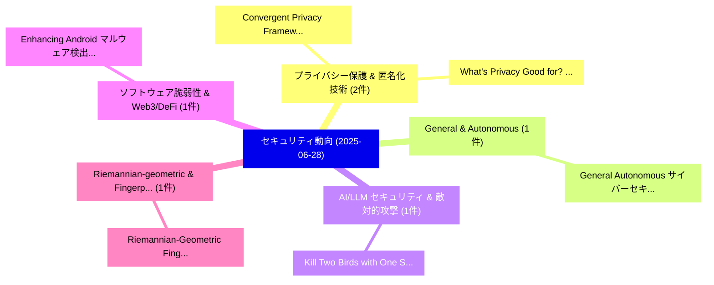

# 📅 02_daily: 日次エグゼクティブサマリー報告書 (2025-06-28)

**集計日時**: 2026-10-02 23:05:31 UTC  
**対象日付**: 2025-06-28  
**本日収集論文数**: 10 件  

---

## 💡 主要セキュリティ動向・脅威インサイト (Executive Insights)

本日の収集論文（計 10 件）において、以下の重点セキュリティ領域で活発な研究動向が確認されました：
- **プライバシー保護 & 匿名化技術** (2 件): 注目論文として 「Convergent Privacy Framework f...」、「What's Privacy Good for? Measu...」 等が発表され、実務防御および攻撃検証の進展が見られます。
- **General & Autonomous** (1 件): 注目論文として 「General Autonomous サイバーセキュリティ ...」 等が発表され、実務防御および攻撃検証の進展が見られます。
- **AI/LLM セキュリティ & 敵対的攻撃** (1 件): 注目論文として 「Kill Two Birds with One Stone!...」 等が発表され、実務防御および攻撃検証の進展が見られます。
- **ソフトウェア脆弱性 & Web3/DeFi** (1 件): 注目論文として 「Enhancing Android マルウェア検出 with...」 等が発表され、実務防御および攻撃検証の進展が見られます。
- **Riemannian-geometric & Fingerprints** (1 件): 注目論文として 「Riemannian-Geometric Fingerpri...」 等が発表され、実務防御および攻撃検証の進展が見られます。

### 🗺️ 技術・脅威トピックマインドマップ

---

## 📌 日次セキュリティ論文一覧 (日本語表形式)

| No | arXiv ID | 論文タイトル (日本語訳) | 重要キーワード | 構造化エグゼクティブ要約 (背景・提案・影響) | 脅威分類 | 詳細リンク |
|---|---|---|---|---|---|---|
| 1 | `2506.22706v1` | [General Autonomous サイバーセキュリティ Defense: Learning Robust Policies for Dynamic Topologies and Diverse Attackers](../../okf/papers/2025-06-28/2506.22706.md) | `Learning Robust Policies`, `Dynamic Topologies`, `Diverse Attackers` | 【提案】概要 (Overview & Key Finding) 本論文「General Autonomous サイバーセキュリティ Defense: Learning Robust ...。実証評価により経営層・セキュリティ管理者向け推奨アクション (E... | `cs.CR` | [arXiv](https://arxiv.org/abs/2506.22706v1) &#124; [OKF](../../okf/papers/2025-06-28/2506.22706.md) |
| 2 | `2506.22722v1` | [Kill Two Birds with One Stone! Trajectory enabled Unified Online Adversarial Examples and Backdoor Attacksの検出](../../okf/papers/2025-06-28/2506.22722.md) | `Kill Two Birds`, `One Stone`, `Unified Online Adversarial Examples` | 【提案】Trajectory enabled Unified Online Detection of Adversarial Examples and Backdoor Attack...。実証評価により経営層・セキュリティ管理者向け推奨アクション (E... | `cs.CR` | [arXiv](https://arxiv.org/abs/2506.22722v1) &#124; [OKF](../../okf/papers/2025-06-28/2506.22722.md) |
| 3 | `2506.22727v3` | [Convergent Privacy Framework for Multi-layer GNNs through Contractive Message Passing（セキュリティ分析論文）](../../okf/papers/2025-06-28/2506.22727.md) | `Contractive Message Passing`, `Multi-layer GNNs`, `Yu Zheng` | 【提案】概要 (Overview & Key Finding) 本論文「Convergent Privacy Framework for Multi-layer GNNs throu...。実証評価により経営層・セキュリティ管理者向け推奨アクション (E... | `cs.CR` | [arXiv](https://arxiv.org/abs/2506.22727v3) &#124; [OKF](../../okf/papers/2025-06-28/2506.22727.md) |
| 4 | `2506.22750v1` | [Enhancing Android マルウェア検出 with Retrieval-Augmented Generation](../../okf/papers/2025-06-28/2506.22750.md) | `Augmented Generation`, `Retrieval-Augmented Generation`, `Enhancing Android Malware Detection` | 【提案】概要 (Overview & Key Finding) 本論文「Enhancing Android マルウェア検出 with Retrieval-Augmented Gene...。実証評価によりArikkat, Rafidha。 | `cs.CR` | [arXiv](https://arxiv.org/abs/2506.22750v1) &#124; [OKF](../../okf/papers/2025-06-28/2506.22750.md) |
| 5 | `2506.22787v1` | [What's Privacy Good for? Measuring Privacy as a Shield from Harms due to Personal Data Use（セキュリティ分析論文）](../../okf/papers/2025-06-28/2506.22787.md) | `Personal Data Use`, `Privacy Good`, `Measuring Privacy` | 【提案】Measuring Privacy as a Shield from Harms due to Personal Data Use ### (日本語題名: What's Pr...。実証評価により経営層・セキュリティ管理者向け推奨アクション (E... | `cs.CR` | [arXiv](https://arxiv.org/abs/2506.22787v1) &#124; [OKF](../../okf/papers/2025-06-28/2506.22787.md) |
| 6 | `2506.22802v2` | [Riemannian-Geometric Fingerprints of Generative Models（セキュリティ分析論文）](../../okf/papers/2025-06-28/2506.22802.md) | `Geometric Fingerprints`, `Generative Models`, `Riemannian-Geometric Fingerprints` | 【提案】概要 (Overview & Key Finding) 本論文「Riemannian-Geometric Fingerprints of Generative Models（...。実証評価により経営層・セキュリティ管理者向け推奨アクション (E... | `cs.CR` | [arXiv](https://arxiv.org/abs/2506.22802v2) &#124; [OKF](../../okf/papers/2025-06-28/2506.22802.md) |
| 7 | `2506.22890v3` | [CP-uniGuard: A Unified, Probability-Agnostic, and Adaptive Framework for Malicious Agent Detection and Defense in Multi-Agent Embodied Perception Systems（セキュリティ分析論文）](../../okf/papers/2025-06-28/2506.22890.md) | `Agent Embodied Perception Systems`, `Malicious Agent Detection`, `Multi-Agent Embodied` | 【提案】概要 (Overview & Key Finding) 本論文「CP-uniGuard: A Unified, Probability-Agnostic, and Adapt...。実証評価により経営層・セキュリティ管理者向け推奨アクション (E... | `cs.CR` | [arXiv](https://arxiv.org/abs/2506.22890v3) &#124; [OKF](../../okf/papers/2025-06-28/2506.22890.md) |
| 8 | `2506.22938v1` | [Efficient サイバーセキュリティ Assessment Using SVM and Fuzzy Evidential Reasoning for Resilient Infrastructure](../../okf/papers/2025-06-28/2506.22938.md) | `Fuzzy Evidential Reasoning`, `Resilient Infrastructure`, `Efficient Cybersecurity Assessment Using` | 【提案】概要 (Overview & Key Finding) 本論文「Efficient サイバーセキュリティ Assessment Using SVM and Fuzzy Evi...。実証評価により経営層・セキュリティ管理者向け推奨アクション (E... | `cs.CR` | [arXiv](https://arxiv.org/abs/2506.22938v1) &#124; [OKF](../../okf/papers/2025-06-28/2506.22938.md) |
| 9 | `2506.22949v1` | [A Study on Semi-Supervised DDoS Attacks under Class Imbalanceの検出](../../okf/papers/2025-06-28/2506.22949.md) | `Supervised Detection`, `Class Imbalance`, `Semi-Supervised Detection` | 【提案】概要 (Overview & Key Finding) 本論文「A Study on Semi-Supervised DDoS Attacks under Class Imb...。実証評価により経営層・セキュリティ管理者向け推奨アクション (E... | `cs.CR` | [arXiv](https://arxiv.org/abs/2506.22949v1) &#124; [OKF](../../okf/papers/2025-06-28/2506.22949.md) |
| 10 | `2506.22961v2` | [MPC in the Quantum Head (or: Superposition-Secure (Quantum) Zero-Knowledge)（セキュリティ分析論文）](../../okf/papers/2025-06-28/2506.22961.md) | `Quantum Head`, `Andrea Coladangelo`, `Ruta Jawale` | 【提案】概要 (Overview & Key Finding) 本論文「MPC in the 量子 Head (or: Superposition-Secure (量子) Zero-...。実証評価により経営層・セキュリティ管理者向け推奨アクション (E... | `cs.CR` | [arXiv](https://arxiv.org/abs/2506.22961v2) &#124; [OKF](../../okf/papers/2025-06-28/2506.22961.md) |

