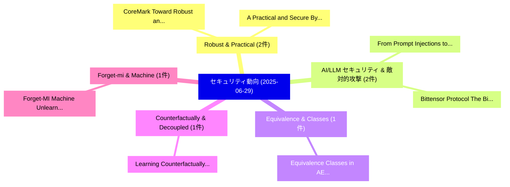

# 📅 02_daily: 日次エグゼクティブサマリー報告書 (2025-06-29)

**集計日時**: 2026-10-02 23:05:31 UTC  
**対象日付**: 2025-06-29  
**本日収集論文数**: 12 件  

---

## 💡 主要セキュリティ動向・脅威インサイト (Executive Insights)

本日の収集論文（計 12 件）において、以下の重点セキュリティ領域で活発な研究動向が確認されました：
- **Robust & Practical** (2 件): 注目論文として 「CoreMark: Toward Robust and Un...」、「A Practical and Secure Byzanti...」 等が発表され、実務防御および攻撃検証の進展が見られます。
- **AI/LLM セキュリティ & 敵対的攻撃** (2 件): 注目論文として 「From Prompt Injections to Prot...」、「Bittensor Protocol: The Bitcoi...」 等が発表され、実務防御および攻撃検証の進展が見られます。
- **Equivalence & Classes** (1 件): 注目論文として 「Equivalence Classes in AES -- ...」 等が発表され、実務防御および攻撃検証の進展が見られます。
- **Counterfactually & Decoupled** (1 件): 注目論文として 「Learning Counterfactually Deco...」 等が発表され、実務防御および攻撃検証の進展が見られます。
- **Forget-mi & Machine** (1 件): 注目論文として 「Forget-MI: Machine Unlearning ...」 等が発表され、実務防御および攻撃検証の進展が見られます。

### 🗺️ 技術・脅威トピックマインドマップ

---

## 📌 日次セキュリティ論文一覧 (日本語表形式)

| No | arXiv ID | 論文タイトル (日本語訳) | 重要キーワード | 構造化エグゼクティブ要約 (背景・提案・影響) | 脅威分類 | 詳細リンク |
|---|---|---|---|---|---|---|
| 1 | `2506.23050v1` | [Equivalence Classes in AES -- Part 1（セキュリティ分析論文）](../../okf/papers/2025-06-29/2506.23050.md) | `Equivalence Classes`, `David Cornwell`, `Raw Meta` | 【提案】概要 (Overview & Key Finding) 本論文「Equivalence Classes in AES -- Part 1（セキュリティ分析論文）」（原題: E...。実証評価により経営層・セキュリティ管理者向け推奨アクション (E... | `cs.CR` | [arXiv](https://arxiv.org/abs/2506.23050v1) &#124; [OKF](../../okf/papers/2025-06-29/2506.23050.md) |
| 2 | `2506.23066v2` | [CoreMark: Toward Robust and Universal Text Watermarking Technique（セキュリティ分析論文）](../../okf/papers/2025-06-29/2506.23066.md) | `Universal Text Watermarking Technique`, `Toward Robust`, `Jiale Meng` | 【提案】概要 (Overview & Key Finding) 本論文「CoreMark: Toward Robust and Universal Text Watermarking...。実証評価により経営層・セキュリティ管理者向け推奨アクション (E... | `cs.CR` | [arXiv](https://arxiv.org/abs/2506.23066v2) &#124; [OKF](../../okf/papers/2025-06-29/2506.23066.md) |
| 3 | `2506.23074v1` | [Learning Counterfactually Decoupled Attention for Open-World Model Attribution（セキュリティ分析論文）](../../okf/papers/2025-06-29/2506.23074.md) | `Learning Counterfactually Decoupled Attention`, `World Model Attribution`, `Open-World Model` | 【提案】概要 (Overview & Key Finding) 本論文「Learning Counterfactually Decoupled Attention for Open-...。実証評価により経営層・セキュリティ管理者向け推奨アクション (E... | `cs.CR` | [arXiv](https://arxiv.org/abs/2506.23074v1) &#124; [OKF](../../okf/papers/2025-06-29/2506.23074.md) |
| 4 | `2506.23145v1` | [Forget-MI: Machine Unlearning for Forgetting Multimodal Information in Healthcare Settings（セキュリティ分析論文）](../../okf/papers/2025-06-29/2506.23145.md) | `Forgetting Multimodal Information`, `Machine Unlearning`, `Healthcare Settings` | 【提案】概要 (Overview & Key Finding) 本論文「Forget-MI: Machine Unlearning for Forgetting Multimodal...。実証評価により経営層・セキュリティ管理者向け推奨アクション (E... | `cs.CR` | [arXiv](https://arxiv.org/abs/2506.23145v1) &#124; [OKF](../../okf/papers/2025-06-29/2506.23145.md) |
| 5 | `2506.23183v5` | [A Practical and Secure Byzantine Robust Aggregator（セキュリティ分析論文）](../../okf/papers/2025-06-29/2506.23183.md) | `Secure Byzantine Robust Aggregator`, `De Zhang Lee`, `Aashish Kolluri` | 【提案】概要 (Overview & Key Finding) 本論文「A Practical and Secure Byzantine Robust Aggregator（セキュリ...。実証評価により経営層・セキュリティ管理者向け推奨アクション (E... | `cs.CR` | [arXiv](https://arxiv.org/abs/2506.23183v5) &#124; [OKF](../../okf/papers/2025-06-29/2506.23183.md) |
| 6 | `2506.23260v2` | [From Prompt Injections to Protocol Exploits: Threats in LLM-Powered AI Agents Workflows（セキュリティ分析論文）](../../okf/papers/2025-06-29/2506.23260.md) | `Protocol Exploits`, `Agents Workflows`, `LLM-Powered AI` | 【提案】概要 (Overview & Key Finding) 本論文「From プロンプトインジェクションs to Protocol Exploits: Threats in LL...。実証評価により経営層・セキュリティ管理者向け推奨アクション (E... | `cs.CR` | [arXiv](https://arxiv.org/abs/2506.23260v2) &#124; [OKF](../../okf/papers/2025-06-29/2506.23260.md) |
| 7 | `2506.23294v4` | [Threshold Signatures for Central Bank Digital Currencies（セキュリティ分析論文）](../../okf/papers/2025-06-29/2506.23294.md) | `Central Bank Digital Currencies`, `Threshold Signatures`, `Mostafa Abdelrahman` | 【提案】概要 (Overview & Key Finding) 本論文「Threshold Signatures for Central Bank Digital Currencie...。実証評価により経営層・セキュリティ管理者向け推奨アクション (E... | `cs.CR` | [arXiv](https://arxiv.org/abs/2506.23294v4) &#124; [OKF](../../okf/papers/2025-06-29/2506.23294.md) |
| 8 | `2506.23296v1` | [AI Systems: A Guide to Known Attacks and Impactsのセキュリティ強化](../../okf/papers/2025-06-29/2506.23296.md) | `Known Attacks`, `Naoto Kiribuchi`, `Kengo Zenitani` | 【提案】概要 (Overview & Key Finding) 本論文「AI Systems: A Guide to Known Attacks and Impactsのセキュリティ...。実証評価により経営層・セキュリティ管理者向け推奨アクション (E... | `cs.CR` | [arXiv](https://arxiv.org/abs/2506.23296v1) &#124; [OKF](../../okf/papers/2025-06-29/2506.23296.md) |
| 9 | `2506.23314v1` | [Interpretable by Design: MH-AutoML for Transparent and Efficient Android マルウェア検出 without Compromising Performance](../../okf/papers/2025-06-29/2506.23314.md) | `Compromising Performance`, `Efficient Android Malware Detection`, `Efficient Android` | 【提案】背景とセキュリティ上の課題 (Background & Problem) 本研究はサイバー脅威環境におけるセキュリティ構造・脆弱性の検証を目的としています。(主要検出項目: ...。実証評価により経営層・セキュリティ管理者向け推奨アクション (E... | `cs.CR` | [arXiv](https://arxiv.org/abs/2506.23314v1) &#124; [OKF](../../okf/papers/2025-06-29/2506.23314.md) |
| 10 | `2506.23321v1` | [AISCliteracy: Assessing Artificial Intelligence and サイバーセキュリティ Literacy Levels and Learning Needs of Students](../../okf/papers/2025-06-29/2506.23321.md) | `Assessing Artificial Intelligence`, `Learning Needs`, `Literacy Levels` | 【提案】概要 (Overview & Key Finding) 本論文「AISCliteracy: Assessing Artificial Intelligence and サイバ...。実証評価により経営層・セキュリティ管理者向け推奨アクション (E... | `cs.CR` | [arXiv](https://arxiv.org/abs/2506.23321v1) &#124; [OKF](../../okf/papers/2025-06-29/2506.23321.md) |
| 11 | `2507.02951v1` | [Bittensor Protocol: The Bitcoin in Decentralized Artificial Intelligence? A Critical and Empirical Analysis（セキュリティ分析論文）](../../okf/papers/2025-06-29/2507.02951.md) | `Decentralized Artificial Intelligence`, `Bittensor Protocol`, `Elizabeth Lui` | 【提案】A Critical and Empirical Analysis ### (日本語題名: Bittensor Protocol: The Bitcoin in Decent...。実証評価により経営層・セキュリティ管理者向け推奨アクション (E... | `cs.CR` | [arXiv](https://arxiv.org/abs/2507.02951v1) &#124; [OKF](../../okf/papers/2025-06-29/2507.02951.md) |
| 12 | `2507.02956v1` | [A Representation Engineering Perspective on the Effectiveness of Multi-Turn Jailbreaks（セキュリティ分析論文）](../../okf/papers/2025-06-29/2507.02956.md) | `Representation Engineering Perspective`, `Turn Jailbreaks`, `Multi-Turn Jailbreaks` | 【提案】概要 (Overview & Key Finding) 本論文「A Representation Engineering Perspective on the Effecti...。実証評価により経営層・セキュリティ管理者向け推奨アクション (E... | `cs.CR` | [arXiv](https://arxiv.org/abs/2507.02956v1) &#124; [OKF](../../okf/papers/2025-06-29/2507.02956.md) |

