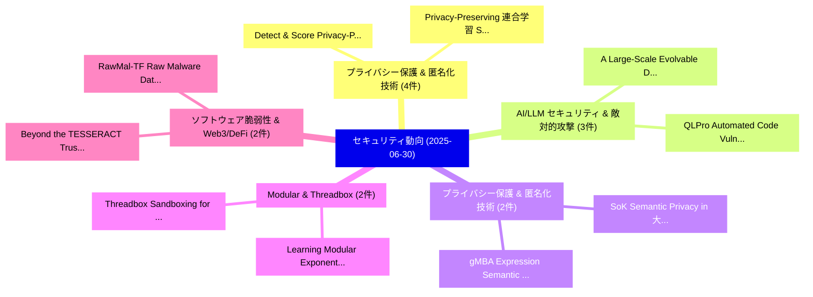

# 📅 02_daily: 日次エグゼクティブサマリー報告書 (2025-06-30)

**集計日時**: 2026-10-02 23:05:31 UTC  
**対象日付**: 2025-06-30  
**本日収集論文数**: 38 件  

---

## 💡 主要セキュリティ動向・脅威インサイト (Executive Insights)

本日の収集論文（計 38 件）において、以下の重点セキュリティ領域で活発な研究動向が確認されました：
- **プライバシー保護 & 匿名化技術** (4 件): 注目論文として 「Detect \& Score: Privacy-Prese...」、「Privacy-Preserving 連合学習 Scheme...」 等が発表され、実務防御および攻撃検証の進展が見られます。
- **AI/LLM セキュリティ & 敵対的攻撃** (3 件): 注目論文として 「A Large-Scale Evolvable Datase...」、「QLPro: Automated Code Vulnerab...」 等が発表され、実務防御および攻撃検証の進展が見られます。
- **プライバシー保護 & 匿名化技術** (2 件): 注目論文として 「SoK: Semantic Privacy in 大規模言語...」、「gMBA: Expression Semantic Guid...」 等が発表され、実務防御および攻撃検証の進展が見られます。
- **Modular & Threadbox** (2 件): 注目論文として 「Learning Modular Exponentiatio...」、「Threadbox: Sandboxing for Modu...」 等が発表され、実務防御および攻撃検証の進展が見られます。
- **ソフトウェア脆弱性 & Web3/DeFi** (2 件): 注目論文として 「Beyond the TESSERACT:Trustwort...」、「RawMal-TF: Raw Malware Dataset...」 等が発表され、実務防御および攻撃検証の進展が見られます。

### 🗺️ 技術・脅威トピックマインドマップ

---

## 📌 日次セキュリティ論文一覧 (日本語表形式)

| No | arXiv ID | 論文タイトル (日本語訳) | 重要キーワード | 構造化エグゼクティブ要約 (背景・提案・影響) | 脅威分類 | 詳細リンク |
|---|---|---|---|---|---|---|
| 1 | `2506.23435v1` | [All Proof of Work But No Proof of Play（セキュリティ分析論文）](../../okf/papers/2025-06-30/2506.23435.md) | `Hayder Tirmazi`, `Raw Meta`, `Executive Summary` | 【提案】概要 (Overview & Key Finding) 本論文「All Proof of Work But No Proof of Play（セキュリティ分析論文）」（原題:...。実証評価により経営層・セキュリティ管理者向け推奨アクション (E... | `cs.CR` | [arXiv](https://arxiv.org/abs/2506.23435v1) &#124; [OKF](../../okf/papers/2025-06-30/2506.23435.md) |
| 2 | `2506.23474v1` | [A Large-Scale Evolvable Dataset for Model Context Protocol Ecosystem and Security Analysis（セキュリティ分析論文）](../../okf/papers/2025-06-30/2506.23474.md) | `Model Context Protocol Ecosystem`, `Scale Evolvable Dataset`, `Large-Scale Evolvable` | 【提案】概要 (Overview & Key Finding) 本論文「A Large-Scale Evolvable Dataset for Model Context Proto...。実証評価により経営層・セキュリティ管理者向け推奨アクション (E... | `cs.CR` | [arXiv](https://arxiv.org/abs/2506.23474v1) &#124; [OKF](../../okf/papers/2025-06-30/2506.23474.md) |
| 3 | `2506.23499v1` | [Unbounded knapsack problem and double partitions（セキュリティ分析論文）](../../okf/papers/2025-06-30/2506.23499.md) | `Raw Meta`, `Executive Summary`, `Key Finding` | 【提案】概要 (Overview & Key Finding) 本論文「Unbounded knapsack problem and double partitions（セキュリティ...。実証評価によりRubinstein - **公開日時**: `2... | `cs.CR` | [arXiv](https://arxiv.org/abs/2506.23499v1) &#124; [OKF](../../okf/papers/2025-06-30/2506.23499.md) |
| 4 | `2506.23583v1` | [Detect \& Score: Privacy-Preserving Misbehaviour Detection and Contribution Evaluation in 連合学習](../../okf/papers/2025-06-30/2506.23583.md) | `Preserving Misbehaviour Detection`, `Privacy-Preserving Misbehaviour`, `Federated Learning` | 【提案】概要 (Overview & Key Finding) 本論文「Detect \& Score: Privacy-Preserving Misbehaviour Detect...。実証評価により経営層・セキュリティ管理者向け推奨アクション (E... | `cs.CR` | [arXiv](https://arxiv.org/abs/2506.23583v1) &#124; [OKF](../../okf/papers/2025-06-30/2506.23583.md) |
| 5 | `2506.23592v1` | [サイバーセキュリティ AI: The Dangerous Gap Between Automation and Autonomy](../../okf/papers/2025-06-30/2506.23592.md) | `Raw Meta`, `Executive Summary`, `Key Finding` | 【提案】概要 (Overview & Key Finding) 本論文「サイバーセキュリティ AI: The Dangerous Gap Between Automation and...。実証評価により経営層・セキュリティ管理者向け推奨アクション (E... | `cs.CR` | [arXiv](https://arxiv.org/abs/2506.23592v1) &#124; [OKF](../../okf/papers/2025-06-30/2506.23592.md) |
| 6 | `2506.23603v2` | [SoK: Semantic Privacy in 大規模言語モデル](../../okf/papers/2025-06-30/2506.23603.md) | `Semantic Privacy`, `Large Language Models`, `Ren Ping Liu` | 【提案】概要 (Overview & Key Finding) 本論文「SoK: Semantic Privacy in 大規模言語モデル」（原題: SoK: Semantic Pr...。実証評価により経営層・セキュリティ管理者向け推奨アクション (E... | `cs.CR` | [arXiv](https://arxiv.org/abs/2506.23603v2) &#124; [OKF](../../okf/papers/2025-06-30/2506.23603.md) |
| 7 | `2506.23622v2` | [Privacy-Preserving 連合学習 Scheme with Mitigating Model Poisoning Attacks: Vulnerabilities and Countermeasures](../../okf/papers/2025-06-30/2506.23622.md) | `Mitigating Model Poisoning Attacks`, `Preserving Federated Learning Scheme`, `Privacy-Preserving Federated` | 【提案】概要 (Overview & Key Finding) 本論文「Privacy-Preserving 連合学習 Scheme with Mitigating モデル汚染 At...。実証評価により経営層・セキュリティ管理者向け推奨アクション (E... | `cs.CR` | [arXiv](https://arxiv.org/abs/2506.23622v2) &#124; [OKF](../../okf/papers/2025-06-30/2506.23622.md) |
| 8 | `2506.23634v1` | [gMBA: Expression Semantic Guided Mixed Boolean-Arithmetic Deobfuscation Using Transformer Architectures（セキュリティ分析論文）](../../okf/papers/2025-06-30/2506.23634.md) | `Expression Semantic Guided Mixed Boolean`, `Arithmetic Deobfuscation Using Transformer Architectures`, `Boolean-Arithmetic Deobfuscation` | 【提案】概要 (Overview & Key Finding) 本論文「gMBA: Expression Semantic Guided Mixed Boolean-Arithmet...。実証評価により経営層・セキュリティ管理者向け推奨アクション (E... | `cs.CR` | [arXiv](https://arxiv.org/abs/2506.23634v1) &#124; [OKF](../../okf/papers/2025-06-30/2506.23634.md) |
| 9 | `2506.23644v3` | [QLPro: Automated Code Vulnerability Discovery via LLM and Static Code Analysis Integration（セキュリティ分析論文）](../../okf/papers/2025-06-30/2506.23644.md) | `Automated Code Vulnerability Discovery`, `Junze Hu`, `Xiangyu Jin` | 【提案】概要 (Overview & Key Finding) 本論文「QLPro: Automated Code 脆弱性 Discovery via LLM and Static ...。実証評価により経営層・セキュリティ管理者向け推奨アクション (E... | `cs.CR` | [arXiv](https://arxiv.org/abs/2506.23644v3) &#124; [OKF](../../okf/papers/2025-06-30/2506.23644.md) |
| 10 | `2506.23679v2` | [Learning Modular Exponentiation with Transformers（セキュリティ分析論文）](../../okf/papers/2025-06-30/2506.23679.md) | `Learning Modular Exponentiation`, `David Demitri Africa`, `Theo Simon Sorg` | 【提案】概要 (Overview & Key Finding) 本論文「Learning Modular Exponentiation with Transformers（セキュリテ...。実証評価によりKapoor, Theo Simon Sorg, ... | `cs.CR` | [arXiv](https://arxiv.org/abs/2506.23679v2) &#124; [OKF](../../okf/papers/2025-06-30/2506.23679.md) |
| 11 | `2506.23682v1` | [Not quite a piece of CHERI-cake: Are new digital security by design architectures usable?（セキュリティ分析論文）](../../okf/papers/2025-06-30/2506.23682.md) | `Maysara Alhindi`, `Joseph Hallett`, `Raw Meta` | 【提案】/ arXiv: 2506.23682v1）は、cs.CR 分野における最新セキュリティ研究成果を取り扱っています。  **概要**: 本研究はサイバー脅威環境におけるセキュ...。実証評価により経営層・セキュリティ管理者向け推奨アクション (E... | `cs.CR` | [arXiv](https://arxiv.org/abs/2506.23682v1) &#124; [OKF](../../okf/papers/2025-06-30/2506.23682.md) |
| 12 | `2506.23683v1` | [Threadbox: Sandboxing for Modular Security（セキュリティ分析論文）](../../okf/papers/2025-06-30/2506.23683.md) | `Modular Security`, `Maysara Alhindi`, `Joseph Hallett` | 【提案】概要 (Overview & Key Finding) 本論文「Threadbox: Sandboxing for Modular Security（セキュリティ分析論文）」...。実証評価により経営層・セキュリティ管理者向け推奨アクション (E... | `cs.CR` | [arXiv](https://arxiv.org/abs/2506.23683v1) &#124; [OKF](../../okf/papers/2025-06-30/2506.23683.md) |
| 13 | `2506.23706v1` | [Attestable Audits: Verifiable AI Safety Benchmarks Using Trusted Execution Environments（セキュリティ分析論文）](../../okf/papers/2025-06-30/2506.23706.md) | `Safety Benchmarks Using Trusted Execution Environments`, `Attestable Audits`, `Christoph Schnabl` | 【提案】概要 (Overview & Key Finding) 本論文「Attestable Audits: Verifiable AI Safety Benchmarks Usin...。実証評価により経営層・セキュリティ管理者向け推奨アクション (E... | `cs.CR` | [arXiv](https://arxiv.org/abs/2506.23706v1) &#124; [OKF](../../okf/papers/2025-06-30/2506.23706.md) |
| 14 | `2506.23814v2` | [Beyond the TESSERACT:Trustworthy Dataset Curation for Sound Evaluations of Android Malware Classifiers（セキュリティ分析論文）](../../okf/papers/2025-06-30/2506.23814.md) | `Trustworthy Dataset Curation`, `Android Malware Classifiers`, `Sound Evaluations` | 【提案】概要 (Overview & Key Finding) 本論文「Beyond the TESSERACT:Trustworthy Dataset Curation for S...。実証評価により経営層・セキュリティ管理者向け推奨アクション (E... | `cs.CR` | [arXiv](https://arxiv.org/abs/2506.23814v2) &#124; [OKF](../../okf/papers/2025-06-30/2506.23814.md) |
| 15 | `2506.23841v1` | [An ontological lens on attack trees: Toward adequacy and interoperability（セキュリティ分析論文）](../../okf/papers/2025-06-30/2506.23841.md) | `Gal Engelberg`, `Mattia Fumagalli`, `Dan Klein` | 【提案】概要 (Overview & Key Finding) 本論文「An ontological lens on attack trees: Toward adequacy an...。実証評価により経営層・セキュリティ管理者向け推奨アクション (E... | `cs.CR` | [arXiv](https://arxiv.org/abs/2506.23841v1) &#124; [OKF](../../okf/papers/2025-06-30/2506.23841.md) |
| 16 | `2506.23855v1` | [Differentially Private Synthetic Data Release for Topics API Outputs（セキュリティ分析論文）](../../okf/papers/2025-06-30/2506.23855.md) | `Differentially Private Synthetic Data Release`, `Andres Munoz Medina`, `Travis Dick` | 【提案】概要 (Overview & Key Finding) 本論文「Differentially Private Synthetic Data Release for Topic...。実証評価により経営層・セキュリティ管理者向け推奨アクション (E... | `cs.CR` | [arXiv](https://arxiv.org/abs/2506.23855v1) &#124; [OKF](../../okf/papers/2025-06-30/2506.23855.md) |
| 17 | `2506.23866v3` | [Exploring Privacy and Security as Drivers for Environmental Sustainability in Cloud-Based Office Solutions（セキュリティ分析論文）](../../okf/papers/2025-06-30/2506.23866.md) | `Based Office Solutions`, `Exploring Privacy`, `Environmental Sustainability` | 【提案】概要 (Overview & Key Finding) 本論文「Exploring Privacy and Security as Drivers for Environme...。実証評価により経営層・セキュリティ管理者向け推奨アクション (E... | `cs.CR` | [arXiv](https://arxiv.org/abs/2506.23866v3) &#124; [OKF](../../okf/papers/2025-06-30/2506.23866.md) |
| 18 | `2506.23909v1` | [RawMal-TF: Raw Malware Dataset Labeled by Type and Family（セキュリティ分析論文）](../../okf/papers/2025-06-30/2506.23909.md) | `Raw Malware Dataset Labeled`, `Mark Stamp`, `Raw Meta` | 【提案】概要 (Overview & Key Finding) 本論文「RawMal-TF: Raw マルウェア Dataset Labeled by Type and Family...。実証評価により経営層・セキュリティ管理者向け推奨アクション (E... | `cs.CR` | [arXiv](https://arxiv.org/abs/2506.23909v1) &#124; [OKF](../../okf/papers/2025-06-30/2506.23909.md) |
| 19 | `2506.23949v1` | [AI Risk-Management Standards Profile for General-Purpose AI (GPAI) and Foundation Models（セキュリティ分析論文）](../../okf/papers/2025-06-30/2506.23949.md) | `Management Standards Profile`, `Risk-Management Standards`, `Foundation Models` | 【提案】概要 (Overview & Key Finding) 本論文「AI Risk-Management Standards Profile for General-Purpos...。実証評価により経営層・セキュリティ管理者向け推奨アクション (E... | `cs.CR` | [arXiv](https://arxiv.org/abs/2506.23949v1) &#124; [OKF](../../okf/papers/2025-06-30/2506.23949.md) |
| 20 | `2506.23985v1` | [Lock Prediction for Zero-Downtime Database Encryption（セキュリティ分析論文）](../../okf/papers/2025-06-30/2506.23985.md) | `Downtime Database Encryption`, `Lock Prediction`, `Zero-Downtime Database` | 【提案】概要 (Overview & Key Finding) 本論文「Lock Prediction for Zero-Downtime Database Encryption（セ...。実証評価により経営層・セキュリティ管理者向け推奨アクション (E... | `cs.CR` | [arXiv](https://arxiv.org/abs/2506.23985v1) &#124; [OKF](../../okf/papers/2025-06-30/2506.23985.md) |
| 21 | `2506.24033v1` | [Poisoning Attacks to Local Differential Privacy for Ranking Estimation（セキュリティ分析論文）](../../okf/papers/2025-06-30/2506.24033.md) | `Local Differential Privacy`, `Poisoning Attacks`, `Ranking Estimation` | 【提案】概要 (Overview & Key Finding) 本論文「Poisoning Attacks to Local 差分プライバシー for Ranking Estimat...。実証評価により経営層・セキュリティ管理者向け推奨アクション (E... | `cs.CR` | [arXiv](https://arxiv.org/abs/2506.24033v1) &#124; [OKF](../../okf/papers/2025-06-30/2506.24033.md) |
| 22 | `2506.24056v2` | [Logit-Gap Steering: A Forward-Pass Diagnostic for Alignment Robustness（セキュリティ分析論文）](../../okf/papers/2025-06-30/2506.24056.md) | `Gap Steering`, `Pass Diagnostic`, `Alignment Robustness` | 【提案】概要 (Overview & Key Finding) 本論文「Logit-Gap Steering: A Forward-Pass Diagnostic for Align...。実証評価により経営層・セキュリティ管理者向け推奨アクション (E... | `cs.CR` | [arXiv](https://arxiv.org/abs/2506.24056v2) &#124; [OKF](../../okf/papers/2025-06-30/2506.24056.md) |
| 23 | `2506.24072v1` | [Protocol insecurity with finitely many sessions and XOR（セキュリティ分析論文）](../../okf/papers/2025-06-30/2506.24072.md) | `Vaishnavi Sundararajan`, `Raw Meta`, `Executive Summary` | 【提案】概要 (Overview & Key Finding) 本論文「Protocol insecurity with finitely many sessions and XOR...。実証評価により経営層・セキュリティ管理者向け推奨アクション (E... | `cs.CR` | [arXiv](https://arxiv.org/abs/2506.24072v1) &#124; [OKF](../../okf/papers/2025-06-30/2506.24072.md) |
| 24 | `2507.00095v1` | [Authentication of Continuous-Variable Quantum Messages（セキュリティ分析論文）](../../okf/papers/2025-06-30/2507.00095.md) | `Variable Quantum Messages`, `Continuous-Variable Quantum`, `Raw Meta` | 【提案】概要 (Overview & Key Finding) 本論文「Authentication of Continuous-Variable 量子 Messages（セキュリテ...。実証評価により経営層・セキュリティ管理者向け推奨アクション (E... | `cs.CR` | [arXiv](https://arxiv.org/abs/2507.00095v1) &#124; [OKF](../../okf/papers/2025-06-30/2507.00095.md) |
| 25 | `2507.00096v1` | [AI-Governed Agent Architecture for Web-Trustworthy Tokenization of Alternative Assets（セキュリティ分析論文）](../../okf/papers/2025-06-30/2507.00096.md) | `Governed Agent Architecture`, `Trustworthy Tokenization`, `Alternative Assets` | 【提案】概要 (Overview & Key Finding) 本論文「AI-Governed Agent Architecture for Web-Trustworthy Toke...。実証評価により経営層・セキュリティ管理者向け推奨アクション (E... | `cs.CR` | [arXiv](https://arxiv.org/abs/2507.00096v1) &#124; [OKF](../../okf/papers/2025-06-30/2507.00096.md) |
| 26 | `2507.00145v1` | [AI-Hybrid TRNG: Kernel-Based Deep Learning for Near-Uniform Entropy Harvesting from Physical Noise（セキュリティ分析論文）](../../okf/papers/2025-06-30/2507.00145.md) | `Based Deep Learning`, `Uniform Entropy Harvesting`, `AI-Hybrid TRNG` | 【提案】概要 (Overview & Key Finding) 本論文「AI-Hybrid TRNG: Kernel-Based Deep Learning for Near-Uni...。実証評価により経営層・セキュリティ管理者向け推奨アクション (E... | `cs.CR` | [arXiv](https://arxiv.org/abs/2507.00145v1) &#124; [OKF](../../okf/papers/2025-06-30/2507.00145.md) |
| 27 | `2507.00189v1` | [Plug. Play. Persist. Inside a Ready-to-Go Havoc C2 Infrastructure（セキュリティ分析論文）](../../okf/papers/2025-06-30/2507.00189.md) | `Go Havoc C2 Infrastructure`, `Alessio Di Santo`, `Raw Meta` | 【提案】概要 (Overview & Key Finding) 本論文「Plug.。実証評価により経営層・セキュリティ管理者向け推奨アクション (Executive Recommendations) - 組織のセキュリティ設計およびリスク評価基準への影響... | `cs.CR` | [arXiv](https://arxiv.org/abs/2507.00189v1) &#124; [OKF](../../okf/papers/2025-06-30/2507.00189.md) |
| 28 | `2507.00230v3` | [PPFL-RDSN: Privacy-Preserving 連合学習-based Residual Dense Spatial Networks for Encrypted Lossy Image Reconstruction](../../okf/papers/2025-06-30/2507.00230.md) | `Residual Dense Spatial Networks`, `Encrypted Lossy Image Reconstruction`, `Preserving Federated Learning` | 【提案】概要 (Overview & Key Finding) 本論文「PPFL-RDSN: Privacy-Preserving 連合学習-based Residual Dense...。実証評価により経営層・セキュリティ管理者向け推奨アクション (E... | `cs.CR` | [arXiv](https://arxiv.org/abs/2507.00230v3) &#124; [OKF](../../okf/papers/2025-06-30/2507.00230.md) |
| 29 | `2507.00299v1` | [When Kids Mode Isn't For Kids: Investigating TikTok's "Under 13 Experience"（セキュリティ分析論文）](../../okf/papers/2025-06-30/2507.00299.md) | `Olivia Figueira`, `Pranathi Chamarthi`, `Tu Le` | 【提案】概要 (Overview & Key Finding) 本論文「When Kids Mode Isn't For Kids: Investigating TikTok's "...。実証評価により経営層・セキュリティ管理者向け推奨アクション (E... | `cs.CR` | [arXiv](https://arxiv.org/abs/2507.00299v1) &#124; [OKF](../../okf/papers/2025-06-30/2507.00299.md) |
| 30 | `2507.02959v1` | [A Novel Active Learning Approach to Label One Million Unknown Malware Variants（セキュリティ分析論文）](../../okf/papers/2025-06-30/2507.02959.md) | `Label One Million Unknown Malware Variants`, `Ahmed Bensaoud`, `Jugal Kalita` | 【提案】概要 (Overview & Key Finding) 本論文「A Novel Active Learning Approach to Label One Million U...。実証評価により経営層・セキュリティ管理者向け推奨アクション (E... | `cs.CR` | [arXiv](https://arxiv.org/abs/2507.02959v1) &#124; [OKF](../../okf/papers/2025-06-30/2507.02959.md) |
| 31 | `2507.02964v2` | [Less Data, More Security: Advancing サイバーセキュリティ LLMs Specialization via Resource-Efficient Domain-Adaptive Continuous Pre-training with Minimal Tokens](../../okf/papers/2025-06-30/2507.02964.md) | `Adaptive Continuous Pre`, `Less Data`, `Efficient Domain` | 【提案】概要 (Overview & Key Finding) 本論文「Less Data, More Security: Advancing サイバーセキュリティ LLMs Spe...。実証評価により経営層・セキュリティ管理者向け推奨アクション (E... | `cs.CR` | [arXiv](https://arxiv.org/abs/2507.02964v2) &#124; [OKF](../../okf/papers/2025-06-30/2507.02964.md) |
| 32 | `2507.02966v2` | [PBa-LLM: Privacy- and Bias-aware NLP using Named-Entity Recognition (NER)（セキュリティ分析論文）](../../okf/papers/2025-06-30/2507.02966.md) | `Entity Recognition`, `Bias-aware NLP`, `Named-Entity Recognition` | 【提案】概要 (Overview & Key Finding) 本論文「PBa-LLM: Privacy- and Bias-aware NLP using Named-Entity...。実証評価により経営層・セキュリティ管理者向け推奨アクション (E... | `cs.CR` | [arXiv](https://arxiv.org/abs/2507.02966v2) &#124; [OKF](../../okf/papers/2025-06-30/2507.02966.md) |
| 33 | `2507.02968v1` | [Unveiling プライバシーポリシー Complexity: An Exploratory Study Using Graph Mining, Machine Learning, and Natural Language Processing](../../okf/papers/2025-06-30/2507.02968.md) | `Natural Language Processing`, `Machine Learning`, `Unveiling Privacy Policy Complexity` | 【提案】概要 (Overview & Key Finding) 本論文「Unveiling プライバシーポリシー Complexity: An Exploratory Study U...。実証評価により経営層・セキュリティ管理者向け推奨アクション (E... | `cs.CR` | [arXiv](https://arxiv.org/abs/2507.02968v1) &#124; [OKF](../../okf/papers/2025-06-30/2507.02968.md) |
| 34 | `2507.02969v1` | [Reinforcement Learning for Automated サイバーセキュリティ Penetration Testing](../../okf/papers/2025-06-30/2507.02969.md) | `Reinforcement Learning`, `Automated Cybersecurity Penetration Testing`, `Penetration Testing` | 【提案】概要 (Overview & Key Finding) 本論文「Reinforcement Learning for Automated サイバーセキュリティ Penetra...。実証評価によりÁlvarez-Aldana, Alicia Mo... | `cs.CR` | [arXiv](https://arxiv.org/abs/2507.02969v1) &#124; [OKF](../../okf/papers/2025-06-30/2507.02969.md) |
| 35 | `2507.02971v1` | [Aim High, Stay Private: Differentially Private Synthetic Data Enables Public Release of Behavioral Health Information with High Utility（セキュリティ分析論文）](../../okf/papers/2025-06-30/2507.02971.md) | `Differentially Private Synthetic Data Enables Public Release`, `Behavioral Health Information`, `Aim High` | 【提案】概要 (Overview & Key Finding) 本論文「Aim High, Stay Private: Differentially Private Syntheti...。実証評価により経営層・セキュリティ管理者向け推奨アクション (E... | `cs.CR` | [arXiv](https://arxiv.org/abs/2507.02971v1) &#124; [OKF](../../okf/papers/2025-06-30/2507.02971.md) |
| 36 | `2507.02974v3` | [InvisibleInk: High-Utility and Low-Cost Text Generation with Differential Privacy（セキュリティ分析論文）](../../okf/papers/2025-06-30/2507.02974.md) | `Cost Text Generation`, `Differential Privacy`, `Low-Cost Text` | 【提案】概要 (Overview & Key Finding) 本論文「InvisibleInk: High-Utility and Low-Cost Text Generation...。実証評価により経営層・セキュリティ管理者向け推奨アクション (E... | `cs.CR` | [arXiv](https://arxiv.org/abs/2507.02974v3) &#124; [OKF](../../okf/papers/2025-06-30/2507.02974.md) |
| 37 | `2507.02976v3` | [How Safe Are AI-Generated Patches? A Large-scale Study on Security Risks in LLM and Agentic Automated Program Repair on SWE-bench（セキュリティ分析論文）](../../okf/papers/2025-06-30/2507.02976.md) | `Agentic Automated Program Repair`, `Generated Patches`, `Security Risks` | 【提案】A Large-scale Study on Security Risks in LLM and Agentic Automated Program Repair on SW...。実証評価により経営層・セキュリティ管理者向け推奨アクション (E... | `cs.CR` | [arXiv](https://arxiv.org/abs/2507.02976v3) &#124; [OKF](../../okf/papers/2025-06-30/2507.02976.md) |
| 38 | `2507.22065v1` | [Fuzzing: Randomness? Reasoning! Efficient Directed Fuzzing via 大規模言語モデル](../../okf/papers/2025-06-30/2507.22065.md) | `Efficient Directed Fuzzing`, `Large Language Models`, `Xiaotao Feng` | 【提案】Reasoning!。実証評価により経営層・セキュリティ管理者向け推奨アクション (Executive Recommendations) - 組織のセキュリティ設計およびリスク評価基準への影響確認 - 技術チー...。 | `cs.CR` | [arXiv](https://arxiv.org/abs/2507.22065v1) &#124; [OKF](../../okf/papers/2025-06-30/2507.22065.md) |

