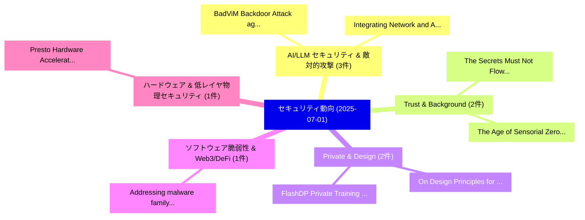

# 📅 02_daily: 日次エグゼクティブサマリー報告書 (2025-07-01)

**集計日時**: 2026-10-02 23:05:31 UTC  
**対象日付**: 2025-07-01  
**本日収集論文数**: 23 件  

---

## 💡 主要セキュリティ動向・脅威インサイト (Executive Insights)

本日の収集論文（計 23 件）において、以下の重点セキュリティ領域で活発な研究動向が確認されました：
- **AI/LLM セキュリティ & 敵対的攻撃** (3 件): 注目論文として 「BadViM: Backdoor Attack agains...」、「Integrating Network and Attack...」 等が発表され、実務防御および攻撃検証の進展が見られます。
- **Trust & Background** (2 件): 注目論文として 「The Secrets Must Not Flow: Sca...」、「The Age of Sensorial Zero Trus...」 等が発表され、実務防御および攻撃検証の進展が見られます。
- **Private & Design** (2 件): 注目論文として 「On Design Principles for Priva...」、「FlashDP: Private Training 大規模言...」 等が発表され、実務防御および攻撃検証の進展が見られます。
- **ソフトウェア脆弱性 & Web3/DeFi** (1 件): 注目論文として 「Addressing malware family conc...」 等が発表され、実務防御および攻撃検証の進展が見られます。
- **ハードウェア & 低レイヤ物理セキュリティ** (1 件): 注目論文として 「Presto: Hardware Acceleration ...」 等が発表され、実務防御および攻撃検証の進展が見られます。

### 🗺️ 技術・脅威トピックマインドマップ

---

## 📌 日次セキュリティ論文一覧 (日本語表形式)

| No | arXiv ID | 論文タイトル (日本語訳) | 重要キーワード | 構造化エグゼクティブ要約 (背景・提案・影響) | 脅威分類 | 詳細リンク |
|---|---|---|---|---|---|---|
| 1 | `2507.00348v1` | [Addressing malware family concept drift with triplet autoencoder（セキュリティ分析論文）](../../okf/papers/2025-07-01/2507.00348.md) | `Numan Halit Guldemir`, `Oluwafemi Olukoya`, `Raw Meta` | 【提案】概要 (Overview & Key Finding) 本論文「Addressing マルウェア family concept drift with triplet auto...。実証評価により経営層・セキュリティ管理者向け推奨アクション (E... | `cs.CR` | [arXiv](https://arxiv.org/abs/2507.00348v1) &#124; [OKF](../../okf/papers/2025-07-01/2507.00348.md) |
| 2 | `2507.00367v1` | [Presto: Hardware Acceleration of Ciphers for Hybrid Homomorphic Encryption（セキュリティ分析論文）](../../okf/papers/2025-07-01/2507.00367.md) | `Hybrid Homomorphic Encryption`, `Hardware Acceleration`, `Yeonsoo Jeon` | 【提案】概要 (Overview & Key Finding) 本論文「Presto: Hardware Acceleration of Ciphers for Hybrid 準同型...。実証評価により経営層・セキュリティ管理者向け推奨アクション (E... | `cs.CR` | [arXiv](https://arxiv.org/abs/2507.00367v1) &#124; [OKF](../../okf/papers/2025-07-01/2507.00367.md) |
| 3 | `2507.00423v1` | [Find a Scapegoat: Poisoning Membership Inference Attack and Defense to 連合学習](../../okf/papers/2025-07-01/2507.00423.md) | `Poisoning Membership Inference Attack`, `Federated Learning`, `Wenjin Mo` | 【提案】概要 (Overview & Key Finding) 本論文「Find a Scapegoat: Poisoning Membership Inference Attack...。実証評価により経営層・セキュリティ管理者向け推奨アクション (E... | `cs.CR` | [arXiv](https://arxiv.org/abs/2507.00423v1) &#124; [OKF](../../okf/papers/2025-07-01/2507.00423.md) |
| 4 | `2507.00522v3` | [Cyber Attacks Detection, Prevention, and Source Localization in Digital Substation Communication using Hybrid Statistical-Deep Learning（セキュリティ分析論文）](../../okf/papers/2025-07-01/2507.00522.md) | `Cyber Attacks Detection`, `Digital Substation Communication`, `Source Localization` | 【提案】概要 (Overview & Key Finding) 本論文「Cyber Attacks Detection, Prevention, and Source Localiz...。実証評価により経営層・セキュリティ管理者向け推奨アクション (E... | `cs.CR` | [arXiv](https://arxiv.org/abs/2507.00522v3) &#124; [OKF](../../okf/papers/2025-07-01/2507.00522.md) |
| 5 | `2507.00577v1` | [BadViM: Backdoor Attack against Vision Mamba（セキュリティ分析論文）](../../okf/papers/2025-07-01/2507.00577.md) | `Backdoor Attack`, `Vision Mamba`, `Yinghao Wu` | 【提案】概要 (Overview & Key Finding) 本論文「BadViM: Backdoor Attack against Vision Mamba（セキュリティ分析論文...。実証評価により経営層・セキュリティ管理者向け推奨アクション (E... | `cs.CR` | [arXiv](https://arxiv.org/abs/2507.00577v1) &#124; [OKF](../../okf/papers/2025-07-01/2507.00577.md) |
| 6 | `2507.00595v2` | [The Secrets Must Not Flow: Scaling Security Verification to Large Codebases (extended version)（セキュリティ分析論文）](../../okf/papers/2025-07-01/2507.00595.md) | `Scaling Security Verification`, `Large Codebases`, `Linard Arquint` | 【提案】背景とセキュリティ上の課題 (Background & Problem) 本研究はサイバー脅威環境におけるセキュリティ構造・脆弱性の検証を目的としています。(主要検出項目: ...。実証評価により経営層・セキュリティ管理者向け推奨アクション (E... | `cs.CR` | [arXiv](https://arxiv.org/abs/2507.00595v2) &#124; [OKF](../../okf/papers/2025-07-01/2507.00595.md) |
| 7 | `2507.00596v2` | [Gaze3P: Gaze-Based Prediction of User-Perceived Privacy（セキュリティ分析論文）](../../okf/papers/2025-07-01/2507.00596.md) | `Based Prediction`, `Perceived Privacy`, `Gaze-Based Prediction` | 【提案】概要 (Overview & Key Finding) 本論文「Gaze3P: Gaze-Based Prediction of User-Perceived Privacy...。実証評価により経営層・セキュリティ管理者向け推奨アクション (E... | `cs.CR` | [arXiv](https://arxiv.org/abs/2507.00596v2) &#124; [OKF](../../okf/papers/2025-07-01/2507.00596.md) |
| 8 | `2507.00637v3` | [Integrating Network and Attack Graphs for Service-Centric Impact Analysis（セキュリティ分析論文）](../../okf/papers/2025-07-01/2507.00637.md) | `Integrating Network`, `Attack Graphs`, `Service-Centric Impact` | 【提案】概要 (Overview & Key Finding) 本論文「Integrating Network and Attack Graphs for Service-Centr...。実証評価により経営層・セキュリティ管理者向け推奨アクション (E... | `cs.CR` | [arXiv](https://arxiv.org/abs/2507.00637v3) &#124; [OKF](../../okf/papers/2025-07-01/2507.00637.md) |
| 9 | `2507.00690v1` | [Cage-Based Deformation for Transferable and Undefendable Point Cloud Attack（セキュリティ分析論文）](../../okf/papers/2025-07-01/2507.00690.md) | `Undefendable Point Cloud Attack`, `Based Deformation`, `Cage-Based Deformation` | 【提案】概要 (Overview & Key Finding) 本論文「Cage-Based Deformation for Transferable and Undefendabl...。実証評価により経営層・セキュリティ管理者向け推奨アクション (E... | `cs.CR` | [arXiv](https://arxiv.org/abs/2507.00690v1) &#124; [OKF](../../okf/papers/2025-07-01/2507.00690.md) |
| 10 | `2507.00740v1` | [Safe Low Bandwidth SPV: A Formal Treatment of Simplified Payment Verification Protocols and Security Bounds（セキュリティ分析論文）](../../okf/papers/2025-07-01/2507.00740.md) | `Simplified Payment Verification Protocols`, `Safe Low Bandwidth`, `Formal Treatment` | 【提案】概要 (Overview & Key Finding) 本論文「Safe Low Bandwidth SPV: A Formal Treatment of Simplifie...。実証評価により経営層・セキュリティ管理者向け推奨アクション (E... | `cs.CR` | [arXiv](https://arxiv.org/abs/2507.00740v1) &#124; [OKF](../../okf/papers/2025-07-01/2507.00740.md) |
| 11 | `2507.00827v1` | [A Technique for the PDF Tampering or Forgeryの検出](../../okf/papers/2025-07-01/2507.00827.md) | `Gabriel Grobler`, `Sheunesu Makura`, `Hein Venter` | 【提案】概要 (Overview & Key Finding) 本論文「A Technique for the PDF Tampering or Forgeryの検出」（原題: A ...。実証評価により経営層・セキュリティ管理者向け推奨アクション (E... | `cs.CR` | [arXiv](https://arxiv.org/abs/2507.00827v1) &#124; [OKF](../../okf/papers/2025-07-01/2507.00827.md) |
| 12 | `2507.00829v1` | [On the Surprising Efficacy of LLMs for Penetration-Testing（セキュリティ分析論文）](../../okf/papers/2025-07-01/2507.00829.md) | `Surprising Efficacy`, `Andreas Happe`, `Raw Meta` | 【提案】概要 (Overview & Key Finding) 本論文「On the Surprising Efficacy of LLMs for Penetration-Test...。実証評価により経営層・セキュリティ管理者向け推奨アクション (E... | `cs.CR` | [arXiv](https://arxiv.org/abs/2507.00829v1) &#124; [OKF](../../okf/papers/2025-07-01/2507.00829.md) |
| 13 | `2507.00841v1` | [SafeMobile: Chain-level Jailbreak Detection and Automated Evaluation for Multimodal Mobile Agents（セキュリティ分析論文）](../../okf/papers/2025-07-01/2507.00841.md) | `Multimodal Mobile Agents`, `Chain-level Jailbreak`, `Jailbreak Detection` | 【提案】概要 (Overview & Key Finding) 本論文「SafeMobile: Chain-level ジェイルブレイク Detection and Automate...。実証評価により経営層・セキュリティ管理者向け推奨アクション (E... | `cs.CR` | [arXiv](https://arxiv.org/abs/2507.00841v1) &#124; [OKF](../../okf/papers/2025-07-01/2507.00841.md) |
| 14 | `2507.00847v2` | [Stealtooth: Breaking Bluetooth Security Abusing Silent Automatic Pairing（セキュリティ分析論文）](../../okf/papers/2025-07-01/2507.00847.md) | `Breaking Bluetooth Security Abusing Silent Automatic Pairing`, `Keiichiro Kimura`, `Hiroki Kuzuno` | 【提案】概要 (Overview & Key Finding) 本論文「Stealtooth: Breaking Bluetooth Security Abusing Silent ...。実証評価により経営層・セキュリティ管理者向け推奨アクション (E... | `cs.CR` | [arXiv](https://arxiv.org/abs/2507.00847v2) &#124; [OKF](../../okf/papers/2025-07-01/2507.00847.md) |
| 15 | `2507.00907v1` | [The Age of Sensorial Zero Trust: Why We Can No Longer Trust Our Senses（セキュリティ分析論文）](../../okf/papers/2025-07-01/2507.00907.md) | `Sensorial Zero Trust`, `Fabio Correa Xavier`, `Raw Meta` | 【提案】背景とセキュリティ上の課題 (Background & Problem) 本研究はサイバー脅威環境におけるセキュリティ構造・脆弱性の検証を目的としています。(主要検出項目: ...。実証評価により経営層・セキュリティ管理者向け推奨アクション (E... | `cs.CR` | [arXiv](https://arxiv.org/abs/2507.00907v1) &#124; [OKF](../../okf/papers/2025-07-01/2507.00907.md) |
| 16 | `2507.01118v1` | [Quasi-twisted codes: decoding and applications in code-based cryptography（セキュリティ分析論文）](../../okf/papers/2025-07-01/2507.01118.md) | `Quasi-twisted codes`, `code-based cryptography`, `Rutuja Kshirsagar` | 【提案】概要 (Overview & Key Finding) 本論文「Quasi-twisted codes: decoding and applications in code-...。実証評価により経営層・セキュリティ管理者向け推奨アクション (E... | `cs.CR` | [arXiv](https://arxiv.org/abs/2507.01118v1) &#124; [OKF](../../okf/papers/2025-07-01/2507.01118.md) |
| 17 | `2507.01129v1` | [On Design Principles for Private Adaptive Optimizers（セキュリティ分析論文）](../../okf/papers/2025-07-01/2507.01129.md) | `Private Adaptive Optimizers`, `Arun Ganesh`, `Abhradeep Thakurta` | 【提案】概要 (Overview & Key Finding) 本論文「On Design Principles for Private Adaptive Optimizers（セキ...。実証評価により経営層・セキュリティ管理者向け推奨アクション (E... | `cs.CR` | [arXiv](https://arxiv.org/abs/2507.01129v1) &#124; [OKF](../../okf/papers/2025-07-01/2507.01129.md) |
| 18 | `2507.01154v1` | [FlashDP: Private Training 大規模言語モデル with Efficient DP-SGD](../../okf/papers/2025-07-01/2507.01154.md) | `Private Training Large Language Models`, `Private Training`, `Liangyu Wang` | 【提案】概要 (Overview & Key Finding) 本論文「FlashDP: Private Training 大規模言語モデル with Efficient DP-SG...。実証評価によりKeyes, Di Wang - **公開日時**... | `cs.CR` | [arXiv](https://arxiv.org/abs/2507.01154v1) &#124; [OKF](../../okf/papers/2025-07-01/2507.01154.md) |
| 19 | `2507.01208v1` | [Deep Learning-Based Intrusion Detection for Automotive Ethernet: Evaluating & Optimizing Fast Inference Techniques for Deployment on Low-Cost Platform（セキュリティ分析論文）](../../okf/papers/2025-07-01/2507.01208.md) | `Optimizing Fast Inference Techniques`, `Based Intrusion Detection`, `Deep Learning` | 【提案】概要 (Overview & Key Finding) 本論文「Deep Learning-Based Intrusion Detection for Automotive ...。実証評価により経営層・セキュリティ管理者向け推奨アクション (E... | `cs.CR` | [arXiv](https://arxiv.org/abs/2507.01208v1) &#124; [OKF](../../okf/papers/2025-07-01/2507.01208.md) |
| 20 | `2507.01216v2` | [PAE MobiLLM: Privacy-Aware and Efficient LLM Fine-Tuning on the Mobile Device via Additive Side-Tuning（セキュリティ分析論文）](../../okf/papers/2025-07-01/2507.01216.md) | `Mobile Device`, `Additive Side`, `Xingke Yang` | 【提案】概要 (Overview & Key Finding) 本論文「PAE MobiLLM: Privacy-Aware and Efficient LLM Fine-Tunin...。実証評価により経営層・セキュリティ管理者向け推奨アクション (E... | `cs.CR` | [arXiv](https://arxiv.org/abs/2507.01216v2) &#124; [OKF](../../okf/papers/2025-07-01/2507.01216.md) |
| 21 | `2507.02995v2` | [FreqCross: A Multi-Modal Frequency-Spatial Fusion Network for Robust Stable Diffusion 3.5 Generated Imagesの検出](../../okf/papers/2025-07-01/2507.02995.md) | `Spatial Fusion Network`, `Modal Frequency`, `Multi-Modal Frequency` | 【提案】概要 (Overview & Key Finding) 本論文「FreqCross: A Multi-Modal Frequency-Spatial Fusion Netwo...。実証評価により経営層・セキュリティ管理者向け推奨アクション (E... | `cs.CR` | [arXiv](https://arxiv.org/abs/2507.02995v2) &#124; [OKF](../../okf/papers/2025-07-01/2507.02995.md) |
| 22 | `2507.21094v2` | [SkyEye: When Your Vision Reaches Beyond IAM Boundary Scope in AWS Cloud（セキュリティ分析論文）](../../okf/papers/2025-07-01/2507.21094.md) | `Boundary Scope`, `Minh Hoang Nguyen`, `Anh Minh Ho` | 【提案】概要 (Overview & Key Finding) 本論文「SkyEye: When Your Vision Reaches Beyond IAM Boundary Sc...。実証評価により経営層・セキュリティ管理者向け推奨アクション (E... | `cs.CR` | [arXiv](https://arxiv.org/abs/2507.21094v2) &#124; [OKF](../../okf/papers/2025-07-01/2507.21094.md) |
| 23 | `2507.21096v1` | [HexaMorphHash HMH- Homomorphic Hashing for Secure and Efficient Cryptographic Operations in Data Integrity Verification（セキュリティ分析論文）](../../okf/papers/2025-07-01/2507.21096.md) | `Efficient Cryptographic Operations`, `Data Integrity Verification`, `Homomorphic Hashing` | 【提案】概要 (Overview & Key Finding) 本論文「HexaMorphHash HMH- Homomorphic Hashing for Secure and E...。実証評価により経営層・セキュリティ管理者向け推奨アクション (E... | `cs.CR` | [arXiv](https://arxiv.org/abs/2507.21096v1) &#124; [OKF](../../okf/papers/2025-07-01/2507.21096.md) |

