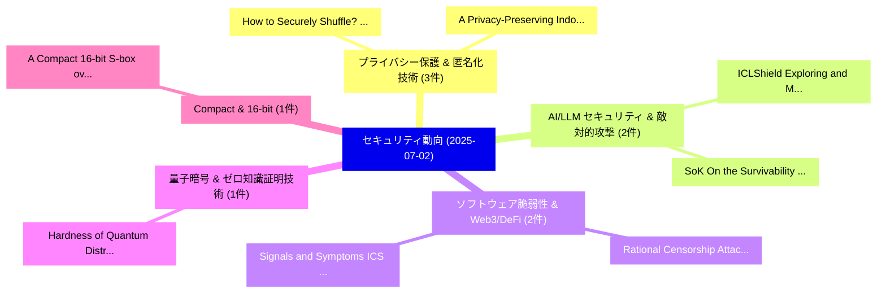

# 📅 02_daily: 日次エグゼクティブサマリー報告書 (2025-07-02)

**集計日時**: 2026-10-02 23:05:32 UTC  
**対象日付**: 2025-07-02  
**本日収集論文数**: 29 件  

---

## 💡 主要セキュリティ動向・脅威インサイト (Executive Insights)

本日の収集論文（計 29 件）において、以下の重点セキュリティ領域で活発な研究動向が確認されました：
- **プライバシー保護 & 匿名化技術** (3 件): 注目論文として 「How to Securely Shuffle? A sur...」、「A Privacy-Preserving Indoor Lo...」 等が発表され、実務防御および攻撃検証の進展が見られます。
- **AI/LLM セキュリティ & 敵対的攻撃** (2 件): 注目論文として 「ICLShield: Exploring and Mitig...」、「SoK: On the Survivability of B...」 等が発表され、実務防御および攻撃検証の進展が見られます。
- **ソフトウェア脆弱性 & Web3/DeFi** (2 件): 注目論文として 「Rational Censorship Attack: Br...」、「Signals and Symptoms: ICS Atta...」 等が発表され、実務防御および攻撃検証の進展が見られます。
- **量子暗号 & ゼロ知識証明技術** (1 件): 注目論文として 「Hardness of Quantum Distributi...」 等が発表され、実務防御および攻撃検証の進展が見られます。
- **Compact & 16-bit** (1 件): 注目論文として 「A Compact 16-bit S-box over To...」 等が発表され、実務防御および攻撃検証の進展が見られます。

### 🗺️ 技術・脅威トピックマインドマップ

---

## 📌 日次セキュリティ論文一覧 (日本語表形式)

| No | arXiv ID | 論文タイトル (日本語訳) | 重要キーワード | 構造化エグゼクティブ要約 (背景・提案・影響) | 脅威分類 | 詳細リンク |
|---|---|---|---|---|---|---|
| 1 | `2507.01292v1` | [Hardness of Quantum Distribution Learning and Quantum Cryptography（セキュリティ分析論文）](../../okf/papers/2025-07-02/2507.01292.md) | `Quantum Distribution Learning`, `Quantum Cryptography`, `Taiga Hiroka` | 【提案】概要 (Overview & Key Finding) 本論文「Hardness of 量子 Distribution Learning and 量子 暗号技術（セキュリティ...。実証評価により経営層・セキュリティ管理者向け推奨アクション (E... | `cs.CR` | [arXiv](https://arxiv.org/abs/2507.01292v1) &#124; [OKF](../../okf/papers/2025-07-02/2507.01292.md) |
| 2 | `2507.01321v1` | [ICLShield: Exploring and Mitigating In-Context Learning Backdoor Attacks（セキュリティ分析論文）](../../okf/papers/2025-07-02/2507.01321.md) | `Context Learning Backdoor Attacks`, `In-Context Learning`, `Zhiyao Ren` | 【提案】概要 (Overview & Key Finding) 本論文「ICLShield: Exploring and Mitigating In-Context Learning...。実証評価により経営層・セキュリティ管理者向け推奨アクション (E... | `cs.CR` | [arXiv](https://arxiv.org/abs/2507.01321v1) &#124; [OKF](../../okf/papers/2025-07-02/2507.01321.md) |
| 3 | `2507.01423v1` | [A Compact 16-bit S-box over Tower Field $\F_{(((2^2)^2)^2)^2}$ with High Security（セキュリティ分析論文）](../../okf/papers/2025-07-02/2507.01423.md) | `Tower Field`, `High Security`, `16-bit S` | 【提案】概要 (Overview & Key Finding) 本論文「A Compact 16-bit S-box over Tower Field $\F_{(((2^2)^2)...。実証評価により経営層・セキュリティ管理者向け推奨アクション (E... | `cs.CR` | [arXiv](https://arxiv.org/abs/2507.01423v1) &#124; [OKF](../../okf/papers/2025-07-02/2507.01423.md) |
| 4 | `2507.01453v1` | [Rational Censorship Attack: Breaking Blockchain with a Blackboard（セキュリティ分析論文）](../../okf/papers/2025-07-02/2507.01453.md) | `Rational Censorship Attack`, `Breaking Blockchain`, `Michelle Yeo` | 【提案】概要 (Overview & Key Finding) 本論文「Rational Censorship Attack: Breaking Blockchain with a ...。実証評価により経営層・セキュリティ管理者向け推奨アクション (E... | `cs.CR` | [arXiv](https://arxiv.org/abs/2507.01453v1) &#124; [OKF](../../okf/papers/2025-07-02/2507.01453.md) |
| 5 | `2507.01465v2` | [Pruning the Tree: Rethinking RPKI Architecture From The Ground Up（セキュリティ分析論文）](../../okf/papers/2025-07-02/2507.01465.md) | `Haya Schulmann`, `Niklas Vogel`, `Raw Meta` | 【提案】概要 (Overview & Key Finding) 本論文「Pruning the Tree: Rethinking RPKI Architecture From The...。実証評価により経営層・セキュリティ管理者向け推奨アクション (E... | `cs.CR` | [arXiv](https://arxiv.org/abs/2507.01465v2) &#124; [OKF](../../okf/papers/2025-07-02/2507.01465.md) |
| 6 | `2507.01487v2` | [How to Securely Shuffle? A survey about Secure Shufflers for privacy-preserving computations（セキュリティ分析論文）](../../okf/papers/2025-07-02/2507.01487.md) | `Securely Shuffle`, `Secure Shufflers`, `privacy-preserving computations` | 【提案】A survey about Secure Shufflers for privacy-preserving computations ### (日本語題名: How to ...。実証評価により経営層・セキュリティ管理者向け推奨アクション (E... | `cs.CR` | [arXiv](https://arxiv.org/abs/2507.01487v2) &#124; [OKF](../../okf/papers/2025-07-02/2507.01487.md) |
| 7 | `2507.01513v2` | [SafePTR: Token-Level Jailbreak Defense in Multimodal LLMs via Prune-then-Restore Mechanism（セキュリティ分析論文）](../../okf/papers/2025-07-02/2507.01513.md) | `Level Jailbreak Defense`, `Restore Mechanism`, `Token-Level Jailbreak` | 【提案】概要 (Overview & Key Finding) 本論文「SafePTR: Token-Level ジェイルブレイク Defense in Multimodal LLM...。実証評価により経営層・セキュリティ管理者向け推奨アクション (E... | `cs.CR` | [arXiv](https://arxiv.org/abs/2507.01513v2) &#124; [OKF](../../okf/papers/2025-07-02/2507.01513.md) |
| 8 | `2507.01536v1` | [サイバーセキュリティ Issues in Local Energy Markets](../../okf/papers/2025-07-02/2507.01536.md) | `Local Energy Markets`, `Cybersecurity Issues`, `Al Hussein Dabashi` | 【提案】概要 (Overview & Key Finding) 本論文「サイバーセキュリティ Issues in Local Energy Markets」（原題: Cybersec...。実証評価により経営層・セキュリティ管理者向け推奨アクション (E... | `cs.CR` | [arXiv](https://arxiv.org/abs/2507.01536v1) &#124; [OKF](../../okf/papers/2025-07-02/2507.01536.md) |
| 9 | `2507.01571v1` | [On the Effect of Ruleset Tuning and Data Imbalance on Explainable Network Security Alert Classifications: a Case-Study on DeepCASE（セキュリティ分析論文）](../../okf/papers/2025-07-02/2507.01571.md) | `Explainable Network Security Alert Classifications`, `Ruleset Tuning`, `Data Imbalance` | 【提案】概要 (Overview & Key Finding) 本論文「On the Effect of Ruleset Tuning and Data Imbalance on E...。実証評価により経営層・セキュリティ管理者向け推奨アクション (E... | `cs.CR` | [arXiv](https://arxiv.org/abs/2507.01571v1) &#124; [OKF](../../okf/papers/2025-07-02/2507.01571.md) |
| 10 | `2507.01581v1` | [A Privacy-Preserving Indoor Localization System based on Hierarchical 連合学習](../../okf/papers/2025-07-02/2507.01581.md) | `Preserving Indoor Localization System`, `Privacy-Preserving Indoor`, `Hierarchical Federated Learning` | 【提案】概要 (Overview & Key Finding) 本論文「A Privacy-Preserving Indoor Localization System based o...。実証評価により経営層・セキュリティ管理者向け推奨アクション (E... | `cs.CR` | [arXiv](https://arxiv.org/abs/2507.01581v1) &#124; [OKF](../../okf/papers/2025-07-02/2507.01581.md) |
| 11 | `2507.01607v5` | [SoK: On the Survivability of Backdoor Attacks on Unconstrained Face Recognition Systems（セキュリティ分析論文）](../../okf/papers/2025-07-02/2507.01607.md) | `Unconstrained Face Recognition Systems`, `Backdoor Attacks`, `Quentin Le Roux` | 【提案】概要 (Overview & Key Finding) 本論文「SoK: On the Survivability of Backdoor Attacks on Uncons...。実証評価により経営層・セキュリティ管理者向け推奨アクション (E... | `cs.CR` | [arXiv](https://arxiv.org/abs/2507.01607v5) &#124; [OKF](../../okf/papers/2025-07-02/2507.01607.md) |
| 12 | `2507.01615v1` | [EDGChain-E: A Decentralized Git-Based Framework for Versioning Encrypted Energy Data（セキュリティ分析論文）](../../okf/papers/2025-07-02/2507.01615.md) | `Versioning Encrypted Energy Data`, `Decentralized Git`, `Alper Alimoglu` | 【提案】概要 (Overview & Key Finding) 本論文「EDGChain-E: A Decentralized Git-Based Framework for Ver...。実証評価により経営層・セキュリティ管理者向け推奨アクション (E... | `cs.CR` | [arXiv](https://arxiv.org/abs/2507.01615v1) &#124; [OKF](../../okf/papers/2025-07-02/2507.01615.md) |
| 13 | `2507.01635v1` | [EGNInfoLeaker: Unveiling the Risks of Public Key Reuse and User Identity Leakage in Blockchain（セキュリティ分析論文）](../../okf/papers/2025-07-02/2507.01635.md) | `Public Key Reuse`, `User Identity Leakage`, `Chenyu Li` | 【提案】概要 (Overview & Key Finding) 本論文「EGNInfoLeaker: Unveiling the Risks of Public Key Reuse ...。実証評価により経営層・セキュリティ管理者向け推奨アクション (E... | `cs.CR` | [arXiv](https://arxiv.org/abs/2507.01635v1) &#124; [OKF](../../okf/papers/2025-07-02/2507.01635.md) |
| 14 | `2507.01694v2` | [Graph Representation-based Model Poisoning on Federated 大規模言語モデル](../../okf/papers/2025-07-02/2507.01694.md) | `Graph Representation`, `Model Poisoning`, `Representation-based Model` | 【提案】概要 (Overview & Key Finding) 本論文「Graph Representation-based モデル汚染 on Federated 大規模言語モデル」...。実証評価により経営層・セキュリティ管理者向け推奨アクション (E... | `cs.CR` | [arXiv](https://arxiv.org/abs/2507.01694v2) &#124; [OKF](../../okf/papers/2025-07-02/2507.01694.md) |
| 15 | `2507.01710v1` | [Better Attribute Inference Vulnerability Measuresに向けて](../../okf/papers/2025-07-02/2507.01710.md) | `Towards Better Attribute Inference Vulnerability Measures`, `Better Attribute Inference Vulnerability`, `Paul Francis` | 【提案】概要 (Overview & Key Finding) 本論文「Better Attribute Inference 脆弱性 Measuresに向けて」（原題: Toward...。実証評価により経営層・セキュリティ管理者向け推奨アクション (E... | `cs.CR` | [arXiv](https://arxiv.org/abs/2507.01710v1) &#124; [OKF](../../okf/papers/2025-07-02/2507.01710.md) |
| 16 | `2507.01752v4` | [Tuning without Peeking: Provable Generalization Bounds and Robust LLM Post-Training（セキュリティ分析論文）](../../okf/papers/2025-07-02/2507.01752.md) | `Provable Generalization Bounds`, `Ismail Labiad`, `Mathurin Videau` | 【提案】背景とセキュリティ上の課題 (Background & Problem) 本研究はサイバー脅威環境におけるセキュリティ構造・脆弱性の検証を目的としています。(主要検出項目: ...。実証評価により経営層・セキュリティ管理者向け推奨アクション (E... | `cs.CR` | [arXiv](https://arxiv.org/abs/2507.01752v4) &#124; [OKF](../../okf/papers/2025-07-02/2507.01752.md) |
| 17 | `2507.01768v1` | [Signals and Symptoms: ICS Attack Dataset From Railway Cyber Range（セキュリティ分析論文）](../../okf/papers/2025-07-02/2507.01768.md) | `Choon Meng Seah`, `Anis Yusof`, `Yuancheng Liu` | 【提案】概要 (Overview & Key Finding) 本論文「Signals and Symptoms: ICS Attack Dataset From Railway C...。実証評価により経営層・セキュリティ管理者向け推奨アクション (E... | `cs.CR` | [arXiv](https://arxiv.org/abs/2507.01768v1) &#124; [OKF](../../okf/papers/2025-07-02/2507.01768.md) |
| 18 | `2507.01808v1` | [Empowering Manufacturers with Privacy-Preserving AI Tools: A Case Study in Privacy-Preserving Machine Learning to Solve Real-World Problems（セキュリティ分析論文）](../../okf/papers/2025-07-02/2507.01808.md) | `Preserving Machine Learning`, `Empowering Manufacturers`, `Solve Real` | 【提案】概要 (Overview & Key Finding) 本論文「Empowering Manufacturers with Privacy-Preserving AI Too...。実証評価により経営層・セキュリティ管理者向け推奨アクション (E... | `cs.CR` | [arXiv](https://arxiv.org/abs/2507.01808v1) &#124; [OKF](../../okf/papers/2025-07-02/2507.01808.md) |
| 19 | `2507.02057v1` | [MGC: A Compiler Framework Exploiting Compositional Blindness in Aligned LLMs for Malware Generation（セキュリティ分析論文）](../../okf/papers/2025-07-02/2507.02057.md) | `Malware Generation`, `Lu Yan`, `Zhuo Zhang` | 【提案】概要 (Overview & Key Finding) 本論文「MGC: A Compiler Framework Exploiting Compositional Blin...。実証評価により経営層・セキュリティ管理者向け推奨アクション (E... | `cs.CR` | [arXiv](https://arxiv.org/abs/2507.02057v1) &#124; [OKF](../../okf/papers/2025-07-02/2507.02057.md) |
| 20 | `2507.02125v1` | [Can Artificial Intelligence solve the blockchain oracle problem? Unpacking the Challenges and Possibilities（セキュリティ分析論文）](../../okf/papers/2025-07-02/2507.02125.md) | `Can Artificial Intelligence`, `Giulio Caldarelli`, `Raw Meta` | 【提案】Unpacking the Challenges and Possibilities ### (日本語題名: Can Artificial Intelligence solv...。実証評価により経営層・セキュリティ管理者向け推奨アクション (E... | `cs.CR` | [arXiv](https://arxiv.org/abs/2507.02125v1) &#124; [OKF](../../okf/papers/2025-07-02/2507.02125.md) |
| 21 | `2507.02177v1` | [ARMOUR US: Android Runtime Zero-permission Sensor Usage Monitoring from User Space（セキュリティ分析論文）](../../okf/papers/2025-07-02/2507.02177.md) | `Android Runtime Zero`, `Sensor Usage Monitoring`, `Zero-permission Sensor` | 【提案】概要 (Overview & Key Finding) 本論文「ARMOUR US: Android Runtime Zero-permission Sensor Usage...。実証評価により経営層・セキュリティ管理者向け推奨アクション (E... | `cs.CR` | [arXiv](https://arxiv.org/abs/2507.02177v1) &#124; [OKF](../../okf/papers/2025-07-02/2507.02177.md) |
| 22 | `2507.02181v3` | [Extended c-differential distinguishers of full 9 and reduced-round Kuznyechik cipher（セキュリティ分析論文）](../../okf/papers/2025-07-02/2507.02181.md) | `c-differential distinguishers`, `reduced-round Kuznyechik`, `Pantelimon Stanica` | 【提案】概要 (Overview & Key Finding) 本論文「Extended c-differential distinguishers of full 9 and re...。実証評価により経営層・セキュリティ管理者向け推奨アクション (E... | `cs.CR` | [arXiv](https://arxiv.org/abs/2507.02181v3) &#124; [OKF](../../okf/papers/2025-07-02/2507.02181.md) |
| 23 | `2507.03000v1` | [Deterministic Cryptographic Seed Generation via Cyclic Modular Inversion over $\mathbb{Z}/3^p\mathbb{Z}$（セキュリティ分析論文）](../../okf/papers/2025-07-02/2507.03000.md) | `Deterministic Cryptographic Seed Generation`, `Cyclic Modular Inversion`, `Raw Meta` | 【提案】概要 (Overview & Key Finding) 本論文「Deterministic Cryptographic Seed Generation via Cyclic ...。実証評価により経営層・セキュリティ管理者向け推奨アクション (E... | `cs.CR` | [arXiv](https://arxiv.org/abs/2507.03000v1) &#124; [OKF](../../okf/papers/2025-07-02/2507.03000.md) |
| 24 | `2507.03007v1` | [Statistical Quality and Reproducibility of Pseudorandom Number Generators in Machine Learning technologies（セキュリティ分析論文）](../../okf/papers/2025-07-02/2507.03007.md) | `Pseudorandom Number Generators`, `Statistical Quality`, `Machine Learning` | 【提案】概要 (Overview & Key Finding) 本論文「Statistical Quality and Reproducibility of Pseudorandom...。実証評価により経営層・セキュリティ管理者向け推奨アクション (E... | `cs.CR` | [arXiv](https://arxiv.org/abs/2507.03007v1) &#124; [OKF](../../okf/papers/2025-07-02/2507.03007.md) |
| 25 | `2507.03010v1` | [Subversion via Focal Points: Investigating Collusion in LLM Monitoring（セキュリティ分析論文）](../../okf/papers/2025-07-02/2507.03010.md) | `Focal Points`, `Investigating Collusion`, `Raw Meta` | 【提案】概要 (Overview & Key Finding) 本論文「Subversion via Focal Points: Investigating Collusion in...。実証評価により経営層・セキュリティ管理者向け推奨アクション (E... | `cs.CR` | [arXiv](https://arxiv.org/abs/2507.03010v1) &#124; [OKF](../../okf/papers/2025-07-02/2507.03010.md) |
| 26 | `2507.03014v2` | [Intrinsic Fingerprint of LLMs: Continue Training is NOT All You Need to Steal A Model!（セキュリティ分析論文）](../../okf/papers/2025-07-02/2507.03014.md) | `Intrinsic Fingerprint`, `Continue Training`, `Minsoo Chun` | 【提案】/ arXiv: 2507.03014v2）は、cs.CR 分野における最新セキュリティ研究成果を取り扱っています。  **概要**: 本研究はサイバー脅威環境におけるセキュ...。実証評価により経営層・セキュリティ管理者向け推奨アクション (E... | `cs.CR` | [arXiv](https://arxiv.org/abs/2507.03014v2) &#124; [OKF](../../okf/papers/2025-07-02/2507.03014.md) |
| 27 | `2507.03021v1` | [A Multi-Resolution Dynamic Game Framework for Cross-Echelon Decision-Making in Cyber Warfare（セキュリティ分析論文）](../../okf/papers/2025-07-02/2507.03021.md) | `Multi-Resolution Dynamic`, `Echelon Decision`, `Cyber Warfare` | 【提案】概要 (Overview & Key Finding) 本論文「A Multi-Resolution Dynamic Game Framework for Cross-Ech...。実証評価により経営層・セキュリティ管理者向け推奨アクション (E... | `cs.CR` | [arXiv](https://arxiv.org/abs/2507.03021v1) &#124; [OKF](../../okf/papers/2025-07-02/2507.03021.md) |
| 28 | `2507.21097v1` | [Singularity Cipher: A Topology-Driven Cryptographic Scheme Based on Visual Paradox and Klein Bottle Illusions（セキュリティ分析論文）](../../okf/papers/2025-07-02/2507.21097.md) | `Driven Cryptographic Scheme Based`, `Klein Bottle Illusions`, `Singularity Cipher` | 【提案】概要 (Overview & Key Finding) 本論文「Singularity Cipher: A Topology-Driven Cryptographic Sch...。実証評価により経営層・セキュリティ管理者向け推奨アクション (E... | `cs.CR` | [arXiv](https://arxiv.org/abs/2507.21097v1) &#124; [OKF](../../okf/papers/2025-07-02/2507.21097.md) |
| 29 | `2507.22066v1` | [CodableLLM: Automating Decompiled and Source Code Mapping for LLM Dataset Generation（セキュリティ分析論文）](../../okf/papers/2025-07-02/2507.22066.md) | `Source Code Mapping`, `Automating Decompiled`, `Dataset Generation` | 【提案】概要 (Overview & Key Finding) 本論文「CodableLLM: Automating Decompiled and Source Code Mappi...。実証評価により経営層・セキュリティ管理者向け推奨アクション (E... | `cs.CR` | [arXiv](https://arxiv.org/abs/2507.22066v1) &#124; [OKF](../../okf/papers/2025-07-02/2507.22066.md) |

