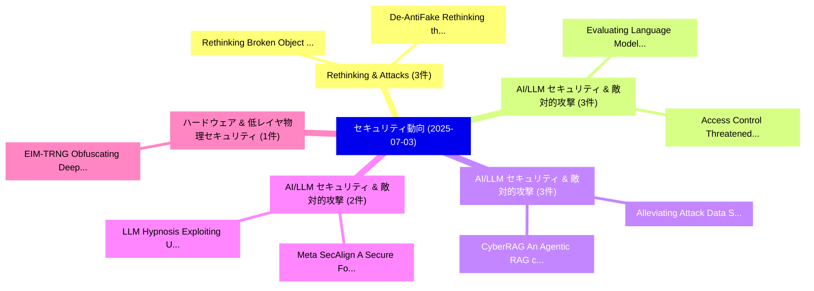

# 📅 02_daily: 日次エグゼクティブサマリー報告書 (2025-07-03)

**集計日時**: 2026-10-02 23:05:32 UTC  
**対象日付**: 2025-07-03  
**本日収集論文数**: 25 件  

---

## 💡 主要セキュリティ動向・脅威インサイト (Executive Insights)

本日の収集論文（計 25 件）において、以下の重点セキュリティ領域で活発な研究動向が確認されました：
- **Rethinking & Attacks** (3 件): 注目論文として 「Rethinking Broken Object Level...」、「De-AntiFake: Rethinking the Pr...」 等が発表され、実務防御および攻撃検証の進展が見られます。
- **AI/LLM セキュリティ & 敵対的攻撃** (3 件): 注目論文として 「Evaluating Language Models For...」、「Access Control Threatened by Q...」 等が発表され、実務防御および攻撃検証の進展が見られます。
- **AI/LLM セキュリティ & 敵対的攻撃** (3 件): 注目論文として 「CyberRAG: An Agentic RAG cyber...」、「Alleviating Attack Data Scarci...」 等が発表され、実務防御および攻撃検証の進展が見られます。
- **AI/LLM セキュリティ & 敵対的攻撃** (2 件): 注目論文として 「Meta SecAlign: A Secure Founda...」、「LLM Hypnosis: Exploiting User ...」 等が発表され、実務防御および攻撃検証の進展が見られます。
- **ハードウェア & 低レイヤ物理セキュリティ** (1 件): 注目論文として 「EIM-TRNG: Obfuscating Deep Neu...」 等が発表され、実務防御および攻撃検証の進展が見られます。

### 🗺️ 技術・脅威トピックマインドマップ

---

## 📌 日次セキュリティ論文一覧 (日本語表形式)

| No | arXiv ID | 論文タイトル (日本語訳) | 重要キーワード | 構造化エグゼクティブ要約 (背景・提案・影響) | 脅威分類 | 詳細リンク |
|---|---|---|---|---|---|---|
| 1 | `2507.02206v1` | [EIM-TRNG: Obfuscating Deep Neural Network Weights with Encoding-in-Memory True Random Number Generator via RowHammer（セキュリティ分析論文）](../../okf/papers/2025-07-03/2507.02206.md) | `Obfuscating Deep Neural Network Weights`, `Memory True Random Number Generator`, `Adnan Siraj Rakin` | 【提案】概要 (Overview & Key Finding) 本論文「EIM-TRNG: Obfuscating Deep Neural Network Weights with ...。実証評価により経営層・セキュリティ管理者向け推奨アクション (E... | `cs.CR` | [arXiv](https://arxiv.org/abs/2507.02206v1) &#124; [OKF](../../okf/papers/2025-07-03/2507.02206.md) |
| 2 | `2507.02281v4` | [Linearly Homomorphic Ring Signature Scheme over Lattices（セキュリティ分析論文）](../../okf/papers/2025-07-03/2507.02281.md) | `Linearly Homomorphic Ring Signature Scheme`, `Heng Guo`, `Jia Li` | 【提案】概要 (Overview & Key Finding) 本論文「Linearly Homomorphic Ring Signature Scheme over Lattice...。実証評価により経営層・セキュリティ管理者向け推奨アクション (E... | `cs.CR` | [arXiv](https://arxiv.org/abs/2507.02281v4) &#124; [OKF](../../okf/papers/2025-07-03/2507.02281.md) |
| 3 | `2507.02309v2` | [Rethinking Broken Object Level Authorization Attacks Under Zero Trust Principle（セキュリティ分析論文）](../../okf/papers/2025-07-03/2507.02309.md) | `Anbin Wu`, `Zhiyong Feng`, `Ruitao Feng` | 【提案】概要 (Overview & Key Finding) 本論文「Rethinking Broken Object Level Authorization Attacks Un...。実証評価により経営層・セキュリティ管理者向け推奨アクション (E... | `cs.CR` | [arXiv](https://arxiv.org/abs/2507.02309v2) &#124; [OKF](../../okf/papers/2025-07-03/2507.02309.md) |
| 4 | `2507.02332v2` | [PII Jailbreaking in LLMs via Activation Steering Reveals Personal Information Leakage（セキュリティ分析論文）](../../okf/papers/2025-07-03/2507.02332.md) | `Activation Steering Reveals Personal Information Leakage`, `Activation Steering Reveals Personal Inform`, `Krishna Kanth Nakka` | 【提案】概要 (Overview & Key Finding) 本論文「PII ジェイルブレイクing in LLMs via Activation Steering Reveals...。実証評価により経営層・セキュリティ管理者向け推奨アクション (E... | `cs.CR` | [arXiv](https://arxiv.org/abs/2507.02332v2) &#124; [OKF](../../okf/papers/2025-07-03/2507.02332.md) |
| 5 | `2507.02390v1` | [Evaluating Language Models For Threat Detection in IoT Security Logs（セキュリティ分析論文）](../../okf/papers/2025-07-03/2507.02390.md) | `Security Logs`, `Raw Meta`, `Executive Summary` | 【提案】概要 (Overview & Key Finding) 本論文「Evaluating Language Models For 脅威 Detection in IoT Secu...。実証評価によりTejero-Fernández, Al。 | `cs.CR` | [arXiv](https://arxiv.org/abs/2507.02390v1) &#124; [OKF](../../okf/papers/2025-07-03/2507.02390.md) |
| 6 | `2507.02414v1` | [Privacy-preserving Preselection for Face Identification Based on Packing（セキュリティ分析論文）](../../okf/papers/2025-07-03/2507.02414.md) | `Face Identification Based`, `Privacy-preserving Preselection`, `Rundong Xin` | 【提案】概要 (Overview & Key Finding) 本論文「Privacy-preserving Preselection for Face Identification...。実証評価により経営層・セキュリティ管理者向け推奨アクション (E... | `cs.CR` | [arXiv](https://arxiv.org/abs/2507.02414v1) &#124; [OKF](../../okf/papers/2025-07-03/2507.02414.md) |
| 7 | `2507.02424v2` | [CyberRAG: An Agentic RAG cyber attack classification and reporting tool（セキュリティ分析論文）](../../okf/papers/2025-07-03/2507.02424.md) | `Francesco Aurelio Pironti`, `Francesco Blefari`, `Cristian Cosentino` | 【提案】概要 (Overview & Key Finding) 本論文「CyberRAG: An Agentic RAG cyber attack classification an...。実証評価により経営層・セキュリティ管理者向け推奨アクション (E... | `cs.CR` | [arXiv](https://arxiv.org/abs/2507.02424v2) &#124; [OKF](../../okf/papers/2025-07-03/2507.02424.md) |
| 8 | `2507.02478v2` | [StateFi: Effectively Identifying Wi-Fi Devices through State Transitions（セキュリティ分析論文）](../../okf/papers/2025-07-03/2507.02478.md) | `Effectively Identifying Wi`, `Fi Devices`, `State Transitions` | 【提案】概要 (Overview & Key Finding) 本論文「StateFi: Effectively Identifying Wi-Fi Devices through ...。実証評価によりMishra, Mathieu Cunche - ... | `cs.CR` | [arXiv](https://arxiv.org/abs/2507.02478v2) &#124; [OKF](../../okf/papers/2025-07-03/2507.02478.md) |
| 9 | `2507.02489v1` | [A 10-bit S-box generated by Feistel construction from cellular automata（セキュリティ分析論文）](../../okf/papers/2025-07-03/2507.02489.md) | `10-bit S`, `Bruno Martin`, `Raw Meta` | 【提案】概要 (Overview & Key Finding) 本論文「A 10-bit S-box generated by Feistel construction from c...。実証評価により経営層・セキュリティ管理者向け推奨アクション (E... | `cs.CR` | [arXiv](https://arxiv.org/abs/2507.02489v1) &#124; [OKF](../../okf/papers/2025-07-03/2507.02489.md) |
| 10 | `2507.02536v1` | [Real-Time Monitoring and Transparency in Pizza Production Using IoT and Blockchain（セキュリティ分析論文）](../../okf/papers/2025-07-03/2507.02536.md) | `Pizza Production Using`, `Time Monitoring`, `Real-Time Monitoring` | 【提案】概要 (Overview & Key Finding) 本論文「Real-Time Monitoring and Transparency in Pizza Producti...。実証評価により経営層・セキュリティ管理者向け推奨アクション (E... | `cs.CR` | [arXiv](https://arxiv.org/abs/2507.02536v1) &#124; [OKF](../../okf/papers/2025-07-03/2507.02536.md) |
| 11 | `2507.02606v1` | [De-AntiFake: Rethinking the Protective Perturbations Against Voice Cloning Attacks（セキュリティ分析論文）](../../okf/papers/2025-07-03/2507.02606.md) | `Wei Fan`, `Kejiang Chen`, `Chang Liu` | 【提案】概要 (Overview & Key Finding) 本論文「De-AntiFake: Rethinking the Protective Perturbations Ag...。実証評価により経営層・セキュリティ管理者向け推奨アクション (E... | `cs.CR` | [arXiv](https://arxiv.org/abs/2507.02606v1) &#124; [OKF](../../okf/papers/2025-07-03/2507.02606.md) |
| 12 | `2507.02607v2` | [Alleviating Attack Data Scarcity: SCANIA's Experience Enhancing In-Vehicle Cyber Security Measuresに向けて](../../okf/papers/2025-07-03/2507.02607.md) | `Alleviating Attack Data Scarcity`, `In-Vehicle Cyber`, `Vehicle Cyber Security Measures` | 【提案】概要 (Overview & Key Finding) 本論文「Alleviating Attack Data Scarcity: SCANIA's Experience E...。実証評価により経営層・セキュリティ管理者向け推奨アクション (E... | `cs.CR` | [arXiv](https://arxiv.org/abs/2507.02607v2) &#124; [OKF](../../okf/papers/2025-07-03/2507.02607.md) |
| 13 | `2507.02622v1` | [Access Control Threatened by Quantum Entanglement（セキュリティ分析論文）](../../okf/papers/2025-07-03/2507.02622.md) | `Access Control Threatened`, `Quantum Entanglement`, `Zhicheng Zhang` | 【提案】概要 (Overview & Key Finding) 本論文「アクセス制御 Threatened by 量子 Entanglement（セキュリティ分析論文）」（原題: ア...。実証評価により経営層・セキュリティ管理者向け推奨アクション (E... | `cs.CR` | [arXiv](https://arxiv.org/abs/2507.02622v1) &#124; [OKF](../../okf/papers/2025-07-03/2507.02622.md) |
| 14 | `2507.02635v1` | [SAT-BO: Verification Rule Learning and Optimization for FraudTransaction Detection（セキュリティ分析論文）](../../okf/papers/2025-07-03/2507.02635.md) | `Verification Rule Learning`, `Mao Luo`, `Zhi Wang` | 【提案】概要 (Overview & Key Finding) 本論文「SAT-BO: Verification Rule Learning and Optimization for...。実証評価により経営層・セキュリティ管理者向け推奨アクション (E... | `cs.CR` | [arXiv](https://arxiv.org/abs/2507.02635v1) &#124; [OKF](../../okf/papers/2025-07-03/2507.02635.md) |
| 15 | `2507.02699v1` | [Control at Stake: Evaluating the Security Landscape of LLM-Driven Email Agents（セキュリティ分析論文）](../../okf/papers/2025-07-03/2507.02699.md) | `Driven Email Agents`, `Security Landscape`, `LLM-Driven Email` | 【提案】概要 (Overview & Key Finding) 本論文「Control at Stake: Evaluating the Security Landscape of ...。実証評価により経営層・セキュリティ管理者向け推奨アクション (E... | `cs.CR` | [arXiv](https://arxiv.org/abs/2507.02699v1) &#124; [OKF](../../okf/papers/2025-07-03/2507.02699.md) |
| 16 | `2507.02727v3` | [Quantifying Classifier Utility under Local Differential Privacy（セキュリティ分析論文）](../../okf/papers/2025-07-03/2507.02727.md) | `Quantifying Classifier Utility`, `Local Differential Privacy`, `Ye Zheng` | 【提案】概要 (Overview & Key Finding) 本論文「Quantifying Classifier Utility under Local 差分プライバシー（セキュ...。実証評価により経営層・セキュリティ管理者向け推奨アクション (E... | `cs.CR` | [arXiv](https://arxiv.org/abs/2507.02727v3) &#124; [OKF](../../okf/papers/2025-07-03/2507.02727.md) |
| 17 | `2507.02735v3` | [Meta SecAlign: A Secure Foundation LLM Against Prompt Injection Attacks（セキュリティ分析論文）](../../okf/papers/2025-07-03/2507.02735.md) | `Secure Foundation`, `Sizhe Chen`, `Arman Zharmagambetov` | 【提案】概要 (Overview & Key Finding) 本論文「Meta SecAlign: A Secure Foundation LLM Against プロンプトインジ...。実証評価により経営層・セキュリティ管理者向け推奨アクション (E... | `cs.CR` | [arXiv](https://arxiv.org/abs/2507.02735v3) &#124; [OKF](../../okf/papers/2025-07-03/2507.02735.md) |
| 18 | `2507.02737v2` | [Early Signs of Steganographic Capabilities in Frontier LLMs（セキュリティ分析論文）](../../okf/papers/2025-07-03/2507.02737.md) | `Early Signs`, `Steganographic Capabilities`, `Artur Zolkowski` | 【提案】概要 (Overview & Key Finding) 本論文「Early Signs of Steganographic Capabilities in Frontier ...。実証評価によりZimmermann, David Lindner。 | `cs.CR` | [arXiv](https://arxiv.org/abs/2507.02737v2) &#124; [OKF](../../okf/papers/2025-07-03/2507.02737.md) |
| 19 | `2507.02770v2` | [Blueprint, Bootstrap, and Bridge: A Security Look at NVIDIA GPU Confidential Computing（セキュリティ分析論文）](../../okf/papers/2025-07-03/2507.02770.md) | `Security Look`, `Confidential Computing`, `Julian James Stephen` | 【提案】概要 (Overview & Key Finding) 本論文「Blueprint, Bootstrap, and Bridge: A Security Look at NV...。実証評価により経営層・セキュリティ管理者向け推奨アクション (E... | `cs.CR` | [arXiv](https://arxiv.org/abs/2507.02770v2) &#124; [OKF](../../okf/papers/2025-07-03/2507.02770.md) |
| 20 | `2507.02844v2` | [Visual Contextual Attack: Jailbreaking MLLMs with Image-Driven Context Injection（セキュリティ分析論文）](../../okf/papers/2025-07-03/2507.02844.md) | `Visual Contextual Attack`, `Driven Context Injection`, `Image-Driven Context` | 【提案】概要 (Overview & Key Finding) 本論文「Visual Contextual Attack: ジェイルブレイクing MLLMs with Image-...。実証評価により経営層・セキュリティ管理者向け推奨アクション (E... | `cs.CR` | [arXiv](https://arxiv.org/abs/2507.02844v2) &#124; [OKF](../../okf/papers/2025-07-03/2507.02844.md) |
| 21 | `2507.02850v3` | [LLM Hypnosis: Exploiting User Feedback for Unauthorized Knowledge Injection to All Users（セキュリティ分析論文）](../../okf/papers/2025-07-03/2507.02850.md) | `Exploiting User Feedback`, `Unauthorized Knowledge Injection`, `Almog Hilel` | 【提案】概要 (Overview & Key Finding) 本論文「LLM Hypnosis: Exploiting User Feedback for Unauthorized...。実証評価により経営層・セキュリティ管理者向け推奨アクション (E... | `cs.CR` | [arXiv](https://arxiv.org/abs/2507.02850v3) &#124; [OKF](../../okf/papers/2025-07-03/2507.02850.md) |
| 22 | `2507.03034v4` | [Rethinking Data Protection in the (Generative) Artificial Intelligence Era（セキュリティ分析論文）](../../okf/papers/2025-07-03/2507.03034.md) | `Rethinking Data Protection`, `Artificial Intelligence Era`, `Yiming Li` | 【提案】概要 (Overview & Key Finding) 本論文「Rethinking Data Protection in the (Generative) Artifici...。実証評価により経営層・セキュリティ管理者向け推奨アクション (E... | `cs.CR` | [arXiv](https://arxiv.org/abs/2507.03034v4) &#124; [OKF](../../okf/papers/2025-07-03/2507.03034.md) |
| 23 | `2507.03051v1` | [Improving LLM Reasoning for 脆弱性検出 via Group Relative Policy Optimization](../../okf/papers/2025-07-03/2507.03051.md) | `Group Relative Policy Optimization`, `Vulnerability Detection`, `Marco Simoni` | 【提案】概要 (Overview & Key Finding) 本論文「Improving LLM Reasoning for 脆弱性検出 via Group Relative Po...。実証評価により経営層・セキュリティ管理者向け推奨アクション (E... | `cs.CR` | [arXiv](https://arxiv.org/abs/2507.03051v1) &#124; [OKF](../../okf/papers/2025-07-03/2507.03051.md) |
| 24 | `2507.03064v1` | [LLM-Driven Auto Configuration for Transient IoT Device Collaboration（セキュリティ分析論文）](../../okf/papers/2025-07-03/2507.03064.md) | `Driven Auto Configuration`, `Device Collaboration`, `LLM-Driven Auto` | 【提案】概要 (Overview & Key Finding) 本論文「LLM-Driven Auto Configuration for Transient IoT Device ...。実証評価によりHanafy, Li Wu, David Irwi... | `cs.CR` | [arXiv](https://arxiv.org/abs/2507.03064v1) &#124; [OKF](../../okf/papers/2025-07-03/2507.03064.md) |
| 25 | `2507.03136v1` | [Holographic Projection and Cyber Attack Surface: A Physical Analogy for Digital Security（セキュリティ分析論文）](../../okf/papers/2025-07-03/2507.03136.md) | `Cyber Attack Surface`, `Holographic Projection`, `Physical Analogy` | 【提案】概要 (Overview & Key Finding) 本論文「Holographic Projection and Cyber Attack Surface: A Phys...。実証評価により経営層・セキュリティ管理者向け推奨アクション (E... | `cs.CR` | [arXiv](https://arxiv.org/abs/2507.03136v1) &#124; [OKF](../../okf/papers/2025-07-03/2507.03136.md) |

