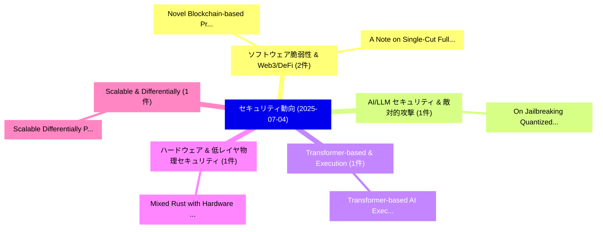

# 📅 02_daily: 日次エグゼクティブサマリー報告書 (2025-07-04)

**集計日時**: 2026-10-02 23:05:32 UTC  
**対象日付**: 2025-07-04  
**本日収集論文数**: 16 件  

---

## 💡 主要セキュリティ動向・脅威インサイト (Executive Insights)

本日の収集論文（計 16 件）において、以下の重点セキュリティ領域で活発な研究動向が確認されました：
- **ソフトウェア脆弱性 & Web3/DeFi** (2 件): 注目論文として 「Novel Blockchain-based Protoco...」、「A Note on Single-Cut Full-Open...」 等が発表され、実務防御および攻撃検証の進展が見られます。
- **AI/LLM セキュリティ & 敵対的攻撃** (1 件): 注目論文として 「On Jailbreaking Quantized Lang...」 等が発表され、実務防御および攻撃検証の進展が見られます。
- **Transformer-based & Execution** (1 件): 注目論文として 「Transformer-based AI Execution...」 等が発表され、実務防御および攻撃検証の進展が見られます。
- **ハードウェア & 低レイヤ物理セキュリティ** (1 件): 注目論文として 「Mixed Rust with Hardware Capab...」 等が発表され、実務防御および攻撃検証の進展が見られます。
- **Scalable & Differentially** (1 件): 注目論文として 「Scalable Differentially Privat...」 等が発表され、実務防御および攻撃検証の進展が見られます。

### 🗺️ 技術・脅威トピックマインドマップ

---

## 📌 日次セキュリティ論文一覧 (日本語表形式)

| No | arXiv ID | 論文タイトル (日本語訳) | 重要キーワード | 構造化エグゼクティブ要約 (背景・提案・影響) | 脅威分類 | 詳細リンク |
|---|---|---|---|---|---|---|
| 1 | `2507.03236v2` | [On Jailbreaking Quantized Language Models Through Fault Injection Attacks（セキュリティ分析論文）](../../okf/papers/2025-07-04/2507.03236.md) | `Noureldin Zahran`, `Ahmad Tahmasivand`, `Ihsen Alouani` | 【提案】概要 (Overview & Key Finding) 本論文「On ジェイルブレイクing Quantized Language Models Through フォールト注...。実証評価により経営層・セキュリティ管理者向け推奨アクション (E... | `cs.CR` | [arXiv](https://arxiv.org/abs/2507.03236v2) &#124; [OKF](../../okf/papers/2025-07-04/2507.03236.md) |
| 2 | `2507.03258v2` | [Novel Blockchain-based Protocols for Electronic Voting and Auctions（セキュリティ分析論文）](../../okf/papers/2025-07-04/2507.03258.md) | `Electronic Voting`, `Blockchain-based Protocols`, `Zhaorun Lin` | 【提案】概要 (Overview & Key Finding) 本論文「Novel Blockchain-based Protocols for Electronic Voting ...。実証評価により経営層・セキュリティ管理者向け推奨アクション (E... | `cs.CR` | [arXiv](https://arxiv.org/abs/2507.03258v2) &#124; [OKF](../../okf/papers/2025-07-04/2507.03258.md) |
| 3 | `2507.03278v2` | [Transformer-based AI Execution via Unified TEEs and Crypto-protected Acceleratorsのセキュリティ強化](../../okf/papers/2025-07-04/2507.03278.md) | `Transformer-based AI`, `Securing Transformer`, `Crypto-protected Accelerators` | 【提案】概要 (Overview & Key Finding) 本論文「Transformer-based AI Execution via Unified TEEs and Cry...。実証評価により経営層・セキュリティ管理者向け推奨アクション (E... | `cs.CR` | [arXiv](https://arxiv.org/abs/2507.03278v2) &#124; [OKF](../../okf/papers/2025-07-04/2507.03278.md) |
| 4 | `2507.03323v1` | [A Note on Single-Cut Full-Open Protocols（セキュリティ分析論文）](../../okf/papers/2025-07-04/2507.03323.md) | `Cut Full`, `Open Protocols`, `Single-Cut Full` | 【提案】概要 (Overview & Key Finding) 本論文「A Note on Single-Cut Full-Open Protocols（セキュリティ分析論文）」（原...。実証評価により経営層・セキュリティ管理者向け推奨アクション (E... | `cs.CR` | [arXiv](https://arxiv.org/abs/2507.03323v1) &#124; [OKF](../../okf/papers/2025-07-04/2507.03323.md) |
| 5 | `2507.03344v1` | [Mixed Rust with Hardware Capabilitiesのセキュリティ強化](../../okf/papers/2025-07-04/2507.03344.md) | `Securing Mixed Rust`, `Hardware Capabilities`, `Mixed Rust` | 【提案】概要 (Overview & Key Finding) 本論文「Mixed Rust with Hardware Capabilitiesのセキュリティ強化」（原題: Sec...。実証評価によりCarlson, Prateek Saxena -... | `cs.CR` | [arXiv](https://arxiv.org/abs/2507.03344v1) &#124; [OKF](../../okf/papers/2025-07-04/2507.03344.md) |
| 6 | `2507.03361v4` | [Scalable Differentially Private Sketches under Continual Observation（セキュリティ分析論文）](../../okf/papers/2025-07-04/2507.03361.md) | `Scalable Differentially Private Sketches`, `Continual Observation`, `Rayne Holland` | 【提案】概要 (Overview & Key Finding) 本論文「Scalable Differentially Private Sketches under Continua...。実証評価により経営層・セキュリティ管理者向け推奨アクション (E... | `cs.CR` | [arXiv](https://arxiv.org/abs/2507.03361v4) &#124; [OKF](../../okf/papers/2025-07-04/2507.03361.md) |
| 7 | `2507.03387v3` | [Breaking the Bulkhead: Demystifying Cross-Namespace Reference Vulnerabilities in Kubernetes Operators（セキュリティ分析論文）](../../okf/papers/2025-07-04/2507.03387.md) | `Namespace Reference Vulnerabilities`, `Demystifying Cross`, `Cross-Namespace Reference` | 【提案】概要 (Overview & Key Finding) 本論文「Breaking the Bulkhead: Demystifying Cross-Namespace Ref...。実証評価により経営層・セキュリティ管理者向け推奨アクション (E... | `cs.CR` | [arXiv](https://arxiv.org/abs/2507.03387v3) &#124; [OKF](../../okf/papers/2025-07-04/2507.03387.md) |
| 8 | `2507.03450v1` | [Evaluating the Evaluators: Trust in Adversarial Robustness Tests（セキュリティ分析論文）](../../okf/papers/2025-07-04/2507.03450.md) | `Adversarial Robustness Tests`, `Antonio Emanuele`, `Maura Pintor` | 【提案】概要 (Overview & Key Finding) 本論文「Evaluating the Evaluators: Trust in Adversarial Robustn...。実証評価により# Evaluating the Evaluato... | `cs.CR` | [arXiv](https://arxiv.org/abs/2507.03450v1) &#124; [OKF](../../okf/papers/2025-07-04/2507.03450.md) |
| 9 | `2507.03607v1` | [VLAI: A RoBERTa-Based Model for Automated Vulnerability Severity Classification（セキュリティ分析論文）](../../okf/papers/2025-07-04/2507.03607.md) | `Automated Vulnerability Severity Classification`, `Based Model`, `RoBERTa-Based Model` | 【提案】概要 (Overview & Key Finding) 本論文「VLAI: A RoBERTa-Based Model for Automated 脆弱性 Severity ...。実証評価により経営層・セキュリティ管理者向け推奨アクション (E... | `cs.CR` | [arXiv](https://arxiv.org/abs/2507.03607v1) &#124; [OKF](../../okf/papers/2025-07-04/2507.03607.md) |
| 10 | `2507.03619v3` | [Blackbox Dataset Inference for LLM（セキュリティ分析論文）](../../okf/papers/2025-07-04/2507.03619.md) | `Blackbox Dataset Inference`, `Wendy Hui Wang`, `Ruikai Zhou` | 【提案】概要 (Overview & Key Finding) 本論文「Blackbox Dataset Inference for LLM（セキュリティ分析論文）」（原題: Bla...。実証評価により経営層・セキュリティ管理者向け推奨アクション (E... | `cs.CR` | [arXiv](https://arxiv.org/abs/2507.03619v3) &#124; [OKF](../../okf/papers/2025-07-04/2507.03619.md) |
| 11 | `2507.03635v1` | [A Novel Four-Stage Synchronized Chaotic Map: Design and Statistical Characterization（セキュリティ分析論文）](../../okf/papers/2025-07-04/2507.03635.md) | `Stage Synchronized Chaotic Map`, `Statistical Characterization`, `Four-Stage Synchronized` | 【提案】概要 (Overview & Key Finding) 本論文「A Novel Four-Stage Synchronized Chaotic Map: Design and...。実証評価により経営層・セキュリティ管理者向け推奨アクション (E... | `cs.CR` | [arXiv](https://arxiv.org/abs/2507.03635v1) &#124; [OKF](../../okf/papers/2025-07-04/2507.03635.md) |
| 12 | `2507.03636v1` | [SecureT2I: No More Unauthorized Manipulation on AI Generated Images from Prompts（セキュリティ分析論文）](../../okf/papers/2025-07-04/2507.03636.md) | `Generated Images`, `Xiaodong Wu`, `Xiangman Li` | 【提案】概要 (Overview & Key Finding) 本論文「SecureT2I: No More Unauthorized Manipulation on AI Gene...。実証評価により経営層・セキュリティ管理者向け推奨アクション (E... | `cs.CR` | [arXiv](https://arxiv.org/abs/2507.03636v1) &#124; [OKF](../../okf/papers/2025-07-04/2507.03636.md) |
| 13 | `2507.03646v1` | [When There Is No Decoder: Removing Watermarks from Stable Diffusion Models in a No-box Setting（セキュリティ分析論文）](../../okf/papers/2025-07-04/2507.03646.md) | `Stable Diffusion Models`, `Removing Watermarks`, `No-box Setting` | 【提案】概要 (Overview & Key Finding) 本論文「When There Is No Decoder: Removing Watermarks from Stab...。実証評価により経営層・セキュリティ管理者向け推奨アクション (E... | `cs.CR` | [arXiv](https://arxiv.org/abs/2507.03646v1) &#124; [OKF](../../okf/papers/2025-07-04/2507.03646.md) |
| 14 | `2507.03694v1` | [Willchain: Decentralized, Privacy-Preserving, Self-Executing, Digital Wills（セキュリティ分析論文）](../../okf/papers/2025-07-04/2507.03694.md) | `Digital Wills`, `Raw Meta`, `Executive Summary` | 【提案】概要 (Overview & Key Finding) 本論文「Willchain: Decentralized, Privacy-Preserving, Self-Exec...。実証評価により経営層・セキュリティ管理者向け推奨アクション (E... | `cs.CR` | [arXiv](https://arxiv.org/abs/2507.03694v1) &#124; [OKF](../../okf/papers/2025-07-04/2507.03694.md) |
| 15 | `2507.03773v1` | [RVISmith: Fuzzing Compilers for RVV Intrinsics（セキュリティ分析論文）](../../okf/papers/2025-07-04/2507.03773.md) | `Fuzzing Compilers`, `Cunjian Huang`, `Xianmiao Qu` | 【提案】概要 (Overview & Key Finding) 本論文「RVISmith: Fuzzing Compilers for RVV Intrinsics（セキュリティ分析...。実証評価により経営層・セキュリティ管理者向け推奨アクション (E... | `cs.CR` | [arXiv](https://arxiv.org/abs/2507.03773v1) &#124; [OKF](../../okf/papers/2025-07-04/2507.03773.md) |
| 16 | `2508.00840v3` | [Enhanced Quantum Resistance for RSA via Constrained Rényi Entropy Optimization: A Theoretical Framework for Backward-Compatible Cryptographyに向けて](../../okf/papers/2025-07-04/2508.00840.md) | `Entropy Optimization`, `Towards Enhanced Quantum Resistance`, `Enhanced Quantum Resistance` | 【提案】概要 (Overview & Key Finding) 本論文「Enhanced 量子 Resistance for RSA via Constrained Rényi En...。実証評価により経営層・セキュリティ管理者向け推奨アクション (E... | `cs.CR` | [arXiv](https://arxiv.org/abs/2508.00840v3) &#124; [OKF](../../okf/papers/2025-07-04/2508.00840.md) |

