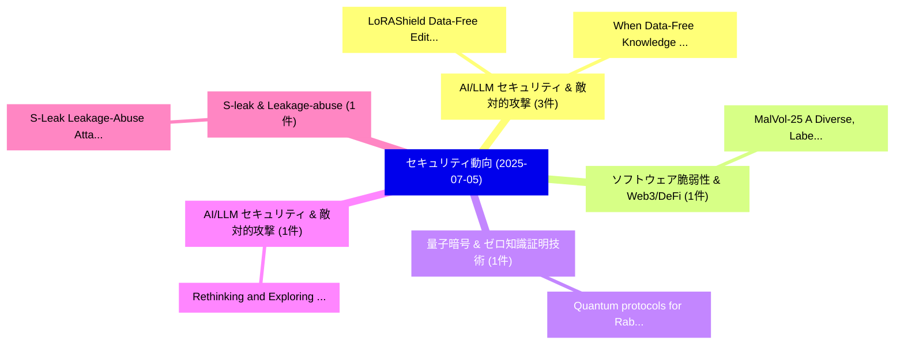

# 📅 02_daily: 日次エグゼクティブサマリー報告書 (2025-07-05)

**集計日時**: 2026-10-02 23:05:32 UTC  
**対象日付**: 2025-07-05  
**本日収集論文数**: 13 件  

---

## 💡 主要セキュリティ動向・脅威インサイト (Executive Insights)

本日の収集論文（計 13 件）において、以下の重点セキュリティ領域で活発な研究動向が確認されました：
- **AI/LLM セキュリティ & 敵対的攻撃** (3 件): 注目論文として 「When Data-Free Knowledge Disti...」、「LoRAShield: Data-Free Editing ...」 等が発表され、実務防御および攻撃検証の進展が見られます。
- **ソフトウェア脆弱性 & Web3/DeFi** (1 件): 注目論文として 「MalVol-25: A Diverse, Labelled...」 等が発表され、実務防御および攻撃検証の進展が見られます。
- **量子暗号 & ゼロ知識証明技術** (1 件): 注目論文として 「Quantum protocols for Rabin ob...」 等が発表され、実務防御および攻撃検証の進展が見られます。
- **AI/LLM セキュリティ & 敵対的攻撃** (1 件): 注目論文として 「Rethinking and Exploring Strin...」 等が発表され、実務防御および攻撃検証の進展が見られます。
- **S-leak & Leakage-abuse** (1 件): 注目論文として 「S-Leak: Leakage-Abuse Attack A...」 等が発表され、実務防御および攻撃検証の進展が見られます。

### 🗺️ 技術・脅威トピックマインドマップ

---

## 📌 日次セキュリティ論文一覧 (日本語表形式)

| No | arXiv ID | 論文タイトル (日本語訳) | 重要キーワード | 構造化エグゼクティブ要約 (背景・提案・影響) | 脅威分類 | 詳細リンク |
|---|---|---|---|---|---|---|
| 1 | `2507.03993v1` | [MalVol-25: A Diverse, Labelled and Detailed Volatile Memory Dataset for マルウェア検出 and Response Testing and Validation](../../okf/papers/2025-07-05/2507.03993.md) | `Detailed Volatile Memory Dataset`, `Response Testing`, `Malware Detection` | 【提案】概要 (Overview & Key Finding) 本論文「MalVol-25: A Diverse, Labelled and Detailed Volatile Me...。実証評価により経営層・セキュリティ管理者向け推奨アクション (E... | `cs.CR` | [arXiv](https://arxiv.org/abs/2507.03993v1) &#124; [OKF](../../okf/papers/2025-07-05/2507.03993.md) |
| 2 | `2507.04015v1` | [Quantum protocols for Rabin oblivious transfer（セキュリティ分析論文）](../../okf/papers/2025-07-05/2507.04015.md) | `Erika Andersson`, `Akshay Bansal`, `Jamie Sikora` | 【提案】概要 (Overview & Key Finding) 本論文「量子 protocols for Rabin oblivious transfer（セキュリティ分析論文）」（...。実証評価によりPeat, Jamie Sikora, Jiawe... | `cs.CR` | [arXiv](https://arxiv.org/abs/2507.04015v1) &#124; [OKF](../../okf/papers/2025-07-05/2507.04015.md) |
| 3 | `2507.04055v2` | [Rethinking and Exploring String-Based Malware Family Classification in the Era of LLMs and RAG（セキュリティ分析論文）](../../okf/papers/2025-07-05/2507.04055.md) | `Based Malware Family Classification`, `Exploring String`, `String-Based Malware` | 【提案】概要 (Overview & Key Finding) 本論文「Rethinking and Exploring String-Based マルウェア Family Clas...。実証評価により経営層・セキュリティ管理者向け推奨アクション (E... | `cs.CR` | [arXiv](https://arxiv.org/abs/2507.04055v2) &#124; [OKF](../../okf/papers/2025-07-05/2507.04055.md) |
| 4 | `2507.04077v1` | [S-Leak: Leakage-Abuse Attack Against Efficient Conjunctive SSE via s-term Leakage（セキュリティ分析論文）](../../okf/papers/2025-07-05/2507.04077.md) | `Leakage-Abuse Attack`, `s-term Leakage`, `Yue Su` | 【提案】概要 (Overview & Key Finding) 本論文「S-Leak: Leakage-Abuse Attack Against Efficient Conjunct...。実証評価により経営層・セキュリティ管理者向け推奨アクション (E... | `cs.CR` | [arXiv](https://arxiv.org/abs/2507.04077v1) &#124; [OKF](../../okf/papers/2025-07-05/2507.04077.md) |
| 5 | `2507.04104v1` | [Human-Centered Interactive Anonymization for Privacy-Preserving Machine Learning: A Case for Human-Guided k-Anonymity（セキュリティ分析論文）](../../okf/papers/2025-07-05/2507.04104.md) | `Centered Interactive Anonymization`, `Preserving Machine Learning`, `Human-Centered Interactive` | 【提案】概要 (Overview & Key Finding) 本論文「Human-Centered Interactive Anonymization for Privacy-Pr...。実証評価により経営層・セキュリティ管理者向け推奨アクション (E... | `cs.CR` | [arXiv](https://arxiv.org/abs/2507.04104v1) &#124; [OKF](../../okf/papers/2025-07-05/2507.04104.md) |
| 6 | `2507.04106v2` | [Addressing The Devastating Effects Of Single-Task Data Poisoning In Exemplar-Free Continual Learning（セキュリティ分析論文）](../../okf/papers/2025-07-05/2507.04106.md) | `Free Continual Learning`, `Single-Task Data`, `Exemplar-Free Continual` | 【提案】概要 (Overview & Key Finding) 本論文「Addressing The Devastating Effects Of Single-Task Data ...。実証評価により経営層・セキュリティ管理者向け推奨アクション (E... | `cs.CR` | [arXiv](https://arxiv.org/abs/2507.04106v2) &#124; [OKF](../../okf/papers/2025-07-05/2507.04106.md) |
| 7 | `2507.04119v1` | [When Data-Free Knowledge Distillation Meets Non-Transferable Teacher: Escaping Out-of-Distribution Trap is All You Need（セキュリティ分析論文）](../../okf/papers/2025-07-05/2507.04119.md) | `Free Knowledge Distillation Meets Non`, `Transferable Teacher`, `Distribution Trap` | 【提案】概要 (Overview & Key Finding) 本論文「When Data-Free Knowledge Distillation Meets Non-Transfe...。実証評価により経営層・セキュリティ管理者向け推奨アクション (E... | `cs.CR` | [arXiv](https://arxiv.org/abs/2507.04119v1) &#124; [OKF](../../okf/papers/2025-07-05/2507.04119.md) |
| 8 | `2507.04126v1` | [BlowPrint: Blow-Based Multi-Factor Biometrics for Smartphone User Authentication（セキュリティ分析論文）](../../okf/papers/2025-07-05/2507.04126.md) | `Smartphone User Authentication`, `Based Multi`, `Factor Biometrics` | 【提案】概要 (Overview & Key Finding) 本論文「BlowPrint: Blow-Based Multi-Factor Biometrics for Smart...。実証評価により経営層・セキュリティ管理者向け推奨アクション (E... | `cs.CR` | [arXiv](https://arxiv.org/abs/2507.04126v1) &#124; [OKF](../../okf/papers/2025-07-05/2507.04126.md) |
| 9 | `2507.04174v1` | [Cloud Digital Forensic Readiness: An Open Source Approach to Law Enforcement Request Management（セキュリティ分析論文）](../../okf/papers/2025-07-05/2507.04174.md) | `Cloud Digital Forensic Readiness`, `Law Enforcement Request Management`, `Abdellah Akilal` | 【提案】概要 (Overview & Key Finding) 本論文「Cloud Digital Forensic Readiness: An Open Source Approa...。実証評価により経営層・セキュリティ管理者向け推奨アクション (E... | `cs.CR` | [arXiv](https://arxiv.org/abs/2507.04174v1) &#124; [OKF](../../okf/papers/2025-07-05/2507.04174.md) |
| 10 | `2507.06250v1` | [We Urgently Need Privilege Management in MCP: A Measurement of API Usage in MCP Ecosystems（セキュリティ分析論文）](../../okf/papers/2025-07-05/2507.06250.md) | `Zhihao Li`, `Kun Li`, `Boyang Ma` | 【提案】概要 (Overview & Key Finding) 本論文「We Urgently Need Privilege Management in MCP: A Measure...。実証評価により経営層・セキュリティ管理者向け推奨アクション (E... | `cs.CR` | [arXiv](https://arxiv.org/abs/2507.06250v1) &#124; [OKF](../../okf/papers/2025-07-05/2507.06250.md) |
| 11 | `2507.06252v2` | [False Alarms, Real Damage: Adversarial Attacks Using LLM-based Models on Text-based Cyber Threat Intelligence Systems（セキュリティ分析論文）](../../okf/papers/2025-07-05/2507.06252.md) | `Cyber Threat Intelligence Systems`, `Adversarial Attacks Using`, `False Alarms` | 【提案】概要 (Overview & Key Finding) 本論文「False Alarms, Real Damage: 敵対的攻撃s Using LLM-based Model...。実証評価により経営層・セキュリティ管理者向け推奨アクション (E... | `cs.CR` | [arXiv](https://arxiv.org/abs/2507.06252v2) &#124; [OKF](../../okf/papers/2025-07-05/2507.06252.md) |
| 12 | `2507.07056v2` | [LoRAShield: Data-Free Editing Alignment for Secure Personalized LoRA Sharing（セキュリティ分析論文）](../../okf/papers/2025-07-05/2507.07056.md) | `Free Editing Alignment`, `Data-Free Editing`, `Secure Personalized` | 【提案】概要 (Overview & Key Finding) 本論文「LoRAShield: Data-Free Editing Alignment for Secure Pers...。実証評価により経営層・セキュリティ管理者向け推奨アクション (E... | `cs.CR` | [arXiv](https://arxiv.org/abs/2507.07056v2) &#124; [OKF](../../okf/papers/2025-07-05/2507.07056.md) |
| 13 | `2507.10562v1` | [SAMEP: A Secure Protocol for Persistent Context Sharing Across AI Agents（セキュリティ分析論文）](../../okf/papers/2025-07-05/2507.10562.md) | `Persistent Context Sharing Across`, `Secure Protocol`, `Hari Masoor` | 【提案】概要 (Overview & Key Finding) 本論文「SAMEP: A Secure Protocol for Persistent Context Sharing...。実証評価により経営層・セキュリティ管理者向け推奨アクション (E... | `cs.CR` | [arXiv](https://arxiv.org/abs/2507.10562v1) &#124; [OKF](../../okf/papers/2025-07-05/2507.10562.md) |

