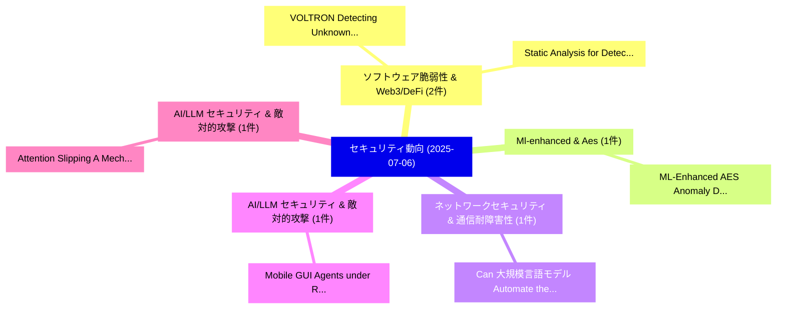

# 📅 02_daily: 日次エグゼクティブサマリー報告書 (2025-07-06)

**集計日時**: 2026-10-02 23:05:32 UTC  
**対象日付**: 2025-07-06  
**本日収集論文数**: 16 件  

---

## 💡 主要セキュリティ動向・脅威インサイト (Executive Insights)

本日の収集論文（計 16 件）において、以下の重点セキュリティ領域で活発な研究動向が確認されました：
- **ソフトウェア脆弱性 & Web3/DeFi** (2 件): 注目論文として 「VOLTRON: Detecting Unknown Mal...」、「Static Analysis for Detecting ...」 等が発表され、実務防御および攻撃検証の進展が見られます。
- **Ml-enhanced & Aes** (1 件): 注目論文として 「ML-Enhanced AES Anomaly Detect...」 等が発表され、実務防御および攻撃検証の進展が見られます。
- **ネットワークセキュリティ & 通信耐障害性** (1 件): 注目論文として 「Can 大規模言語モデル Automate the Refi...」 等が発表され、実務防御および攻撃検証の進展が見られます。
- **AI/LLM セキュリティ & 敵対的攻撃** (1 件): 注目論文として 「Mobile GUI Agents under Real-w...」 等が発表され、実務防御および攻撃検証の進展が見られます。
- **AI/LLM セキュリティ & 敵対的攻撃** (1 件): 注目論文として 「Attention Slipping: A Mechanis...」 等が発表され、実務防御および攻撃検証の進展が見られます。

### 🗺️ 技術・脅威トピックマインドマップ

---

## 📌 日次セキュリティ論文一覧 (日本語表形式)

| No | arXiv ID | 論文タイトル (日本語訳) | 重要キーワード | 構造化エグゼクティブ要約 (背景・提案・影響) | 脅威分類 | 詳細リンク |
|---|---|---|---|---|---|---|
| 1 | `2507.04197v1` | [ML-Enhanced AES Anomaly Detection for Real-Time Embedded Security（セキュリティ分析論文）](../../okf/papers/2025-07-06/2507.04197.md) | `Time Embedded Security`, `Anomaly Detection`, `ML-Enhanced AES` | 【提案】概要 (Overview & Key Finding) 本論文「ML-Enhanced AES Anomaly Detection for Real-Time Embedde...。実証評価により経営層・セキュリティ管理者向け推奨アクション (E... | `cs.CR` | [arXiv](https://arxiv.org/abs/2507.04197v1) &#124; [OKF](../../okf/papers/2025-07-06/2507.04197.md) |
| 2 | `2507.04214v2` | [Can 大規模言語モデル Automate the Refinement of Cellular Network Specifications?](../../okf/papers/2025-07-06/2507.04214.md) | `Cellular Network Specifications`, `Can Large Language Models Automate`, `Jianshuo Dong` | 【提案】### (日本語題名: Can 大規模言語モデル Automate the Refinement of Cellular Network Specifications?)  ...。実証評価により経営層・セキュリティ管理者向け推奨アクション (E... | `cs.CR` | [arXiv](https://arxiv.org/abs/2507.04214v2) &#124; [OKF](../../okf/papers/2025-07-06/2507.04214.md) |
| 3 | `2507.04227v2` | [Mobile GUI Agents under Real-world Threats: Are We There Yet?（セキュリティ分析論文）](../../okf/papers/2025-07-06/2507.04227.md) | `Real-world Threats`, `Guohong Liu`, `Jialei Ye` | 【提案】### (日本語題名: Mobile GUI Agents under Real-world Threats: Are We There Yet?（セキュリティ分析論文）) ...。実証評価により経営層・セキュリティ管理者向け推奨アクション (E... | `cs.CR` | [arXiv](https://arxiv.org/abs/2507.04227v2) &#124; [OKF](../../okf/papers/2025-07-06/2507.04227.md) |
| 4 | `2507.04275v1` | [VOLTRON: Detecting Unknown Malware Using Graph-Based Zero-Shot Learning（セキュリティ分析論文）](../../okf/papers/2025-07-06/2507.04275.md) | `Detecting Unknown Malware Using Graph`, `Based Zero`, `Shot Learning` | 【提案】概要 (Overview & Key Finding) 本論文「VOLTRON: Detecting Unknown マルウェア Using Graph-Based Zero...。実証評価によりTahir Akdeni。 | `cs.CR` | [arXiv](https://arxiv.org/abs/2507.04275v1) &#124; [OKF](../../okf/papers/2025-07-06/2507.04275.md) |
| 5 | `2507.04357v2` | [Static Analysis for Detecting Transaction Conflicts in Ethereum Smart Contracts（セキュリティ分析論文）](../../okf/papers/2025-07-06/2507.04357.md) | `Detecting Transaction Conflicts`, `Ethereum Smart Contracts`, `Atefeh Zareh Chahoki` | 【提案】概要 (Overview & Key Finding) 本論文「Static Analysis for Detecting Transaction Conflicts in ...。実証評価により経営層・セキュリティ管理者向け推奨アクション (E... | `cs.CR` | [arXiv](https://arxiv.org/abs/2507.04357v2) &#124; [OKF](../../okf/papers/2025-07-06/2507.04357.md) |
| 6 | `2507.04365v1` | [Attention Slipping: A Mechanistic Understanding of Jailbreak Attacks and Defenses in LLMs（セキュリティ分析論文）](../../okf/papers/2025-07-06/2507.04365.md) | `Attention Slipping`, `Mechanistic Understanding`, `Jailbreak Attacks` | 【提案】概要 (Overview & Key Finding) 本論文「Attention Slipping: A Mechanistic Understanding of ジェイル...。実証評価により経営層・セキュリティ管理者向け推奨アクション (E... | `cs.CR` | [arXiv](https://arxiv.org/abs/2507.04365v1) &#124; [OKF](../../okf/papers/2025-07-06/2507.04365.md) |
| 7 | `2507.04372v1` | [Adaptive マルウェア検出 using Sequential Feature Selection: A Dueling Double Deep Q-Network (D3QN) Framework for Intelligent Classification](../../okf/papers/2025-07-06/2507.04372.md) | `Sequential Feature Selection`, `Dueling Double Deep`, `Intelligent Classification` | 【提案】概要 (Overview & Key Finding) 本論文「Adaptive マルウェア検出 using Sequential Feature Selection: A ...。実証評価により経営層・セキュリティ管理者向け推奨アクション (E... | `cs.CR` | [arXiv](https://arxiv.org/abs/2507.04372v1) &#124; [OKF](../../okf/papers/2025-07-06/2507.04372.md) |
| 8 | `2507.04426v1` | [Enhancing Phishing Detection in Financial Systems through NLP（セキュリティ分析論文）](../../okf/papers/2025-07-06/2507.04426.md) | `Enhancing Phishing Detection`, `Financial Systems`, `Egemen Ali Caner` | 【提案】概要 (Overview & Key Finding) 本論文「Enhancing Phishing Detection in Financial Systems throu...。実証評価により経営層・セキュリティ管理者向け推奨アクション (E... | `cs.CR` | [arXiv](https://arxiv.org/abs/2507.04426v1) &#124; [OKF](../../okf/papers/2025-07-06/2507.04426.md) |
| 9 | `2507.04457v1` | [UniAud: A Unified Auditing Framework for High Auditing Power and Utility with One Training Run（セキュリティ分析論文）](../../okf/papers/2025-07-06/2507.04457.md) | `High Auditing Power`, `One Training Run`, `Ruixuan Liu` | 【提案】概要 (Overview & Key Finding) 本論文「UniAud: A Unified Auditing Framework for High Auditing ...。実証評価により経営層・セキュリティ管理者向け推奨アクション (E... | `cs.CR` | [arXiv](https://arxiv.org/abs/2507.04457v1) &#124; [OKF](../../okf/papers/2025-07-06/2507.04457.md) |
| 10 | `2507.04461v1` | [Arbiter PUF: Uniqueness and Reliability Analysis Using Hybrid CMOS-Stanford Memristor Model（セキュリティ分析論文）](../../okf/papers/2025-07-06/2507.04461.md) | `Stanford Memristor Model`, `CMOS-Stanford Memristor`, `Tanvir Rahman` | 【提案】概要 (Overview & Key Finding) 本論文「Arbiter PUF: Uniqueness and Reliability Analysis Using ...。実証評価により経営層・セキュリティ管理者向け推奨アクション (E... | `cs.CR` | [arXiv](https://arxiv.org/abs/2507.04461v1) &#124; [OKF](../../okf/papers/2025-07-06/2507.04461.md) |
| 11 | `2507.04478v1` | [Model Inversion Attacks on Llama 3: Extracting PII from 大規模言語モデル](../../okf/papers/2025-07-06/2507.04478.md) | `Model Inversion Attacks`, `Large Language Models`, `Raw Meta` | 【提案】概要 (Overview & Key Finding) 本論文「モデル反転攻撃 Attacks on Llama 3: Extracting PII from 大規模言語モデ...。実証評価によりSivashanmugam - **公開日時**:。 | `cs.CR` | [arXiv](https://arxiv.org/abs/2507.04478v1) &#124; [OKF](../../okf/papers/2025-07-06/2507.04478.md) |
| 12 | `2507.04495v1` | [README: Robust Error-Aware Digital Signature Framework via Deep Watermarking Model（セキュリティ分析論文）](../../okf/papers/2025-07-06/2507.04495.md) | `Deep Watermarking Model`, `Robust Error`, `Error-Aware Digital` | 【提案】概要 (Overview & Key Finding) 本論文「README: Robust Error-Aware Digital Signature Framework ...。実証評価により経営層・セキュリティ管理者向け推奨アクション (E... | `cs.CR` | [arXiv](https://arxiv.org/abs/2507.04495v1) &#124; [OKF](../../okf/papers/2025-07-06/2507.04495.md) |
| 13 | `2507.04501v2` | [LINE: Public-key encryption（セキュリティ分析論文）](../../okf/papers/2025-07-06/2507.04501.md) | `Public-key encryption`, `Gennady Khalimov`, `Yevgen Kotukh` | 【提案】概要 (Overview & Key Finding) 本論文「LINE: Public-key encryption（セキュリティ分析論文）」（原題: LINE: Publ...。実証評価により経営層・セキュリティ管理者向け推奨アクション (E... | `cs.CR` | [arXiv](https://arxiv.org/abs/2507.04501v2) &#124; [OKF](../../okf/papers/2025-07-06/2507.04501.md) |
| 14 | `2507.06253v1` | [Emergent misalignment as prompt sensitivity: A research note（セキュリティ分析論文）](../../okf/papers/2025-07-06/2507.06253.md) | `Tim Wyse`, `Twm Stone`, `Anna Soligo` | 【提案】概要 (Overview & Key Finding) 本論文「Emergent misalignment as prompt sensitivity: A research...。実証評価により経営層・セキュリティ管理者向け推奨アクション (E... | `cs.CR` | [arXiv](https://arxiv.org/abs/2507.06253v1) &#124; [OKF](../../okf/papers/2025-07-06/2507.06253.md) |
| 15 | `2507.06254v1` | [Wallets as Universal Access Devices（セキュリティ分析論文）](../../okf/papers/2025-07-06/2507.06254.md) | `Universal Access Devices`, `Kim Peiter`, `Raw Meta` | 【提案】概要 (Overview & Key Finding) 本論文「Wallets as Universal Access Devices（セキュリティ分析論文）」（原題: Wa...。実証評価により経営層・セキュリティ管理者向け推奨アクション (E... | `cs.CR` | [arXiv](https://arxiv.org/abs/2507.06254v1) &#124; [OKF](../../okf/papers/2025-07-06/2507.06254.md) |
| 16 | `2507.21101v1` | [SoK: A Systematic Review of Context- and Behavior-Aware Adaptive Authentication in Mobile Environments（セキュリティ分析論文）](../../okf/papers/2025-07-06/2507.21101.md) | `Aware Adaptive Authentication`, `Systematic Review`, `Mobile Environments` | 【提案】概要 (Overview & Key Finding) 本論文「SoK: A Systematic Review of Context- and Behavior-Aware...。実証評価により経営層・セキュリティ管理者向け推奨アクション (E... | `cs.CR` | [arXiv](https://arxiv.org/abs/2507.21101v1) &#124; [OKF](../../okf/papers/2025-07-06/2507.21101.md) |

