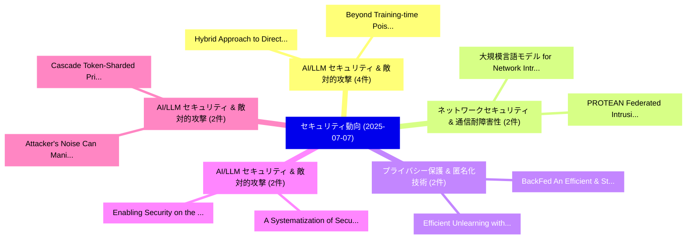

# 📅 02_daily: 日次エグゼクティブサマリー報告書 (2025-07-07)

**集計日時**: 2026-10-02 23:05:32 UTC  
**対象日付**: 2025-07-07  
**本日収集論文数**: 28 件  

---

## 💡 主要セキュリティ動向・脅威インサイト (Executive Insights)

本日の収集論文（計 28 件）において、以下の重点セキュリティ領域で活発な研究動向が確認されました：
- **AI/LLM セキュリティ & 敵対的攻撃** (4 件): 注目論文として 「Hybrid Approach to Directed Fu...」、「Beyond Training-time Poisoning...」 等が発表され、実務防御および攻撃検証の進展が見られます。
- **ネットワークセキュリティ & 通信耐障害性** (2 件): 注目論文として 「大規模言語モデル for Network Intrusion...」、「PROTEAN: Federated Intrusion D...」 等が発表され、実務防御および攻撃検証の進展が見られます。
- **プライバシー保護 & 匿名化技術** (2 件): 注目論文として 「Efficient Unlearning with Priv...」、「BackFed: An Efficient & Standa...」 等が発表され、実務防御および攻撃検証の進展が見られます。
- **AI/LLM セキュリティ & 敵対的攻撃** (2 件): 注目論文として 「Enabling Security on the Edge:...」、「A Systematization of Security ...」 等が発表され、実務防御および攻撃検証の進展が見られます。
- **AI/LLM セキュリティ & 敵対的攻撃** (2 件): 注目論文として 「Cascade: Token-Sharded Private...」、「Attacker's Noise Can Manipulat...」 等が発表され、実務防御および攻撃検証の進展が見られます。

### 🗺️ 技術・脅威トピックマインドマップ

---

## 📌 日次セキュリティ論文一覧 (日本語表形式)

| No | arXiv ID | 論文タイトル (日本語訳) | 重要キーワード | 構造化エグゼクティブ要約 (背景・提案・影響) | 脅威分類 | 詳細リンク |
|---|---|---|---|---|---|---|
| 1 | `2507.04752v1` | [大規模言語モデル for Network Intrusion Detection Systems: Foundations, Implementations, and Future Directions](../../okf/papers/2025-07-07/2507.04752.md) | `Network Intrusion Detection Systems`, `Future Directions`, `Large Language Models` | 【提案】概要 (Overview & Key Finding) 本論文「大規模言語モデル for Network Intrusion Detection Systems: Found...。実証評価により経営層・セキュリティ管理者向け推奨アクション (E... | `cs.CR` | [arXiv](https://arxiv.org/abs/2507.04752v1) &#124; [OKF](../../okf/papers/2025-07-07/2507.04752.md) |
| 2 | `2507.04771v2` | [Efficient Unlearning with Privacy Guarantees（セキュリティ分析論文）](../../okf/papers/2025-07-07/2507.04771.md) | `Efficient Unlearning`, `Privacy Guarantees`, `Josep Domingo` | 【提案】概要 (Overview & Key Finding) 本論文「Efficient Unlearning with Privacy Guarantees（セキュリティ分析論文...。実証評価により経営層・セキュリティ管理者向け推奨アクション (E... | `cs.CR` | [arXiv](https://arxiv.org/abs/2507.04771v2) &#124; [OKF](../../okf/papers/2025-07-07/2507.04771.md) |
| 3 | `2507.04775v1` | [FIDESlib: A Fully-Fledged Open-Source FHE Library for Efficient CKKS on GPUs（セキュリティ分析論文）](../../okf/papers/2025-07-07/2507.04775.md) | `Fledged Open`, `Fully-Fledged Open`, `Aymane El Jerari` | 【提案】概要 (Overview & Key Finding) 本論文「FIDESlib: A Fully-Fledged Open-Source FHE Library for E...。実証評価により経営層・セキュリティ管理者向け推奨アクション (E... | `cs.CR` | [arXiv](https://arxiv.org/abs/2507.04775v1) &#124; [OKF](../../okf/papers/2025-07-07/2507.04775.md) |
| 4 | `2507.04818v1` | [Enabling Security on the Edge: A CHERI Compartmentalized Network Stack（セキュリティ分析論文）](../../okf/papers/2025-07-07/2507.04818.md) | `Compartmentalized Network Stack`, `Enabling Security`, `Donato Ferraro` | 【提案】概要 (Overview & Key Finding) 本論文「Enabling Security on the Edge: A CHERI Compartmentalize...。実証評価により経営層・セキュリティ管理者向け推奨アクション (E... | `cs.CR` | [arXiv](https://arxiv.org/abs/2507.04818v1) &#124; [OKF](../../okf/papers/2025-07-07/2507.04818.md) |
| 5 | `2507.04855v2` | [Hybrid Approach to Directed Fuzzing（セキュリティ分析論文）](../../okf/papers/2025-07-07/2507.04855.md) | `Directed Fuzzing`, `Darya Parygina`, `Timofey Mezhuev` | 【提案】概要 (Overview & Key Finding) 本論文「Hybrid Approach to Directed Fuzzing（セキュリティ分析論文）」（原題: Hy...。実証評価により経営層・セキュリティ管理者向け推奨アクション (E... | `cs.CR` | [arXiv](https://arxiv.org/abs/2507.04855v2) &#124; [OKF](../../okf/papers/2025-07-07/2507.04855.md) |
| 6 | `2507.04883v1` | [Beyond Training-time Poisoning: Component-level and Post-training Backdoors in Deep Reinforcement Learning（セキュリティ分析論文）](../../okf/papers/2025-07-07/2507.04883.md) | `Deep Reinforcement Learning`, `Beyond Training`, `Training-time Poisoning` | 【提案】概要 (Overview & Key Finding) 本論文「Beyond Training-time Poisoning: Component-level and Pos...。実証評価により経営層・セキュリティ管理者向け推奨アクション (E... | `cs.CR` | [arXiv](https://arxiv.org/abs/2507.04883v1) &#124; [OKF](../../okf/papers/2025-07-07/2507.04883.md) |
| 7 | `2507.04903v2` | [BackFed: An Efficient & Standardized Benchmark Suite for Backdoor Attacks in 連合学習](../../okf/papers/2025-07-07/2507.04903.md) | `Standardized Benchmark Suite`, `Backdoor Attacks`, `Federated Learning` | 【提案】概要 (Overview & Key Finding) 本論文「BackFed: An Efficient & Standardized Benchmark Suite fo...。実証評価により経営層・セキュリティ管理者向け推奨アクション (E... | `cs.CR` | [arXiv](https://arxiv.org/abs/2507.04903v2) &#124; [OKF](../../okf/papers/2025-07-07/2507.04903.md) |
| 8 | `2507.04916v1` | [Cyclic Equalizability of Words and Its Application to Card-Based Cryptography（セキュリティ分析論文）](../../okf/papers/2025-07-07/2507.04916.md) | `Cyclic Equalizability`, `Based Cryptography`, `Card-Based Cryptography` | 【提案】概要 (Overview & Key Finding) 本論文「Cyclic Equalizability of Words and Its Application to C...。実証評価により経営層・セキュリティ管理者向け推奨アクション (E... | `cs.CR` | [arXiv](https://arxiv.org/abs/2507.04916v1) &#124; [OKF](../../okf/papers/2025-07-07/2507.04916.md) |
| 9 | `2507.04931v1` | [LIFT: Automating Symbolic Execution Optimization with 大規模言語モデル for AI Networks](../../okf/papers/2025-07-07/2507.04931.md) | `Automating Symbolic Execution Optimization`, `Large Language Models`, `Ruoxi Wang` | 【提案】概要 (Overview & Key Finding) 本論文「LIFT: Automating Symbolic Execution Optimization with 大...。実証評価により経営層・セキュリティ管理者向け推奨アクション (E... | `cs.CR` | [arXiv](https://arxiv.org/abs/2507.04931v1) &#124; [OKF](../../okf/papers/2025-07-07/2507.04931.md) |
| 10 | `2507.04956v1` | [Bullshark on Narwhal: Implementation-level Workflow Round-based DAG Consensus in Theory and Practiceの分析](../../okf/papers/2025-07-07/2507.04956.md) | `Implementation-level Workflow`, `Round-based DAG`, `Workflow Round` | 【提案】概要 (Overview & Key Finding) 本論文「Bullshark on Narwhal: Implementation-level Workflow Rou...。実証評価により経営層・セキュリティ管理者向け推奨アクション (E... | `cs.CR` | [arXiv](https://arxiv.org/abs/2507.04956v1) &#124; [OKF](../../okf/papers/2025-07-07/2507.04956.md) |
| 11 | `2507.05068v2` | [ICAS: Detecting Training Data from Autoregressive Image Generative Models（セキュリティ分析論文）](../../okf/papers/2025-07-07/2507.05068.md) | `Autoregressive Image Generative Models`, `Detecting Training Data`, `Hongyao Yu` | 【提案】概要 (Overview & Key Finding) 本論文「ICAS: Detecting Training Data from Autoregressive Image...。実証評価により経営層・セキュリティ管理者向け推奨アクション (E... | `cs.CR` | [arXiv](https://arxiv.org/abs/2507.05068v2) &#124; [OKF](../../okf/papers/2025-07-07/2507.05068.md) |
| 12 | `2507.05093v1` | [The Hidden Threat in Plain Text: Attacking RAG Data Loaders（セキュリティ分析論文）](../../okf/papers/2025-07-07/2507.05093.md) | `Plain Text`, `Data Loaders`, `Alberto Castagnaro` | 【提案】概要 (Overview & Key Finding) 本論文「The Hidden 脅威 in Plain Text: Attacking RAG Data Loaders...。実証評価により経営層・セキュリティ管理者向け推奨アクション (E... | `cs.CR` | [arXiv](https://arxiv.org/abs/2507.05093v1) &#124; [OKF](../../okf/papers/2025-07-07/2507.05093.md) |
| 13 | `2507.05113v3` | [CLIP-Guided Backdoor Defense through Entropy-Based Poisoned Dataset Separation（セキュリティ分析論文）](../../okf/papers/2025-07-07/2507.05113.md) | `Based Poisoned Dataset Separation`, `Guided Backdoor Defense`, `CLIP-Guided Backdoor` | 【提案】概要 (Overview & Key Finding) 本論文「CLIP-Guided Backdoor Defense through Entropy-Based Pois...。実証評価により経営層・セキュリティ管理者向け推奨アクション (E... | `cs.CR` | [arXiv](https://arxiv.org/abs/2507.05113v3) &#124; [OKF](../../okf/papers/2025-07-07/2507.05113.md) |
| 14 | `2507.05132v1` | [Extreme Learning Machine Based System for DDoS Attacks Detections on IoMT Devices（セキュリティ分析論文）](../../okf/papers/2025-07-07/2507.05132.md) | `Extreme Learning Machine Based System`, `Attacks Detections`, `Nelly Elsayed` | 【提案】概要 (Overview & Key Finding) 本論文「Extreme Learning Machine Based System for DDoS Attacks ...。実証評価により経営層・セキュリティ管理者向け推奨アクション (E... | `cs.CR` | [arXiv](https://arxiv.org/abs/2507.05132v1) &#124; [OKF](../../okf/papers/2025-07-07/2507.05132.md) |
| 15 | `2507.05162v1` | [LAID: Lightweight AI-Generated Image Detection in Spatial and Spectral Domains（セキュリティ分析論文）](../../okf/papers/2025-07-07/2507.05162.md) | `Generated Image Detection`, `Spectral Domains`, `AI-Generated Image` | 【提案】概要 (Overview & Key Finding) 本論文「LAID: Lightweight AI-Generated Image Detection in Spati...。実証評価により経営層・セキュリティ管理者向け推奨アクション (E... | `cs.CR` | [arXiv](https://arxiv.org/abs/2507.05162v1) &#124; [OKF](../../okf/papers/2025-07-07/2507.05162.md) |
| 16 | `2507.05213v2` | [Hunting in the Dark: Metrics for Early Stage Traffic Discovery（セキュリティ分析論文）](../../okf/papers/2025-07-07/2507.05213.md) | `Early Stage Traffic Discovery`, `Max Gao`, `Michael Collins` | 【提案】概要 (Overview & Key Finding) 本論文「Hunting in the Dark: Metrics for Early Stage Traffic Di...。実証評価により経営層・セキュリティ管理者向け推奨アクション (E... | `cs.CR` | [arXiv](https://arxiv.org/abs/2507.05213v2) &#124; [OKF](../../okf/papers/2025-07-07/2507.05213.md) |
| 17 | `2507.05228v1` | [Cascade: Token-Sharded Private LLM Inference（セキュリティ分析論文）](../../okf/papers/2025-07-07/2507.05228.md) | `Sharded Private`, `Token-Sharded Private`, `Rahul Thomas` | 【提案】概要 (Overview & Key Finding) 本論文「Cascade: Token-Sharded Private LLM Inference（セキュリティ分析論文...。実証評価により経営層・セキュリティ管理者向け推奨アクション (E... | `cs.CR` | [arXiv](https://arxiv.org/abs/2507.05228v1) &#124; [OKF](../../okf/papers/2025-07-07/2507.05228.md) |
| 18 | `2507.05415v2` | [Layered, Overlapping, and Inconsistent: A Large-Scale the Multiple Privacy Policies and Controls of U.S. Banksの分析](../../okf/papers/2025-07-07/2507.05415.md) | `Multiple Privacy Policies`, `Lu Xian`, `Van Tran` | 【提案】Banks ### (日本語題名: Layered, Overlapping, and Inconsistent: A Large-Scale the Multiple Pr...。実証評価により経営層・セキュリティ管理者向け推奨アクション (E... | `cs.CR` | [arXiv](https://arxiv.org/abs/2507.05415v2) &#124; [OKF](../../okf/papers/2025-07-07/2507.05415.md) |
| 19 | `2507.05421v1` | [FrameShift: Learning to Resize Fuzzer Inputs Without Breaking Them（セキュリティ分析論文）](../../okf/papers/2025-07-07/2507.05421.md) | `Claire Le Goues`, `Harrison Green`, `Fraser Brown` | 【提案】背景とセキュリティ上の課題 (Background & Problem) 本研究はサイバー脅威環境におけるセキュリティ構造・脆弱性の検証を目的としています。(主要検出項目: ...。実証評価により経営層・セキュリティ管理者向け推奨アクション (E... | `cs.CR` | [arXiv](https://arxiv.org/abs/2507.05421v1) &#124; [OKF](../../okf/papers/2025-07-07/2507.05421.md) |
| 20 | `2507.05445v1` | [A Systematization of Security Vulnerabilities in Computer Use Agents（セキュリティ分析論文）](../../okf/papers/2025-07-07/2507.05445.md) | `Computer Use Agents`, `Security Vulnerabilities`, `Daniel Jones` | 【提案】概要 (Overview & Key Finding) 本論文「A Systematization of Security Vulnerabilities in Comput...。実証評価により経営層・セキュリティ管理者向け推奨アクション (E... | `cs.CR` | [arXiv](https://arxiv.org/abs/2507.05445v1) &#124; [OKF](../../okf/papers/2025-07-07/2507.05445.md) |
| 21 | `2507.05512v1` | [Disappearing Ink: Obfuscation Breaks N-gram Code Watermarks in Theory and Practice（セキュリティ分析論文）](../../okf/papers/2025-07-07/2507.05512.md) | `Disappearing Ink`, `Obfuscation Breaks`, `Code Watermarks` | 【提案】概要 (Overview & Key Finding) 本論文「Disappearing Ink: Obfuscation Breaks N-gram Code Waterm...。実証評価により経営層・セキュリティ管理者向け推奨アクション (E... | `cs.CR` | [arXiv](https://arxiv.org/abs/2507.05512v1) &#124; [OKF](../../okf/papers/2025-07-07/2507.05512.md) |
| 22 | `2507.05523v2` | [Adaptive Variation-Resilient Random Number Generator for Embedded Encryption（セキュリティ分析論文）](../../okf/papers/2025-07-07/2507.05523.md) | `Resilient Random Number Generator`, `Adaptive Variation`, `Embedded Encryption` | 【提案】概要 (Overview & Key Finding) 本論文「Adaptive Variation-Resilient Random Number Generator fo...。実証評価により経営層・セキュリティ管理者向け推奨アクション (E... | `cs.CR` | [arXiv](https://arxiv.org/abs/2507.05523v2) &#124; [OKF](../../okf/papers/2025-07-07/2507.05523.md) |
| 23 | `2507.05524v1` | [PROTEAN: Federated Intrusion Detection in Non-IID Environments through Prototype-Based Knowledge Sharing（セキュリティ分析論文）](../../okf/papers/2025-07-07/2507.05524.md) | `Federated Intrusion Detection`, `Based Knowledge Sharing`, `Non-IID Environments` | 【提案】概要 (Overview & Key Finding) 本論文「PROTEAN: Federated Intrusion Detection in Non-IID Envir...。実証評価により経営層・セキュリティ管理者向け推奨アクション (E... | `cs.CR` | [arXiv](https://arxiv.org/abs/2507.05524v1) &#124; [OKF](../../okf/papers/2025-07-07/2507.05524.md) |
| 24 | `2507.05538v2` | [Red Teaming AI Red Teaming（セキュリティ分析論文）](../../okf/papers/2025-07-07/2507.05538.md) | `Red Teaming`, `Subhabrata Majumdar`, `Brian Pendleton` | 【提案】概要 (Overview & Key Finding) 本論文「Red Teaming AI Red Teaming（セキュリティ分析論文）」（原題: Red Teaming...。実証評価により経営層・セキュリティ管理者向け推奨アクション (E... | `cs.CR` | [arXiv](https://arxiv.org/abs/2507.05538v2) &#124; [OKF](../../okf/papers/2025-07-07/2507.05538.md) |
| 25 | `2507.06256v1` | [Attacker's Noise Can Manipulate Your Audio-based LLM in the Real World（セキュリティ分析論文）](../../okf/papers/2025-07-07/2507.06256.md) | `Real World`, `Audio-based LLM`, `Vinu Sankar Sadasivan` | 【提案】概要 (Overview & Key Finding) 本論文「Attacker's Noise Can Manipulate Your Audio-based LLM in...。実証評価により経営層・セキュリティ管理者向け推奨アクション (E... | `cs.CR` | [arXiv](https://arxiv.org/abs/2507.06256v1) &#124; [OKF](../../okf/papers/2025-07-07/2507.06256.md) |
| 26 | `2507.06258v2` | [Spattack: Subgroup Poisoning Attacks on Federated Recommender Systems（セキュリティ分析論文）](../../okf/papers/2025-07-07/2507.06258.md) | `Subgroup Poisoning Attacks`, `Federated Recommender Systems`, `Wei Yang Bryan Lim` | 【提案】概要 (Overview & Key Finding) 本論文「Spattack: Subgroup Poisoning Attacks on Federated Recom...。実証評価により経営層・セキュリティ管理者向け推奨アクション (E... | `cs.CR` | [arXiv](https://arxiv.org/abs/2507.06258v2) &#124; [OKF](../../okf/papers/2025-07-07/2507.06258.md) |
| 27 | `2507.06260v1` | [Evaluating the Critical Risks of Amazon's Nova Premier under the Frontier Model Safety Framework（セキュリティ分析論文）](../../okf/papers/2025-07-07/2507.06260.md) | `Critical Risks`, `Nova Premier`, `Satyapriya Krishna` | 【提案】概要 (Overview & Key Finding) 本論文「Evaluating the Critical Risks of Amazon's Nova Premier ...。実証評価により経営層・セキュリティ管理者向け推奨アクション (E... | `cs.CR` | [arXiv](https://arxiv.org/abs/2507.06260v1) &#124; [OKF](../../okf/papers/2025-07-07/2507.06260.md) |
| 28 | `2507.06262v1` | [Q-Detection: A Quantum-Classical Hybrid Poisoning Attack Detection Method（セキュリティ分析論文）](../../okf/papers/2025-07-07/2507.06262.md) | `Quantum-Classical Hybrid`, `Xiaokai Lin`, `Jiancai Chen` | 【提案】概要 (Overview & Key Finding) 本論文「Q-Detection: A 量子-Classical Hybrid Poisoning Attack Det...。実証評価により経営層・セキュリティ管理者向け推奨アクション (E... | `cs.CR` | [arXiv](https://arxiv.org/abs/2507.06262v1) &#124; [OKF](../../okf/papers/2025-07-07/2507.06262.md) |

