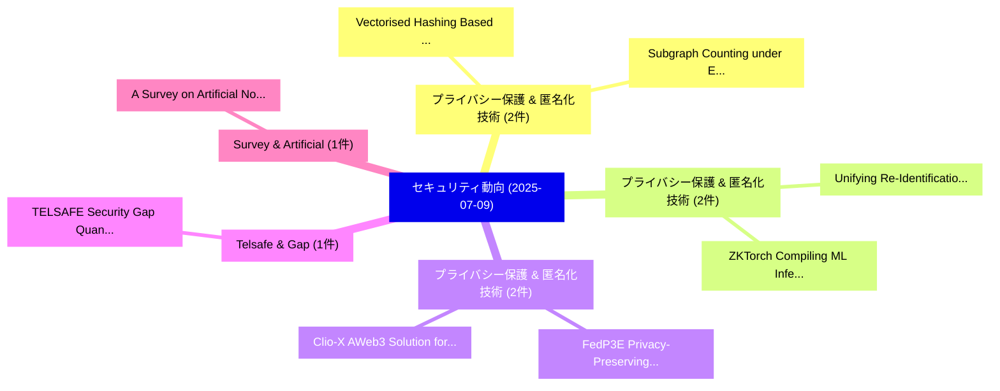

# 📅 02_daily: 日次エグゼクティブサマリー報告書 (2025-07-09)

**集計日時**: 2026-10-02 23:05:32 UTC  
**対象日付**: 2025-07-09  
**本日収集論文数**: 26 件  

---

## 💡 主要セキュリティ動向・脅威インサイト (Executive Insights)

本日の収集論文（計 26 件）において、以下の重点セキュリティ領域で活発な研究動向が確認されました：
- **プライバシー保護 & 匿名化技術** (2 件): 注目論文として 「Vectorised Hashing Based on Be...」、「Subgraph Counting under Edge L...」 等が発表され、実務防御および攻撃検証の進展が見られます。
- **プライバシー保護 & 匿名化技術** (2 件): 注目論文として 「Unifying Re-Identification, At...」、「ZKTorch: Compiling ML Inferenc...」 等が発表され、実務防御および攻撃検証の進展が見られます。
- **プライバシー保護 & 匿名化技術** (2 件): 注目論文として 「FedP3E: Privacy-Preserving Pro...」、「Clio-X: AWeb3 Solution for Pri...」 等が発表され、実務防御および攻撃検証の進展が見られます。
- **Telsafe & Gap** (1 件): 注目論文として 「TELSAFE: Security Gap Quantita...」 等が発表され、実務防御および攻撃検証の進展が見られます。
- **Survey & Artificial** (1 件): 注目論文として 「A Survey on Artificial Noise f...」 等が発表され、実務防御および攻撃検証の進展が見られます。

### 🗺️ 技術・脅威トピックマインドマップ

---

## 📌 日次セキュリティ論文一覧 (日本語表形式)

| No | arXiv ID | 論文タイトル (日本語訳) | 重要キーワード | 構造化エグゼクティブ要約 (背景・提案・影響) | 脅威分類 | 詳細リンク |
|---|---|---|---|---|---|---|
| 1 | `2507.06490v2` | [Vectorised Hashing Based on Bernstein-Rabin-Winograd Polynomials over Prime Order Fields（セキュリティ分析論文）](../../okf/papers/2025-07-09/2507.06490.md) | `Vectorised Hashing Based`, `Prime Order Fields`, `Winograd Polynomials` | 【提案】概要 (Overview & Key Finding) 本論文「Vectorised Hashing Based on Bernstein-Rabin-Winograd Po...。実証評価により経営層・セキュリティ管理者向け推奨アクション (E... | `cs.CR` | [arXiv](https://arxiv.org/abs/2507.06490v2) &#124; [OKF](../../okf/papers/2025-07-09/2507.06490.md) |
| 2 | `2507.06497v1` | [TELSAFE: Security Gap Quantitative Risk Assessment Framework（セキュリティ分析論文）](../../okf/papers/2025-07-09/2507.06497.md) | `Sarah Ali Siddiqui`, `Chandra Thapa`, `Derui Wang` | 【提案】概要 (Overview & Key Finding) 本論文「TELSAFE: Security Gap Quantitative Risk Assessment Fram...。実証評価により経営層・セキュリティ管理者向け推奨アクション (E... | `cs.CR` | [arXiv](https://arxiv.org/abs/2507.06497v1) &#124; [OKF](../../okf/papers/2025-07-09/2507.06497.md) |
| 3 | `2507.06500v2` | [A Survey on Artificial Noise for Physical Layer Security: Opportunities, Technologies, Guidelines, Advances, and Trends（セキュリティ分析論文）](../../okf/papers/2025-07-09/2507.06500.md) | `Physical Layer Security`, `Artificial Noise`, `Hong Niu` | 【提案】概要 (Overview & Key Finding) 本論文「A Survey on Artificial Noise for Physical Layer Securit...。実証評価により経営層・セキュリティ管理者向け推奨アクション (E... | `cs.CR` | [arXiv](https://arxiv.org/abs/2507.06500v2) &#124; [OKF](../../okf/papers/2025-07-09/2507.06500.md) |
| 4 | `2507.06508v1` | [Subgraph Counting under Edge Local Differential Privacy Based on Noisy Adjacency Matrix（セキュリティ分析論文）](../../okf/papers/2025-07-09/2507.06508.md) | `Edge Local Differential Privacy Based`, `Noisy Adjacency Matrix`, `Subgraph Counting` | 【提案】概要 (Overview & Key Finding) 本論文「Subgraph Counting under Edge Local 差分プライバシー Based on No...。実証評価により経営層・セキュリティ管理者向け推奨アクション (E... | `cs.CR` | [arXiv](https://arxiv.org/abs/2507.06508v1) &#124; [OKF](../../okf/papers/2025-07-09/2507.06508.md) |
| 5 | `2507.06706v1` | [Approximating Euler Totient Function using Linear Regression on RSA moduli（セキュリティ分析論文）](../../okf/papers/2025-07-09/2507.06706.md) | `Approximating Euler Totient Function`, `Linear Regression`, `Gilda Rech Bansimba` | 【提案】概要 (Overview & Key Finding) 本論文「Approximating Euler Totient Function using Linear Regre...。実証評価により経営層・セキュリティ管理者向け推奨アクション (E... | `cs.CR` | [arXiv](https://arxiv.org/abs/2507.06706v1) &#124; [OKF](../../okf/papers/2025-07-09/2507.06706.md) |
| 6 | `2507.06723v1` | [PotentRegion4MalDetect: Advanced Features from Potential Malicious Regions for マルウェア検出](../../okf/papers/2025-07-09/2507.06723.md) | `Potential Malicious Regions`, `Advanced Features`, `Malware Detection` | 【提案】概要 (Overview & Key Finding) 本論文「PotentRegion4MalDetect: Advanced Features from Potentia...。実証評価により経営層・セキュリティ管理者向け推奨アクション (E... | `cs.CR` | [arXiv](https://arxiv.org/abs/2507.06723v1) &#124; [OKF](../../okf/papers/2025-07-09/2507.06723.md) |
| 7 | `2507.06742v1` | [PenTest2.0: Autonomous Privilege Escalation Using GenAIに向けて](../../okf/papers/2025-07-09/2507.06742.md) | `Towards Autonomous Privilege Escalation Using`, `Autonomous Privilege Escalation Using`, `Raw Meta` | 【提案】概要 (Overview & Key Finding) 本論文「PenTest2.0: Autonomous 権限昇格 Using GenAIに向けて」（原題: PenTes...。実証評価によりMitchell - **公開日時**: `202... | `cs.CR` | [arXiv](https://arxiv.org/abs/2507.06742v1) &#124; [OKF](../../okf/papers/2025-07-09/2507.06742.md) |
| 8 | `2507.06808v2` | [A Note on the Walsh Spectrum of Power Residue S-Boxes（セキュリティ分析論文）](../../okf/papers/2025-07-09/2507.06808.md) | `Walsh Spectrum`, `Power Residue`, `Matthias Johann Steiner` | 【提案】概要 (Overview & Key Finding) 本論文「A Note on the Walsh Spectrum of Power Residue S-Boxes（セ...。実証評価により経営層・セキュリティ管理者向け推奨アクション (E... | `cs.CR` | [arXiv](https://arxiv.org/abs/2507.06808v2) &#124; [OKF](../../okf/papers/2025-07-09/2507.06808.md) |
| 9 | `2507.06850v6` | [The Dark Side of LLMs: Agent-based Attack Vectors for System-level Compromise（セキュリティ分析論文）](../../okf/papers/2025-07-09/2507.06850.md) | `Agent-based Attack`, `Attack Vectors`, `System-level Compromise` | 【提案】概要 (Overview & Key Finding) 本論文「The Dark Side of LLMs: Agent-based Attack Vectors for S...。実証評価により経営層・セキュリティ管理者向け推奨アクション (E... | `cs.CR` | [arXiv](https://arxiv.org/abs/2507.06850v6) &#124; [OKF](../../okf/papers/2025-07-09/2507.06850.md) |
| 10 | `2507.06926v1` | [Are NFTs Ready to Keep Australian Artists Engaged?（セキュリティ分析論文）](../../okf/papers/2025-07-09/2507.06926.md) | `Keep Australian Artists Engaged`, `Ruiqiang Li`, `Brian Yecies` | 【提案】### (日本語題名: Are NFTs Ready to Keep Australian Artists Engaged?（セキュリティ分析論文）)  > [!NOTE] ...。実証評価により経営層・セキュリティ管理者向け推奨アクション (E... | `cs.CR` | [arXiv](https://arxiv.org/abs/2507.06926v1) &#124; [OKF](../../okf/papers/2025-07-09/2507.06926.md) |
| 11 | `2507.06969v4` | [Unifying Re-Identification, Attribute Inference, and Data Reconstruction Risks in Differential Privacy（セキュリティ分析論文）](../../okf/papers/2025-07-09/2507.06969.md) | `Data Reconstruction Risks`, `Unifying Re`, `Attribute Inference` | 【提案】概要 (Overview & Key Finding) 本論文「Unifying Re-Identification, Attribute Inference, and Da...。実証評価により経営層・セキュリティ管理者向け推奨アクション (E... | `cs.CR` | [arXiv](https://arxiv.org/abs/2507.06969v4) &#124; [OKF](../../okf/papers/2025-07-09/2507.06969.md) |
| 12 | `2507.06986v2` | [BarkBeetle: Stealing Decision Tree Models with Fault Injection（セキュリティ分析論文）](../../okf/papers/2025-07-09/2507.06986.md) | `Stealing Decision Tree Models`, `Fault Injection`, `Qifan Wang` | 【提案】概要 (Overview & Key Finding) 本論文「BarkBeetle: Stealing Decision Tree Models with フォールト注入攻...。実証評価により経営層・セキュリティ管理者向け推奨アクション (E... | `cs.CR` | [arXiv](https://arxiv.org/abs/2507.06986v2) &#124; [OKF](../../okf/papers/2025-07-09/2507.06986.md) |
| 13 | `2507.07031v2` | [ZKTorch: Compiling ML Inference to Zero-Knowledge Proofs via Parallel Proof Accumulation（セキュリティ分析論文）](../../okf/papers/2025-07-09/2507.07031.md) | `Parallel Proof Accumulation`, `Knowledge Proofs`, `Zero-Knowledge Proofs` | 【提案】概要 (Overview & Key Finding) 本論文「ZKTorch: Compiling ML Inference to Zero-Knowledge Proof...。実証評価により経営層・セキュリティ管理者向け推奨アクション (E... | `cs.CR` | [arXiv](https://arxiv.org/abs/2507.07031v2) &#124; [OKF](../../okf/papers/2025-07-09/2507.07031.md) |
| 14 | `2507.07055v1` | [Integer Factorization: Another perspective（セキュリティ分析論文）](../../okf/papers/2025-07-09/2507.07055.md) | `Integer Factorization`, `Gilda Rech Bansimba`, `Regis Freguin Babindamana` | 【提案】概要 (Overview & Key Finding) 本論文「Integer Factorization: Another perspective（セキュリティ分析論文）」...。実証評価により経営層・セキュリティ管理者向け推奨アクション (E... | `cs.CR` | [arXiv](https://arxiv.org/abs/2507.07055v1) &#124; [OKF](../../okf/papers/2025-07-09/2507.07055.md) |
| 15 | `2507.07139v2` | [Image Can Bring Your Memory Back: A Novel Multi-Modal Guided Attack against Image Generation Model Unlearning（セキュリティ分析論文）](../../okf/papers/2025-07-09/2507.07139.md) | `Image Generation Model Unlearning`, `Modal Guided Attack`, `Multi-Modal Guided` | 【提案】概要 (Overview & Key Finding) 本論文「Image Can Bring Your Memory Back: A Novel Multi-Modal G...。実証評価により経営層・セキュリティ管理者向け推奨アクション (E... | `cs.CR` | [arXiv](https://arxiv.org/abs/2507.07139v2) &#124; [OKF](../../okf/papers/2025-07-09/2507.07139.md) |
| 16 | `2507.07143v1` | [Understanding Malware Propagation Dynamics through Scientific Machine Learning（セキュリティ分析論文）](../../okf/papers/2025-07-09/2507.07143.md) | `Understanding Malware Propagation Dynamics`, `Scientific Machine Learning`, `Prathamesh Dinesh Joshi` | 【提案】概要 (Overview & Key Finding) 本論文「Understanding マルウェア Propagation Dynamics through Scient...。実証評価により経営層・セキュリティ管理者向け推奨アクション (E... | `cs.CR` | [arXiv](https://arxiv.org/abs/2507.07143v1) &#124; [OKF](../../okf/papers/2025-07-09/2507.07143.md) |
| 17 | `2507.07210v1` | [WatchWitch: Interoperability, Privacy, and Autonomy for the Apple Watch（セキュリティ分析論文）](../../okf/papers/2025-07-09/2507.07210.md) | `Apple Watch`, `Nils Rollshausen`, `Alexander Heinrich` | 【提案】概要 (Overview & Key Finding) 本論文「WatchWitch: Interoperability, Privacy, and Autonomy for...。実証評価により経営層・セキュリティ管理者向け推奨アクション (E... | `cs.CR` | [arXiv](https://arxiv.org/abs/2507.07210v1) &#124; [OKF](../../okf/papers/2025-07-09/2507.07210.md) |
| 18 | `2507.07244v1` | [Automated Attack Testflow Extraction from Cyber Threat Report using BERT for Contextual Analysis（セキュリティ分析論文）](../../okf/papers/2025-07-09/2507.07244.md) | `Automated Attack Testflow Extraction`, `Cyber Threat Report`, `Faissal Ahmadou` | 【提案】概要 (Overview & Key Finding) 本論文「Automated Attack Testflow Extraction from Cyber 脅威 Repo...。実証評価により経営層・セキュリティ管理者向け推奨アクション (E... | `cs.CR` | [arXiv](https://arxiv.org/abs/2507.07244v1) &#124; [OKF](../../okf/papers/2025-07-09/2507.07244.md) |
| 19 | `2507.07246v1` | [Disa: Accurate Learning-based Static Disassembly with Attentions（セキュリティ分析論文）](../../okf/papers/2025-07-09/2507.07246.md) | `Accurate Learning`, `Static Disassembly`, `Learning-based Static` | 【提案】概要 (Overview & Key Finding) 本論文「Disa: Accurate Learning-based Static Disassembly with A...。実証評価により経営層・セキュリティ管理者向け推奨アクション (E... | `cs.CR` | [arXiv](https://arxiv.org/abs/2507.07246v1) &#124; [OKF](../../okf/papers/2025-07-09/2507.07246.md) |
| 20 | `2507.07250v1` | [Semi-fragile watermarking of remote sensing images using DWT, vector quantization and automatic tiling（セキュリティ分析論文）](../../okf/papers/2025-07-09/2507.07250.md) | `Semi-fragile watermarking`, `Jordi Serra`, `Raw Meta` | 【提案】概要 (Overview & Key Finding) 本論文「Semi-fragile watermarking of remote sensing images usin...。実証評価により経営層・セキュリティ管理者向け推奨アクション (E... | `cs.CR` | [arXiv](https://arxiv.org/abs/2507.07250v1) &#124; [OKF](../../okf/papers/2025-07-09/2507.07250.md) |
| 21 | `2507.07258v1` | [FedP3E: Privacy-Preserving Prototype Exchange for Non-IID IoT マルウェア検出 in Cross-Silo Federated Learning](../../okf/papers/2025-07-09/2507.07258.md) | `Preserving Prototype Exchange`, `Silo Federated Learning`, `Privacy-Preserving Prototype` | 【提案】概要 (Overview & Key Finding) 本論文「FedP3E: Privacy-Preserving Prototype Exchange for Non-I...。実証評価により経営層・セキュリティ管理者向け推奨アクション (E... | `cs.CR` | [arXiv](https://arxiv.org/abs/2507.07258v1) &#124; [OKF](../../okf/papers/2025-07-09/2507.07258.md) |
| 22 | `2507.07316v1` | [AdeptHEQ-FL: Adaptive Homomorphic Encryption for 連合学習 of Hybrid Classical-Quantum Models with Dynamic Layer Sparing](../../okf/papers/2025-07-09/2507.07316.md) | `Adaptive Homomorphic Encryption`, `Dynamic Layer Sparing`, `Hybrid Classical` | 【提案】概要 (Overview & Key Finding) 本論文「AdeptHEQ-FL: Adaptive 準同型暗号 for 連合学習 of Hybrid Classica...。実証評価により経営層・セキュリティ管理者向け推奨アクション (E... | `cs.CR` | [arXiv](https://arxiv.org/abs/2507.07316v1) &#124; [OKF](../../okf/papers/2025-07-09/2507.07316.md) |
| 23 | `2507.07341v1` | [On the Impossibility of Separating Intelligence from Judgment: The Computational Intractability of Filtering for AI Alignment（セキュリティ分析論文）](../../okf/papers/2025-07-09/2507.07341.md) | `Separating Intelligence`, `Sarah Ball`, `Greg Gluch` | 【提案】概要 (Overview & Key Finding) 本論文「On the Impossibility of Separating Intelligence from Ju...。実証評価により経営層・セキュリティ管理者向け推奨アクション (E... | `cs.CR` | [arXiv](https://arxiv.org/abs/2507.07341v1) &#124; [OKF](../../okf/papers/2025-07-09/2507.07341.md) |
| 24 | `2507.08853v1` | [Clio-X: AWeb3 Solution for Privacy-Preserving AI Access to Digital Archives（セキュリティ分析論文）](../../okf/papers/2025-07-09/2507.08853.md) | `Digital Archives`, `Privacy-Preserving AI`, `Luis De La Torre Cubillo` | 【提案】概要 (Overview & Key Finding) 本論文「Clio-X: AWeb3 Solution for Privacy-Preserving AI Access...。実証評価によりLemieux, Ro。 | `cs.CR` | [arXiv](https://arxiv.org/abs/2507.08853v1) &#124; [OKF](../../okf/papers/2025-07-09/2507.08853.md) |
| 25 | `2507.08862v1` | [RAG Safety: Exploring Knowledge Poisoning Attacks to Retrieval-Augmented Generation（セキュリティ分析論文）](../../okf/papers/2025-07-09/2507.08862.md) | `Exploring Knowledge Poisoning Attacks`, `Augmented Generation`, `Retrieval-Augmented Generation` | 【提案】概要 (Overview & Key Finding) 本論文「RAG Safety: Exploring Knowledge Poisoning Attacks to Re...。実証評価により経営層・セキュリティ管理者向け推奨アクション (E... | `cs.CR` | [arXiv](https://arxiv.org/abs/2507.08862v1) &#124; [OKF](../../okf/papers/2025-07-09/2507.08862.md) |
| 26 | `2507.08864v1` | [Privacy-Utility-Fairness: A Balanced Approach to Vehicular-Traffic Management System（セキュリティ分析論文）](../../okf/papers/2025-07-09/2507.08864.md) | `Traffic Management System`, `Vehicular-Traffic Management`, `Poushali Sengupta` | 【提案】概要 (Overview & Key Finding) 本論文「Privacy-Utility-Fairness: A Balanced Approach to Vehicu...。実証評価により経営層・セキュリティ管理者向け推奨アクション (E... | `cs.CR` | [arXiv](https://arxiv.org/abs/2507.08864v1) &#124; [OKF](../../okf/papers/2025-07-09/2507.08864.md) |

