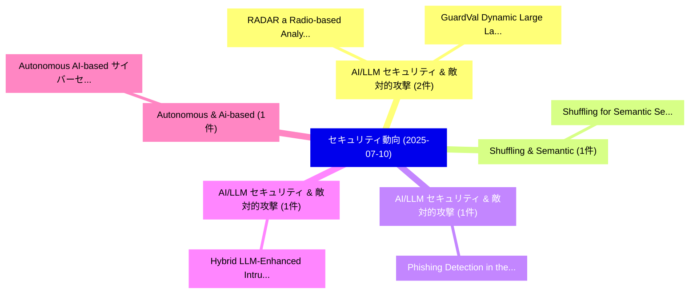

# 📅 02_daily: 日次エグゼクティブサマリー報告書 (2025-07-10)

**集計日時**: 2026-10-02 23:05:32 UTC  
**対象日付**: 2025-07-10  
**本日収集論文数**: 22 件  

---

## 💡 主要セキュリティ動向・脅威インサイト (Executive Insights)

本日の収集論文（計 22 件）において、以下の重点セキュリティ領域で活発な研究動向が確認されました：
- **AI/LLM セキュリティ & 敵対的攻撃** (2 件): 注目論文として 「RADAR: a Radio-based Analytics...」、「GuardVal: Dynamic Large Langua...」 等が発表され、実務防御および攻撃検証の進展が見られます。
- **Shuffling & Semantic** (1 件): 注目論文として 「Shuffling for Semantic Secrecy...」 等が発表され、実務防御および攻撃検証の進展が見られます。
- **AI/LLM セキュリティ & 敵対的攻撃** (1 件): 注目論文として 「Phishing Detection in the Gen-...」 等が発表され、実務防御および攻撃検証の進展が見られます。
- **AI/LLM セキュリティ & 敵対的攻撃** (1 件): 注目論文として 「Hybrid LLM-Enhanced Intrusion ...」 等が発表され、実務防御および攻撃検証の進展が見られます。
- **Autonomous & Ai-based** (1 件): 注目論文として 「Autonomous AI-based サイバーセキュリティ...」 等が発表され、実務防御および攻撃検証の進展が見られます。

### 🗺️ 技術・脅威トピックマインドマップ

---

## 📌 日次セキュリティ論文一覧 (日本語表形式)

| No | arXiv ID | 論文タイトル (日本語訳) | 重要キーワード | 構造化エグゼクティブ要約 (背景・提案・影響) | 脅威分類 | 詳細リンク |
|---|---|---|---|---|---|---|
| 1 | `2507.07401v1` | [Shuffling for Semantic Secrecy（セキュリティ分析論文）](../../okf/papers/2025-07-10/2507.07401.md) | `Semantic Secrecy`, `Hei Victor Cheng`, `Fupei Chen` | 【提案】概要 (Overview & Key Finding) 本論文「Shuffling for Semantic Secrecy（セキュリティ分析論文）」（原題: Shuffli...。実証評価により経営層・セキュリティ管理者向け推奨アクション (E... | `cs.CR` | [arXiv](https://arxiv.org/abs/2507.07401v1) &#124; [OKF](../../okf/papers/2025-07-10/2507.07401.md) |
| 2 | `2507.07406v1` | [Phishing Detection in the Gen-AI Era: Quantized LLMs vs Classical Models（セキュリティ分析論文）](../../okf/papers/2025-07-10/2507.07406.md) | `Phishing Detection`, `Classical Models`, `Gen-AI Era` | 【提案】概要 (Overview & Key Finding) 本論文「Phishing Detection in the Gen-AI Era: Quantized LLMs vs...。実証評価により経営層・セキュリティ管理者向け推奨アクション (E... | `cs.CR` | [arXiv](https://arxiv.org/abs/2507.07406v1) &#124; [OKF](../../okf/papers/2025-07-10/2507.07406.md) |
| 3 | `2507.07413v1` | [Hybrid LLM-Enhanced Intrusion Detection for Zero-Day Threats in IoT Networks（セキュリティ分析論文）](../../okf/papers/2025-07-10/2507.07413.md) | `Enhanced Intrusion Detection`, `Day Threats`, `LLM-Enhanced Intrusion` | 【提案】概要 (Overview & Key Finding) 本論文「Hybrid LLM-Enhanced Intrusion Detection for Zero-Day Th...。実証評価により経営層・セキュリティ管理者向け推奨アクション (E... | `cs.CR` | [arXiv](https://arxiv.org/abs/2507.07413v1) &#124; [OKF](../../okf/papers/2025-07-10/2507.07413.md) |
| 4 | `2507.07416v1` | [Autonomous AI-based サイバーセキュリティ Framework for Critical Infrastructure: Real-Time Threat Mitigation](../../okf/papers/2025-07-10/2507.07416.md) | `Time Threat Mitigation`, `Critical Infrastructure`, `Real-Time Threat` | 【提案】概要 (Overview & Key Finding) 本論文「Autonomous AI-based サイバーセキュリティ Framework for Critical I...。実証評価により経営層・セキュリティ管理者向け推奨アクション (E... | `cs.CR` | [arXiv](https://arxiv.org/abs/2507.07416v1) &#124; [OKF](../../okf/papers/2025-07-10/2507.07416.md) |
| 5 | `2507.07417v2` | [May I have your Attention? Breaking Fine-Tuning based Prompt Injection Defenses using Architecture-Aware Attacks（セキュリティ分析論文）](../../okf/papers/2025-07-10/2507.07417.md) | `Prompt Injection Defenses`, `Breaking Fine`, `Aware Attacks` | 【提案】Breaking Fine-Tuning based プロンプトインジェクション Defenses using Architecture-Aware Attacks ### ...。実証評価により経営層・セキュリティ管理者向け推奨アクション (E... | `cs.CR` | [arXiv](https://arxiv.org/abs/2507.07417v2) &#124; [OKF](../../okf/papers/2025-07-10/2507.07417.md) |
| 6 | `2507.07483v1` | [Temporal Unlearnable Examples: Preventing Personal Video Data from Unauthorized Exploitation by Object Tracking（セキュリティ分析論文）](../../okf/papers/2025-07-10/2507.07483.md) | `Preventing Personal Video Data`, `Temporal Unlearnable Examples`, `Unauthorized Exploitation` | 【提案】概要 (Overview & Key Finding) 本論文「Temporal Unlearnable Examples: Preventing Personal Vide...。実証評価により経営層・セキュリティ管理者向け推奨アクション (E... | `cs.CR` | [arXiv](https://arxiv.org/abs/2507.07483v1) &#124; [OKF](../../okf/papers/2025-07-10/2507.07483.md) |
| 7 | `2507.07732v1` | [RADAR: a Radio-based Analytics for Dynamic Association and Recognition of pseudonyms in VANETs（セキュリティ分析論文）](../../okf/papers/2025-07-10/2507.07732.md) | `Dynamic Association`, `Radio-based Analytics`, `Giovanni Gambigliani Zoccoli` | 【提案】概要 (Overview & Key Finding) 本論文「RADAR: a Radio-based Analytics for Dynamic Association ...。実証評価により経営層・セキュリティ管理者向け推奨アクション (E... | `cs.CR` | [arXiv](https://arxiv.org/abs/2507.07732v1) &#124; [OKF](../../okf/papers/2025-07-10/2507.07732.md) |
| 8 | `2507.07735v1` | [GuardVal: Dynamic Large Language Model Jailbreak Evaluation for Comprehensive Safety Testing（セキュリティ分析論文）](../../okf/papers/2025-07-10/2507.07735.md) | `Comprehensive Safety Testing`, `Peiyan Zhang`, `Haibo Jin` | 【提案】概要 (Overview & Key Finding) 本論文「GuardVal: Dynamic Large Language Model ジェイルブレイク Evaluat...。実証評価により経営層・セキュリティ管理者向け推奨アクション (E... | `cs.CR` | [arXiv](https://arxiv.org/abs/2507.07735v1) &#124; [OKF](../../okf/papers/2025-07-10/2507.07735.md) |
| 9 | `2507.07773v1` | [Rainbow Artifacts from Electromagnetic Signal Injection Attacks on Image Sensors（セキュリティ分析論文）](../../okf/papers/2025-07-10/2507.07773.md) | `Electromagnetic Signal Injection Attacks`, `Rainbow Artifacts`, `Image Sensors` | 【提案】概要 (Overview & Key Finding) 本論文「Rainbow Artifacts from Electromagnetic Signal Injection...。実証評価により経営層・セキュリティ管理者向け推奨アクション (E... | `cs.CR` | [arXiv](https://arxiv.org/abs/2507.07773v1) &#124; [OKF](../../okf/papers/2025-07-10/2507.07773.md) |
| 10 | `2507.07871v4` | [Randomized Key SelectionによるWatermark Forgery in Generative Modelsの軽減](../../okf/papers/2025-07-10/2507.07871.md) | `Mitigating Watermark Forgery`, `Randomized Key Selection`, `Generative Models` | 【提案】概要 (Overview & Key Finding) 本論文「Randomized Key SelectionによるWatermark Forgery in Generat...。実証評価により経営層・セキュリティ管理者向け推奨アクション (E... | `cs.CR` | [arXiv](https://arxiv.org/abs/2507.07871v4) &#124; [OKF](../../okf/papers/2025-07-10/2507.07871.md) |
| 11 | `2507.07901v3` | [The Trust Fabric: Decentralized Interoperability and Economic Coordination for the Agentic Web（セキュリティ分析論文）](../../okf/papers/2025-07-10/2507.07901.md) | `Decentralized Interoperability`, `Economic Coordination`, `Agentic Web` | 【提案】概要 (Overview & Key Finding) 本論文「The Trust Fabric: Decentralized Interoperability and Ec...。実証評価により経営層・セキュリティ管理者向け推奨アクション (E... | `cs.CR` | [arXiv](https://arxiv.org/abs/2507.07901v3) &#124; [OKF](../../okf/papers/2025-07-10/2507.07901.md) |
| 12 | `2507.07916v2` | [Can 大規模言語モデル Automate Phishing Warning Explanations? A Controlled Experiment on Effectiveness and User Perception](../../okf/papers/2025-07-10/2507.07916.md) | `Can Large Language Models Automate Phishing Warning Explanations`, `User Perception`, `Automate Phishing Warning Explanations` | 【提案】A Controlled Experiment on Effectiveness and User Perception ### (日本語題名: Can 大規模言語モデル A...。実証評価によりA Controlled Experiment o... | `cs.CR` | [arXiv](https://arxiv.org/abs/2507.07916v2) &#124; [OKF](../../okf/papers/2025-07-10/2507.07916.md) |
| 13 | `2507.07927v1` | [KeyDroid: A Large-Scale Secure Key Storage in Android Appsの分析](../../okf/papers/2025-07-10/2507.07927.md) | `Scale Secure Key Storage`, `Secure Key Storage`, `Android Apps` | 【提案】概要 (Overview & Key Finding) 本論文「KeyDroid: A Large-Scale Secure Key Storage in Android A...。実証評価によりBeresford - **公開日時**: `20... | `cs.CR` | [arXiv](https://arxiv.org/abs/2507.07927v1) &#124; [OKF](../../okf/papers/2025-07-10/2507.07927.md) |
| 14 | `2507.07972v1` | [EinHops: Einsum Notation for Expressive Homomorphic Operations on RNS-CKKS Tensors（セキュリティ分析論文）](../../okf/papers/2025-07-10/2507.07972.md) | `Expressive Homomorphic Operations`, `Einsum Notation`, `RNS-CKKS Tensors` | 【提案】概要 (Overview & Key Finding) 本論文「EinHops: Einsum Notation for Expressive Homomorphic Ope...。実証評価により経営層・セキュリティ管理者向け推奨アクション (E... | `cs.CR` | [arXiv](https://arxiv.org/abs/2507.07972v1) &#124; [OKF](../../okf/papers/2025-07-10/2507.07972.md) |
| 15 | `2507.07974v2` | [Defending Against Prompt Injection With a Few DefensiveTokens（セキュリティ分析論文）](../../okf/papers/2025-07-10/2507.07974.md) | `Sizhe Chen`, `Yizhu Wang`, `Nicholas Carlini` | 【提案】概要 (Overview & Key Finding) 本論文「Defending Against プロンプトインジェクション With a Few DefensiveTok...。実証評価により経営層・セキュリティ管理者向け推奨アクション (E... | `cs.CR` | [arXiv](https://arxiv.org/abs/2507.07974v2) &#124; [OKF](../../okf/papers/2025-07-10/2507.07974.md) |
| 16 | `2507.08158v2` | [A Unified Framework for Adversary-Aware Differential Privacy Bounds（セキュリティ分析論文）](../../okf/papers/2025-07-10/2507.08158.md) | `Aware Differential Privacy Bounds`, `Adversary-Aware Differential`, `Meenatchi Sundaram Muthu Selva Annamalai` | 【提案】概要 (Overview & Key Finding) 本論文「A Unified Framework for Adversary-Aware 差分プライバシー Bounds...。実証評価により経営層・セキュリティ管理者向け推奨アクション (E... | `cs.CR` | [arXiv](https://arxiv.org/abs/2507.08158v2) &#124; [OKF](../../okf/papers/2025-07-10/2507.08158.md) |
| 17 | `2507.08163v1` | [Adaptive Diffusion Denoised Smoothing : Certified Robustness via Randomized Smoothing with Differentially Private Guided Denoising Diffusion（セキュリティ分析論文）](../../okf/papers/2025-07-10/2507.08163.md) | `Differentially Private Guided Denoising Diffusion`, `Adaptive Diffusion Denoised Smoothing`, `Certified Robustness` | 【提案】概要 (Overview & Key Finding) 本論文「Adaptive Diffusion Denoised Smoothing : Certified Robus...。実証評価により経営層・セキュリティ管理者向け推奨アクション (E... | `cs.CR` | [arXiv](https://arxiv.org/abs/2507.08163v1) &#124; [OKF](../../okf/papers/2025-07-10/2507.08163.md) |
| 18 | `2507.08166v1` | [GPUHammer: Rowhammer Attacks on GPU Memories are Practical（セキュリティ分析論文）](../../okf/papers/2025-07-10/2507.08166.md) | `Rowhammer Attacks`, `Joyce Qu`, `Gururaj Saileshwar` | 【提案】概要 (Overview & Key Finding) 本論文「GPUHammer: RowHammer Attacks on GPU Memories are Practi...。実証評価によりLin, Joyce Qu, Gururaj Sa... | `cs.CR` | [arXiv](https://arxiv.org/abs/2507.08166v1) &#124; [OKF](../../okf/papers/2025-07-10/2507.08166.md) |
| 19 | `2507.08190v1` | [Supporting Intel(r) SGX on Multi-Package Platforms（セキュリティ分析論文）](../../okf/papers/2025-07-10/2507.08190.md) | `Supporting Intel`, `Package Platforms`, `Multi-Package Platforms` | 【提案】概要 (Overview & Key Finding) 本論文「Supporting Intel(r) SGX on Multi-Package Platforms（セキュリ...。実証評価により経営層・セキュリティ管理者向け推奨アクション (E... | `cs.CR` | [arXiv](https://arxiv.org/abs/2507.08190v1) &#124; [OKF](../../okf/papers/2025-07-10/2507.08190.md) |
| 20 | `2507.08202v1` | [Quantum Properties Trojans (QuPTs) for Attacking Quantum Neural Networks（セキュリティ分析論文）](../../okf/papers/2025-07-10/2507.08202.md) | `Attacking Quantum Neural Networks`, `Quantum Properties Trojans`, `Sounak Bhowmik` | 【提案】概要 (Overview & Key Finding) 本論文「量子 Properties Trojans (QuPTs) for Attacking 量子 Neural N...。実証評価により経営層・セキュリティ管理者向け推奨アクション (E... | `cs.CR` | [arXiv](https://arxiv.org/abs/2507.08202v1) &#124; [OKF](../../okf/papers/2025-07-10/2507.08202.md) |
| 21 | `2507.08878v1` | [Privacy-Preserving and Personalized Smart Homes via Tailored Small Language Modelsに向けて](../../okf/papers/2025-07-10/2507.08878.md) | `Personalized Smart Homes`, `Tailored Small Language Models`, `Tailored Small Language` | 【提案】概要 (Overview & Key Finding) 本論文「Privacy-Preserving and Personalized Smart Homes via Tai...。実証評価により経営層・セキュリティ管理者向け推奨アクション (E... | `cs.CR` | [arXiv](https://arxiv.org/abs/2507.08878v1) &#124; [OKF](../../okf/papers/2025-07-10/2507.08878.md) |
| 22 | `2507.21111v1` | [A Formal Rebuttal of "The Blockchain Trilemma: A Formal Proof of the Inherent Trade-Offs Among Decentralization, Security, and Scalability"（セキュリティ分析論文）](../../okf/papers/2025-07-10/2507.21111.md) | `Offs Among Decentralization`, `Formal Rebuttal`, `Formal Proof` | 【提案】概要 (Overview & Key Finding) 本論文「A Formal Rebuttal of "The Blockchain Trilemma: A Formal...。実証評価により経営層・セキュリティ管理者向け推奨アクション (E... | `cs.CR` | [arXiv](https://arxiv.org/abs/2507.21111v1) &#124; [OKF](../../okf/papers/2025-07-10/2507.21111.md) |

