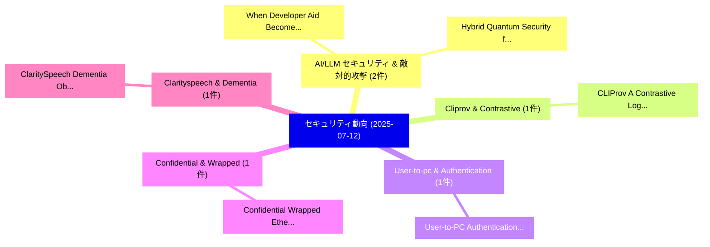

# 📅 02_daily: 日次エグゼクティブサマリー報告書 (2025-07-12)

**集計日時**: 2026-10-02 23:05:33 UTC  
**対象日付**: 2025-07-12  
**本日収集論文数**: 10 件  

---

## 💡 主要セキュリティ動向・脅威インサイト (Executive Insights)

本日の収集論文（計 10 件）において、以下の重点セキュリティ領域で活発な研究動向が確認されました：
- **AI/LLM セキュリティ & 敵対的攻撃** (2 件): 注目論文として 「Hybrid Quantum Security for IP...」、「When Developer Aid Becomes Sec...」 等が発表され、実務防御および攻撃検証の進展が見られます。
- **Cliprov & Contrastive** (1 件): 注目論文として 「CLIProv: A Contrastive Log-to-...」 等が発表され、実務防御および攻撃検証の進展が見られます。
- **User-to-pc & Authentication** (1 件): 注目論文として 「User-to-PC Authentication Thro...」 等が発表され、実務防御および攻撃検証の進展が見られます。
- **Confidential & Wrapped** (1 件): 注目論文として 「Confidential Wrapped Ethereum（...」 等が発表され、実務防御および攻撃検証の進展が見られます。
- **Clarityspeech & Dementia** (1 件): 注目論文として 「ClaritySpeech: Dementia Obfusc...」 等が発表され、実務防御および攻撃検証の進展が見られます。

### 🗺️ 技術・脅威トピックマインドマップ

---

## 📌 日次セキュリティ論文一覧 (日本語表形式)

| No | arXiv ID | 論文タイトル (日本語訳) | 重要キーワード | 構造化エグゼクティブ要約 (背景・提案・影響) | 脅威分類 | 詳細リンク |
|---|---|---|---|---|---|---|
| 1 | `2507.09133v1` | [CLIProv: A Contrastive Log-to-Intelligence Multimodal Approach for Threat Detection and Provenance Analysis（セキュリティ分析論文）](../../okf/papers/2025-07-12/2507.09133.md) | `Contrastive Log`, `Threat Detection`, `Jingwen Li` | 【提案】概要 (Overview & Key Finding) 本論文「CLIProv: A Contrastive Log-to-Intelligence Multimodal A...。実証評価により経営層・セキュリティ管理者向け推奨アクション (E... | `cs.CR` | [arXiv](https://arxiv.org/abs/2507.09133v1) &#124; [OKF](../../okf/papers/2025-07-12/2507.09133.md) |
| 2 | `2507.09190v1` | [User-to-PC Authentication Through Confirmation on Mobile Devices: On Usability and Performance（セキュリティ分析論文）](../../okf/papers/2025-07-12/2507.09190.md) | `Mobile Devices`, `Rainhard Dieter Findling`, `Andreas Pramendorfer` | 【提案】概要 (Overview & Key Finding) 本論文「User-to-PC Authentication Through Confirmation on Mobil...。実証評価により経営層・セキュリティ管理者向け推奨アクション (E... | `cs.CR` | [arXiv](https://arxiv.org/abs/2507.09190v1) &#124; [OKF](../../okf/papers/2025-07-12/2507.09190.md) |
| 3 | `2507.09231v1` | [Confidential Wrapped Ethereum（セキュリティ分析論文）](../../okf/papers/2025-07-12/2507.09231.md) | `Confidential Wrapped Ethereum`, `Artem Chystiakov`, `Mariia Zhvanko` | 【提案】概要 (Overview & Key Finding) 本論文「Confidential Wrapped Ethereum（セキュリティ分析論文）」（原題: Confiden...。実証評価により経営層・セキュリティ管理者向け推奨アクション (E... | `cs.CR` | [arXiv](https://arxiv.org/abs/2507.09231v1) &#124; [OKF](../../okf/papers/2025-07-12/2507.09231.md) |
| 4 | `2507.09282v1` | [ClaritySpeech: Dementia Obfuscation in Speech（セキュリティ分析論文）](../../okf/papers/2025-07-12/2507.09282.md) | `Dementia Obfuscation`, `Dominika Woszczyk`, `Ranya Aloufi` | 【提案】概要 (Overview & Key Finding) 本論文「ClaritySpeech: Dementia Obfuscation in Speech（セキュリティ分析論...。実証評価により経営層・セキュリティ管理者向け推奨アクション (E... | `cs.CR` | [arXiv](https://arxiv.org/abs/2507.09282v1) &#124; [OKF](../../okf/papers/2025-07-12/2507.09282.md) |
| 5 | `2507.09288v1` | [Hybrid Quantum Security for IPsec（セキュリティ分析論文）](../../okf/papers/2025-07-12/2507.09288.md) | `Hybrid Quantum Security`, `Florina Almenares Mendoza`, `Javier Blanco` | 【提案】概要 (Overview & Key Finding) 本論文「Hybrid 量子 Security for IPsec（セキュリティ分析論文）」（原題: Hybrid 量子...。実証評価により経営層・セキュリティ管理者向け推奨アクション (E... | `cs.CR` | [arXiv](https://arxiv.org/abs/2507.09288v1) &#124; [OKF](../../okf/papers/2025-07-12/2507.09288.md) |
| 6 | `2507.09301v1` | [Implementing and Evaluating Post-Quantum DNSSEC in CoreDNS（セキュリティ分析論文）](../../okf/papers/2025-07-12/2507.09301.md) | `Evaluating Post`, `Post-Quantum DNSSEC`, `Julio Gento Suela` | 【提案】概要 (Overview & Key Finding) 本論文「Implementing and Evaluating Post-量子 DNSSEC in CoreDNS（セ...。実証評価により経営層・セキュリティ管理者向け推奨アクション (E... | `cs.CR` | [arXiv](https://arxiv.org/abs/2507.09301v1) &#124; [OKF](../../okf/papers/2025-07-12/2507.09301.md) |
| 7 | `2507.09329v2` | [When Developer Aid Becomes Security Debt: A Systematic Insecure Behaviors in LLM Coding Agentsの分析](../../okf/papers/2025-07-12/2507.09329.md) | `Systematic Insecure Behaviors`, `Insecure Behaviors`, `Coding Agents` | 【提案】概要 (Overview & Key Finding) 本論文「When Developer Aid Becomes Security Debt: A Systematic ...。実証評価により経営層・セキュリティ管理者向け推奨アクション (E... | `cs.CR` | [arXiv](https://arxiv.org/abs/2507.09329v2) &#124; [OKF](../../okf/papers/2025-07-12/2507.09329.md) |
| 8 | `2507.09354v1` | [Backscatter Device-aided Integrated Sensing and Communication: A Pareto Optimization Framework（セキュリティ分析論文）](../../okf/papers/2025-07-12/2507.09354.md) | `Backscatter Device`, `Integrated Sensing`, `Device-aided Integrated` | 【提案】概要 (Overview & Key Finding) 本論文「Backscatter Device-aided Integrated Sensing and Communi...。実証評価により経営層・セキュリティ管理者向け推奨アクション (E... | `cs.CR` | [arXiv](https://arxiv.org/abs/2507.09354v1) &#124; [OKF](../../okf/papers/2025-07-12/2507.09354.md) |
| 9 | `2507.09407v1` | [LLM-Stackelberg Games: Conjectural Reasoning Equilibria and Their Applications to Spearphishing（セキュリティ分析論文）](../../okf/papers/2025-07-12/2507.09407.md) | `Conjectural Reasoning Equilibria`, `Stackelberg Games`, `LLM-Stackelberg Games` | 【提案】概要 (Overview & Key Finding) 本論文「LLM-Stackelberg Games: Conjectural Reasoning Equilibria...。実証評価により経営層・セキュリティ管理者向け推奨アクション (E... | `cs.CR` | [arXiv](https://arxiv.org/abs/2507.09407v1) &#124; [OKF](../../okf/papers/2025-07-12/2507.09407.md) |
| 10 | `2507.09411v2` | [LLMalMorph: On The Feasibility of Generating Variant Malware using Large-Language-Models（セキュリティ分析論文）](../../okf/papers/2025-07-12/2507.09411.md) | `Generating Variant Malware`, `Md Ajwad Akil`, `Adrian Shuai Li` | 【提案】概要 (Overview & Key Finding) 本論文「LLMalMorph: On The Feasibility of Generating Variant マル...。実証評価により経営層・セキュリティ管理者向け推奨アクション (E... | `cs.CR` | [arXiv](https://arxiv.org/abs/2507.09411v2) &#124; [OKF](../../okf/papers/2025-07-12/2507.09411.md) |

