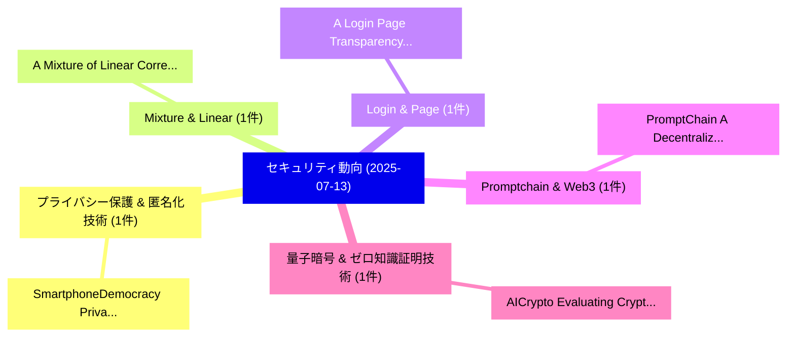

# 📅 02_daily: 日次エグゼクティブサマリー報告書 (2025-07-13)

**集計日時**: 2026-10-02 23:05:33 UTC  
**対象日付**: 2025-07-13  
**本日収集論文数**: 12 件  

---

## 💡 主要セキュリティ動向・脅威インサイト (Executive Insights)

本日の収集論文（計 12 件）において、以下の重点セキュリティ領域で活発な研究動向が確認されました：
- **プライバシー保護 & 匿名化技術** (1 件): 注目論文として 「SmartphoneDemocracy: Privacy-P...」 等が発表され、実務防御および攻撃検証の進展が見られます。
- **Mixture & Linear** (1 件): 注目論文として 「A Mixture of Linear Correction...」 等が発表され、実務防御および攻撃検証の進展が見られます。
- **Login & Page** (1 件): 注目論文として 「A Login Page Transparency and ...」 等が発表され、実務防御および攻撃検証の進展が見られます。
- **Promptchain & Web3** (1 件): 注目論文として 「PromptChain: A Decentralized W...」 等が発表され、実務防御および攻撃検証の進展が見られます。
- **量子暗号 & ゼロ知識証明技術** (1 件): 注目論文として 「AICrypto: Evaluating Cryptogra...」 等が発表され、実務防御および攻撃検証の進展が見られます。

### 🗺️ 技術・脅威トピックマインドマップ

---

## 📌 日次セキュリティ論文一覧 (日本語表形式)

| No | arXiv ID | 論文タイトル (日本語訳) | 重要キーワード | 構造化エグゼクティブ要約 (背景・提案・影響) | 脅威分類 | 詳細リンク |
|---|---|---|---|---|---|---|
| 1 | `2507.09453v1` | [SmartphoneDemocracy: Privacy-Preserving E-Voting on Decentralized Infrastructure using Novel European Identity（セキュリティ分析論文）](../../okf/papers/2025-07-13/2507.09453.md) | `Decentralized Infrastructure`, `Privacy-Preserving E`, `Johan Pouwelse` | 【提案】概要 (Overview & Key Finding) 本論文「SmartphoneDemocracy: Privacy-Preserving E-Voting on Dec...。実証評価により経営層・セキュリティ管理者向け推奨アクション (E... | `cs.CR` | [arXiv](https://arxiv.org/abs/2507.09453v1) &#124; [OKF](../../okf/papers/2025-07-13/2507.09453.md) |
| 2 | `2507.09508v1` | [A Mixture of Linear Corrections Generates Secure Code（セキュリティ分析論文）](../../okf/papers/2025-07-13/2507.09508.md) | `Linear Corrections Generates Secure Code`, `Weichen Yu`, `Ravi Mangal` | 【提案】概要 (Overview & Key Finding) 本論文「A Mixture of Linear Corrections Generates Secure Code（セ...。実証評価によりPasareanu - **公開日。 | `cs.CR` | [arXiv](https://arxiv.org/abs/2507.09508v1) &#124; [OKF](../../okf/papers/2025-07-13/2507.09508.md) |
| 3 | `2507.09564v1` | [A Login Page Transparency and Visual Similarity Based Zero Day Phishing Defense Protocol（セキュリティ分析論文）](../../okf/papers/2025-07-13/2507.09564.md) | `Visual Similarity Based Zero Day Phishing Defense Protocol`, `Login Page Transparency`, `Gaurav Varshney` | 【提案】概要 (Overview & Key Finding) 本論文「A Login Page Transparency and Visual Similarity Based Z...。実証評価により経営層・セキュリティ管理者向け推奨アクション (E... | `cs.CR` | [arXiv](https://arxiv.org/abs/2507.09564v1) &#124; [OKF](../../okf/papers/2025-07-13/2507.09564.md) |
| 4 | `2507.09579v1` | [PromptChain: A Decentralized Web3 Architecture for Managing AI Prompts as Digital Assets（セキュリティ分析論文）](../../okf/papers/2025-07-13/2507.09579.md) | `Decentralized Web3 Architecture`, `Digital Assets`, `Marc Bara` | 【提案】概要 (Overview & Key Finding) 本論文「PromptChain: A Decentralized Web3 Architecture for Mana...。実証評価により経営層・セキュリティ管理者向け推奨アクション (E... | `cs.CR` | [arXiv](https://arxiv.org/abs/2507.09579v1) &#124; [OKF](../../okf/papers/2025-07-13/2507.09579.md) |
| 5 | `2507.09580v6` | [AICrypto: Evaluating Cryptography Capabilities of 大規模言語モデル](../../okf/papers/2025-07-13/2507.09580.md) | `Evaluating Cryptography Capabilities`, `Large Language Models`, `Yu Wang` | 【提案】概要 (Overview & Key Finding) 本論文「AICrypto: Evaluating 暗号技術 Capabilities of 大規模言語モデル」（原題:...。実証評価により経営層・セキュリティ管理者向け推奨アクション (E... | `cs.CR` | [arXiv](https://arxiv.org/abs/2507.09580v6) &#124; [OKF](../../okf/papers/2025-07-13/2507.09580.md) |
| 6 | `2507.09607v4` | [Efficient and High-Accuracy Private CNN Inference with Helper-Assisted Malicious Security（セキュリティ分析論文）](../../okf/papers/2025-07-13/2507.09607.md) | `Assisted Malicious Security`, `Accuracy Private`, `High-Accuracy Private` | 【提案】概要 (Overview & Key Finding) 本論文「Efficient and High-Accuracy Private CNN Inference with ...。実証評価により経営層・セキュリティ管理者向け推奨アクション (E... | `cs.CR` | [arXiv](https://arxiv.org/abs/2507.09607v4) &#124; [OKF](../../okf/papers/2025-07-13/2507.09607.md) |
| 7 | `2507.09624v1` | [CAN-Trace Attack: Exploit CAN Messages to Uncover Driving Trajectories（セキュリティ分析論文）](../../okf/papers/2025-07-13/2507.09624.md) | `Uncover Driving Trajectories`, `Trace Attack`, `CAN-Trace Attack` | 【提案】概要 (Overview & Key Finding) 本論文「CAN-Trace Attack: エクスプロイト CAN Messages to Uncover Drivi...。実証評価により経営層・セキュリティ管理者向け推奨アクション (E... | `cs.CR` | [arXiv](https://arxiv.org/abs/2507.09624v1) &#124; [OKF](../../okf/papers/2025-07-13/2507.09624.md) |
| 8 | `2507.09699v1` | [Interpreting Differential Privacy in Terms of Disclosure Risk（セキュリティ分析論文）](../../okf/papers/2025-07-13/2507.09699.md) | `Interpreting Differential Privacy`, `Disclosure Risk`, `Zeki Kazan` | 【提案】概要 (Overview & Key Finding) 本論文「Interpreting 差分プライバシー in Terms of Disclosure Risk（セキュリテ...。実証評価により経営層・セキュリティ管理者向け推奨アクション (E... | `cs.CR` | [arXiv](https://arxiv.org/abs/2507.09699v1) &#124; [OKF](../../okf/papers/2025-07-13/2507.09699.md) |
| 9 | `2507.09762v1` | [EventHunter: Dynamic Clustering and Ranking of Security Events from Hacker Forum Discussions（セキュリティ分析論文）](../../okf/papers/2025-07-13/2507.09762.md) | `Hacker Forum Discussions`, `Dynamic Clustering`, `Security Events` | 【提案】概要 (Overview & Key Finding) 本論文「EventHunter: Dynamic Clustering and Ranking of Security...。実証評価により経営層・セキュリティ管理者向け推奨アクション (E... | `cs.CR` | [arXiv](https://arxiv.org/abs/2507.09762v1) &#124; [OKF](../../okf/papers/2025-07-13/2507.09762.md) |
| 10 | `2507.10610v3` | [LaSM: Layer-wise Scaling Mechanism for Defending Pop-up Attack on GUI Agents（セキュリティ分析論文）](../../okf/papers/2025-07-13/2507.10610.md) | `Scaling Mechanism`, `Defending Pop`, `Layer-wise Scaling` | 【提案】概要 (Overview & Key Finding) 本論文「LaSM: Layer-wise Scaling Mechanism for Defending Pop-up...。実証評価により経営層・セキュリティ管理者向け推奨アクション (E... | `cs.CR` | [arXiv](https://arxiv.org/abs/2507.10610v3) &#124; [OKF](../../okf/papers/2025-07-13/2507.10610.md) |
| 11 | `2507.11499v1` | [Demo: Secure Edge Server for Network Slicing and Resource Allocation in Open RAN（セキュリティ分析論文）](../../okf/papers/2025-07-13/2507.11499.md) | `Secure Edge Server`, `Network Slicing`, `Resource Allocation` | 【提案】概要 (Overview & Key Finding) 本論文「Demo: Secure Edge Server for Network Slicing and Resour...。実証評価により経営層・セキュリティ管理者向け推奨アクション (E... | `cs.CR` | [arXiv](https://arxiv.org/abs/2507.11499v1) &#124; [OKF](../../okf/papers/2025-07-13/2507.11499.md) |
| 12 | `2508.00851v1` | [eBPF-Based Real-Time DDoS Mitigation for IoT Edge Devices（セキュリティ分析論文）](../../okf/papers/2025-07-13/2508.00851.md) | `Based Real`, `Edge Devices`, `eBPF-Based Real` | 【提案】概要 (Overview & Key Finding) 本論文「eBPF-Based Real-Time DDoS Mitigation for IoT Edge Devic...。実証評価により経営層・セキュリティ管理者向け推奨アクション (E... | `cs.CR` | [arXiv](https://arxiv.org/abs/2508.00851v1) &#124; [OKF](../../okf/papers/2025-07-13/2508.00851.md) |

