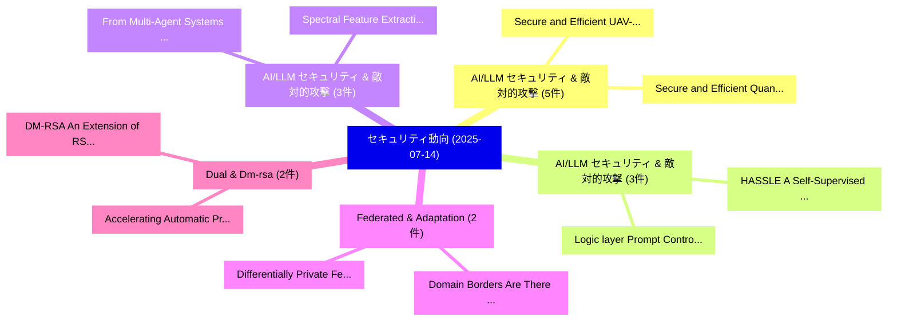

# 📅 02_daily: 日次エグゼクティブサマリー報告書 (2025-07-14)

**集計日時**: 2026-10-02 23:05:33 UTC  
**対象日付**: 2025-07-14  
**本日収集論文数**: 34 件  

---

## 💡 主要セキュリティ動向・脅威インサイト (Executive Insights)

本日の収集論文（計 34 件）において、以下の重点セキュリティ領域で活発な研究動向が確認されました：
- **AI/LLM セキュリティ & 敵対的攻撃** (5 件): 注目論文として 「Secure and Efficient UAV-Based...」、「Secure and Efficient Quantum S...」 等が発表され、実務防御および攻撃検証の進展が見られます。
- **AI/LLM セキュリティ & 敵対的攻撃** (3 件): 注目論文として 「HASSLE: A Self-Supervised Lear...」、「Logic layer Prompt Control Inj...」 等が発表され、実務防御および攻撃検証の進展が見られます。
- **AI/LLM セキュリティ & 敵対的攻撃** (3 件): 注目論文として 「Spectral Feature Extraction fo...」、「From Multi-Agent Systems and t...」 等が発表され、実務防御および攻撃検証の進展が見られます。
- **Federated & Adaptation** (2 件): 注目論文として 「Differentially Private Federat...」、「Domain Borders Are There to Be...」 等が発表され、実務防御および攻撃検証の進展が見られます。
- **Dual & Dm-rsa** (2 件): 注目論文として 「Accelerating Automatic Program...」、「DM-RSA: An Extension of RSA wi...」 等が発表され、実務防御および攻撃検証の進展が見られます。

### 🗺️ 技術・脅威トピックマインドマップ

---

## 📌 日次セキュリティ論文一覧 (日本語表形式)

| No | arXiv ID | 論文タイトル (日本語訳) | 重要キーワード | 構造化エグゼクティブ要約 (背景・提案・影響) | 脅威分類 | 詳細リンク |
|---|---|---|---|---|---|---|
| 1 | `2507.09857v1` | [AdvGrasp: Robotic Grasping from a Physical Perspectiveに対する敵対的攻撃](../../okf/papers/2025-07-14/2507.09857.md) | `Robotic Grasping`, `Adversarial Attacks`, `Physical Perspective` | 【提案】概要 (Overview & Key Finding) 本論文「AdvGrasp: Robotic Grasping from a Physical Perspectiveに...。実証評価により経営層・セキュリティ管理者向け推奨アクション (E... | `cs.CR` | [arXiv](https://arxiv.org/abs/2507.09857v1) &#124; [OKF](../../okf/papers/2025-07-14/2507.09857.md) |
| 2 | `2507.09859v1` | [Endorsement-Driven Blockchain SSI Framework for Dynamic IoT Ecosystems（セキュリティ分析論文）](../../okf/papers/2025-07-14/2507.09859.md) | `Driven Blockchain`, `Endorsement-Driven Blockchain`, `Bagus Rakadyanto Oktavianto Putra` | 【提案】概要 (Overview & Key Finding) 本論文「Endorsement-Driven Blockchain SSI Framework for Dynamic...。実証評価により経営層・セキュリティ管理者向け推奨アクション (E... | `cs.CR` | [arXiv](https://arxiv.org/abs/2507.09859v1) &#124; [OKF](../../okf/papers/2025-07-14/2507.09859.md) |
| 3 | `2507.09860v1` | [Secure and Efficient UAV-Based Face Detection via Homomorphic Encryption and Edge Computing（セキュリティ分析論文）](../../okf/papers/2025-07-14/2507.09860.md) | `Based Face Detection`, `Homomorphic Encryption`, `UAV-Based Face` | 【提案】概要 (Overview & Key Finding) 本論文「Secure and Efficient UAV-Based Face Detection via 準同型暗号...。実証評価により経営層・セキュリティ管理者向け推奨アクション (E... | `cs.CR` | [arXiv](https://arxiv.org/abs/2507.09860v1) &#124; [OKF](../../okf/papers/2025-07-14/2507.09860.md) |
| 4 | `2507.09990v1` | [Differentially Private Federated Low Rank Adaptation Beyond Fixed-Matrix（セキュリティ分析論文）](../../okf/papers/2025-07-14/2507.09990.md) | `Differentially Private Federated Low Rank Adaptation Beyond Fixed`, `Ming Wen`, `Jiaqi Zhu` | 【提案】概要 (Overview & Key Finding) 本論文「Differentially Private Federated Low Rank Adaptation Be...。実証評価により経営層・セキュリティ管理者向け推奨アクション (E... | `cs.CR` | [arXiv](https://arxiv.org/abs/2507.09990v1) &#124; [OKF](../../okf/papers/2025-07-14/2507.09990.md) |
| 5 | `2507.10016v2` | [The Man Behind the Sound: Demystifying Audio Private Attribute Profiling via Multimodal Large Language Model Agents（セキュリティ分析論文）](../../okf/papers/2025-07-14/2507.10016.md) | `Demystifying Audio Private Attribute Profiling`, `Multimodal Large Language Model Agents`, `Lixu Wang` | 【提案】概要 (Overview & Key Finding) 本論文「The Man Behind the Sound: Demystifying Audio Private At...。実証評価により経営層・セキュリティ管理者向け推奨アクション (E... | `cs.CR` | [arXiv](https://arxiv.org/abs/2507.10016v2) &#124; [OKF](../../okf/papers/2025-07-14/2507.10016.md) |
| 6 | `2507.10103v1` | [Accelerating Automatic Program Repair with Dual Retrieval-Augmented Fine-Tuning and Patch Generation on 大規模言語モデル](../../okf/papers/2025-07-14/2507.10103.md) | `Accelerating Automatic Program Repair`, `Dual Retrieval`, `Augmented Fine` | 【提案】概要 (Overview & Key Finding) 本論文「Accelerating Automatic Program Repair with Dual Retriev...。実証評価により経営層・セキュリティ管理者向け推奨アクション (E... | `cs.CR` | [arXiv](https://arxiv.org/abs/2507.10103v1) &#124; [OKF](../../okf/papers/2025-07-14/2507.10103.md) |
| 7 | `2507.10160v1` | [Domain Borders Are There to Be Crossed With Federated Few-Shot Adaptation（セキュリティ分析論文）](../../okf/papers/2025-07-14/2507.10160.md) | `Shot Adaptation`, `Few-Shot Adaptation`, `Christoph Raab` | 【提案】概要 (Overview & Key Finding) 本論文「Domain Borders Are There to Be Crossed With Federated F...。実証評価により経営層・セキュリティ管理者向け推奨アクション (E... | `cs.CR` | [arXiv](https://arxiv.org/abs/2507.10160v1) &#124; [OKF](../../okf/papers/2025-07-14/2507.10160.md) |
| 8 | `2507.10162v1` | [HASSLE: A Self-Supervised Learning Enhanced Hijacking Attack on Vertical 連合学習](../../okf/papers/2025-07-14/2507.10162.md) | `Supervised Learning Enhanced Hijacking Attack`, `Self-Supervised Learning`, `Vertical Federated Learning` | 【提案】概要 (Overview & Key Finding) 本論文「HASSLE: A Self-Supervised Learning Enhanced Hijacking A...。実証評価により経営層・セキュリティ管理者向け推奨アクション (E... | `cs.CR` | [arXiv](https://arxiv.org/abs/2507.10162v1) &#124; [OKF](../../okf/papers/2025-07-14/2507.10162.md) |
| 9 | `2507.10233v1` | [Secure and Efficient Quantum Signature Scheme Based on the Controlled Unitary Operations Encryption（セキュリティ分析論文）](../../okf/papers/2025-07-14/2507.10233.md) | `Efficient Quantum Signature Scheme Based`, `Controlled Unitary Operations Encryption`, `Ashok Kumar Das` | 【提案】概要 (Overview & Key Finding) 本論文「Secure and Efficient 量子 Signature Scheme Based on the C...。実証評価により経営層・セキュリティ管理者向け推奨アクション (E... | `cs.CR` | [arXiv](https://arxiv.org/abs/2507.10233v1) &#124; [OKF](../../okf/papers/2025-07-14/2507.10233.md) |
| 10 | `2507.10267v1` | [DNS Tunneling: Threat Landscape and Improved Detection Solutions（セキュリティ分析論文）](../../okf/papers/2025-07-14/2507.10267.md) | `Improved Detection Solutions`, `Threat Landscape`, `Bilal Ihsan Tuncer` | 【提案】概要 (Overview & Key Finding) 本論文「DNS Tunneling: 脅威 Landscape and Improved Detection Solu...。実証評価により経営層・セキュリティ管理者向け推奨アクション (E... | `cs.CR` | [arXiv](https://arxiv.org/abs/2507.10267v1) &#124; [OKF](../../okf/papers/2025-07-14/2507.10267.md) |
| 11 | `2507.10457v2` | [Logic layer Prompt Control Injection (LPCI): A Novel Security Vulnerability Class in Agentic Systems（セキュリティ分析論文）](../../okf/papers/2025-07-14/2507.10457.md) | `Prompt Control Injection`, `Agentic Systems`, `Muhammad Aziz Ul Haq` | 【提案】概要 (Overview & Key Finding) 本論文「Logic layer Prompt Control Injection (LPCI): A Novel Se...。実証評価により経営層・セキュリティ管理者向け推奨アクション (E... | `cs.CR` | [arXiv](https://arxiv.org/abs/2507.10457v2) &#124; [OKF](../../okf/papers/2025-07-14/2507.10457.md) |
| 12 | `2507.10489v1` | [SynthGuard: Redefining Synthetic Data Generation with a Scalable and Privacy-Preserving Workflow Framework（セキュリティ分析論文）](../../okf/papers/2025-07-14/2507.10489.md) | `Redefining Synthetic Data Generation`, `Privacy-Preserving Workflow`, `Eduardo Brito` | 【提案】概要 (Overview & Key Finding) 本論文「SynthGuard: Redefining Synthetic Data Generation with a...。実証評価により経営層・セキュリティ管理者向け推奨アクション (E... | `cs.CR` | [arXiv](https://arxiv.org/abs/2507.10489v1) &#124; [OKF](../../okf/papers/2025-07-14/2507.10489.md) |
| 13 | `2507.10491v1` | [BURN: Backdoor Unlearning via Adversarial Boundary Analysis（セキュリティ分析論文）](../../okf/papers/2025-07-14/2507.10491.md) | `Backdoor Unlearning`, `Yanghao Su`, `Jie Zhang` | 【提案】概要 (Overview & Key Finding) 本論文「BURN: Backdoor Unlearning via Adversarial Boundary Anal...。実証評価により経営層・セキュリティ管理者向け推奨アクション (E... | `cs.CR` | [arXiv](https://arxiv.org/abs/2507.10491v1) &#124; [OKF](../../okf/papers/2025-07-14/2507.10491.md) |
| 14 | `2507.10494v1` | [Split Happens: Combating Advanced Threats with Split Learning and Function Secret Sharing（セキュリティ分析論文）](../../okf/papers/2025-07-14/2507.10494.md) | `Combating Advanced Threats`, `Function Secret Sharing`, `Split Happens` | 【提案】概要 (Overview & Key Finding) 本論文「Split Happens: Combating Advanced Threats with Split Le...。実証評価により経営層・セキュリティ管理者向け推奨アクション (E... | `cs.CR` | [arXiv](https://arxiv.org/abs/2507.10494v1) &#124; [OKF](../../okf/papers/2025-07-14/2507.10494.md) |
| 15 | `2507.10621v1` | [Game Theory Meets LLM and Agentic AI: Reimagining サイバーセキュリティ for the Age of Intelligent Threats](../../okf/papers/2025-07-14/2507.10621.md) | `Game Theory Meets`, `Intelligent Threats`, `Reimagining Cybersecurity` | 【提案】概要 (Overview & Key Finding) 本論文「Game Theory Meets LLM and Agentic AI: Reimagining サイバーセ...。実証評価により経営層・セキュリティ管理者向け推奨アクション (E... | `cs.CR` | [arXiv](https://arxiv.org/abs/2507.10621v1) &#124; [OKF](../../okf/papers/2025-07-14/2507.10621.md) |
| 16 | `2507.10622v1` | [Spectral Feature Extraction for Robust Network Intrusion Detection Using MFCCs（セキュリティ分析論文）](../../okf/papers/2025-07-14/2507.10622.md) | `Robust Network Intrusion Detection Using`, `Spectral Feature Extraction`, `Muhammad Nadeem` | 【提案】概要 (Overview & Key Finding) 本論文「Spectral Feature Extraction for Robust Network Intrusio...。実証評価により経営層・セキュリティ管理者向け推奨アクション (E... | `cs.CR` | [arXiv](https://arxiv.org/abs/2507.10622v1) &#124; [OKF](../../okf/papers/2025-07-14/2507.10622.md) |
| 17 | `2507.10627v1` | [Crypto-Assisted Graph Degree Sequence Release under Local Differential Privacy（セキュリティ分析論文）](../../okf/papers/2025-07-14/2507.10627.md) | `Assisted Graph Degree Sequence Release`, `Local Differential Privacy`, `Crypto-Assisted Graph` | 【提案】概要 (Overview & Key Finding) 本論文「Crypto-Assisted Graph Degree Sequence Release under Loc...。実証評価により経営層・セキュリティ管理者向け推奨アクション (E... | `cs.CR` | [arXiv](https://arxiv.org/abs/2507.10627v1) &#124; [OKF](../../okf/papers/2025-07-14/2507.10627.md) |
| 18 | `2507.10644v4` | [From Multi-Agent Systems and the Semantic Web to Agentic AI: A Unified Narrative of the Web of Agents（セキュリティ分析論文）](../../okf/papers/2025-07-14/2507.10644.md) | `Agent Systems`, `Multi-Agent Systems`, `Semantic Web` | 【提案】概要 (Overview & Key Finding) 本論文「From Multi-Agent Systems and the Semantic Web to Agenti...。実証評価により経営層・セキュリティ管理者向け推奨アクション (E... | `cs.CR` | [arXiv](https://arxiv.org/abs/2507.10644v4) &#124; [OKF](../../okf/papers/2025-07-14/2507.10644.md) |
| 19 | `2507.10695v1` | [Exploring User Security and Privacy Attitudes and Concerns Toward the Use of General-Purpose LLM Chatbots for Mental Health（セキュリティ分析論文）](../../okf/papers/2025-07-14/2507.10695.md) | `Exploring User Security`, `Privacy Attitudes`, `Concerns Toward` | 【提案】概要 (Overview & Key Finding) 本論文「Exploring User Security and Privacy Attitudes and Conce...。実証評価により経営層・セキュリティ管理者向け推奨アクション (E... | `cs.CR` | [arXiv](https://arxiv.org/abs/2507.10695v1) &#124; [OKF](../../okf/papers/2025-07-14/2507.10695.md) |
| 20 | `2507.10730v1` | [Access Control for Information-Theoretically Secure Key-Document Stores（セキュリティ分析論文）](../../okf/papers/2025-07-14/2507.10730.md) | `Theoretically Secure Key`, `Access Control`, `Document Stores` | 【提案】概要 (Overview & Key Finding) 本論文「アクセス制御 for Information-Theoretically Secure Key-Documen...。実証評価により経営層・セキュリティ管理者向け推奨アクション (E... | `cs.CR` | [arXiv](https://arxiv.org/abs/2507.10730v1) &#124; [OKF](../../okf/papers/2025-07-14/2507.10730.md) |
| 21 | `2507.10733v2` | [3S-Attack: Spatial, Spectral and Semantic Invisible Backdoor Attack Against DNN Models（セキュリティ分析論文）](../../okf/papers/2025-07-14/2507.10733.md) | `Jianyao Yin`, `Luca Arnaboldi`, `Honglong Chen` | 【提案】概要 (Overview & Key Finding) 本論文「3S-Attack: Spatial, Spectral and Semantic Invisible Bac...。実証評価により経営層・セキュリティ管理者向け推奨アクション (E... | `cs.CR` | [arXiv](https://arxiv.org/abs/2507.10733v2) &#124; [OKF](../../okf/papers/2025-07-14/2507.10733.md) |
| 22 | `2507.10746v3` | [Optimal Debiased Inference on Privatized Data via Indirect Estimation and Parametric Bootstrap（セキュリティ分析論文）](../../okf/papers/2025-07-14/2507.10746.md) | `Optimal Debiased Inference`, `Privatized Data`, `Indirect Estimation` | 【提案】概要 (Overview & Key Finding) 本論文「Optimal Debiased Inference on Privatized Data via Indir...。実証評価により経営層・セキュリティ管理者向け推奨アクション (E... | `cs.CR` | [arXiv](https://arxiv.org/abs/2507.10746v3) &#124; [OKF](../../okf/papers/2025-07-14/2507.10746.md) |
| 23 | `2507.10786v2` | ["Is it always watching? Is it always listening?" Exploring Contextual Privacy and Security Concerns Toward Domestic Social Robots（セキュリティ分析論文）](../../okf/papers/2025-07-14/2507.10786.md) | `Security Concerns Toward Domestic Social Robots`, `Exploring Contextual Privacy`, `Henry Bell` | 【提案】Is it always listening?" Exploring Contextual Privacy and Security Concerns Toward Dome...。実証評価により経営層・セキュリティ管理者向け推奨アクション (E... | `cs.CR` | [arXiv](https://arxiv.org/abs/2507.10786v2) &#124; [OKF](../../okf/papers/2025-07-14/2507.10786.md) |
| 24 | `2507.10808v4` | [Contrastive-KAN: A Semi-Supervised Intrusion Detection Framework for サイバーセキュリティ with scarce Labeled Data](../../okf/papers/2025-07-14/2507.10808.md) | `Labeled Data`, `Semi-Supervised Intrusion`, `Mohammad Alikhani` | 【提案】概要 (Overview & Key Finding) 本論文「Contrastive-KAN: A Semi-Supervised Intrusion Detection ...。実証評価により経営層・セキュリティ管理者向け推奨アクション (E... | `cs.CR` | [arXiv](https://arxiv.org/abs/2507.10808v4) &#124; [OKF](../../okf/papers/2025-07-14/2507.10808.md) |
| 25 | `2507.10819v1` | [Reporte de vulnerabilidades en IIoT. Proyecto DEFENDER（セキュリティ分析論文）](../../okf/papers/2025-07-14/2507.10819.md) | `Pedro Almansa`, `Raw Meta`, `Executive Summary` | 【提案】Proyecto DEFENDER ### (日本語題名: Reporte de vulnerabilidades en IIoT. Proyecto DEFENDER（セキ...。実証評価により経営層・セキュリティ管理者向け推奨アクション (E... | `cs.CR` | [arXiv](https://arxiv.org/abs/2507.10819v1) &#124; [OKF](../../okf/papers/2025-07-14/2507.10819.md) |
| 26 | `2507.10836v1` | [REAL-IoT: Characterizing GNN Intrusion Detection Robustness under Practical Adversarial Attack（セキュリティ分析論文）](../../okf/papers/2025-07-14/2507.10836.md) | `Intrusion Detection Robustness`, `Practical Adversarial Attack`, `Zhonghao Zhan` | 【提案】概要 (Overview & Key Finding) 本論文「REAL-IoT: Characterizing GNN Intrusion Detection Robust...。実証評価により経営層・セキュリティ管理者向け推奨アクション (E... | `cs.CR` | [arXiv](https://arxiv.org/abs/2507.10836v1) &#124; [OKF](../../okf/papers/2025-07-14/2507.10836.md) |
| 27 | `2507.10845v2` | [BandFuzz: An ML-powered Collaborative Fuzzing Framework（セキュリティ分析論文）](../../okf/papers/2025-07-14/2507.10845.md) | `ML-powered Collaborative`, `Wenxuan Shi`, `Hongwei Li` | 【提案】概要 (Overview & Key Finding) 本論文「BandFuzz: An ML-powered Collaborative Fuzzing Framework...。実証評価により経営層・セキュリティ管理者向け推奨アクション (E... | `cs.CR` | [arXiv](https://arxiv.org/abs/2507.10845v2) &#124; [OKF](../../okf/papers/2025-07-14/2507.10845.md) |
| 28 | `2507.10854v2` | [PhreshPhish: A Real-World, High-Quality, Large-Scale Phishing Website Dataset and Benchmark（セキュリティ分析論文）](../../okf/papers/2025-07-14/2507.10854.md) | `Scale Phishing Website Dataset`, `Large-Scale Phishing`, `Alireza Hadj Khodabakhshi` | 【提案】概要 (Overview & Key Finding) 本論文「PhreshPhish: A Real-World, High-Quality, Large-Scale Ph...。実証評価により経営層・セキュリティ管理者向け推奨アクション (E... | `cs.CR` | [arXiv](https://arxiv.org/abs/2507.10854v2) &#124; [OKF](../../okf/papers/2025-07-14/2507.10854.md) |
| 29 | `2507.11500v3` | [ARMOR: Aligning Secure and Safe 大規模言語モデル via Meticulous Reasoning](../../okf/papers/2025-07-14/2507.11500.md) | `Aligning Secure`, `Meticulous Reasoning`, `Safe Large Language Models` | 【提案】概要 (Overview & Key Finding) 本論文「ARMOR: Aligning Secure and Safe 大規模言語モデル via Meticulous...。実証評価により経営層・セキュリティ管理者向け推奨アクション (E... | `cs.CR` | [arXiv](https://arxiv.org/abs/2507.11500v3) &#124; [OKF](../../okf/papers/2025-07-14/2507.11500.md) |
| 30 | `2507.14197v1` | [DM-RSA: An Extension of RSA with Dual Modulus（セキュリティ分析論文）](../../okf/papers/2025-07-14/2507.14197.md) | `Dual Modulus`, `Rufine Marius Lalasoa`, `Andriamifidisoa Ramamonjy` | 【提案】概要 (Overview & Key Finding) 本論文「DM-RSA: An Extension of RSA with Dual Modulus（セキュリティ分析論...。実証評価により経営層・セキュリティ管理者向け推奨アクション (E... | `cs.CR` | [arXiv](https://arxiv.org/abs/2507.14197v1) &#124; [OKF](../../okf/papers/2025-07-14/2507.14197.md) |
| 31 | `2507.14201v3` | [ExCyTIn-Bench: Evaluating LLMエージェント on Cyber Threat Investigation](../../okf/papers/2025-07-14/2507.14201.md) | `Cyber Threat Investigation`, `Yiran Wu`, `Mauricio Velazco` | 【提案】概要 (Overview & Key Finding) 本論文「ExCyTIn-Bench: Evaluating LLMエージェント on Cyber 脅威 Investi...。実証評価により経営層・セキュリティ管理者向け推奨アクション (E... | `cs.CR` | [arXiv](https://arxiv.org/abs/2507.14201v3) &#124; [OKF](../../okf/papers/2025-07-14/2507.14201.md) |
| 32 | `2507.14202v1` | [PRM-Free Security Alignment of Large Models via Red Teaming and Adversarial Training（セキュリティ分析論文）](../../okf/papers/2025-07-14/2507.14202.md) | `Free Security Alignment`, `Large Models`, `Red Teaming` | 【提案】概要 (Overview & Key Finding) 本論文「PRM-Free Security Alignment of Large Models via Red Tea...。実証評価により経営層・セキュリティ管理者向け推奨アクション (E... | `cs.CR` | [arXiv](https://arxiv.org/abs/2507.14202v1) &#124; [OKF](../../okf/papers/2025-07-14/2507.14202.md) |
| 33 | `2507.21113v1` | [Vulnerability Mitigation System (VMS): LLM Agent and Evaluation Framework for Autonomous Penetration Testing（セキュリティ分析論文）](../../okf/papers/2025-07-14/2507.21113.md) | `Vulnerability Mitigation System`, `Autonomous Penetration Testing`, `Farzana Abdulzada` | 【提案】概要 (Overview & Key Finding) 本論文「脆弱性 Mitigation System (VMS): LLM Agent and Evaluation F...。実証評価により# 脆弱性 Mitigation System (... | `cs.CR` | [arXiv](https://arxiv.org/abs/2507.21113v1) &#124; [OKF](../../okf/papers/2025-07-14/2507.21113.md) |
| 34 | `2508.03696v1` | [PLA: Prompt Learning Attack against Text-to-Image Generative Models（セキュリティ分析論文）](../../okf/papers/2025-07-14/2508.03696.md) | `Prompt Learning Attack`, `Image Generative Models`, `Xinqi Lyu` | 【提案】概要 (Overview & Key Finding) 本論文「PLA: Prompt Learning Attack against Text-to-Image Gener...。実証評価により経営層・セキュリティ管理者向け推奨アクション (E... | `cs.CR` | [arXiv](https://arxiv.org/abs/2508.03696v1) &#124; [OKF](../../okf/papers/2025-07-14/2508.03696.md) |

