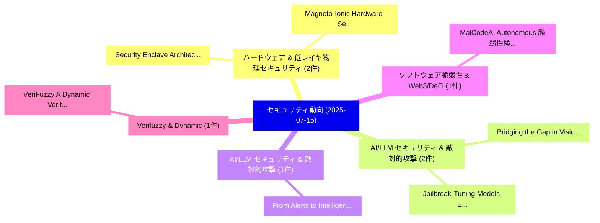

# 📅 02_daily: 日次エグゼクティブサマリー報告書 (2025-07-15)

**集計日時**: 2026-10-02 23:05:33 UTC  
**対象日付**: 2025-07-15  
**本日収集論文数**: 19 件  

---

## 💡 主要セキュリティ動向・脅威インサイト (Executive Insights)

本日の収集論文（計 19 件）において、以下の重点セキュリティ領域で活発な研究動向が確認されました：
- **ハードウェア & 低レイヤ物理セキュリティ** (2 件): 注目論文として 「Security Enclave Architecture ...」、「Magneto-Ionic Hardware Securit...」 等が発表され、実務防御および攻撃検証の進展が見られます。
- **AI/LLM セキュリティ & 敵対的攻撃** (2 件): 注目論文として 「Bridging the Gap in Vision Lan...」、「Jailbreak-Tuning: Models Effic...」 等が発表され、実務防御および攻撃検証の進展が見られます。
- **AI/LLM セキュリティ & 敵対的攻撃** (1 件): 注目論文として 「From Alerts to Intelligence: A...」 等が発表され、実務防御および攻撃検証の進展が見られます。
- **ソフトウェア脆弱性 & Web3/DeFi** (1 件): 注目論文として 「MalCodeAI: Autonomous 脆弱性検出 an...」 等が発表され、実務防御および攻撃検証の進展が見られます。
- **Verifuzzy & Dynamic** (1 件): 注目論文として 「VeriFuzzy: A Dynamic Verifiabl...」 等が発表され、実務防御および攻撃検証の進展が見られます。

### 🗺️ 技術・脅威トピックマインドマップ

---

## 📌 日次セキュリティ論文一覧 (日本語表形式)

| No | arXiv ID | 論文タイトル (日本語訳) | 重要キーワード | 構造化エグゼクティブ要約 (背景・提案・影響) | 脅威分類 | 詳細リンク |
|---|---|---|---|---|---|---|
| 1 | `2507.10873v1` | [From Alerts to Intelligence: A Novel LLM-Aided Framework for Host-based Intrusion Detection（セキュリティ分析論文）](../../okf/papers/2025-07-15/2507.10873.md) | `Intrusion Detection`, `Host-based Intrusion`, `Danyu Sun` | 【提案】概要 (Overview & Key Finding) 本論文「From Alerts to Intelligence: A Novel LLM-Aided Framewor...。実証評価により経営層・セキュリティ管理者向け推奨アクション (E... | `cs.CR` | [arXiv](https://arxiv.org/abs/2507.10873v1) &#124; [OKF](../../okf/papers/2025-07-15/2507.10873.md) |
| 2 | `2507.10898v1` | [MalCodeAI: Autonomous 脆弱性検出 and Remediation via Language Agnostic Code Reasoning](../../okf/papers/2025-07-15/2507.10898.md) | `Language Agnostic Code Reasoning`, `Autonomous Vulnerability Detection`, `Language Agnostic Code Reas` | 【提案】概要 (Overview & Key Finding) 本論文「MalCodeAI: Autonomous 脆弱性検出 and Remediation via Languag...。実証評価により経営層・セキュリティ管理者向け推奨アクション (E... | `cs.CR` | [arXiv](https://arxiv.org/abs/2507.10898v1) &#124; [OKF](../../okf/papers/2025-07-15/2507.10898.md) |
| 3 | `2507.10927v2` | [VeriFuzzy: A Dynamic Verifiable Fuzzy Search Service for Encrypted Cloud Data（セキュリティ分析論文）](../../okf/papers/2025-07-15/2507.10927.md) | `Dynamic Verifiable Fuzzy Search Service`, `Encrypted Cloud Data`, `Encrypted Cloud Dat` | 【提案】概要 (Overview & Key Finding) 本論文「VeriFuzzy: A Dynamic Verifiable Fuzzy Search Service fo...。実証評価により経営層・セキュリティ管理者向け推奨アクション (E... | `cs.CR` | [arXiv](https://arxiv.org/abs/2507.10927v2) &#124; [OKF](../../okf/papers/2025-07-15/2507.10927.md) |
| 4 | `2507.10971v1` | [Security Enclave Architecture for Heterogeneous Security Primitives for Supply-Chain Attacks（セキュリティ分析論文）](../../okf/papers/2025-07-15/2507.10971.md) | `Security Enclave Architecture`, `Heterogeneous Security Primitives`, `Chain Attacks` | 【提案】概要 (Overview & Key Finding) 本論文「Security Enclave Architecture for Heterogeneous Securit...。実証評価により経営層・セキュリティ管理者向け推奨アクション (E... | `cs.CR` | [arXiv](https://arxiv.org/abs/2507.10971v1) &#124; [OKF](../../okf/papers/2025-07-15/2507.10971.md) |
| 5 | `2507.11112v2` | [Multi-Trigger Poisoning Amplifies Backdoor Vulnerabilities in LLMs（セキュリティ分析論文）](../../okf/papers/2025-07-15/2507.11112.md) | `Trigger Poisoning Amplifies Backdoor Vulnerabilities`, `Multi-Trigger Poisoning`, `Sanhanat Sivapiromrat` | 【提案】概要 (Overview & Key Finding) 本論文「Multi-Trigger Poisoning Amplifies Backdoor Vulnerabilit...。実証評価により経営層・セキュリティ管理者向け推奨アクション (E... | `cs.CR` | [arXiv](https://arxiv.org/abs/2507.11112v2) &#124; [OKF](../../okf/papers/2025-07-15/2507.11112.md) |
| 6 | `2507.11137v2` | [Hashed Watermark as a Filter: Defeating Forging and Overwriting Attacks in Weight-based Neural Network Watermarking（セキュリティ分析論文）](../../okf/papers/2025-07-15/2507.11137.md) | `Neural Network Watermarking`, `Hashed Watermark`, `Defeating Forging` | 【提案】概要 (Overview & Key Finding) 本論文「Hashed Watermark as a Filter: Defeating Forging and Ove...。実証評価により経営層・セキュリティ管理者向け推奨アクション (E... | `cs.CR` | [arXiv](https://arxiv.org/abs/2507.11137v2) &#124; [OKF](../../okf/papers/2025-07-15/2507.11137.md) |
| 7 | `2507.11138v1` | [FacialMotionID: Identifying Users of Mixed Reality Headsets using Abstract Facial Motion Representations（セキュリティ分析論文）](../../okf/papers/2025-07-15/2507.11138.md) | `Mixed Reality Headsets`, `Abstract Facial Motion Representations`, `Identifying Users` | 【提案】概要 (Overview & Key Finding) 本論文「FacialMotionID: Identifying Users of Mixed Reality Head...。実証評価により経営層・セキュリティ管理者向け推奨アクション (E... | `cs.CR` | [arXiv](https://arxiv.org/abs/2507.11138v1) &#124; [OKF](../../okf/papers/2025-07-15/2507.11138.md) |
| 8 | `2507.11155v1` | [Bridging the Gap in Vision Language Models in Identifying Unsafe Concepts Across Modalities（セキュリティ分析論文）](../../okf/papers/2025-07-15/2507.11155.md) | `Identifying Unsafe Concepts Across Modalities`, `Vision Language Models`, `Yiting Qu` | 【提案】概要 (Overview & Key Finding) 本論文「Bridging the Gap in Vision Language Models in Identifyi...。実証評価により経営層・セキュリティ管理者向け推奨アクション (E... | `cs.CR` | [arXiv](https://arxiv.org/abs/2507.11155v1) &#124; [OKF](../../okf/papers/2025-07-15/2507.11155.md) |
| 9 | `2507.11310v1` | [LRCTI: A Large Language Model-Based Framework for Multi-Step Evidence Retrieval and Reasoning in Cyber Threat Intelligence Credibility Verification（セキュリティ分析論文）](../../okf/papers/2025-07-15/2507.11310.md) | `Cyber Threat Intelligence Credibility Verification`, `Large Language Model`, `Step Evidence Retrieval` | 【提案】概要 (Overview & Key Finding) 本論文「LRCTI: A Large Language Model-Based Framework for Multi...。実証評価により経営層・セキュリティ管理者向け推奨アクション (E... | `cs.CR` | [arXiv](https://arxiv.org/abs/2507.11310v1) &#124; [OKF](../../okf/papers/2025-07-15/2507.11310.md) |
| 10 | `2507.11324v2` | [A Review of Privacy Metrics for Privacy-Preserving Synthetic Data Generation（セキュリティ分析論文）](../../okf/papers/2025-07-15/2507.11324.md) | `Preserving Synthetic Data Generation`, `Privacy Metrics`, `Privacy-Preserving Synthetic` | 【提案】概要 (Overview & Key Finding) 本論文「A Review of Privacy Metrics for Privacy-Preserving Synt...。実証評価により経営層・セキュリティ管理者向け推奨アクション (E... | `cs.CR` | [arXiv](https://arxiv.org/abs/2507.11324v2) &#124; [OKF](../../okf/papers/2025-07-15/2507.11324.md) |
| 11 | `2507.11630v2` | [Jailbreak-Tuning: Models Efficiently Learn Jailbreak Susceptibility（セキュリティ分析論文）](../../okf/papers/2025-07-15/2507.11630.md) | `Models Efficiently Learn Jailbreak Susceptibility`, `Brendan Murphy`, `Dillon Bowen` | 【提案】概要 (Overview & Key Finding) 本論文「ジェイルブレイク-Tuning: Models Efficiently Learn ジェイルブレイク Susc...。実証評価により経営層・セキュリティ管理者向け推奨アクション (E... | `cs.CR` | [arXiv](https://arxiv.org/abs/2507.11630v2) &#124; [OKF](../../okf/papers/2025-07-15/2507.11630.md) |
| 12 | `2507.11721v2` | [Evasion Under Blockchain Sanctions（セキュリティ分析論文）](../../okf/papers/2025-07-15/2507.11721.md) | `Endong Liu`, `Mark Ryan`, `Liyi Zhou` | 【提案】概要 (Overview & Key Finding) 本論文「Evasion Under Blockchain Sanctions（セキュリティ分析論文）」（原題: Eva...。実証評価により経営層・セキュリティ管理者向け推奨アクション (E... | `cs.CR` | [arXiv](https://arxiv.org/abs/2507.11721v2) &#124; [OKF](../../okf/papers/2025-07-15/2507.11721.md) |
| 13 | `2507.11763v1` | [Space サイバーセキュリティ Testbed: Fidelity Framework, Example Implementation, and Characterization](../../okf/papers/2025-07-15/2507.11763.md) | `Example Implementation`, `Space Cybersecurity Testbed`, `Jose Luis Castanon Remy` | 【提案】概要 (Overview & Key Finding) 本論文「Space サイバーセキュリティ Testbed: Fidelity Framework, Example I...。実証評価により経営層・セキュリティ管理者向け推奨アクション (E... | `cs.CR` | [arXiv](https://arxiv.org/abs/2507.11763v1) &#124; [OKF](../../okf/papers/2025-07-15/2507.11763.md) |
| 14 | `2507.11772v1` | [How To Mitigate And Defend Against DDoS Attacks In IoT Devices（セキュリティ分析論文）](../../okf/papers/2025-07-15/2507.11772.md) | `Maria Pilar Bezanilla`, `Ifiyemi Leigha`, `Basak Comlekcioglu` | 【提案】概要 (Overview & Key Finding) 本論文「How To Mitigate And Defend Against DDoS Attacks In IoT ...。実証評価により経営層・セキュリティ管理者向け推奨アクション (E... | `cs.CR` | [arXiv](https://arxiv.org/abs/2507.11772v1) &#124; [OKF](../../okf/papers/2025-07-15/2507.11772.md) |
| 15 | `2507.11775v1` | [Challenges in GenAI and Authentication: a scoping review（セキュリティ分析論文）](../../okf/papers/2025-07-15/2507.11775.md) | `Lais Machado Bezerra`, `Carlos Becker Westphall`, `Reis Bezerra` | 【提案】概要 (Overview & Key Finding) 本論文「Challenges in GenAI and Authentication: a scoping revie...。実証評価により経営層・セキュリティ管理者向け推奨アクション (E... | `cs.CR` | [arXiv](https://arxiv.org/abs/2507.11775v1) &#124; [OKF](../../okf/papers/2025-07-15/2507.11775.md) |
| 16 | `2507.14207v1` | [Mitigating Trojanized Prompt Chains in Educational LLM Use Cases: Experimental Findings and Detection Tool Design（セキュリティ分析論文）](../../okf/papers/2025-07-15/2507.14207.md) | `Mitigating Trojanized Prompt Chains`, `Detection Tool Design`, `Use Cases` | 【提案】概要 (Overview & Key Finding) 本論文「Mitigating Trojanized Prompt Chains in Educational LLM ...。実証評価により# Mitigating Trojanized P... | `cs.CR` | [arXiv](https://arxiv.org/abs/2507.14207v1) &#124; [OKF](../../okf/papers/2025-07-15/2507.14207.md) |
| 17 | `2507.14212v1` | [Secure Goal-Oriented Communication: Defending against Eavesdropping Timing Attacks（セキュリティ分析論文）](../../okf/papers/2025-07-15/2507.14212.md) | `Eavesdropping Timing Attacks`, `Secure Goal`, `Oriented Communication` | 【提案】概要 (Overview & Key Finding) 本論文「Secure Goal-Oriented Communication: Defending against E...。実証評価により経営層・セキュリティ管理者向け推奨アクション (E... | `cs.CR` | [arXiv](https://arxiv.org/abs/2507.14212v1) &#124; [OKF](../../okf/papers/2025-07-15/2507.14212.md) |
| 18 | `2507.14213v1` | [Magneto-Ionic Hardware Security Primitives: Embedding Data Protection at the Material Level（セキュリティ分析論文）](../../okf/papers/2025-07-15/2507.14213.md) | `Ionic Hardware Security Primitives`, `Embedding Data Protection`, `Magneto-Ionic Hardware` | 【提案】概要 (Overview & Key Finding) 本論文「Magneto-Ionic Hardware Security Primitives: Embedding D...。実証評価により経営層・セキュリティ管理者向け推奨アクション (E... | `cs.CR` | [arXiv](https://arxiv.org/abs/2507.14213v1) &#124; [OKF](../../okf/papers/2025-07-15/2507.14213.md) |
| 19 | `2507.14214v1` | [Let's Measure the Elephant in the Room: Facilitating Personalized Automated Privacy Policies at Scaleの分析](../../okf/papers/2025-07-15/2507.14214.md) | `Facilitating Personalized Automated Privacy Policies`, `Privacy Policies`, `Rui Zhao` | 【提案】概要 (Overview & Key Finding) 本論文「Let's Measure the Elephant in the Room: Facilitating Pe...。実証評価により経営層・セキュリティ管理者向け推奨アクション (E... | `cs.CR` | [arXiv](https://arxiv.org/abs/2507.14214v1) &#124; [OKF](../../okf/papers/2025-07-15/2507.14214.md) |

