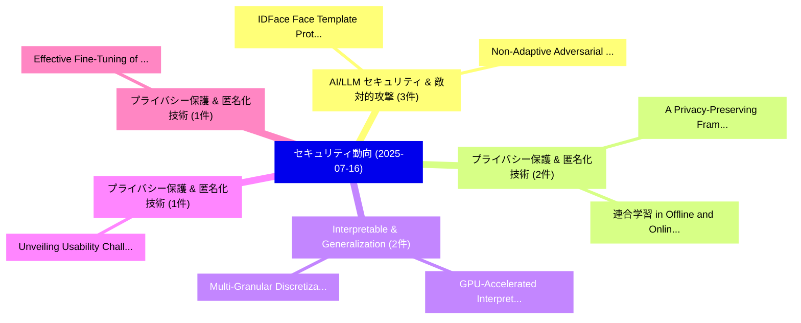

# 📅 02_daily: 日次エグゼクティブサマリー報告書 (2025-07-16)

**集計日時**: 2026-10-02 23:05:33 UTC  
**対象日付**: 2025-07-16  
**本日収集論文数**: 22 件  

---

## 💡 主要セキュリティ動向・脅威インサイト (Executive Insights)

本日の収集論文（計 22 件）において、以下の重点セキュリティ領域で活発な研究動向が確認されました：
- **AI/LLM セキュリティ & 敵対的攻撃** (3 件): 注目論文として 「IDFace: Face Template Protecti...」、「Non-Adaptive Adversarial Face ...」 等が発表され、実務防御および攻撃検証の進展が見られます。
- **プライバシー保護 & 匿名化技術** (2 件): 注目論文として 「A Privacy-Preserving Framework...」、「連合学習 in Offline and Online EMG...」 等が発表され、実務防御および攻撃検証の進展が見られます。
- **Interpretable & Generalization** (2 件): 注目論文として 「GPU-Accelerated Interpretable ...」、「Multi-Granular Discretization ...」 等が発表され、実務防御および攻撃検証の進展が見られます。
- **プライバシー保護 & 匿名化技術** (1 件): 注目論文として 「Unveiling Usability Challenges...」 等が発表され、実務防御および攻撃検証の進展が見られます。
- **プライバシー保護 & 匿名化技術** (1 件): 注目論文として 「Effective Fine-Tuning of Visio...」 等が発表され、実務防御および攻撃検証の進展が見られます。

### 🗺️ 技術・脅威トピックマインドマップ

---

## 📌 日次セキュリティ論文一覧 (日本語表形式)

| No | arXiv ID | 論文タイトル (日本語訳) | 重要キーワード | 構造化エグゼクティブ要約 (背景・提案・影響) | 脅威分類 | 詳細リンク |
|---|---|---|---|---|---|---|
| 1 | `2507.11908v1` | [Unveiling Usability Challenges in Web Privacy Controls（セキュリティ分析論文）](../../okf/papers/2025-07-16/2507.11908.md) | `Unveiling Usability Challenges`, `Web Privacy Controls`, `Sunday Oyinlola Ogundoyin` | 【提案】概要 (Overview & Key Finding) 本論文「Unveiling Usability Challenges in Web Privacy Controls（...。実証評価により経営層・セキュリティ管理者向け推奨アクション (E... | `cs.CR` | [arXiv](https://arxiv.org/abs/2507.11908v1) &#124; [OKF](../../okf/papers/2025-07-16/2507.11908.md) |
| 2 | `2507.11943v1` | [Effective Fine-Tuning of Vision Transformers with Low-Rank Adaptation for Privacy-Preserving Image Classification（セキュリティ分析論文）](../../okf/papers/2025-07-16/2507.11943.md) | `Preserving Image Classification`, `Effective Fine`, `Vision Transformers` | 【提案】概要 (Overview & Key Finding) 本論文「Effective Fine-Tuning of Vision Transformers with Low-R...。実証評価により経営層・セキュリティ管理者向け推奨アクション (E... | `cs.CR` | [arXiv](https://arxiv.org/abs/2507.11943v1) &#124; [OKF](../../okf/papers/2025-07-16/2507.11943.md) |
| 3 | `2507.11970v2` | [Obfuscation of Unitary Quantum Programs（セキュリティ分析論文）](../../okf/papers/2025-07-16/2507.11970.md) | `Unitary Quantum Programs`, `Ying Huang`, `Cheng Tang` | 【提案】概要 (Overview & Key Finding) 本論文「Obfuscation of Unitary 量子 Programs（セキュリティ分析論文）」（原題: Obf...。実証評価により経営層・セキュリティ管理者向け推奨アクション (E... | `cs.CR` | [arXiv](https://arxiv.org/abs/2507.11970v2) &#124; [OKF](../../okf/papers/2025-07-16/2507.11970.md) |
| 4 | `2507.12003v1` | [Expanding ML-Documentation Standards For Better Security（セキュリティ分析論文）](../../okf/papers/2025-07-16/2507.12003.md) | `ML-Documentation Standards`, `Cara Ellen Appel`, `Raw Meta` | 【提案】概要 (Overview & Key Finding) 本論文「Expanding ML-Documentation Standards For Better Securit...。実証評価により経営層・セキュリティ管理者向け推奨アクション (E... | `cs.CR` | [arXiv](https://arxiv.org/abs/2507.12003v1) &#124; [OKF](../../okf/papers/2025-07-16/2507.12003.md) |
| 5 | `2507.12050v1` | [IDFace: Face Template Protection for Efficient and Secure Identification（セキュリティ分析論文）](../../okf/papers/2025-07-16/2507.12050.md) | `Face Template Protection`, `Secure Identification`, `Jae Hong Seo` | 【提案】概要 (Overview & Key Finding) 本論文「IDFace: Face Template Protection for Efficient and Secu...。実証評価により経営層・セキュリティ管理者向け推奨アクション (E... | `cs.CR` | [arXiv](https://arxiv.org/abs/2507.12050v1) &#124; [OKF](../../okf/papers/2025-07-16/2507.12050.md) |
| 6 | `2507.12061v1` | [Toward an Intent-Based and Ontology-Driven Autonomic Security Response in Security Orchestration Automation and Response（セキュリティ分析論文）](../../okf/papers/2025-07-16/2507.12061.md) | `Driven Autonomic Security Response`, `Security Orchestration Automation`, `Ontology-Driven Autonomic` | 【提案】概要 (Overview & Key Finding) 本論文「Toward an Intent-Based and Ontology-Driven Autonomic Se...。実証評価により経営層・セキュリティ管理者向け推奨アクション (E... | `cs.CR` | [arXiv](https://arxiv.org/abs/2507.12061v1) &#124; [OKF](../../okf/papers/2025-07-16/2507.12061.md) |
| 7 | `2507.12084v1` | [LLAMA: Multi-Feedback Smart Contract Fuzzing Framework with LLM-Guided Seed Generation（セキュリティ分析論文）](../../okf/papers/2025-07-16/2507.12084.md) | `Guided Seed Generation`, `Multi-Feedback Smart`, `LLM-Guided Seed` | 【提案】概要 (Overview & Key Finding) 本論文「LLAMA: Multi-Feedback スマートコントラクト Fuzzing Framework with...。実証評価により経営層・セキュリティ管理者向け推奨アクション (E... | `cs.CR` | [arXiv](https://arxiv.org/abs/2507.12084v1) &#124; [OKF](../../okf/papers/2025-07-16/2507.12084.md) |
| 8 | `2507.12098v1` | [A Privacy-Preserving Framework for Advertising Personalization Incorporating 連合学習 and Differential Privacy](../../okf/papers/2025-07-16/2507.12098.md) | `Differential Privacy`, `Advertising Personalization Incorporating`, `Advertising Personalization Incorporating Federated Learning` | 【提案】概要 (Overview & Key Finding) 本論文「A Privacy-Preserving Framework for Advertising Personal...。実証評価により経営層・セキュリティ管理者向け推奨アクション (E... | `cs.CR` | [arXiv](https://arxiv.org/abs/2507.12098v1) &#124; [OKF](../../okf/papers/2025-07-16/2507.12098.md) |
| 9 | `2507.12107v1` | [Non-Adaptive Adversarial Face Generation（セキュリティ分析論文）](../../okf/papers/2025-07-16/2507.12107.md) | `Adaptive Adversarial Face Generation`, `Non-Adaptive Adversarial`, `Jae Hong Seo` | 【提案】概要 (Overview & Key Finding) 本論文「Non-Adaptive Adversarial Face Generation（セキュリティ分析論文）」（原...。実証評価により経営層・セキュリティ管理者向け推奨アクション (E... | `cs.CR` | [arXiv](https://arxiv.org/abs/2507.12107v1) &#124; [OKF](../../okf/papers/2025-07-16/2507.12107.md) |
| 10 | `2507.12185v2` | [Jailbreaking Generative AI: Multivector Phishing Threats and Transformer based Defenses（セキュリティ分析論文）](../../okf/papers/2025-07-16/2507.12185.md) | `Multivector Phishing Threats`, `Jailbreaking Generative`, `Rina Mishra` | 【提案】概要 (Overview & Key Finding) 本論文「ジェイルブレイクing Generative AI: Multivector Phishing Threats...。実証評価により経営層・セキュリティ管理者向け推奨アクション (E... | `cs.CR` | [arXiv](https://arxiv.org/abs/2507.12185v2) &#124; [OKF](../../okf/papers/2025-07-16/2507.12185.md) |
| 11 | `2507.12314v3` | [Thought Purity: A Defense Framework For Chain-of-Thought Attack（セキュリティ分析論文）](../../okf/papers/2025-07-16/2507.12314.md) | `Thought Purity`, `Thought Attack`, `Zihao Xue` | 【提案】概要 (Overview & Key Finding) 本論文「Thought Purity: A Defense Framework For Chain-of-Though...。実証評価により経営層・セキュリティ管理者向け推奨アクション (E... | `cs.CR` | [arXiv](https://arxiv.org/abs/2507.12314v3) &#124; [OKF](../../okf/papers/2025-07-16/2507.12314.md) |
| 12 | `2507.12345v1` | [Efficient Control Flow Attestation by Speculating on Control Flow Path Representations（セキュリティ分析論文）](../../okf/papers/2025-07-16/2507.12345.md) | `Efficient Control Flow Attestation`, `Control Flow Path Representations`, `Ivan De Oliveira Nunes` | 【提案】概要 (Overview & Key Finding) 本論文「Efficient Control Flow Attestation by Speculating on Co...。実証評価により経営層・セキュリティ管理者向け推奨アクション (E... | `cs.CR` | [arXiv](https://arxiv.org/abs/2507.12345v1) &#124; [OKF](../../okf/papers/2025-07-16/2507.12345.md) |
| 13 | `2507.12364v2` | [Tyche: Composable Isolation as a Foundation to Manage Trust in the Cloud（セキュリティ分析論文）](../../okf/papers/2025-07-16/2507.12364.md) | `Composable Isolation`, `Manage Trust`, `Adrien Ghosn` | 【提案】概要 (Overview & Key Finding) 本論文「Tyche: Composable Isolation as a Foundation to Manage T...。実証評価により経営層・セキュリティ管理者向け推奨アクション (E... | `cs.CR` | [arXiv](https://arxiv.org/abs/2507.12364v2) &#124; [OKF](../../okf/papers/2025-07-16/2507.12364.md) |
| 14 | `2507.12408v2` | [Bounding the asymptotic quantum value of all multipartite compiled non-local games（セキュリティ分析論文）](../../okf/papers/2025-07-16/2507.12408.md) | `non-local games`, `Matilde Baroni`, `Dominik Leichtle` | 【提案】概要 (Overview & Key Finding) 本論文「Bounding the asymptotic 量子 value of all multipartite co...。実証評価により経営層・セキュリティ管理者向け推奨アクション (E... | `cs.CR` | [arXiv](https://arxiv.org/abs/2507.12408v2) &#124; [OKF](../../okf/papers/2025-07-16/2507.12408.md) |
| 15 | `2507.12418v2` | [High-Performance Pipelined NTT Accelerators with Homogeneous Digit-Serial Modulo Arithmetic（セキュリティ分析論文）](../../okf/papers/2025-07-16/2507.12418.md) | `Serial Modulo Arithmetic`, `Performance Pipelined`, `High-Performance Pipelined` | 【提案】概要 (Overview & Key Finding) 本論文「High-Performance Pipelined NTT Accelerators with Homoge...。実証評価により経営層・セキュリティ管理者向け推奨アクション (E... | `cs.CR` | [arXiv](https://arxiv.org/abs/2507.12418v2) &#124; [OKF](../../okf/papers/2025-07-16/2507.12418.md) |
| 16 | `2507.12439v1` | [A Bayesian Incentive Mechanism for Poison-Resilient 連合学習](../../okf/papers/2025-07-16/2507.12439.md) | `Bayesian Incentive Mechanism`, `Resilient Federated Learning`, `Poison-Resilient Federated` | 【提案】概要 (Overview & Key Finding) 本論文「A Bayesian Incentive Mechanism for Poison-Resilient 連合学...。実証評価によりCrosby - *。 | `cs.CR` | [arXiv](https://arxiv.org/abs/2507.12439v1) &#124; [OKF](../../okf/papers/2025-07-16/2507.12439.md) |
| 17 | `2507.12456v1` | [On One-Shot Signatures, Quantum vs Classical Binding, and Obfuscating Permutations（セキュリティ分析論文）](../../okf/papers/2025-07-16/2507.12456.md) | `Shot Signatures`, `Classical Binding`, `Obfuscating Permutations` | 【提案】概要 (Overview & Key Finding) 本論文「On One-Shot Signatures, 量子 vs Classical Binding, and Ob...。実証評価により経営層・セキュリティ管理者向け推奨アクション (E... | `cs.CR` | [arXiv](https://arxiv.org/abs/2507.12456v1) &#124; [OKF](../../okf/papers/2025-07-16/2507.12456.md) |
| 18 | `2507.12568v1` | [Safeguarding 連合学習-based Road Condition Classification](../../okf/papers/2025-07-16/2507.12568.md) | `Road Condition Classification`, `Safeguarding Federated Learning`, `Learning-based Road` | 【提案】概要 (Overview & Key Finding) 本論文「Safeguarding 連合学習-based Road Condition Classification」（...。実証評価により経営層・セキュリティ管理者向け推奨アクション (E... | `cs.CR` | [arXiv](https://arxiv.org/abs/2507.12568v1) &#124; [OKF](../../okf/papers/2025-07-16/2507.12568.md) |
| 19 | `2507.12652v2` | [連合学習 in Offline and Online EMG Decoding: A Privacy and Performance Perspective](../../okf/papers/2025-07-16/2507.12652.md) | `Performance Perspective`, `Federated Learning`, `Kai Malcolm` | 【提案】概要 (Overview & Key Finding) 本論文「連合学習 in Offline and Online EMG Decoding: A Privacy and ...。実証評価により経営層・セキュリティ管理者向け推奨アクション (E... | `cs.CR` | [arXiv](https://arxiv.org/abs/2507.12652v2) &#124; [OKF](../../okf/papers/2025-07-16/2507.12652.md) |
| 20 | `2507.12670v1` | [On the Consideration of Vanity Address Generation via Identity-Based Signatures（セキュリティ分析論文）](../../okf/papers/2025-07-16/2507.12670.md) | `Vanity Address Generation`, `Based Signatures`, `Identity-Based Signatures` | 【提案】概要 (Overview & Key Finding) 本論文「On the Consideration of Vanity Address Generation via I...。実証評価により経営層・セキュリティ管理者向け推奨アクション (E... | `cs.CR` | [arXiv](https://arxiv.org/abs/2507.12670v1) &#124; [OKF](../../okf/papers/2025-07-16/2507.12670.md) |
| 21 | `2507.14222v1` | [GPU-Accelerated Interpretable Generalization for Rapid Cyberattack Detection and Forensics（セキュリティ分析論文）](../../okf/papers/2025-07-16/2507.14222.md) | `Accelerated Interpretable Generalization`, `Rapid Cyberattack Detection`, `GPU-Accelerated Interpretable` | 【提案】概要 (Overview & Key Finding) 本論文「GPU-Accelerated Interpretable Generalization for Rapid ...。実証評価により経営層・セキュリティ管理者向け推奨アクション (E... | `cs.CR` | [arXiv](https://arxiv.org/abs/2507.14222v1) &#124; [OKF](../../okf/papers/2025-07-16/2507.14222.md) |
| 22 | `2507.14223v1` | [Multi-Granular Discretization for Interpretable Generalization in Precise Cyberattack Identification（セキュリティ分析論文）](../../okf/papers/2025-07-16/2507.14223.md) | `Precise Cyberattack Identification`, `Granular Discretization`, `Interpretable Generalization` | 【提案】概要 (Overview & Key Finding) 本論文「Multi-Granular Discretization for Interpretable General...。実証評価により経営層・セキュリティ管理者向け推奨アクション (E... | `cs.CR` | [arXiv](https://arxiv.org/abs/2507.14223v1) &#124; [OKF](../../okf/papers/2025-07-16/2507.14223.md) |

