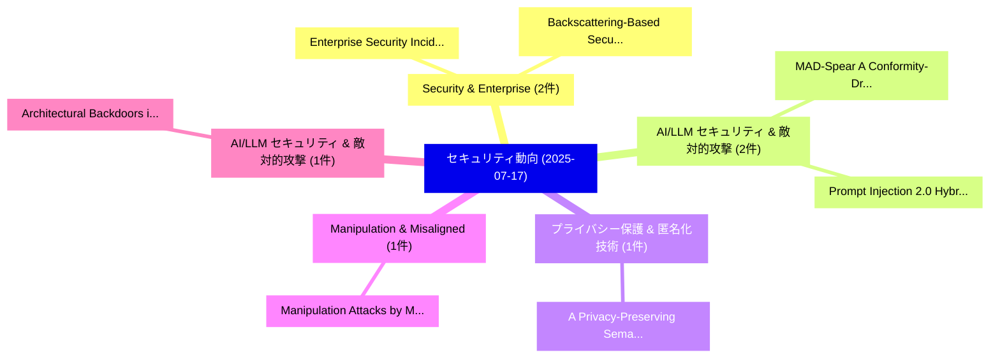

# 📅 02_daily: 日次エグゼクティブサマリー報告書 (2025-07-17)

**集計日時**: 2026-10-02 23:05:33 UTC  
**対象日付**: 2025-07-17  
**本日収集論文数**: 15 件  

---

## 💡 主要セキュリティ動向・脅威インサイト (Executive Insights)

本日の収集論文（計 15 件）において、以下の重点セキュリティ領域で活発な研究動向が確認されました：
- **Security & Enterprise** (2 件): 注目論文として 「Enterprise Security Incident A...」、「Backscattering-Based Security ...」 等が発表され、実務防御および攻撃検証の進展が見られます。
- **AI/LLM セキュリティ & 敵対的攻撃** (2 件): 注目論文として 「MAD-Spear: A Conformity-Driven...」、「Prompt Injection 2.0: Hybrid A...」 等が発表され、実務防御および攻撃検証の進展が見られます。
- **プライバシー保護 & 匿名化技術** (1 件): 注目論文として 「A Privacy-Preserving Semantic-...」 等が発表され、実務防御および攻撃検証の進展が見られます。
- **Manipulation & Misaligned** (1 件): 注目論文として 「Manipulation Attacks by Misali...」 等が発表され、実務防御および攻撃検証の進展が見られます。
- **AI/LLM セキュリティ & 敵対的攻撃** (1 件): 注目論文として 「Architectural Backdoors in Dee...」 等が発表され、実務防御および攻撃検証の進展が見られます。

### 🗺️ 技術・脅威トピックマインドマップ

---

## 📌 日次セキュリティ論文一覧 (日本語表形式)

| No | arXiv ID | 論文タイトル (日本語訳) | 重要キーワード | 構造化エグゼクティブ要約 (背景・提案・影響) | 脅威分類 | 詳細リンク |
|---|---|---|---|---|---|---|
| 1 | `2507.12730v1` | [A Privacy-Preserving Semantic-Segmentation Method Using Domain-Adaptation Technique（セキュリティ分析論文）](../../okf/papers/2025-07-17/2507.12730.md) | `Preserving Semantic`, `Adaptation Technique`, `Privacy-Preserving Semantic` | 【提案】概要 (Overview & Key Finding) 本論文「A Privacy-Preserving Semantic-Segmentation Method Using...。実証評価により経営層・セキュリティ管理者向け推奨アクション (E... | `cs.CR` | [arXiv](https://arxiv.org/abs/2507.12730v1) &#124; [OKF](../../okf/papers/2025-07-17/2507.12730.md) |
| 2 | `2507.12872v1` | [Manipulation Attacks by Misaligned AI: Risk Analysis and Safety Case Framework（セキュリティ分析論文）](../../okf/papers/2025-07-17/2507.12872.md) | `Manipulation Attacks`, `Edward James Young`, `Rishane Dassanayake` | 【提案】概要 (Overview & Key Finding) 本論文「Manipulation Attacks by Misaligned AI: Risk Analysis an...。実証評価により経営層・セキュリティ管理者向け推奨アクション (E... | `cs.CR` | [arXiv](https://arxiv.org/abs/2507.12872v1) &#124; [OKF](../../okf/papers/2025-07-17/2507.12872.md) |
| 3 | `2507.12919v1` | [Architectural Backdoors in Deep Learning: A Survey of Vulnerabilities, Detection, and Defense（セキュリティ分析論文）](../../okf/papers/2025-07-17/2507.12919.md) | `Architectural Backdoors`, `Deep Learning`, `Victoria Childress` | 【提案】概要 (Overview & Key Finding) 本論文「Architectural Backdoors in Deep Learning: A Survey of V...。実証評価により経営層・セキュリティ管理者向け推奨アクション (E... | `cs.CR` | [arXiv](https://arxiv.org/abs/2507.12919v1) &#124; [OKF](../../okf/papers/2025-07-17/2507.12919.md) |
| 4 | `2507.12937v1` | [Enterprise Security Incident Analysis and Countermeasures Based on the T-Mobile Data Breach（セキュリティ分析論文）](../../okf/papers/2025-07-17/2507.12937.md) | `Mobile Data Breach`, `Countermeasures Based`, `T-Mobile Data` | 【提案】概要 (Overview & Key Finding) 本論文「Enterprise Security Incident Analysis and Countermeasur...。実証評価により経営層・セキュリティ管理者向け推奨アクション (E... | `cs.CR` | [arXiv](https://arxiv.org/abs/2507.12937v1) &#124; [OKF](../../okf/papers/2025-07-17/2507.12937.md) |
| 5 | `2507.13023v3` | [Measuring CEX-DEX Extracted Value and Searcher Profitability: The Darkest of the MEV Dark Forest（セキュリティ分析論文）](../../okf/papers/2025-07-17/2507.13023.md) | `Extracted Value`, `Searcher Profitability`, `Dark Forest` | 【提案】概要 (Overview & Key Finding) 本論文「Measuring CEX-DEX Extracted Value and Searcher Profitab...。実証評価により経営層・セキュリティ管理者向け推奨アクション (E... | `cs.CR` | [arXiv](https://arxiv.org/abs/2507.13023v3) &#124; [OKF](../../okf/papers/2025-07-17/2507.13023.md) |
| 6 | `2507.13028v1` | [From Paranoia to Compliance: The Bumpy Road of System Hardening Practices on Stack Exchange（セキュリティ分析論文）](../../okf/papers/2025-07-17/2507.13028.md) | `System Hardening Practices`, `Stack Exchange`, `Niklas Busch` | 【提案】概要 (Overview & Key Finding) 本論文「From Paranoia to Compliance: The Bumpy Road of System H...。実証評価により経営層・セキュリティ管理者向け推奨アクション (E... | `cs.CR` | [arXiv](https://arxiv.org/abs/2507.13028v1) &#124; [OKF](../../okf/papers/2025-07-17/2507.13028.md) |
| 7 | `2507.13038v1` | [MAD-Spear: A Conformity-Driven Prompt Injection Attack on Multi-Agent Debate Systems（セキュリティ分析論文）](../../okf/papers/2025-07-17/2507.13038.md) | `Driven Prompt Injection Attack`, `Agent Debate Systems`, `Conformity-Driven Prompt` | 【提案】概要 (Overview & Key Finding) 本論文「MAD-Spear: A Conformity-Driven プロンプトインジェクション Attack on ...。実証評価により経営層・セキュリティ管理者向け推奨アクション (E... | `cs.CR` | [arXiv](https://arxiv.org/abs/2507.13038v1) &#124; [OKF](../../okf/papers/2025-07-17/2507.13038.md) |
| 8 | `2507.13042v1` | [Backscattering-Based Security in Wireless Power Transfer Applied to Battery-Free BLE Sensors（セキュリティ分析論文）](../../okf/papers/2025-07-17/2507.13042.md) | `Wireless Power Transfer Applied`, `Based Security`, `Backscattering-Based Security` | 【提案】概要 (Overview & Key Finding) 本論文「Backscattering-Based Security in Wireless Power Transfe...。実証評価により経営層・セキュリティ管理者向け推奨アクション (E... | `cs.CR` | [arXiv](https://arxiv.org/abs/2507.13042v1) &#124; [OKF](../../okf/papers/2025-07-17/2507.13042.md) |
| 9 | `2507.13169v1` | [Prompt Injection 2.0: Hybrid AI Threats（セキュリティ分析論文）](../../okf/papers/2025-07-17/2507.13169.md) | `Prompt Injection`, `Jon Cefalu`, `Raw Meta` | 【提案】概要 (Overview & Key Finding) 本論文「プロンプトインジェクション 2.0: Hybrid AI Threats（セキュリティ分析論文）」（原題: プ...。実証評価により経営層・セキュリティ管理者向け推奨アクション (E... | `cs.CR` | [arXiv](https://arxiv.org/abs/2507.13169v1) &#124; [OKF](../../okf/papers/2025-07-17/2507.13169.md) |
| 10 | `2507.13170v1` | [SHIELD: A Secure and Highly Enhanced Integrated Learning for Robust Deepfake Detection against Adversarial Attacks（セキュリティ分析論文）](../../okf/papers/2025-07-17/2507.13170.md) | `Highly Enhanced Integrated Learning`, `Robust Deepfake Detection`, `Adversarial Attacks` | 【提案】概要 (Overview & Key Finding) 本論文「SHIELD: A Secure and Highly Enhanced Integrated Learnin...。実証評価により経営層・セキュリティ管理者向け推奨アクション (E... | `cs.CR` | [arXiv](https://arxiv.org/abs/2507.13170v1) &#124; [OKF](../../okf/papers/2025-07-17/2507.13170.md) |
| 11 | `2507.13313v2` | [A Crowdsensing Intrusion Detection Dataset For Decentralized 連合学習 Models](../../okf/papers/2025-07-17/2507.13313.md) | `Alberto Huertas Celdran`, `Chao Feng`, `Jing Han` | 【提案】概要 (Overview & Key Finding) 本論文「A Crowdsensing Intrusion Detection Dataset For Decentra...。実証評価により経営層・セキュリティ管理者向け推奨アクション (E... | `cs.CR` | [arXiv](https://arxiv.org/abs/2507.13313v2) &#124; [OKF](../../okf/papers/2025-07-17/2507.13313.md) |
| 12 | `2507.13407v1` | [IConMark: Robust Interpretable Concept-Based Watermark For AI Images（セキュリティ分析論文）](../../okf/papers/2025-07-17/2507.13407.md) | `Robust Interpretable Concept`, `Concept-Based Watermark`, `Vinu Sankar Sadasivan` | 【提案】概要 (Overview & Key Finding) 本論文「IConMark: Robust Interpretable Concept-Based Watermark ...。実証評価により経営層・セキュリティ管理者向け推奨アクション (E... | `cs.CR` | [arXiv](https://arxiv.org/abs/2507.13407v1) &#124; [OKF](../../okf/papers/2025-07-17/2507.13407.md) |
| 13 | `2507.13505v1` | [PHASE: Passive Human Activity Simulation Evaluation（セキュリティ分析論文）](../../okf/papers/2025-07-17/2507.13505.md) | `Steven Lamp`, `Anh Nguyen`, `Raw Meta` | 【提案】概要 (Overview & Key Finding) 本論文「PHASE: Passive Human Activity Simulation Evaluation（セキュ...。実証評価によりDavidson - **公開日時**: `202... | `cs.CR` | [arXiv](https://arxiv.org/abs/2507.13505v1) &#124; [OKF](../../okf/papers/2025-07-17/2507.13505.md) |
| 14 | `2507.13508v3` | [Fake or Real: The Impostor Hunt in Texts for Space Operations（セキュリティ分析論文）](../../okf/papers/2025-07-17/2507.13508.md) | `Space Operations`, `Agata Kaczmarek`, `Krzysztof Kotowski` | 【提案】概要 (Overview & Key Finding) 本論文「Fake or Real: The Impostor Hunt in Texts for Space Oper...。実証評価により経営層・セキュリティ管理者向け推奨アクション (E... | `cs.CR` | [arXiv](https://arxiv.org/abs/2507.13508v3) &#124; [OKF](../../okf/papers/2025-07-17/2507.13508.md) |
| 15 | `2507.14229v1` | [Using Modular Arithmetic Optimized Neural Networks To Crack Affine Cryptographic Schemes Efficiently（セキュリティ分析論文）](../../okf/papers/2025-07-17/2507.14229.md) | `Raw Meta`, `Executive Summary`, `Key Finding` | 【提案】概要 (Overview & Key Finding) 本論文「Using Modular Arithmetic Optimized Neural Networks To C...。実証評価により経営層・セキュリティ管理者向け推奨アクション (E... | `cs.CR` | [arXiv](https://arxiv.org/abs/2507.14229v1) &#124; [OKF](../../okf/papers/2025-07-17/2507.14229.md) |

