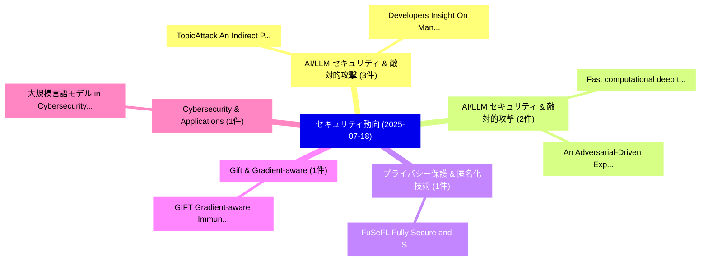

# 📅 02_daily: 日次エグゼクティブサマリー報告書 (2025-07-18)

**集計日時**: 2026-10-02 23:05:33 UTC  
**対象日付**: 2025-07-18  
**本日収集論文数**: 18 件  

---

## 💡 主要セキュリティ動向・脅威インサイト (Executive Insights)

本日の収集論文（計 18 件）において、以下の重点セキュリティ領域で活発な研究動向が確認されました：
- **AI/LLM セキュリティ & 敵対的攻撃** (3 件): 注目論文として 「TopicAttack: An Indirect Promp...」、「Developers Insight On Manifest...」 等が発表され、実務防御および攻撃検証の進展が見られます。
- **AI/LLM セキュリティ & 敵対的攻撃** (2 件): 注目論文として 「Fast computational deep therma...」、「An Adversarial-Driven Experime...」 等が発表され、実務防御および攻撃検証の進展が見られます。
- **プライバシー保護 & 匿名化技術** (1 件): 注目論文として 「FuSeFL: Fully Secure and Scala...」 等が発表され、実務防御および攻撃検証の進展が見られます。
- **Gift & Gradient-aware** (1 件): 注目論文として 「GIFT: Gradient-aware Immunizat...」 等が発表され、実務防御および攻撃検証の進展が見られます。
- **Cybersecurity & Applications** (1 件): 注目論文として 「大規模言語モデル in Cybersecurity: App...」 等が発表され、実務防御および攻撃検証の進展が見られます。

### 🗺️ 技術・脅威トピックマインドマップ

---

## 📌 日次セキュリティ論文一覧 (日本語表形式)

| No | arXiv ID | 論文タイトル (日本語訳) | 重要キーワード | 構造化エグゼクティブ要約 (背景・提案・影響) | 脅威分類 | 詳細リンク |
|---|---|---|---|---|---|---|
| 1 | `2507.13591v3` | [FuSeFL: Fully Secure and Scalable 連合学習](../../okf/papers/2025-07-18/2507.13591.md) | `Fully Secure`, `Scalable Federated Learning`, `Sahar Ghoflsaz Ghinani` | 【提案】概要 (Overview & Key Finding) 本論文「FuSeFL: Fully Secure and Scalable 連合学習」（原題: FuSeFL: Ful...。実証評価により経営層・セキュリティ管理者向け推奨アクション (E... | `cs.CR` | [arXiv](https://arxiv.org/abs/2507.13591v3) &#124; [OKF](../../okf/papers/2025-07-18/2507.13591.md) |
| 2 | `2507.13598v1` | [GIFT: Gradient-aware Immunization of diffusion models against malicious Fine-Tuning with safe concepts retention（セキュリティ分析論文）](../../okf/papers/2025-07-18/2507.13598.md) | `Gradient-aware Immunization`, `Sarah Adel Bargal`, `Amro Abdalla` | 【提案】概要 (Overview & Key Finding) 本論文「GIFT: Gradient-aware Immunization of diffusion models a...。実証評価により経営層・セキュリティ管理者向け推奨アクション (E... | `cs.CR` | [arXiv](https://arxiv.org/abs/2507.13598v1) &#124; [OKF](../../okf/papers/2025-07-18/2507.13598.md) |
| 3 | `2507.13629v1` | [大規模言語モデル in Cybersecurity: Applications, Vulnerabilities, and Defense Techniques](../../okf/papers/2025-07-18/2507.13629.md) | `Defense Techniques`, `Large Language Models`, `Mohammed Alkhanafseh` | 【提案】概要 (Overview & Key Finding) 本論文「大規模言語モデル in Cybersecurity: Applications, Vulnerabilitie...。実証評価により経営層・セキュリティ管理者向け推奨アクション (E... | `cs.CR` | [arXiv](https://arxiv.org/abs/2507.13629v1) &#124; [OKF](../../okf/papers/2025-07-18/2507.13629.md) |
| 4 | `2507.13639v1` | [Differential Privacy in Kernelized Contextual Bandits via Random Projections（セキュリティ分析論文）](../../okf/papers/2025-07-18/2507.13639.md) | `Kernelized Contextual Bandits`, `Differential Privacy`, `Random Projections` | 【提案】概要 (Overview & Key Finding) 本論文「差分プライバシー in Kernelized Contextual Bandits via Random Pr...。実証評価により経営層・セキュリティ管理者向け推奨アクション (E... | `cs.CR` | [arXiv](https://arxiv.org/abs/2507.13639v1) &#124; [OKF](../../okf/papers/2025-07-18/2507.13639.md) |
| 5 | `2507.13670v1` | [Fast computational deep thermalization（セキュリティ分析論文）](../../okf/papers/2025-07-18/2507.13670.md) | `Shantanav Chakraborty`, `Soonwon Choi`, `Soumik Ghosh` | 【提案】概要 (Overview & Key Finding) 本論文「Fast computational deep thermalization（セキュリティ分析論文）」（原題:...。実証評価により経営層・セキュリティ管理者向け推奨アクション (E... | `cs.CR` | [arXiv](https://arxiv.org/abs/2507.13670v1) &#124; [OKF](../../okf/papers/2025-07-18/2507.13670.md) |
| 6 | `2507.13686v2` | [TopicAttack: An Indirect Prompt Injection Attack via Topic Transition（セキュリティ分析論文）](../../okf/papers/2025-07-18/2507.13686.md) | `Topic Transition`, `Yulin Chen`, `Haoran Li` | 【提案】概要 (Overview & Key Finding) 本論文「TopicAttack: An Indirect プロンプトインジェクション Attack via Topic...。実証評価により経営層・セキュリティ管理者向け推奨アクション (E... | `cs.CR` | [arXiv](https://arxiv.org/abs/2507.13686v2) &#124; [OKF](../../okf/papers/2025-07-18/2507.13686.md) |
| 7 | `2507.13720v2` | [Quantum Blockchain Survey: Foundations, Trends, and Gaps（セキュリティ分析論文）](../../okf/papers/2025-07-18/2507.13720.md) | `Quantum Blockchain Survey`, `Niloy Deb Roy Mishu`, `Saurav Ghosh` | 【提案】概要 (Overview & Key Finding) 本論文「量子 Blockchain Survey: Foundations, Trends, and Gaps（セキュ...。実証評価により経営層・セキュリティ管理者向け推奨アクション (E... | `cs.CR` | [arXiv](https://arxiv.org/abs/2507.13720v2) &#124; [OKF](../../okf/papers/2025-07-18/2507.13720.md) |
| 8 | `2507.13810v1` | [Quantum Shadows: The Dining Information Brokers（セキュリティ分析論文）](../../okf/papers/2025-07-18/2507.13810.md) | `Quantum Shadows`, `Theodore Andronikos`, `Constantinos Bitsakos` | 【提案】概要 (Overview & Key Finding) 本論文「量子 Shadows: The Dining Information Brokers（セキュリティ分析論文）」...。実証評価によりGoumas, Nectarios Koziris... | `cs.CR` | [arXiv](https://arxiv.org/abs/2507.13810v1) &#124; [OKF](../../okf/papers/2025-07-18/2507.13810.md) |
| 9 | `2507.13883v1` | [Stablecoins: Fundamentals, Emerging Issues, and Open Challenges（セキュリティ分析論文）](../../okf/papers/2025-07-18/2507.13883.md) | `Emerging Issues`, `Open Challenges`, `Roberto Di Pietro` | 【提案】概要 (Overview & Key Finding) 本論文「Stablecoins: Fundamentals, Emerging Issues, and Open Ch...。実証評価により経営層・セキュリティ管理者向け推奨アクション (E... | `cs.CR` | [arXiv](https://arxiv.org/abs/2507.13883v1) &#124; [OKF](../../okf/papers/2025-07-18/2507.13883.md) |
| 10 | `2507.13926v1` | [Developers Insight On Manifest v3 Privacy and Security Webextensions（セキュリティ分析論文）](../../okf/papers/2025-07-18/2507.13926.md) | `Security Webextensions`, `Giorgio Maone`, `Raw Meta` | 【提案】概要 (Overview & Key Finding) 本論文「Developers Insight On Manifest v3 Privacy and Security ...。実証評価により経営層・セキュリティ管理者向け推奨アクション (E... | `cs.CR` | [arXiv](https://arxiv.org/abs/2507.13926v1) &#124; [OKF](../../okf/papers/2025-07-18/2507.13926.md) |
| 11 | `2507.13932v1` | [Chain Table: Protecting Table-Level Data Integrity by Digital Ledger Technology（セキュリティ分析論文）](../../okf/papers/2025-07-18/2507.13932.md) | `Level Data Integrity`, `Digital Ledger Technology`, `Chain Table` | 【提案】概要 (Overview & Key Finding) 本論文「Chain Table: Protecting Table-Level Data Integrity by D...。実証評価により経営層・セキュリティ管理者向け推奨アクション (E... | `cs.CR` | [arXiv](https://arxiv.org/abs/2507.13932v1) &#124; [OKF](../../okf/papers/2025-07-18/2507.13932.md) |
| 12 | `2507.14007v1` | [The CryptoNeo Threat Modelling Framework (CNTMF): Neobanks and Fintech in Integrated Blockchain Ecosystemsのセキュリティ強化](../../okf/papers/2025-07-18/2507.14007.md) | `Integrated Blockchain`, `Integrated Blockchain Ecosystems`, `Securing Neobanks` | 【提案】概要 (Overview & Key Finding) 本論文「The CryptoNeo 脅威 Modelling Framework (CNTMF): Neobanks ...。実証評価により経営層・セキュリティ管理者向け推奨アクション (E... | `cs.CR` | [arXiv](https://arxiv.org/abs/2507.14007v1) &#124; [OKF](../../okf/papers/2025-07-18/2507.14007.md) |
| 13 | `2507.14109v2` | [An Adversarial-Driven Experimental Study on Deep Learning for RF Fingerprinting（セキュリティ分析論文）](../../okf/papers/2025-07-18/2507.14109.md) | `Deep Learning`, `Xinyu Cao`, `Bimal Adhikari` | 【提案】概要 (Overview & Key Finding) 本論文「An Adversarial-Driven Experimental Study on Deep Learni...。実証評価により経営層・セキュリティ管理者向け推奨アクション (E... | `cs.CR` | [arXiv](https://arxiv.org/abs/2507.14109v2) &#124; [OKF](../../okf/papers/2025-07-18/2507.14109.md) |
| 14 | `2507.14248v1` | [Breaking the Illusion of Security via Interpretation: Interpretable Vision Transformer Systems under Attack（セキュリティ分析論文）](../../okf/papers/2025-07-18/2507.14248.md) | `Interpretable Vision Transformer Systems`, `Eldor Abdukhamidov`, `Mohammed Abuhamad` | 【提案】概要 (Overview & Key Finding) 本論文「Breaking the Illusion of Security via Interpretation: I...。実証評価により経営層・セキュリティ管理者向け推奨アクション (E... | `cs.CR` | [arXiv](https://arxiv.org/abs/2507.14248v1) &#124; [OKF](../../okf/papers/2025-07-18/2507.14248.md) |
| 15 | `2507.14263v1` | [Beyond DNS: Unlocking the Internet of AI Agents via the NANDA Index and Verified AgentFacts（セキュリティ分析論文）](../../okf/papers/2025-07-18/2507.14263.md) | `Jared James Grogan`, `Ramesh Raskar`, `Pradyumna Chari` | 【提案】概要 (Overview & Key Finding) 本論文「Beyond DNS: Unlocking the Internet of AI Agents via the...。実証評価により経営層・セキュリティ管理者向け推奨アクション (E... | `cs.CR` | [arXiv](https://arxiv.org/abs/2507.14263v1) &#124; [OKF](../../okf/papers/2025-07-18/2507.14263.md) |
| 16 | `2507.14322v2` | [FedStrategist: A Meta-Learning Framework for Adaptive and Robust Aggregation in 連合学習](../../okf/papers/2025-07-18/2507.14322.md) | `Robust Aggregation`, `Federated Learning`, `Abu Raihan Mostofa Kamal` | 【提案】概要 (Overview & Key Finding) 本論文「FedStrategist: A Meta-Learning Framework for Adaptive a...。実証評価により経営層・セキュリティ管理者向け推奨アクション (E... | `cs.CR` | [arXiv](https://arxiv.org/abs/2507.14322v2) &#124; [OKF](../../okf/papers/2025-07-18/2507.14322.md) |
| 17 | `2507.14324v1` | [Quantum-Safe Identity Verification using Relativistic Zero-Knowledge Proof Systems（セキュリティ分析論文）](../../okf/papers/2025-07-18/2507.14324.md) | `Safe Identity Verification`, `Knowledge Proof Systems`, `Quantum-Safe Identity` | 【提案】概要 (Overview & Key Finding) 本論文「量子-Safe Identity Verification using Relativistic ゼロ知識証明...。実証評価により経営層・セキュリティ管理者向け推奨アクション (E... | `cs.CR` | [arXiv](https://arxiv.org/abs/2507.14324v1) &#124; [OKF](../../okf/papers/2025-07-18/2507.14324.md) |
| 18 | `2507.21122v1` | [Kintsugi: Decentralized E2EE Key Recovery（セキュリティ分析論文）](../../okf/papers/2025-07-18/2507.21122.md) | `Key Recovery`, `Emilie Ma`, `Martin Kleppmann` | 【提案】概要 (Overview & Key Finding) 本論文「Kintsugi: Decentralized E2EE Key Recovery（セキュリティ分析論文）」（...。実証評価により経営層・セキュリティ管理者向け推奨アクション (E... | `cs.CR` | [arXiv](https://arxiv.org/abs/2507.21122v1) &#124; [OKF](../../okf/papers/2025-07-18/2507.21122.md) |

