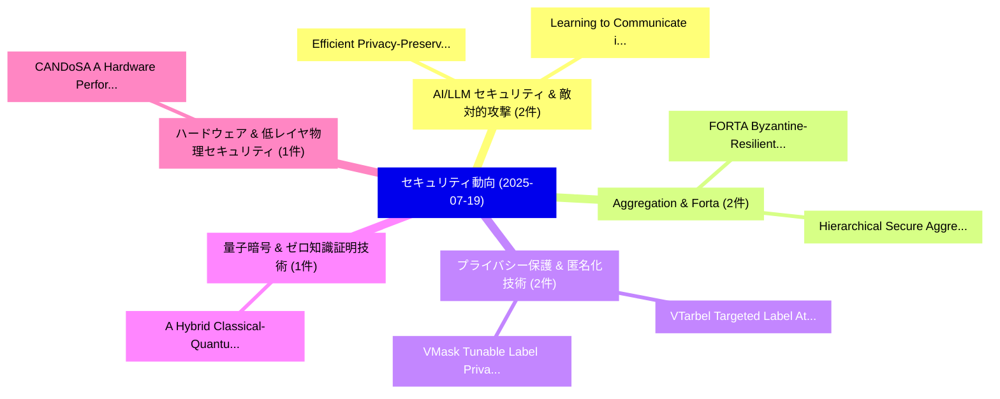

# 📅 02_daily: 日次エグゼクティブサマリー報告書 (2025-07-19)

**集計日時**: 2026-10-02 23:05:33 UTC  
**対象日付**: 2025-07-19  
**本日収集論文数**: 9 件  

---

## 💡 主要セキュリティ動向・脅威インサイト (Executive Insights)

本日の収集論文（計 9 件）において、以下の重点セキュリティ領域で活発な研究動向が確認されました：
- **AI/LLM セキュリティ & 敵対的攻撃** (2 件): 注目論文として 「Efficient Privacy-Preserving M...」、「Learning to Communicate in Mul...」 等が発表され、実務防御および攻撃検証の進展が見られます。
- **Aggregation & Forta** (2 件): 注目論文として 「FORTA: Byzantine-Resilient FL ...」、「Hierarchical Secure Aggregatio...」 等が発表され、実務防御および攻撃検証の進展が見られます。
- **プライバシー保護 & 匿名化技術** (2 件): 注目論文として 「VTarbel: Targeted Label Attack...」、「VMask: Tunable Label Privacy P...」 等が発表され、実務防御および攻撃検証の進展が見られます。
- **量子暗号 & ゼロ知識証明技術** (1 件): 注目論文として 「A Hybrid Classical-Quantum Rai...」 等が発表され、実務防御および攻撃検証の進展が見られます。
- **ハードウェア & 低レイヤ物理セキュリティ** (1 件): 注目論文として 「CANDoSA: A Hardware Performanc...」 等が発表され、実務防御および攻撃検証の進展が見られます。

### 🗺️ 技術・脅威トピックマインドマップ

---

## 📌 日次セキュリティ論文一覧 (日本語表形式)

| No | arXiv ID | 論文タイトル (日本語訳) | 重要キーワード | 構造化エグゼクティブ要約 (背景・提案・影響) | 脅威分類 | 詳細リンク |
|---|---|---|---|---|---|---|
| 1 | `2507.14519v1` | [Efficient Privacy-Preserving Machine Learning: A Systematic Review from Protocol, Model, and System Perspectivesに向けて](../../okf/papers/2025-07-19/2507.14519.md) | `Preserving Machine Learning`, `Systematic Review`, `Privacy-Preserving Machine` | 【提案】概要 (Overview & Key Finding) 本論文「Efficient Privacy-Preserving Machine Learning: A System...。実証評価により経営層・セキュリティ管理者向け推奨アクション (E... | `cs.CR` | [arXiv](https://arxiv.org/abs/2507.14519v1) &#124; [OKF](../../okf/papers/2025-07-19/2507.14519.md) |
| 2 | `2507.14588v1` | [FORTA: Byzantine-Resilient FL Aggregation via DFT-Guided Krum（セキュリティ分析論文）](../../okf/papers/2025-07-19/2507.14588.md) | `Guided Krum`, `Byzantine-Resilient FL`, `DFT-Guided Krum` | 【提案】概要 (Overview & Key Finding) 本論文「FORTA: Byzantine-Resilient FL Aggregation via DFT-Guide...。実証評価によりHarshan - **公開日時**: `2025... | `cs.CR` | [arXiv](https://arxiv.org/abs/2507.14588v1) &#124; [OKF](../../okf/papers/2025-07-19/2507.14588.md) |
| 3 | `2507.14600v2` | [A Hybrid Classical-Quantum Rainbow Table Attack on Human Passwords（セキュリティ分析論文）](../../okf/papers/2025-07-19/2507.14600.md) | `Quantum Rainbow Table Attack`, `Hybrid Classical`, `Human Passwords` | 【提案】概要 (Overview & Key Finding) 本論文「A Hybrid Classical-量子 Rainbow Table Attack on Human Pas...。実証評価によりKhajeian - **公開日時**: `202... | `cs.CR` | [arXiv](https://arxiv.org/abs/2507.14600v2) &#124; [OKF](../../okf/papers/2025-07-19/2507.14600.md) |
| 4 | `2507.14625v2` | [VTarbel: Targeted Label Attack with Minimal Knowledge on Detector-enhanced Vertical 連合学習](../../okf/papers/2025-07-19/2507.14625.md) | `Targeted Label Attack`, `Minimal Knowledge`, `Detector-enhanced Vertical` | 【提案】概要 (Overview & Key Finding) 本論文「VTarbel: Targeted Label Attack with Minimal Knowledge o...。実証評価により経営層・セキュリティ管理者向け推奨アクション (E... | `cs.CR` | [arXiv](https://arxiv.org/abs/2507.14625v2) &#124; [OKF](../../okf/papers/2025-07-19/2507.14625.md) |
| 5 | `2507.14629v2` | [VMask: Tunable Label Privacy Protection for Vertical 連合学習 via Layer Masking](../../okf/papers/2025-07-19/2507.14629.md) | `Tunable Label Privacy Protection`, `Layer Masking`, `Vertical Federated Learning` | 【提案】概要 (Overview & Key Finding) 本論文「VMask: Tunable Label Privacy Protection for Vertical 連合...。実証評価により経営層・セキュリティ管理者向け推奨アクション (E... | `cs.CR` | [arXiv](https://arxiv.org/abs/2507.14629v2) &#124; [OKF](../../okf/papers/2025-07-19/2507.14629.md) |
| 6 | `2507.14658v1` | [Learning to Communicate in Multi-Agent Reinforcement Learning for Autonomous Cyber Defence（セキュリティ分析論文）](../../okf/papers/2025-07-19/2507.14658.md) | `Agent Reinforcement Learning`, `Autonomous Cyber Defence`, `Multi-Agent Reinforcement` | 【提案】概要 (Overview & Key Finding) 本論文「Learning to Communicate in Multi-Agent Reinforcement Le...。実証評価により経営層・セキュリティ管理者向け推奨アクション (E... | `cs.CR` | [arXiv](https://arxiv.org/abs/2507.14658v1) &#124; [OKF](../../okf/papers/2025-07-19/2507.14658.md) |
| 7 | `2507.14739v1` | [CANDoSA: A Hardware Performance Counter-Based Intrusion Detection System for DoS Attacks on Automotive CAN bus（セキュリティ分析論文）](../../okf/papers/2025-07-19/2507.14739.md) | `Hardware Performance Counter`, `Based Intrusion Detection System`, `Counter-Based Intrusion` | 【提案】概要 (Overview & Key Finding) 本論文「CANDoSA: A Hardware Performance Counter-Based Intrusion...。実証評価により経営層・セキュリティ管理者向け推奨アクション (E... | `cs.CR` | [arXiv](https://arxiv.org/abs/2507.14739v1) &#124; [OKF](../../okf/papers/2025-07-19/2507.14739.md) |
| 8 | `2507.14768v2` | [Hierarchical Secure Aggregation with Heterogeneous Security Constraints and Arbitrary User Collusion（セキュリティ分析論文）](../../okf/papers/2025-07-19/2507.14768.md) | `Hierarchical Secure Aggregation`, `Heterogeneous Security Constraints`, `Arbitrary User Collusion` | 【提案】概要 (Overview & Key Finding) 本論文「Hierarchical Secure Aggregation with Heterogeneous Secu...。実証評価により経営層・セキュリティ管理者向け推奨アクション (E... | `cs.CR` | [arXiv](https://arxiv.org/abs/2507.14768v2) &#124; [OKF](../../okf/papers/2025-07-19/2507.14768.md) |
| 9 | `2507.16840v1` | [CASPER: Contrastive Approach for Smart Ponzi Scheme Detecter with More Negative Samples（セキュリティ分析論文）](../../okf/papers/2025-07-19/2507.16840.md) | `Smart Ponzi Scheme Detecter`, `Weijia Yang`, `Tian Lan` | 【提案】概要 (Overview & Key Finding) 本論文「CASPER: Contrastive Approach for Smart Ponzi Scheme Det...。実証評価により経営層・セキュリティ管理者向け推奨アクション (E... | `cs.CR` | [arXiv](https://arxiv.org/abs/2507.16840v1) &#124; [OKF](../../okf/papers/2025-07-19/2507.16840.md) |

